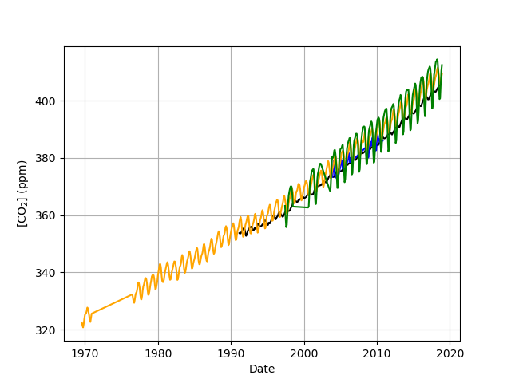

#+options: ':nil *:t -:t ::t <:t H:4 \n:nil ^:nil arch:headline
#+options: author:t broken-links:nil c:nil creator:nil
#+options: d:(not "LOGBOOK") date:t e:t email:nil f:t inline:t num:t
#+options: p:nil pri:nil prop:nil stat:t tags:nil tasks:t tex:t
#+options: timestamp:t title:t toc:t todo:t |:t
#+title: Gestion des données scientifiques
#+author: Christophe Pouzat
#+email: christophe.pouzat@parisdescartes.fr
#+language: fr
#+select_tags: export
#+exclude_tags: noexport
#+creator: Emacs 26.3 (Org mode 9.3.6)
#+LaTeX_CLASS: koma-report-fr
#+LaTeX_HEADER: \renewenvironment{verbatim}{\begin{alltt} \scriptsize \color{Bittersweet} \vspace{0.2cm} }{\vspace{0.2cm} \end{alltt} \normalsize \color{black}}
#+LaTeX_HEADER: \definecolor{lightcolor}{gray}{.55}
#+LaTeX_HEADER: \definecolor{shadecolor}{gray}{.95}
#+PROPERTY: header-args :eval no-export
#+PROPERTY: header-args:python :results pp
#+PROPERTY: header-args:gnuplot :session *gnuplot*
#+STARTUP: indent

#+NAME: org-latex-set-up
#+BEGIN_SRC emacs-lisp :results silent :exports none
;; if "koma-report-fr" is already defined, remove it
(delete (find "koma-report-fr" org-latex-classes :key 'car :test 'equal) org-latex-classes)
;; add "koma-report-fr" to list org-latex-classes
(add-to-list 'org-latex-classes
	     '("koma-report-fr"
	       "\\documentclass[koma,12pt]{scrreprt}
                 \\usepackage[utf8]{inputenc}
		 \\usepackage[french]{babel}
		 \\frenchsetup{og=«, fg=»}
                 \\usepackage{fourier}
                 \\usepackage[usenames,dvipsnames]{xcolor}
                 \\usepackage{graphicx,longtable,url,rotating}
                 \\usepackage{amsmath}
                 \\usepackage{subfig}
                 \\usepackage{minted}
                 \\usepackage{algpseudocode}
                 \\usepackage[round]{natbib}
                 \\usepackage{alltt}
                 [NO-DEFAULT-PACKAGES]
                 [EXTRA]
                 \\usepackage{hyperref}
                 \\hypersetup{colorlinks=true,pagebackref=true,urlcolor=orange}"
                 ("\\chapter{%s}" . "\\chapter*{%s}")
                 ("\\section{%s}" . "\\section*{%s}")
                 ("\\subsection{%s}" . "\\subsection*{%s}")
                 ("\\subsubsection{%s}" . "\\subsubsection*{%s}")
                 ("\\paragraph{%s}" . "\\paragraph*{%s}")
                 ("\\subparagraph{%s}" . "\\subparagraph*{%s}")))
(setq org-latex-listings 'minted)
(setq org-latex-minted-options
      '(("bgcolor" "shadecolor")
	("fontsize" "\\scriptsize")))
(setq org-latex-toc-command "\\tableofcontents\n\\pagebreak\n\n")
(setq org-latex-pdf-process
      '("pdflatex -shell-escape -interaction nonstopmode -output-directory %o %f"
	"biber %b" 
	"pdflatex -shell-escape -interaction nonstopmode -output-directory %o %f" 
	"pdflatex -shell-escape -interaction nonstopmode -output-directory %o %f"))
#+END_SRC

#+NAME: stderr-redirection
#+BEGIN_SRC emacs-lisp :exports none :results silent
;; Redirect stderr output to stdout so that it gets printed correctly (found on
;; http://kitchingroup.cheme.cmu.edu/blog/2015/01/04/Redirecting-stderr-in-org-mode-shell-blocks/
(setq org-babel-default-header-args:sh
      '((:prologue . "exec 2>&1") (:epilogue . ":"))
      )
(setq org-babel-use-quick-and-dirty-noweb-expansion t)
#+END_SRC

#+NAME: set-gnuplot-pars
#+BEGIN_SRC gnuplot :results silent :eval no-export :exports none 
set terminal pngcairo size 1000,1000
#+END_SRC

* FITS : /Flexible Image Transport System/                           :export:
** Intoduction :export:
*** Origne
Inutile de se casser trop la tête ici, il suffit de reprendre l'introduction de l'article =Wikipédia= : [[https://fr.wikipedia.org/wiki/Flexible_Image_Transport_System][Flexible Image Transport System]].

*FITS* ou *Flexible Image Transport System* est le format de fichiers le plus communément utilisé en astronomie. Il sert au stockage, à la transmission et au traitement des images scientifiques et également d'autres disciplines.

Le format de fichiers FITS sert à une grande variété des données non picturales, telles que les spectres électromagnétiques, les listes de photons, des cubes de données, et bien d'autres choses encore. Un fichier FITS peut contenir plusieurs extensions, et chacune de celles-ci peut contenir des données. Par exemple, il est possible de sauvegarder dans le même fichier FITS des images à la fois dans le domaine des rayons X et dans celui de l'infrarouge.

À la différence de beaucoup de formats d'image, le format FITS est conçu spécifiquement pour des données scientifiques et par conséquent inclut beaucoup de dispositifs pour décrire l'information photométrique et spatiale de calibrage, ainsi que les métadonnées de l'origine de l'image.

Un dispositif important du format FITS est que les métadonnées de l'image sont stockées dans un en-tête lisible par un humain, au format ASCII, de sorte qu'un utilisateur intéressé puisse examiner les en-têtes d'un fichier de provenance inconnue. Chaque fichier FITS se compose d'un ou plusieurs en-têtes contenant des « card » ASCII (80 caractères de longueur constante) qui portent des paires de « mots clés / valeurs » (/keyword/ / /value/), intercalées entre les blocs de données. Les paires de mots clés / valeurs fournissent des informations telles que la taille, l'origine, les coordonnées, le format de données binaire, les commentaires en format libre, l'historique des données, et toute autre chose souhaitée par le rédacteur ; tandis que beaucoup de mots-clés sont réservés pour l'usage interne, la norme permet l'utilisation arbitraire du reste.

Pour toute information sur =FITS=, consulter en priorité le site offciel : [[https://fits.gsfc.nasa.gov/][The FITS Support Office]]. =FITS= est avant tout un /format/, pas un logiciel, il existe donc plusieurs bibliothèques de plus ou moins « haut niveau » pour manipuler ou visualiser les fichiers utilisant ce format.

*** Installation

La page [[https://fits.gsfc.nasa.gov/fits_libraries.html#c_cfitsio][FITS I/O Libraries]] contient une liste très complète des bibliothèques disponibles pour la manipulation des fichiers =FITS=, cela va de bibliothèques écrite en =C= accompagnées de programmes à utiliser depuis la ligne de commande, à des « paquets » pour des logiciels de « haut niveau » comme, =Python=, =R=, =Matlab=, etc.

*** Aperçu du format de données =FITS=
=FITS= est le format de données le plus utilisé en astronomie pour l'échange, l'analyse et l'archivage de fichiers de données scientifiques. =FITS= est bien plus qu'un format d'images (comme =JPG= ou =GIF=) et est principalement conçu pour stocker des ensembles de données scientifiques composés de tableaux multidimensionnels (images) et de tableaux bidimensionnels.

**** =HDU=
Un fichier =FITS= est composé de segments appelés /Header\/Data Units/ (=HDU=), où le premier =HDU= est appelée /Primary HDU/, ou /Primary Array/. Le tableau de données primaire peut contenir un « tableau » de dimension allant de 1 à 999,  contentant des nombres entiers codés sur 1 à 4 octets ou de nombres à virgule flottante codés sur 4 ou 8 octets en utilisant les standards /IEEE/. Un tableau primaire typique peut contenir un spectre 1-D, une image 2-D ou un cube de données 3-D.

Un nombre arbitraire d'=HDU= supplémentaires peut suivre le tableau primaire. Ces unités supplémentaires sont appelées /FITS extensions/. Trois types d'extensions standard sont actuellement définis :
- Les extensions d'images (/Image Extensions/) contiennent un tableau de pixels de dimension comprise entre  0 et 999, similaire à un tableau primaire ; l'en-tête commence par =XTENSION = 'IMAGE'=.
- Les extensions de tableaux ASCII (/ASCII Table Extensions/) stockent des informations tabulaires, toutes les informations numériques étant stockées dans des formats ASCII. Bien que les tableaux ASCII soient généralement moins efficaces que les tableaux binaires, ils peuvent être rendus lisibles par l'homme et peuvent stocker des informations numériques avec une taille et une précision essentiellement arbitraires (par exemple, des réels représentés sur 16 octets) ; l'en-tête commence par =XTENSION = 'TABLE'=.
- Les extensions de tableaux binaires (/Binary Table Extensions/) stockent les informations tabulaires dans une représentation binaire. Chaque cellule du tableau peut être elle même un tableau, mais la dimension de ce dernier doit être constante dans une colonne. La norme stricte ne prend en charge que les tableaux unidimensionnels, mais une convention visant à prendre en charge les tableaux multidimensionnels est largement acceptée ; l'en-tête commence par =XTENSION = 'BINTABLE'=.
En plus des structures décrites ci-dessus, il existe un autre type d'=HDU FITS= appelé « Groupes aléatoires » (/Random Groups/)) qui est presque exclusivement utilisé pour des applications en interférométrie radio. Le format des groupes aléatoires ne devrait pas être utilisé pour d'autres types d'applications.

**** Unités d'en-tête (/Header Unit/)
Chaque =HDU= se compose d'une « en-tête » (/Header Unit/) au format ASCII, suivie /ou non/ d'une « unité de données » (/Data unit/) facultative. Chaque en-tête comme chaque unité de données occupe un multiple de 2880 octets. Si nécessaire, l'en-tête ou l'unité de données est complétée à la longueur requise par des blancs ASCII ou des =NULL= selon le type d'unité.

Chaque unité d'en-tête contient une séquence d'entrées de 80 caractères de long qui ont la forme générale suivante :

#+begin_example
MOT-CLÉ = chaîne de valeur / commentaire
#+end_example

Les noms de mots-clés peuvent comporter jusqu'à 8 caractères et ne peuvent contenir que les lettres majuscules A à Z, les chiffres 0 à 9, le trait d'union, « - » et le caractère de soulignement, « _ ». Le nom du mot-clé est (généralement) suivi d'un signe égal et d'une espace dans les colonnes 9 et 10 de l'entrée, suivi de la valeur du mot-clé qui peut être soit un entier, un nombre à virgule flottante, une valeur complexe (c'est-à-dire une paire de chiffres), une chaîne de caractères (entre guillemets simples, « ' ») ou une valeur booléenne (la lettre T ou F). Certains mots clés (par exemple, =COMMENT= et =HISTORY=) ne sont pas suivis d'un signe égal et, dans ce cas, les colonnes 9 à 80 de l'enregistrement peuvent contenir n'importe quelle chaîne de texte ASCII.

Chaque unité d'en-tête commence par une série de mots-clés /obligatoires/ qui précisent la taille et le format de l'unité de données suivante. Par exemple, un en-tête de tableau primaire d'image en deux dimensions commence par les mots clés suivants :

#+begin_example
SIMPLE  =                    T / file conforms to FITS standard
BITPIX  =                   16 / number of bits per data pixel
NAXIS   =                    2 / number of data axes
NAXIS1  =                  440 / length of data axis 1
NAXIS2  =                  300 / length of data axis 2
#+end_example

Les mots-clés requis peuvent être suivis d'autres mots-clés facultatifs pour décrire divers aspects des données, tels que la date et l'heure de l'observation. Les mots-clés =COMMENT= ou =HISTORY= sont également fréquemment ajoutés pour documenter davantage le contenu du fichier de données.

Le dernier mot-clé de l'en-tête est toujours le mot-clé END « suivit » de champs de valeur et de commentaire vides. L'en-tête est  si nécessaire complété par des entrées vierges supplémentaires, afin d'avvoir une taille multiple de 2880 octets (équivalent à 36 mots-clés de 80 octets). Notez que l'unité d'en-tête ne peut contenir que des [[https://fr.wikipedia.org/wiki/American_Standard_Code_for_Information_Interchange#Table_des_128_caract%C3%A8res_ASCII][caractères de texte ASCII]] allant de l'hexadécimal 20 à 7E) ; les caractères ASCII non imprimables tels que les tabulations, les retours chariot ou les sauts de ligne ne sont pas autorisés dans l'unité d'en-tête.

**** Unités de données (/Data Unit/)
L'unité de données, si elle est présente, suit immédiatement le dernier bloc de 2880 octets de l'unité d'en-tête. Remarquez bien que l'unité de données n'est pas nécessaire, de sorte que certaines =HDU= ne contiennent que l'unité d'en-tête.

Les pixels d'un tableau primaire ou d'une extension image doivent avoir l'un des 5 types suivants :

- Octets entiers de 8 bits (non signés)
- Entiers de 16 bits (signés)
- Entiers 32 bits (signés)
- Nombres réels à virgule flottante de 32 bits (simple précision)
- Nombres réels en virgule flottante à double précision de 64 bits.

Un type de données entier de 64 bits a également été proposé et est actuellement utilisé à titre expérimental.

(Traduction de [[https://fits.gsfc.nasa.gov/fits_primer.html][A Primer on the FITS Data Format]]).

**** Remarques
Certains trouveront probablement surannées les contraintes sur la longueur de l'en-tête (un multiple de 2880 octets) ou sur la position de la valeur dans la combinaison mot-clé / valeur (de la colonne 9 à la colonne 80) ; ils auront raison, elles constituent effectivement une trace du passé : =FITS= a commencé à être conçu à une époque où le [[https://fr.wikipedia.org/wiki/Fortran][Fortran 77]] était le langage dominant en calcul scientifique. Mais ils pourront aussi méditer sur le fait que certains langages modernes imposent dans leur syntaxe des éléments -- règles d'indentation (rappelant le début du code en colonne 7 du Fortran 77) -- destinés à faciliter la lecture des codes ; un problème qui, pour certains au moins, relève de l'éditeur (je sais, je vais me faire des ennemis !).
   
** Exemple avec Python                                              :export:
J'ai choisi ici un exemple « un peu tordu » où les données seront stockées sous forme de tableaux ASCII avec des colonnes de types différents. Ce choix est motivé par plusieurs considérations :
- il est typiquement très simple de trouver des exemples / didacticiels illustrant le cas des images (/Image Extensions/) -- objets multidimensionnels dont les éléments sont tous du même type -- ;
- en générant des tableaux ASCII nous aboutissons à un fichier =FITS= entièrement lisibles avec n'importe quel éditeur de texte (ce qui ne signifie pas la lecture du fichier sera aisée ou, encore moins, plaisante !) ;
- les tableaux =FITS=, parce-qu'ils autorisent des colonnes dont les éléments ont des types différents -- plus précisément, le type est homogène à l'intérieur une colonne donnée, mais peut changer d'une colonne à l'autre --, permettent de stocker facilement des données très fréquemment rencontrées en pratique (les utilisateurs de =R= penserons immédiatement aux =data.frame= de ce langage), mais nous verrons que stocker ce type de données avec =HDF5= est un peu plus « acrobatique ».
  
*** Le module =astropy=
Le module recommandé pour la manipulation des fichiers =FITS= est : [[https://docs.astropy.org/en/stable/io/fits/][astropy]]. Il faut donc l'installer, par exemple, sur ma machine (un PC avec [[https://manjaro.org/][majaro]]):

#+NAME: installation-astropy
#+begin_src shell 
pip3 install astropy --user
#+end_src

La [[http://docs.astropy.org/en/stable/index.html][documentation]] d'=astropy= est très complète et nous allons ici nous concentrer sur le sous-module =astropy.io.fits= qui dispose aussi d'une [[http://docs.astropy.org/en/stable/io/fits/index.html][documentation]] précise. Nous allons récupérer (une nouvelle fois pour certains) les données de la [[https://fr.wikipedia.org/wiki/Courbe_de_Keeling][courbe de Keeling]] -- ainsi que d'autres mesures similaires, mais effectuées en d'autres lieux -- et les écrire avec leur méta-données dans un fichier =FITS= que nous allons créer. Il y a plusieurs sources pour ces données et nous allons utiliser celles hébergées au [[https://www.esrl.noaa.gov/gmd/][Earth System Research Laboratory]], nous aurons ainsi accès à plusieurs jeux de données dans un format standardisé.

*** Récupération des données  

Nous utilisons le module [[https://docs.python.org/3/library/urllib.request.html][urllib.request]] de la bibliothèque standard pour aller chercher à l'adresse =ftp://aftp.cmdl.noaa.gov/data/trace_gases/co2/flask/surface/= les fichiers:
- =co2_mlo_surface-flask_1_ccgg_month.txt= (mesures effectuées à l'observatoire de Mauna Lao de Hawaï, ce sont les données de Keeling) ;
- =co2_crz_surface-flask_1_ccgg_month.txt= (mesures effectuées dans l'archipel de Crozet, dans l'hémisphère sud) ;
- =co2_mkn_surface-flask_1_ccgg_month.txt= (mesures effectuées au Mont Kenya, c'est-à-dire au niveau de l'équateur) ;
- =co2_sum_surface-flask_1_ccgg_month.txt= (mesures effectuées au Groenland).
Ces fichiers contiennent des moyennes mensuelles exprimées en [[https://fr.wikipedia.org/wiki/Partie_par_million][partie par million]] (ppm).

#+NAME: récupération-des-données
#+begin_src python :session *FITS* :exports code :results silent
from urllib.request import urlretrieve
mon_url = "ftp://aftp.cmdl.noaa.gov/data/trace_gases/co2/flask/surface/"
mes_id = ["mlo","crz","mkn","sum"]
prefix = "co2_"
terminaison = "_surface-flask_1_ccgg_month.txt"
for id in mes_id:
    src = mon_url+prefix+id+terminaison
    dst = prefix+id+terminaison
    urlretrieve(src, dst)

#+end_src

Avec la fonction =listdir= du module [[https://docs.python.org/3/library/os.html][os]], nous pouvons vérifier que les fichiers sont bien à présent sur notre disque :

#+NAME:vérifie-présence-fichiers-téléchargés
#+begin_src python :session *FITS* :exports both
from os import listdir
all([prefix+id+terminaison in listdir() for id in mes_id])
#+end_src

#+RESULTS: vérifie-présence-fichiers-téléchargés
: True

*** Écriture des données dans un fichier =FITS=

Nous allons illustrer les fonctionnalités les moins « accessibles » dans la documentation du module =astropy= en enregistrant les données sous forme de tableaux ASCII. 

**** =HDU= primaire
Comme un tableau ASCII ne peut constituer la partie données d'une =HDU= primaire, nous allons construire celle-ci, dont la présence est obligatoire, comme une =HDU= sans données, c'est-à-dire avec seulement des méta-données. Ces méta-données vont être une copie du début -- celle qui est commune à tous -- de l'en-tête des fichiers que nous venons de récupérer. Comme ces fichiers sont des fichiers textes, il vous sera facile avec votre éditeur de texte préféré de les ouvrir et d'identifier cette partie commune (les commandes utilisées ici sont décrites en section [[http://docs.astropy.org/en/stable/io/fits/index.html#creating-a-file-with-multiple-extensions][Creating a File with Multiple Extensions]] de la documentation).

#+NAME: écriture-HDU-primaire
#+begin_src python :session *FITS* :exports code :results silent
from astropy.io import fits
hdr = fits.Header()
hdr['ORIGIN'] = "Earth System Research Laboratory (https://www.esrl.noaa.gov/gmd/)"
hdr['CONTACT'] = 'Ed Dlugokencky'
hdr['PHONE'] = '(303) 497-6228'
hdr['EMAIL'] = 'Ed.Dlugokencky@noaa.gov'
hdr['COMMENT'] = " ************ USE OF ESRL GMD DATA ****************"
hdr['COMMENT'] = " " 
hdr['COMMENT'] = "These data are made freely available to the public and the"
hdr['COMMENT'] = "scientific community in the belief that their wide dissemination"
hdr['COMMENT'] = "will lead to greater understanding and new scientific insights."
hdr['COMMENT'] = "The availability of these data does not constitute publication"
hdr['COMMENT'] = "of the data.  NOAA relies on the ethics and integrity of the user to"
hdr['COMMENT'] = "ensure that ESRL receives fair credit for their work.  If the data"
hdr['COMMENT'] = "are obtained for potential use in a publication or presentation," 
hdr['COMMENT'] = "ESRL should be informed at the outset of the nature of this work."  
hdr['COMMENT'] = "If the ESRL data are essential to the work, or if an important" 
hdr['COMMENT'] = "result or conclusion depends on the ESRL data, co-authorship"
hdr['COMMENT'] = "may be appropriate.  This should be discussed at an early stage in"
hdr['COMMENT'] = "the work.  Manuscripts using the ESRL data should be sent to ESRL"
hdr['COMMENT'] = "for review before they are submitted for publication so we can"
hdr['COMMENT'] = "ensure that the quality and limitations of the data are accurately"
hdr['COMMENT'] = "represented."
hdr['COMMENT'] = " "
hdr['COMMENT'] = "Every effort is made to produce the most accurate and precise"
hdr['COMMENT'] = "measurements possible.  However, we reserve the right to make"
hdr['COMMENT'] = "corrections to the data based on recalibration of standard gases"
hdr['COMMENT'] = "or for other reasons deemed scientifically justified."
hdr['COMMENT'] = " "
hdr['COMMENT'] = "We are not responsible for results and conclusions based on use"
hdr['COMMENT'] = "of these data without regard to this warning."
empty_primary = fits.PrimaryHDU(header=hdr)
#+end_src 

Nous avons utilisé ici des mots-clés « non-standards », =CONTACT=, =PHONE=, =EMAIL=, ce que nous sommes libres de faire tant que nous respectons la contrainte des 8 caractères (maximum) majuscules. Une [[https://fits.gsfc.nasa.gov/fits_dictionary.html][liste]] des mots-clés standards -- très orientée vers l'astrophysique -- est disponible. L'objet =hdr= se comporte un peu comme un [[https://docs.python.org/3/library/stdtypes.html#mapping-types-dict][dictionnaire]] =Python= et on peut obtenir la valeur associée à un mot-clé en faisant par exemple :

#+NAME: valeur-mot-clé-hdr
#+begin_src python :session *FITS* :exports both
hdr.get('PHONE')
#+end_src

#+RESULTS: valeur-mot-clé-hdr
: '(303) 497-6228'

**** Les données de l'archipel de Crozet

Nous allons maintenant lire les données contenues dans nos quatre fichiers, en commençant par celui de l'archipel de Crozet) :

#+NAME: lecture-des-données-crz
#+begin_src python :session *FITS* :results silent
dates = []
co2 = []
for line in open('co2_crz_surface-flask_1_ccgg_month.txt'):
    elts = line.split()
    if elts[0] == "CRZ":
        mois = elts[2]
        if len(mois) == 1:
            mois = '0'+mois
            
        dates.append(elts[1]+"-"+mois)
        co2.append(float(elts[3]))

#+end_src 

Une fois les données dans les deux listes =dates= et =co2=, nous convertissons ces dernières en =array= du module =numpy= (qu'il nous faut donc importer) puis nous utilisons le constructeur =Column= (cette procédure très « pas à pas » est décrite dans la section [[http://docs.astropy.org/en/stable/io/fits/usage/unfamiliar.html#creating-ascii-table][Creating an ASCII Table]] de la documentation ; c'est là que vous pourrez trouver des détails sur les valeurs permises pour le paramètre =format= et leurs significations) :

#+NAME: génération-des-colonnes-du-tableau 
#+begin_src python :session *FITS* :exports code :results silent
import numpy as np
a1 = np.array(dates)
a2 = np.array(co2)
col1 = fits.Column(name='Date',format='A8',array=a1,ascii=True)
col2 = fits.Column(name='CO2',format='F6.2',array=a2,ascii=True)
#+end_src

Nous poursuivons en définissant une en-tête spécifique pour notre nouvelle =HDU= :

#+NAME: en-tête-du-tableau-crozet
#+begin_src python :session *FITS* :exports code :resutls silent
crz_hdr = fits.Header()
crz_hdr['NAME'] = 'CRZ'
crz_hdr['SOURCE'] = 'Centre des Faibles Radioactivities/TAAF [LSCE]'
crz_hdr['URL'] = 'www.lsce.cea.fr'
#+end_src

#+RESULTS: en-tête-du-tableau-crozet
: 'org_babel_python_eoe'

Nous concluons en créant le tableau ASCII et nous appelons la méthode =data= de ce dernier pour vérifier que notre tableau contient bien les données de départ (nous utilisons également la méthode [[http://docs.astropy.org/en/stable/io/fits/api/tables.html#tablehdu][add_checksum]] de l'objet =HDU= que nous créons ce qui rajoute deux paires mot-clé / valeur à l'en-tête) : 

#+NAME: crozet-HDU
#+begin_src python :session *FITS* :exports both
crz_hdu = fits.TableHDU.from_columns([col1,col2],header=crz_hdr)
crz_hdu.add_checksum()
crz_hdu.data[:10]
#+end_src

#+RESULTS: crozet-HDU
: FITS_rec([('1991-03', 353.72), ('1991-04', 353.87), ('1991-05', 353.58),
:           ('1991-06', 353.91), ('1991-07', 354.34), ('1991-08', 354.73),
:           ('1991-09', 355.3), ('1991-10', 355.25), ('1991-11', 355.21),
:           ('1991-12', 354.79)],
:          dtype=(numpy.record, [('Date', 'S8'), ('CO2', 'S6')]))

Il nous reste à répéter la procédure pour les trois autres jeux de données.

**** Les données du Mont Kenya

#+NAME: mkn-HDU
#+begin_src python :session *FITS* :exports both
dates = []
co2 = []
for line in open('co2_mkn_surface-flask_1_ccgg_month.txt'):
    elts = line.split()
    if elts[0] == "MKN":
        mois = elts[2]
        if len(mois) == 1:
            mois = '0'+mois
            
        dates.append(elts[1]+"-"+mois)
        co2.append(float(elts[3]))
a1 = np.array(dates)
a2 = np.array(co2)
col1 = fits.Column(name='Date',format='A8',array=a1,ascii=True)
col2 = fits.Column(name='CO2',format='F6.2',array=a2,ascii=True)
mkn_hdr = fits.Header()
mkn_hdr['NAME'] = 'MKN'
mkn_hdr['SOURCE'] = 'Kenya Meteorological Department [KMD]'
mkn_hdu = fits.TableHDU.from_columns([col1,col2],header=mkn_hdr)
mkn_hdu.add_checksum()
mkn_hdu.data[:10]
#+end_src

#+RESULTS: mkn-HDU
: FITS_rec([('2003-12', 373.33), ('2004-01', 376.03), ('2004-02', 378.95),
:           ('2004-03', 376.84), ('2004-04', 373.83), ('2004-05', 374.09),
:           ('2004-06', 373.07), ('2004-07', 373.27), ('2004-08', 374.47),
:           ('2004-09', 374.35)],
:          dtype=(numpy.record, [('Date', 'S8'), ('CO2', 'S6')]))

**** Les données de l'observatoire de Mauna Lao (Hawaï)

#+NAME: mlo-HDU
#+begin_src python :session *FITS* :exports both
dates = []
co2 = []
for line in open('co2_mlo_surface-flask_1_ccgg_month.txt'):
    elts = line.split()
    if elts[0] == "MLO":
        mois = elts[2]
        if len(mois) == 1:
            mois = '0'+mois
            
        dates.append(elts[1]+"-"+mois)
        co2.append(float(elts[3]))
a1 = np.array(dates)
a2 = np.array(co2)
col1 = fits.Column(name='Date',format='A8',array=a1,ascii=True)
col2 = fits.Column(name='CO2',format='F6.2',array=a2,ascii=True)
mlo_hdr = fits.Header()
mlo_hdr['NAME'] = 'MLO'
mlo_hdr['SOURCE'] = 'NOAA Earth System Research Laboratory, Global'
mlo_hdr['SOURCE'] = 'Monitoring Division [NOAA ESRL GMD]'
mlo_hdr['URL'] = 'http://www.esrl.noaa.gov/gmd'
mlo_hdu = fits.TableHDU.from_columns([col1,col2],header=mlo_hdr)
mlo_hdu.add_checksum()
mlo_hdu.data[:10]
#+end_src

#+RESULTS: mlo-HDU
: FITS_rec([('1969-08', 322.51), ('1969-09', 321.36), ('1969-10', 320.74),
:           ('1969-11', 321.98), ('1969-12', 323.78), ('1970-01', 325.13),
:           ('1970-02', 325.54), ('1970-03', 325.67), ('1970-04', 326.58),
:           ('1970-05', 327.69)],
:          dtype=(numpy.record, [('Date', 'S8'), ('CO2', 'S6')]))

**** Les données du Groenland

#+NAME: sum-HDU
#+begin_src python :session *FITS* :exports both
dates = []
co2 = []
for line in open('co2_sum_surface-flask_1_ccgg_month.txt'):
    elts = line.split()
    if elts[0] == "SUM":
        mois = elts[2]
        if len(mois) == 1:
            mois = '0'+mois
            
        dates.append(elts[1]+"-"+mois)
        co2.append(float(elts[3]))
a1 = np.array(dates)
a2 = np.array(co2)
col1 = fits.Column(name='Date',format='A8',array=a1,ascii=True)
col2 = fits.Column(name='CO2',format='F6.2',array=a2,ascii=True)
sum_hdr = fits.Header()
sum_hdr['NAME'] = 'SUM'
sum_hdr['SOURCE'] = 'National Science Foundation Office of Polar'
sum_hdr['SOURCE'] = 'Programs [NSF]'
sum_hdr['URL'] = 'http://www.nsf.gov/dir/index.jsp?org=OPP'
sum_hdu = fits.TableHDU.from_columns([col1,col2],header=sum_hdr)
sum_hdu.add_checksum()
sum_hdu.data[:10]
#+end_src

#+RESULTS: sum-HDU
: FITS_rec([('1997-06', 363.22), ('1997-07', 359.14), ('1997-08', 355.79),
:           ('1997-09', 356.58), ('1997-10', 360.47), ('1997-11', 364.15),
:           ('1997-12', 366.71), ('1998-01', 368.04), ('1998-02', 369.1),
:           ('1998-03', 369.87)],
:          dtype=(numpy.record, [('Date', 'S8'), ('CO2', 'S6')]))

**** L'écriture sur le disque
Nous terminons en utilisant le constructeur =HDUList= avant d'écrire notre fichier au disque :

#+NAME: fin-de-la-construction-FITS
#+begin_src python :session *FITS* :results silent
hdul = fits.HDUList([empty_primary,crz_hdu,mkn_hdu,mlo_hdu,sum_hdu])
hdul.writeto('co2.fits')
#+end_src

*** Lecture et utilisation des données stockées dans un fichier =FITS=

Maintenant que nous avons un fichier =FITS=, nous allons l'ouvrir et « regarder ce qu'il y a dedans », en commençant par appeler la méthode =info= sur un « pointeur » sur un fichier =FITS= (voir la section [[http://docs.astropy.org/en/stable/io/fits/index.html#opening-a-fits-file][Opening a FITS File]] de la documentation):

#+NAME: info-sur-co2
#+begin_src python :session *FITS* :results output :exports both
with fits.open('co2.fits') as co2l:
    co2l.info()

#+end_src 

#+RESULTS: info-sur-co2
: Filename: co2.fits
: No.    Name      Ver    Type      Cards   Dimensions   Format
:   0  PRIMARY       1 PrimaryHDU      33   ()      
:   1                1 TableHDU        19   318R x 2C   [A7, F6.2]   
:   2                1 TableHDU        18   53R x 2C   [A7, F6.2]   
:   3                1 TableHDU        19   527R x 2C   [A7, F6.2]   
:   4                1 TableHDU        19   221R x 2C   [A7, F6.2]

Nous retrouvons bien une =HDU= primaire « vide » suivie de 4 =HDU= de type =TableHDU=. Remarquez que les =HDU= sont numérotées à partir de 0, pas de 1.

Nous continuons en examinant le contenu de l'en-tête de l'=HDU= primaire (voir la section [[http://docs.astropy.org/en/stable/io/fits/index.html#working-with-fits-headers][Working with FITS Headers]] de la documentation) :

#+NAME: contenu-en-tête-primaire
#+begin_src python :session *FITS* :exports both
co2l = fits.open('co2.fits')
co2l[0].header
#+end_src

#+RESULTS: contenu-en-tête-primaire
#+begin_example
SIMPLE  =                    T / conforms to FITS standard                      
BITPIX  =                    8 / array data type                                
NAXIS   =                    0 / number of array dimensions                     
EXTEND  =                    T                                                  
ORIGIN  = 'Earth System Research Laboratory (https://www.esrl.noaa.gov/gmd/)'   
CONTACT = 'Ed Dlugokencky'                                                      
PHONE   = '(303) 497-6228'                                                      
EMAIL   = 'Ed.Dlugokencky@noaa.gov'                                             
COMMENT  ************ USE OF ESRL GMD DATA ****************                     
COMMENT                                                                         
COMMENT These data are made freely available to the public and the              
COMMENT scientific community in the belief that their wide dissemination        
COMMENT will lead to greater understanding and new scientific insights.         
COMMENT The availability of these data does not constitute publication          
COMMENT of the data.  NOAA relies on the ethics and integrity of the user to    
COMMENT ensure that ESRL receives fair credit for their work.  If the data      
COMMENT are obtained for potential use in a publication or presentation,        
COMMENT ESRL should be informed at the outset of the nature of this work.       
COMMENT If the ESRL data are essential to the work, or if an important          
COMMENT result or conclusion depends on the ESRL data, co-authorship            
COMMENT may be appropriate.  This should be discussed at an early stage in      
COMMENT the work.  Manuscripts using the ESRL data should be sent to ESRL       
COMMENT for review before they are submitted for publication so we can          
COMMENT ensure that the quality and limitations of the data are accurately      
COMMENT represented.                                                            
COMMENT                                                                         
COMMENT Every effort is made to produce the most accurate and precise           
COMMENT measurements possible.  However, we reserve the right to make           
COMMENT corrections to the data based on recalibration of standard gases        
COMMENT or for other reasons deemed scientifically justified.                   
COMMENT                                                                         
COMMENT We are not responsible for results and conclusions based on use         
COMMENT of these data without regard to this warning.                           
#+end_example

Le contenu de l'en-tête du premier tableau est :

#+NAME: contenu-en-tête-tableau-1
#+begin_src python :session *FITS* :exports both
co2l[1].header
#+end_src

#+RESULTS: contenu-en-tête-tableau-1
#+begin_example
XTENSION= 'TABLE   '           / ASCII table extension                          
BITPIX  =                    8 / array data type                                
NAXIS   =                    2 / number of array dimensions                     
NAXIS1  =                   14 / length of dimension 1                          
NAXIS2  =                  318 / length of dimension 2                          
PCOUNT  =                    0 / number of group parameters                     
GCOUNT  =                    1 / number of groups                               
TFIELDS =                    2 / number of table fields                         
NAME    = 'CRZ     '                                                            
SOURCE  = 'Centre des Faibles Radioactivities/TAAF [LSCE]'                      
URL     = 'www.lsce.cea.fr'                                                     
TTYPE1  = 'Date    '                                                            
TFORM1  = 'A8      '                                                            
TBCOL1  =                    1                                                  
TTYPE2  = 'CO2     '                                                            
TFORM2  = 'F6.2    '                                                            
TBCOL2  =                    9                                                  
CHECKSUM= 'LYf7MXZ5LXd5LXZ5'   / HDU checksum updated 2020-03-11T15:51:38       
DATASUM = '327240840'          / data unit checksum updated 2020-03-11T15:51:38 
#+end_example

Par défaut, =open= utilise une « memory map » (tout le fichier n'est pas chargé en =RAM= seulement la partie sur laquelle travaille le code à un moment donné et cela de façon transparente pour l'utilisateur), il est ainsi possible de travailler avec des fichiers beaucoup plus gros que la =RAM= de la machine sans passer son temps à « swaper » (sur les machines Unix/Linux en tout cas).

Nous allons maintenant générer un graphe avec la concentration mensuelle moyenne de CO$_2$ en fonction de la date pour chacun des quatre sites contenus dans notre fichier =FITS=. Pour cela nous allons devoir accéder aux différentes colonnes de nos tableaux de données, ce qui est fait en appelant la méthode =field= sur l'attribut =data= de chaque =HDU= (comme les colonnes d'un tableau ne sont pas forcément du même type, les matrices =numpy= ne conviennent et les tableaux sont des collections de vecteurs =numpy= ayant tous le même nombre d'éléments). 

#+NAME: CO2-en-fonction-du-temps-à-4-sites
#+HEADERS: :results file
#+begin_src python :session *FITS* :exports both
import matplotlib.pyplot as plt
import matplotlib.dates as mdates
from datetime import datetime

couleurs = ['black','blue','orange','green']
for idx in range(1,5):
    dates = [datetime.strptime(d, "%Y-%m") for d in co2l[idx].data.field(0)]
    co2 = co2l[idx].data.field(1)
    plt.plot(dates,co2,color=couleurs[idx-1])
plt.grid()
plt.xlabel('Date')
plt.ylabel(r'[CO$_2$] (ppm)')
plt.savefig('CO2_en_fonction_du_temps_a_4_sites.png')
plt.close()
'CO2_en_fonction_du_temps_a_4_sites.png'
#+end_src

#+CAPTION:\label{fig:CO2-en-fonction-du-temps-à-4-sites}En noir, archipel de Crozet ; en bleu, le Mont Kenya ; en orange l'observatoire de Mauna Lao de Hawaï ; en vert, le Groenland. 
#+ATTR_LATEX: :width 1.0\textwidth :float nil
#+RESULTS: CO2-en-fonction-du-temps-à-4-sites

*** Remarque
Il est possible, dans un fichier =FITS=, de travailler avec des images comprimées, comme décrit dans la section [[http://docs.astropy.org/en/stable/io/fits/usage/unfamiliar.html#compressed-image-data][Compressed Image Data]] de la documentation d'=astropy=.

* HDF : /Hierarchical Data Format/ :export:

** Introduction
Une fois encore, laissons [[https://fr.wikipedia.org/wiki/Hierarchical_Data_Format][Wikipédia]] parler.

Le /Hierarchical Data Format/ (=HDF=) est un ensemble de formats de fichiers permettant de sauvegarder et de structurer des fichiers contenant de très grandes quantités de données. Un fichier =HDF= est un conteneur de fichiers.
Les premiers formats =HDF= ont été développés au [[https://fr.wikipedia.org/wiki/National_Center_for_Supercomputing_Applications][National Center for Supercomputing Applications]], avant d'être développés par le =HDF= Group.
=HDF= désigne à la fois le format et l'ensemble composé des bibliothèques, des outils (dont l'outil de navigation et de manipulation =HDFView=) et des jeux de test.
Les caractéristiques des formats =HDF=, ainsi que les bibliothèques pour les utiliser et les outils associés sont disponibles en licence libre (=BSD=). =HDF= est supporté par de nombreux langages : =Java=, =MATLAB=, =IDL=, =R= et =Python=.

** =HDF5=
Le =HDF5= améliore le =HDF4=. Il simplifie la structure des fichiers pour proposer seulement deux types d'objets :
- les ensembles de données (/datasets/), qui sont des tableaux multidimensionnels contenant des données d'*un même type* (pré-défini ou dérivé) ;
- les groupes (/groups/), qui contiennent, ou regroupent, des ensembles de données et d'autres groupes.
L'utilisateur peut aussi définir une structure d'attribut pour ajouter des informations (des /méta-données/) sur chaque objet.

Cette structuration en ensembles de données et groupes donne aux fichiers =HDF5= une structure hiérarchique (en l'occurrence arborescente), un peu comme un système de fichiers. Cette analogie avec un système de fichiers est aussi présente dans les conventions de nommage des objets du fichiers : le nom complet d'un objet du fichier HDF5 est construit comme un chemin dans un système de fichiers (=/chemin/vers/le/fichier=).

Le [[https://www.hdfgroup.org/][site officiel]] présente les points forts d'=HDF5= de la façon suivante :
- données hétérogènes :: =HDF5= prend en charge des jeux de données n-dimensionnelles où chaque élément d'un jeu de données peut être lui-même un objet complexe ;
- dissémination simple :: =HDF5= est portable, sans verrouillage propriétaire, et est un format de fichier auto-descriptif, ce qui signifie que toutes les données et méta-données peuvent être transmises dans un seul fichier ;
- indépendance vis-à-vis de l'environnement matériel et logiciel :: =HDF5= est une bibliothèque logicielle qui fonctionne sur une série de plates-formes de calcul, des ordinateurs portables aux systèmes massivement parallèles, et met en œuvre une API de haut niveau avec des interfaces =C=, =C++=, =Fortran 90= et =Java=. =HDF5= dispose d'un vaste écosystème avec plus de 700 projets =Github= ;
- opérations d'entrée - sortie rapides :: =HDF5= offre des entrées - sorties de haute performance ainsi qu'un riche ensemble de fonctionnalités qui permettent d'optimiser le temps d'accès et l'espace de stockage ;
- « grosses données » (/big data/) :: il n'y a pas de limite au nombre ou à la taille des objets, ce qui donne une grande flexibilité pour les données de grande taille ;
- association de méta-données aux données :: =HDF5= vous permet de conserver les méta-données avec les données, ce qui simplifie l'utilisation des données et qui constitue un gage de pérennité..

Contrairement au format =FITS=, le format =HDF5= n'impose de fait aucune contrainte sur le type des données stockées. Cette caractéristique ainsi que la nature hiérarchique des fichiers font que la structure d'un fichier =HDF5= est beaucoup plus complexe que celle d'un fichier =FITS=. Cela explique pourquoi vous ne trouverez pas ici un section similaire à la section [[Aperçu du format de données =FITS=]] précédente ; pour plus de détails, il vous faudra consulter les sections [[https://portal.hdfgroup.org/display/HDF5/Introduction+to+HDF5][Introduction to HDF5]] puis [[https://portal.hdfgroup.org/display/HDF5/Design+Specifications][Design Specifications]] de la documentation officielle --  je vous préviens, cette dernière n'est pas très « digeste » ! La complexité du format explique aussi pourquoi il n'y a qu'une bibliothèque de « bas niveau » disponible pour manipuler ces fichiers -- toute les interfaces de haut niveau appellent cette bibliothèque --, ce qui génère une bonne partie des critiques dirigées contre ce format.
  
** Exemple avec =Python=
Nous allons reprendre le jeu de données précédent que nous avions stocké sous forme de fichier =FITS= pour le « convertir » en un fichier =HDF5=. Là encore, les didactiels (comme le [[http://docs.h5py.org/en/latest/quick.html][Quick Start Guide]] d'=h5py=) expliquent simplement comment écrire et lire des objets correspondant aux tableaux n-dimensionnels (/arrays/) de =numpy= et nous allons passer un peu plus de temps à effectuer des tâches un peu moins bien documentées.  

*** Les modules =h5py= et =PyTables=
Les deux principaux modules permettant la manipulation de fichiers au format =HDF5= avec =Python= sont [[http://www.h5py.org/][h5py]] et [[http://www.h5py.org/][PyTables]]. Ils sont tous les deux bien documentés et n'ont que peu de dépendances : =numpy= pour les deux et =numexpr= en plus pour =PyTables=. Le module le plus « indiqué » pour le type de données que nous avons considérées dans l'exemple précédent -- des tableaux non homogènes -- est =PyTables= qui semble avoir été conçu en priorité pour cela -- voir le [[http://www.pytables.org/usersguide/tutorials.html][didacticiel]] (en anglais) --, mais comme la conception de =h5py= « reflète plus fidèlement » celle du format =HDF5=, nous allons utiliser ici =h5py=.
 
*** Le problème des données non homogènes stockées avec =HDF5=

Comme indiqué plus haut, l'accent mis sur l'efficacité, tant au niveau du stockage des données que des opérations entrée-sortie, a amené les concepteurs du format à n'autoriser que des « tableaux » -- ici, tableaux doit être entendu au sens large, il s'agit de tableaux n-dimensionnels (/array/ en anglais) -- dont tous les éléments sont de même type. Nous avons alors au moins deux approches pour stocker nos données précédentes où une colonne contenait des chaînes de caractères de longueur fixe et l'autre des « réels » avec une précision du dixième :
- nous pouvons associé un =groupe= à chacune de nos tables précédentes et écrire dans chaque groupe deux vecteurs (tableaux unidimensionnels, le premier dont les éléments sont des chaînes de caractères de longueur fixe, le second dont les éléments sont des flottants -- nous qualifierons cette approche de « simple » dans la suite -- ;
- comme =HDF5= nous laisse définir nos types, nous pouvons construire un nouveau type fait de deux composantes, une chaîne de caractères de longueur fixe et un flottant et représenter nos tableaux comme des vecteurs dont chaque élément à ce nouveau type -- nous qualifierons cette approche de « sophistiquée » dans la suite.
Comme nous avons une entière liberté sur le nombre de groupes constitutifs d'un fichier =HDF5=, nous allons mettre en œuvre les deux approches qui correspondront à deux groupes : le groupe =deux_vecteurs= et le groupe =nouveau_type=.

*** L'approche « simple » ou =deux_vecteurs=

**** Récupération des données
Nous supposons que vous avez installé =h5py= « avec la procédure habituelle » et nous commençons ici par charger le sous-module =FITS= pour pouvoir lire nos données précédentes:

#+NAME: ouverture-du-fichier-FITS
#+begin_src python :session *HDF5* :results silent
from astropy.io import fits
co2_fits = fits.open('co2.fits')
#+end_src 

Nous allons avoir besoin de vecteurs =numpy= comme intermédiaires lors de notre passage d'un format de fichier à l'autre, nous chargeons donc aussi ce module et nous lisons dans deux vecteurs distinct les dates et les concentration mensuelles moyennes de CO$_2$ en commençant par le plus petit jeu de données (pour ne pas avoir de sorties trop grosses à imprimer), celui du Mont Kenya :

#+NAME: charge-données-du-Mont-Kenya
#+begin_src python :session *HDF5* :exports both
import numpy as np
dates = co2_fits[2].data.field(0)
co2 = co2_fits[2].data.field(1)
dates
#+end_src

#+RESULTS: charge-données-du-Mont-Kenya
#+begin_example
chararray(['2003-12', '2004-01', '2004-02', '2004-03', '2004-04',
           '2004-05', '2004-06', '2004-07', '2004-08', '2004-09',
           '2004-10', '2005-02', '2005-03', '2005-04', '2005-05',
           '2005-06', '2005-07', '2005-08', '2005-12', '2006-01',
           '2006-02', '2006-03', '2006-04', '2006-05', '2006-06',
           '2006-07', '2008-09', '2008-10', '2008-11', '2008-12',
           '2009-01', '2009-02', '2009-03', '2009-04', '2009-05',
           '2009-06', '2009-07', '2009-08', '2009-09', '2009-10',
           '2009-11', '2009-12', '2010-01', '2010-02', '2010-03',
           '2010-04', '2010-05', '2010-06', '2010-07', '2010-08',
           '2010-09', '2010-10', '2010-11'], dtype='<U8')
#+end_example

**** Le problème des données type vecteur de chaînes de caractères
Ici, nous voyons que l'identifiant =dates= correspond à un [[https://docs.scipy.org/doc/numpy/reference/generated/numpy.chararray.html?highlight=chararray#numpy.chararray][chararray]] de =numpy= dont les éléments sont de type =<U8=. Mais la documentation de =numpy= recommande d'utiliser des =array= avec un =dtype= adéquats plutôt que des =chararray=, de plus =h5py= nous [[http://docs.h5py.org/en/latest/strings.html#how-to-store-text-strings][impose]] l'emploi de =array= et, dans le cas présent, « se plante » si nous essayons d'écrire directement =dates= comme un =jeu de données= =HDF5=. Nous allons donc convertir ce vecteur dans une forme acceptable dans le bloc de code suivant. Là, nous ouvrons d'abord un fichier =HDF5= en mode écriture permettant l'ajout de groupe (section [[http://docs.h5py.org/en/latest/quick.html#groups-and-hierarchical-organization][Groups and hierarchical organization]] de la documentation), nous créons un groupe =deux_vecteurs=, avec la méthode =create_group=, puis un sous-groupe =mkn= avant d'y ajouter nos deux jeux de données avec la méthode =create_dataset=, à la fin nous affichons le nom du dernier jeu de données et constatons qu'il ressemble à un nom (complet) dans un système Unix :

#+NAME: ouverture-fichier-HDF5
#+begin_src python :session *HDF5* :exports both
import h5py
co2_h5 = h5py.File('co2.h5','a') # crée et ouvre le fichier
deux_vecteurs = co2_h5.create_group('deux_vecteurs') # rajoute le groupe 'deux_vecteurs'
mkn = deux_vecteurs.create_group('mkn') # rajoute le sous-groupe 'mkn'
dst1 = mkn.create_dataset('dates',data=np.array(dates,dtype='S8')) # rajoute les données dates
dst2 = mkn.create_dataset('CO2',data=co2) # rajoute les données co2
dst2.name
#+end_src 

#+RESULTS: ouverture-fichier-HDF5
: '/deux_vecteurs/mkn/CO2'

Comme les données que nous manipulons ici sont (toutes) petites, il est inutile de les comprimer, mais nous [[http://docs.h5py.org/en/latest/high/dataset.html#filter-pipeline][pourrions facilement le faire]] (plus facilement qu'avec les fichiers =FITS=) en spécifiant un paramètre supplémentaire, =compression=, lors de l'appel à la méthode =create_dataset= ; nous aurions ainsi pu utiliser la commande:

#+begin_src python :eval never
dst2 = mkn.create_dataset('CO2',data=co2,compression='gzip')
#+end_src 

Le jeu de données est alors écrit sous forme comprimée, avec l'algorithme spécifié, et lors de la lecture, l'utilisateur n'a rien à modifier à son code, le module =h5py= gère la compression / décompression de façon transparente.

**** Ajout de méta-données
Nous pouvons aussi simplement [[http://docs.h5py.org/en/latest/quick.html#attributes][rajouter des méta-données]] via la méthode =attrs=, définie aussi bien pour les groupes que pour les jeux de données.

#+NAME: rajoute-méta-données-au-groupe-mkn
#+begin_src python :session *HDF5* :exports both
mkn.attrs['Source'] = co2_fits[2].header.get('Source')
mkn.attrs['Source']
#+end_src

#+RESULTS: rajoute-méta-données-au-groupe-MKN
: 'Kenya Meteorological Department [KMD]'

Nous pouvons aussi rajouter des méta-données « à la racine », qui correspond ici à la =HDU= primaire de notre fichier =FITS= (qui ne contien qu'une en-tête). Nous ne sommes pas intéressés par les mots-clés requis par le le format =FITS=, mais juste par ceux que nous avons ajoutés nous-mêmes : =COMMENT=, =ORIGIN=, =CONTACT=, =PHONE= et =EMAIL=. Nous pouvons rajouter les méta-données correspondantes de façon « efficace » -- à la subtilité près que les valeurs des mots-clés répétés comme =COMMENT= dans notre fichier =FITS= ne sont pas directement convertible en un type acceptable pour un attribut =HDF5=, nous les forçons donc tous en type =string= -- avec :

#+NAME: rajoute-méta-données-à-la-racine
#+begin_src python :session *HDF5* :exports both
for mc in ['COMMENT', 'ORIGIN', 'CONTACT', 'PHONE','EMAIL']:
    co2_h5.attrs[mc] = str(co2_fits[0].header.get(mc))
co2_h5.attrs['PHONE']
#+end_src

#+RESULTS: rajoute-méta-données-à-la-racine
: '(303) 497-6228'

**** Une façon plus directe de faire la même chose

Nous aurions remplace nos deux derniers blocs de code par :

#+NAME: Mont-Kenya-direct
#+begin_src python :session *HDF5* :results silent
co2_h5 = h5py.File('co2.h5','a')
for mc in ['COMMENT', 'ORIGIN', 'CONTACT', 'PHONE','EMAIL']:
    co2_h5.attrs[mc] = str(co2_fits[0].header.get(mc))
co2_h5['/deux_vecteurs/mkn/co2'] = co2
co2_h5['/deux_vecteurs/mkn/dates'] = np.array(dates,dtype='S8')
co2_h5['/deux_vecteurs/mkn'].attrs['Source'] = co2_fits[2].header.get('Source')
#+end_src

Nous voyons ici qu'un « pointeur sur un fichier ouvert », comme =co2_h5=, se comporte un peu comme l'identifiant d'un dictionnaire =Python=, la différence majeure étant que nous accédons aux éléments du dictionnaire avec une syntaxe du type « navigation dans un système de fichiers Unix ». La méthode illustrée dans cet exemple ne nous permet néanmoins pas de comprimer nos jeux de données.

**** Ajout des trois autres sites

Nous complétons la première moitié de notre fichier =HDF5= en y ajoutant les données des trois autre sites avant de fermer le fichier afin de pouvoir l'inspecter avec des outils indépendants :

#+NAME: ajoute-les-données-des-trois-autres-2-vecteurs
#+begin_src python :session *HDF5*
for d_idx in [1,3,4]:
    chemin = '/deux_vecteurs/'+co2_fits[d_idx].header['NAME'].lower()
    co2_h5[chemin + '/co2'] = co2_fits[d_idx].data.field(1)
    co2_h5[chemin].attrs['Source'] = co2_fits[d_idx].header.get('Source')
    if 'URL' in co2_fits[d_idx].header.keys():
        co2_h5[chemin].attrs['URL'] = co2_fits[d_idx].header.get('URL')
    
    dates = co2_fits[d_idx].data.field(0)
    co2_h5[chemin + '/dates'] = np.array(dates,dtype='S8')
co2_h5.close()
#+end_src

#+RESULTS: ajoute-les-données-des-trois-autres-2-vecteurs
: 'org_babel_python_eoe'

**** Inspection rapide du fichier

La bibliothèque appelée par =h5py= pour manipuler les fichiers =HDF5= est fournie avec [[https://portal.hdfgroup.org/display/HDF5/Using+the+HDF5+Command-line+Tools][quelques programmes]], =h5dump=, =h5ls=, permettant une inspection, voir une véritable manipulation des fichier =HDF5= depuis la ligne de commande. Nous allons d'abord utiliser =h5dump= avec des paramètres adéquates pour visualiser une sorte de squelette de notre fichier :

#+NAME: h5dump-n-1-sur-co2.hdf5
#+begin_src sh :exports both :results output
h5dump -n 1 co2.h5
#+end_src

#+RESULTS: h5dump-n-1-sur-co2.hdf5
#+begin_example
HDF5 "co2.h5" {
FILE_CONTENTS {
 group      /
 attribute  /COMMENT
 attribute  /CONTACT
 attribute  /EMAIL
 attribute  /ORIGIN
 attribute  /PHONE
 group      /deux_vecteurs
 group      /deux_vecteurs/crz
 attribute  /deux_vecteurs/crz/Source
 attribute  /deux_vecteurs/crz/URL
 dataset    /deux_vecteurs/crz/co2
 dataset    /deux_vecteurs/crz/dates
 group      /deux_vecteurs/mkn
 attribute  /deux_vecteurs/mkn/Source
 dataset    /deux_vecteurs/mkn/co2
 dataset    /deux_vecteurs/mkn/dates
 group      /deux_vecteurs/mlo
 attribute  /deux_vecteurs/mlo/Source
 attribute  /deux_vecteurs/mlo/URL
 dataset    /deux_vecteurs/mlo/co2
 dataset    /deux_vecteurs/mlo/dates
 group      /deux_vecteurs/sum
 attribute  /deux_vecteurs/sum/Source
 attribute  /deux_vecteurs/sum/URL
 dataset    /deux_vecteurs/sum/co2
 dataset    /deux_vecteurs/sum/dates
 }
}
#+end_example

Nous pouvons voir l'attribut =URL= du groupe =crz= avec :

#+NAME: attribut-URL-du-groupe-crz
#+begin_src sh :exports both :results output
h5dump -a "/deux_vecteurs/crz/URL" co2.h5
#+end_src

#+RESULTS: attribut-URL-du-groupe-crz
#+begin_example
HDF5 "co2.h5" {
ATTRIBUTE "URL" {
   DATATYPE  H5T_STRING {
      STRSIZE H5T_VARIABLE;
      STRPAD H5T_STR_NULLTERM;
      CSET H5T_CSET_UTF8;
      CTYPE H5T_C_S1;
   }
   DATASPACE  SCALAR
   DATA {
   (0): "www.lsce.cea.fr"
   }
}
}
#+end_example

Je sais, la sortie n'est pas précisément facile à lire ! Nous pouvons voir le contenu du jeu de données =co2= du groupe =mkn= avec :

#+NAME: jeu-de-données-co2-du-groupe-mkn
#+begin_src sh :exports both :results output
h5dump -d "/deux_vecteurs/mkn/co2" co2.h5
#+end_src

#+RESULTS: jeu-de-données-co2-du-groupe-mkn
#+begin_example
HDF5 "co2.h5" {
DATASET "/deux_vecteurs/mkn/co2" {
   DATATYPE  H5T_IEEE_F64LE
   DATASPACE  SIMPLE { ( 53 ) / ( 53 ) }
   DATA {
   (0): 373.33, 376.03, 378.95, 376.84, 373.83, 374.09, 373.07, 373.27,
   (8): 374.47, 374.35, 373.96, 378.01, 379.29, 377.81, 376.15, 376.76,
   (16): 375.4, 375.91, 378.23, 379.67, 381.99, 381.45, 378.54, 378.57,
   (24): 380.02, 378.6, 384.14, 382.6, 380.09, 381.99, 385.38, 385.58, 384.1,
   (33): 384.51, 386.17, 387.06, 386.24, 385.09, 385.37, 384.92, 382.52,
   (41): 382.67, 386.39, 388.66, 387.49, 385.92, 386.58, 385.65, 384.73,
   (49): 385.15, 385.42, 386.2, 386.1
   }
}
}
#+end_example

Ici nous pouvons voir que le type des données est =H5T_IEEE_F64LE=, c'est-à-dire que c'est un des types pré-définis de =HDF5= (c'est ce que signifie la partie =H5T=) et ce type est un flottant standard (IEEE) représenté sur 64 bits avec orientation [[https://fr.wikipedia.org/wiki/Boutisme][petit-boutiste]]. Ce jeu de donnée est un tableau à une dimension (un vecteur) qui contient 53 éléments sur un maximum de 53 éléments -- c'est l'information qui suit =DATASPACE=, le nombre du bas indique la capacité et celui du haut le nombre de « cases » effectivement occupées. On voit ensuite les données et le premier nombre =x= de chaque ligne sous la forme =(x):= indique l'indice dans le tableau de la donnée immédiatement à droite -- pour les « multi-lingues », c'est la même convention que celle employée par le logiciel =R= sauf que celui-ci imprime =[x]=.

*** L'approche « sophistiquée » ou =nouveau_type=

**** Définition d'un type structure
Nous allons ici définir un nouveau type grâce aux [[https://docs.scipy.org/doc/numpy/user/basics.rec.html][structured arrays]] de =numpy=. Ces /structured arrays/ sont des tableaux n-dimensionnels de structures, où « structure » doit être compris au sens des [[https://fr.wikipedia.org/wiki/C_(langage)#Structures][structures du langage C]]. En =Python=, un /structured datatype/ a plusieurs /champs/, chaque champs peut être spécifié par un tuple =(nom_du_champ, type_du_champ, dimensions)= -- où la dimension n'est nécessaire que si on veut autre chose qu'un « scalaire » -- et le type est défini par une liste de tuples, un par champ. Ici, nous pourrions définir :

#+NAME: type-dt_date_co2
#+begin_src python :session *HDF5* :results silent
dt_date_co2 = np.dtype([('date','S8'),('co2',np.float32)])
#+end_src 

Comme nos concentrations de CO$_2$ moyennes ne sont connues qu'à la deuxième décimale, il est en fait inutile (du point de vue de la taille mémoire) d'utiliser des =np.float64= qui occupent 8 octets.

Pour créer un tableau unidimensionnel de =dt_date_co2= à partir des données du Mont Kenya, il nous faut alors exécuter :

#+NAME: exemple-tableau-dt_date_co2-avec-données-Mont-Kenya
#+begin_src python :session *HDF5* :exports both
liste_transitoire = [(date,co2) for date,co2 in zip(co2_fits[2].data.field(0),co2_fits[2].data.field(1))]
tbl_transitoire = np.array(liste_transitoire,dtype=dt_date_co2)
tbl_transitoire
#+end_src  

#+RESULTS: exemple-tableau-dt_date_co2-avec-données-Mont-Kenya
#+begin_example
array([(b'2003-12', 373.33), (b'2004-01', 376.03), (b'2004-02', 378.95),
       (b'2004-03', 376.84), (b'2004-04', 373.83), (b'2004-05', 374.09),
       (b'2004-06', 373.07), (b'2004-07', 373.27), (b'2004-08', 374.47),
       (b'2004-09', 374.35), (b'2004-10', 373.96), (b'2005-02', 378.01),
       (b'2005-03', 379.29), (b'2005-04', 377.81), (b'2005-05', 376.15),
       (b'2005-06', 376.76), (b'2005-07', 375.4 ), (b'2005-08', 375.91),
       (b'2005-12', 378.23), (b'2006-01', 379.67), (b'2006-02', 381.99),
       (b'2006-03', 381.45), (b'2006-04', 378.54), (b'2006-05', 378.57),
       (b'2006-06', 380.02), (b'2006-07', 378.6 ), (b'2008-09', 384.14),
       (b'2008-10', 382.6 ), (b'2008-11', 380.09), (b'2008-12', 381.99),
       (b'2009-01', 385.38), (b'2009-02', 385.58), (b'2009-03', 384.1 ),
       (b'2009-04', 384.51), (b'2009-05', 386.17), (b'2009-06', 387.06),
       (b'2009-07', 386.24), (b'2009-08', 385.09), (b'2009-09', 385.37),
       (b'2009-10', 384.92), (b'2009-11', 382.52), (b'2009-12', 382.67),
       (b'2010-01', 386.39), (b'2010-02', 388.66), (b'2010-03', 387.49),
       (b'2010-04', 385.92), (b'2010-05', 386.58), (b'2010-06', 385.65),
       (b'2010-07', 384.73), (b'2010-08', 385.15), (b'2010-09', 385.42),
       (b'2010-10', 386.2 ), (b'2010-11', 386.1 )],
      dtype=[('date', 'S8'), ('co2', '<f4')])
#+end_example

**** Création et « remplissage » du groupe =nouveau_type=

Nous rajoutons maintenant le groupe =nouveau_type= à notre fichier =HDF5= suivant la même structure, un sous-groupe par site, que celle adoptée pour le groupe =deux_vecteurs=. Et, même si c'est superflu, nous pouvons écrire les données dans le fichiers sous forme comprimée :

#+NAME: groupe-nouveau_type
#+begin_src python :session *HDF5* :results silent
co2_h5 = h5py.File('co2.h5','a') # réouverture du fichier
nouveau_type = co2_h5.create_group('nouveau_type') # rajoute le groupe 'nouveau_type'
for d_idx in [1,2,3,4]:
    nom_du_site = co2_fits[d_idx].header['NAME'].lower()
    grp = nouveau_type.create_group(nom_du_site)
    liste_transitoire = [(date,co2) for date,co2 in
                         zip(co2_fits[d_idx].data.field(0),
                             co2_fits[d_idx].data.field(1))]
    tbl_transitoire = np.array(liste_transitoire,dtype=dt_date_co2)
    grp.create_dataset('date_CO2',data=tbl_transitoire,compression='gzip')
    grp.attrs['Source'] = co2_fits[d_idx].header.get('Source')
    if 'URL' in co2_fits[d_idx].header.keys():
        grp.attrs['URL'] = co2_fits[d_idx].header.get('URL')

co2_h5.close()
#+end_src

**** Inspection rapide du fichier

Nous utilisons à nouveau =h5dump= avec des paramètres adéquates pour visualiser une sorte de squelette de notre fichier :

#+NAME: h5dump-n-1-sur-co2.hdf5-2
#+begin_src sh :exports both :results output
h5dump -n 1 co2.h5
#+end_src

#+RESULTS: h5dump-n-1-sur-co2.hdf5-2
#+begin_example
HDF5 "co2.h5" {
FILE_CONTENTS {
 group      /
 attribute  /COMMENT
 attribute  /CONTACT
 attribute  /EMAIL
 attribute  /ORIGIN
 attribute  /PHONE
 group      /deux_vecteurs
 group      /deux_vecteurs/crz
 attribute  /deux_vecteurs/crz/Source
 attribute  /deux_vecteurs/crz/URL
 dataset    /deux_vecteurs/crz/co2
 dataset    /deux_vecteurs/crz/dates
 group      /deux_vecteurs/mkn
 attribute  /deux_vecteurs/mkn/Source
 dataset    /deux_vecteurs/mkn/CO2
 dataset    /deux_vecteurs/mkn/dates
 group      /deux_vecteurs/mlo
 attribute  /deux_vecteurs/mlo/Source
 attribute  /deux_vecteurs/mlo/URL
 dataset    /deux_vecteurs/mlo/co2
 dataset    /deux_vecteurs/mlo/dates
 group      /deux_vecteurs/sum
 attribute  /deux_vecteurs/sum/Source
 attribute  /deux_vecteurs/sum/URL
 dataset    /deux_vecteurs/sum/co2
 dataset    /deux_vecteurs/sum/dates
 group      /nouveau_type
 group      /nouveau_type/crz
 attribute  /nouveau_type/crz/Source
 attribute  /nouveau_type/crz/URL
 dataset    /nouveau_type/crz/date_CO2
 group      /nouveau_type/mkn
 attribute  /nouveau_type/mkn/Source
 dataset    /nouveau_type/mkn/date_CO2
 group      /nouveau_type/mlo
 attribute  /nouveau_type/mlo/Source
 attribute  /nouveau_type/mlo/URL
 dataset    /nouveau_type/mlo/date_CO2
 group      /nouveau_type/sum
 attribute  /nouveau_type/sum/Source
 attribute  /nouveau_type/sum/URL
 dataset    /nouveau_type/sum/date_CO2
 }
}
#+end_example

Nous pouvons voir le contenu du jeu de données =date_CO22= du groupe =mkn= avec :

#+NAME: jeu-de-données-date_CO2-du-groupe-mkn
#+begin_src sh :exports both :results output
h5dump -d "/nouveau_type/mkn/date_CO2" co2.h5
#+end_src

#+RESULTS: jeu-de-données-date_CO2-du-groupe-mkn
#+begin_example
HDF5 "co2.h5" {
DATASET "/nouveau_type/mkn/date_CO2" {
   DATATYPE  H5T_COMPOUND {
      H5T_STRING {
         STRSIZE 8;
         STRPAD H5T_STR_NULLPAD;
         CSET H5T_CSET_ASCII;
         CTYPE H5T_C_S1;
      } "date";
      H5T_IEEE_F32LE "co2";
   }
   DATASPACE  SIMPLE { ( 53 ) / ( 53 ) }
   DATA {
   (0): {
         "2003-12\000",
         373.33
      },
   (1): {
         "2004-01\000",
         376.03
      },
   [...]
   (51): {
         "2010-10\000",
         386.2
      },
   (52): {
         "2010-11\000",
         386.1
      }
   }
}
}
#+end_example

Ici, j'ai édité la sortie en supprimant les données entre l'indice 2 et l'indice 50. On voit cette fois que les données sont « composées » avec une chaîne de caractères dans le champ =date= et un flottant simple précision, petit-boutiste dans le champ =co2=.

*** Utilisation du fichier

Nous pouvons reproduire la figure précédente avec (le résultat n'est pas montré, mais vous pourrez vérifier qu'il est identique à notre dernière figure) :

#+NAME: CO2-en-fonction-du-temps-à-4-sites-HDF5
#+begin_src python :session *HDF5* :exports code :results silent
import matplotlib.pyplot as plt
import matplotlib.dates as mdates
from datetime import datetime
co2_h5 = h5py.File('co2.h5','r') # ouverture en lecture seule
couleurs = ['black','blue','orange','green']
for nom,clr in zip(co2_h5['nouveau_type'].keys(),couleurs):
    chemin = '/nouveau_type/' + nom + '/date_CO2'
    dates = [datetime.strptime(tpl[0].decode(), "%Y-%m") for tpl in co2_h5[chemin]]
    co2 = [tpl[1] for tpl in co2_h5[chemin]]
    plt.plot(dates,co2,color=clr)
plt.grid()
plt.xlabel('Date')
plt.ylabel(r'[CO$_2$] (ppm)')
#+end_src

Vous remarquerez que : 
- les noms des sous-groupes sont obtenus comme si nous avions affaire à un dictionnaire (=co2_h5['nouveau_type'].keys()= en début de boucle) ;
- les données que nous utilisons ont été comprimées, mais nous n'avons rien de spécial à faire pour gérer cela ;
- comme les chaînes de caractères sont sous forme binaires, nous devons les décoder (=tpl[0].decode()=) lorsque nous appelons la méthode =strptime= de =datetime=.
