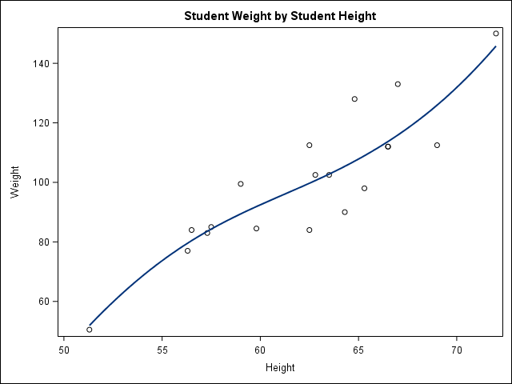

SASmarkdown notebook
====================

Reference manual
================

[SASmarkdown.pdf](https://cran.r-project.org/web/packages/SASmarkdown/SASmarkdown.pdf)

Configuration
=============

    ```{r setup, include=FALSE}
    knitr::opts_chunk$set(echo = TRUE)
    require(SASmarkdown)
    saspath <- "C:/Program Files/SASHome/SASFoundation/9.4/sas.exe"
    sasopts <- "-nosplash -ls 75"
    knitr::opts_chunk$set(engine='sas', engine.path=saspath,
                          engine.opts=sasopts, comment="")
    ```

Listing output
==============

    ```{r, engine='sas', collectcode=TRUE, error=FALSE}
    proc means data=sashelp.class;
    run;

    ods listing gpath='D:\figures';
    ods graphics / imagename="fig" imagefmt=png;
    title 'Student Weight by Student Height';
    proc sgplot data=sashelp.class noautolegend;
      pbspline y=weight x=height;
    run;
    ```

                                  Procédure MEANS

     Variable    N        Moyenne     Ecart-type        Minimum        Maximum
     -------------------------------------------------------------------------
     Age        19     13.3157895      1.4926722     11.0000000     16.0000000
     Height     19     62.3368421      5.1270752     51.3000000     72.0000000
     Weight     19    100.0263158     22.7739335     50.5000000    150.0000000
     -------------------------------------------------------------------------

``



HTML output (vue du fichier pdf)
===========

    ```{r, engine='sashtml', collectcode=TRUE, error=FALSE}
    proc means data=sashelp.class;
    run;
    ```

Tableau mal converti en pdf

    Variable
    N
    Moyenne
    Ecart-type
    Minimum
    Maximum
    Age
    Height
    Weight
    19
    19
    19
    13.3157895
    62.3368421
    100.0263158
    1.4926722
    5.1270752
    22.7739335
    11.0000000
    51.3000000
    50.5000000
    16.0000000
    72.0000000
    150.0000000

    ```{r, engine='sashtml', echo=FALSE, collectcode=TRUE, error=FALSE}
    title 'Student Weight by Student Height';
    proc sgplot data=sashelp.class noautolegend;
      pbspline y=weight x=height;
    run;
    ```

Pas de sortie graphique dans le fichier pdf.