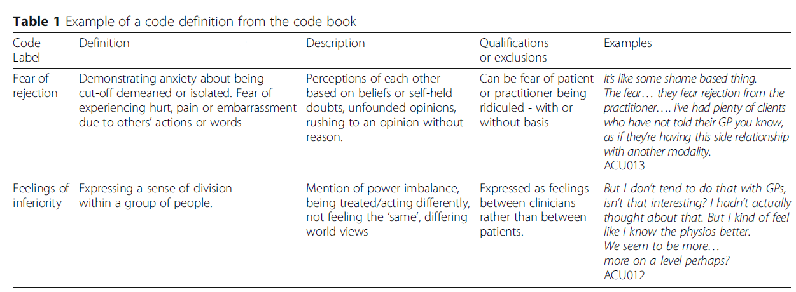

The following text was written by *Sabrina Granger*, library curator at
the Urfist (Unité régionale de formation à l'information scientifique et
technique - Regional Unit for Scientific and Technical Education) in
Bordeaux.

** Introduction
   :PROPERTIES:
   :CUSTOM_ID: introduction
   :END:

If we are to define reproducibility as arriving at similar results using
the same data and the same methods as used in the initial study, this
would exclude a number of research fields. When the object of study is a
rare weather event or historic incident, or when the work involves
interpreting texts or putting forward theorems, it is *transparency
issues* that are more of a concern. Janz makes a distinction between 3
types of transparency (Janz 2018). Objectives set in each field will
manifest themselves differently depending on whether quantitative or
qualitative methods are being used.

- /data transparency/: "/Providing full access to data itself/" ; this
  involves supplying the set of data on which the analysis is based, but
  Janz clarifies that availability may only be partial if transcripts of
  interviews and videos are being used.
- /analytic transparency/: "/Information about data analysis/"; this may
  relate to supplying software, in addition to precise details of the
  sources the analysis is based on, or adding additional comments to the
  analysis.
- /production transparency/: "/Process of data collection/"; this may
  involve supplying or describing raw data, or documenting variables.
  However,transparency may also involve explaining which protocols were
  used in collecting the data. We might, for example, outline the
  criteria used in selecting participants for a study.

*What this means is that not all reproducibility techniques will have
the same importance, depending on the disciplines and methods used*.

** Here are a few examples of practices that will help produce
reproducible research.
   :PROPERTIES:
   :CUSTOM_ID: here-are-a-few-examples-of-practices-that-will-help-produce-reproducible-research.
   :END:

There is no predetermined set of techniques and methods for reproducible
research. While *sharing data* and/or *software* contributes to more
reproducible research, the emerging practice of */preregistration/*
(Nosek /et al./ 2017) may also play a role. One of the aims of this is
to prevent the risks of HARKing - /Hypothesizing After the Results are
Known/. /Preregistration/ is carried out in advance of the analysis.
Researchers will thus formalise their research hypotheses, their data,
their /study design/ and their analysis plan; describing, for example,
the way in which variables will be measured, recorded, etc. This
information may be saved on digital platforms in order to ensure that
the process described initially is properly applied. A traditional *lab
notebook* may perform a similar function.

The goal is not to remove the exploratory aspect from research - it is
not possible to document every single change - but rather to indicate,
at the start of the process, how the analysis will be carried out in
order to make a clearer distinction between postdiction and prediction.
In other words, one of the purposes of /preregistration/ is to protect
researchers against bias and the use of wrong methods.

Let's bear in mind, however, that ** *preregistration is at best an aid*
and is not a foolproof way of tackling fraud. What's more, *it is in no
way a substitute for a thorough understanding of statistical methods and
concepts**.

There are also many cases where none of these techniques are applicable
(data which can't be shared, no computational aspect, etc.).

** In such cases, other responses are needed: transparency, a central
concept in reproducible research. But what is transparency?
   :PROPERTIES:
   :CUSTOM_ID: in-such-cases-other-responses-are-needed-transparency-a-central-concept-in-reproducible-research.-but-what-is-transparency
   :END:

Firstly, *transparency is not synonymous with provision, and vice
versa*. On one hand, it is common practice to work on data that is only
accessible to a handful of individuals for both material reasons
(e.g. an ancient manuscript or any other unique document that has to be
viewed on site) and legal reasons (e.g. health data or, more generally,
personal or proprietary data). Must we then ignore the issue of
reproducibility and avoid worrying about transparency? Certainly not.
Even when confidential data is being used, it has to be handled
methodically, describing it precisely, documenting the data protection
protocol and ensuring the data is archived. The goal is to keep this
information for yourself, but also to enable refutation by third
parties, provided specific legal mechanisms are respected. It is
essential to bear in mind that this research may need to be made
accessible to more people in the future. *Module 4 of the MOOC* includes
a number of reflections on this vast subject.

Meanwhile, in the context of research carried out using qualitative
methods, the code (in this case, the labelling applied to the data) may
play a major role, but sharing it will only provide a limited level of
information, given that what makes the research interesting is its
interpretative dimension. The provision of data is therefore not nearly
enough to ensure that the research carried out is understandable. We
would like to draw your attention to subject 3 of *module 3 of the MOOC*
("The London cholera outbreak of 1854"), which Illustrates the
importance of more qualitative data analysis (FIXME, add the correction
and link to the correction).

*The term "transparency" refers more to giving the readership access to
the information on which the case is based*: sources cited, data
analysed, description of data, /corpus/, /etc/. The concept of
traceability occupies a central role. The emphasis is not on arriving at
the same conclusions.

The importance of *giving access to the information used to build a
case* is not a new idea, and is central to the scientific process,
independent of the tools and methods used (quantitative analysis,
qualitative analysis, /etc/.). However, the increase in the amount of
data available (digital /corpora/, reference catalogues, full text
sources, data obtained using software programs, /etc/.) and its
fragility (obsolete media, formats or software) constitute *potential
weak points in terms of the traceability of research*.

The objective of transparency can be jeopardised at any stage of the
process: searching for sources and analysing the literature; entering
and processing data; building /corpora/; presenting results; editing.

What's more, *you don't need to be working with databases, survey data
or massive data sets to be concerned with these issues*. It may be
difficult, for example, for a researcher to evaluate the robustness of a
research hypothesis founded on the presence of a data expression in a
/corpus/ if this can't be examined automatically. This exposes
researchers to disappointment. The example is taken from the book by
Bernard and Bohet cited in the bibliography (Bernard and Bohet 2017): a
researcher states that there is no occurrence of the expression "lost
illusions" in Balzac's novel of the same name. Although the expression
is indeed absent from the novel, a search through the document will
reveal multiple occurrences of the term "illusions", including an
excerpt from a letter written by Lucien: "Paris is the glory and the
infamy of France. Many illusions have I lost there already, and I have
others yet to lose". Subsequently, this result requires a more nuanced
analysis than the initial hypothesis.

This anecdote should obviously not be seen as an argument against
qualitative approaches and in favour of quantitative approaches, or vice
versa. These approaches can be used together; what this example
illustrates more than anything else is that hidden confirmation bias or
a failure to view data correctly can result in serious interpretation
errors, even if the figures themselves are correct. The only way to
flush out and correct potential errors is to keep a close eye on the
process and to automate it as much as possible.

*Digital technology is seen here as one tool amongst many used in a
methodological context*, helping to limit the risk of oversights or
errors and ensuring that verification tools are available. Indeed, there
is a question surrounding the degree of control that is possible over
these tools: *under which conditions is it reasonable to rely on
automated processing in seeking transparent research?* As far as
possible, the use of */Open Source/ software* is a first step in this
direction: the source code for commercial software remains inaccessible.
Following on from that, gradually acquiring a set of technical skills
will enable you to understand the general workings of a program. *This
does not necessarily imply having a comprehensive understanding of the
configuration, but simply knowing enough to understand what is obtained
as an output and to judge its credibility*. Data scientists and
statisticians working in research teams can help you understand these
aspects, which can be cultural as well as technical, given that software
is created in a specific epistemological environment.

** /Codebooks/ - an example tool for qualitative methods
   :PROPERTIES:
   :CUSTOM_ID: codebooks---an-example-tool-for-qualitative-methods
   :END:

Whether you decide to share it or not, designing a */codebook/* (Saldaña
2016) may be useful for researchers employing *qualitative methods*. The
term "code" used here is to be understood as follows: "/A code in
qualitative inquiry is most often a word or short phrase that
symbolically assigns a summative, salient, essence-capturing, and/or
evocative attribute for a portion of language-based or visual data. The
data can consist of interview transcripts, participant observation field
notes, journals, documents, literature, artefacts, photographs, video,
websites, e-mail correspondence, and so on./" (Saldaña 2016)

*Whether the data is coded using CAQDAS (Computer Assisted Qualitative
Data Analysis Software) or manually, the process for coding or labelling
data is iterative*: an initial exploratory stage is followed by a second
phase where labelling becomes more selective and theoretical. The coding
stage often requires a number of adjustment cycles, as Saldaña explains:
"/As you code and recode, expect -- or rather, strive for -- your codes
and categories to become more refined. Some of your First Cycle codes
may be later subsumed by other codes, relabeled, or dropped all
together. As you progress toward Second Cycle coding, there may be some
rearrangement and reclassification of coded data into different and even
new categories./" (Saldaña 2016) What's more, not only do codes evolve
during analysis, but they may also increase in number. The figure below
illustrates the cycle for designing codes (Roberts, Dowell and Nie
2019).

[[file:ROBERTS-cycle-codebook.png]]

These evolutions must be monitored throughout the research process.
/Codebooks/ can be used to monitor evolutions in that they are
*documents used to inventory all applied codes, to record selections and
to track their evolution*. In this way, a /codebook” is more than just a
simple index. There are various different types of /codebooks/: some
focus on describing data. /Codebooks* are a type of monitoring tool
which support the interpretative aspect of analysis work.

The main sections of a /codebooks/ are:

- the code wording
- a short description of what the code is for
- inclusion criteria, i.e. what data or phenomena to use the code with.
  The purpose of this is to formalise the criteria that must be met in
  order to use the code
- exclusion criteria, i.e. criteria, specific cases of data where the
  code must not be used
- typical examples: a selection of a few cases best illustrating the
  usage criteria
- non-typical examples: a selection of extreme, non-typical cases for
  which use of the code is required
- "/close, but no/": cases where we might be tempted to use the code,
  despite the data not matching

Below is an example of a /codebook/ (Roberts, Dowell and Nie 2019):
\\
Lastly, *the /codebook/ itself constitutes a document for which
management is required*: its successive versions have to be managed.

This type of work might seem tedious, but trying to remember your own
labelling can be even more so, /particularly/ in cases of collaborative
work. Furthermore, when the coding is designed collectively, it can be
useful to designate a /codebook editor/, who will be tasked with
coordinating additions, deletions and evolutions.

Designing and managing a /codebook/ takes time, but this documentation
process does provide guarantees: "/It was thought that the codebook
improved the potential for inter-coder agreement and reliability testing
and ensured an accurate description of analyses/." (Roberts, Dowell, and
Nie 2019)

** /What about/ non-computational aspects of research?
   :PROPERTIES:
   :CUSTOM_ID: what-about-non-computational-aspects-of-research
   :END:

In *disciplines not employing digital methods*, the issue of
transparency is slightly different. For example, techniques used in the
processing of digital /corpora/ are only of limited interest to
humanities researchers studying how texts are interpreted in different
eras, given that this type of research requires another type of text
handling. However, rigorous use of bibliographic sources (literature
reviews, building the bibliographic apparatus, /etc/.) is the
determining factor in transparent research. In such cases, the use of a
*bibliographic reference manager* is appropriate. Another family of
tools can also become useful when working solely on texts: *version
control tools*. It can be difficult to keep track of changes in the text
when writing a monograph or a PhD or when the text is being drafted
jointly. Forge software such as GitLab, for example, is not only of use
to developers: it can be useful for managing any type of content, not
just code.

** Sources and additional information
   :PROPERTIES:
   :CUSTOM_ID: sources-and-additional-information
   :END:

Bernard, Michel, and Baptiste Bohet. 2017. Littérométrie: digital tools
used to analyse literary texts. Paris, France: Presses Sorbonne
Nouvelle.

Freelon, Deen. 2010. 'ReCal: Intercoder Reliability Calculation as a Web
Service'. International Journal of Internet Science 5 (1): 20--33.

[[http://dfreelon.org/utils/recalfront/][Recal]] : "ReCal ("Reliability
Calculator") is an online utility that computes intercoder/interrater
reliability coefficients for nominal, ordinal, interval, or ratio-level
data. It is compatible with Excel, SPSS, STATA, OpenOffice, Google Docs,
and any other database, spreadsheet, or statistical application that can
export comma-separated (CSV), tab-separated (TSV), or
semicolon-delimited data files. ReCal consists of three independent
modules each specialized for different types of data. The following
table will help you select the module that best fits your data. (If you
do not know whether your data are considered nominal, ordinal, interval,
or ratio, please consult this Wikipedia article to find out more about
these levels of measurement.)"

Heimburger, Franziska, and Émilien Ruiz. 2011. 'Faire de l'histoire à
l'ère numérique : retours d'expériences'. Revue d'histoire moderne et
contemporaine n° 58-4bis (5): 70--89.

Janz, Nicole. 2018. 'Research Reproducibility in Political Science'.
presented at the NCRM Research Methods Festival, University of Bath,
July 5th.
[[https://www.ukdataservice.ac.uk/media/622140/janz_rmf_qualtransperency_bath2018.pdf]].

Nosek, Brian A., Charles R. Ebersole, Alexander DeHaven, and David
Mellor. 2017. 'The Preregistration Revolution'. Open Science Framework,
June. [[https://doi.org/10.17605/OSF.IO/2DXU5]].

Roberts, Kate, Anthony Dowell, and Jing-Bao Nie. 2019. 'Attempting
Rigour and Replicability in Thematic Analysis of Qualitative Research
Data; a Case Study of Codebook Development'. BMC Medical Research
Methodology 19 (1): 66. [[https://doi.org/10.1186/s12874-019-0707-y]].

Saldaña, Johnny. 2016. The Coding Manual for Qualitative Researchers.
Third Edition. Los Angeles: SAGE.

*Additional resources*

Dymond-Green, Neil, and UK Data Service. 2018. 'Show Me the Data:
Research Reproducibility in Qualitative Research -- Data Impact Blog'.
Data Impact Blog (blog). 18 September 2018.
[[http://blog.ukdataservice.ac.uk/show-me-the-data/]].

[[https://programminghistorian.org/en/][The Programming Historian]] :
"We publish novice-friendly, peer-reviewed tutorials that help humanists
learn a wide range of digital tools, techniques, and workflows to
facilitate research and teaching. We are committed to fostering a
diverse and inclusive community of editors, writers, and readers."

*Data management resources (including personal data): management,
sharing*

Andreassen, Helene N. 2019. 'How to Share Research Data'. University
Library : The Arctic University of Norway, November 5.
[[http://site.uit.no/rdmtraining/files/2019/11/En_share_2019-11-05.pdf]].

Andreassen, Helene N., and Erik Axel Vollan. 2018. 'Research Data
Management Part 2: (Qualitative) Data Containing Personal/Sensitive
Information'. University Library : The Arctic University of Norway,
October 11.
[[http://site.uit.no/rdmtraining/files/2018/10/TakeControlResearchData_PART_2_Qualitative.pdf]].

Beagrie, Neil. 2019. 'What to Keep : A Jisc Research Data Study'. JISC.
[[https://repository.jisc.ac.uk/7262/1/JR0100_WHAT_RESEARCH_DATA_TO_KEEP_FEB2019_v5_WEB.pdf]].
Boistel, Romain, Frédérique Bordignon, and Lionel Maurel. 2019. 'Aspects
Juridiques de La Gestion et Du Partage Des Données' (Legal aspects to
the management and sharing of data). In Journées Nationales de La
Science Ouverte 2019. Paris, France.
[[https://hal-enpc.archives-ouvertes.fr/hal-02372271]].

Caporali, Arianna, Amandine Morisset, and Stéphane Legleye. 2015.
'Sharing quantitative surveys in the social sciences: the Ined example'.
Population (French edition) 70 (3): 567--97.
[[https://doi.org/10.3917/popu.1503.0567]].

National Science Foundation, Center for Qualitative and Multi-Method
Inquiry, and Syracuse University. n.d. 'Qualitative Data Repository'.
Accessed 22 January 2020. [[https://qdr.syr.edu/discover]].
