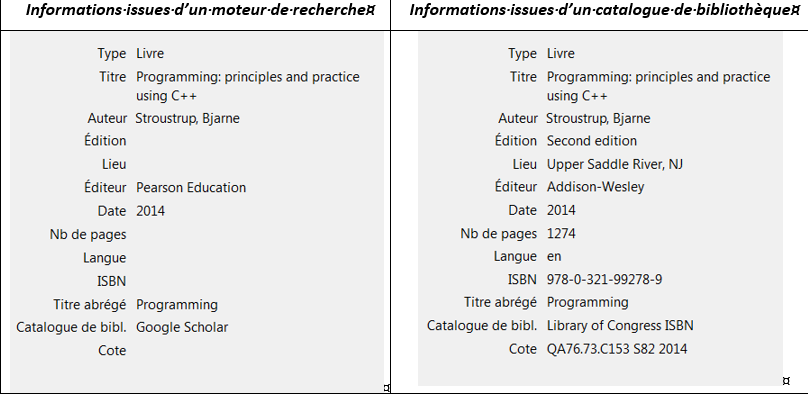

# -*- coding: utf-8 -*-
# -*- mode: org -*-

#+TITLE:       Bibliographical references, another vector of transparency
#+AUTHOR:      Sabrina Granger
#+STARTUP: overview indent inlineimages logdrawer
#+LANGUAGE:    en
The following text was written by *Sabrina Granger*, library curator at
the Urfist (Unité régionale de formation à l'information scientifique et
technique - Regional Unit for Scientific and Technical Education) in
Bordeaux. Introduction ------------

It is not a question here of dealing with issues regarding standards for
bibliographic presentation: each discipline and each review, even, has
its own formal criteria.

Furthermore, the level of formalism for bibliographic references will
differ depending on the disciplinary practices: in certain fields, you
must cite the pagination or even the paragraph in question, while in
other fields this level of precision is not required. Depending on the
degree of precision required in the discipline, note-taking methods will
be adapted in order to enable the required information to be found
during the writing process.

** How does the question of bibliographic references relate to the question of reproducibility?
   :PROPERTIES:
   :CUSTOM_ID: how-does-the-question-of-bibliographic-references-relate-to-the-question-of-reproducibility
   :END:

Rigorous management of the bibliographic apparatus constitutes a major
factor in transparency when working in so-called "hard" sciences such as
literature, languages and the humanities.

In the human sciences, particularly in disciplines requiring qualitative
methods or methods based primarily on textual interpretation, the main
challenge is not so much to reproduce results as it is to enable other
researchers to support or refute the proposed argument. However,
bibliographic references show the different steps involved in building
an argument and coming up with hypotheses.

A bibliography is a means of demonstrating to readerships of researchers
that a given text is transparent: *is the list of sources exhaustive and representative of all points of view on the question or, on the
contrary, does it contain selection biases?*

** Being as systematic as possible with sources will help reduce
/reporting/ errors.
   :PROPERTIES:
   :CUSTOM_ID: being-as-systematic-as-possible-with-sources-will-help-reduce-reporting-errors.
   :END:

When we say /reporting/ errors, we mean arriving at conclusions which
are different or which diverge from those of the author of the reference
cited. What we want to avoid here is incorrectly interpreting the
initial statement. The use of so-called second-hand quotations (or
secondary quotations) can thus lead authors to commit errors in
situations where the text being cited has not been properly understood
in its original context, but instead through the filter of another
author.

/What/ about cases where *the original text is inaccessible*? Your
readership must have detailed references for the source citing the
passage that you are using. For example: (Brown, 2010 cited par Jamison,
2012). In order to avoid erroneously implying that you have consulted
the source directly:

- either mention only the document citing the source in the bibliography
- or include the reference in the bibliography in a separate list; or,
  alternatively, flag it up as a non-consulted source using a
  distinctive sign (an asterisk, for example).

*Respecting protocol when it comes to quotations and bibliographies is a
way of giving your readership points of reference to work with*. In the
event of it being impossible to access a source, good knowledge of the
author citing the passage that you are looking to use will enable you to
evaluate how reliable the reference is.

** Adopting a bibliographic style to make it easier to identify the
sources cited
   :PROPERTIES:
   :CUSTOM_ID: adopting-a-bibliographic-style-to-make-it-easier-to-identify-the-sources-cited
   :END:

Whether your document is four or a thousand pages long, applying a
bibliographic style will help you to avoid forgetting to mention the
elements required for the identification of a document. A bibliographic
style provides a basic outline for the information to be included
depending on the types of documents cited: articles from scientific
journals, monographs, blog posts, encyclopaedia articles, presentations,
etc. Some fields are optional. The [[http://www.sudoc.fr/146773233][ISO
standard 690]] can be used to identify the elements you must mention,
depending on the type of document being cited. Indeed, even if the
description will be imported into your reference manager automatically,
the notice obtained may prove unusable. Everything will depend on the
quality of the information deposit consulted when importing the notice.
Below, we can see that, for the same reference, the quality of the
descriptions varies depending on the type of tool consulted (generalist
search engines v library catalogues).

In the above example, the mention of the edition is an important piece
of data when it comes to identifying the document being cited. Lastly,
it will be easier for your readership to understand the bibliographic
references when the way in which they are presented is standardised.
Bibliographic reference managers can be used to apply formal elements in
a way that is both homogeneous and automated.

** Automating reference management: what should we expect or not expect?
   :PROPERTIES:
   :CUSTOM_ID: automating-reference-management-what-should-we-expect-or-not-expect
   :END:

There are a number of solutions. One of these,
[[https://www.zotero.org/][Zotero]], is a free, /opensource/ solution
used by a growing, dynamic community of users. The features outlined
below borrow largely from those found in Zotero.

A bibliographic reference manager can be used:

- *to import bibliographic descriptions* from catalogues, search
  engines, websites, editor platforms
- *to centralise* the collected references and thus to build a personal
  database, unlike the tools on offer in text processing. Word, for
  example, lets you create databases of bibliographic references, but
  these will be specific to one document. Thus, in order to cite the
  same reference in multiple documents, I have to create it in each
  document.
- - *to export bibliographic references in different formats* :: .html,
    .ris, .rtf

- *to share references*, either recurrently by creating group libraries,
  or on a one-off basis by exporting references
- *to cite* sources in a text by applying a given style to them
- to edit the descriptions collected in order to correct them and
  improve them
- *to annotate bibliographic references*: you may, for example, link
  passages that you find particularly interesting to a description;
  notes taken on media external to your manager (notebooks, files, etc.)
  can thus be linked to the description for a document. These notes are
  for internal use and will not be visible when citing the reference.
- *to organise* large quantities of data; you can create folders and
  sub-folders; sort descriptions into multiple folders without creating
  duplicates; label references to indicate those that you feel to be
  fundamental or to flag up references that are waiting to be read; send
  internal references back to your library; create "dynamic" folders: by
  saving a request, you create a folder where all of the references
  meeting the recorded criteria will automatically be sorted,
  independent of the manual sorting carried out. This is not an
  exhaustive list.
- *to deduplicate* references; we are speaking here about descriptions
  imported multiple times and not references sorted into multiple
  folders
- *to navigate in references* using analysis tools
- to work on multiple computers without any difficulties in
  synchronising the bibliographic reference base

A tool such as Zotero even has
[[https://www.zotero.org/blog/retracted-item-notifications/][a plug-in
dedicated to tracking retracted articles]].

Bibliographic reference managers automate the majority of tasks, but
will remain dependent on the user:

- an *improving and correcting imported data* stage: the quality of the
  outputs will depend first and foremost on the quality of the input
  data. However, although managers are able to identify which data can
  be imported into a web page, they are not capable of evaluating the
  data's descriptive quality. The problem may be quantitative (i.e. not
  all of the required fields are completed), or qualitative (i.e. there
  are inaccuracies in the data, or written errors have been identified).
  Pages containing results from generalist search engines, for example,
  provide descriptions of inferior quality to those from library
  catalogues, and for readers it can be difficult to precisely identify
  the source cited.\\
- a *method for sorting and organising data*; e.g.: this involves
  regularly cleaning your database by deduplicating references,
  reviewing your folder trees, etc. Obviously, reference managers have
  search functions, but duplication will remain an issue if regular
  cleaning isn't carried out. It's a major problem: as discussed above,
  the quality of the descriptions may vary significantly. However, if
  duplicates of the same reference are located in the base, sometimes
  you will use notice A, and other times you will use notice A' to link
  to the same source. However, these 2 notices might not be equivalent
  to each other at all: obviously, they are meant to be linked to the
  same document, but the level of information they contain may vary.
  Lastly, when creating the bibliography listing all of the references
  cited in the text, the notices A and A' will both appear, despite
  being linked to the same source, because the reference manager will
  view them as 2 separate notices.
- *information enrichment /via/ the annotation of of notices*: this step
  can be considered as being optional. From a technical perspective,
  there is nothing stopping you from citing a source, even if its notice
  has not been annotated. However, being able to easily find large
  extracts from a source /via/ annotations boosts the reliability of
  your reference management system: bibliographic descriptions and
  citable extracts are thus linked, meaning there is less risk of a
  quotation being wrongly attributed to a source. This type of error
  occurs much more frequently when you are using multiple references
  from the same author. Lastly, annotating your notices /via/ the
  reference manager makes it easy for you to find the extracts selected
  using the search features. [[https://github.com/jkitchin/org-ref][If
  you are working with Emacs, org-ref lets you annotate your
  references]].

The power and the ease of using a reference manager make it a
double-edged sword: much quicker than with a manual method, users are
confronted with a large quantity of potential references. The literature
review stage can then become intrusive in the research process,
particularly in the context of PhD research. Analysing a reference
library through the prism of your research question is a sorting method
which cannot be automated, but which is more efficient than using
filters.

** /What about/ whole texts?
   :PROPERTIES:
   :CUSTOM_ID: what-about-whole-texts
   :END:

When analysing an editor platform, you can also collect the full text of
the articles (depending on the different journals your institution is
subscribed to) when loading the bibliographic description in the
reference manager. However, with these imports there is the issue of the
user's free storage quota.

Without going into too much detail on the alternatives, you are
encouraged to see this feature primarily as a backup option - the
advantage of reference management systems resides primarily in the
support they provide with regard to managing and quoting bibliographic
references. In other words, *it is better to have a full description without the full text as opposed to having an incomplete reference with
the full text*: during the quotation stage, it is the description that
will be used, not the attached file.

** Additional information
   :PROPERTIES:
   :CUSTOM_ID: additional-information
   :END:

The [[https://zotero.hypotheses.org/][blog Zotero (Francophone)]] for
advice and news on developments

The [[https://www.zotero.org/][Zotero website]] contains the relevant
documentation and [[https://forums.zotero.org/discussions][forums]]

The [[https://www.zotero.org/styles][Zotero style depository]], with
free to download styles

When used by the community of *Francophone legal practitioners*,
specific issues are raised which are not yet properly handled by the
styles available in the Zotero depository. The example of the style
devised for the "Law" PhD school at the University of Bordeaux provides
potential avenues to explore: Frédérique Flamerie de Lachapelle 2019.
'Creating a style for Zotero corresponding to a bibliographic standard
in law: feedback from Bordeaux. Guest post'. Post. UrfistInfo (blog).
2nd July 2019. [[https://urfistinfo.hypotheses.org/3305]].

Caroline Muller. 2018. 'Five years of using Zotero - an assessment'.
Post. Acquis de conscience (blog). 9th March 2018.
[[https://consciences.hypotheses.org/1184]].

Ashley Sergiadis 2019. 'Evaluating Zotero, SHERPA/RoMEO, and Unpaywall
in an Institutional Repository Workflow'. Journal of Electronic
Resources Librarianship, September.
[[https://dc.etsu.edu/etsu-works/4739]].
