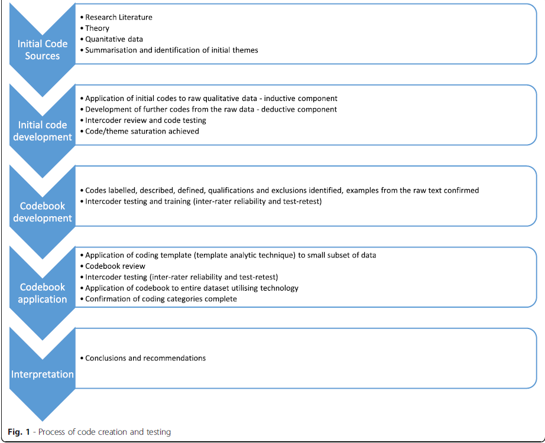

# -*- coding: utf-8 -*-
# -*- mode: org -*-

#+TITLE:       Au-delà de la reproductibilité : la transparence de la recherche
#+AUTHOR:      Sabrina Granger
#+STARTUP: overview indent inlineimages logdrawer
#+LANGUAGE:    fr

La contribution principale à ce texte est de *Sabrina Granger*,
conservatrice des bibliothèques à l’Urfist (Unité régionale de
formation à l'information scientifique et technique) de Bordeaux.

** Introduction

Si l'on définit la reproductibilité comme le fait d'aboutir à des
résultats similaires à partir des mêmes données et des mêmes méthodes
que celles de l'étude initiale, plusieurs domaines de recherche semblent
exclus de la problématique. Lorsque l'objet d'étude est un phénomène
climatique rare, un événement historique ou lorsque le travail consiste
à interpréter des textes ou à énoncer des théorèmes, ce sont davantage
les *enjeux de transparence* qui prédominent. Janz distingue 3 types de
transparence (Janz 2018). Les objectifs à atteindre dans chaque domaine
vont se traduire différemment selon que l'on travaille avec des méthodes
quantitatives ou qualitatives : 
- /data transparency/ : "/Providing full access to data itself/" ; il
  s'agit là de fournir les jeux de données sur lesquels se fonde
  l'analyse, mais Janz précise que la mise à disposition ne peut être
  que partielle si on utilise des transcriptions d'entretiens, des vidéos. 
- /analytic transparency/ : "/Information about data analysis/" ; il peut
  s'agir de fournir les codes informatiques mais aussi d'indiquer
  précisement sur quelles sources l'analyse s'appuie ou encore d'apporter des 
  commentaires complémentaires à l'analyse. 
- /production transparency/ : "/Process of data collection/" ; il peut
  s'agir de fournir ou de décrire les données brutes, de documenter
  les variables. Mais l'objectif de transparence peut aussi consister
  à expliquer selon quels protocoles les données ont été
  collectées. On peut par exemple détailler les critères de sélection
  des participants à une étude.

*Toutes les techniques de reproductibilité n'auront donc pas la même
importance en fonction des disciplines et des méthodes employées*.

** Quelques exemples de pratiques favorables à une recherche reproductible...
   :PROPERTIES:
   :CUSTOM_ID: quelques-exemples-de-pratiques-favorables-à-une-recherche-reproductible
   :END:

La recherche reproductible ne constitue pas un ensemble prédéterminé de
techniques et de méthodes. Si le *partage de données* et/ou de *code
informatique* participe à une recherche plus reproductible, la pratique
émergente de la */pre-registration/* (Nosek /et al./ 2017) peut également
y concourir. L'une de ses finalités est de prévenir les risques de
HARKing - /Hypothesizing After the Results are Known/. La
/pre-registration/ intervient en amont du travail d'analyse. Un.e
chercheur.euse va ainsi formaliser ses hypothèses de recherche, ses
données, son /study design/ et son plan d'analyse ; on va par exemple
décrire la manière dont une variable va être mesurée, enregistrée. Ces
informations peuvent être sauvegardées /via/ des plateformes numériques
pour s'assurer par la suite que la démarche initialement décrite est
bien appliquée. La tenue d'un *cahier de laboratoire* classique peut
jouer un rôle similaire.

Il ne s'agit pas d'amputer la recherche de sa dimension exploratoire car
il est possible de documenter tout changement, mais d'indiquer en début
de processus la manière dont l'analyse sera conduite afin de mieux
distinguer post-diction et prédiction. En d'autres termes, l'un des
objectifs de la /pre-registration/ est d'aider le.a chercheur.euse à se
prémunir contre des biais, des erreurs de méthode.

Gardons à l'esprit que *la /pre-registration/ représente au mieux une
aide* et ne constitue pas un rempart contre la fraude. Par ailleurs, 
*ce type de modalité de travail ne se substitue pas à la maîtrise des
concepts et des méthodes statistiques*.

Mais il existe également de nombreux cas où aucune de ces techniques ne
s'applique (données ne pouvant être partagées, absence de dimension
calculatoire ou informatique, etc.).

** ... qui appellent d'autres réponses : la transparence, une notion centrale de la recherche reproductible. Mais de quoi parle-t-on alors ?
   :PROPERTIES:
   :CUSTOM_ID: qui-appellent-dautres-réponses-la-transparence-une-notion-centrale-de-la-recherche-reproductible.-mais-de-quoi-parle-t-on-alors
   :END:

Tout d'abord, *transparence n'est pas synonyme de mise à disposition, et
réciproquement* ! D'une part, il est courant de travailler sur des
données qui ne sont accessibles qu'à une poignée d'individus pour des
raisons matérielles (i.e. manuscrit ancien ou tout autre document unique
à consulter sur place) comme pour des raisons juridiques (i.e. données
de santé ou données personnelles plus généralement, données soumises à
des droits patrimoniaux). Est-on alors condamné.e à ignorer les
questions de reproductibilité et faut-il pour autant ne pas se
préoccuper de transparence ? Certainement pas. Ainsi, même lorsqu'on
utilise des données confidentielles, il s'avère nécessaire de les gérer
méthodiquement en les décrivant précisément, en documentant le protocole
de collecte, en assurant leur préservation. L'objectif est de conserver
ces informations pour soi, mais aussi à des fins de réfutabilité par un
tiers sous réserve de respecter un dispositif juridique précis. On
s'attachera alors à travailler en gardant à l'esprit que ces travaux
seront peut-être amenés à être accessibles à un plus grand nombre de
personnes dans le futur. Le *module 4 du Mooc* comporte quelques pistes
de réflexion sur ce sujet très vaste.

D'autre part, dans le cadre d'une recherche conduite avec des méthodes
qualitatives, le code (dans ce contexte, l'étiquetage appliqué aux
données) peut jouer un rôle majeur, mais son partage ne fournira qu'un
niveau d'information limité puisque l'intérêt des travaux réside dans
leur dimension interprétative. La mise à disposition des données est
donc très loin d'être suffisante pour garantir une compréhension des
travaux effectués. Nous vous invitons à vous reporter au Sujet 3 du
*module 3 du Mooc* ("L'épidémie de choléra à Londres en 1854") car il
illustre pleinement l'importance d'une analyse plus qualitative des
données (FIXME, ajouter la correction et le lien vers la correction).

*Le terme "transparence" renvoie donc plutôt au fait de rendre accessibles 
à son lectorat les éléments sur lesquels s'est construit le raisonnement* : 
sources citées, données analysées ou description des données, /corpus/, /etc/. 
La notion de traçabilité occupe donc une place centrale. L'accent n'est pas 
mis sur le fait d'aboutir aux mêmes conclusions.

L'importance de *donner accès aux éléments constitutifs de son
raisonnement* n'est pas une idée nouvelle et réside au cœur de la
démarche scientifique, indépendamment des outils et méthodes utilisées
(analyse quantitative, analyse qualitative, /etc/.). Mais la
démultiplication des données disponibles (/corpus/ numérisés, catalogues
de références, sources en texte intégral, données obtenues grâce à des
logiciels, /etc/.) et leur fragilité (obsolescence des supports, des
formats et des logiciels) constituent autant d'*atteintes potentielles à
la traçabilité de la recherche*.

À tous les stades du travail, l'objectif de transparence peut être mis à
mal : recherche des sources et analyse de la littérature ; saisie et
traitement des données ; constitution des /corpus/ ; présentation des
résultats ; rédaction.

Par ailleurs, *nul besoin de travailler avec des bases de données, des données d'enquêtes   
ou encore des jeux de données massifs pour être concerné.e par ces problématiques*. 
Par exemple, il peut être difficile pour un.e chercheur.euse d'évaluer la 
robustesse d'une hypothèse de recherche fondée sur la présence d'une expression 
donnée dans un /corpus/ si celui-ci n'est pas interrogeable de manière 
automatisée. On s'expose alors à des déconvenues. L'exemple est tiré de 
l'ouvrage de Bernard et Bohet cité dans la bibliographie (Bernard and Bohet 2017) :
un chercheur affirme qu'il n'y a pas d'occurrence de l'expression
"illusions perdues" dans le roman éponyme de Balzac. Si l'expression est
en effet absente du roman, une recherche dans le document permet de
faire émerger plusieurs occurrences du terme "illusions", notamment un
passage d'une lettre de Lucien : "Paris est à la fois toute la gloire et
toute l'infamie de la France, j'y ai déjà perdu bien des illusions, et
je vais en perdre encore d'autres". Ce résultat appelle dès lors une
analyse bien plus nuancée que l'hypothèse initiale.

Cette anecdote n'est évidemment pas à considérer comme un argument
susceptible de discréditer les approches qualitatives par rapport aux
approches quantitatives ou l'inverse. Ces approches sont complémentaires
et cet exemple illustre avant tout le fait qu'un biais de confirmation
dont on n'a pas conscience ou une visualisation de données inadaptée
peuvent conduire à des erreurs d'interprétation majeures, et ce même si
les chiffres sont corrects. Seul le fait de garder une trace rigoureuse
de la démarche et de l'automatiser autant que possible permet de
débusquer et de corriger les erreurs potentielles.

*Le recours au numérique est ici considéré comme un outil parmi d'autres
au service d'un cadre méthodologique*, permettant entre autres de
limiter les risques d'oubli et d'erreurs, de disposer d'outils de
vérification. De fait, se pose la question du degré de contrôle possible
de ces outils : *sous quelles conditions est-il raisonnable de s'en remettre à
des traitements automatisés dès lors qu'on veut s'assurer d'une recherche transparente ?*
Autant que faire se peut, le recours à des *logiciels /open source/* constitue 
une première étape dans ce sens : le code source des logiciels commerciaux 
demeure en effet inaccessible. Ensuite, acquérir progressivement un socle de compétences
techniques permet d'appréhender le fonctionnement général d'un logiciel.
*Il ne s'agit pas forcément d'en comprendre le paramétrage dans le détail, mais d'avoir suffisamment
de notions pour comprendre ce qu'on obtient en sortie et le crédit qu'on peut lui apporter*. 
Les ingénieur.e.s en traitement et analyse de données et les
statisticien.ne.s des équipes de recherche peuvent vous aider à
appréhender ces aspects techniques, mais aussi culturels car les
logiciels naissent dans un environnement épistémologique donné.

** Le /codebook/, un exemple d'outil pour les méthodes qualitatives
   :PROPERTIES:
   :CUSTOM_ID: le-codebook-un-exemple-doutil-pour-les-méthodes-qualitatives
   :END:

Que l'on décide de partager ou non ce type de données, concevoir un
*/codebook/* (Saldaña 2016) peut être utile aux chercheurs.euses
recourant aux *méthodes qualitatives*. Le terme "code" s'entend ici de
la sorte : "/A code in qualitative inquiry is most often a word or short phrase that symbolically assigns a summative, salient, essence-capturing, and/or evocative attribute for a portion of language-based
or visual data. The data can consist of interview transcripts, participant observation field notes, journals, documents, literature, artifacts, photographs, video, websites, e-mail correspondence, and so on./" (Saldaña 2016)

*Que l'on code les données à l'aide d'un logiciel CAQDAS (Computer Assisted qualitative Data Analysis  
Software) ou manuellement, le processus de codage ou d'étiquetage des données est itératif* : 
une première étape exploratoire permet d'aboutir à une seconde phase où 
l'étiquetage devient plus sélectif, théorique. L'étape de codage appelle souvent
plusieurs cycles d'adaptation, ainsi que le rappelle Saldaña : 
"/As you code and recode, expect -- or rather, strive for -- your codes and categories to become more refined. Some of your First Cycle codes may be later subsumed by other codes, relabeled, 
or dropped all together. As you progress toward Second Cycle coding, there may be some rearrangement and reclassification of coded data into different and even new categories./" 
(Saldaña 2016) Par ailleurs, non seulement les codes évoluent au fil de l'analyse, 
mais leur nombre peut aussi augmenter. La figure ci-dessous illustre le cycle de 
conception des codes (Roberts, Dowell, and Nie 2019).

 

De fait, la nécessité de suivre ces évolutions s'impose tout du long du
processus de recherche. Un /codebook/ peut répondre au besoin de suivi
des évolutions puisqu'il s'agit d'*un document permettant d'une part, de recenser tous les codes appliqués, d'autre part, de consigner ses
choix et de suivre leur évolution*. Ainsi, un /codebook/ représente plus qu'un
simple index. Il existe différents types de /codebooks/ : certains se
focalisent sur la description des données. Le /codebook/ constitue un
outil de suivi au service de la dimension interprétative du travail
d'analyse.

Les rubriques principales d'un /codebook/ sont les suivantes :

- intitulé du code
- courte description des finalités du code
- critères d'inclusion, i.e. sur quelles données ou quel phénomène
  utiliser le code. Il s'agit de formaliser les critères à réunir pour
  recourir au code
- critères d'exclusion, i.e. critères, cas particulier de données où le
  code ne doit pas être utilisé
- exemples typiques : sélection de quelques cas qui illustrent le mieux
  les critères d'utilisation
- exemples atypiques : sélection de cas extrêmes, atypiques pour
  lesquels l'usage du code est requis
- "presque, mais non" ("/close, but no/") : des cas où l'on serait
  tenté.e d'utiliser le code, alors que les données ne correspondent pas

Ci-dessous, un exemple de /codebook/ (Roberts, Dowell, and Nie 2019) :
[[file:ROBERTS_codebook.png]]\\
Enfin, *le /codebook/ lui-même constitue un document à gérer* : il faut
gérer ses versions successives.

Ce type de travail peut sembler fastidieux, mais tenter de se souvenir
de son propre étiquetage peut l'être encore davantage, /a fortiori/ en
cas de travail collaboratif. D'ailleurs, lorsque le codage est conçu
collectivement, il peut être utile de désigner un /codebook editor/
chargé de coordonner les ajouts, les suppressions, les évolutions.

Concevoir et gérer un /codebook/ nécessite du temps, mais cette démarche
de documentation apporte des garanties : "/It was thought that the codebook improved the potential 
for inter-coder agreement and reliability testing and ensured an accurate description of analyses/."
(Roberts, Dowell, and Nie 2019)

** /Quid/ des aspects non computationnels de la recherche ?
   :PROPERTIES:
   :CUSTOM_ID: quid-des-aspects-non-computationnels-de-la-recherche
   :END:

Dans le cas des *disciplines ne faisant pas appel à des méthodes fondées
sur le numérique*, la question de la transparence se pose en d'autres
termes. Par exemple, les techniques de traitement de /corpus/ numériques
n'offrent qu'un intérêt limité pour un.e chercheur.euse en lettres
travaillant sur la manière dont une œuvre est interprétée en fonction
des époques car ce type de recherche appelle une autre forme
d'exploitation du texte. En revanche, la rigueur dans l'utilisation des
sources bibliographiques (revue de littérature, constitution de
l'appareil bibliographique, /etc/.) constitue le critère déterminant
d'une recherche transparente. Dès lors, le recours à un *gestionnaire de
références bibliographiques* est très adapté. Une autre famille d'outils
peut également devenir utile quand on travaille uniquement sur des
textes : les *outils de contrôle de versions*. Il peut en effet être
difficile de garder le suivi des évolutions du texte quand on rédige une
monographie, une thèse ou lorsque la rédaction est collective. Un
logiciel de forge tel que GitLab n'est par exemple pas seulement utile à
des développeurs : il peut aider à gérer tout type de contenu, pas
seulement du code.

** Sources et compléments
   :PROPERTIES:
   :CUSTOM_ID: sources-et-compléments
   :END:

Bernard, Michel, and Baptiste Bohet. 2017. Littérométrie: outils
numériques pour l'analyse des textes littéraires. Paris, France: Presses
Sorbonne nouvelle.

Freelon, Deen. 2010. 'ReCal: Intercoder Reliability Calculation as a Web
Service'. International Journal of Internet Science 5 (1): 20--33.

[[http://dfreelon.org/utils/recalfront/][Recal]] : "ReCal (“Reliability
Calculator") is an online utility that computes intercoder/interrater
reliability coefficients for nominal, ordinal, interval, or ratio-level
data. It is compatible with Excel, SPSS, STATA, OpenOffice, Google Docs,
and any other database, spreadsheet, or statistical application that can
export comma-separated (CSV), tab-separated (TSV), or
semicolon-delimited data files. ReCal consists of three independent
modules each specialized for different types of data. The following
table will help you select the module that best fits your data. (If you
do not know whether your data are considered nominal, ordinal, interval,
or ratio, please consult this Wikipedia article to find out more about
these levels of measurement.)"

Heimburger, Franziska, and Émilien Ruiz. 2011. 'Faire de l'histoire à
l'ère numérique : retours d'expériences'. Revue dhistoire moderne
contemporaine n° 58-4bis (5): 70--89.

Janz, Nicole. 2018. 'Research Reproducibility in Political Science'.
presented at the NCRM Research Methods Festival, University of Bath,
July 5. https://www.ukdataservice.ac.uk/media/622140/janz_rmf_qualtransperency_bath2018.pdf.

Nosek, Brian A., Charles R. Ebersole, Alexander DeHaven, and David
Mellor. 2017. 'The Preregistration Revolution'. Open Science Framework,
June. https://doi.org/10.17605/OSF.IO/2DXU5.

Roberts, Kate, Anthony Dowell, and Jing-Bao Nie. 2019. 'Attempting
Rigour and Replicability in Thematic Analysis of Qualitative Research
Data; a Case Study of Codebook Development'. BMC Medical Research
Methodology 19 (1): 66. https://doi.org/10.1186/s12874-019-0707-y.

Saldaña, Johnny. 2016. The Coding Manual for Qualitative Researchers.
Third Edition. Los Angeles: SAGE.

*Ressources complémentaires*

Dymond-Green, Neil, and UK Data Service. 2018. 'Show Me the Data:
Research Reproducibility in Qualitative Research -- Data Impact Blog'.
Data Impact Blog (blog). 18 September 2018.
http://blog.ukdataservice.ac.uk/show-me-the-data/.

[[https://programminghistorian.org/en/][The Programming Historian]] :
"We publish novice-friendly, peer-reviewed tutorials that help humanists
learn a wide range of digital tools, techniques, and workflows to
facilitate research and teaching. We are committed to fostering a
diverse and inclusive community of editors, writers, and readers."

*Ressources sur la gestion de données (dont données personnelles) :
gestion, partage*

Andreassen, Helene N. 2019. 'How to Share Research Data'. University
Library : The Arctic University of Norway, November 5. http://site.uit.no/rdmtraining/files/2019/11/En_share_2019-11-05.pdf.

Andreassen, Helene N., and Erik Axel Vollan. 2018. 'Research Data
Management Part 2: (Qualitative) Data Containing Personal/Sensitive
Information'. University Library : The Arctic University of Norway,
October 11.
 http://site.uit.no/rdmtraining/files/2018/10/TakeControlResearchData_PART_2_Qualitative.pdf.

Beagrie, Neil. 2019. 'What to Keep : A Jisc Research Data
Study'. JISC.  https://repository.jisc.ac.uk/7262/1/JR0100_WHAT_RESEARCH_DATA_TO_KEEP_FEB2019_v5_WEB.pdf.
Boistel, Romain, Frédérique Bordignon, and Lionel Maurel. 2019. 'Aspects
Juridiques de La Gestion et Du Partage Des Données'. In Journées
Nationales de La Science Ouverte 2019. Paris, France.
https://hal-enpc.archives-ouvertes.fr/hal-02372271.

Caporali, Arianna, Amandine Morisset, and Stéphane Legleye. 2015. 'La
mise à disposition des enquêtes quantitatives en sciences sociales :
l'exemple de l'Ined'. Population (édition française) 70 (3): 567--97.
https://doi.org/10.3917/popu.1503.0567.

National Science Foundation, Center for Qualitative and Multi-Method
Inquiry, and Syracuse University. n.d. 'Qualitative Data Repository'.
Accessed 22 January 2020. https://qdr.syr.edu/discover.
