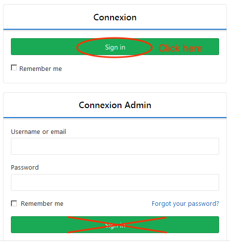
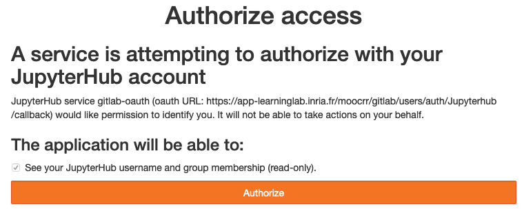
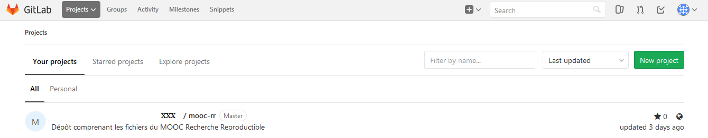
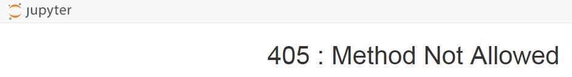
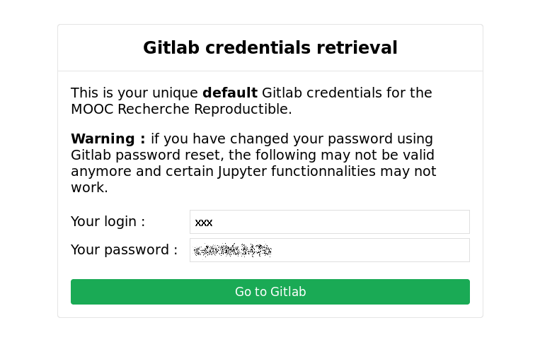
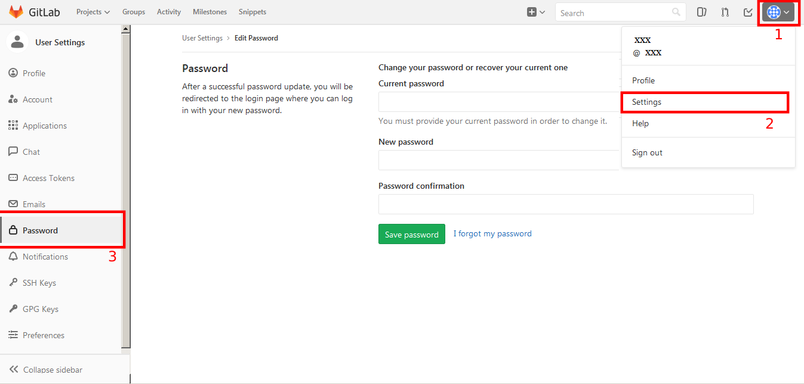
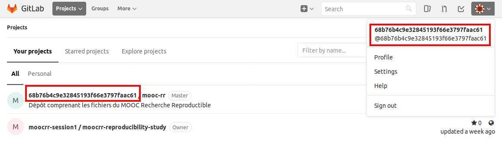

#+OPTIONS: ':nil *:t -:t ::t <:t H:3 \n:nil ^:t arch:headline
#+OPTIONS: author:t broken-links:nil c:nil creator:nil
#+OPTIONS: d:(not "LOGBOOK") date:t e:t email:nil f:t inline:t num:t
#+OPTIONS: p:nil pri:nil prop:nil stat:t tags:t tasks:t tex:t
#+OPTIONS: timestamp:t title:t toc:t todo:t |:t
#+TITLE: Gitlab interface in the Mooc
#+DATE: <2019-03-26 mar.>
#+AUTHOR: Arnaud Legrand, Laurence Farhi
#+EMAIL: arnaud.legrand@imag.fr
#+LANGUAGE: fr
#+SELECT_TAGS: export
#+EXCLUDE_TAGS: noexport
#+CREATOR: Emacs 26.1 (Org mode 9.1.9)
#+STARTUP: indent

** Access your Gitlab repository
This section describes the successive steps involved to access your
Gitlab repository after from the FUN platform after clicking on the
button "*Accéder à Gitlab / Access to Gitlab*".

- You reach the following form:
  #+BEGIN_CENTER
  
  #+END_CENTER
- Click on *Sign in*. below "*Connexion*" label. The "Connexion Admin" frame is reserved for
  Gitlab interface administrators. Authentication is automatic at that
  stage.
- Attention, the first time you connect to your Gitlab repository, you get the following message:
  #+BEGIN_CENTER
  
  #+END_CENTER
- Click on **Authorize*.
  #+BEGIN_CENTER
  
  #+END_CENTER

  The long string replaced here by =xxx= is the login you will have to
  use in Git to synchronize with GitLab.
-  *NB* : You must reach GitLab from the FUN platform. You are likely to get a "405 error" if you are using the following address: https://app-learninglab.inria.fr/gitlab/users/sign_in.

    #+BEGIN_CENTER
    
    #+END_CENTER

** Recover your password
To recover a predefined password you must use [[https://app-learninglab.inria.fr/moocrr/jupyter/services/password][Gitlab
  credentials retrieval tool]]. One gets then the login and password.

  #+BEGIN_CENTER
  
  #+END_CENTER

** Modify your password

 You can change this password in "Account / Parameters / Password". We do not recommend doing it since that will block you from using the Jupyter notebooks of this MOOC.
  #+BEGIN_CENTER
  
  #+END_CENTER

** To go learn more about git/Gitlab
If you want to go further, few tutorial videos are gathered in [[https://www.fun-mooc.fr/courses/course-v1:inria+41016+self-paced/jump_to_id/7508aece244548349424dfd61ee3ba85][sequence "7. Installations, configurations, references" of module 2]]
of this MOOC.
** In case of problems with Gitlab
In case of problem, contact us via the forum. In order to help you
solve any problems, please give us your LTI identifier (external
identifier automatically assigned for GitLab and Jupyter) 
that you can find on your GitLab account (see capture below).
#+BEGIN_CENTER
 
#+END_CENTER
