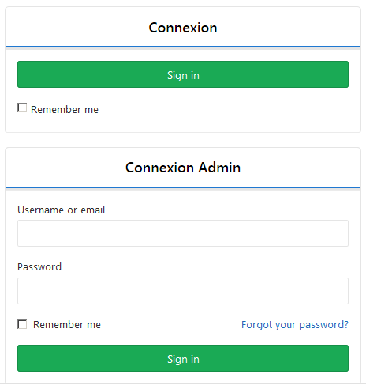

#+OPTIONS: ':nil *:t -:t ::t <:t H:3 \n:nil ^:t arch:headline
#+OPTIONS: author:t broken-links:nil c:nil creator:nil
#+OPTIONS: d:(not "LOGBOOK") date:t e:t email:nil f:t inline:t num:t
#+OPTIONS: p:nil pri:nil prop:nil stat:t tags:t tasks:t tex:t
#+OPTIONS: timestamp:t title:t toc:t todo:t |:t
#+TITLE: Pérénité et évolutivité avec la gestion de version
#+DATE: <2019-03-26 mar.>
#+AUTHOR: Christophe Pouzat
#+EMAIL: christophe.pouzat@parisdescartes.fr
#+LANGUAGE: fr
#+SELECT_TAGS: export
#+EXCLUDE_TAGS: noexport
#+CREATOR: Emacs 26.1 (Org mode 9.1.9)
#+STARTUP: indent

* Table des matières                                         :TOC:
- [[#gestion-de-version-avec-gitlab-et-git-dans-le-mooc-recherche-reproductible][Gestion de version avec GitLab et Git dans le MOOC "Recherche reproductible"]]
- [[#gestion-de-version-dans-libreoffice-ou-dans-dokuwiki][Gestion de version dans LibreOffice ou dans DokuWiki]]

* Gestion de version avec GitLab et Git dans le MOOC "Recherche reproductible"
Nous avons déployé un GitLab spécialement pour ce MOOC afin que vous
puissiez vous familiariser en douceur avec la gestion de
version. Cette section décrit étape par étape comment y accéder. [[https://www.fun-mooc.fr/courses/course-v1:inria+41016+self-paced/jump_to_id/5571950188c946e790f06d4bc90fb5f6#InterfaceGitlab][Cette
vidéo]] illustre ces étapes ainsi que comment utiliser GitLab. Nous vous
incitons vivement à la regarder si vous n'êtes pas familiers avec ce
type d'environnement.

- Accéder à [[https://www.fun-mooc.fr/courses/course-v1:inria+41016+self-paced/jump_to_id/5571950188c946e790f06d4bc90fb5f6#FormAccesGitlab][GitLab]] depuis la plateforme FUN (cliquez sur *Accédez à
  Gitlab / Access to Gitlab*)
- Vous arrivez sur le formulaire suivant :
  #+BEGIN_CENTER
  
  #+END_CENTER
  - NB : Il faut accéder à Gitlab depuis la plateforme FUN. Vous risquez
    d'obtenir une erreur 405 en accédant directement à la page https://app-learninglab.inria.fr/gitlab/users/sign_in.
    #+BEGIN_CENTER
    [[file:gitlab_images/erreur405.png]]
    #+END_CENTER
- Cliquer sur le premier **Sign in**. L'authentification est automatique à cette étape.
  #+BEGIN_CENTER
  [[file:gitlab_images/projects.png]]
  #+END_CENTER

  La grande chaîne de caractères remplacée ici par =xxx= est le login qu'il faudra utiliser dans Git pour accéder à Gitlab.

- Pour récupérer le mot de passe prédéfini, il faut utiliser le [[https://app-learninglab.inria.fr/jupyterhub/services/password][Gitlab
  credentials retrieval tool]]. On retrouve alors le login et le mot de
  passe.
  #+BEGIN_CENTER
  [[file:gitlab_images/password_retrieval.png]]
  #+END_CENTER

- Il est possible de modifier ce mot de passe dans "Account /
  Paramètres / Mot de passe". Mais nous vous déconseillons de le faire
  car cela vous empêchera d'utiliser les notebook Jupyter du MOOC.
  #+BEGIN_CENTER
  [[file:gitlab_images/password.png]]
  #+END_CENTER

Enfin, pour ceux qui veulent aller plus plus loin et en savoir plus
sur l'outil de gestion de version git sur lequel s'appuie GitLab,
quelques vidéos de démonstration sur git et Gitlab sont proposées dans
la [[https://www.fun-mooc.fr/courses/course-v1:inria+41016+self-paced/jump_to_id/7508aece244548349424dfd61ee3ba85][séquence "7. Installations, configurations, references" du module 2]]
de ce Mooc ainsi que des ressources pour apprivoiser git en ligne de commandes.

* Gestion de version dans LibreOffice ou dans DokuWiki
L'enregistrement des modifications des fichiers générés et gérés par =LibreOffice= est succinctement décrite sur la [[https://help.libreoffice.org/Common/Recording_Changes/fr][page du Wiki]] de ce logiciel. Une espèce de [[https://help.libreoffice.org/Common/Navigating_Changes/fr][sommaire]] des pages concernant la gestion des modifications est également disponible. Le livre [[https://framabook.org/libreoffice-cest-style/][LibreOffice, c’est stylé !]] téléchargeable gratuitement (et légalement) ne semble pas aborder la question. Sa version source est disponible sur [[https://framagit.org/Framatophe/DWL/][framagit]]= (un autre serveur type GitLab) et est écrite en… =markdown= !

Pour DokuWiki, le plus simple est de consulter le [[https://www.dokuwiki.org/fr:dokuwiki][Wiki]] écrit, cette fois au moins !, en DokuWiki.
