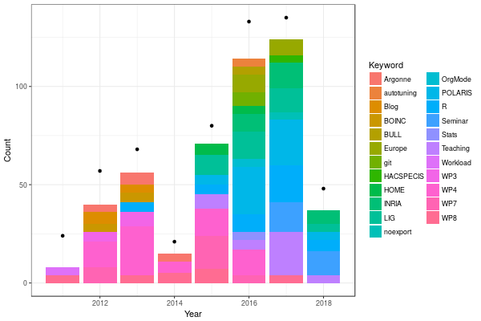
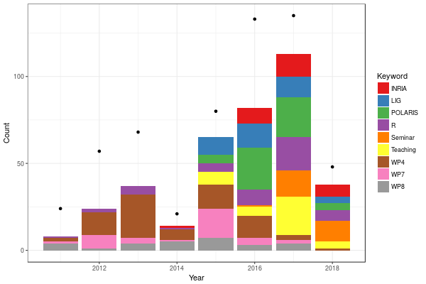
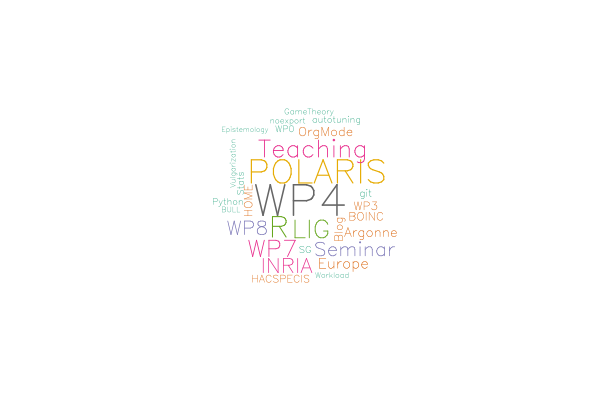

#+TITLE: Analyzing my journal's keywords
#+LANGUAGE: fr

#+HTML_HEAD: <link rel="stylesheet" type="text/css" href="http://www.pirilampo.org/styles/readtheorg/css/htmlize.css"/>
#+HTML_HEAD: <link rel="stylesheet" type="text/css" href="http://www.pirilampo.org/styles/readtheorg/css/readtheorg.css"/>
#+HTML_HEAD: 
#+HTML_HEAD: 
#+HTML_HEAD: 
#+HTML_HEAD: 

#+PROPERTY: header-args  :session  :exports both  :eval never-export

I'm a lucky person as I do not have to account too precisely for how
much time I spend working on such or such topic. This is good as I
really like my freedom and I feel I would not like having to monitor
my activity on a daily basis. However, as you may have noticed in the
videos of this module, I keep track of a large amount of information
in my journal and I tag them (most of the time). So I thought it might
be interesting to see whether these tags could reveal something about
the evolution of my professional interest. I have no intention to
deduce anything really significant from a statistical point of view,
in particular as I know my tagging rigor and the tag semantic has
evolved through time. So it will be purely exploratory..

* Data Processing and Curation
My journal is stored in ~/home/alegrand/org/journal.org~. Level 1
entries (1 star) indicate the year. Level 2 entries (2 stars) indicate
the month. Level 3 entries (3 stars) indicate the day and finally
entries with a depth larger than 3 are generally the important ones
and indicate on what I've been working on this particular day. These
are the entries that may be tagged. The tags appear in the end of
theses lines and are surrounded with =:=.

So let's try to extract the lines with exactly three ~*~ in the beginning
of the line (the date) and those that start with a ~*~ and end with tags
(between ~:~ and possibly followed by spaces). The corresponding regular
expression is not perfect but it is a first attempt and will give me
an idea of how much parsing and string processing I'll have to do.

#+begin_src shell :results output :exports both :eval never-export 
grep -e '^\*\*\* ' -e '^\*.*:.*: *$' ~/org/journal.org | tail -n 20
#+end_src

#+RESULTS:
#+begin_example
,*** 2018-06-01 vendredi
,**** CP Inria du 01/06/18                                  :POLARIS:INRIA:
,*** 2018-06-04 lundi
,*** 2018-06-07 jeudi
,**** The Cognitive Packet Network - Reinforcement based Network Routing with Random Neural Networks (Erol Gelenbe) :Seminar:
,*** 2018-06-08 vendredi
,**** The credibility revolution in psychological science: the view from an editor's desk (Simine Vazire, UC DAVIS) :Seminar:
,*** 2018-06-11 lundi
,**** LIG leaders du 11 juin 2018                             :POLARIS:LIG:
,*** 2018-06-12 mardi
,**** geom_ribbon with discrete x scale                                  :R:
,*** 2018-06-13 mercredi
,*** 2018-06-14 jeudi
,*** 2018-06-20 mercredi
,*** 2018-06-21 jeudi
,*** 2018-06-22 vendredi
,**** Discussion Nicolas Benoit (TGCC, Bruyère)                    :SG:WP4:
,*** 2018-06-25 lundi
,*** 2018-06-26 mardi
,**** Point budget/contrats POLARIS                         :POLARIS:INRIA:
#+end_example

OK, that's not so bad. There are actually many entries that are not
tagged. Never mind! There are also often several tags for a same entry
and several entries for a same day. If I want to add the date in front
of each key word, I'd rather use a real language rather than trying to
do it only with shell commands. I'm old-school so I'm more used to
using Perl than using Python. Amusingly, it is way easier to write (it
took me about 5 minutes) than to read... \smiley

#+begin_src perl :results output :exports both :eval never-export
open INPUT, "/home/alegrand/org/journal.org" or die $_;
open OUTPUT, "> ./org_keywords.csv" or die;
$date="";
print OUTPUT "Date,Keyword\n";
%skip = my %params = map { $_ => 1 } ("", "ATTACH", "Alvin", "Fred", "Mt", "Henri", "HenriRaf");

while(defined($line=<INPUT>)) {
    chomp($line);
    if($line =~ '^\*\*\* (20[\d\-]*)') {
	$date=$1;
    }
    if($line =~ '^\*.*(:\w*:)\s*$') {
	@kw=split(/:/,$1);
	if($date eq "") { next;}
	foreach $k (@kw) {
	    if(exists($skip{$k})) { next;}
	    print OUTPUT "$date,$k\n";
	}
    }
}
#+end_src

#+RESULTS:

Let's check the result:
#+begin_src shell :results output :exports both
head org_keywords.csv
echo "..."
tail org_keywords.csv
#+end_src

#+RESULTS:
#+begin_example
Date,Keyword
2011-02-08,R
2011-02-08,Blog
2011-02-08,WP8
2011-02-08,WP8
2011-02-08,WP8
2011-02-17,WP0
2011-02-23,WP0
2011-04-05,Workload
2011-05-17,Workload
...
2018-05-17,POLARIS
2018-05-30,INRIA
2018-05-31,LIG
2018-06-01,INRIA
2018-06-07,Seminar
2018-06-08,Seminar
2018-06-11,LIG
2018-06-12,R
2018-06-22,WP4
2018-06-26,INRIA
#+end_example

Awesome! That's exactly what I wanted.

* Basic Statistics
Again, I'm much more comfortable using R than using Python. I'll try
not to reinvent the wheel and I'll use the tidyverse packages as soon
as they appear useful. Let's start by reading data::
#+begin_src R :results output :session *R* :exports both
library(lubridate) # à installer via install.package("tidyverse")
library(dplyr)
df=read.csv("./org_keywords.csv",header=T)
df$Year=year(date(df$Date))
#+end_src

#+RESULTS:
#+begin_example

Attachement du package : ‘lubridate’

The following object is masked from ‘package:base’:

    date

Attachement du package : ‘dplyr’

The following objects are masked from ‘package:lubridate’:

    intersect, setdiff, union

The following objects are masked from ‘package:stats’:

    filter, lag

The following objects are masked from ‘package:base’:

    intersect, setdiff, setequal, union
#+end_example

What does it look like ?
#+begin_src R :results output :session *R* :exports both
str(df)
summary(df)
#+end_src

#+RESULTS:
#+begin_example
'data.frame':	566 obs. of  3 variables:
 $ Date   : Factor w/ 420 levels "2011-02-08","2011-02-17",..: 1 1 1 1 1 2 3 4 5 6 ...
 $ Keyword: Factor w/ 36 levels "Argonne","autotuning",..: 22 3 36 36 36 30 30 29 29 36 ...
 $ Year   : num  2011 2011 2011 2011 2011 ...
         Date         Keyword         Year     
 2011-02-08:  5   WP4     : 77   Min.   :2011  
 2016-01-06:  5   POLARIS : 56   1st Qu.:2013  
 2016-03-29:  5   R       : 48   Median :2016  
 2017-12-11:  5   LIG     : 40   Mean   :2015  
 2017-12-12:  5   Teaching: 38   3rd Qu.:2017  
 2016-01-26:  4   WP7     : 36   Max.   :2018  
 (Other)   :537   (Other) :271
#+end_example

Types appear to be correct. 568 entries. Nothing strange, let's keep going.
#+begin_src R :results output :session *R* :exports both
df %>% group_by(Keyword, Year) %>% summarize(Count=n()) %>% 
   ungroup() %>% arrange(Keyword,Year) -> df_summarized
df_summarized
#+end_src

#+RESULTS:
#+begin_example
# A tibble: 120 x 3
   Keyword     Year Count
   <fct>      <dbl> <int>
 1 Argonne     2012     4
 2 Argonne     2013     6
 3 Argonne     2014     4
 4 Argonne     2015     1
 5 autotuning  2012     2
 6 autotuning  2014     1
 7 autotuning  2016     4
 8 Blog        2011     2
 9 Blog        2012     6
10 Blog        2013     4
# ... with 110 more rows
#+end_example

Let's start by counting how many annotations I do per year:
#+begin_src R :results output :session *R* :exports both
df_summarized_total_year = df_summarized %>% group_by(Year) %>% summarize(Cout=sum(Count))
df_summarized_total_year
#+end_src

#+RESULTS:
#+begin_example
# A tibble: 8 x 2
   Year  Cout
  <dbl> <int>
1  2011    24
2  2012    57
3  2013    68
4  2014    21
5  2015    80
6  2016   133
7  2017   135
8  2018    48
#+end_example

Good. It looks like I'm improving over time. 2014 was a bad year and I
apparently forgot to review and tag on a regular basis.

Tags are free so maybe some tags are scarcely used. Let's have a look.
#+begin_src R :results output :session *R* :exports both
df_summarized %>% group_by(Keyword) %>% summarize(Count=sum(Count)) %>%  arrange(Count) %>% as.data.frame()
#+end_src

#+RESULTS:
#+begin_example
         Keyword Count
1       Gradient     1
2          LaTeX     1
3         Orange     1
4             PF     1
5        twitter     2
6            WP1     2
7            WP6     2
8   Epistemology     3
9           BULL     4
10 Vulgarization     4
11      Workload     4
12    GameTheory     5
13      noexport     5
14    autotuning     7
15        Python     7
16         Stats     7
17           WP0     7
18            SG     8
19           git     9
20     HACSPECIS    10
21          Blog    12
22         BOINC    12
23          HOME    12
24           WP3    12
25       OrgMode    14
26       Argonne    15
27        Europe    18
28       Seminar    28
29           WP8    28
30         INRIA    30
31           WP7    36
32      Teaching    38
33           LIG    40
34             R    48
35       POLARIS    56
36           WP4    77
#+end_example

OK, in the following, I'll restrict to the tags that appear at least
three times.

* Nice Looking Graphics
Ideally, I would define a semantic and a hierarchy for my tags but I'm
running out of time. Since I've decided to remove rare tags, I'll also
count the total number of tags to get an idea of how much information
I've lost. Let's try a first representation:
#+begin_src R :results output graphics :file barchart1.png :exports both :width 600 :height 400 :session *R* 
library(ggplot2)
df_summarized %>% filter(Count > 3) %>%
    ggplot(aes(x=Year, y=Count)) + 
    geom_bar(aes(fill=Keyword),stat="identity") + 
    geom_point(data=df_summarized %>% group_by(Year) %>% summarize(Count=sum(Count))) +
    theme_bw()
#+end_src

#+RESULTS:

Aouch! This is very hard to read, in particular because of the many
different colors and the continuous palette that prevents to
distinguish between tags. Let's try an other palette ("Set1") where
colors are very different. Unfortunately there are only 9 colors in
this palette so I'll first have to select the 9 more frequent tags.

#+begin_src R :results output graphics :file barchart2.png :exports both :width 600 :height 400 :session *R* 
library(ggplot2)
frequent_keywords = df_summarized %>% group_by(Keyword) %>% 
    summarize(Count=sum(Count)) %>%  arrange(Count) %>% 
    as.data.frame() %>% tail(n=9)

df_summarized %>% filter(Keyword %in% frequent_keywords$Keyword) %>%
    ggplot(aes(x=Year, y=Count)) + 
    geom_bar(aes(fill=Keyword),stat="identity") + 
    geom_point(data=df_summarized %>% group_by(Year) %>% summarize(Count=sum(Count))) +
    theme_bw() + scale_fill_brewer(palette="Set1")
#+end_src

#+RESULTS:

OK. That's much better. It appears like the administration part
(~Inria~, ~LIG~, ~POLARIS~) and the teaching part (~Teaching~) increases. The
increasing usage of the ~R~ tag is probably reflecting my improvement in
using this tool. The evolution of the ~Seminar~ tag is meaningless as I
only recently started to systematically tag my seminar notes. The ~WP~
tags are related to a former ANR project but I've kept using the same
annotation style (~WP4~ = performance evaluation of HPC systems, ~WP7~ =
data analysis and visualization, ~WP8~ = design of
experiments/experiment engines/reproducible research...). 
~WP4~ is decreasing but it is because most of the work on this topic is
now in my students' labbbooks since they are doing all the real work
which I'm mostly supervising.

Well, such kind of exploratory analysis would not be complete without
a /wordcloud/ (most of the time completely unreadable but also so hype!
\smiley). To this end, I followed the ideas presented in this blog post:
http://onertipaday.blogspot.com/2011/07/word-cloud-in-r.html

#+begin_src R :results output graphics :file wordcloud.png :exports both :width 600 :height 400 :session *R* 
library(wordcloud) # à installer via install.package("wordcloud")
library(RColorBrewer)
pal2 <- brewer.pal(8,"Dark2")
df_summarized %>% group_by(Keyword) %>% summarize(Count=sum(Count)) -> df_summarized_keyword
wordcloud(df_summarized_keyword$Keyword, df_summarized_keyword$Count,
     random.order=FALSE, rot.per=.15, colors=pal2, vfont=c("sans serif","plain"))
#+end_src

#+RESULTS:

Voilà! It is "nice" but rather useless, especially with so few words
and such a poor semantic.
