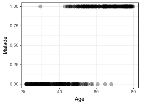
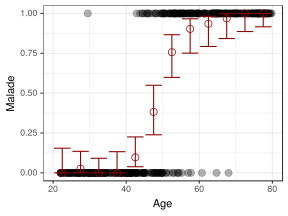
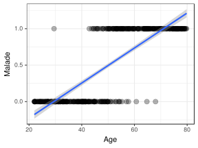
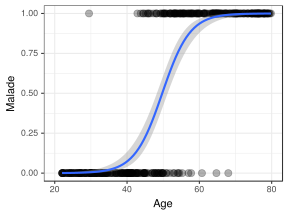
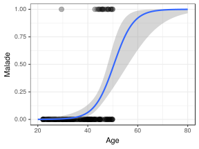

#+TITLE: Analysis of the risk of failure of the toric joints of the space shuttle Challenger
#+AUTHOR: Konrad Hinsen, Arnaud Legrand, Christophe Pouzat
#+DATE: Juin 2018
#+LANGUAGE: en

#+OPTIONS: H:3 creator:nil timestamp:nil skip:nil toc:nil num:t ^:nil ~:~ 
# #+OPTIONS: author:nil title:nil date:nil

#+HTML_HEAD: <link rel="stylesheet" type="text/css" href="http://www.pirilampo.org/styles/readtheorg/css/htmlize.css"/>
#+HTML_HEAD: <link rel="stylesheet" type="text/css" href="http://www.pirilampo.org/styles/readtheorg/css/readtheorg.css"/>
#+HTML_HEAD: 
#+HTML_HEAD: 
#+HTML_HEAD: 
#+HTML_HEAD: 

#+LATEX_HEADER: \usepackage[utf8]{inputenc}
#+LATEX_HEADER: \usepackage[T1]{fontenc}
#+LATEX_HEADER: \usepackage{textcomp}
#+LATEX_HEADER: \usepackage[a4paper,margin=.8in]{geometry}
#+LATEX_HEADER: \usepackage[usenames,dvipsnames,svgnames,table]{xcolor}
#+LATEX_HEADER: \usepackage{palatino}
#+LATEX_HEADER: \usepackage{svg}
#+LATEX_HEADER: \let\epsilon=\varepsilon

*Forword:* The explanations given in this document about the context
of the study have been taken from the excellent book /Visual
Explanations: Images and Quantities, Evidence and Narrative/ by Edward
R. Tufte, published in 1997 by /Graphics Press/ and re-edited in 2005,
and from the article /Risk Analysis of the Space Shuttle:
Pre-Challenger Prediction of Failure/ by Dalal et al., published in
1989 in the /Journal of the American Statistical Association/.

* Context
In this study, we propose a re-examination of the [[https://en.wikipedia.org/wiki/Space_Shuttle_Challenger_disaster][space shuttle
Challenger disaster]]. On January 28th, 1986, the space shuttle
Challenged exploded 73 seconds after launch (see Figure [[fig:photo]]),
causing the death of the seven astronauts on board. The explosion was
caused by the failure of the two O-ring seals between the upper and
lower parts of the boosters (see Figure [[fig:oring]]). The seals had
lost their efficiency because of the exceptionally cold weather at the
time of launch. The temperature on that morning was just below 0°C,
whereas the preceding flights hat been launched at temperatures at
least 7 to 10°C higher.

#+NAME:   fig:photo
#+ATTR_LATEX: :width 10cm
#+CAPTION: Photographs of the Challenger catastrophe.
file:challenger5.jpg

#+NAME:   fig:oring
#+ATTR_LATEX: :width 10cm
#+CAPTION: Diagram of the boosters of space shuttle Challenger. The rubber O-ring seals (a principal and a secondary one) of more than 11 meter circumference prevent  leaks between the upper and lower parts.
file:o-ring.png
# From
# https://i0.wp.com/www.kylehailey.com/wp-content/uploads/2014/01/Screen-Shot-2013-12-30-at-12.05.04-PM-1024x679.png?zoom=2&resize=594%2C393

What is most astonishing is that the precise cause of the accident had
been intensely debated several days before and ws still under
discussion the day before the launch, during a three-hour
teleconference involving engineers from Morton Thiokol (the supplier
of the engines) and from NASA. Whereas the immediate cause of the
accident, the failure of the O-ringe, was quickly identified, the
underlying causes of the disaster have regularly served as a case
study, be it in management training (work organisation, decision
taking in spite of political pressure, communication problems),
statistics (risk evaluation, modelisation, data visualization), or
sociology (history, bureaucracy, conforming to organisational norms).

In the study that we propose, we are mainly concerned with the
statistical aspect, which however is only one piece of the puzzle. We
invite you to read the documentes cited in the foreword for more
information. The following study takes up a part of the analyses that
were done that night with the goal of evaluating the potential impact
of temperature and air pressure on the probability of O-ring
malfunction. The starting point is experimental results obtained by
NASA engineers over the six years preceding the Challenger launch.

In the directory ~module2/exo5/~ of your GitLab workspace, you will
find the original data as welas an analysis for each of the paths we
offer. This analysis consists of four steps:

1. Loading the data
2. Visual inspection
3. Estimation of the influence of temperature
4. Estimation of the probability of O-ring malfunction

The first two steps require only a basic knowledge of R or Python. The
third step assumes some familiarity with logistic regression, and the
fourth a basic knowledge of probability. In the next section, we give
an introduction to logistic regression that skips the details of the
computations and focuses instead on the interpretation of the results.

* Introduction to logistic regression

Suppose we have the following dataset that indicates for a group of
people of varying age if they suffer from a specific illness or not. I
will present the analysis in R but Python code would look quite
similar. The data are stored in a data frame that is summarized as:

#+begin_src R :results output :session *R* :exports none
library(Hmisc) # pour calculer un intervalle de confiance sur des données binomiales
library(ggplot2)
library(dplyr)
set.seed(42)
proba = function(age) {
    val=(age-50)/4
    return(exp(val)/(1+exp(val)))
}
df = data.frame(Age = runif(400,min=22,max=80))
df$Ill = sapply(df$Age, function(x) rbinom(n=1,size=1,prob=proba(x)))
#+end_src

#+RESULTS:

#+begin_src R :results output :session *R* :exports both
summary(df)
str(df)
#+end_src

#+RESULTS:
#+begin_example
      Age             Ill       
 Min.   :22.01   Min.   :0.000  
 1st Qu.:35.85   1st Qu.:0.000  
 Median :50.37   Median :1.000  
 Mean   :50.83   Mean   :0.515  
 3rd Qu.:65.37   3rd Qu.:1.000  
 Max.   :79.80   Max.   :1.000
'data.frame':	400 obs. of  2 variables:
 $ Age: num  75.1 76.4 38.6 70.2 59.2 ...
 $ Ill: int  1 1 0 1 1 1 0 0 1 1 ...
#+end_example

Here is a plot that provides a better indication of the link that
could exist between age and illness:

#+begin_src R :results output graphics :file fig1.svg :exports both :width 4 :height 3 :session *R* 
ggplot(df,aes(x=Age,y=Ill)) + geom_point(alpha=.3,size=3) + theme_bw()
#+end_src

#+ATTR_LATEX: :width 8cm
#+RESULTS:

Clearly the probability of suffering from this illness increases with
age. But how can we estimate this probability based only on this
binary data ill/not ill? For each age slice (of, for example, 5
years), we could look at the frequency of the illness. The following
code is a bit complicated because the computation of the confidence
interval for this kind of data requires a particular treatment using
the function =binconf=.

#+begin_src R :results output graphics :file fig1bis.svg :exports both :width 4 :height 3 :session *R* 
age_range=5
df_grouped = df %>% mutate(Age=age_range*(floor(Age/age_range)+.5)) %>%
                    group_by(Age) %>% summarise(Ill=sum(Ill),N=n()) %>% 
                    rowwise() %>% 
                    do(data.frame(Age=.$Age, binconf(.$Ill, .$N, alpha=0.05))) %>%
                    as.data.frame()

ggplot(df_grouped,aes(x=Age)) + geom_point(data=df,aes(y=Ill),alpha=.3,size=3)  +
    geom_errorbar(data=df_grouped,
                  aes(x=Age,ymin=Lower, ymax=Upper, y=PointEst), color="darkred") +
    geom_point(data=df_grouped, aes(x=Age, y=PointEst), size=3, shape=21, color="darkred") +
    theme_bw() 
#+end_src

#+ATTR_LATEX: :width 8cm
#+RESULTS:

A disadvantage of this method is that the computation is done
independently for each age slice, which moreover has been chosen
arbitrarily. For describing the evolution in a more continuous
fashion, we could apply a linear regression (which is the simplest
model for taking into account the influence of a parameter) and thus estimate the impact of age on the probability of illness:

#+begin_src R :results output graphics :file fig2.svg :exports both :width 4 :height 3 :session *R* 
ggplot(df,aes(x=Age,y=Ill)) + geom_point(alpha=.3,size=3) + 
    theme_bw() + geom_smooth(method="lm")
#+end_src

#+ATTR_LATEX: :width 8cm
#+RESULTS:

The blue line is the linear regression in the sense of least squares,
and the grey zone is the 95% confidence interval of this
estimation. In other words, given the dataset and the hypothesis of
linearity, the blue line is the most probable one and there is a 95%
chance that the true line is in the grey zone.

It is, however, clear from the plot that this estimation is
meaningless. A probability must lie between 0 and 1, whereas a linear
regression will inevitably lead to impossible values (negative or
greater than 1) for somewhat extreme age values (young or old).  The
reason is simply that a linear regression implies the hypothesis
$\textsf{Ill} = \alpha.\textsf{Age} + \beta + \epsilon$, where
$\alpha$ and $\beta$ are real numbers and $\epsilon$ is a noise (a
random variable of mean zero), wihh $\alpha$ and $\beta$ estimated
from the data. This doesn't make sense for estimating a probability,
and therefore [[https://en.wikipedia.org/wiki/Logistic_regression][logistic regression]] is a better choice:

#+begin_src R :results output graphics :file fig3.svg :exports both :width 4 :height 3 :session *R* 
ggplot(df,aes(x=Age,y=Ill)) + geom_point(alpha=.3,size=3) + 
    theme_bw() + 
    geom_smooth(method = "glm", 
        method.args = list(family = "binomial")) + xlim(20,80)
#+end_src

#+ATTR_LATEX: :width 8cm
#+RESULTS:

Here the =ggplot= library does all the computations for us and only
shows the result graphically, but in the Challenger risk analysis we
perform the regression and prediction "by hand" in =R= or =Python=
(depending on the path you have chosen), so that we can inspect the
results in more detail. Like before, the blue line indicates the
estimation of the probability of being ill as a function of age, and
the grey zone informs us about the uncertainty of this estimate, i.e.
given the hypotheses and the dataset, there is a 95% chance for the
true curve to lie somewhere in the grey zone.

In this model, the assumption is $P[\textsf{Ill}] = \pi(\textsf{Age})$
with $\displaystyle\pi(x)=\frac{e^{\alpha.x + \beta}}{1+e^{\alpha.x +
\beta}}$. This at first look strange formule has the nice property of
always yielding a value between zero and one, and to approach 0 and 1
rapidly as the age tends to $-\infty$ or $+\infty$, but this is not
the only motivation for this choice.

In summary, when we have event-like data (binary) and we wish to
estimate the influence of a parameter on the probability of the event
occurring (illness, failure, ...), the most natural and simple model
is logistic regression. Note that even if we restrain ourselves to a
small part of the dta, e.g. only patients less than 50 years old, it
is possible to get a reasonable estimate, even though, as is to be
expected, the uncertainty grows rapidly.

#+begin_src R :results output graphics :file fig4.svg :exports both :width 4 :height 3 :session *R* 
ggplot(df[df$Age<50,],aes(x=Age,y=Ill)) + geom_point(alpha=.3,size=3) + 
    theme_bw() + 
    geom_smooth(method = "glm", 
        method.args = list(family = "binomial"),fullrange = TRUE) + xlim(20,80)
#+end_src

#+ATTR_LATEX: :width 8cm
#+RESULTS:

* Emacs Setup 							   :noexport:
  This document has local variables in its postembule, which should
  allow Org-mode (9) to work seamlessly without any setup. If you're
  uncomfortable using such variables, you can safely ignore them at
  startup. Exporting may require that you copy them in your .emacs.

# Local Variables:
# eval: (add-to-list 'org-latex-packages-alist '("" "minted"))
# eval: (setq org-latex-listings 'minted) 
# eval:    (setq org-latex-minted-options '(("style" "Tango") ("bgcolor" "Moccasin") ("frame" "lines") ("linenos" "true") ("fontsize" "\\small")))
# eval: (setq org-latex-pdf-process '("pdflatex -shell-escape -interaction nonstopmode -output-directory %o %f" "pdflatex -shell-escape -interaction nonstopmode -output-directory %o %f" "pdflatex -shell-escape -interaction nonstopmode -output-directory %o %f"))
# End:
