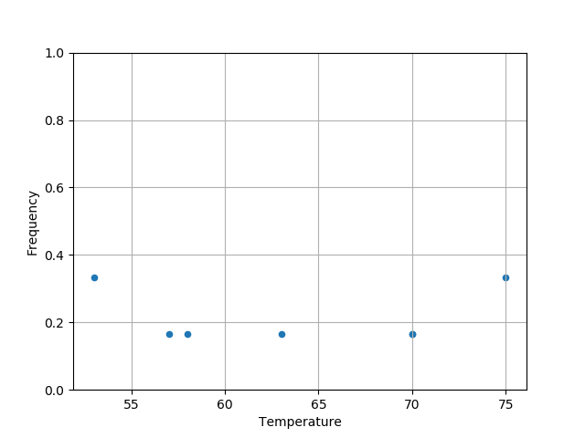
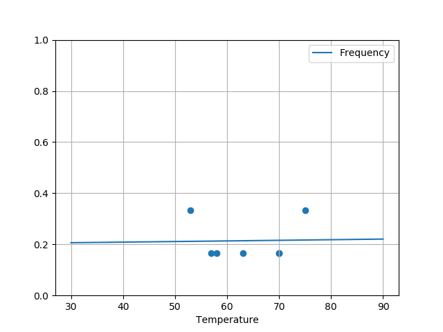

#+TITLE: Analysis of the risk of failure of the O-rings on the Challenger shuttle
#+AUTHOR: Arnaud Legrand
#+LANGUAGE: fr

#+HTML_HEAD: <link rel="stylesheet" type="text/css" href="http://www.pirilampo.org/styles/readtheorg/css/htmlize.css"/>
#+HTML_HEAD: <link rel="stylesheet" type="text/css" href="http://www.pirilampo.org/styles/readtheorg/css/readtheorg.css"/>
#+HTML_HEAD: 
#+HTML_HEAD: 
#+HTML_HEAD: 
#+HTML_HEAD: 

#+LATEX_HEADER: \usepackage{a4}
#+LATEX_HEADER: \usepackage[french]{babel}

# #+PROPERTY: header-args  :session  :exports both

On January 27, 1986, the day before the takeoff of the shuttle /Challenger/, had
held a three-hour teleconference between the
Morton Thiokol (manufacturer of one of the engines) and NASA. The
discussion focused on the consequences of the
temperature at take-off of 31°F (just below
0°C) on the success of the flight and in particular on the performance of the
O-rings used in motors. Indeed, no test
had been performed at this temperature.

The following study therefore takes up some of the analyses carried out in this study
night and whose objective was to assess the potential influence of
the temperature and pressure to which the seals are subjected
O-rings on their probability of malfunction. To do this, we
have the results of the experiments carried out by the engineers
of NASA during the 6 years preceding the launch of the shuttle
Challenger.

* Data loading
So we start by loading this data:
#+begin_src python :results value :session *python* :exports both
import numpy as np
import pandas as pd
data = pd.read_csv("shuttle.csv")
data
#+end_src

#+RESULTS:
#+begin_example
         Date  Count  Temperature  Pressure  Malfunction
0     4/12/81      6           66        50            0
1    11/12/81      6           70        50            1
2     3/22/82      6           69        50            0
3    11/11/82      6           68        50            0
4     4/04/83      6           67        50            0
5     6/18/82      6           72        50            0
6     8/30/83      6           73       100            0
7    11/28/83      6           70       100            0
8     2/03/84      6           57       200            1
9     4/06/84      6           63       200            1
10    8/30/84      6           70       200            1
11   10/05/84      6           78       200            0
12   11/08/84      6           67       200            0
13    1/24/85      6           53       200            2
14    4/12/85      6           67       200            0
15    4/29/85      6           75       200            0
16    6/17/85      6           70       200            0
17  7/2903/85      6           81       200            0
18    8/27/85      6           76       200            0
19   10/03/85      6           79       200            0
20   10/30/85      6           75       200            2
21   11/26/85      6           76       200            0
22    1/12/86      6           58       200            1
#+end_example

The data set shows us the date of the test, the number of joints
(there are 6 on the main launcher), the
temperature (in Fahrenheit) and pressure (in psi), and finally the
number of identified dysfunctions.

* Graphical data inspection
Flights where no incidents are found that do not provide any information
on the influence of temperature or pressure on the
dysfunctions, we focus on experiences where in the
at least one seal was defective.

#+begin_src python :results value :session *python* :exports both
data = data[data.Malfunction>0]
data
#+end_src

#+RESULTS:
:         Date  Count  Temperature  Pressure  Malfunction
: 1   11/12/81      6           70        50            1
: 8    2/03/84      6           57       200            1
: 9    4/06/84      6           63       200            1
: 10   8/30/84      6           70       200            1
: 13   1/24/85      6           53       200            2
: 20  10/30/85      6           75       200            2
: 22   1/12/86      6           58       200            1

All right, we have a high temperature variability but
the pressure is almost always 200, which should
simplify the analysis.

How does the frequency of failure vary with temperature?
#+begin_src python :results output file :var matplot_lib_filename="freq_temp_python.png" :exports both :session *python*
import matplotlib.pyplot as plt

plt.clf()
data["Frequency"]=data.Malfunction/data.Count
data.plot(x="Temperature",y="Frequency",kind="scatter",ylim=[0,1])
plt.grid(True)

plt.savefig(matplot_lib_filename)
print(matplot_lib_filename)
#+end_src

#+RESULTS:

At first sight, it's not obvious but good, let's try it anyway
to estimate the impact of temperature $t$ on the probability of
malfunctions of a seal.

* Estimation of the temperature influence

Suppose that each of the 6 toroidal seals is damaged with the same
probability and independently of the others and that this probability does not
depends only on the temperature. If we note $p(t)$ this probability, the
number of joints $D$ malfunctioning when the flight is performed at
temperature $t$ follows a binomial law of parameter $n=6$ and
$p=p(t)$. To link $p(t)$ to $t$, we will therefore perform a
logistic regression.

#+begin_src python :results value :session *python* :exports both
import statsmodels.api as sm

data["Success"]=data.Count-data.Malfunction
data["Intercept"]=1

# logit_model=sm.Logit(data["Frequency"],data[["Intercept","Temperature"]]).fit() 
logmodel=sm.GLM(data['Frequency'], data[['Intercept','Temperature']], family=sm.families.Binomial(sm.families.links.logit)).fit()

logmodel.summary()
#+end_src

#+RESULTS:
#+begin_example
                 Generalized Linear Model Regression Results                  
==============================================================================
Dep. Variable:              Frequency   No. Observations:                    7
Model:                            GLM   Df Residuals:                        5
Model Family:                Binomial   Df Model:                            1
Link Function:                  logit   Scale:                             1.0
Method:                          IRLS   Log-Likelihood:                -3.6370
Date:                Fri, 20 Jul 2018   Deviance:                       3.3763
Time:                        16:56:08   Pearson chi2:                    0.236
No. Iterations:                     5                                         
===============================================================================
                  coef    std err          z      P>|z|      [0.025      0.975]
-------------------------------------------------------------------------------
Intercept      -1.3895      7.828     -0.178      0.859     -16.732      13.953
Temperature     0.0014      0.122      0.012      0.991      -0.238       0.240
===============================================================================
#+end_example

The most likely estimator of the temperature parameter is 0.0014
and the standard error of this estimator is 0.122, in other words we
cannot distinguish any particular impact and we must take our
estimates with caution.

* Estimation of the probability of malfunctioning O-rings
The expected temperature on take-off day is 31°F. Let's try to
estimate the probability of malfunctioning O-rings at
this temperature from the model we just built:

#+begin_src python :results output file :var matplot_lib_filename="proba_estimate_python.png" :exports both :session *python* 
import matplotlib.pyplot as plt

data_pred = pd.DataFrame({'Temperature': np.linspace(start=30, stop=90, num=121), 'Intercept': 1})
data_pred['Frequency'] = logmodel.predict(data_pred)
data_pred.plot(x="Temperature",y="Frequency",kind="line",ylim=[0,1])
plt.scatter(x=data["Temperature"],y=data["Frequency"])
plt.grid(True)

plt.savefig(matplot_lib_filename)
print(matplot_lib_filename)
#+end_src

#+RESULTS:

As expected from the initial data, the
temperature has no significant impact on the probability of failure of the
O-rings. It will be about 0.2, as in the tests
where we had a failure of at least one joint. Let's get back to the subject
to the set of initial data to estimate the probability of
failure of a seal:

#+begin_src python :results output :session *python* :exports both
data = pd.read_csv("shuttle.csv")
print(np.sum(data.Malfunction)/np.sum(data.Count))
#+end_src

#+RESULTS:
: 0.06521739130434782

This probability is therefore about $p=0.065$, knowing that there is
a primary seal a secondary seal on each of the three parts of the
launcher, the probability of failure of the two joints of a launcher
is $p^2 \approx 0.00425$. The probability of failure of one of the
so the thrower is $1-(1-p^2)^3 \approximately 1.2%$.  It would really be
no luck.... Everything is under control, so the takeoff can have
tomorrow as planned.

Only the next day, the Challenger shuttle will explode and take away
with her seven crew members. Public opinion is
affected and in the subsequent investigation, the reliability of the
O-rings will be directly implicated. Beyond the problems
of internal communication at NASA, which have a lot to do with this
fiasco, the previous analysis includes (at least) a small
problem.... Can you find it? You are free to modify this
analysis and to look at this dataset from all angles in order to
to explain what's wrong.

