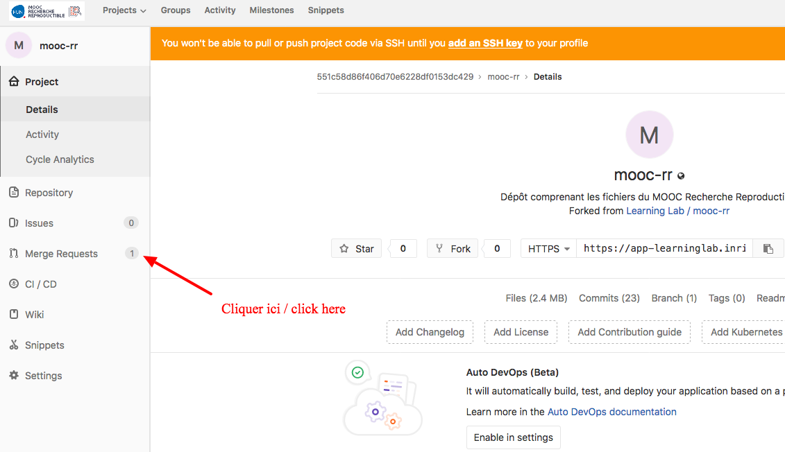
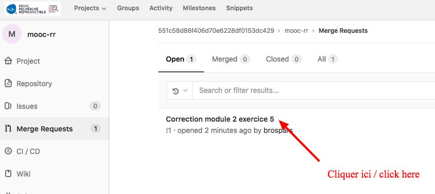
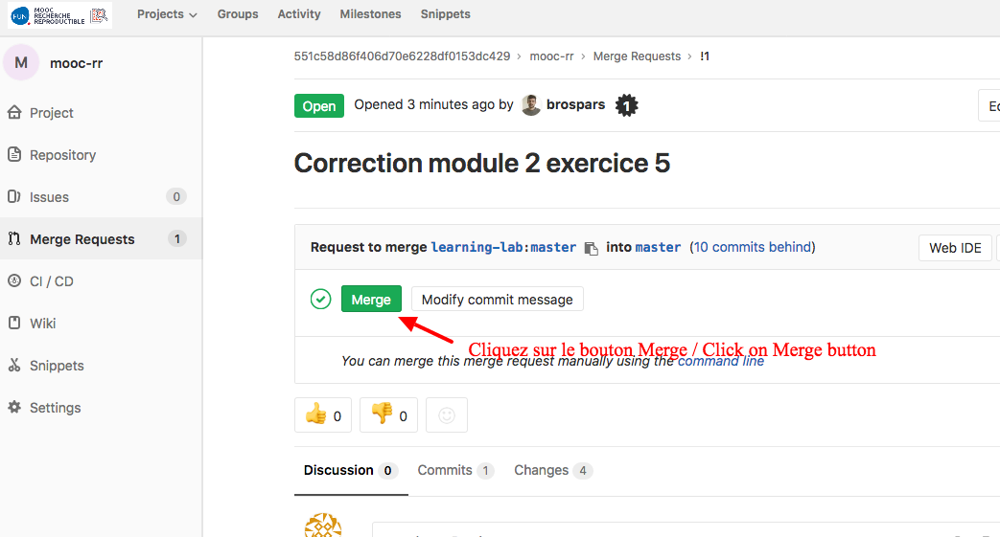
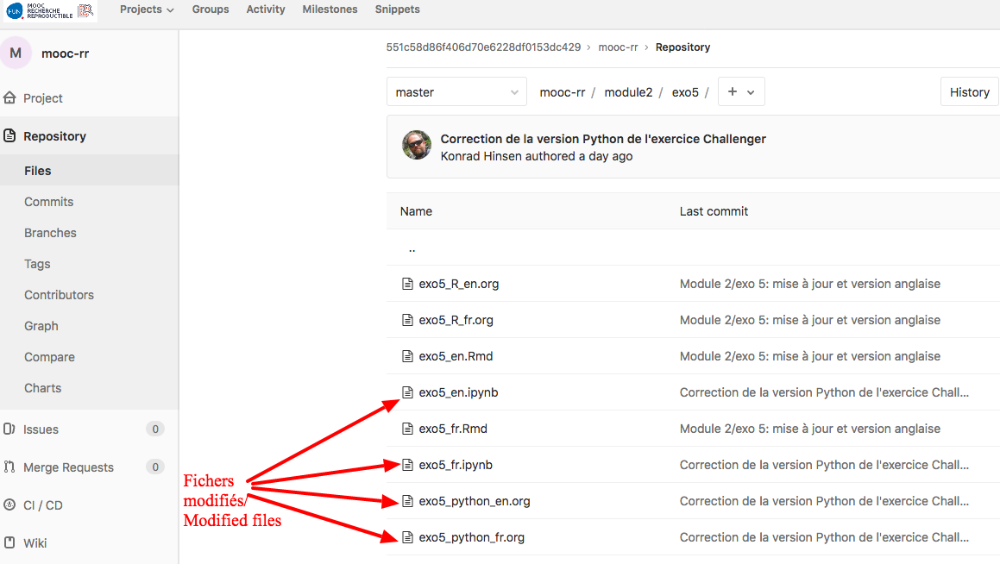
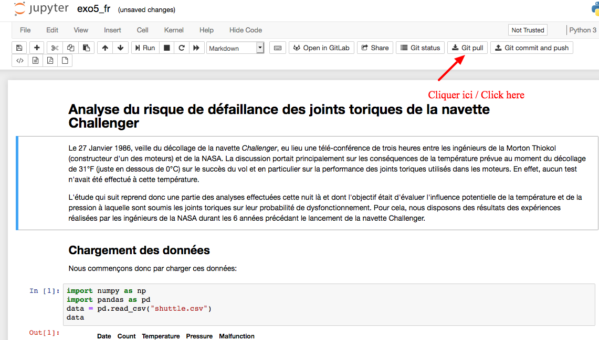
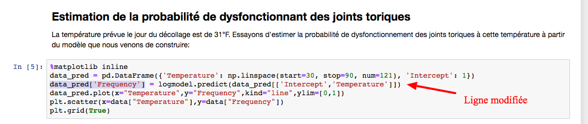

# -*- mode: org -*-
#+TITLE:     Faire un Merge/Request dans Gitlab pour mettre à jour son espace de travail mooc-rr
#+AUTHOR:    Laurence Farhi
#+DATE: April, 2019
#+STARTUP: overview indent
#+OPTIONS: num:nil toc:t
#+PROPERTY: header-args :eval never-export

Ce document vous explique comment récupérer dans votre entrepôt GitLab les modifications des ressources nécessaires pour l'exercice5 du module 2.
Pour cela, nous vous demandons de valider une demande de "Merge request"  avec toutes les modifications effectuées par Konrad, en suivant la procédure ci-dessous.

Rendez-vous sur votre espace Gitlab, depuis la page [[https://www.fun-mooc.fr/courses/course-v1:inria+41016+session02/jump_to_id/5571950188c946e790f06d4bc90fb5f6]["Votre espace Gitlab"]]

Suivez les indications ci dessous.

Vous voyez qu'il y a une demande de Merge en attente.

Sélectionnez la demande de Merge.

Si vous aviez entretemps modifié un des fichiers, Gitlab vous avertira qu’il y a un conflit (bouton gris avec ‘!’) et vous proposera de faire le merge manuellement. Laissez-vous guider …

Si vous allez sur mooc-rr/module2/exo5, vous devez voir que 4 fichiers ont été modifiés.

Ensuite, si vous suivez le parcours Jupyter, il faut aussi répercuter les modifications dans votre espace Jupyter.

Pour cela, rendez-vous sur votre espace Jupyter, depuis [[https://www.fun-mooc.fr/courses/course-v1:inria+41016+session02/jump_to_id/5310b948b605466d95b47e0676cf1069]["l'exercice 5 du Module 2"]] 
 (bouton "Lire l'analyse").

Faites un "Git pull" pour mettre à jour votre espace Jupiter.
 

Quand vous lisez à nouveau le notebook (quittez la page et rechargez), vous devez voir la modification suivante :

 
