# -*- mode: org -*-
#+TITLE:     First steps with Emacs/org-mode
#+DATE: March 2019
#+STARTUP: overview indent
#+OPTIONS: num:nil toc:t
#+PROPERTY: header-args :eval never-export

This document assumes you have installed emacs as explained [[https://www.fun-mooc.fr/courses/course-v1:inria+41016+session02/jump_to_id/954f94ce4f9a4d858d47b41793cc96c8][here]].  All
the screenshots in this demo are done under the Windows operating
system but similar results should be obtained on any OS.

* First steps with Emacs as a computationnal environment
** Run Emacs
- Launch emacs
  #+BEGIN_CENTER
  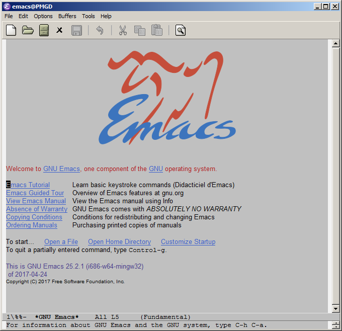
  #+END_CENTER
- Create a new file using the "white sheet of paper" left icon, right
  below the =File= menu. Name it =foo.org= in which ever directory you
  want.
** Running dos/shell commands
- You now have a blank org-mode file.
- Type =<b= and press the =tab= key to expend it as the beginning of a
  shell block. You can then type whichever command you want (e.g., =dir=
  under windows or =ls= under linux or Mac). By typing =C-c C-c= (this
  means typing twice =Ctrl= =c=), your shell command should be executed
  and the output should but put right below.
  #+BEGIN_CENTER
  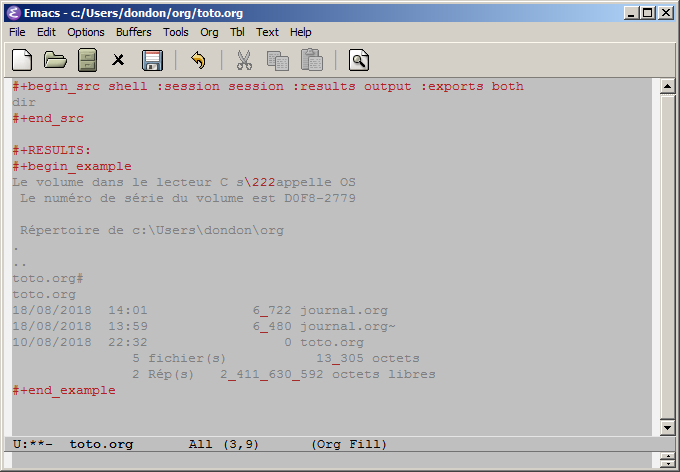
  #+END_CENTER

- Whenever you feel emacs has entered a weird state and you want to
  exit from this mode, press =C-g= (again, this reads as =Ctrl= =g=) several
  times.
** Running R code
- Similarly to the abovementionned =<b= shortcut, the shortcut =<r= + =tab=
  will allow you to create a block for running R commands (e.g.,
  =summary(cars)=). Likewise, the code will be executed by typing =C-c
  C-c= (typing twice =Ctrl= =c=)
  #+BEGIN_CENTER
  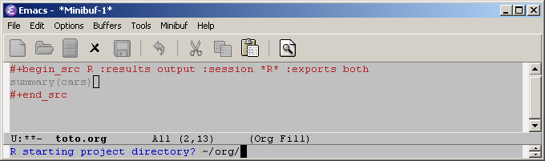
  #+END_CENTER
  At this point, Emacs will prompt you to ask where R should be
  launched. Simply keep the current directory by hitting the =Return=
  key. Again, the output is captured and inserted right below.
  #+BEGIN_CENTER
  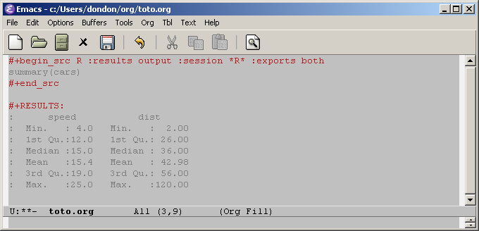
  #+END_CENTER

- The =<R= + =tab= shortcut will allow you to run R commands that generate
  graphics. The =(org-babel-temp-file \"figure\" \".png\")= generates a
  temporary file name. It will thus be erased when closing emacs. If
  you want the image to be persistant, indicate a real file name instead.
  #+BEGIN_CENTER
  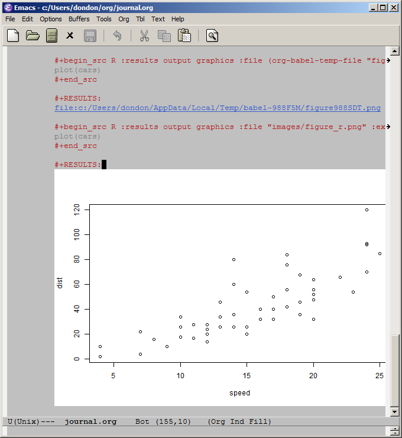
  #+END_CENTER

  If you do not like this behavior, you can edit the =init.el= file and
  replace =(org-babel-temp-file \"figure\" \".png\")= by
  =\"D:/temp/figure.png\"= or whichever location/name you prefer (both
  for =<R= et =<PP=).
** Running python code
- You may want to read the [[https://orgmode.org/worg/org-contrib/babel/languages/ob-doc-python.html][Python Source Code Blocks in Org Mode]]
  webpage for more examples

- The =<p= + =tab= will insert a python block in a /non-session/ mode. This
  means that a new python shell will be started for this block and
  that variables will not be shared between blocks. Again, the code
  is executed with the =C-c C-c= shortcut.
  #+BEGIN_CENTER
  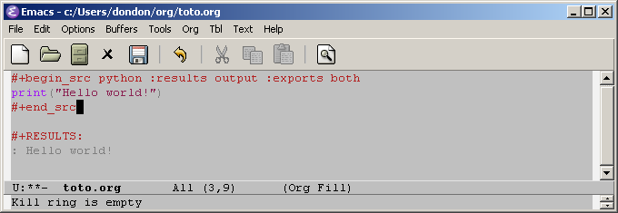
  #+END_CENTER
  #+BEGIN_CENTER
  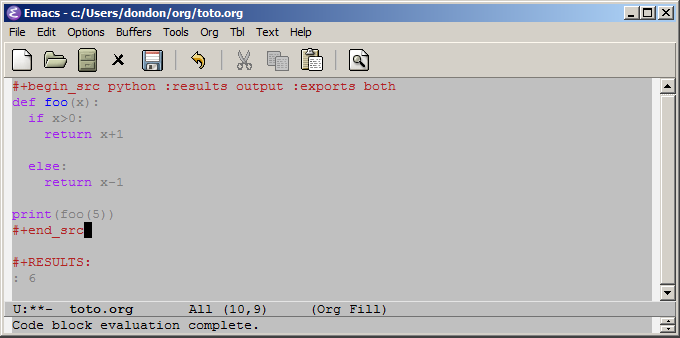
  #+END_CENTER
  # Note that if python was not correctly installed, you may end up with
  # a message like this:
  # #+BEGIN_CENTER
  # 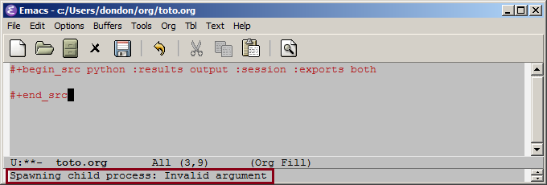
  # #+END_CENTER
  # Then try to follow the steps in the installation section.
- The =<P= + =tab= will insert a python block in /session/ mode. This
  allows to keep variables alive from a block to an other. Internally,
  emacs will have a buffer with a python session running. Again, the
  code is executed with the =C-c C-c= shortcut.
  #+BEGIN_CENTER
  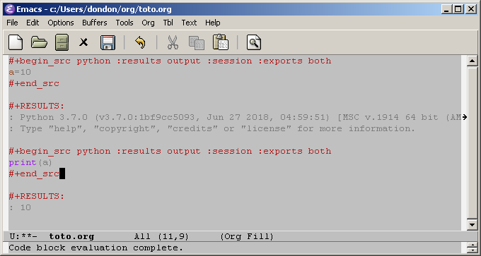
  #+END_CENTER

- The =<PP= + =tab= will insert a python block in /session/ mode and ready
  to generate graphics.
  #+BEGIN_CENTER
  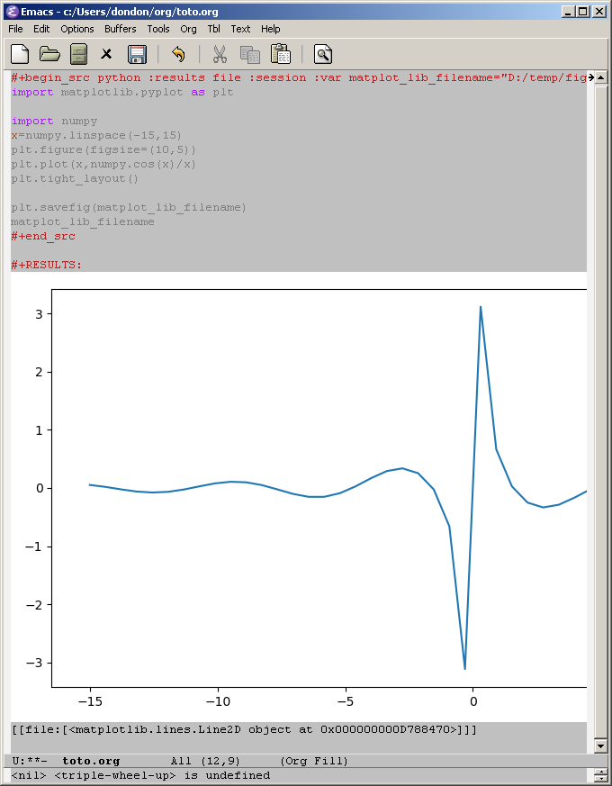
  #+END_CENTER
  If this fails, try to update the python =numpy= library, for exemple
  like this in a dos/shell command:
  #+begin_src shell :results output :exports both
  python -m pip install -U numpy
  #+end_src
* Taking notes with Emacs Org-Mode
** What does it look like.
- Open the =journal.org= file you have placed in the =~/org/=
  directory. You will find a few first "old" entries with the most
  useful emacs shortcuts, including the ones that have been presented
  above.
** Taking notes

- The =C-c c= (=Ctrl c= then =c=) will open a menu asking you whether you
  want to take notes in your todo list or in your journal.
  #+BEGIN_CENTER
  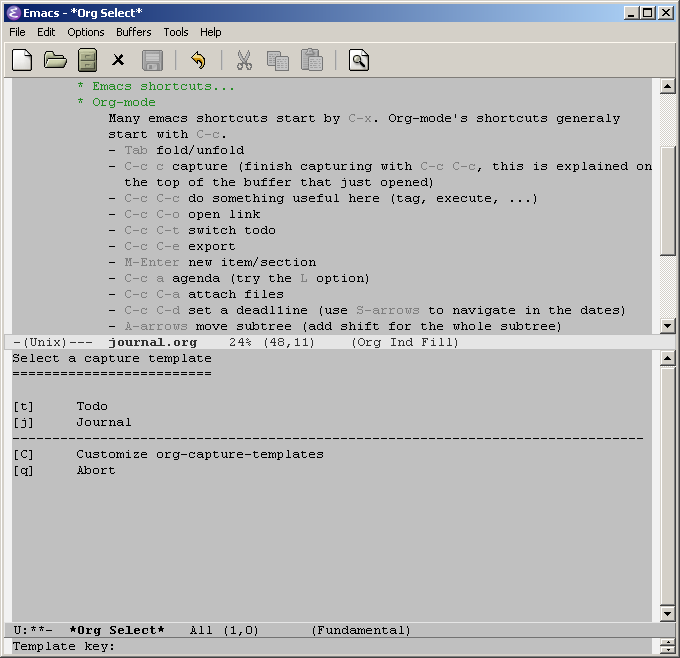
  #+END_CENTER

- Hit =j= to take notes in your journal.
  Emacs then opens =journal.org= to create an entry with the right date
  and presents you with a mini buffer in which you can start taking
  notes.
  #+BEGIN_CENTER
  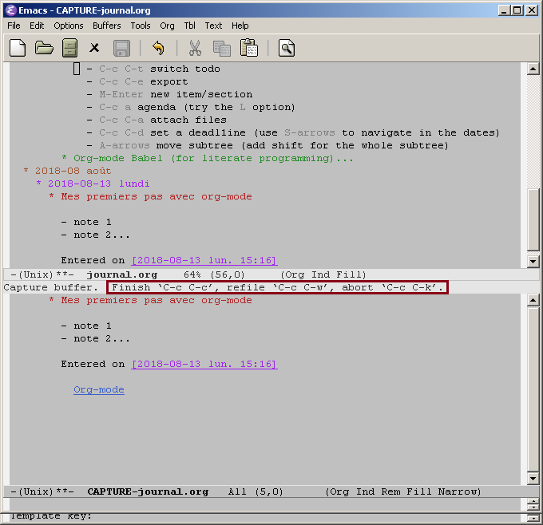
  #+END_CENTER
  When you are dones, simply hit =C-c C-c= to save your modifications
  and close the mini-buffer.
** Fast editing of an org document
- It is common when taking notes in a brainstorming session to have to
  clean and reorganize them. The =Alt= + =\leftarrow= or =Alt= +
  =\rightarrow=  will allow you to shift items to the left or to the right.
- Org-mode shortcuts are actually much more intuitive than prehistoric
  emacs shortcuts. You'll quickly get use to it. Again, have a look to
  the first entry of the =journal.org= file we gave you and which
  contains many useful tips.
- Do not forget to save your files before closing emacs! 
