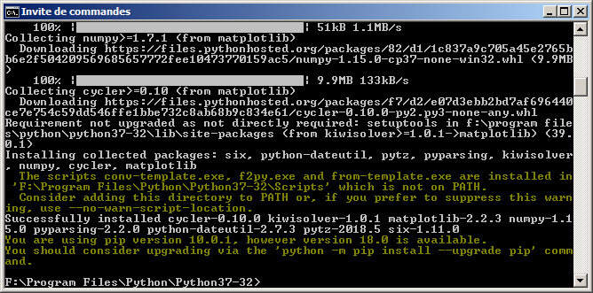
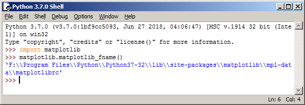

# -*- mode: org -*-
#+TITLE:     Emacs/org-mode
#+AUTHOR:    Arnaud Legrand
#+DATE: June, 2018
#+STARTUP: overview indent
#+OPTIONS: num:nil toc:t
#+PROPERTY: header-args :eval never-export

*Disclaimer:* The two sections _A simple "/reproducible research/" emacs
configuration_ and _A stub of replicable article_ explain how to set up
emacs/org-mode for this MOOC. These are very important sections in the
context of this MOOC. *These sections are illustrated in two
out of the [[https://www.fun-mooc.fr/courses/course-v1:inria+41016+session01bis/jump_to_id/9cfc7500f0ef46d288d2317ec7b037b4][three video tutorials of this sequence]], and* *which you
really should follow carefully*. *Otherwise, you may have trouble doing
the exercises later on*. Likewise, I strongly encourage you to watch
the [[https://www.fun-mooc.fr/courses/course-v1:inria+41016+session01bis/jump_to_id/9cfc7500f0ef46d288d2317ec7b037b4]["emacs and git" video tutorial available at the same place]].

The next section provides information on how to install emacs.

* Installing emacs, org-mode, ess, and auctex.
** Linux (Debian, Ubuntu)
We provide here only instructions for debian-based distributions. Feel
free to contribute to this document to provide up-to-date information
for other distributions (e.g.n redhat, fedora).

Today, the stable versions of the most common distributions provide
recent enough versions of emacs and org-mode:
- Debian (stretch) ships with [[https://packages.debian.org/stretch/emacs25][emacs 25.1]] and [[https://packages.debian.org/stretch/org-mode][org-mode 9.0.3]]
- Ubuntu (bionic 18.04) ships with [[https://packages.ubuntu.com/bionic/emacs25][emacs 25.2]] and [[https://packages.ubuntu.com/bionic/org-mode][org-mode 9.1.6]]
- Ubuntu (artful 17.04) ships with [[https://packages.ubuntu.com/artful/emacs25][emacs 25.2]] and [[https://packages.ubuntu.com/artful/org-mode][org-mode 9.0.9]]
If your distribution is older than this, well, it may be a good time
for upgrading...

Simply run (as root):
#+begin_src sh :results output :exports both
apt-get update ; apt-get install emacs25 org-mode ess r-base auctex
#+end_src

Then make sure you have a sufficiently recent version of emacs.
#+begin_src sh :results output :exports both
emacs --version 2>&1 | head -n 1
#+end_src

#+RESULTS:
: GNU Emacs 25.2.2

Likewise, you'll want to check you have a recent version of org-mode:
#+begin_src sh :results output :exports both
emacs -batch --funcall "org-version" 2>&1 | grep version
#+end_src

#+RESULTS:
: Org mode version 9.1.11 (9.1.11-dist @ /usr/share/emacs/25.2/site-lisp/elpa/org-9.1.11/)

The version numbers you get will depend on the distribution you are
running. _You really want to make sure you do not rely on org-mode 8_,
which is now deprecated. 
** macOS
*Note:* macOS comes with a prehistoric command-line-only version of Emacs located at =/usr/bin/emacs=. It's best to forget about it.

- *Option 1*: Install the =.dmg= file from [[http://vgoulet.act.ulaval.ca/][Vincent Goulet]]:
  https://vigou3.github.io/emacs-modified-macos/. It ships with recent
  versions:
  - Emacs 26.1
  - Org-mode 9.1.13
  - ESS 17.11

  If you install this version of Emacs, or in fact any other version of
  Emacs distributed as a clickable application in a =.dmg= file,
  you must type the full path to the executable if you want to run
  Emacs from a terminal. For example, if your clickable application
  is at =/Applications/Emacs.app=, then the executable is at
  =/Applications/Emacs.app/Contents/MacOS/Emacs=

- *Option 2*: If you use [[https://docs.brew.sh/][Homebrew]], do the following:
  #+begin_src sh :results output :exports both
  brew update
  brew install emacs --with-cocoa
  brew linkapps emacs
  brew install wget
  brew tap dunn/emacs
  brew install auctex
  brew tap brewsci/science
  brew install ess
  #+end_src
  This provides an =emacs= command for use from the command line, plus a clickable application at =Cellar/emacs/26.1_1/Emacs.app= inside your Homebrew directory. If
  you installed Homebrew at the default location =/usr/local=, then this is =/usr/local/Cellar/emacs/26.1_1/Emacs.app=.
  If you installed Homebrew on an account with administrator privileges, you can add
  #+begin_src sh :results output :exports both
  brew linkapps emacs
  #+end_src
  in order to make Emacs accessible directly from =/Applications=.
** Windows
Install the =.exe= file from [[http://vgoulet.act.ulaval.ca/][Vincent Goulet]]:
https://vigou3.github.io/emacs-modified-windows/. It ships with recent
versions:
- Emacs 26.1
- Org-mode 9.1.13
- ESS 17.11
To have code pretty printing when exporting to html, it appears like
you should install the =htmlize= package, which is done by opening emacs
and typing the following command:
#+BEGIN_EXAMPLE
M-x package-install RET htmlize RET    # where M-x means pressing the "Esc" key then the "x" key
#+END_EXAMPLE

*** Directory naming conventions
In all the following instructions, it is common to refer to your home
directory through the (UNIX) =~/= notation. On Windows, your home
directory should be something like =C:\Users\yourname=. Therefore,
whenever we mention the =~/org/= (resp. the =~/.emacs.d/=) directory this
means we are referring to =C:\Users\yourname\org= (resp.
=C:\Users\yourname\.emacs.d\=).
*** Making R and Python available to the console
When running a command, windows will look for the command in the
directories indicated in the =PATH= environment variable. If none of
these directories contains the command, Windows will stop and indicate
the command does not exist. To make sure R (, which may be in
something like =C:/Program Files/R/R-3.5.1/bin/x64/=) and Python (,
which may be in something like =C:/Program Files/Python/Python37/=) can
easily be run from emacs, you should thus configure the =PATH= variable
accordingly.

This requires to go through the "Environment Variable" editor as
explained [[http://sametmax.com/ajouter-un-chemin-a-la-variable-denvironnement-path-sous-windows/][here]].
*** Installing and configuring Matplotlib (graphic python library)
Open an DOS console and type the following command:
#+begin_src shell :results output :exports both
python -m pip install -U matplotlib
#+end_src

Then you will want to deactivate interactive plots in matplotlib. To
this end, you first need to know where the matplotlib configuration is
located. Open a python console the type the following code:
#+begin_src python :results output :exports both
import matplotlib
matplotlib.matplotlib_fname()
#+end_src

Open the =matplotlibrc= file and add a =#= at the beginning of the line
starting with =backend=, which amounts to use the default =Agg= value.

* A simple "/reproducible research/" emacs configuration 
This section is illustrated in a [[https://www.fun-mooc.fr/courses/course-v1:inria+41016+session01bis/jump_to_id/9cfc7500f0ef46d288d2317ec7b037b4][video tutorial]] (/"Mise en place
Emacs/Orgmode"/ in French). Watching it before following the
instructions given in this section may help.

Emacs comes with very basic default configuration and it appears like
everyone has its own taste. You will for example find [[https://www.emacswiki.org/emacs/StarterKits][here]] several
default Emacs configurations that reflect the preferences of their
creators. Likewise the configuration of Org-Mode is incredibly
flexible (see for example [[https://orgmode.org/worg/org-configs/index.html][the org-mode website]] for more
references). In the context of this MOOC, we propose you a relatively
minimalist one that is rather "/reproducible research/" oriented by
adding a few org-mode specific configurations.

** Step 0: Backup and download our configuration
The procedure we propose will wipe your already existing custom emacs
configuration if you already have one. *You should thus beforehand make
a backup of =~/.emacs= and of =~/.emacs.d/init.el=* (if these file
exists).

#+begin_src shell :results output :exports none
export FILE_LIST="rr_org/init.el rr_org/journal.org"
tar zcf rr_org_archive.tgz $FILE_LIST
#+end_src

#+RESULTS:
Then download [[https://app-learninglab.inria.fr/gitlab/learning-lab/mooc-rr-ressources/raw/master/module2/ressources/rr_org_archive.tgz][this archive]] and uncompress it. It contains the
following files and we will refer to them in the following:

#+begin_src shell :results output :exports results
tar tzf rr_org_archive.tgz
#+end_src

#+RESULTS:
: rr_org/init.el
: rr_org/journal.org

** Step 1: Prepare your journal
Create an =org/= directory in the top of your home:
#+begin_src sh :results output :exports both
mkdir -p ~/org/
#+end_src
Then copy =rr_org/journal.org= file in your =~/org/= directory. This
file will be your laboratory notebook and all the notes you will
capture with =C-c c= will go automatically go in this file. The first
entry of this notebook is populated with [[https://app-learninglab.inria.fr/gitlab/learning-lab/mooc-rr-ressources/blob/master/module2/ressources/rr_org/journal.org][many emacs shortcuts]] that you
should give a try.
** Step 2: Set up Emacs configuration
Copy =rr_org/init.el= in your =~/.emacs.d/= directory.

Alternatively, if you do not want to mess with your already existing
emacs configuration, you may launch emacs with this specific
configuration with the following command: =emacs -q -l rr_org/init.el=.
** Step 3: Adapt the configuration to your specific needs if required
There are two situations in which it might be necessary to modify
=init.el=:
1. Your network environment forces you to use a proxy for access
   to Web sites (HTTP(S) protocol).
2. You have multiple installations of Python or R on your computer,
   or they are in unusual places and not fully configured.
   If you can run 
      - "python3" and "R" under Linux and macOS
      - "Python" and "R" under Windows
   in a terminal without getting an error message, then you should
   not have to do anything.

If you do have to modify =init.el=, check the comments at the
beginning of the file for instructions.
** Step 4: Check whether the installation is working or not
Open a new instance of Emacs and open a =foo.org= file. Copy the
following lines in this file:
   : #+begin_src shell :session foo :results output :exports both
   : ls -la # or dir under windows
   : #+end_src

Put your cursor inside this code block and execute it with the
following command: =C-c C-c= (If you are not familiar with Emacs
commands, this one means '=Ctrl + C=' twice)

A =#+RESULTS:= block with the result of the command should appear if it
worked. 

In the video, we already have demonstrated the main features and
shortcuts of emacs/org-mode that will help you maintain a document and
benefit from literate programming. The list of features and shortcuts
is demonstrated in the [[https://app-learninglab.inria.fr/gitlab/learning-lab/mooc-rr-ressources/blob/master/module2/ressources/rr_org/journal.org][first entry of your labbook]].
** Step 5: Open and play with your journal:
In step 1, you were told to create an journal in
=~org/journal.org=. First you probably want to make sure this file is
backed up in a revision control system like git. We leave it up to you
to set this up but if you have any trouble, feel free to ask on the
FUN forums.
* A stub of replicable article
This section is illustrated in a [[https://www.fun-mooc.fr/courses/course-v1:inria+41016+session01bis/jump_to_id/9cfc7500f0ef46d288d2317ec7b037b4][video tutorial]] (/"Écrire un article
réplicable avec Emacs/Orgmode"/ in French). Watching it before
following the instructions given in this section may help.

Remember, you need a working LaTeX and R environment. If you can't
open a terminal and run the commands =R=, =pdflatex=, and =python=, you will not be
able to generate this document. When being compiled, the article downloads the
corresponding LaTeX packages so you also need to have a working =wget=
command (alternatively, it uses =curl=). Once downloaded, you may still read the
source ([[https://app-learninglab.inria.fr/gitlab/learning-lab/mooc-rr-ressources/blob/master/module2/ressources/replicable_article/article.org][article.org]]) and understand how it works though.

#+begin_src shell :results output :exports none
make -C replicable_article/ all ../replicable_article.tgz
#+end_src

#+RESULTS:

Download the following [[https://app-learninglab.inria.fr/gitlab/learning-lab/mooc-rr-ressources/raw/master/module2/ressources/replicable_article.tgz][archive]], uncompress it and simply =make= to generate the
article. You should then be able to open the [[https://app-learninglab.inria.fr/gitlab/learning-lab/mooc-rr-ressources/blob/master/module2/ressources/replicable_article/article.pdf][resulting article]]. This
is summarized in the following command:
#+begin_src sh :results output :exports both
wget --no-check-certificate -O replicable_article.tgz https://app-learninglab.inria.fr/gitlab/learning-lab/mooc-rr-ressources/raw/master/module2/ressources/replicable_article.tgz
tar zxf replicable_article.tgz; cd replicable_article; make ; evince article.pdf
#+end_src

*Possible issues*:
- If the =make= command fails (especially on Mac), it may be because
  emacs or something else is not correctly installed. In that case,
  open the article directly with the following command:
  #+begin_src sh :results output :exports both
  emacs -q --eval "(setq enable-local-eval t)" --eval "(setq enable-local-variables t)"  article.org
  #+end_src
  and export it to pdf with the following shortcut: =C-c C-e l o=
- If it still doesn't work and emacs complains about not finding ESS,
  it may be because you installed ESS in your home instead of
  system-wide. In that case, try to remove the =-q= in the previous
  command line to load your personal emacs configuration.

Finally, when you'll be tired of always re-executing all the source
code when exporting, just look for the following line in [[https://app-learninglab.inria.fr/gitlab/learning-lab/mooc-rr-ressources/blob/master/module2/ressources/replicable_article/article.org][article.org]]:
#+BEGIN_EXAMPLE
# #+PROPERTY: header-args :eval never-export
#+END_EXAMPLE
If you remove the =# = in the beginning of the line, it will not be a
comment anymore and will indicate org-mode to stop evaluating every
chunk of code when exporting.

* Emacs Tips and tricks
** Cheat-sheets
Learning emacs and org-mode can be difficult as there is an inordinate
amount of shortcuts. Many people have thus come up with
cheat-sheats. Here is a selection in case it helps:
*** Emacs
- [[https://app-learninglab.inria.fr/gitlab/learning-lab/mooc-rr-ressources/blob/master/module2/ressources/rr_org/journal.org][Common and step-by-step emacs shortcuts for our /reproducible research/ configuration]]
- [[https://www.gnu.org/software/emacs/refcards/pdf/refcard.pdf][The official GNU emacs refcard]]
- Two graphical cheat-sheats by Sacha Hua on [[http://sachachua.com/blog/wp-content/uploads/2013/05/How-to-Learn-Emacs-v2-Large.png][how to learn emacs]] and on
  [[http://sachachua.com/blog/wp-content/uploads/2013/08/20130830-Emacs-Newbie-How-to-Learn-Emacs-Keyboard-Shortcuts.png][how to learn emacs shortcuts]].
*** Org-mode
- [[https://app-learninglab.inria.fr/gitlab/learning-lab/mooc-rr-ressources/blob/master/module2/ressources/rr_org/journal.org][Common and step-by-step org-mode shortcuts for our /reproducible research/ configuration]]
- [[https://orgmode.org/worg/orgcard.html][The official org-mode refcard]]
- [[https://orgmode.org/worg/dev/org-syntax.html][The official description of the org-mode syntax]] and a [[https://gist.github.com/hoeltgman/3825415][relatively concise description of the org-mode syntax]].
** Video tutorials
For those of you who prefer video explanations, here is a [[https://www.youtube.com/playlist?list=PL9KxKa8NpFxIcNQa9js7dQQIHc81b0-Xg][Youtube
channel with many step by step emacs tutorials]].
** Additional useful emacs packages
*** Company-mode
[[http://company-mode.github.io/][Company-mode]] is a text completion framework for Emacs. It allows to
have smart completion in emacs for the most common languages. If you
feel this is needed, you should follow the instructions from the
official Web page: http://company-mode.github.io/
*** Magit
[[https://magit.vc/][Magit]] is an emacs interface for Git. Its usage is briefly illustrated
in the context of this MOOC in a [[https://www.fun-mooc.fr/courses/course-v1:inria+41016+session01bis/jump_to_id/9cfc7500f0ef46d288d2317ec7b037b4][video tutorial]] (/"Utilisation
Emacs/git"/ in French).

It is very powerful and we use it on a daily basis but you should
definitely understand what git does behind the scene beforehand. If
you feel this would be useful for you, you should follow [[https://magit.vc/screenshots/][this visual
walk-through]] or [[https://www.emacswiki.org/emacs/Magit][this really short "crash course"]]. If you installed the
previous "/reproducible research/" emacs configuration, you can easily
invoke magit by using ~C-x g~.
** Other resources
- [[https://orgmode.org/orgguide.pdf][The compact Org-mode Guide]]
- [[https://github.com/dfeich/org-babel-examples][Many examples illustrating the use of different languages in org-mode]]
