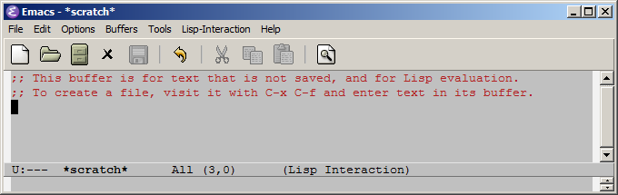

# -*- mode: org -*-
#+TITLE:     Emacs/org-mode
#+DATE: March 2019
#+STARTUP: overview indent
#+OPTIONS: num:nil toc:t
#+PROPERTY: header-args :eval never-export

Ce document explique comment installer Emacs et Org-mode sur votre
machine et recense un certain nombre d'autres références utiles sur
cet environnement.

*Attention:* Les sections [[#une-configuration-emacs-adaptée-à-la-recherche-reproductible][Une configuration Emacs adaptée à la
"recherche reproductible"]] et [[#un-mod%C3%A8le-darticle-r%C3%A9plicable][Un modèle d'article réplicable]]
expliquent comment configurer Emacs/Org-Mode pour ce MOOC. Ce sont donc
des sections très *importantes* qui sont *illustrées dans [[https://www.fun-mooc.fr/courses/course-v1:inria+41016+session02/jump_to_id/9cfc7500f0ef46d288d2317ec7b037b4][deux des trois
tutoriels vidéo de cette page]]*. *Nous vous encourageons vivement à
suivre attentivement ces sections* *et ces vidéos avant de vous lancer
dans les exercices*. De même, nous vous encourageons vivement à
regarder la vidéo [[https://www.fun-mooc.fr/courses/course-v1:inria+41016+session02/jump_to_id/9cfc7500f0ef46d288d2317ec7b037b4]["utilisation Emacs/git" disponible sur la même page]].

* Table des matières                                           :TOC:
- [[#installation-demacs][Installation d'Emacs]]
  - [[#linux-debian-ubuntu][Linux (Debian, Ubuntu)]]
  - [[#macos][macOS]]
  - [[#windows][Windows]]
- [[#python-r-et-latex][Python, R et LaTeX]]
- [[#une-configuration-emacs-adaptée-à-la-recherche-reproductible][Une configuration Emacs adaptée à la "recherche reproductible"]]
  - [[#etape-0--sauvegarder-et-supprimer-votre-configuration-précédente][Etape 0 : Sauvegarder et supprimer votre configuration précédente]]
  - [[#etape-1--télécharger-notre-configuration][Etape 1 : Télécharger notre configuration]]
  - [[#étape-2--préparez-votre-journal][Étape 2 : Préparez votre journal]]
  - [[#étape-3--placez-le-fichier-de-configuration-emacs-au-bon-endroit][Étape 3 : Placez le fichier de configuration Emacs au bon endroit]]
  - [[#étape-4--adapter-la-configuration-à-vos-besoins-spécifiques-si-nécessaire][Étape 4 : Adapter la configuration à vos besoins spécifiques si nécessaire]]
  - [[#etape-5--vérifier-si-linstallation-fonctionne-ou-non][Etape 5 : Vérifier si l'installation fonctionne ou non]]
  - [[#étape-6--ouvrez-et-commencez-à-utiliser--avec-votre-journal][Étape 6 : Ouvrez et commencez à utiliser  avec votre journal]]
- [[#un-modèle-darticle-réplicable][Un modèle d'article réplicable]]
- [[#emacs-trucs-et-astuces][Emacs trucs et astuces]]
  - [[#pense-bêtes][Pense-bêtes]]
  - [[#tutoriels-vidéo][Tutoriels vidéo]]
  - [[#paquets-emacs-utiles-supplémentaires][Paquets emacs utiles supplémentaires]]
  - [[#autres-ressources][Autres ressources]]

* Installation d'Emacs
Dans cette section, nous décrivons pour chaque système d'exploitation la procédure d'installation qui nous a semblé la plus simple. Il y a d'autres options qui peuvent être plus adaptées à votre situation particulière donc n'hésitez pas à jeter un œil au [[https://www.gnu.org/software/emacs/download.html][site web officiel d'Emacs]] pour plus de détails. Mais nous vous recommandons néanmoins de d'abord essayer les méthodes décrites ci-dessous.

À la fin de cette installation, vous devriez avoir sur votre machine une des deux configurations suivantes:

 1. Emacs 26 (la dernière version)
 2. Emacs 25 plus Org-Mode 9

Emacs 25 vient avec Org-Mode 8 par défaut, qui est très ancien et n'est plus compatible avec les exemples que nous vous fournissons. Donc si vous utilisez Emacs 25, il vous faudra impérativement installer Org-Mode 9 séparément. Emacs 26 vient avec Org-Mode 9 donc pas de problème de ce coté là.

Les exemples que nous montrons dans notre MOOC nécessitent également quelques paquet Emacs supplémentaires: [[https://ess.r-project.org/][ESS]] (qui signifie /Emacs Speaks Statistics/ et qui permet d'utiliser le langage R) et [[https://www.gnu.org/software/auctex/][AUCTeX]] (pour éditer facilement des documents LaTeX). Si vous utilisez la configuration que nous décrivons dans la section [[#une-configuration-emacs-adaptée-à-la-recherche-reproductible][Une configuration Emacs adaptée à la "recherche reproductible"]], ces paquets seront installés automatiquement la première fois que vous lancerez Emacs. 

** Linux (Debian, Ubuntu)
Vous ne trouverez dans cette section que les instructions pour les
distributions de type Debian (Ubuntu par exemple). N'hésitez pas à
contribuer à ce document pour partager des informations à jour pour
d'autres distributions (redhat, fedora, ...).

Voici les versions d'Emacs fournies par différentes distributions:
- Debian (stretch) fourni [[https://packages.debian.org/stretch/emacs25][emacs 25.1]] et [[https://packages.debian.org/stretch/org-mode][org-mode 9.0.3]]
- Ubuntu (bionic 18.04) fourni [[https://packages.ubuntu.com/bionic/emacs25][emacs 25.2]] et [[https://packages.ubuntu.com/bionic/org-mode][org-mode 9.1.6]]
- Ubuntu (artful 17.04) fourni [[https://packages.ubuntu.com/artful/emacs25][emacs 25.2]] et [[https://packages.ubuntu.com/artful/org-mode][org-mode 9.0.9]]
Si votre distribution est plus ancienne que celles-ci, et bien... c'est peut-être le bon moment pour faire une mise à jour.

En tant que root, tapez les commandes suivantes:
#+begin_src sh :results output :exports both
apt-get update ; apt-get install emacs25 org-mode
#+end_src

Puis vérifiez que vous avez bien une version d'Emacs suffisamment récente
#+begin_src sh :results output :exports both
emacs --version 2>&1 | head -n 1
#+end_src

#+RESULTS:
: GNU Emacs 25.2.2

De même, vérifiez que vous avez bien une version récente d'Org-Mode:
#+begin_src sh :results output :exports both
emacs -batch --funcall "org-version" 2>&1 | grep version
#+end_src

#+RESULTS:
: Org mode version 9.1.11 (9.1.11-dist @ /usr/share/emacs/25.2/site-lisp/elpa/org-9.1.11/)

Ces numéros de version dépendront de votre distribution mais
_assurez vous bien que vous n'utilisez pas Org-mode 8_ qui est désormais
complètement obsolète.

** macOS
*Note:* macOS est installé par défaut avec une version préhistorique d'emacs, qui ne fonctionne qu'en ligne de commande, qui est située dans =/usr/bin/emacs= et dont il est très difficile de se débarrasser. Il ne faut pas espérer en tirer quoi que ce soit.

Le site  Web https://emacsformacosx.com/ propose des versions pré-compilées d'Emacs pour macOS. Téléchargez la dernière version (celle dont le numéro apparaît en gros sur la page d'accueil) et installez le de la même façon que n'importe quelle autre application  macOS, en copiant =Emacs.app= de la zone de téléchargement vers le répertoire de votre choix sur votre ordinateur.

Si vous aimez travailler avec un terminal (le =Terminal.app= de macOS ou bien une version plus évoluée comme [[https://iterm2.com/][iTerm2]]), la façon standard sous macOS d'ouvrir emacs dans un terminal consiste à taper la commande =open -a Emacs.app /path/to/my/file.txt=. Cela lancera Emacs, à moins qu'il ne soit déjà ouvert, et demandera à Emacs d'ouvrir le fichier =file.txt=. Avec cette approche, il n'y a qu'une seule instance d'Emacs en cours d'exécution. C'est donc légèrement différent de la méthode Unix/Linux qui est illustrée dans les vidéos et où on tape =emacs /path/to/my/file.txt= dans le terminal, ce qui conduit à l'ouverture d'un nouvel emacs à chaque fois.

*** Sujets avancés - non requis pour suivre le MOOC
Pour les utilisations avancées d'Emacs, comme appeler Emacs à partir d'un Makefile pour automatiser le traitement de documents, il vous faudra adopter l'approche Unix également sous macOS car c'est le seul moyen de fournir des paramètres autres que des noms de fichiers. Il vous faudra alors également spécifier le chemin complet de l'exécutable. En effet, si vous tapez simplement =emacs=, vous utiliserez la version préhistorique en ligne de commande uniquement de =/usr/bin/emacs= fournie par Apple. En supposant que vous avez copié =Emacs.app= vers =/path/to/emacs=, l'exécutable =Emacs= sera situé dans =/path/to/emacs/Emacs.app/Contents/MacOS/Emacs=. Vous pouvez bien sûr rendre l'exécutable Emacs plus facilement accessible en utilisant un =alias= shell, ou en mettant =/path/to/emacs/Emacs.app/Contents/MacOS/= dans votre =$PATH=, par exemple en écrivant =export PATH=/path/to/emacs/Emacs.app/Contents/MacOS/:$PATH= dans votre =~/.bashrc= ou =~/.bash_profile=. Voir le [[https://www.gnu.org/software/bash/manual/bashref.html][bash manual]] pour plus de détails et explications.

Notez bien que l'exécution d'Emacs à la mode Unix implique quelques différences subtiles par rapport à l'exécution d'Emacs à la mode MacOS. En particulier, Emacs héritera des variables d'environnement du shell lorsqu'il est lancé à la mode Unix, alors qu'il héritera des variables d'environnement de la session utilisateur lorsqu'il est lancé à la mode MacOS.

** Windows
Téléchargez la version précompilée d'Emacs 26, disponible [[https://ftp.gnu.org/gnu/emacs/windows/emacs-26/emacs-26.1-i686.zip][pour les architectures 32 bits]] ou [[https://ftp.gnu.org/gnu/emacs/windows/emacs-26/emacs-26.1-x86_64.zip][pour les architectures 64 bits]]. Le choix dépend de votre machine. Si vous ne savez pas laquelle est la meilleure, essayez la version 64 bits et si elle ne peut pas être démarrée, passez à 32 bits. Décompressez le fichier zip en préservant la structure du répertoire. Si cette approche ne fonctionne pas, suivez les instructions du [[https://www.gnu.org/software/emacs/download.html#windows][site officiel d'Emacs]]. Si cela échoue toujours, n'hésitez pas à poser des questions sur le forum.

Enfin, exécutez =bin\runemacs.exe=. Sinon, créez un raccourci sur le bureau vers =bin\runemacs.exe=, et lancez Emacs en double-cliquant sur l'icône du raccourci. Voir [[https://www.gnu.org/software/emacs/manual/html_node/emacs/Windows-Startup.html][ici]] pour une explication de cette méthode et d'autres méthodes pour lancer Emacs sous Windows. Vous devriez pouvoir obtenir une fenêtre qui ressemble à celle-ci :

#+BEGIN_CENTER
[[file:emacs_orgmode_images/emacs.png]]

#+END_CENTER
*** Conventions de nommage des répertoires
Dans les instructions suivantes, nous faisons référence à votre répertoire personnel via la notation (UNIX) =~/=. Sous Windows, ce répertoire
devrait être quelque chose du genre =C:\Users\yourname=. Par conséquent,
chaque fois que nous mentionnons le répertoire =~/org/= (respectivement =~/.emacs.d/=) 
cela signifie que nous faisons référence à =C:\Users\yourname\org= (respectivement
=C:\Utilisateurs\votre nom\.emacs.d\=). Notez que le répertoire =C:\Users\yourname\.emacs.d\= devrait être automatiquement créé lors de la première exécution d'emacs. C'est là que la configuration d'emacs ira.

*** Gestion des archives
Plus loin dans ce document, il vous sera demandé de télécharger de petites archives contenant des fichiers ([[file:rr_org_archive.tgz][rr_org_archive.tgz]] et [[file:réplicable_article.tgz][réplicable_article.tgz]]). Pour décompresser ces archives sur votre ordinateur, vous pouvez utiliser le programme =7z=. Dans ce cas, vous devrez probablement décompresser chaque fichier deux fois.... La première fois, =archive.tgz= sera décompressé dans =archive.tar= et la deuxième fois =archive.tar= créera un répertoire =archive/= comprenant tous les fichiers de l'archive originale.
*** Rendre R et Python disponible dans une console
Lors de l'exécution d'une commande, Windows recherchera l'exécutable dans les répertoires indiqués dans la variable d'environnement =PATH=. Si aucun de
ces répertoires ne contient la commande, Windows s'arrêtera et indiquera que
la commande n'existe pas. Pour s'assurer que R (qui peut être dans
quelque chose comme =C:/Program Files/R/R-3.5.1/bin/x64/=) et Python (qui peut être dans quelque chose comme =C:/Program Files/Python/Python/Python37/=) puissent
s'exécuter facilement à partir d'Emacs, vous devrez donc configurer la variable =PATH= en conséquence.

Cela nécessite de passer par l'éditeur de variables d'environnement comme
expliqué [[http://sametmax.com/ajouter-un-chemin-a-la-variable-denvironnement-path-sous-windows/][ici]].
*** Installation et configuration de Matplotlib (bibliothèque graphique python)
Ouvrez une console DOS et tapez la commande suivante :
#+begin_src shell :results output :exports both
python -m pip install install -U matplotlib
#+end_src
[[file:emacs_orgmode_images/install_matplotlib.png]]

Ensuite, il vous faudra désactiver les tracés interactifs dans matplotlib (pour que l'image apparaisse dans votre emacs et pas dans une fenêtre à côté). Pour cela, il vous faut d'abord déterminer où se trouve la configuration matplotlib. Ouvrez une console python et tapez le code suivant :
#+begin_src python :results output :exports both
import matplotlib
matplotlib.matplotlib_fname()
#+end_src
[[file:emacs_orgmode_images/matplotlib.png]]

Ouvrez le fichier =matplotlibrc=, localisez la ligne commençant par =backend= et transformez là en =backend : Agg=.

* Python, R et LaTeX
Les documents computationnels contiennent du code, et en particulier dans le cas de notre MOOC du code utilisant les langages Python et R. Vous devrez donc installer Python et R en plus d'Emacs, sauf s'ils sont déjà installés sur votre ordinateur. Puisque Python et R sont aussi utilisés dans les autres parcours de notre MOOC, nous expliquons leur installation dans une [[https://www.fun-mooc.fr/courses/course-v1:inria+41016+session02/jump_to_id/19c2b1de7766484bae73f3ab133463c6][ressource séparée]].

Cette même ressource explique également comment installer LaTeX, dont vous devrez disposer si vous voulez produire des versions PDF de documents org-mode. Par exemple, si vous voulez travailler avec modèle d'article réplicable (montré dans [[https://www.fun-mooc.fr/courses/course-v1:inria+41016+session02/jump_to_id/9cfc7500f0ef46d288d2317ec7b037b4#tuto3][la vidéo "écrire un article réplicable avec Emacs/Org-mode"]]), il vous faudra installer LaTeX. Cependant, comme il s'agit d'un logiciel assez volumineux (plusieurs Go), vous pouvez préférer ne pas l'installer. Ce n'est pas indispensable.

* Une configuration Emacs adaptée à la "recherche reproductible"
Cette section est illustrée dans une [[https://www.fun-mooc.fr/courses/course-v1:inria+41016+session02/jump_to_id/9cfc7500f0ef46d288d2317ec7b037b4][vidéo de démonstration]] (/Mise en place en place Emacs/Orgmode/). Nous vous suggérons de la regarder avant de suivre les instructions données dans cette section.

Emacs s'installe avec une configuration par défaut très basique que
chacun va donc vouloir personnaliser. Compte tenu de la flexibilité
d'Emacs, sa configuration peut vite devenir assez complexe et pourrait
même faire l'objet d'un paquet à part entière (voir par exemple les
différents Emacs Starter Kits [[https://kieranhealy.org/resources/emacs-starter-kit/][ici]] ou [[https://www.emacswiki.org/emacs/StarterKits][ici]]). Dans le contexte de ce
MOOC, nous vous proposons une configuration relativement minimaliste
orientée "/recherche reproductible/" avec Org-Mode. Si vous êtes peu
familier d'Emacs, nous vous recommandons fortement de l'utiliser et de la modifier le moins possible. Il vous suffira de suivre
les instructions données dans cette section. Si vous êtes un
utilisateur Emacs plus expérimenté, vous pouvez vous contenter de
regarder nos instructions et de ne récupérer que les parties qui vous
sembleront utiles.

Il est malheureusement assez probable que certains d'entre vous
rencontreront des problèmes que nous n'avons pas anticipés. Si c'est
votre cas, posez la question sur le forum. Nous ferons de notre mieux
pour vous aider.
** Etape 0 : Sauvegarder et supprimer votre configuration précédente
Si vous avez déjà utilisé Emacs auparavant, il se peut que vous ayez
déjà un fichier de configuration personnel.  Et même si ce n'est pas
le cas, il se peut que vous en ayez un sans même le savoir puisque
certains paquets peuvent créer ou modifier les fichiers de
configuration d'Emacs. Afin d'éviter tout problème, nous vous
recommandons donc d'enlever ces anciennes configurations.

Les fichiers que vous devez sauvegarder puis supprimer (s'ils existent) sont :

  1. =~/.emacs=
  2. =~/.emacs.el=
  3. =~/.emacs.elc=

Il y a aussi un répertoire que vous devez sauvegarder puis supprimer (s'il existe), avec tout ce qu'il peut contenir :

  4. =~/.emacs.d=

Dans les noms de fichiers ci-dessus, =~/= représente votre répertoire
personnel. Sous Windows, les utilisateurs doivent le remplacer par
=C:\Users\MonNom=, remplaçant MonNom par leur nom d'utilisateur.
** Etape 1 : Télécharger notre configuration 

#+begin_src shell :results output :exports none
export FILE_LIST="rr_org/init.el rr_org/journal.org rr_org/init.org"
tar zcf rr_org_archive.tgz $FILE_LIST
#+end_src

Télécharger [[file:rr_org_archive.tgz][cette archive]] et décompressez la. Elle contient les fichiers
suivants et nous y ferons référence par la suite :

#+begin_src shell :results output :exports results
tar tzf rr_org_org_archive.tgz
#+end_src

#+RESULTS:
: rr_org/init.el
: rr_org/journal.org
: rr_org/init.org

Si vous avez des problèmes avec cette archive, [[file:rr_org/][les fichiers dont vous
aurez besoin sont également disponibles ici]]. Vous allez vite réaliser
que la configuration (=init.el= en emacs lisp) est assez difficile à
suivre. C'est pourquoi nous le gérons via un fichier =init.org=, qui
bien plus lisible. C'est une astuce que vous voudrez peut-être aussi
adopter (pour cela, modifiez le =init.org= et régénérez le =init.el= en
/tanglant/ le fichier avec =M-x org-babel-tangle= comme expliqué dans les
instructions au début de =init.org=).

Si vous utilisez Windows, et si vous utilisez un raccourci du bureau pour démarrer Emacs,
il vous faudra inclure le chemin d'accès au fichier =init.el= dans la commande pour le fichier
raccourci. Par exemple, si vous avez installé Emacs en tant que
=C:\Users\MonNom\emacs=, votre raccourci de bureau devrait exécuter la commande
commande =C:\Users\MonNom\emacs\bin\runemacs.exe -l .emacs.d/init.el=.

** Étape 2 : Préparez votre journal
Créez un répertoire =org/= à la racine de votre répertoire personnel:
#+begin_src shell :results output :exports both
mkdir -p ~/org/g/ 
# sous Windows, utilisez l'explorateur de fichiers pour créer le répertoire C:\Users\MonNom\org
#+end_src
Copiez ensuite le fichier =rr_org/journal.org= dans votre répertoire
=~/org/=. Ce sera votre cahier de laboratoire et toutes les notes que
vous prendrez dans ce dossier avec =C-c c= iront automatiquement dans ce
fichier. La première entrée de ce carnet est remplie de [[https://gitlab.inria.fr/learninglab/mooc-rr/mooc-rr-ressources/blob/master/module2/ressources/rr_org/journal.org][nombreux de
raccourcis claviers Emacs]] que nous vous encourageons à essayer.
** Étape 3 : Placez le fichier de configuration Emacs au bon endroit
Créez le répertoire =~/.emacs.d/= et copiez =rr_org/init.el= dedans.
** Étape 4 : Adapter la configuration à vos besoins spécifiques si nécessaire
Il y a deux situations dans lesquelles il peut être nécessaire de modifier
=init.el= :
1. Votre environnement réseau vous oblige à utiliser un proxy accéder à internet (protocole HTTP(S)).
2. Vous avez plusieurs installations de Python ou R sur votre ordinateur, ou bien elles se trouvent dans des endroits inhabituels ou ne sont pas entièrement configurées.
   Si vous pouvez exécuter dans un terminal
   - =python3= et =R= sous Linux et macOS
   - =Python= et =R= sous Windows
   sans obtenir un message d'erreur, alors vous ne devriez pas avoir à
   faire quoi que ce soit.

Si vous devez modifier =init.el=, regardez bien les commentaires dans le fichier =init.org= pour comprendre comment ça marche.
** Etape 5 : Vérifier si l'installation fonctionne ou non
Quittez Emacs s'il est en cours d'exécution, et redémarrez-le. Ce premier lancement devrait
prendre un peu de temps parce qu'Emacs va télécharger quelques paquets supplémentaires. Il vous faudra donc vous assurer que votre ordinateur a une connexion internet pour cette étape. Notez également que le téléchargement peut
échouer pour diverses raisons (surcharge des serveurs de paquets, connexion trop lente, ...).
Ces situations durent rarement bien longtemps. C'est pourquoi si cela arrive, nous vous recommandons de vous contenter de
quittez Emacs (=C-x C-c=, c'est-à-dire =Ctrl + x= suivi de =Ctrl + c=) et
redémarrez-le. Au pire, répétez cette opération jusqu'à ce que vous n'obteniez plus d'erreur au
démarrage.

Ensuite, créez un fichier =foo.org=. Copiez les lignes suivantes dans ce fichier :
   : #+begin_src shell :session foo :results output :exports both
   : ls -la # ou dir sous Windows
   : #+end_src

Placez votre curseur à l'intérieur de ce bloc de code et exécutez-le
avec le raccourci clavier suivante : =C-c C-c= (cela signifie faire
=Ctrl + c= deux fois de suite rapidement).

Un bloc =#+RESULTS:= avec le résultat de la commande devrait alors apparaître.

Dans la vidéo, nous avons déjà fait une petite démonstration des
principales fonctionnalités d'emacs/org-mode qui vous aideront à tenir
à jour un journal et à faire de la programmation lettrée. Une liste des
principales fonctionnalités et des raccourcis est donnée dans le [[https://gitlab.inria.fr/learninglab/mooc-rr/mooc-rr-ressources/blob/master/module2/ressources/rr_org/journal.org][première
entrée de votre labbook]]. N'hésitez pas à également suivre [[https://www.fun-mooc.fr/courses/course-v1:inria+41016+session02/jump_to_id/b031e4067cf8410c86adbeba2f30c92f][cette ressource]] pour découvrir ces raccourcis.
** Étape 6 : Ouvrez et commencez à utiliser  avec votre journal
À l'étape 2, nous vous avons demandé de créer un journal dans le
fichier =~org/journal.org=. C'est dans ce fichier que les notes prises
avec le raccourci =C-c c= (=Ctrl + c= puis =c=) atterrissent. Nous vous
conseillons fortement de vous assurer que ce fichier est stocké dans
un système de contrôle de version comme git. Nous vous laissons la
responsabilité de mettre tout ceci en place mais si vous avez des
problèmes, n'hésitez pas à poser des questions sur le forum du MOOC.
* Un modèle d'article réplicable
Cette section est illustrée dans une [[https://www.fun-mooc.fr/courses/course-v1:inria+41016+session02/jump_to_id/9cfc7500f0ef46d288d2317ec7b037b4#tuto3][vidéo]] (/"Écrire un article
réplicable avec Emacs/Orgmode"/). Nous vous suggérons de la regarder avant de suivre les instructions données dans cette section.

Pour travailler avec ce modèle d'article, vous aurez besoin d'installations fonctionnelles de LaTeX, R, et Python. Si vous ne pouvez pas ouvrir un terminal et exécuter les commandes =R=, =pdflatex=, et =python3=, vous ne pourrez pas générer ce document.
Lors de la compilation, l'article télécharge les paquets LaTeX correspondants. Vous devrez donc également disposer d'une connexion réseau fonctionnelle.

Note pour les utilisateurs de macOS : Puisque l'article est compilé à l'aide de =make=, il vous faudra mettre l'exécutable Emacs dans le chemin de recherche de votre shell (voir [[#rendre-r-et-python-disponible-dans-une-console][la section dédiée à ce sujet]]).

#+begin_src shell :results output :exports none
export FILE_LIST="replicable_article/Makefile replicable_article/article.org replicable_article/biblio.bib replicable_article/article.pdf"
make -C replicable_article/ article.pdf
tar zcf replicable_article.tgz $FILE_LIST
#+end_src

#+RESULTS:

Téléchargez l'[[file:replicable_article.tgz][archive]] suivante et décompressez-la. L'archive contient l'article compilé, vous pouvez donc commencer par le consulter.

Pour reconstruire l'article, supprimez =article.pdf=, ou renommez-le en autre chose. Sinon, la procédure de reconstruction vous indiquera simplement que l'article est déjà à jour. Tapez ensuite =make= pour tout construire à partir de zéro. Ouvrez l'article fraîchement construit =article.pdf= pour voir s'il a l'air correct.

Si vous en avez assez de toujours réexécuter tout le code source lors de l'exportation, recherchez la ligne suivante dans [[https://gitlab.inria.fr/learninglab/mooc-rr/mooc-rr-ressources/blob/master/module2/ressources/replicable_article/article.org][article.org]] :
#+BEGIN_EXAMPLE
# #+PROPERTY: header-args :eval never-export
#+END_EXAMPLE
Si vous supprimez le =#= au début de la ligne qui indique un commentaire, org-mode arrêtera d'évaluer chaque morceau de code à chaque exportation.

* Emacs trucs et astuces
** Pense-bêtes
L'apprentissage d'Emacs et d'Org-Mode peut être difficile car il y a quantité de raccourcis clavier assez inhumaine.
On trouve donc de nombreux pense-bêtes dont voici une sélection à toute fin utile :
*** Emacs
- [[https://gitlab.inria.fr/learninglab/mooc-rr/mooc-rr-ressources/blob/master/module2/ressources/rr_org/journal.org][Notre liste des raccourcis Emacs les plus utiles dans le contexte de notre configuration emacs /recherche reproductible/.]]
- [[https://www.gnu.org/software/emacs/refcards/pdf/fr-refcard.pdf][Le pense-bête officiel de GNU emacs]] 
- Deux superbes pense-bêtes par Sacha Chua sur [[http://sachachua.com/blog/wp-content/uploads/2013/05/How-to-Learn-Emacs-v2-Large.png][comment apprendre Emacs]]
  et sur [[http://sachachua.com/blog/wp-content/uploads/2013/08/20130830-Emacs-Newbie-How-to-Learn-Emacs-Keyboard-Shortcuts.png][comment apprendre les raccourcis d'Emacs]].
*** Org-mode
- [[https://gitlab.inria.fr/learninglab/mooc-rr/mooc-rr-ressources/blob/master/module2/ressources/rr_org/journal.org][Notre liste des raccourcis Emacs les plus utiles dans le contexte de notre configuration emacs /recherche reproductible/.]]
- [[https://orgmode.org/worg/orgcard.html][Le pense-bête officiel d'org-mode]] ([[https://www.gnu.org/software/emacs/refcards/pdf/orgcard.pdf][en pdf]]).
- [[https://orgmode.org/worg/dev/org-syntax.html][La description officielle de la syntaxe org-mode]] et une [[https://gist.github.com/hoeltgman/3825415][description relativement concise]].
** Tutoriels vidéo
Pour ceux d'entre vous qui préfèrent des explications vidéo, voici une
[[https://www.youtube.com/playlist?list=PL9KxKa8NpFxIcNQa9js7dQIHc81b0-Xg][chaîne Youtube avec de nombreux tutoriels emacs]].

Pour des informations générales sur un certain nombre de paquets, vous pouvez également
vouloir jeter un œil au blog [[https://cestlaz.github.io/stories/emacs/][Using Emacs]].
** Paquets emacs utiles supplémentaires
*** Company-mode
[[http://company-mode.github.io/][Company-mode]] est un paquet permettant d'améliorer les capacités de complétion de texte pour Emacs.
Il offre des capacités de complétion intelligente (et pas uniquement syntaxique) pour la plupart des langages. Si ce type de fonctionnalité vous parait utile, nous vous encourageons à suivre les instructions d'installation du site web officiel:
page Web officielle : [[http://company-mode.github.io/][http://company-mode.github.io/]].
*** Magit
[[https://magit.vc/][Magit]] est une interface Emacs pour Git. Son utilisation est brièvement
illustrée dans le contexte de ce MOOC dans un [[https://www.fun-mooc.fr/courses/course-v1:inria+41016+session02/jump_to_id/9cfc7500f0ef46d288d2317ec7b037b4][tutoriel vidéo]].
("/Utilisation Emacs/git/").

C'est un outil vraiment très puissant et nous l'utilisons quotidiennement mais il est nécessaire de 
vraiment comprendre ce que fait git dans les coulisses. Si
vous pensez que cela vous serait utile, vous devriez suivre [[https://magit.vc/screenshots/][ce petit tour du propriétaire]] ou bien [[https://www.emacswiki.org/emacs/Magit][cette brève introduction]]. 

Si vous avez installé notre configuration "/recherche reproductible/",
vous pouvez facilement invoquer magit en utilisant ~C-x g~. Si vous n'êtes pas déjà dans un répertoire sous contrôle de version avec git, Magit vous demandera le chemin de votre copie local du dépôt git
(le chemin vers mooc-rr dans le contexte de ce MOOC).
[[file:emacs_orgmode_images/git1.png]]

Si vous n'utilisez pas notre configuration, vous devriez jeter un coup d'œil à [[https://magit.vc/manual/magit/Installing-from-an-Elpa-Archive.html][comment installer magit à partir d'une archive ELPA]].

La méthode suivante a été testée avec Windows et a fonctionné sans encombre :
- Ajoutez le texte suivant dans votre fichier =.emacs.d/init.el= :
  #+begin_src emacs-lisp
  (require 'package)
  (add-to-list 'package-archives
               '("melpa" . "http://melpa.org/packages/") t)

  #+end_src
- Lancez Emacs et exécutez les commandes suivantes :
  #+BEGIN_EXAMPLE
  M-x package-refresh-contents RET
  M-x package-install RET magit RET
  #+END_EXAMPLE
  NB : =M-= (Meta) correspond à la touche =<Alt>= et =RET= correspond à la touche
  =<Entrée>=.
** Autres ressources
- The compact Org-mode Guide ([[https://orgmode.org/orgguide.pdf][lien vers le pdf]])
- Une source inépuisable de magie emacs/org-mode: le site web de Bernt  Hansen "[[http://doc.norang.ca/org-mode.html][Organisez votre vie en texte brute]]", dont les sources sont évidemment eux-mêmes un [[http://doc.norang.ca/org-mode.org][document org-mode]].
- [[https://github.com/dfeich/org-babel-examples][De nombreux exemples illustrant l'utilisation de différents langages]].

