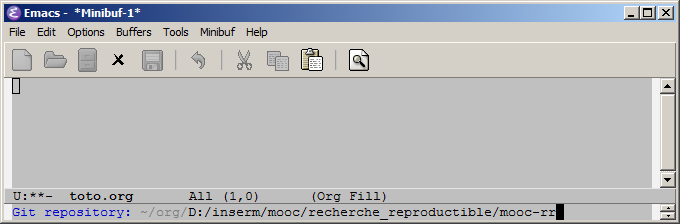

# -*- mode: org -*-
#+TITLE:     Emacs/org-mode
#+DATE: Février 2020
#+STARTUP: overview indent
#+OPTIONS: num:nil toc:t
#+PROPERTY: header-args :eval never-export

Ce document explique comment installer Emacs et Org-mode sur votre
machine et recense un certain nombre d'autres références utiles sur
cet environnement.

*Attention:* Les sections [[#une-configuration-emacs-adaptée-à-la-recherche-reproductible][Une configuration Emacs adaptée à la
"recherche reproductible"]] et [[#un-mod%C3%A8le-darticle-r%C3%A9plicable][Un modèle d'article réplicable]]
expliquent comment configurer Emacs/Org-Mode pour ce MOOC. Ce sont donc
des sections très *importantes* qui sont *illustrées dans [[https://www.fun-mooc.fr/courses/course-v1:inria+41016+self-paced/jump_to_id/9cfc7500f0ef46d288d2317ec7b037b4][deux des trois
tutoriels vidéo de cette page]]*. *Nous vous encourageons vivement à
suivre attentivement ces sections* *et ces vidéos avant de vous lancer
dans les exercices*. De même, nous vous encourageons vivement à
regarder la vidéo [[https://www.fun-mooc.fr/courses/course-v1:inria+41016+self-paced/jump_to_id/9cfc7500f0ef46d288d2317ec7b037b4]["utilisation Emacs/git" disponible sur la même page]].

* Table des matières                                           :TOC:
- [[#installation-demacs-python-et-r][Installation d'Emacs, Python et R]]
- [[#latex-pour-la-génération-de-pdf][LaTeX pour la génération de PDF]]
- [[#une-configuration-emacs-adaptée-à-la-recherche-reproductible][Une configuration Emacs adaptée à la "recherche reproductible"]]
  - [[#etape-0--sauvegarder-et-supprimer-votre-configuration-précédente][Etape 0 : Sauvegarder et supprimer votre configuration précédente]]
  - [[#etape-1--télécharger-notre-configuration][Etape 1 : Télécharger notre configuration]]
  - [[#étape-2--préparez-votre-journal][Étape 2 : Préparez votre journal]]
  - [[#étape-3--placez-le-fichier-de-configuration-emacs-au-bon-endroit][Étape 3 : Placez le fichier de configuration Emacs au bon endroit]]
  - [[#étape-4--adapter-la-configuration-à-vos-besoins-spécifiques-si-nécessaire][Étape 4 : Adapter la configuration à vos besoins spécifiques si nécessaire]]
  - [[#etape-5--vérifier-si-linstallation-fonctionne-ou-non][Etape 5 : Vérifier si l'installation fonctionne ou non]]
  - [[#étape-6--ouvrez-et-commencez-à-utiliser-votre-journal][Étape 6 : Ouvrez et commencez à utiliser votre journal]]
- [[#un-modèle-darticle-réplicable][Un modèle d'article réplicable]]
- [[#emacs-trucs-et-astuces][Emacs trucs et astuces]]
  - [[#pense-bêtes][Pense-bêtes]]
  - [[#tutoriels-vidéo][Tutoriels vidéo]]
  - [[#paquets-emacs-utiles-supplémentaires][Paquets emacs utiles supplémentaires]]
  - [[#autres-ressources][Autres ressources]]

* Installation d'Emacs, Python et R
Il y a beaucoup de façons différentes pour installer Emacs ainsi que
les langages Python et R sur votre ordinateur. Celle que nous
recommandons et décrivons par la suite est basée sur le gestionnaire de
paquets [[https://conda.io/][conda]]. Elle a l'avantage de fonctionner de façon à peu près
identique sous Linux, Windows, et macOS. Son deuxième avantage est que
l'univers conda propose un grand choix de logiciels scientifiques, qui
pourraient vous être utiles pour vos propres projets. Les aguerris en
administration système sont bien sûr libres de choisir une autre
approche, c'est seulement le résultat qui compte !

Téléchargez d'abord la [[https://conda.io/miniconda.html][dernière version de Miniconda]]. Miniconda est
une version légère d'Anaconda, une suite logicielle incluant Python,
Jupyter, R ainsi que les bibliothèques les plus couramment utilisées
en calcul scientifique et en science des données.

Installez Miniconda en suivant les instructions fournies. Si le
logiciel d'installation (ce n'est pas systématique) vous pose la question
#+begin_quote
Do you wish the installer to initialize Miniconda3
by running conda init? [yes|no]
#+end_quote
acceptez avec =yes=. Puis vous verrez le conseil
#+begin_quote
==> For changes to take effect, close and re-open your current shell. <==
#+end_quote
qu'il faut absolument suivre pour que la suite se passe bien. 

*Important:* il vous faudra lancer les commandes suivantes 
dans le shell conda. Comme expliqué dans la [[https://docs.anaconda.com/anaconda/install/verify-install/][documentation Anaconda]],
pour ouvrir ce shell
- Windows: Click Start, search, ou bien sélectionnez Anaconda Prompt dans le menu.
  [[file:Conda_images/win-anaconda-prompt.png]]
- macOS: Cmd+Space pour ouvrir Spotlight Search et tapez “terminal”
  pour ouvrir le shell.
- Linux–CentOS: Open Applications - System Tools - terminal.
- Linux–Ubuntu: Open the Dash by clicking the upper left Ubuntu icon, then type “terminal”.

La première commande à lancer est
#+begin_src shell :results output :exports both
conda update -n base -c defaults conda
#+end_src
pour mettre à jour tous les logiciels dans la distribution =conda=.

Nous pouvons maintenant créer un environnement =conda= pour le parcours Emacs/Org-Mode de ce MOOC :
#+begin_src shell :results output :exports both
conda create -n mooc-rr-emacs
#+end_src
et l'activer :
#+begin_src shell :results output :exports both
conda activate mooc-rr-emacs
#+end_src
Il n'est pas strictement nécessaire d'activer un environnement pour
s'en servir, mais c'est la façon la plus facile qui suscite le moins
d'erreurs. *Vous devez répéter cette activation chaque fois que vous ouvrez un nouveau terminal, avant de pouvoir utiliser cet
environnement.*

Le prochain pas est l'installation de tous les logiciels dont nous
avons besoin et qui font partie de la distribution Miniconda :
#+begin_src shell :results output :exports both
conda install python numpy matplotlib r r-ggplot2 r-dplyr r-hmisc
#+end_src
Nous avons également besoin d'un paquet que ne fait pas partie de
Miniconda. Nous le récupérons de la source indépendante [[https://conda-forge.org/][conda-forge]] :
#+begin_src shell :results output :exports both
conda install -c conda-forge emacs r-parsedate
#+end_src

Vous pouvez maintenant lancer =emacs= directement de la ligne de
commande :
#+begin_src shell :results output :exports both
emacs
#+end_src

Sous Windows et macOS, vous êtes peut-être tenté de lancer Emacs directement de l'interface graphique. Il n'est en effet pas difficile de trouver =Emacs.app= dans l'environnement =conda= et de le lancer en direct. Résistez à la tentation. Il faut bien lancer Emacs de la ligne de commande pour qu'il puisse détecter l'environnement que vous avez activé.
* LaTeX pour la génération de PDF
Si vous voulez convertir vos notebooks en PDF, vous devez aussi
installer LaTeX sur votre ordinateur. Nous expliquons cette procédure
dans une [[https://www.fun-mooc.fr/courses/course-v1:inria+41016+self-paced/jump_to_id/19c2b1de7766484bae73f3ab133463c6][ressource spécifique]].
* Une configuration Emacs adaptée à la "recherche reproductible"
Cette section est illustrée dans une [[https://www.fun-mooc.fr/courses/course-v1:inria+41016+self-paced/jump_to_id/9cfc7500f0ef46d288d2317ec7b037b4][vidéo de démonstration]] (/Mise en place en place Emacs/Orgmode/). Nous vous suggérons de la regarder avant de suivre les instructions données dans cette section.

Emacs s'installe avec une configuration par défaut très basique que
chacun va donc vouloir personnaliser. Compte tenu de la flexibilité
d'Emacs, sa configuration peut vite devenir assez complexe et pourrait
même faire l'objet d'un paquet à part entière (voir par exemple les
différents Emacs Starter Kits [[https://kieranhealy.org/resources/emacs-starter-kit/][ici]] ou [[https://www.emacswiki.org/emacs/StarterKits][ici]]). Dans le contexte de ce
MOOC, nous vous proposons une configuration relativement minimaliste
orientée "/recherche reproductible/" avec Org-Mode. Si vous êtes peu
familier d'Emacs, nous vous recommandons fortement de l'utiliser et de
la modifier le moins possible. Il vous suffira de suivre les
instructions données dans cette section. Si vous êtes un utilisateur
Emacs plus expérimenté, vous pouvez vous contenter de regarder nos
instructions et de ne récupérer que les parties qui vous sembleront
utiles.

Quand vous lancez Emacs la première fois avec cette configuration, il téléchargera quelques extensions que nous utilisons dans ce MOOC. Ceci peut prendre un peu de temps (quelques minutes), et peut provoquer des messages d'erreur en cas de difficultés de connexion réseau. En ce cas, il suffit de quitter Emacs et de le relancer. Une fois que tout est correctement installé, Emacs n'affiche plus aucun message d'erreur au démarrage, et n'a plus besoin de connexion réseau.

Il est malheureusement assez probable que certains d'entre vous
rencontreront des problèmes que nous n'avons pas anticipés. Si c'est
votre cas, posez la question sur le forum. Nous ferons de notre mieux
pour vous aider.
** Etape 0 : Sauvegarder et supprimer votre configuration précédente
Si vous avez déjà utilisé Emacs auparavant, il se peut que vous ayez
déjà un fichier de configuration personnel.  Et même si ce n'est pas
le cas, il se peut que vous en ayez un sans même le savoir puisque
certains paquets peuvent créer ou modifier les fichiers de
configuration d'Emacs. Afin d'éviter tout problème, nous vous
recommandons donc d'enlever ces anciennes configurations.

Les fichiers que vous devez sauvegarder puis supprimer (s'ils existent) sont :

  1. =~/.emacs=
  2. =~/.emacs.el=
  3. =~/.emacs.elc=

Il y a aussi un répertoire que vous devez sauvegarder puis supprimer (s'il existe), avec tout ce qu'il peut contenir :

  4. =~/.emacs.d=

Dans les noms de fichiers ci-dessus, =~/= représente votre répertoire
personnel. Sous Windows, les utilisateurs doivent le remplacer par
=C:\Users\MonNom=, remplaçant MonNom par leur nom d'utilisateur.
** Etape 1 : Télécharger notre configuration 

#+begin_src shell :results output :exports none
export FILE_LIST="rr_org/init.el rr_org/journal.org rr_org/init.org"
tar zcf rr_org_archive.tgz $FILE_LIST
#+end_src

Télécharger [[file:rr_org_archive.tgz][cette archive]] et décompressez la. Elle contient les fichiers
suivants et nous y ferons référence par la suite :

#+begin_src shell :results output :exports results
tar tzf rr_org_org_archive.tgz
#+end_src

#+RESULTS:
: rr_org/init.el
: rr_org/journal.org
: rr_org/init.org

Si vous avez des problèmes avec cette archive, [[file:rr_org/][les fichiers dont vous
aurez besoin sont également disponibles ici]]. Vous allez vite réaliser
que la configuration (=init.el= en emacs lisp) est assez difficile à
suivre. C'est pourquoi nous le gérons via un fichier =init.org=, qui
bien plus lisible. C'est une astuce que vous voudrez peut-être aussi
adopter (pour cela, modifiez le =init.org= et régénérez le =init.el= en
/tanglant/ le fichier avec =M-x org-babel-tangle= comme expliqué dans les
instructions au début de =init.org=).

Si vous utilisez Windows, et si vous utilisez un raccourci du bureau pour démarrer Emacs,
il vous faudra inclure le chemin d'accès au fichier =init.el= dans la commande pour le fichier
raccourci. Par exemple, si vous avez installé Emacs en tant que
=C:\Users\MonNom\emacs=, votre raccourci de bureau devrait exécuter la commande
commande =C:\Users\MonNom\emacs\bin\runemacs.exe -l .emacs.d/init.el=.

** Étape 2 : Préparez votre journal
Créez un répertoire =org/= à la racine de votre répertoire personnel:
#+begin_src shell :results output :exports both
mkdir -p ~/org/g/ 
# sous Windows, utilisez l'explorateur de fichiers pour créer le répertoire C:\Users\MonNom\org
#+end_src
Copiez ensuite le fichier =rr_org/journal.org= dans votre répertoire
=~/org/=. Ce sera votre cahier de laboratoire et toutes les notes que
vous prendrez dans ce dossier avec =C-c c= iront automatiquement dans ce
fichier. La première entrée de ce carnet est remplie de [[https://gitlab.inria.fr/learninglab/mooc-rr/mooc-rr-ressources/blob/master/module2/ressources/rr_org/journal.org][nombreux de
raccourcis claviers Emacs]] que nous vous encourageons à essayer.
** Étape 3 : Placez le fichier de configuration Emacs au bon endroit
Créez le répertoire =~/.emacs.d/= et copiez =rr_org/init.el= dedans.
** Étape 4 : Adapter la configuration à vos besoins spécifiques si nécessaire
Il y a deux situations dans lesquelles il peut être nécessaire de modifier
=init.el= :
1. Votre environnement réseau vous oblige à utiliser un proxy accéder à internet (protocole HTTP(S)).
2. Vous avez plusieurs installations de Python ou R sur votre ordinateur, ou bien elles se trouvent dans des endroits inhabituels ou ne sont pas entièrement configurées.

Voici comment évaluer votre installation :
1. Ouvrez un nouveau terminal. Si vous utilisez =conda= (comme nous le recommandons), activez l'environnement que vous avez créé pour ce MOOC. Puis essayez d'exécuter les commandes suivantes:
   - =python3= et =R= sous Linux et macOS
   - =Python= et =R= sous Windows
   Si vous n'obtenez pas de message d'erreur, tout va bien et vous ne devriez pas avoir à faire quoi que ce soit pour accéder à Python et R sous Emacs.
2. Si vous avez eu un message d'erreur, il va falloir trouver où vous avez installé Python et/où R. Notez le chemin complet à chaque exécutable - c'est ce qu'il faut insérer dans votre =init.el=.

Si vous devez modifier =init.el=, regardez bien les commentaires dans le fichier =init.org= pour comprendre comment ça marche.
** Etape 5 : Vérifier si l'installation fonctionne ou non
Quittez Emacs s'il est en cours d'exécution, et redémarrez-le. Ce premier lancement devrait
prendre un peu de temps parce qu'Emacs va télécharger quelques paquets supplémentaires. Il vous faudra donc vous assurer que votre ordinateur a une connexion internet pour cette étape. Notez également que le téléchargement peut
échouer pour diverses raisons (surcharge des serveurs de paquets, connexion trop lente, ...).
Ces situations durent rarement bien longtemps. C'est pourquoi si cela arrive, nous vous recommandons de vous contenter de
quittez Emacs (=C-x C-c=, c'est-à-dire =Ctrl + x= suivi de =Ctrl + c=) et
redémarrez-le. Au pire, répétez cette opération jusqu'à ce que vous n'obteniez plus d'erreur au
démarrage.

Ensuite, créez un fichier =foo.org=. Copiez les lignes suivantes dans ce fichier :
   : #+begin_src shell :session foo :results output :exports both
   : ls -la # ou dir sous Windows
   : #+end_src

Placez votre curseur à l'intérieur de ce bloc de code et exécutez-le
avec le raccourci clavier suivante : =C-c C-c= (cela signifie faire
=Ctrl + c= deux fois de suite rapidement).

Un bloc =#+RESULTS:= avec le résultat de la commande devrait alors apparaître.

Dans la vidéo, nous avons déjà fait une petite démonstration des
principales fonctionnalités d'emacs/org-mode qui vous aideront à tenir
à jour un journal et à faire de la programmation lettrée. Une liste des
principales fonctionnalités et des raccourcis est donnée dans le [[https://gitlab.inria.fr/learninglab/mooc-rr/mooc-rr-ressources/blob/master/module2/ressources/rr_org/journal.org][première
entrée de votre labbook]]. N'hésitez pas à également suivre [[https://www.fun-mooc.fr/courses/course-v1:inria+41016+self-paced/jump_to_id/b031e4067cf8410c86adbeba2f30c92f][cette ressource]] pour découvrir ces raccourcis.
** Étape 6 : Ouvrez et commencez à utiliser votre journal
À l'étape 2, nous vous avons demandé de créer un journal dans le
fichier =~org/journal.org=. C'est dans ce fichier que les notes prises
avec le raccourci =C-c c= (=Ctrl + c= puis =c=) atterrissent. Nous vous
conseillons fortement de vous assurer que ce fichier est stocké dans
un système de contrôle de version comme git. Nous vous laissons la
responsabilité de mettre tout ceci en place mais si vous avez des
problèmes, n'hésitez pas à poser des questions sur le forum du MOOC.
* Un modèle d'article réplicable
Cette section est illustrée dans une [[https://www.fun-mooc.fr/courses/course-v1:inria+41016+self-paced/jump_to_id/9cfc7500f0ef46d288d2317ec7b037b4#tuto3][vidéo]] (/"Écrire un article
réplicable avec Emacs/Orgmode"/). Nous vous suggérons de la regarder avant de suivre les instructions données dans cette section.

Pour travailler avec ce modèle d'article, vous aurez besoin d'installations fonctionnelles de LaTeX, R, et Python. Si vous ne pouvez pas ouvrir un terminal et exécuter les commandes =R=, =pdflatex=, et =python3=, vous ne pourrez pas générer ce document.
Lors de la compilation, l'article télécharge les paquets LaTeX correspondants. Vous devrez donc également disposer d'une connexion réseau fonctionnelle.

Note pour les utilisateurs de macOS : Puisque l'article est compilé à l'aide de =make=, il vous faudra mettre l'exécutable Emacs dans le chemin de recherche de votre shell (voir [[#rendre-r-et-python-disponible-dans-une-console][la section dédiée à ce sujet]]).

#+begin_src shell :results output :exports none
export FILE_LIST="replicable_article/Makefile replicable_article/article.org replicable_article/biblio.bib replicable_article/article.pdf"
make -C replicable_article/ article.pdf
tar zcf replicable_article.tgz $FILE_LIST
#+end_src

#+RESULTS:

Téléchargez l'[[file:replicable_article.tgz][archive]] suivante et décompressez-la. L'archive contient l'article compilé, vous pouvez donc commencer par le consulter.

Pour reconstruire l'article, supprimez =article.pdf=, ou renommez-le en autre chose. Sinon, la procédure de reconstruction vous indiquera simplement que l'article est déjà à jour. Tapez ensuite =make= pour tout construire à partir de zéro. Ouvrez l'article fraîchement construit =article.pdf= pour voir s'il a l'air correct.

Si vous en avez assez de toujours réexécuter tout le code source lors de l'exportation, recherchez la ligne suivante dans [[https://gitlab.inria.fr/learninglab/mooc-rr/mooc-rr-ressources/blob/master/module2/ressources/replicable_article/article.org][article.org]] :
#+BEGIN_EXAMPLE
# #+PROPERTY: header-args :eval never-export
#+END_EXAMPLE
Si vous supprimez le =#= au début de la ligne qui indique un commentaire, org-mode arrêtera d'évaluer chaque morceau de code à chaque exportation.

* Emacs trucs et astuces
** Pense-bêtes
L'apprentissage d'Emacs et d'Org-Mode peut être difficile car il y a quantité de raccourcis clavier assez inhumaine.
On trouve donc de nombreux pense-bêtes dont voici une sélection à toute fin utile :
*** Emacs
- [[https://gitlab.inria.fr/learninglab/mooc-rr/mooc-rr-ressources/blob/master/module2/ressources/rr_org/journal.org][Notre liste des raccourcis Emacs les plus utiles dans le contexte de notre configuration emacs /recherche reproductible/.]]
- [[https://www.gnu.org/software/emacs/refcards/pdf/fr-refcard.pdf][Le pense-bête officiel de GNU emacs]] 
- Deux superbes pense-bêtes par Sacha Chua sur [[http://sachachua.com/blog/wp-content/uploads/2013/05/How-to-Learn-Emacs-v2-Large.png][comment apprendre Emacs]]
  et sur [[http://sachachua.com/blog/wp-content/uploads/2013/08/20130830-Emacs-Newbie-How-to-Learn-Emacs-Keyboard-Shortcuts.png][comment apprendre les raccourcis d'Emacs]].
*** Org-mode
- [[https://gitlab.inria.fr/learninglab/mooc-rr/mooc-rr-ressources/blob/master/module2/ressources/rr_org/journal.org][Notre liste des raccourcis Emacs les plus utiles dans le contexte de notre configuration emacs /recherche reproductible/.]]
- [[https://orgmode.org/worg/orgcard.html][Le pense-bête officiel d'org-mode]] ([[https://www.gnu.org/software/emacs/refcards/pdf/orgcard.pdf][en pdf]]).
- [[https://orgmode.org/worg/dev/org-syntax.html][La description officielle de la syntaxe org-mode]] et une [[https://gist.github.com/hoeltgman/3825415][description relativement concise]].
** Tutoriels vidéo
Pour ceux d'entre vous qui préfèrent des explications vidéo, voici une
[[https://www.youtube.com/playlist?list=PL9KxKa8NpFxIcNQa9js7dQIHc81b0-Xg][chaîne Youtube avec de nombreux tutoriels emacs]].

Pour des informations générales sur un certain nombre de paquets, vous pouvez également
vouloir jeter un œil au blog [[https://cestlaz.github.io/stories/emacs/][Using Emacs]].
** Paquets emacs utiles supplémentaires
*** Company-mode
[[http://company-mode.github.io/][Company-mode]] est un paquet permettant d'améliorer les capacités de complétion de texte pour Emacs.
Il offre des capacités de complétion intelligente (et pas uniquement syntaxique) pour la plupart des langages. Si ce type de fonctionnalité vous parait utile, nous vous encourageons à suivre les instructions d'installation du site web officiel:
page Web officielle : [[http://company-mode.github.io/][http://company-mode.github.io/]].
*** Magit
[[https://magit.vc/][Magit]] est une interface Emacs pour Git. Son utilisation est brièvement
illustrée dans le contexte de ce MOOC dans un [[https://www.fun-mooc.fr/courses/course-v1:inria+41016+self-paced/jump_to_id/9cfc7500f0ef46d288d2317ec7b037b4][tutoriel vidéo]].
("/Utilisation Emacs/git/").

C'est un outil vraiment très puissant et nous l'utilisons quotidiennement mais il est nécessaire de 
vraiment comprendre ce que fait git dans les coulisses. Si
vous pensez que cela vous serait utile, vous devriez suivre [[https://magit.vc/screenshots/][ce petit tour du propriétaire]] ou bien [[https://www.emacswiki.org/emacs/Magit][cette brève introduction]]. 

Si vous avez installé notre configuration "/recherche reproductible/",
vous pouvez facilement invoquer magit en utilisant ~C-x g~. Si vous n'êtes pas déjà dans un répertoire sous contrôle de version avec git, Magit vous demandera le chemin de votre copie local du dépôt git
(le chemin vers mooc-rr dans le contexte de ce MOOC).

Si vous n'utilisez pas notre configuration, vous devriez jeter un coup d'œil à [[https://magit.vc/manual/magit/Installing-from-Melpa.html#Installing-from-Melpa][comment installer magit à partir de l'archive MELPA]].

La méthode suivante a été testée avec Windows et a fonctionné sans encombre :
- Ajoutez le texte suivant dans votre fichier =.emacs.d/init.el= :
  #+begin_src emacs-lisp
  (require 'package)
  (add-to-list 'package-archives
               '("melpa" . "http://melpa.org/packages/") t)

  #+end_src
- Lancez Emacs et exécutez les commandes suivantes :
  #+BEGIN_EXAMPLE
  M-x package-refresh-contents RET
  M-x package-install RET magit RET
  #+END_EXAMPLE
  NB : =M-= (Meta) correspond à la touche =<Alt>= et =RET= correspond à la touche
  =<Entrée>=.
** Autres ressources
- The compact Org-mode Guide ([[https://orgmode.org/orgguide.pdf][lien vers le pdf]])
- Une source inépuisable de magie emacs/org-mode: le site web de Bernt  Hansen "[[http://doc.norang.ca/org-mode.html][Organisez votre vie en texte brute]]", dont les sources sont évidemment eux-mêmes un [[http://doc.norang.ca/org-mode.org][document org-mode]].
- [[https://github.com/dfeich/org-babel-examples][De nombreux exemples illustrant l'utilisation de différents langages]].

