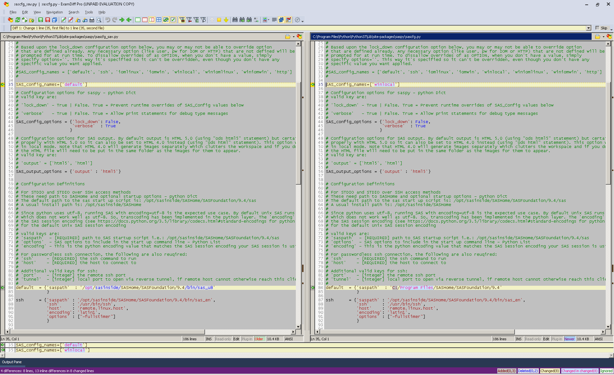
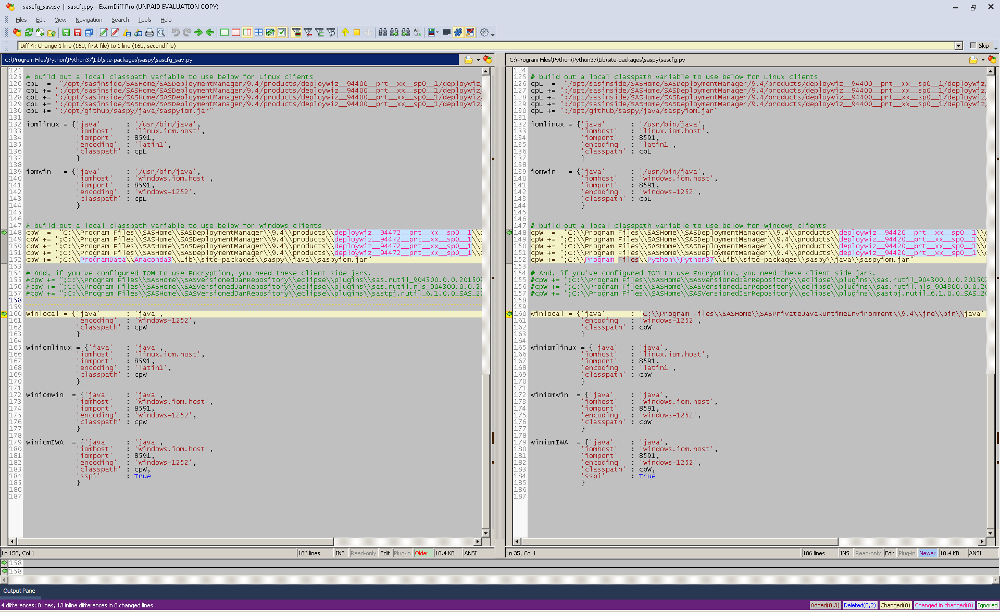
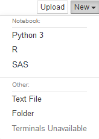
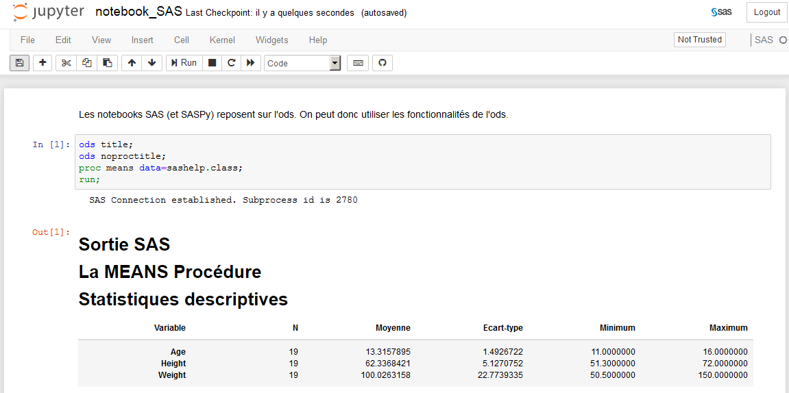
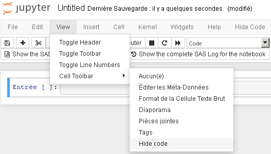
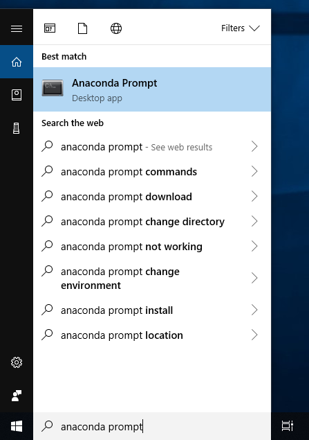

# -*- mode: org -*-
#+TITLE:     Jupyter: tips and tricks, installing and configuring
#+AUTHOR:    Arnaud Legrand, Benoit Rospars, Konrad Hinsen
#+DATE: February 2020
#+STARTUP: overview indent
#+OPTIONS: num:nil toc:t
#+PROPERTY: header-args :eval never-export

Once you will have followed all these installation instructions, you
will be able to run jupyter notebooks by simply typing in a shell/DOS
command:
#+begin_src shell :results output :exports both
jupyter notebook
#+end_src

* Table of Contents                                                     :TOC:
- [[#jupyter-tips-and-tricks][Jupyter tips and tricks]]
  - [[#creating-or-importing-a-notebook][Creating or importing a notebook]]
  - [[#running-r-and-python-in-the-same-notebook][Running R and Python in the same notebook]]
  - [[#other-languages][Other languages]]
  - [[#improving-notebook-readability][Improving notebook readability]]
- [[#installing-and-configuring-jupyter-on-your-computer][Installing and configuring Jupyter on your computer]]
  - [[#installing-jupyter-plus-python-r-][Installing Jupyter (plus Python, R, ...)]]
  - [[#latex-for-generating-pdf-files][LaTeX for generating PDF files]]
  - [[#interacting-with-gitlab-and-git][Interacting with GitLab and git]]

* Jupyter tips and tricks
The following [[https://www.dataquest.io/blog/jupyter-notebook-tips-tricks-shortcuts/][webpage]] lists several Jupyter tricks (in particular, it
illustrates many =IPython magic= commands) that should improve your
efficiency (note that this blog post is about two years old so some of
the tricks may have been integrated in the default behavior of Jupyter
now).
** Creating or importing a notebook
Using the Jupyter environment we deployed for this MOOC will allow to
easily access any file from your default GitLab project. There are
situations however where you may want to play with other notebooks.
- Adding a brand new notebook in a given directory :: Simply follow
     the following steps:
  1. From the menu: =File -> Open=. You're now in the Jupyter file manager.
  2. Navigate to the directory where you want your notebook to be created.
  3. Then from the top right button: =New -> Notebook: Python 3=.
  4. Give your notebook a name from the menu: =File -> Rename=.

     N.B.: If you create a file by doing ~File -> New Notebook ->
     Python 3~, the new notebook will be created in the current
     directory. Moving it afterward is possible but a bit cumbersome
     (you'll have to go through the Jupyter file manager by following
     the menu =File -> Open=, then select it, =Shut= it =down=, and =Move=
     and/or =Rename=).
- Importing an already existing notebook :: If your notebook is
     already in your GitLab project, then simply synchronize by using
     the =Git pull= button and use the =File -> Open= menu. Otherwise,
     imagine, you want to import the [[https://app-learninglab.inria.fr/gitlab/moocrr-session2/moocrr-reproducibility-study/blob/master/src/Python3/challenger.ipynb][following notebook]] from someone
     else's repository to re-execute it.
  1. Download the file on your computer. E.g., for this [[https://app-learninglab.inria.fr/gitlab/moocrr-session2/moocrr-reproducibility-study/blob/master/src/Python3/challenger.ipynb][GitLab hosted
     notebook]], click on =Open raw= (a small =</>= within a document icon)
     and save (=Ctrl-S= on most browsers) the content (a long JSON text
     file).
  2. Open the Jupyter file manager from the menu =File -> Open= and
     navigate to the directory where you want to upload your notebook.
  3. Then from the top right button, =Upload= the previously downloaded
     notebook and confirm the upload.
  4. Open the freshly uploaded notebook through the Jupyter file
     manager.

You will find [[file:../../documents/notebooks/][here]] a list of jupyter notebooks that illustrate how
different languages (python, R, SAS) can be used in Jupyter.

** Running R and Python in the same notebook
It used to be impossible with earlier versions of Jupyter but it is
now very easy thanks to the the =rpy2= package (see the details of the
installation procedurer in the corresponding section below) that
allows you to use both languages in the same notebook. Simply open a
new python notebook and follow these instructions:
1. Loading =rpy2=: 
   #+begin_src python :results output :exports both
   %load_ext rpy2.ipython
   #+end_src
2. Using the =%R= Ipython magic:
   #+begin_src python :results output :exports both
   %%R 
   summary(cars)
   #+end_src
   Python objects can then even be passed to R as follows (assuming =df=
   is a pandas dataframe):
   #+begin_src python :results output :exports both
   %%R -i df
   plot(df)
   #+end_src
Note that this =%%R= notation indicates that R should be used for the whole cell but
an other possibility is to use =%R= to have a single line of R within a
python cell.

[[file:../../documents/notebooks/notebook_Jupyter_Python_R.ipynb][Here]] is an notebook example using both R et Python

** Other languages
Jupyter is not limited to Python and R. Many other languages are available:
[[https://github.com/jupyter/jupyter/wiki/Jupyter-kernels][https://github.com/jupyter/jupyter/wiki/Jupyter-kernels]], including
non-free languages like SAS, Mathematica, Matlab... Note that the maturity of these kernels differs widely.

None of these other languages have been deployed in the context of our
MOOC but you may want to read the next sections to learn how
to set up your own Jupyter on your computer and benefit from these extensions.

*** SAS
SAS is a proprietary statistical software which is very commonly used
in health research. Since the question was asked several times, if you
really need to stay with SAS, you should know that SAS can be used
within Jupyter using either the [[https://sassoftware.github.io/sas_kernel/][Python SASKernel]] (similar to the
=IRKernel=) or the [[https://sassoftware.github.io/saspy/][Python SASPy]] package (similar to the =rpy2= package).

Since proprietary software such as SAS cannot easily be inspected, we
discourage its use as it hinders reproducibility by essence. But
perfection does not exist anyway and using Jupyter literate
programming approach allied with systematic control version and
environment control will certainly help anyway.

*[[https://sassoftware.github.io/saspy/][SASPy]]*
- Install =saspy= with the =pip= command. E.g.,
  #+begin_src shell :results output :exports both
  python -m pip install saspy
  #+end_src
- On Windows, you will have to modify the file =C:\Program
  Files\Python\Python37\Lib\site-packages\saspy\sascfg_sav.py= and to
  adapt it to your own system. In both following screenshots, the left
  window corresponds to the initial file and the right window
  corresponds to the modified one:
  #+BEGIN_CENTER
  
  #+END_CENTER
  #+BEGIN_CENTER
  
  #+END_CENTER
- Here is a [[file:../../documents/notebooks/notebook_Jupyter_Python_SAS.ipynb][example of Python/SAS notebook]].
- NB : Some people from the first edition of the MOOC reported us that
  the pdf export did not not seem to work for SAS notebooks. However,
  they could obtain pdf files through pandoc. E.g., export in HTML (or
  markdown) in jupyter and then run:
  #+begin_src shell :results output :exports both
  pandoc --variable=geometry:a4paper --variable=geometry:margin=1in notebook_sas.html -o  notebook_sas.pdf  
  #+end_src
- Useful link: https://sassoftware.github.io/saspy/

*[[https://sassoftware.github.io/sas_kernel/install.html][SASKernel]]*

- The =sas_kernel= is based on the =saspy= so first instll =saspy= by
  following the previous instructions.
- Install the =sas_kernel= package through =pip=. E.g.,
  #+begin_src shell :results output :exports both
  python -m pip install sas_kernel  
  #+end_src
- You will then be able to create SAS notebooks
  #+BEGIN_CENTER
  
  #+END_CENTER
  #+BEGIN_CENTER
  
  #+END_CENTER
  Please note the top right SAS icon.
- Here is a [[file:../../documents/notebooks/notebook_Jupyter_SAS.ipynb][example of SAS notebook]].
- Useful link: https://sassoftware.github.io/sas_kernel/install.html

** Improving notebook readability
Here are a few extensions that can ease your life:
- [[https://stackoverflow.com/questions/33159518/collapse-cell-in-jupyter-notebook][Code folding]] to improve readability when browsing the notebook.
  #+begin_src shell :results output :exports both
  pip3 install jupyter_contrib_nbextensions
  # jupyter contrib nbextension install --user # not done yet
  #+end_src
- [[https://github.com/kirbs-/hide_code][Hiding code]] to improve readability when exporting.
  #+begin_src sh :results output :exports both
  sudo pip3 install hide_code
  sudo jupyter-nbextension  install --py hide_code
  jupyter-nbextension  enable --py hide_code
  jupyter-serverextension enable --py hide_code
  #+end_src
  
  Then in jupyter, choose =Hide_code= in the menu
  #+BEGIN_CENTER
  
  #+END_CENTER
  You should then obtain this:
  #+BEGIN_CENTER
  
  #+END_CENTER
  You should then use the icons to export rather than going through
  the menu:
  #+BEGIN_CENTER
  
  #+END_CENTER
  NB: In the first edition of the MOOC some people had issues making
  it work under Windows.
* Installing and configuring Jupyter on your computer
In this section, we explain how to set up a Jupyter environment on
your own computer similar to the one deployed for this MOOC.
** Installing Jupyter (plus Python, R, ...)
First, download the [[https://conda.io/miniconda.html][most recent version of Miniconda]]. Miniconda is a lightweight edition of Anaconda, a software distribution that includes Python, R, Jupyter, and many popular libraries for scientific computing and data science.

On our server, we use version =4.5.4= of Miniconda and versio =3.6= of Python. In theory, you could download [[https://gist.github.com/brospars/4671d9013f0d99e1c961482dab533c57][the environment file =mooc_rr=]] and reproduce an identical environment on your own computer. Unfortunately, our server was set up in 2018, and =conda= has changed quite a bit since then. Reconstructing this environment is therefore no longer possible. We will show you in the following how to get an equivalent environment but using more recent versions of all the software.

Install Miniconda following the supplied instructions. Whenever (it it not systematic) the installer asks you the question
#+begin_quote
Do you wish the installer to initialize Miniconda3
by running conda init? [yes|no]
#+end_quote
answer =yes=. You will then see the advice
#+begin_quote
==> For changes to take effect, close and re-open your current shell. <==
#+end_quote
which you must respect to make sure that the following steps work correctly. 

*Important:* You should then run all the following commands through the
conda shell. As explained in the [[https://docs.anaconda.com/anaconda/install/verify-install/][Anaconda documentation]], to open the Anaconda prompt:
- Windows: Click Start, search, or select Anaconda Prompt from the menu.
  
- macOS: Cmd+Space to open Spotlight Search and type “terminal” to open the program.
- Linux–CentOS: Open Applications - System Tools - terminal.
- Linux–Ubuntu: Open the Dash by clicking the upper left Ubuntu icon, then type “terminal”.

The first command to run next is
#+begin_src shell :results output :exports both
conda update -n base -c defaults conda
#+end_src
which updates all the software in the =conda= distribution.

We can now create a =conda= environment for the RStudio path of out MOOC:
#+begin_src shell :results output :exports both
conda create -n mooc-rr-jupyter
#+end_src
and activate it:
#+begin_src shell :results output :exports both
conda activate mooc-rr-jupyter
#+end_src
It is not strictly necessary to activate an environment in order to use it, but doing so makes the use of the environment easier and less error prone. *You have to perform this activation step every time you open a new terminal, before you can work with the environment.*

The next step is the installation of all software packages we need and which are in the Miniconda distribution:
#+begin_src shell :results output :exports both
conda install jupyter python numpy matplotlib pandas r r-irkernel rpy2 tzlocal simplegeneric
#+end_src
We also need two packages that is not in Miniconda. We request the first one from the independent package source [[https://conda-forge.org/][conda-forge]]:
#+begin_src shell :results output :exports both
conda install -c conda-forge r-parsedate
#+end_src
and the second one from the main Python code repository, [[https://pypi.org/][PyPI]]:
#+begin_src shell :results output :exports both
pip install isoweek
#+end_src

You can now start Jupyter:
#+begin_src shell :results output :exports both
jupyter notebook
#+end_src
and work with our examples and exercises.
** LaTeX for generating PDF files
For exporting your notebooks as PDF files, you must also install LaTeX
on your system. We describe this process in a [[https://www.fun-mooc.fr/courses/course-v1:inria+41016+self-paced/jump_to_id/19c2b1de7766484bae73f3ab133463c6][separate resource]].
** Interacting with GitLab and git
To ease your experience, we added pull/push buttons that allow
you to commit and sync with GitLab. This development was specific to
the MOOC but inspired from a previous [[https://github.com/Lab41/sunny-side-up][proof of concept]]. We have
recently discovered that someone else developed about at the same time
a [[https://github.com/sat28/githubcommit][rather generic version of this Jupyter plugin]]. Otherwise, remember
that it is very easy to insert a shell cell in Jupyter in which you
can easily issue git commands. This is how we work most of the time. If you choose this solution, you will have to configure Git on your
computer. To do this, you can follow the video 
[[https://www.fun-mooc.fr/courses/course-v1:inria+41016+self-paced/jump_to_id/7508aece244548349424dfd61ee3ba85][Configure git for Gitlab]] and read the document
[[https://gitlab.inria.fr/learninglab/mooc-rr/mooc-rr-ressources/blob/master/module2/ressources/gitlab.org][Git and GitLab]].

This being said, you may have noticed that Jupyter keeps a perfect
track of the sequence in which cells have been run by updating the
"output index". This is a very good property from the reproducibility
point of view but depending on your usage, you may find it a bit
painful when committing. Some people have thus developed [[https://gist.github.com/pbugnion/ea2797393033b54674af][specific git
hooks]] to ignore these numbers when committing Jupyter notebooks. There
is a long an interesting discussion about various options on
[[https://stackoverflow.com/questions/18734739/using-ipython-notebooks-under-version-control][StackOverflow]].

For those who use [[https://blog.jupyter.org/jupyterlab-is-ready-for-users-5a6f039b8906][JupyterLab]] rather than the plain Jupyter, a specific [[https://github.com/jupyterlab/jupyterlab-git][JupyterLab git plugin]] has been developed to offer a nice version control experience.

