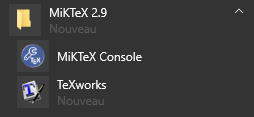
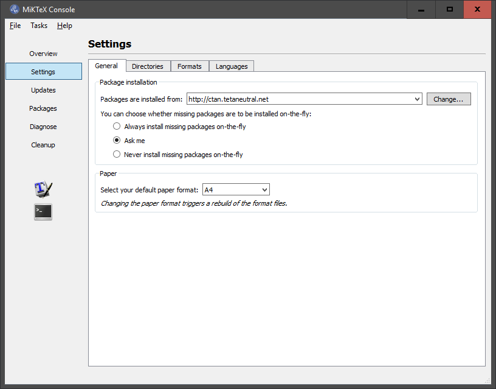
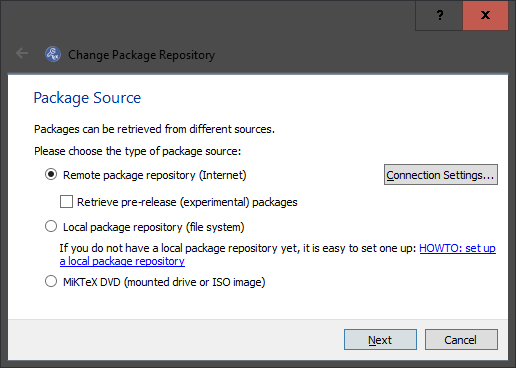
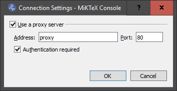
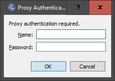
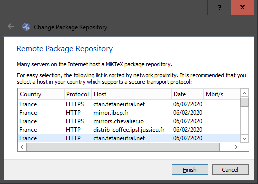
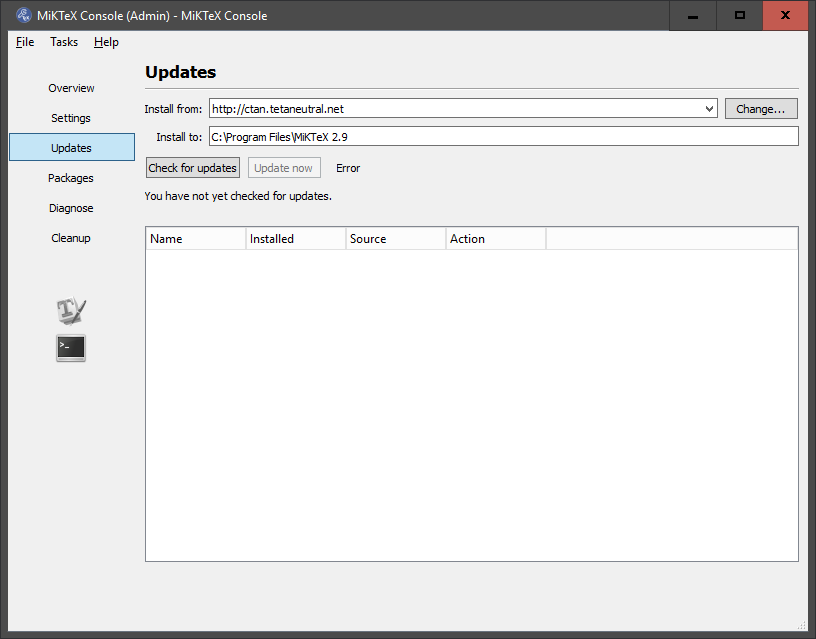
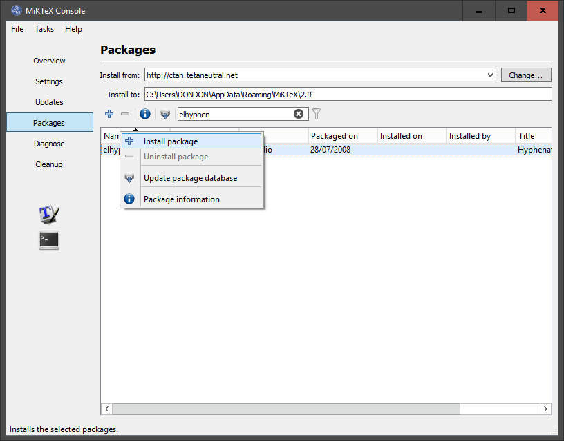
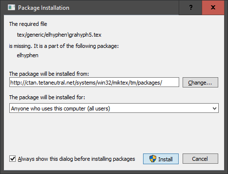

# -*- mode: org -*-
#+TITLE: Configuration de MiKTeX
#+DATE: Février 2020
#+STARTUP: overview indent
#+OPTIONS: num:nil toc:t
#+PROPERTY: header-args :eval never-export

* Ouvrir la console MikTex

* Settings

Si besoin, configurer le proxy :

/Change/

/Connection Settings/

/OK/

/Next/

Choisir un site miroir :

* Updates

/Check for updates/

/Update now/

* Packages

Il est possible de filtrer sur le nom du package :

Installer les packages suivants : /elhyphen, cbcoptic, dehyph, ruhyphen, ukrhyph/

puis /ltxcmds, infwarerr, kvsetkeys, kvdefinekeys, pdfescape, hycolor, letltxmacro, auxhook, kvoptions, intcalc, etexcmds, bitset, 
bigintcalc, atbegshi, atveryend, rerunfilecheck, uniquecounter, geometry, fancyvrb, framed, grffile, refcount, gettitlestring/

L'export au format pdf depuis RStudio devrait fonctionner.

* Remarques

Les étapes ci-dessous montrent mon cheminement mais ne sont normalement pas 
nécessaires.

Si les packages MiKTeX ne sont pas installés et si l'option « Ask me » est 
sélectionnée dans l'onglet Settings (option par défaut), RStudio va demander 
d'installer la première série de packages (/elhyphen, cbcoptic, dehyph, 
ruhyphen, ukrhyph/) :

Après l'installation des 5 packages, l'export au format pdf depuis RStudio 
produit le message d'erreur suivant :

: output file: test.knit.md
: 
: ! pdflatex: warning: running with elevated privileges
: 
: ! Sorry, but C:\PROGRA~1\MIKTEX~1.9\miktex\bin\x64\pdflatex.exe did not succeed.
: 
: ! The log file hopefully contains the information to get MiKTeX going again:
: 
: !   C:\Users\DONDON\AppData\Local\MiKTeX\2.9\miktex\log\pdflatex.log
: 
: Erreur : LaTeX failed to compile test.tex. See https://yihui.org/tinytex/r/#debugging for debugging tips. See test.log for more info.
: Exécution arrêtée

Dans la console MikTex, choisir l'option « Never install missing packages 
on-the-fly ». L'export au format pdf depuis RStudio indique les packages 
MiKTeX manquants à installer depuis la console MiKTeX :

: ! LaTeX Error: File `ltxcmds.sty' not found.
: 
: ! Emergency stop.
: <read *> 
: 
: ! pdflatex: warning: running with elevated privileges
: 
: Erreur : LaTeX failed to compile test.tex. See https://yihui.org/tinytex/r/#debugging for debugging tips. See test.log for more info.
: Exécution arrêtée

Les deux séries de packages ne se comportent pas de la même façon. Si les 5 
premiers packages ne sont pas installés et l'option « Never install missing 
packages on-the-fly » est active, l'export s'arrête au format Markdown 
(« output file: test.knit.md ») mais sans message d'erreur.

*Autrement dit :*

En cas d'arrêt de l'export au format Markdown, sélectionner l'option « Ask me » 
dans l'onglet Settings de la console MiKTeX et relancer l'export pour connaître
le nom du package MiKTeX manquant.

En cas de message d'erreur « Erreur : LaTeX failed to compile », sélectionner 
l'option « Never install missing packages on-the-fly » dans l'onglet Settings
de la console MiKTeX et relancer l'export pour connaître le nom du package 
MiKTeX manquant.