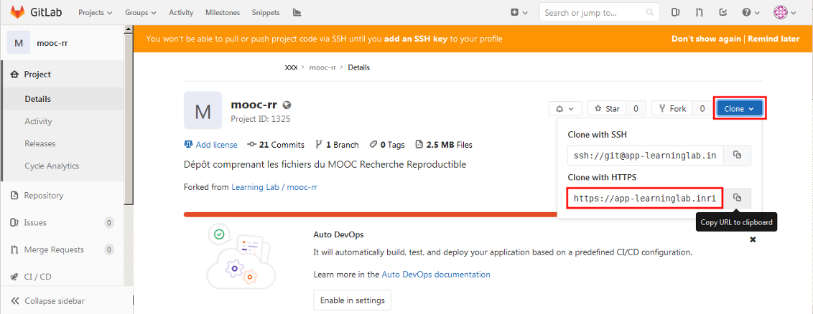

# -*- mode: org -*-
#+TITLE:     Using Git from RStudio
#+DATE: June, 2018
#+STARTUP: overview indent
#+OPTIONS: num:nil toc:t

* Table of Contents                                                     :TOC:
- [[#to-begin][To begin]]
- [[#cloning-a-repository][Cloning a repository]]
- [[#modifying-a-file][Modifying a file]]

* To begin
If you have never used git with RStudio, *we strongly advise that you
follow [[https://www.fun-mooc.fr/courses/course-v1:inria+41016+self-paced/jump_to_id/d132a854b0464ad29085cedaded23136][our tutorial on using git from RStudio]]* (/"RStudio et Gitlab"/
). Before proceeding, make sure you also have followed the
*[[https://www.fun-mooc.fr/courses/course-v1:inria+41016+self-paced/jump_to_id/7508aece244548349424dfd61ee3ba85]["git/GitLab configuration" tutorial]]*.

Alternatively, you may want to watch [[https://www.youtube.com/embed/uHYcDQDbMY8][this video]] (in English). If you
do not like videos, you should have a look at the [[https://swcarpentry.github.io/git-novice/14-supplemental-rstudio/index.html][step-by-step
explanations from Software Carpentry]]. It comes with many screenshots
and is quite progressive.

* Cloning a repository
Open RStudio and do the following steps:
- Create a new version controled project: =File / New Project / Version Control=
  #+BEGIN_CENTER
  [[file:rstudio_images/new_project.png]]

  [[file:rstudio_images/git.png]]
  #+END_CENTER
- Get the URL from your GitLab repository:
  #+BEGIN_CENTER
  
  #+END_CENTER
- Indicate this URL in the "Repository URL" field (/you may want to
  prefix this URL with =xxx@= where =xxx= is/ /your Gitlab id to avoid
  repeatedly giving it later on/). 
  #+BEGIN_CENTER
  [[file:rstudio_images/clone.png]]
  #+END_CENTER
- If you're behind a proxy, git should be configured
  accordingly. Check the 
  [[https://www.fun-mooc.fr/courses/course-v1:inria+41016+self-paced/jump_to_id/d86ab5b2b3054b179582da125131e2a5#dealing-with-proxies]["Dealing with proxies" section]].
- Git will then connect to Gitlab and fetch a whole copy of the
  repository.
- RStudio should restart in a mode related to Git:
  #+BEGIN_CENTER
  [[file:rstudio_images/rstudio.png]]
  #+END_CENTER
- The file manager on the right, allows you to browse the version
  controled repository.
* Modifying a file
- Open =Module2/exo1/toy_document.Rmd= and perform a simple
  modification.
- Save
- Go to the Git menu to commit
  #+BEGIN_CENTER
  [[file:rstudio_images/commit.png]]

  [[file:rstudio_images/commit2.png]]
  #+END_CENTER
- Select the lines to commit and then click on =commit=
  #+BEGIN_CENTER
  [[file:rstudio_images/commit5.png]]
  #+END_CENTER
  Your modifications have now been commited on your local
  machine. They haven't been propagated to GitLab yet.
- Click on =push= to propagate them on GitLab
  #+BEGIN_CENTER
  [[file:rstudio_images/push.png]]

  [[file:rstudio_images/push2.png]]

  [[file:rstudio_images/push3.png]]
  #+END_CENTER
  *NB*: You won't be able to propagate your modifications on GitLab if
  some modifications have been done on GitLab in the meantime. 
  [[file:rstudio_images/push4.png]]
- You should first merge these remote modifications locally. Click on
  =pull= to get these modifications on your machine.
  
  The video [[https://www.fun-mooc.fr/courses/course-v1:inria+41016+self-paced/jump_to_id/c20f53a4c00241589b00799fa909771e#git_2][Let's demystify Git, Github, Gitlab/Working together]] 
  explains how to handle conflict with Git.
