# -*- mode: org -*-
#+TITLE:     Rstudio
#+DATE: June, 2018
#+STARTUP: overview indent
#+OPTIONS: num:nil toc:t

* Table des matières                                           :TOC:
- [[#installer-rstudio][Installer RStudio]]
  - [[#linux-debian-ubuntu][Linux (debian, ubuntu)]]
  - [[#mac-osx-and-windows][Mac OSX and Windows]]
- [[#documentation-rstudio][Documentation RStudio]]
- [[#utiliser-git-avec-rstudio][Utiliser Git avec RStudio]]
  - [[#cloner-un-dépôt][Cloner un dépôt]]
  - [[#modifier-un-fichier][Modifier un fichier]]

* Installer RStudio
** Linux (debian, ubuntu)
Nous ne fournissons ici que des instructions pour les distributions
  basées sur Debian. N’hésitez pas à contribuer à ce document en
  fournissant des informations à jour sur les autres distributions
  (RedHat, Fedora, par exemple). 

Aujourd'hui, les versions stables des distributions les plus courantes
fournissent des versions assez récentes de R :
- Debian (stretch) est livré avec [[https://packages.debian.org/stretch/r-base][R 3.3.3-1]], [[https://packages.debian.org/stretch/r-cran-knitr][knitr 1.15.1]], et  [[https://packages.debian.org/stretch/r-cran-ggplot2][ggplot 2.2.1]]
- Ubuntu (bionic 18.04) est livré avec [[https://packages.ubuntu.com/bionic/r-base][R 3.4.4]], [[https://packages.ubuntu.com/bionic/r-cran-knitr][knitr 1.17]], et [[https://packages.ubuntu.com/bionic/r-cran-ggplot2][ggplot 2.2.1]]
- Ubuntu (artful 17.04) est livré avec [[https://packages.ubuntu.com/artful/r-base][R 3.4.2]], [[https://packages.ubuntu.com/artful/r-cran-knitr][knitr 1.15]], et [[https://packages.ubuntu.com/artful/r-cran-ggplot2][ggplot 2.2.1]]
Si votre distribution est plus ancienne, c'est peut-être l'occasion de
la mettre à jour...

*** Installer R
Pour commencer, vous devez installer le langage R et quelques packages
en exécutant (à la racine) :
#+BEGIN_SRC shell
apt-get update ; sudo apt-get install r-base r-cran-knitr r-cran-ggplot2 
#+END_SRC

Si l'installation de =r-cran-knitr= ou  =r-cran-gplot2= échoue, vous pouvez
également installer ces packages manuellement en exécutant les
commandes suivantes sous R (ou RStudio) : 
#+BEGIN_SRC R
install.packages("knitr")
install.packages("ggplot2")
#+END_SRC

Si vous envisagez d'exporter des documents pdf avec LaTeX, il faudra
probablement aussi exécuter (à la racine) : 
#+begin_src shell :results output :exports both
apt-get update ; apt-get install texlive-base
#+end_src

*** Installer RStudio
RStudio n’est malheureusement pas intégré à Debian. Le plus simple est
 de télécharger le paquet Debian correspondant sur le  [[https://www.rstudio.com/products/rstudio/download/#download][site RStudio]],
 puis de l’installer manuellement (vous devrez peut-être adapter le
 numéro de version) :  

#+BEGIN_SRC shell
cd /tmp/
wget https://download1.rstudio.org/rstudio-xenial-1.1.453-amd64.deb
sudo dpkg -i rstudio-xenial-1.1.453-amd64.deb
sudo apt-get update ; sudo apt-get -f install # to fix possibly missing dependencies
#+END_SRC
** Mac OSX and Windows
- Installer R et Python en suivant les instruction dans une [[https://www.fun-mooc.fr/courses/course-v1:inria+41016+session02/jump_to_id/19c2b1de7766484bae73f3ab133463c6][ressource spécifique]].
- Télécharger et installer RStudio depuis le [[https://www.rstudio.com/products/rstudio/download/#download][site RStudio]] en
  choisissant le bon système d'exploitation. 
- Télécharger et installer MiKTeX depuis le [[https://miktex.org/download][site MiKTeX]] en choisissant le bon
  système d'exploitation. Vous serez amené à installer différents
  packages lors du premier export pdf. 
- Ouvrir RStudio et exécuter les commandes suivantes dans la console pour
  installer =knitr= et =ggplot2= 
#+BEGIN_SRC R
install.packages("knitr", dep=TRUE)
install.packages("ggplot2", dep=TRUE)
#+END_SRC
* Documentation RStudio
L’équipe de RStudio a créé différents matériels et tutoriels très bien
faits. Nous vous recommandons de consulter les [[https://www.rstudio.com/resources/cheatsheets/][fiches mémo]]. En
particulier, vous pourriez être intéressés par celles-ci : 
- [[https://github.com/rstudio/cheatsheets/raw/master/rstudio-ide.pdf][RStudio IDE]],
- [[https://github.com/rstudio/cheatsheets/raw/master/rmarkdown-2.0.pdf][R Markdown]] (here is also a [[https://rmarkdown.rstudio.com/][nice step-by-step presentation of Rmarkdown]]),
- The [[https://www.rstudio.com/wp-content/uploads/2015/03/rmarkdown-reference.pdf][R Markdown Reference guide]],
- [[https://github.com/rstudio/cheatsheets/raw/master/data-visualization-2.1.pdf][Data visualization with ggplot2]],
- [[https://github.com/rstudio/cheatsheets/raw/master/data-transformation.pdf][Data transformation with dplyr]]
Voici aussi les versions françaises de certains documents mais elles
ne sont pas toujours à jour :  
- [[https://github.com/rstudio/cheatsheets/raw/master/translations/french/rstudio-IDE-cheatsheet.pdf][IDE RStudio]]
- [[https://github.com/rstudio/cheatsheets/raw/master/translations/french/ggplot2-french-cheatsheet.pdf][Visualisation de données avec ggplot2]]
- [[https://github.com/rstudio/cheatsheets/raw/master/translations/french/data-wrangling-french.pdf][Transformation de données avec dplyr]]
- [[https://www.fun-mooc.fr/c4x/UPSUD/42001S02/asset/RMarkdown.pdf][Un court document sur R Markdown]]

* Utiliser Git avec RStudio
La première chose à faire est de configurer Git sur votre
ordinateur. Pour ce faire, vous pouvez suivre la vidéo
[[https://www.fun-mooc.fr/courses/course-v1:inria+41016+session02/jump_to_id/7508aece244548349424dfd61ee3ba85][configurer Git pour Gitlab]] (en français) et le document
[[https://gitlab.inria.fr/learninglab/mooc-rr/mooc-rr-ressources/blob/master/module2/ressources/gitlab_fr.org][Git et Gitlab]] correspondant (en français).

Vous pourrez alors utiliser Git avec RStudio. Pour ce faire, vous
pouvez suivre la vidéo [[https://www.fun-mooc.fr/courses/course-v1:inria+41016+session02/jump_to_id/d132a854b0464ad29085cedaded23136][RStudio - Gitlab]] (en français) dont les étapes
sont reprises ci-dessous.

/(Nous vous signalons aussi cette/ [[https://www.youtube.com/embed/uHYcDQDbMY8][vidéo]] /(en anglais) ainsi que le/ [[https://swcarpentry.github.io/git-novice/14-supplemental-rstudio/index.html][tuto
pas à pas]] /(en anglais) de Software Carpentry.)/ 

** Cloner un dépôt
Ouvrir RStudio et procéder comme suit :
- Créer un nouveau projet sous contrôle de version : =File / New Project / Version Control= 
  #+BEGIN_CENTER
  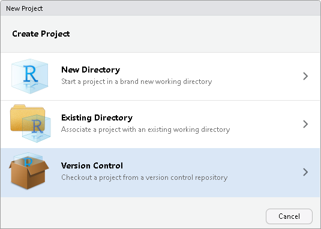

  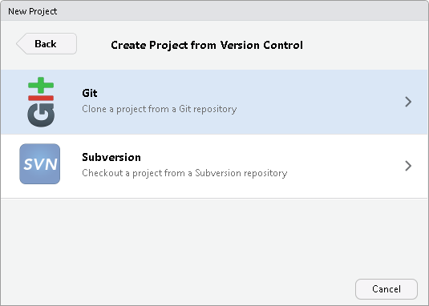
  #+END_CENTER
- Récupérer l'URL du dépôt Gitlab
  #+BEGIN_CENTER
  [[file:rstudio_images/adresse_depot.png]]
  #+END_CENTER
- Indiquez cette URL dans le champ "Repository URL" /(vous voudrez/
  /peut-être préfixer cette URL avec =xxx@= où =xxx= est votre identifiant/
  /Gitlab pour éviter d'avoir à le ressaisir ultérieurement)/.

  #+BEGIN_CENTER
  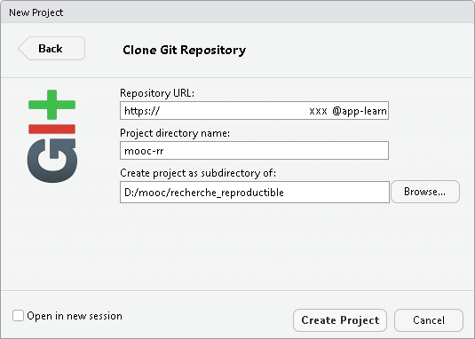
  #+END_CENTER
- Si vous êtes derrière un proxy, il faut le définir dans Git (voir le
  paragraphe "Gérer les proxy" de la page sur [[https://www.fun-mooc.fr/courses/course-v1:inria+41016+session02/jump_to_id/7508aece244548349424dfd61ee3ba85][Git et Gitlab]]).
- Git se connecte à Gitlab et récupère une copie complète du dépôt.
- RStudio redémarre dans un mode lié à Git :
  #+BEGIN_CENTER
  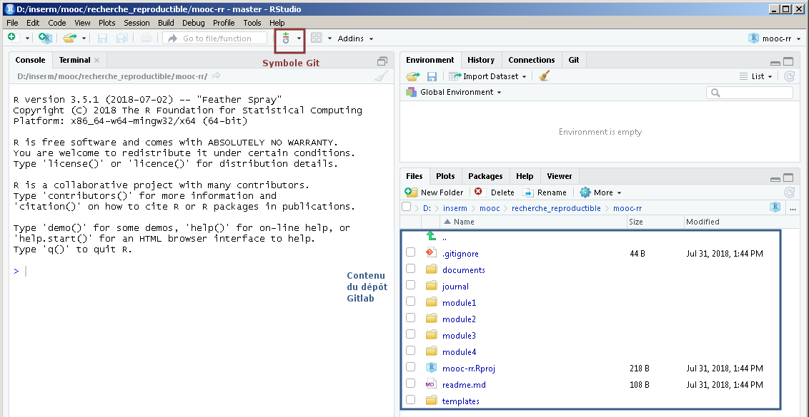
  #+END_CENTER
- Le gestionnaire de fichiers à droite vous permet de parcourir le
  dépôt sous contrôle de version.
** Modifier un fichier
- Ouvrir le fichier =Module2/exo1/toy_document.Rmd= et le modifier.
- Enregistrer.
- Aller dans le menu Git pour effectuer le commit.
  #+BEGIN_CENTER
  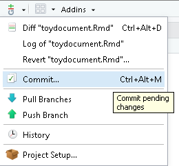

  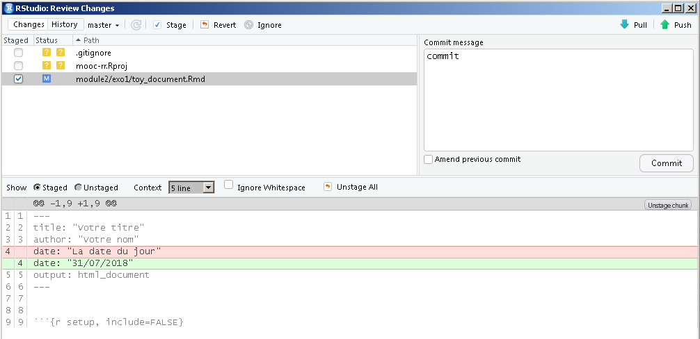
  #+END_CENTER
- Sélectionner les lignes à commiter puis cliquer sur =commit=.
  #+BEGIN_CENTER
  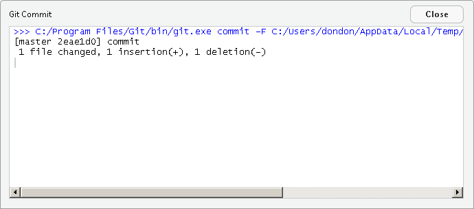
  #+END_CENTER
  Les modifications ont été commitées uniquement sur la machine. Elles
  n'ont pas été propagées sur Gitlab. 
- Cliquer sur =push= pour les propager sur Gitlab.
  #+BEGIN_CENTER
  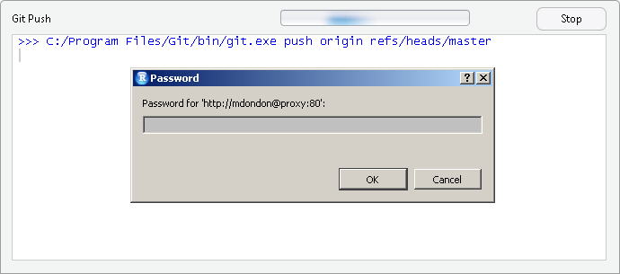

  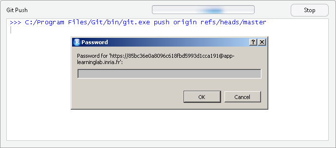

  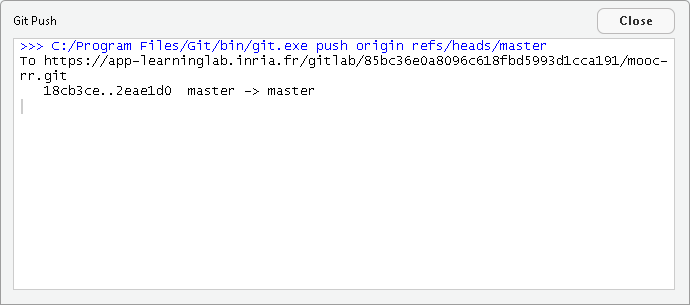
  #+END_CENTER
  N.B. : Vous ne pouvez pas propager vos modifications sur GitLab si
  des modifications ont été faites sur GitLab entre-temps. 
  #+BEGIN_CENTER
  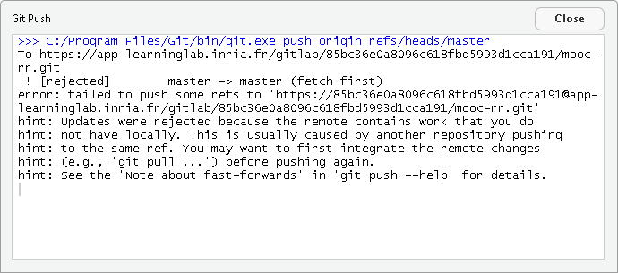
  #+END_CENTER
- Il faut d’abord récupérer ces modifications distantes sur votre
  machine locale. Pour ce faire cliquer sur =pull=. 
