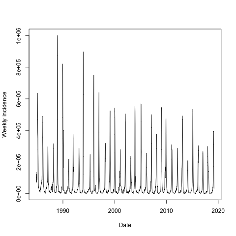
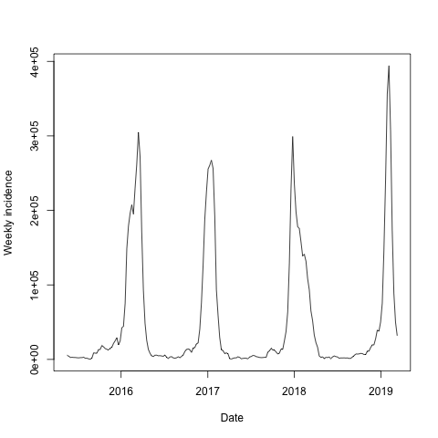
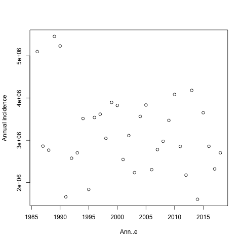
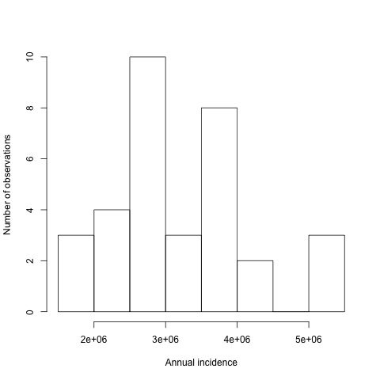

#+TITLE: Incidence du syndrôme grippal
#+LANGUAGE: fr
#+OPTIONS: *:nil num:1 toc:t

# #+HTML_HEAD: <link rel="stylesheet" title="Standard" href="http://orgmode.org/worg/style/worg.css" type="text/css" />
#+HTML_HEAD: <link rel="stylesheet" type="text/css" href="http://www.pirilampo.org/styles/readtheorg/css/htmlize.css"/>
#+HTML_HEAD: <link rel="stylesheet" type="text/css" href="http://www.pirilampo.org/styles/readtheorg/css/readtheorg.css"/>
#+HTML_HEAD: 
#+HTML_HEAD: 
#+HTML_HEAD: 
#+HTML_HEAD: 

#+PROPERTY: header-args  :session

* Préface

Pour exécuter le code de cette analyse, il faut disposer des logiciels suivants:

** Emacs 25 ou plus
Une version plus ancienne d'Emacs devrait suffire. Pour une version antérieure à 26, il faut installer une version récente (9.x) d'org-mode.
** Python 3.6 ou plus
Nous utilisons le traitement de dates en format ISO 8601, qui a été implémenté en Python seulement avec la version 3.6.

#+BEGIN_SRC python :results output :exports both
import sys
if sys.version_info.major < 3 or sys.version_info.minor < 6:
    print("Veuillez utiliser Python 3.6 (ou plus) !")
#+END_SRC

#+RESULTS:

#+BEGIN_SRC emacs-lisp :results output :exports both
(unless (featurep 'ob-python)
  (print "Veuillez activer python dans org-babel (org-babel-do-languages) !"))
#+END_SRC

#+RESULTS:

** R 3.4
Nous n'utilisons que des fonctionnalités de base du langage R, une version antérieure devrait suffire.

#+BEGIN_SRC emacs-lisp :results output :exports both
(unless (featurep 'ob-R)
  (print "Veuillez activer R dans org-babel (org-babel-do-languages) !"))
#+END_SRC

#+RESULTS:

* Préparation des données

Les données de l'incidence du syndrome grippal sont disponibles du site Web du [[http://www.sentiweb.fr/][Réseau Sentinelles]]. Nous les récupérons sous forme d'un fichier en format CSV dont chaque ligne correspond à une semaine de la période d'observation. Nous téléchargeons toujours le jeu de données complet (rien d'autre n'est proposé), qui commence en 1984 et se termine avec une semaine récente. L'URL est:
#+NAME: data-url
http://www.sentiweb.fr/datasets/incidence-PAY-3.csv

Voici l'explication des colonnes donnée sur [[https://ns.sentiweb.fr/incidence/csv-schema-v1.json][le site d'origine:]]

| Nom de colonne | Libellé de colonne                                                                                                                |
|----------------+-----------------------------------------------------------------------------------------------------------------------------------|
| ~week~       | Semaine calendaire (ISO 8601)                                                                                                     |
| ~indicator~  | Code de l'indicateur de surveillance                                                                                              |
| ~inc~        | Estimation de l'incidence de consultations en nombre de cas                                                                       |
| ~inc_low~    | Estimation de la borne inférieure de l'IC95% du nombre de cas de consultation                                                     |
| ~inc_up~     | Estimation de la borne supérieure de l'IC95% du nombre de cas de consultation                                                     |
| ~inc100~     | Estimation du taux d'incidence du nombre de cas de consultation (en cas pour 100,000 habitants)                                   |
| ~inc100_low~ | Estimation de la borne inférieure de l'IC95% du taux d'incidence du nombre de cas de consultation (en cas pour 100,000 habitants) |
| ~inc100_up~  | Estimation de la borne supérieure de l'IC95% du taux d'incidence du nombre de cas de consultation (en cas pour 100,000 habitants) |
| ~geo_insee~  | Code de la zone géographique concernée (Code INSEE) http://www.insee.fr/fr/methodes/nomenclatures/cog/                            |
| ~geo_name~   | Libellé de la zone géographique (ce libellé peut être modifié sans préavis)                                                       |

L'indication d'une semaine calendaire en format [[https://en.wikipedia.org/wiki/ISO_8601][ISO-8601]] est populaire en Europe, mais peu utilisée aux Etats-Unis. Ceci explique peut-être que peu de logiciels savent gérer ce format. Le langage Python le fait depuis la version 3.6. Nous utilisons donc ce langage pour la préparation de nos données, ce qui a l'avantage de ne nécessiter aucune bibliothèque supplémentaire. (Note: nous expliquerons dans le module 4 pourquoi il est avantageux pour la réproductibilité de se limiter à un minimum de bibliothèques.)

** Téléchargement
Après avoir téléchargé les données, nous commençons par l'extraction des données qui nous intéressent. D'abord nous découpons le contenu du fichier en lignes, dont nous jetons la première qui ne contient qu'un commentaire. Les autres lignes sont découpées en colonnes.

#+BEGIN_SRC python :results silent :var data_url=data-url :exports both
from urllib.request import urlopen

data = urlopen(data_url).read()
lines = data.decode('latin-1').strip().split('\n')
data_lines = lines[1:]
table = [line.split(',') for line in data_lines]
#+END_SRC

Regardons ce que nous avons obtenu:
#+BEGIN_SRC python :results value :exports both
table[:5]
#+END_SRC

#+RESULTS:
|   week | indicator |    inc | inc_low | inc_up | inc100 | inc100_low | inc100_up | geo_insee | geo_name |
| 201911 |         3 |  31787 |   26747 |  36827 |     48 |         40 |        56 | FR        | France   |
| 201910 |         3 |  49871 |   43378 |  56364 |     76 |         66 |        86 | FR        | France   |
| 201909 |         3 |  88354 |   79564 |  97144 |    134 |        121 |       147 | FR        | France   |
| 201908 |         3 | 172604 |  160024 | 185184 |    262 |        243 |       281 | FR        | France   |

** Recherche de données manquantes
Il y a malheureusement beaucoup de façon d'indiquer l'absence d'un point de données. Nous testons ici seulement pour la présence de champs vides. Il faudrait aussi rechercher des valeurs non-numériques dans les colonnes à priori numériques. Nous ne le faisons pas ici, mais une vérification ultérieure capterait des telles anomalies.

Nous construisons un nouveau jeu de données sans les lignes qui contiennent des champs vides. Nous affichons ces lignes pour en garder une trace.
#+BEGIN_SRC python :results output :exports both
valid_table = []
for row in table:
    missing = any([column == '' for column in row])
    if missing:
        print(row)
    else:
        valid_table.append(row)
#+END_SRC

#+RESULTS:
: ['198919', '3', '0', '', '', '0', '', '', 'FR', 'France']

** Extraction des colonnes utilisées
Il y a deux colonnes qui nous intéressent: la première (~"week"~) et la troisième (~"inc"~). Nous vérifions leurs noms dans l'en-tête, que nous effaçons par la suite. Enfin, nous créons un tableau avec les deux colonnes pour le traitement suivant.
#+BEGIN_SRC python :results silent :exports both
week = [row[0] for row in valid_table]
assert week[0] == 'week'
del week[0]
inc = [row[2] for row in valid_table]
assert inc[0] == 'inc
del inc[0]
data = list(zip(week, inc))
#+END_SRC

Regardons les premières et les dernières lignes. Nous insérons ~None~ pour indiquer à org-mode la séparation entre les trois sections du tableau: en-tête, début des données, fin des données.
#+BEGIN_SRC python :results value :exports both
[('week', 'inc'), None] + data[:5] + [None] + data[-5:]
#+END_SRC

#+RESULTS:
|   week |    inc |
|--------+--------|
| 201911 |  31787 |
| 201910 |  49871 |
| 201909 |  88354 |
| 201908 | 172604 |
| 201907 | 307338 |
|--------+--------|
| 198448 |  78620 |
| 198447 |  72029 |
| 198446 |  87330 |
| 198445 | 135223 |
| 198444 |  68422 |

** Vérification
Il est toujours prudent de vérifier si les données semblent crédibles. Nous savons que les semaines sont données par six chiffres (quatre pour l'année et deux pour la semaine), et que les incidences sont des nombres entiers positifs.
#+BEGIN_SRC python :results output :exports both
for week, inc in data:
    if len(week) != 6 or not week.isdigit():
        print("Valeur suspecte dans la colonne 'week': ", (week, inc))
    if not inc.isdigit():
        print("Valeur suspecte dans la colonne 'inc': ", (week, inc))
#+END_SRC

#+RESULTS:

Pas de problème !

** Conversions
Pour faciliter les traitements suivants, nous remplaçons les numéros de semaine ISO par les dates qui correspondent aux lundis. A cette occasion, nous trions aussi les données par la date, et nous transformons les incidences en nombres entiers.

#+BEGIN_SRC python :results silent :exports both
import datetime
converted_data = [(datetime.datetime.strptime(year_and_week + ":1" , '%G%V:%u').date(),
                  int(inc))
                  for year_and_week, inc in data]
converted_data.sort(key = lambda record: record[0])
#+END_SRC

Regardons de nouveau les premières et les dernières lignes:
#+BEGIN_SRC python :results value :exports both
str_data = [(str(date), str(inc)) for date, inc in converted_data]
[('date', 'inc'), None] + str_data[:5] + [None] + str_data[-5:]
#+END_SRC

#+RESULTS:
|       date |    inc |
|------------+--------|
| 1984-10-29 |  68422 |
| 1984-11-05 | 135223 |
| 1984-11-12 |  87330 |
| 1984-11-19 |  72029 |
| 1984-11-26 |  78620 |
|------------+--------|
| 2019-02-11 | 307338 |
| 2019-02-18 | 172604 |
| 2019-02-25 |  88354 |
| 2019-03-04 |  49871 |
| 2019-03-11 |  31787 |

** Vérification des dates
Nous faisons encore une vérification: nos dates doivent être séparées d'exactement une semaine, sauf autour du point manquant.
#+BEGIN_SRC python :results output :exports both
dates = [date for date, _ in converted_data]
for date1, date2 in zip(dates[:-1], dates[1:]):
    if date2-date1 != datetime.timedelta(weeks=1):
        print(f"Il y a {date2-date1} entre {date1} et {date2}")
#+END_SRC

#+RESULTS:
: Il y a 14 days, 0:00:00 entre 1989-05-01 et 1989-05-15

** Passage Python -> R
Nous passons au langage R pour inspecter nos données, parce que l'analyse et la préparation de graphiques sont plus concises en R, sans nécessiter aucune bibliothèque supplémentaire.

Nous utilisons le mécanisme d'échange de données proposé par org-mode, ce qui nécessite un peu de code Python pour transformer les données dans le bon format.
#+NAME: data-for-R
#+BEGIN_SRC python :results silent :exports both
[('date', 'inc'), None] + [(str(date), inc) for date, inc in converted_data]
#+END_SRC

En R, les données arrivent sous forme d'un data frame, mais il faut encore convertir les dates, qui arrivent comme chaînes de caractères.
#+BEGIN_SRC R :results output :var data=data-for-R :exports both
data$date <- as.Date(data$date)
summary(data)
#+END_SRC

#+RESULTS:
:       date                 inc         
:  Min.   :1984-10-29   Min.   :      0  
:  1st Qu.:1993-06-07   1st Qu.:   5137  
:  Median :2002-01-07   Median :  16182  
:  Mean   :2002-01-06   Mean   :  62939  
:  3rd Qu.:2010-08-09   3rd Qu.:  51746  
:  Max.   :2019-03-11   Max.   :1001824

** Inspection
Regardons enfin à quoi ressemblent nos données !
#+BEGIN_SRC R :results output graphics :file inc-plot.png :exports both
plot(data, type="l", xlab="Date", ylab="Incidence hebdomadaire")
#+END_SRC

#+RESULTS:

Un zoom sur les dernières années montre mieux la situation des pics en hiver. Le creux des incidences se trouve en été.
#+BEGIN_SRC R :results output graphics :file inc-plot-zoom.png :exports both
plot(tail(data, 200), type="l", xlab="Date", ylab="Incidence hebdomadaire")
#+END_SRC

#+RESULTS:

* Étude de l'incidence annuelle

** Calcul de l'incidence annuelle
Étant donné que le pic de l'épidémie se situe en hiver, à cheval entre deux années civiles, nous définissons la période de référence entre deux minima de l'incidence, du 1er août de l'année /N/ au 1er août de l'année /N+1/. Nous mettons l'année /N+1/ comme étiquette sur cette année décalée, car le pic de l'épidémie est toujours au début de l'année /N+1/. Comme l'incidence du syndrome grippal est très faible en été, cette modification ne risque pas de fausser nos conclusions.

Voici une fonction qui calcule l'incidence annuelle en appliquant ces conventions.
#+BEGIN_SRC R :results silent :exports both
pic_annuel = function(annee) {
      debut = paste0(annee-1,"-08-01")
      fin = paste0(annee,"-08-01")
      semaines = data$date > debut & data$date <= fin
      sum(data$inc[semaines], na.rm=TRUE)
      }
#+END_SRC

Nous devons aussi faire attention aux premières et dernières années de notre jeux de données. Les données commencent en octobre 1984, ce qui ne permet pas de quantifier complètement le pic attribué à l'année 1985. Nous le supprimons donc de notre analyse. Pour la même raison, nous arrêtons en 2018. Nous devons attendre les données pour juillet 2019 avant d'augmenter la dernière année à 2019.
#+BEGIN_SRC R :results silent :exports both
annees <- 1986:2018
#+END_SRC

#+BEGIN_SRC R :results value :exports both
inc_annuelle = data.frame(annee = annees,
                          incidence = sapply(annees, pic_annuel))
head(inc_annuelle)
#+END_SRC

#+RESULTS:
| 1986 | 5100540 |
| 1987 | 2861556 |
| 1988 | 2766142 |
| 1989 | 5460155 |
| 1990 | 5233987 |
| 1991 | 1660832 |

** Inspection
Voici les incidences annuelles en graphique.
#+BEGIN_SRC R :results output graphics :file annual-inc-plot.png :exports both
plot(inc_annuelle, type="p", xlab="Année", ylab="Incidence annuelle")
#+END_SRC

#+RESULTS:

** Identification des épidémies les plus fortes
Une liste triée par ordre décroissant d'incidence annuelle permet de plus facilement repérer les valeurs les plus élevées:
#+BEGIN_SRC R :results output :exports both
head(inc_annuelle[order(-inc_annuelle$incidence),])
#+END_SRC

#+RESULTS:
:    annee incidence
: 4   1989   5460155
: 5   1990   5233987
: 1   1986   5100540
: 28  2013   4182265
: 25  2010   4085126
: 14  1999   3897443

Enfin, un histogramme montre bien que les épidémies fortes, qui touchent environ 10% de la population française, sont assez rares: il y en eu trois au cours des 35 dernières années.
#+BEGIN_SRC R :results output graphics :file annual-inc-hist.png :exports both
hist(inc_annuelle$incidence, breaks=10, xlab="Incidence annuelle", ylab="Nb d'observations", main="")
#+END_SRC

#+RESULTS:

