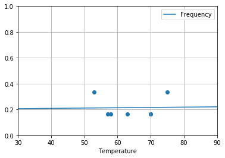
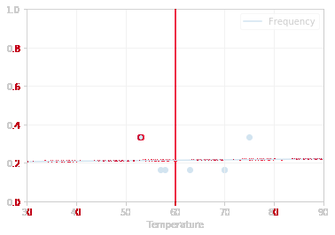
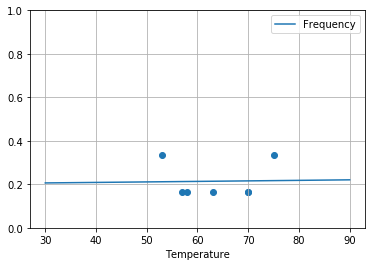

# -*- mode: org -*-
#+TITLE:     Contrôler un environnement logiciel avec docker
#+DATE: July, 2019
#+STARTUP: overview indent
#+OPTIONS: num:nil toc:t
#+PROPERTY: header-args :eval never-export

* Objectifs et Problématique
L'objectif de cette séquence est de vous familiariser avec les notions
d'*environnement logiciel*, l'importance du contrôle de cet
environnement, et de vous présenter les outils vous permettant d'y
arriver. En particulier, nous verrons comment utiliser des *conteneurs*,
comment utiliser un système de *gestions de paquets* pour construire un
environnement donné, et même l'outil d'*intégration continue* de gitlab
pour automatiser un test dans un environnement logiciel spécifique.

Notre objectif n'est pas de faire de vous des experts de chacun de ces
outils mais de vous familiariser avec chacun d'eux et que vous
compreniez leur périmètre afin que vous sachiez contrôler et
expliciter vos dépendances logicielles.

** Problématique
- Alice a son propre environnement, Bob a le sien. Le code ou le
  notebook qu'Alice exécute ne s'exécute pas sur la machine de Bob et
  réciproquement.
- Bob ne peut pas mettre à jour sa machine (pas les droits, risque
  de casser autre chose, pas le même système d'exploitation, etc.)
- Étrangement, le code d'Alice s'exécute bien chez Charles mais il ne
  donne pas le même résultat.
- Quelques mois plus tard, avant de faire les mises à jour de sa
  machine, ce code fonctionnait très bien mais maintenant il ne
  fonctionne plus.
** Objectifs
À l'issue de cette séquence, vous devriez savoir:
- Travailler dans un conteneur (*Docker*) pour isoler son travail du reste
  de sa machine
- Créer un conteneur pour figer un environnement et le partager
  (*Packaging* + *DockerFile*)
- Mettre en place un test pour s'assurer de la robustesse d'un code
  (*Continuous Integration*) en déportant son exécution dans des
  environnements controllés

Nous prendrons comme fil rouge l'exécution d'un notebook jupyter mais
nous montrerons les commandes équivalentes pour Rstudio et Org-Mode
mesure.
* Table des matières et Progression                                     :TOC:
- [[#objectifs-et-problématique][Objectifs et Problématique]]
  - [[#problématique][Problématique]]
  - [[#objectifs][Objectifs]]
- [[#séquence-1-familiarisation-avec-le-principe-de-conteneur][Séquence 1: Familiarisation avec le principe de conteneur]]
  - [[#11-premiers-pas-avec-docker][1.1 Premiers pas avec Docker]]
  - [[#12a-utiliser-docker-pour-travailler-au-jour-le-jour-jupyter][1.2(A) Utiliser docker pour travailler au jour le jour: Jupyter]]
  - [[#12b-utiliser-docker-pour-travailler-au-jour-le-jour-rstudio][1.2(B) Utiliser docker pour travailler au jour le jour: Rstudio]]
  - [[#12c-utiliser-docker-pour-travailler-au-jour-le-jour-emacs][1.2(C) Utiliser docker pour travailler au jour le jour: Emacs]]
  - [[#13-limitations][1.3 Limitations]]
- [[#séquence-2-créer-son-propre-environnement-automatiser-sa-construction-et-le-partage][Séquence 2: Créer son propre environnement, automatiser sa construction et le partage]]
  - [[#21-récupérer-une-image-de-base][2.1 Récupérer une image de base]]
  - [[#22-installer-tous-les-paquets-dont-on-a-besoin][2.2 Installer tous les paquets dont on a besoin]]
  - [[#23-gérer-ses-conteneurs-et-figer-un-environnement][2.3 Gérer ses conteneurs et figer un environnement]]
  - [[#24-automatiser-la-construction-de-son-environnement][2.4 Automatiser la construction de son environnement]]
  - [[#25-mettre-son-image-à-disposition][2.5 Mettre son image à disposition]]
  - [[#26-limitations][2.6 Limitations]]
  - [[#27-exemple-de-reconstruction-dun-vieil-environnement-optionnel][2.7 Exemple de reconstruction d'un "vieil" environnement (Optionnel)]]
  - [[#28-faire-construire-son-image-par-dockerhub-optionnel][2.8 Faire construire son image par dockerhub (Optionnel)]]
- [[#séquence-3-mettre-en-place-un-test-et-utiliser-lintégration-continue-pour-sassurer-de-la-robustesse-dun-code][Séquence 3: Mettre en place un test et utiliser l'intégration continue pour s'assurer de la robustesse d'un code]]
  - [[#30-mise-en-place][3.0 Mise en place]]
  - [[#31-exécuter-ce-notebook-dans-un-conteneur-et-mettre-en-place-un-test][3.1 Exécuter ce notebook dans un conteneur et mettre en place un test]]
  - [[#32-activer-lintégration-continue-pour-que-ce-test-soit-exécuté-à-chaque-commit-dans-le-conteneur-de-notre-choix][3.2 Activer l'intégration continue pour que ce test soit exécuté à chaque commit dans le conteneur de notre choix]]
- [[#conclusions][Conclusions]]

* TODO Séquence 1: Familiarisation avec le principe de conteneur
#+BEGIN_CENTER
*FIXME*: faire une illustration
#+END_CENTER
Docker va vous permettre d'exécuter des programmes dans ce que l'on
appelle des conteneurs. Un /conteneur/ est une sorte de mini-machine
virtuelle dont le système de fichier est appelé /image/ et qui va
exécuter un /programme/. Je pourrai avoir à un instant donné plusieurs
conteneurs exécutant des programmes différents issus d'images
différentes ou identiques.
- Le premier avantage de cette approche est que votre programme sera
  isolé du reste de votre machine et, quoi que vous fassiez dans ce
  conteneur, vous n'abimerez pas votre propre machine en installant
  des bibliothèques plus anciennes ou plus modernes qui seraient
  incompatibles.
- Le second avantage est que vous pourrez préparer plusieurs
  conteneurs différents pour vérifier si votre programme fonctionne
  toujours bien.
- Enfin, vous pourrez partager ce conteneur avec d'autres de façons à
  ce qu'ils puissent exécuter un programme dans les mêmes conditions
  que celles que vous aviez prévues.

Si ça vous parait abstrait, le plus simple est de vous montrer comment
ça fonctionne et que vous reveniez sur cette description un peu plus
tard si besoin.
** 1.1 Premiers pas avec Docker
*** TODO S'assurer que docker est bien installé

#+BEGIN_CENTER
*FIXME*: Faire une partie [[https://docs.docker.com/docker-for-windows/][Docker pour Windows]]  et [[https://docs.docker.com/docker-for-mac/install/][Docker pour MacOSX]].

J'ai essayé MacOSX sur la machine de jean-Marc. Mis à part le fait
qu'il faut s'inscrire sur docker.com pour installer (ridicule!), la
manip marche très bien. Il faut regarder si le partage d'applications
X marche bien mais pour ça, voir
https://github.com/JAremko/docker-emacs (nickel sous linux).
#+END_CENTER

Je suis sur une machine linux (une debian) et j'ai donc installé
docker via le paquet =docker.io=. J'ai aussi pris soin de me mettre dans
le groupe docker pour ne pas avoir à passer root à chaque fois. Voici
comment j'ai fait.
#+begin_src shell :results output :exports both :eval never
sudo apt-get install docker.io
sudo adduser alegrand docker
#+end_src

Je peux alors lancer la commande docker et lui demander de quelle
version il s'agit.
#+begin_src shell :session *shell* :results output :exports both 
docker version
#+end_src

#+RESULTS:
#+begin_example
Client:
 Version:      1.13.1
 API version:  1.26
 Go version:   go1.9.3
 Git commit:   092cba3
 Built:        Thu Feb  1 09:36:44 2018
 OS/Arch:      linux/amd64

Server:
 Version:      1.13.1
 API version:  1.26 (minimum version 1.12)
 Go version:   go1.9.3
 Git commit:   092cba3
 Built:        Thu Feb  1 09:36:44 2018
 OS/Arch:      linux/amd64
 Experimental: false
#+end_example

*** Récupérer une image de base
Nous pouvons commencer. Je partirai d'une image Linux debian stable
que je vais récupérer à l'aide de la commande =docker pull=.

#+begin_src shell :session *shell* :results output :exports both 
docker pull debian:stable
#+end_src

#+RESULTS:
: stable: Pulling from library/debian
: 
: 5893bf6f34bb: Pulling fs layer 
: 5893bf6f34bb: Downloading    507kB/50.38MB
: 5893bf6f34bb: Verifying Checksum 
: 5893bf6f34bb: Download complete 
: 5893bf6f34bb: Extracting  524.3kB/50.38MB
: 5893bf6f34bb: Pull complete 
: Digest: sha256:4d28f191a4c9dec569867dd9af1e388c995146057a36d5b3086e599af7c2379b
: Status: Downloaded newer image for debian:stable

La commande précédente s'est connectée sur le site [[https://hub.docker.com/][DockerHub]] pour y
télécharger une image officielle debian stable. Je peux la trouver
listée ici: https://hub.docker.com/_/debian. Que puis-je savoir sur
cette image ?

#+begin_src shell :session *shell* :results output :exports both 
docker images
#+end_src

#+RESULTS:
#+begin_example
REPOSITORY                   TAG                      IMAGE ID            CREATED             SIZE
debian                       stable                   40e13c3c9aab        12 days ago         114MB
#+end_example

Mon image apparaît. Elle fait 114MB et a été construite il y a 12
jours.
*** Exécuter une commande dans un conteneur
Grâce à la commande =docker run=, je vais pouvoir exécuter des commandes
dans le conteneur que je viens de télécharger. Par exemple, comme
ceci:
#+begin_src shell :session *shell* :results output :exports both 
docker run debian:stable ls
#+end_src

#+RESULTS:
#+begin_example
bin
boot
dev
etc
home
lib
lib64
media
mnt
opt
proc
root
run
sbin
srv
sys
tmp
usr
var
#+end_example

Bon, ok, ce n'est pas très impressionnant mais croyez moi, le =ls= a
listé ce qu'il y avait dans le conteneur, pas ce qu'il y avait sur mon
propre système de fichier. Pour preuve, quand je lance cette commande
sans docker, je trouve les fichiers =initrd.img=, =exports=, et =nix= en plus:
#+begin_src shell :results output :exports both
ls /
#+end_src

#+RESULTS:
#+begin_example
bin
boot
dev
etc
exports
home
initrd.img
initrd.img.old
lib
lib32
lib64
lost+found
media
mnt
nix
opt
proc
root
run
sbin
srv
sys
tmp
usr
var
vmlinuz
vmlinuz.old
#+end_example

Essayons avec la commande =hostname= qui me renverra comment s'appelle
la machine.
#+begin_src shell :session *shell* :results output :exports both 
docker run debian:stable hostname
#+end_src

#+RESULTS:
: 07193bfee89f

Ah, oui, c'est assez différent de ce que j'obtiens quand je lance
cette commande directement sur ma machine:
#+begin_src shell :session *shell* :results output :exports both 
hostname
#+end_src

#+RESULTS:
: icarus

Continuons de comparer. Est-ce que l'on trouve python, python3 ou perl
dans cet environnement ?
#+begin_src shell :session *shell* :results output :exports both 
echo "=== On my machine ==="
which -a python3 python perl                 # chez moi oui
echo "=== On debian:stable ==="
docker run debian:stable which -a python3 python perl # mais pas dans cet environnement
echo "===================="
#+end_src

#+RESULTS:
#+begin_example
=== On my machine ===
/usr/bin/X11//python3
/usr/bin/X11//python3
/usr/bin/python3
/usr/bin/X11//python
/usr/bin/X11//python
/usr/bin/python
/usr/bin/X11//perl
/usr/bin/X11//perl
/usr/bin/perl
=== On debian:stable ===
/usr/bin/perl
====================
#+end_example

Non, pas de python dans cette image debian minimaliste, seulement
perl.  En fait, à chaque fois que je lance une commande avec =docker
run=, c'est un peu comme si un mini-système d'exploitation démarrait,
exécutait cette commande et s'éteignait... C'est donc un peu coûteux
et pénible d'avoir à toujours préfixer par =docker run=, donc une
solution simple consiste à lancer docker en mode interactif.
*** Utiliser docker en interactif
À partir de maintenant, il vous faudra bien faire attention à
distinguer les commandes qui sont lancées sur mon système de base de
celles qui sont lancées dans notre conteneur docker. Rentrons dans
notre conteneur en interactif
#+begin_src shell :session *docker* :results output :exports both 
docker run -t -i debian:stable
#+end_src

#+RESULTS:

Je peux alors exécuter plusieurs séries de commandes facilement dans
mon environnement:
#+begin_src shell :session *docker* :results output :exports both 
hostname; whoami ; python ; 
ls -la ~/
#+end_src

#+RESULTS:
#+begin_example
aa68f9214de3
root
bash: python: command not found
total 16
drwx------ 2 root root 4096 Jul  8 03:30 .
drwxr-xr-x 1 root root 4096 Aug 15 09:36 ..
-rw-r--r-- 1 root root  570 Jan 31  2010 .bashrc
-rw-r--r-- 1 root root  148 Aug 17  2015 .profile
#+end_example

Je suis =root= dans cet environnement, ce qui me permettra d'y installer
tous les logiciels que je souhaite. Mais nous verrons ça plus tard,
je vais d'abord illustrer un point lié aux effets de bords. Je vais
créer un fichier 
#+begin_src shell :session *docker* :results output :exports both 
echo "Hello world!" > ~/myfile.txt
ls -la ~/
#+end_src

#+RESULTS:
: total 20
: drwx------ 1 root root 4096 Aug 15 09:41 .
: drwxr-xr-x 1 root root 4096 Aug 15 09:36 ..
: -rw-r--r-- 1 root root  570 Jan 31  2010 .bashrc
: -rw-r--r-- 1 root root  148 Aug 17  2015 .profile
: -rw-r--r-- 1 root root   13 Aug 15 09:41 myfile.txt

J'ai bien créé un fichier dans le répertoire personnel de
l'utilisateur =root= de cet environnement. Je vais maintenant quitter
cet environnement, le redémarrer et y relancer les commandes
précédentes:
#+begin_src shell :session *docker* :results output :exports both 
exit
#+end_src

#+RESULTS:
: exit

#+begin_src shell :session *docker* :results output :exports both 
docker run -t -i debian:stable
#+end_src

#+RESULTS:

#+begin_src shell :session *docker* :results output :exports both 
hostname; whoami ; python ; 
ls -la ~/
exit
#+end_src

#+RESULTS:
#+begin_example
f8705ae9aeff
root
bash: python: command not found
total 16
drwx------ 2 root root 4096 Jul  8 03:30 .
drwxr-xr-x 1 root root 4096 Aug 15 09:44 ..
-rw-r--r-- 1 root root  570 Jan 31  2010 .bashrc
-rw-r--r-- 1 root root  148 Aug 17  2015 .profile
exit
exit
#+end_example

Je suis toujours l'utilisateur =root= mais vous remarquerez que le nom
de la machine a changé (=f8705ae9aeff= au lieu de =aa68f9214de3=) et que
le fichier =myfile.txt= a disparu. 

En fait lorsque je ferme un conteneur, toutes les modifications que
j'aurais pu y apporter sont perdues ou plutôt dès que je lance un
conteneur, il s'agit d'un conteneur vierge des modifications que
j'aurais pu faire auparavant. Mon conteneur est donc isolé du reste de
la machine et est "sans mémoire". Même si je fais une erreur et que
j'efface tout le contenu de mon conteneur, je peux toujours
recommencer du début et récupérer un environnement tout neuf. C'est
cette propriété d'immutabilité qui va nous permettre de nous assurer
que le code que j'exécuterai dans 3 mois s'exécutera dans les mêmes
conditions logicielles que le code que j'exécute aujourd'hui.

Mais alors comment faire pour récupérer les fichiers et les résultats
d'un calcul exécuté dans un conteneur ?

*** TODO Partager un répertoire avec un conteneur
#+BEGIN_CENTER
*FIXME*: Évoquer le problème des uid à la fin ?
#+END_CENTER

Le conteneur étant isolé de l'extérieur (sauf via le réseau) et ayant
son propre système de fichier, le plus simple pour échanger des
données avec l'extérieur consiste à partager un répertoire entre le
conteneur et la machine hôte. 

Je peux par exemple partager le répertoire courant dans le répertoire
=/tmp= du conteneur.

#+begin_src shell :session *shell* :results output :exports both 
echo "-- Sans partage"
docker run debian:stable ls /tmp
#+end_src

#+RESULTS:
: -- Sans partage

#+begin_src shell :session *shell* :results output :exports both 
echo "-- Avec partage de" `pwd`
docker run --volume=`pwd`:/tmp debian:stable ls /tmp
#+end_src

#+RESULTS:
#+begin_example
-- Avec partage de /home/alegrand/Work/Documents/Enseignements/RR_MOOC/gitlab-inria/mooc-rr-ressources/module4/ressources
Makefile
docker_tutorial_fr.html
docker_tutorial_fr.html~
docker_tutorial_fr.org
docker_tutorial_fr.org~
exo1.org
exo2.org
exo3.org
mooc_docker
mooc_docker_image
mooc_docker_image_oldoldstable
resources_environment.org
resources_environment_fr.org
resources_refs.org
resources_refs_fr.org
test_jupyter
#+end_example

Ainsi, plutôt que d'aller dans le répertoire =my_work/= pour y
travailler directement sans bien contrôler dans quel environnement je
travaille, je vais lancer un conteneur à l'environnement logiciel
contrôlé et à qui j'aurai donné accès au répertoire =my_work/=. Je
travaillerai alors normalement à ceci près que je lancerai toutes mes
commandes dans mon conteneur docker. Le résultat de mes commandes sera
disponible comme d'habitude dans le répertoire =my_work/=.

Mettons cela en pratique avec un environnement un peu plus fourni
qu'une debian minimaliste.
** 1.2(A) Utiliser docker pour travailler au jour le jour: Jupyter
Tout un tas d'organisation mettent donc à disposition des images
docker à jour permettant de travailler au mieux. C'est le cas de
jupyter qui fourni plusieurs images. Voyons ce qui est à notre disposition:

#+begin_src shell :results output :exports both
docker search jupyter
#+end_src

#+RESULTS:
#+begin_example
NAME                                    DESCRIPTION                                     STARS     OFFICIAL   AUTOMATED
jupyter/datascience-notebook            Jupyter Notebook Data Science Stack from h...   525                  
jupyter/all-spark-notebook              Jupyter Notebook Python, Scala, R, Spark, ...   243                  
jupyterhub/jupyterhub                   JupyterHub: multi-user Jupyter notebook se...   216                  [OK]
jupyter/scipy-notebook                  Jupyter Notebook Scientific Python Stack f...   180                  
jupyter/tensorflow-notebook             Jupyter Notebook Scientific Python Stack w...   160                  
jupyter/pyspark-notebook                Jupyter Notebook Python, Spark, Mesos Stac...   110                  
jupyter/minimal-notebook                Minimal Jupyter Notebook Stack from https:...   79                   
jupyter/base-notebook                   Small base image for Jupyter Notebook stac...   72                   
jupyter/r-notebook                      Jupyter Notebook R Stack from https://gith...   24                   
jupyterhub/singleuser                   single-user docker images for use with Jup...   23                   [OK]
jupyter/nbviewer                        Jupyter Notebook Viewer                         17                   [OK]
mikebirdgeneau/jupyterlab               Jupyterlab based on python / alpine linux ...   16                   [OK]
jupyter/demo                            (DEPRECATED) Demo of the IPython/Jupyter N...   14                   
eboraas/jupyter                         Jupyter Notebook (aka IPython Notebook) wi...   12                   [OK]
jupyterhub/k8s-hub                                                                      9                    
jupyterhub/configurable-http-proxy      node-http-proxy + REST API                      5                    [OK]
jupyterhub/jupyterhub-onbuild           onbuild version of JupyterHub images            2                    
takaomag/jupyter.notebook               docker image of archlinux (jupyter.noteboo...   2                    [OK]
jupyter/repo2docker                     Turn git repositories into Jupyter enabled...   2                    
minrk/jupyterhub-onbuild                onbuild jupyterhub images                       1                    [OK]
maxmtmn/jupyter-notebook-custom         example how to build jupyter notebook with...   1                    [OK]
jupyterhub/k8s-network-tools                                                            1                    
stanfordlegion/jupyter-regent           Regent kernel for Jupyter                       1                    [OK]
guangie88/jupyter-pyspark-toree-addon   Python dependencies to install over jupyte...   0                    
idahlke/jupyter                         Ian's flavor of jupyter                         0                    
#+end_example

Les premières =jupyter/*= sont des images "officielles" de l'équipe de
développement de Jupyter. Vous trouvez également tout un tas d'images
faites par des gens comme vous et moi. Vous trouverez un peu plus de
détail sur les images officielles jupyter dans la [[https://jupyter-docker-stacks.readthedocs.io/en/latest/using/selecting.html][documentation
correspondante]]. La plus petite image disponible permettant d'exécuter
un notebook s'appelle [[https://hub.docker.com/r/jupyter/base-notebook/][base-notebook]]. Elle pèse environ 200M mais elle
ne dispose pas de bibliothèques de calcul scientifique comme =pandas=,
=numpy=, =matplotlib= ou =statsmodels=. Pour ça, il faudra utiliser l'image
[[https://hub.docker.com/r/jupyter/scipy-notebook/][scipy-notebook]] qui vient avec tout le nécessaire et même pas mal de
superflu (elle pèse 1G...). S'il vous en faut plus, n'hésitez pas à
parcourir https://hub.docker.com/jupyter et la [[https://jupyter-docker-stacks.readthedocs.io/][documentation de ces
image]].

Préparez-vous à ce que l'exécution de la commande qui suit prenne donc
un peu de temps puisqu'elle commencera par rapatrier la dernière image
de =jupyter/scipy-notebook= (3.47GB!) avant de l'exécuter.
#+begin_src shell :results output :exports both
docker run -p 8888:8888 jupyter/scipy-notebook
#+end_src

#+RESULTS:
#+begin_example
Executing the command: jupyter notebook
[I 10:13:54.544 NotebookApp] Writing notebook server cookie secret to /home/jovyan/.local/share/jupyter/runtime/notebook_cookie_secret
[I 10:13:54.746 NotebookApp] JupyterLab extension loaded from /opt/conda/lib/python3.7/site-packages/jupyterlab
[I 10:13:54.746 NotebookApp] JupyterLab application directory is /opt/conda/share/jupyter/lab
[I 10:13:54.748 NotebookApp] Serving notebooks from local directory: /home/jovyan
[I 10:13:54.748 NotebookApp] The Jupyter Notebook is running at:
[I 10:13:54.748 NotebookApp] http://b81d06d52acd:8888/?token=cd646696a5adde86ca4cc74b18642010e315e3500c8cc63f
[I 10:13:54.748 NotebookApp]  or http://127.0.0.1:8888/?token=cd646696a5adde86ca4cc74b18642010e315e3500c8cc63f
[I 10:13:54.748 NotebookApp] Use Control-C to stop this server and shut down all kernels (twice to skip confirmation).
[C 10:13:54.751 NotebookApp] 
    
    To access the notebook, open this file in a browser:
        file:///home/jovyan/.local/share/jupyter/runtime/nbserver-8-open.html
    Or copy and paste one of these URLs:
        http://b81d06d52acd:8888/?token=cd646696a5adde86ca4cc74b18642010e315e3500c8cc63f
     or http://127.0.0.1:8888/?token=cd646696a5adde86ca4cc74b18642010e315e3500c8cc63f
#+end_example

Si vous prenez votre navigateur et que vous ouvrez la _dernière_ URL
indiquée
(=http://127.0.0.1:8888/?token=cd646696a5adde86ca4cc74b18642010e315e3500c8cc63f=
dans le cas présent) vous verrez que vous avez alors accès à un
notebook jupyter tout beau tout neuf sans rien avoir eu à installer
qui puisse perturber votre machine.

Comment ça marche ? Par défaut, le serveur jupyter s'ouvre sur le port
8888 et il vous indique donc que si vous vous connectez à l'adresse
=http://127.0.0.1:8888=, vous y trouverez le serveur jupyter que vous
venez de lancer. Mais ce serveur et ce port sont dans votre docker et
vous n'y avez pas accès... Le =-p 8888:8888= permet de lier le port 8888
de votre propre machine au port 8888 du conteneur et ainsi de vous
donner accès au serveur jupyter.

Fermons le et relançons le en activant la nouvelle interface de
jupyter: JupyterLab!
#+begin_src shell :results output :exports both
docker run -p 8888:8888 -e JUPYTER_ENABLE_LAB=yes jupyter/scipy-notebook # from the doc
#+end_src

Dans cette interface, vous avez accès d'un seul coup d'oeil au
navigateur de fichiers, au notebooks, au terminaux, etc... C'est plus
moderne.

Vous pouvez bien sûr y importer les fichiers et les données dont vous
auriez besoin mais le plus simple pour travailler confortablement est
de partager un répertoire. Comme vous avez pu le remarquer, dans cette
image docker, c'est un utilisateur =jovyan= qui est créé et il dispose
d'un répertoire =work/= vide dans son répertoire personnel. 

C'est ce répertoire =/home/jovyan/work/= que nous allons utiliser mais
cette fois-ci attention aux effets de bords, vos modifications seront
faites directement dans votre répertoire. Mais s'il est sous git
(attention à éviter de ne partager qu'un sous-répertoire d'un git),
vous ne risquez rien...  Bref, la commande magique à utiliser au
quotidien devrait être quelque chose du genre:

#+begin_src shell :session *shell* :results output :exports both 
# First cd into your working directory, then
docker run --volume=`pwd`:/home/jovyan/work/ -p 8888:8888 -e JUPYTER_ENABLE_LAB=yes jupyter/scipy-notebook
#+end_src

#+RESULTS:
#+begin_example
Executing the command: jupyter lab
[I 10:37:40.275 LabApp] Writing notebook server cookie secret to /home/jovyan/.local/share/jupyter/runtime/notebook_cookie_secret
[I 10:37:40.484 LabApp] JupyterLab extension loaded from /opt/conda/lib/python3.7/site-packages/jupyterlab
[I 10:37:40.485 LabApp] JupyterLab application directory is /opt/conda/share/jupyter/lab
[I 10:37:40.486 LabApp] Serving notebooks from local directory: /home/jovyan
[I 10:37:40.486 LabApp] The Jupyter Notebook is running at:
[I 10:37:40.486 LabApp] http://077a9a5c655f:8888/?token=1c08b68de88811250287057429a429885aa5853ff2cf6c44
[I 10:37:40.487 LabApp]  or http://127.0.0.1:8888/?token=1c08b68de88811250287057429a429885aa5853ff2cf6c44
[I 10:37:40.487 LabApp] Use Control-C to stop this server and shut down all kernels (twice to skip confirmation).
[C 10:37:40.490 LabApp] 
    
    To access the notebook, open this file in a browser:
        file:///home/jovyan/.local/share/jupyter/runtime/nbserver-8-open.html
    Or copy and paste one of these URLs:
        http://077a9a5c655f:8888/?token=1c08b68de88811250287057429a429885aa5853ff2cf6c44
     or http://127.0.0.1:8888/?token=1c08b68de88811250287057429a429885aa5853ff2cf6c44
#+end_example

J'attire votre attention sur un dernier point. J'ai préparé ce
tutoriel, dans le courant de l'été 2019. J'ai récupéré la dernière
image de =jupyter/scipy-notebook= et il est donc probable que quand vous
exécuterez ces commandes vous même, vous récupériez une image
différente... Et oui, si vous ne précisez rien du tout, vous récupérez
par défaut la dernière image disponible. Celle que j'ai récupérée est
la =844815ed865e= (cet identifiant est le début d'une clé
cryptographique identifiant tout le contenu de cette image).

#+begin_src shell :results output :exports both
docker images | grep scipy
#+end_src

#+RESULTS:
: jupyter/scipy-notebook                        latest                   844815ed865e        4 days ago          3.47GB

Il possible d'accéder à d'anciennes versions en regardant par exemple
ici: https://hub.docker.com/r/jupyter/scipy-notebook/tags/?page=10. Je
peux ainsi lancer cette image telle qu'elle a été construite il y a 3 ans:

#+begin_src shell :results output :exports both
docker run -p 8888:8888 jupyter/scipy-notebook:dc6ae8bd8209 # a 3 years old image
#+end_src

On y trouve d'anciennes versions de =pandas=, =numpy=, =matplotlib= ou
=statsmodels= mais ce n'est pas décrit. Vous pouvez accéder à la recette
de construction, mais vous verrez que plusieurs technologies de
gestion de paquets ont été utilisées (ubuntu et conda), ce qui ne
simplifie pas l'identification exacte des versions de chacun des
paquets utilisés. Si je peux facilement accéder à d'anciennes images,
il va souvent être difficile de savoir ce qu'elles contiennent
exactement, comment elles ont été construites et comment en faire une
variation.
** TODO 1.2(B) Utiliser docker pour travailler au jour le jour: Rstudio
https://hub.docker.com/r/rocker/rstudio/

** TODO 1.2(C) Utiliser docker pour travailler au jour le jour: Emacs
https://github.com/JAremko/docker-emacs
https://hub.docker.com/r/jare/emacs

#+begin_src shell :results output :exports both
docker run -ti -v /tmp/.X11-unix:/tmp/.X11-unix:ro -e DISPLAY="unix$DISPLAY" -e UNAME="alegrand" -e GNAME="alegrand" -e UID="1000" -e GID="1000" -v ~/Work/Documents/Enseignements/RR_MOOC/gitlab-inria/mooc-rr-ressources/module2/ressources/rr_org:/home/emacs/.emacs.d -v /tmp/:/mnt/workspace jare/emacs emacs
#+end_src

#+RESULTS:

** 1.3 Limitations
Utiliser un conteneur est donc assez facile et très pratique car cela
vous permet de travailler en isolation de votre machine et d'utiliser
à peu près n'importe quel logiciel et ce quel que soit votre système
d'exploitation. Il est aussi très facile de partager ces
environnements avec d'autres via le DockerHub. Néanmoins cette
facilité vient avec quelques contreparties en terme de transparence
et de reproductibilité par un tiers:

- L'environnement que vous récupérez est en général le plus récent et
  donc, à moins que vous ne précisiez exactement via son ID quel
  environnement vous utilisez, des collègues qui referaient la même
  manipulation que vous quelques jours plus tard risquent de récupérer
  un environnement différent du votre.
- Vous récupérez un environnement sans savoir vraiment ce qu'il
  contient en terme de logiciels. Quelles versions ? Comment ces
  logiciels ont-ils été installés ? Y a-t-il vraiment tout ce dont
  vous avez besoin ? N'y a-t-il pas trop de choses par rapport à vos
  besoins ?
- Alors bien sûr, puisque votre environnement a accès à Internet, rien
  de vous empêche d'y installer ce qui vous manquerait mais dans ce
  cas, d'un jour sur l'autre, vous prenez le risque de réinstaller des
  choses différentes et, même si vos collègues sont partis de la même
  image, ils ne sauront pas où vous en êtes en terme de mises à jour.

Dans la deuxième séquence, nous verrons donc comment créer votre
propre environnement et le partager avec d'autres. Mais dans tous les
cas, une bonne pratique consiste à bien repérer l'identifiant de vos
images et à les spécifier.
* Séquence 2: Créer son propre environnement, automatiser sa construction et le partage
** 2.1 Récupérer une image de base
Nous allons créer un environnement "minimal" en terme de dépendances
et permettant d'exécuter le [[https://gitlab.inria.fr/learninglab/mooc-rr/mooc-rr-modele/blob/master/module2/exo5/exo5_fr.ipynb][notebook Jupyter de Challenger]]. 

L'idée pour bien contrôler son environnement va être de partir d'un
environnement minimaliste, dans lequel notre notebook aura d'ailleurs
peu de chances de s'exécuter, et d'y installer juste les logiciels
dont nous aurons besoin. Je partirai d'une image debian stable.
#+begin_src shell :session *shell* :results output :exports both 
docker pull debian:stable
#+end_src

#+RESULTS:
: stable: Pulling from library/debian
: 
: 5893bf6f34bb: Pulling fs layer 
: 5893bf6f34bb: Downloading    507kB/50.38MB
: 5893bf6f34bb: Verifying Checksum 
: 5893bf6f34bb: Download complete 
: 5893bf6f34bb: Extracting  524.3kB/50.38MB
: 5893bf6f34bb: Pull complete 
: Digest: sha256:4d28f191a4c9dec569867dd9af1e388c995146057a36d5b3086e599af7c2379b
: Status: Downloaded newer image for debian:stable

** 2.2 Installer tous les paquets dont on a besoin
Bien, comme nous l'avons vu, cette image ne contient même pas python,
il va donc falloir l'installer ainsi que =jupyter= et différents paquets
comme =matplotlib=, =pandas=, =numpy=, =statsmodels=... C'est une image debian
donc l'installation de paquets se fait à l'aide de la commande =apt-get
install <nom_du_paquet>=. Comment faire pour trouver le nom du paquet
debian qui contient ce qui vous intéresse ? Avec la commande =apt-cache
search "<un truc lié au nom de ce que vous cherchez>"=. Mais comme nous
partons d'une image minimaliste, il faudra d'abord mettre à jour la
liste des paquets à l'aide de la commande =apt-get
update=. Démonstration!

Je rentre dans mon environnement:
#+begin_src shell :session *docker* :results output :exports both 
docker run -t -i debian:stable
#+end_src

#+RESULTS:

Je met à jour la liste des paquets que l'on peut installer:
#+begin_src shell :session *docker* :results output :exports both 
apt-get update
#+end_src

#+RESULTS:
#+begin_example
Get:1 http://security-cdn.debian.org/debian-security stable/updates InRelease [39.1 kB]
Get:2 http://cdn-fastly.deb.debian.org/debian stable InRelease [118 kB]
Get:4 http://security-cdn.debian.org/debian-security stable/updates/main amd64 Packages [59.8 kB]
Get:3 http://cdn-fastly.deb.debian.org/debian stable-updates InRelease [49.3 kB]
Get:5 http://cdn-fastly.deb.debian.org/debian stable/main amd64 Packages [7897 kB]
Get:6 http://cdn-fastly.deb.debian.org/debian stable-updates/main amd64 Packages [884 B]
Fetched 8164 kB in 2min 23s (57.1 kB/s)
Reading package lists... Done
root@dc33846479d8:/# echo 'org_babel_sh_eoe'
#+end_example

Et maintenant, je peux chercher tout ce qui a trait à jupyter
#+begin_src shell :session *docker* :results output :exports both 
apt-cache search jupyter
#+end_src

#+RESULTS:
#+begin_example
python-ipykernel - IPython kernel for Jupyter (Python 2)
python3-ipykernel - IPython kernel for Jupyter (Python 3)
jupyter-nbextension-jupyter-js-widgets - Interactive widgets - Jupyter notebook extension
python-ipywidgets - Interactive widgets for the Jupyter notebook (Python 2)
python-ipywidgets-doc - Interactive widgets for the Jupyter notebook (documentation)
python-widgetsnbextension - Interactive widgets - Jupyter notebook extension (Python 2)
python3-ipywidgets - Interactive widgets for the Jupyter notebook (Python 3)
python3-widgetsnbextension - Interactive widgets - Jupyter notebook extension (Python 3)
jupyter-client - Jupyter protocol client APIs (tools)
python-jupyter-client - Jupyter protocol client APIs (Python 2)
python-jupyter-client-doc - Jupyter protocol client APIs (documentation)
python3-jupyter-client - Jupyter protocol client APIs (Python 3)
jupyter-console - Jupyter terminal client (script)
python-jupyter-console - Jupyter terminal client (Python 2)
python-jupyter-console-doc - Jupyter terminal client (documentation)
python3-jupyter-console - Jupyter terminal client (Python 3)
jupyter - Interactive computing environment (metapackage)
jupyter-core - Core common functionality of Jupyter projects (tools)
python-jupyter-core - Core common functionality of Jupyter projects for Python 2
python-jupyter-core-doc - Core common functionality of Jupyter projects (documentation)
python3-jupyter-core - Core common functionality of Jupyter projects for Python 3
jupyter-notebook - Jupyter interactive notebook
python-notebook - Jupyter interactive notebook (Python 2)
python-notebook-doc - Jupyter interactive notebook (documentation)
python3-notebook - Jupyter interactive notebook (Python 3)
jupyter-sphinx-theme-common - Jupyter Sphinx Theme -- common files
jupyter-sphinx-theme-doc - Jupyter Sphinx Theme -- documentation
python-jupyter-sphinx-theme - Jupyter Sphinx Theme -- Python
python3-jupyter-sphinx-theme - Jupyter Sphinx Theme -- Python 3
jupyter-nbconvert - Jupyter notebook conversion (scripts)
python-nbconvert - Jupyter notebook conversion (Python 2)
python-nbconvert-doc - Jupyter notebook conversion (documentation)
python3-nbconvert - Jupyter notebook conversion (Python 3)
jupyter-nbformat - Jupyter notebook format (tools)
python-nbformat - Jupyter notebook format (Python 2)
python-nbformat-doc - Jupyter notebook format (documentation)
python3-nbformat - Jupyter notebook format (Python 3)
python-nbsphinx - Jupyter Notebook Tools for Sphinx -- Python
python-nbsphinx-doc - Jupyter Notebook Tools for Sphinx -- doc
python3-nbsphinx - Jupyter Notebook Tools for Sphinx -- Python 3
jupyter-qtconsole - Jupyter - Qt console (binaries)
python-qtconsole - Jupyter - Qt console (Python 2)
python-qtconsole-doc - Jupyter - Qt console (documentation)
python3-qtconsole - Jupyter - Qt console (Python 3)
sagemath-jupyter - Open Source Mathematical Software - Jupyter kernel
python-spyder-kernels - Jupyter kernels for the Spyder console - Python 2
python3-spyder-kernels - Jupyter kernels for the Spyder console - Python 3
#+end_example

Aouch! Ça fait beaucoup. Dans le tas, il y a un paquet qui s'appelle
=jupyter-notebook=. C'est sûrement lui. Vérifions avec la commande
=apt-cache show=:

#+begin_src shell :session *docker* :results output :exports both 
apt-cache show jupyter-notebook
#+end_src

#+RESULTS:
#+begin_example
Package: jupyter-notebook
Version: 5.7.8-1
Installed-Size: 45
Architecture: all
Depends: python3:any, python3-notebook (= 5.7.8-1), jupyter-core
Description: Jupyter interactive notebook
Description-md5: a1f300590a1412cd831ab1ad0a2faf40
Homepage: https://github.com/jupyter/notebook
Tag: implemented-in::python, interface::web, role::program,
 science::calculation, science::modelling, science::plotting,
 science::visualisation, use::analysing, use::calculating, use::editing,
 use::viewing, works-with::software:source
Section: science
Priority: optional
Filename: pool/main/j/jupyter-notebook/jupyter-notebook_5.7.8-1_all.deb
Size: 21884
MD5sum: 16422647575731006fd5dd7d04e92b37
SHA256: 84792a652e46d8c9236c571eefbcfa9fd4b175a194ebfe7b5eef6dde4c5fa4b0

echo 'org_babel_sh_eoe'
#+end_example

A priori, en installant ce paquet, j'aurai tout python3, les notebook
python3. Ça a l'air bon. En faisant la même chose avec =matplotlib=,
=pandas=, =numpy= et =statsmodels=, je trouverai le nom des paquets dont
j'ai besoin. Je rajoute le paquet =jupyter-nbconvert= qui permet de
convertir les notebooks en ligne de commande sans passer par
l'interface graphique, ça peut toujours servir... Attention, ça va
faire chauffer votre connexion réseau.

#+begin_src shell :session *docker* :results output :exports both 
apt-get install -y jupyter-notebook jupyter-nbconvert python3-matplotlib python3-pandas python3-numpy python3-statsmodels
#+end_src

#+RESULTS:
#+begin_example
Reading package lists... Done
Building dependency tree       
Reading state information... Done
The following additional packages will be installed:
  binutils binutils-common binutils-x86-64-linux-gnu blt build-essential bzip2
  ca-certificates cpp cpp-8 dbus dh-python dirmngr dpkg-dev fakeroot file fontconfig-config
  fonts-font-awesome fonts-glyphicons-halflings fonts-lyx fonts-mathjax g++ g++-8 gcc gcc-8
  gir1.2-glib-2.0 gnupg gnupg-l10n gnupg-utils gpg gpg-agent gpg-wks-client gpg-wks-server
  gpgconf gpgsm javascript-common jupyter-core jupyter-nbextension-jupyter-js-widgets
[...]
  python3-webencodings python3-wheel python3-widgetsnbextension python3-xdg python3-zmq
  python3.7 python3.7-dev python3.7-minimal readline-common sensible-utils shared-mime-info
  tk8.6-blt2.5 ttf-bitstream-vera ucf x11-common xdg-user-dirs xz-utils
0 upgraded, 294 newly installed, 0 to remove and 1 not upgraded.
Need to get 223 MB of archives.
After this operation, 853 MB of additional disk space will be used.
Get:1 http://security-cdn.debian.org/debian-security stable/updates/main amd64 linux-libc-dev amd64 4.19.37-5+deb10u2 [1186 kB]
Get:2 http://cdn-fastly.deb.debian.org/debian stable/main amd64 perl-modules-5.28 all 5.28.1-6 [2873 kB]
Get:3 http://security-cdn.debian.org/debian-security stable/updates/main amd64 patch amd64 2.7.6-3+deb10u1 [126 kB]
Get:4 http://security-cdn.debian.org/debian-security stable/updates/main amd64 libzmq5 amd64 4.3.1-4+deb10u1 [246 kB]
[...]
Setting up jupyter-notebook (5.7.8-1) ...
Setting up python3-widgetsnbextension (6.0.0-4) ...
Setting up python3-ipywidgets (6.0.0-4) ...
Processing triggers for libc-bin (2.28-10) ...
Processing triggers for ca-certificates (20190110) ...
Updating certificates in /etc/ssl/certs...
0 added, 0 removed; done.
Running hooks in /etc/ca-certificates/update.d...
done.
#+end_example

Misère. Donc, 223Mb plus tard... :), je peux enfin vérifier que je
peux bien lancer python qui importe matplotlib.

#+begin_src shell :session *docker* :results output :exports both 
python3 -c "import matplotlib"
#+end_src

#+RESULTS:

Alors que la même chose avec un paquet non existant me renvoie un
message d'erreur:
#+begin_src shell :session *shell* :results output :exports both 
python3 -c "import gnuplot365"
#+end_src

#+RESULTS:
: Traceback (most recent call last):
: ", line 1, in <module>
: ModuleNotFoundError: No module named 'gnuplot365'

Bon, tout a l'air de très bien marcher. À ce stade j'ai donc un
environnement docker qui est toujours en train de s'exécuter et dans
lequel python3 est bien installé mais souvenez vous, toutes ces mises
à jour disparaîtrons dès que je fermerai le terminal où se trouve mon
docker interactif...
** 2.3 Gérer ses conteneurs et figer un environnement
*Attention, toutes les commandes qui suivent ne sont pas lancées dans
mon environnement docker mais sur la machine hôte!!!*

Il est temps que je vous montre comment manipuler ces conteneurs. Tout
d'abord, la commande =docker ps= me permet de savoir quels sont les
conteneurs en cours d'exécution (il n'y en a qu'un pour l'instant mais
je pourrais en avoir plusieurs). 

#+begin_src shell :session *shell* :results output :exports both 
docker ps
#+end_src

#+RESULTS:
: CONTAINER ID        IMAGE                    COMMAND                  CREATED             STATUS              PORTS                    NAMES
: dc33846479d8        debian:stable            "bash"                   36 minutes ago      Up 36 minutes                                elastic_shannon

Mon conteneur est donc identifié par ce =CONTAINER_ID= et il s'exécute
depuis une demi-heure. Il a été modifié depuis qu'il a commencé et je
peux demander à docker ce qui a changé (attention, c'est long alors je
coupe pour ne montrer que le début):

#+begin_src shell :session *shell* :results output :exports both 
docker diff dc33846479d8 | head -n 60
#+end_src

#+RESULTS:
#+begin_example
C /bin
A /bin/bunzip2
A /bin/bzcat
A /bin/bzcmp
A /bin/bzdiff
A /bin/bzegrep
A /bin/bzexe
A /bin/bzfgrep
A /bin/bzgrep
A /bin/bzip2
A /bin/bzip2recover
A /bin/bzless
A /bin/bzmore
A /bin/fuser
A /bin/kill
A /bin/ps
C /etc
C /etc/.pwd.lock
D /etc/X11
A /etc/X11/Xreset
A /etc/X11/Xreset.d
A /etc/X11/Xreset.d/README
A /etc/X11/Xresources
A /etc/X11/Xresources/x11-common
A /etc/X11/Xsession
A /etc/X11/Xsession.d
A /etc/X11/Xsession.d/20x11-common_process-args
A /etc/X11/Xsession.d/30x11-common_xresources
A /etc/X11/Xsession.d/35x11-common_xhost-local
A /etc/X11/Xsession.d/40x11-common_xsessionrc
A /etc/X11/Xsession.d/50x11-common_determine-startup
A /etc/X11/Xsession.d/90gpg-agent
A /etc/X11/Xsession.d/90x11-common_ssh-agent
A /etc/X11/Xsession.d/99x11-common_start
A /etc/X11/Xsession.options
A /etc/X11/rgb.txt
C /etc/alternatives
A /etc/alternatives/c++
A /etc/alternatives/c89
A /etc/alternatives/c89.1.gz
A /etc/alternatives/c99
A /etc/alternatives/c99.1.gz
A /etc/alternatives/cc
A /etc/alternatives/cpp
A /etc/alternatives/faked.1.gz
A /etc/alternatives/faked.es.1.gz
A /etc/alternatives/faked.fr.1.gz
A /etc/alternatives/faked.sv.1.gz
A /etc/alternatives/fakeroot
A /etc/alternatives/fakeroot.1.gz
A /etc/alternatives/fakeroot.es.1.gz
A /etc/alternatives/fakeroot.fr.1.gz
A /etc/alternatives/fakeroot.sv.1.gz
A /etc/alternatives/jsonschema
A /etc/alternatives/libblas.so.3-x86_64-linux-gnu
A /etc/alternatives/liblapack.so.3-x86_64-linux-gnu
A /etc/alternatives/lzcat
A /etc/alternatives/lzcat.1.gz
A /etc/alternatives/lzcmp
A /etc/alternatives/lzcmp.1.gz
#+end_example

Je vais sauvegarder cet environnement avec la commande =docker commit=.
#+begin_src shell :session *shell* :results output :exports both 
docker commit dc33846479d8 debian_stable_jupyter
#+end_src

#+RESULTS:
: sha256:77d862b980da53d23e3278ff607abbc701a44b0ecb7163f1cdede10e73255073

Et voilà! Mon nouvel environnement est maintenant figé et visible sur
ma machine:
#+begin_src shell :session *shell* :results output :exports both 
docker images
#+end_src

#+RESULTS:
#+begin_example
REPOSITORY                                    TAG                      IMAGE ID            CREATED             SIZE
debian_stable_jupyter                         latest                   77d862b980da        16 seconds ago      1.03GB
debian                                        stable                   40e13c3c9aab        5 weeks ago         114MB
#+end_example

Comme vous pouvez le voir, cette image a bien grossi dans la
bataille puisque je suis passé de 114MB à plus d'1G... Mais ce qui
compte, c'est que je peux maintenant utiliser cette nouvelle image. 

#+begin_src shell :session *shell* :results output :exports both 
echo "=== On debian:stable ==="
docker run debian:stable which -a python3 python perl # pas de python dans cet environnement
echo "=== On my new debian_stable_jupyter container ==="
docker run debian_stable_jupyter which -a python3 python perl # par contre, ici, c'est bon
echo "===================="
#+end_src

#+RESULTS:
: === On debian:stable ===
: /usr/bin/perl
: === On my new debian_stable_jupyter container ===
: /usr/bin/python3
: /usr/bin/perl
: ====================

Je peux donc maintenant arrêter mon conteneur:
#+begin_src shell :session *shell* :results output :exports both 
docker stop dc33846479d8
#+end_src

#+RESULTS:
: exit
: dc33846479d8

** 2.4 Automatiser la construction de son environnement
Vous remarquerez que dans tout ce qui a précédé, j'ai noté dans mon
journal de ce que j'ai effectué mais vous n'avez aucune garantie que
je n'ai rien oublié. De plus, si vous voulez refaire cet environnement
vous même, il vous faudra suivre ces instructions scrupuleusement en
espérant que rien n'aille de travers.

Je vais donc maintenant introduire alors la notion de =dockerfile= qui
va réaliser la préparation de l'environnement automatiquement à l'aide
de la commande =docker build= puis je montrerais comment le rendre
public à l'aide de la commande =docker push=. Vous allez voir que c'est
bien plus simple que tout ce que je vous ai montré précedémment
puisque tout est caché!

#+begin_src shell :results output :exports none
mkdir -p moocrr_debian_stable_jupyter
#+end_src

#+RESULTS:

Je crée un fichier [[file:moocrr_debian_stable_jupyter/Dockerfile][moocrr_debian_stable_jupyter/Dockerfile]] dont voici
le contenu. Vous voyez qu'il part d'une image =debian:stable=, la met à
jour et installe les différents paquets dont il a besoin.
#+begin_src shell :results output :exports both :tangle moocrr_debian_stable_jupyter/Dockerfile
FROM debian:stable

LABEL maintainer="Arnaud Legrand <arnaud.legrand@imag.fr>"

RUN apt-get update \
	&& apt-get install -y jupyter-notebook jupyter-nbconvert \
		python3-matplotlib python3-pandas python3-numpy python3-statsmodels
#+end_src

Je peux alors construire l'image correspondante automatiquement avec
=docker build=. Le =-t alegrand/...= me permet de lui donner petit nom
#+begin_src shell :session *shell* :results output :exports both 
docker build -t alegrand/moocrr_debian_stable_jupyter:1.0 moocrr_debian_stable_jupyter/
#+end_src

#+RESULTS:
#+begin_example
Sending build context to Docker daemon  2.048kB
Step 1/3 : FROM debian:stable
 ---> 40e13c3c9aab
Step 2/3 : LABEL maintainer "Arnaud Legrand <arnaud.legrand@imag.fr>"
 ---> Using cache
 ---> 0ab85d4f10f5
Step 3/3 : RUN apt-get update 	&& apt-get install -y jupyter-notebook jupyter-nbconvert 		python3-matplotlib python3-pandas python3-numpy python3-statsmodels
echo 'org_babel_sh_eoe'
 ---> Running in 98e738c9c0fa
Get:2 http://cdn-fastly.deb.debian.org/debian stable InRelease [118 kB]
Get:1 http://security-cdn.debian.org/debian-security stable/updates InRelease [39.1 kB]
Get:3 http://cdn-fastly.deb.debian.org/debian stable-updates InRelease [49.3 kB]
Get:4 http://security-cdn.debian.org/debian-security stable/updates/main amd64 Packages [59.8 kB]
Get:5 http://cdn-fastly.deb.debian.org/debian stable/main amd64 Packages [7897 kB]
Get:6 http://cdn-fastly.deb.debian.org/debian stable-updates/main amd64 Packages [884 B]
Fetched 8164 kB in 51s (161 kB/s)
Reading package lists...
[..]
Need to get 223 MB of archives.
After this operation, 853 MB of additional disk space will be used.
Get:1 http://security-cdn.debian.org/debian-security stable/updates/main amd64 linux-libc-dev amd64 4.19.37-5+deb10u2 [1186 kB]
Get:2 http://cdn-fastly.deb.debian.org/debian stable/main amd64 perl-modules-5.28 all 5.28.1-6 [2873 kB]
Get:3 http://security-cdn.debian.org/debian-security stable/updates/main amd64 patch amd64 2.7.6-3+deb10u1 [126 kB]
Get:4 http://security-cdn.debian.org/debian-security stable/updates/main amd64 libzmq5 amd64 4.3.1-4+deb10u1 [246 kB]
[..]
Setting up python3-notebook (5.7.8-1) ...
Setting up jupyter-nbconvert (5.4-2) ...
Setting up jupyter-nbextension-jupyter-js-widgets (6.0.0-4) ...
/usr/lib/python3.7/runpy.py:125: RuntimeWarning: 'notebook.nbextensions' found in sys.modules after import of package 'notebook', but prior to execution of 'notebook.nbextensions'; this may result in unpredictable behaviour
  warn(RuntimeWarning(msg))
Enabling notebook extension jupyter-js-widgets/extension...
      - Validating: OK
Setting up jupyter-notebook (5.7.8-1) ...
Setting up python3-widgetsnbextension (6.0.0-4) ...
Setting up python3-ipywidgets (6.0.0-4) ...
Processing triggers for libc-bin (2.28-10) ...
Processing triggers for ca-certificates (20190110) ...
Updating certificates in /etc/ssl/certs...
0 added, 0 removed; done.
Running hooks in /etc/ca-certificates/update.d...
done.
Removing intermediate container dc360e106b9f
 ---> 7c2f5181b1cd
Successfully built 7c2f5181b1cd
Successfully tagged alegrand/moocrr_debian_stable_jupyter:1.0
#+end_example

#+begin_src shell :results output :exports both
docker images
#+end_src

#+RESULTS:
#+begin_example
REPOSITORY                                TAG         IMAGE ID            CREATED             SIZE
alegrand/moocrr_debian_stable_jupyter     1.0         7c2f5181b1cd        About a minute ago  1.03GB
debian_stable_jupyter                     latest      77d862b980da        2 hours ago         1.03GB
debian                                    stable      40e13c3c9aab        5 weeks ago         114MB
#+end_example

Bon, l'environnement ainsi construit n'est pas rigoureusement
identique à celui que j'ai construit manuellement (ils n'ont pas le
même Image ID), a priori pas parce que le contenu serait différent (il
y a peu de chance en si peu de temps), mais a minima parce que j'ai
indiqué mon email en tant que mainteneur dans le dockerfile...

Vérifions que j'arrive bien à l'utiliser.
#+begin_src shell :results output :exports both
docker run -p 8888:8888 alegrand/moocrr_debian_stable_jupyter:1.0 jupyter-notebook
#+end_src

Ça ne marche pas. Pour des raisons de sécurités, =jupyter= se plaindra
d'être lancé par root, d'accepters de connexions de n'importe où,
etc. Les développeurs de l'image =jupyter/scipy-notebook= ont passé du
temps à la configurer particulièrement proprement. On peut regarder
dans leur Dockerfile comment ils ont procédé
https://github.com/jupyter/docker-stacks/tree/master/base-notebook et
on s'apperçoit que c'est bien plus long que ce que j'ai fait. Mais une
façon de procéder est la suivante:
#+begin_src shell :results output :exports both
docker run -p 8888:8888 alegrand38/moocrr_debian_stable_jupyter:1.0 jupyter-notebook --ip=0.0.0.0 --allow-root
#+end_src

** 2.5 Mettre son image à disposition
Reste à publier mon image. Je me suis créé un compte sur dockerhub
afin de pouvoir y publier des images (vous pouvez aussi vous
authentifier via github mais pas via le compte gitlab que nous vous
avons créé pour le MOOC). Une fois que vous aurez votre login et votre
mot de passe, il vous faudra les fournir au docker de votre machine
via cette commande (pour plus de détails, référez vous à la
[[https://docs.docker.com/engine/reference/commandline/push/][documentation en ligne]]):

#+begin_src shell :session *shell* :results output :exports both 
docker login  # login: alegrand38 passwd: XXXXXXXXXXX
#+end_src

Si vous n'avez pas utilisé un tag canonique, il vous faudra ensuite
donner à votre image docker le nom qui apparaîtra sur dockerhub. Le
nom canonique consiste à utiliser son login =/= un nom informatif =:= un
numéro de version.
#+begin_src shell :session *shell* :results output :exports both 
docker tag alegrand/moocrr_debian_stable_jupyter:1.0 alegrand38/moocrr_debian_stable_jupyter:1.0
#+end_src

#+RESULTS:

Je peux enfin publier mon image (attention, si vous êtes derrière une
connexion ADSL, c'est long!):
#+begin_src shell :results output :exports both
docker push alegrand38/moocrr_debian_stable_jupyter:1.0
#+end_src

#+RESULTS:
#+begin_example
The push refers to a repository [docker.io/alegrand38/moocrr_debian_stable_jupyter]
4e9ad2840e2d: Pushing [=====================================>             ]  638.8MB/918MB
61eb2274b1a3: Mounted from library/debian 

1.0: digest: sha256:5cdbbd0953e861f51eebafe3fa9a630e60f91a12c52b4aea30f16fb0055d64cb size: 742
#+end_example

Vous pouvez remarquer que deux "images" ont été poussées: une petite
de 200MB et une grosse de 918MB. La seconde correspond à l'image de
base que nous avons utilisée et la première à ce qui a été
rajouté/modifié à la suite de notre mise à jour et de l'installation
de python et de jupyter. Le transfert de la seconde a été instantané car
cette image de base était déjà présente sur Dockerhub.

Vos collègues peuvent maintenant récupérer cette image sans problème
et la réutiliser. 
** 2.6 Limitations
Il est très facile de décrire la recette de construction d'un
environnement grâce à un [[file:moocrr_debian_stable_jupyter/Dockerfile][Dockerfile]]. Cependant, comme vous pouvez le
voir dans cette [[file:moocrr_debian_stable_jupyter/Dockerfile][recette]], aucune version n'est spécifiée. Cette recette
préconise de:
- prendre une image de debian stable
- la mettre à jour
- installer un certain nombre de paquets

Dans un mois, l'image docker de la debian stable aura
changé. Peut-être même que Debian aura fait une nouvelle release et
que la stable dont nous parlons aujourd'hui sera devenue obsolète. La
mise à jour prendra les dernières versions des paquets dans cette
distribution stable... On a donc une recette qui ne permet pas de
reconstruire à l'identique notre image car elle s'appuie sur des
services externes qui sont mis à jour régulièrement... 

Mettre à disposition le dockerfile est une bonne pratique
indispensable, mais il en est une autre: lister les versions des
logiciels installées. Dans le cas de mon image debian, cela peut se
faire de la façon suivante:

#+begin_src shell :results output :exports both
docker run alegrand38/moocrr_debian_stable_jupyter:1.0 dpkg --list
#+end_src

#+RESULTS:
#+begin_example
Desired=Unknown/Install/Remove/Purge/Hold
| Status=Not/Inst/Conf-files/Unpacked/halF-conf/Half-inst/trig-aWait/Trig-pend
|/ Err?=(none)/Reinst-required (Status,Err: uppercase=bad)
||/ Name                                   Version                   Architecture Description
+++-======================================-=========================-============-===============================================================================
ii  adduser                                3.118                     all          add and remove users and groups
ii  apt                                    1.8.2                     amd64        commandline package manager
ii  base-files                             10.3                      amd64        Debian base system miscellaneous files
ii  base-passwd                            3.5.46                    amd64        Debian base system master password and group files
ii  bash                                   5.0-4                     amd64        GNU Bourne Again SHell
ii  binutils                               2.31.1-16                 amd64        GNU assembler, linker and binary utilities
ii  binutils-common:amd64                  2.31.1-16                 amd64        Common files for the GNU assembler, linker and binary utilities
ii  binutils-x86-64-linux-gnu              2.31.1-16                 amd64        GNU binary utilities, for x86-64-linux-gnu target
ii  blt                                    2.5.3+dfsg-4              amd64        graphics extension library for Tcl/Tk - run-time
ii  bsdutils                               1:2.33.1-0.1              amd64        basic utilities from 4.4BSD-Lite
ii  build-essential                        12.6                      amd64        Informational list of build-essential packages
ii  bzip2                                  1.0.6-9.1                 amd64        high-quality block-sorting file compressor - utilities
ii  ca-certificates                        20190110                  all          Common CA certificates
ii  coreutils                              8.30-3                    amd64        GNU core utilities
ii  cpp                                    4:8.3.0-1                 amd64        GNU C preprocessor (cpp)
ii  cpp-8                                  8.3.0-6                   amd64        GNU C preprocessor
ii  dash                                   0.5.10.2-5                amd64        POSIX-compliant shell
ii  dbus                                   1.12.16-1                 amd64        simple interprocess messaging system (daemon and utilities)
ii  debconf                                1.5.71                    all          Debian configuration management system
ii  debian-archive-keyring                 2019.1                    all          GnuPG archive keys of the Debian archive
ii  debianutils                            4.8.6.1                   amd64        Miscellaneous utilities specific to Debian
ii  dh-python                              3.20190308                all          Debian helper tools for packaging Python libraries and applications
ii  diffutils                              1:3.7-3                   amd64        File comparison utilities
ii  dirmngr                                2.2.12-1                  amd64        GNU privacy guard - network certificate management service
ii  dpkg                                   1.19.7                    amd64        Debian package management system
ii  dpkg-dev                               1.19.7                    all          Debian package development tools
ii  e2fsprogs                              1.44.5-1                  amd64        ext2/ext3/ext4 file system utilities
ii  fakeroot                               1.23-1                    amd64        tool for simulating superuser privileges
ii  fdisk                                  2.33.1-0.1                amd64        collection of partitioning utilities
ii  file                                   1:5.35-4                  amd64        Recognize the type of data in a file using "magic" numbers
ii  findutils                              4.6.0+git+20190209-2      amd64        utilities for finding files--find, xargs
ii  fontconfig-config                      2.13.1-2                  all          generic font configuration library - configuration
ii  fonts-font-awesome                     5.0.10+really4.7.0~dfsg-1 all          iconic font designed for use with Twitter Bootstrap
ii  fonts-glyphicons-halflings             1.009~3.4.1+dfsg-1        all          icons made for smaller graphic
ii  fonts-lyx                              2.3.2-1                   all          TrueType versions of some TeX fonts used by LyX
ii  fonts-mathjax                          2.7.4+dfsg-1              all          JavaScript display engine for LaTeX and MathML (fonts)
[....]
ii  python3-simplejson                     3.16.0-1                  amd64        simple, fast, extensible JSON encoder/decoder for Python 3.x
ii  python3-six                            1.12.0-1                  all          Python 2 and 3 compatibility library (Python 3 interface)
ii  python3-soupsieve                      1.8+dfsg-1                all          modern CSS selector implementation for BeautifulSoup (Python 3)
ii  python3-statsmodels                    0.8.0-9                   all          Python3 module for the estimation of statistical models
ii  python3-statsmodels-lib                0.8.0-9                   amd64        Python3 low-level implementations and bindings for statsmodels
ii  python3-tables                         3.4.4-2                   all          hierarchical database for Python3 based on HDF5
ii  python3-tables-lib                     3.4.4-2                   amd64        hierarchical database for Python3 based on HDF5 (extension)
ii  python3-terminado                      0.8.1-4                   all          Terminals served to term.js using Tornado websockets (Python 3)
ii  python3-testpath                       0.4.2+dfsg-1              all          Utilities for Python 3 code working with files and commands
ii  python3-tk:amd64                       3.7.3-1                   amd64        Tkinter - Writing Tk applications with Python 3.x
ii  python3-tornado                        5.1.1-4                   amd64        scalable, non-blocking web server and tools - Python 3 package
ii  python3-traitlets                      4.3.2-1                   all          Lightweight Traits-like package for Python 3
ii  python3-tz                             2019.1-1                  all          Python3 version of the Olson timezone database
ii  python3-wcwidth                        0.1.7+dfsg1-3             all          determine printable width of a string on a terminal (Python 3)
ii  python3-webencodings                   0.5.1-1                   all          Python implementation of the WHATWG Encoding standard
ii  python3-wheel                          0.32.3-2                  all          built-package format for Python
ii  python3-widgetsnbextension             6.0.0-4                   all          Interactive widgets - Jupyter notebook extension (Python 3)
ii  python3-xdg                            0.25-5                    all          Python 3 library to access freedesktop.org standards
ii  python3-zmq                            17.1.2-2                  amd64        Python3 bindings for 0MQ library
ii  python3.7                              3.7.3-2                   amd64        Interactive high-level object-oriented language (version 3.7)
ii  python3.7-dev                          3.7.3-2                   amd64        Header files and a static library for Python (v3.7)
ii  python3.7-minimal                      3.7.3-2                   amd64        Minimal subset of the Python language (version 3.7)
ii  readline-common                        7.0-5                     all          GNU readline and history libraries, common files
ii  sed                                    4.7-1                     amd64        GNU stream editor for filtering/transforming text
ii  sensible-utils                         0.0.12                    all          Utilities for sensible alternative selection
ii  shared-mime-info                       1.10-1                    amd64        FreeDesktop.org shared MIME database and spec
ii  sysvinit-utils                         2.93-8                    amd64        System-V-like utilities
ii  tar                                    1.30+dfsg-6               amd64        GNU version of the tar archiving utility
ii  tk8.6-blt2.5                           2.5.3+dfsg-4              amd64        graphics extension library for Tcl/Tk - library
ii  ttf-bitstream-vera                     1.10-8                    all          The Bitstream Vera family of free TrueType fonts
ii  tzdata                                 2019a-1                   all          time zone and daylight-saving time data
ii  ucf                                    3.0038+nmu1               all          Update Configuration File(s): preserve user changes to config files
ii  util-linux                             2.33.1-0.1                amd64        miscellaneous system utilities
ii  x11-common                             1:7.7+19                  all          X Window System (X.Org) infrastructure
ii  xdg-user-dirs                          0.17-2                    amd64        tool to manage well known user directories
ii  xz-utils                               5.2.4-1                   amd64        XZ-format compression utilities
ii  zlib1g:amd64                           1:1.2.11.dfsg-1           amd64        compression library - runtime
#+end_example

Dans ce cas précis, cette information est facile à récupérer car j'ai
accès à l'image. Si ce n'était pas le cas, c'est exactement les
informations dont j'aurais besoin pour reconstruire une image
équivalente.

** 2.7 Exemple de reconstruction d'un "vieil" environnement (Optionnel)
#+BEGIN_CENTER
Attention, pour public averti!
#+END_CENTER

Dans notre [[file:moocrr_debian_stable_jupyter/Dockerfile][Dockerfile]] précédent, nous (1) prenions une image debian
stable à partir de Dockerhub, (2) nous la mettions à jour puis (3)
nous installions les paquets dont nous avions besoin. Les serveurs
utilisés pour les deux premières étapes sont des cibles mouvantes mais
le projet Debian est pionnier dans les questions de reproductibilité
et de qualité logicielle. Ils ont donc eu l'excellente idée de mettre
en place https://snapshot.debian.org/ qui donne accès à l'état de
leurs serveurs à une date donnée. Je vais donc maintenant vous montrer
comment créer une image docker contenant les paquets debian
disponibles à une date donnée il y a deux ans.

*** Quelle date ? 
Comme j'ai besoin de =matplotlib=, =pandas=, =numpy= et de =statsmodels= je
vais commencer par chercher les paquets correspondants sur
https://snapshot.debian.org/. Les trois premiers sont dans Debian
depuis longtemps mais curieusement, statsmodels est plus récent. Si je
cherche =python3-statsmodels=, je trouve sur
https://snapshot.debian.org/binary/python3-statsmodels/ que la
première version disponible est la 0.8.0-4:

#+BEGIN_EXAMPLE
python3-statsmodels_0.8.0-4_all.deb
Seen in debian on 2017-09-29 21:52:12 in /pool/main/s/statsmodels. 
Size: 3005310
#+END_EXAMPLE

Notre date cible sera donc =20171003T094008Z=. 

Seulement, cette date indique la date à laquelle ce paquet particulier
a été mis à disposition sur les serveurs de debian et pas la date à
partir de laquelle il a été inclus dans une distribution. Dans Debian,
les paquets rentrent d'abord dans la branche =experimental=, puis dans
=unstable=, et enfin après quelques jours sans problème dans
=testing=. 

Il faudra donc voir un peu plus tard. Suivons le lien et la date
indiquée dans
https://snapshot.debian.org/archive/debian/20170929T215212Z/pool/main/s/statsmodels/.
On y trouve bien le paquet debian avec la version qui nous
intéresse. Remontons à
https://snapshot.debian.org/archive/debian/20171003T094008Z/ et allons
voir dans le répertoire [[https://snapshot.debian.org/archive/debian/20171003T094008Z/dists/][dists]]. C'est dans ce répertoire que sont
définis la liste des paquets qui constituent une "release" et qui sera
donc récupérée par un =apt-get update=. À cette date là, notre paquet
est disponible sur les serveurs mais pas encore inclue dans une
release. Si je suis le lien "next change", j'arrive sur la date
[[https://snapshot.debian.org/archive/debian/20171209T114814Z/dists/][20171209T114814Z]], un mois et demi plus tard, le temps que certaines
choses se stabilisent. Je ne suis toujours pas sûr que mon paquet y
soit mais essayons cette date là. 

Ma seconde date cible sera donc =20171209T114814Z=.

Je ferais une image de base datée du 3 octobre 2017 et je la mettrai à
jour en visant le 9 décembre 2017. On verra bien ce que je
récupère... C'est *une* façon de faire parmi d'autres. Je pourrais faire
l'intégralité de la construction au 9 décembre. Je pourrais aussi
télécharger et installer "à la main" (i.e., sans passer par =apt-get=
mais directement avec =dpkg=) le paquet d'octobre. Dans tous les cas
l'approche tout =apt= me semble plus simple à mettre en oeuvre.
*** Construction d'une image de base d'octobre 2017
Le processus de construction d'une image de base est un peu technique
mais il existe un outil fait pour automatiser cette tâche en
s'appuyant sur https://snapshot.debian.org/. Il s'agit de
debuerreotype: https://github.com/debuerreotype/debuerreotype

Pour construire une image de ce type, il vous faudra être root (il y a
peut-être moyen de faire sans mais ça a l'air un peu compliqué et de
toutes façons, si vous avez =debuerreotype= sur votre machine, ça ne
devrait pas poser de problème) ou préfixer chacune des commandes
suivantes par =sudo=. L'ensemble des commandes est assemblé dans [[file:moocrr_debian_snapshot_jupyter/debuerreotype.sh][ce
script]].

#+begin_src shell :session *shell* :results output :exports both 
mkdir -p moocrr_debian_snapshot_jupyter
cd moocrr_debian_snapshot_jupyter
sudo su -
#+end_src

#+RESULTS:

Tout d'abord, on construit dans le répertoire =rootfs= une image de base
de type =testing= en indiquant la date qui nous intéresse.

#+begin_src shell :session *shell* :results output :exports both :tangle moocrr_debian_snapshot_jupyter/debuerreotype.sh
debuerreotype-init rootfs testing 2017-10-03-T09:40:08Z
#+end_src

#+RESULTS:
#+begin_example
I: Target architecture can be executed
I: Retrieving InRelease 
I: Checking Release signature
I: Valid Release signature (key id 126C0D24BD8A2942CC7DF8AC7638D0442B90D010)
I: Retrieving Packages 
I: Validating Packages 
I: Resolving dependencies of required packages...
I: Resolving dependencies of base packages...
I: Checking component main on http://snapshot.debian.org/archive/debian/20171003T094008Z...
I: Retrieving libacl1 2.2.52-3+b1
I: Validating libacl1 2.2.52-3+b1
I: Retrieving adduser 3.116
I: Validating adduser 3.116
I: Retrieving apt 1.5
I: Validating apt 1.5
I: Retrieving libapt-pkg5.0 1.5
I: Validating libapt-pkg5.0 1.5
[..]
I: Unpacking libidn2-0:amd64...
I: Unpacking libtasn1-6:amd64...
I: Unpacking libunistring2:amd64...
I: Unpacking libhogweed4:amd64...
I: Unpacking libnettle6:amd64...
I: Unpacking libp11-kit0:amd64...
I: Configuring the base system...
I: Configuring libunistring2:amd64...
I: Configuring libnettle6:amd64...
I: Configuring libidn2-0:amd64...
I: Configuring gpgv...
I: Configuring libtasn1-6:amd64...
I: Configuring libgmp10:amd64...
I: Configuring debian-archive-keyring...
I: Configuring libstdc++6:amd64...
I: Configuring libffi6:amd64...
I: Configuring adduser...
I: Configuring libapt-pkg5.0:amd64...
I: Configuring libhogweed4:amd64...
I: Configuring libp11-kit0:amd64...
I: Configuring libgnutls30:amd64...
I: Configuring apt...
I: Configuring libc-bin...
I: Base system installed successfully.
#+end_example

Ensuite, on applique les différentes étapes suggérées dans [[https://github.com/debuerreotype/debuerreotype][la
documentation de debuerreotype]]:
#+begin_src shell :results output :exports both :tangle moocrr_debian_snapshot_jupyter/debuerreotype.sh
debuerreotype-minimizing-config rootfs # apply configuration tweaks to make the rootfs minimal and keep it minimal (especially targeted at Docker images, with comments explicitly describing Docker use cases)
debuerreotype-apt-get rootfs update -qq # let's update the package list
debuerreotype-apt-get rootfs dist-upgrade -yqq # let's upgrade any package that would need to be upgraded
debuerreotype-apt-get rootfs install -yqq --no-install-recommends inetutils-ping iproute2 # useful stuff
debuerreotype-slimify rootfs # remove files such as documentation to create an even smaller rootfs (used for creating slim variants of the Docker images, for example)
#+end_src

#+RESULTS:
#+begin_example
debconf: delaying package configuration, since apt-utils is not installed
Selecting previously unselected package libelf1:amd64.
(Reading database ... 6373 files and directories currently installed.)
Preparing to unpack .../libelf1_0.170-0.1_amd64.deb ...
Unpacking libelf1:amd64 (0.170-0.1) ...
Selecting previously unselected package libmnl0:amd64.
Preparing to unpack .../libmnl0_1.0.4-2_amd64.deb ...
Unpacking libmnl0:amd64 (1.0.4-2) ...
Selecting previously unselected package iproute2.
Preparing to unpack .../iproute2_4.9.0-2_amd64.deb ...
Unpacking iproute2 (4.9.0-2) ...
Selecting previously unselected package netbase.
Preparing to unpack .../archives/netbase_5.4_all.deb ...
Unpacking netbase (5.4) ...
Selecting previously unselected package inetutils-ping.
Preparing to unpack .../inetutils-ping_2%3a1.9.4-2+b1_amd64.deb ...
Unpacking inetutils-ping (2:1.9.4-2+b1) ...
Setting up libelf1:amd64 (0.170-0.1) ...
Processing triggers for libc-bin (2.24-17) ...
Setting up libmnl0:amd64 (1.0.4-2) ...
Setting up netbase (5.4) ...
Setting up inetutils-ping (2:1.9.4-2+b1) ...
Setting up iproute2 (4.9.0-2) ...
Processing triggers for libc-bin (2.24-17) ...
#+end_example

Et voilà, notre mini-image Debian de 2017 est prête. La commande
=debuerreotype-tar= permettra d'en faire une archive que l'on pourra
examiner, transférer, importer dans docker. La première chose que je
vais faire, c'est de calculer une clé cryptographique du contenu de
cette image. C'est un identifiant unique construit à partir du contenu
de chacun des fichiers ainsi que de leurs dates, de leurs
propriétaires, etc. Dans cette commande, =debuerreotype-tar= crée une
archive du répertoire =rootfs= qu'il envoie sur la sortie standard (le
paramètre "=-="), c'est à dire directement sur l'entrée standard de
~sha256sum~.

#+begin_src shell :session *shell* :results output :exports both :tangle moocrr_debian_snapshot_jupyter/debuerreotype.sh
debuerreotype-tar rootfs - | sha256sum
#+end_src

#+RESULTS:
: e3b0c44298fc1c149afbf4c8996fb92427ae41e4649b934ca495991b7852b855  -

Si vous effectuez la même manipulation chez vous, vous devriez obtenir
rigoureusement la même clé. Maintenant, j'importe cette image dans
docker en lui donnant un "petit nom".

#+begin_src shell :session *shell* :results output :exports both :tangle moocrr_debian_snapshot_jupyter/debuerreotype.sh
debuerreotype-tar rootfs - | docker import - alegrand/moocrr_debian_snapshot_slim:20171003T094008Z
#+end_src

#+RESULTS:
: sha256:996c8b84e30616ecbb3b384983fcbea17f5765f0c4ce1d35c1bc117a5eb1dcec

La clé cryptographique que nous voyons apparaître ici est celle de
l'image docker qui contient un petit peu plus d'informations (en
particulier la date de création de l'image docker, la version de
docker, ...). Ma nouvelle image docker apparaît bien dans les images disponibles:

#+begin_src shell :session *shell* :results output :exports both 
docker images
#+end_src

#+RESULTS:
#+begin_example
REPOSITORY                                TAG                 IMAGE ID            CREATED              SIZE
alegrand/moocrr_debian_snapshot_slim      20171003T094008Z    996c8b84e306        About a minute ago   62.9MB
#+end_example
*** Installation des paquets python de décembre 2017
Notre image de base est toute petite (63MB) et il n'y a plus qu'à la
mettre à jour avec la méthode habituelle du dockerfile.
#+begin_src shell :results output :exports both :tangle moocrr_debian_snapshot_jupyter/Dockerfile
FROM alegrand/moocrr_debian_snapshot_slim:20171003T094008Z

LABEL maintainer="Arnaud Legrand <arnaud.legrand@imag.fr>"

RUN sed -i s/20171003T094008Z/20171209T114814Z/ /etc/apt/sources.list
RUN apt-get -o Acquire::Check-Valid-Until=false update \
	&& apt-get install -y jupyter-notebook jupyter-nbconvert \
		python3-matplotlib python3-pandas python3-numpy python3-statsmodels

CMD bash
#+end_src

Dans la première commande, le premier =RUN= (avec un =sed=) va remplacer
dans le fichier =/etc/apt/sources.list= où apparaît l'URL de
https://snapshot.debian.org/ la date du 3 octobre 2017 par celle de 9
décembre 2017. Dans la seconde commande, on retrouve une mise à jour
et une installation de paquet Debian classique au "=-o
Acquire::Check-Valid-Until=false=" prêt qui va indiquer à apt passer
outre le fait que nous sommes en train d'installer des paquets très
anciens.

Et maintenant, construisons notre image finale.
#+begin_src shell :session *shell* :results output :exports both :tangle moocrr_debian_snapshot_jupyter/debuerreotype.sh
docker build -t alegrand/moocrr_debian_snapshot_jupyter:20171209T114814Z ./
#+end_src

#+RESULTS:
#+begin_example
Sending build context to Docker daemon  105.9MB
Step 1/5 : FROM alegrand/moocrr_debian_snapshot_slim:20171003T094008Z
 ---> 996c8b84e306
Step 2/5 : LABEL maintainer="Arnaud Legrand <arnaud.legrand@imag.fr>"
 ---> Using cache
 ---> 8b5a03793fd5
Step 3/5 : RUN sed -i s/20171003T094008Z/20171209T114814Z/ /etc/apt/sources.list
 ---> Using cache
 ---> 5bd0dcf3230a
Step 4/5 : RUN apt-get -o Acquire::Check-Valid-Until=false update 	&& apt-get install -y jupyter-notebook jupyter-nbconvert 		python3-matplotlib python3-pandas python3-numpy python3-statsmodels
 ---> Running in 6f4dcd454c0e
Get:1 http://snapshot.debian.org/archive/debian/20171209T114814Z testing InRelease [142 kB]
Get:2 http://snapshot.debian.org/archive/debian/20171209T114814Z testing/main amd64 Packages [7313 kB]
Fetched 7455 kB in 2s (2564 kB/s)
Reading package lists...
Reading package lists...
Building dependency tree...
Reading state information...
The following additional packages will be installed:
  binutils binutils-common binutils-x86-64-linux-gnu blt bzip2 ca-certificates
  cpp cpp-7 dh-python file fontconfig-config fonts-font-awesome fonts-lyx
  fonts-mathjax g++ g++-7 gcc gcc-7 gcc-7-base javascript-common jupyter-core
  jupyter-nbextension-jupyter-js-widgets libaec0 libamd2 libasan4 libatomic1
[..]
Setting up jupyter-nbextension-jupyter-js-widgets (6.0.0-2) ...
/usr/lib/python3.6/runpy.py:125: RuntimeWarning: 'notebook.nbextensions' found in sys.modules after import of package 'notebook', but prior to execution of 'notebook.nbextensions'; this may result in unpredictable behaviour
  warn(RuntimeWarning(msg))
Enabling notebook extension jupyter-js-widgets/extension...
      - Validating: OK
Setting up jupyter-notebook (5.2.1-2) ...
Setting up python3-ipywidgets (6.0.0-2) ...
Processing triggers for libc-bin (2.25-3) ...
Processing triggers for ca-certificates (20170717) ...
Updating certificates in /etc/ssl/certs...
0 added, 0 removed; done.
Running hooks in /etc/ca-certificates/update.d...
done.
Removing intermediate container 6f4dcd454c0e
 ---> 310edaab0be5
Step 5/5 : CMD bash
 ---> Running in 970aeae6defc
Removing intermediate container 970aeae6defc
 ---> 603e047ef55b
Successfully built 603e047ef55b
Successfully tagged alegrand/moocrr_debian_snapshot_jupyter:20171209T114814Z
#+end_example

Regardons si nos images Docker sont bien présentes.
#+begin_src shell :results output :exports both
docker images
#+end_src

#+RESULTS:
#+begin_example
REPOSITORY                                    TAG                      IMAGE ID            CREATED             SIZE
alegrand/moocrr_debian_snapshot_jupyter       20171209T114814Z         cffc98c65d75        4 minutes ago       743MB
alegrand/moocrr_debian_snapshot_slim          20171003T094008Z         a0a1d1dcf7ce        2 hours ago         62.9MB
#+end_example
*** Le jeu des 7 erreurs
C'est Parfait. Par curiosité, j'ai relancé l'ensemble du script une
heure plus tard et voilà ce qu'indiquait alors Docker:
#+begin_src shell :results output :exports both
docker images
#+end_src

#+RESULTS:
#+begin_example
REPOSITORY                                    TAG                      IMAGE ID            CREATED             SIZE
alegrand/moocrr_debian_snapshot_jupyter       20171209T114814Z         db368442660f        About an hour ago   743MB
alegrand/moocrr_debian_snapshot_slim          20171003T094008Z         d1ff0c0a3752        About an hour ago   62.9MB
#+end_example

Les nouvelles images ont bien la même taille mais pas les mêmes
identifiants. Et si je lance mon script sur une autre machine,
j'obtiens ceci:
#+RESULTS:
#+begin_example
REPOSITORY                                TAG                 IMAGE ID            CREATED              SIZE
alegrand/moocrr_debian_snapshot_jupyter   20171209T114814Z    603e047ef55b        About a minute ago   743MB
alegrand/moocrr_debian_snapshot_slim      20171003T094008Z    996c8b84e306        44 minutes ago       62.9MB
#+end_example

Si les clés cryptographiques sont différentes, c'est que les images
sont différentes. Vous parlez d'une reproductibilité! D'où vient le
problème ? Est-ce la faute de docker ou de debuerreotype ? En fait, si
je compare les archives créées par =debuerreotype-tar=, elles sont bien
identiques quelles que soient la machine ou l'heure de la journée à
laquelle je les crée:

#+begin_src shell :results output :exports both
cd moocrr_debian_snapshot_jupyter/
sudo debuerreotype-tar rootfs - | sha256sum
#+end_src

#+RESULTS:
: e3b0c44298fc1c149afbf4c8996fb92427ae41e4649b934ca495991b7852b855  -

#+begin_src shell :results output :exports both
cd moocrr_debian_snapshot_jupyter2/
sudo debuerreotype-tar rootfs - | sha256sum
#+end_src

#+RESULTS:
: e3b0c44298fc1c149afbf4c8996fb92427ae41e4649b934ca495991b7852b855  -

En revanche, lors de l'import dans docker, docker ajoute des
informations et notamment des dates. Pour le mettre en évidence, je
vais utiliser un outil magique, le =diffoscope=. Les deux fichiers tar
que je compare ont été obtenus à partir des images docker à l'aide de
la façon suivante (au passage, c'est une autre façon de partager des
conteneurs sans passer par le dockerhub):

#+begin_src shell :results output :exports both header-args :eval never-export
docker export alegrand/moocrr_debian_snapshot_slim > 20171003T094008Z.tar
#+end_src

Et maintenant, comparons:
#+begin_src shell :session *shell* :results output :exports both 
diffoscope --text-color never --text - --no-progress 20171003T094008Z.tar moocrr_debian_snapshot_jupyter.old/20171003T094008Z.tar 
#+end_src

#+RESULTS:
#+begin_example
--- 20171003T094008Z.tar
+++ moocrr_debian_snapshot_jupyter.old/20171003T094008Z.tar
├── file list
│ @@ -1,6 +1,6 @@
│ --rw-r--r--   0 root         (0) root         (0)      888 2019-08-16 15:05:15.000000 996c8b84e30616ecbb3b384983fcbea17f5765f0c4ce1d35c1bc117a5eb1dcec.json
│ -drwxr-xr-x   0 root         (0) root         (0)        0 2019-08-16 15:05:15.000000 a5999282c324e3775b5c96c31b64bb8622042ee2ee5dcecc2601ca5020dd4a47/
│ --rw-r--r--   0 root         (0) root         (0)        3 2019-08-16 15:05:15.000000 a5999282c324e3775b5c96c31b64bb8622042ee2ee5dcecc2601ca5020dd4a47/VERSION
│ --rw-r--r--   0 root         (0) root         (0)      761 2019-08-16 15:05:15.000000 a5999282c324e3775b5c96c31b64bb8622042ee2ee5dcecc2601ca5020dd4a47/json
│ --rw-r--r--   0 root         (0) root         (0) 66160640 2019-08-16 15:05:15.000000 a5999282c324e3775b5c96c31b64bb8622042ee2ee5dcecc2601ca5020dd4a47/layer.tar
│ --rw-r--r--   0 root         (0) root         (0)      189 1970-01-01 00:00:00.000000 manifest.json
│ +-rw-r--r--   0        0        0      887 2019-08-16 15:56:19.000000 a0a1d1dcf7ceebe05eeaea15f7d040152400f4d761a45cb230a11ae5445839e5.json
│ +drwxr-xr-x   0        0        0        0 2019-08-16 15:56:19.000000 c4d3eddad284d66137dd67c02e401a3f924ae4a2899ab965c5bbdd30efbbfb4b/
│ +-rw-r--r--   0        0        0        3 2019-08-16 15:56:19.000000 c4d3eddad284d66137dd67c02e401a3f924ae4a2899ab965c5bbdd30efbbfb4b/VERSION
│ +-rw-r--r--   0        0        0      760 2019-08-16 15:56:19.000000 c4d3eddad284d66137dd67c02e401a3f924ae4a2899ab965c5bbdd30efbbfb4b/json
│ +-rw-r--r--   0        0        0 66160640 2019-08-16 15:56:19.000000 c4d3eddad284d66137dd67c02e401a3f924ae4a2899ab965c5bbdd30efbbfb4b/layer.tar
│ +-rw-r--r--   0        0        0      189 1970-01-01 00:00:00.000000 manifest.json
├── manifest.json
│ │   --- /tmp/diffoscope_fh2unf7p/tmp15u18u0m/0/5.json
│ ├── +++ /tmp/diffoscope_fh2unf7p/tmpbwc9io0k/0/5.json
│ │ @@ -1,9 +1,9 @@
│ │  [
│ │      {
│ │ -        "Config": "996c8b84e30616ecbb3b384983fcbea17f5765f0c4ce1d35c1bc117a5eb1dcec.json",
│ │ +        "Config": "a0a1d1dcf7ceebe05eeaea15f7d040152400f4d761a45cb230a11ae5445839e5.json",
│ │          "Layers": [
│ │ -            "a5999282c324e3775b5c96c31b64bb8622042ee2ee5dcecc2601ca5020dd4a47/layer.tar"
│ │ +            "c4d3eddad284d66137dd67c02e401a3f924ae4a2899ab965c5bbdd30efbbfb4b/layer.tar"
│ │          ],
│ │          "RepoTags": null
│ │      }
│ │  ]
│   --- 996c8b84e30616ecbb3b384983fcbea17f5765f0c4ce1d35c1bc117a5eb1dcec.json
├── +++ a0a1d1dcf7ceebe05eeaea15f7d040152400f4d761a45cb230a11ae5445839e5.json
│┄ Files similar despite different names (score: 59, lower is more similar)
│ │   --- /tmp/diffoscope_fh2unf7p/tmp15u18u0m/0/0.json
│ ├── +++ /tmp/diffoscope_fh2unf7p/tmpbwc9io0k/0/0.json
│ │┄ Differences: {
│ │┄   "replace": {
│ │┄     "architecture": "amd64",
│ │┄     "comment": "Imported from -",
│ │┄     "config": {
│ │┄       "AttachStderr": false,
│ │┄       "AttachStdin": false,
│ │┄       "AttachStdout": false,
│ │┄       "Cmd": null,
│ │┄       "Domainname": "",
│ │┄       "Entrypoint": null,
│ │┄       "Env": null,
│ │┄       "Hostname": "",
│ │┄       "Image": "",
│ │┄       "Labels": null,
│ │┄       "OnBuild": null,
│ │┄       "OpenStdin": false,
│ │┄       "StdinOnce": false,
│ │┄       "Tty": false,
│ │┄       "User": "",
│ │┄       "Volumes": null,
│ │┄       "WorkingDir": ""
│ │┄     },
│ │┄     "container_config": {
│ │┄       "AttachStderr": false,
│ │┄       "AttachStdin": false,
│ │┄       "AttachStdout": false,
│ │┄       "Cmd": null,
│ │┄       "Domainname": "",
│ │┄       "Entrypoint": null,
│ │┄       "Env": null,
│ │┄       "Hostname": "",
│ │┄       "Image": "",
│ │┄       "Labels": null,
│ │┄       "OnBuild": null,
│ │┄       "OpenStdin": false,
│ │┄       "StdinOnce": false,
│ │┄       "Tty": false,
│ │┄       "User": "",
│ │┄       "Volumes": null,
│ │┄       "WorkingDir": ""
│ │┄     },
│ │┄     "created": "2019-08-16T15:56:19.700804142Z",
│ │┄     "docker_version": "1.13.1",
│ │┄     "history": [
│ │┄       {
│ │┄         "comment": "Imported from -",
│ │┄         "created": "2019-08-16T15:56:19.700804142Z"
│ │┄       }
│ │┄     ],
│ │┄     "os": "linux",
│ │┄     "rootfs": {
│ │┄       "diff_ids": [
│ │┄         "sha256:314ed60970330c0c15a02b70ebe632dfc1ccf340af714ae6ea9e149cd00886f1"
│ │┄       ],
│ │┄       "type": "layers"
│ │┄     }
│ │┄   }
│ │┄ }
│ │ @@ -35,20 +35,20 @@
│ │          "OpenStdin": false,
│ │          "StdinOnce": false,
│ │          "Tty": false,
│ │          "User": "",
│ │          "Volumes": null,
│ │          "WorkingDir": ""
│ │      },
│ │ -    "created": "2019-08-16T15:05:15.637451511Z",
│ │ -    "docker_version": "18.09.1",
│ │ +    "created": "2019-08-16T15:56:19.700804142Z",
│ │ +    "docker_version": "1.13.1",
│ │      "history": [
│ │          {
│ │              "comment": "Imported from -",
│ │ -            "created": "2019-08-16T15:05:15.637451511Z"
│ │ +            "created": "2019-08-16T15:56:19.700804142Z"
│ │          }
│ │      ],
│ │      "os": "linux",
│ │      "rootfs": {
│ │          "diff_ids": [
│ │              "sha256:314ed60970330c0c15a02b70ebe632dfc1ccf340af714ae6ea9e149cd00886f1"
│ │          ],
│   --- a5999282c324e3775b5c96c31b64bb8622042ee2ee5dcecc2601ca5020dd4a47/json
├── +++ c4d3eddad284d66137dd67c02e401a3f924ae4a2899ab965c5bbdd30efbbfb4b/json
│┄ Files similar despite different names (score: 25, lower is more similar)
│ @@ -1 +1 @@
│ -{"id":"a5999282c324e3775b5c96c31b64bb8622042ee2ee5dcecc2601ca5020dd4a47","comment":"Imported from -","created":"2019-08-16T15:05:15.637451511Z","container_config":{"Hostname":"","Domainname":"","User":"","AttachStdin":false,"AttachStdout":false,"AttachStderr":false,"Tty":false,"OpenStdin":false,"StdinOnce":false,"Env":null,"Cmd":null,"Image":"","Volumes":null,"WorkingDir":"","Entrypoint":null,"OnBuild":null,"Labels":null},"docker_version":"18.09.1","config":{"Hostname":"","Domainname":"","User":"","AttachStdin":false,"AttachStdout":false,"AttachStderr":false,"Tty":false,"OpenStdin":false,"StdinOnce":false,"Env":null,"Cmd":null,"Image":"","Volumes":null,"WorkingDir":"","Entrypoint":null,"OnBuild":null,"Labels":null},"architecture":"amd64","os":"linux"}
│ +{"id":"c4d3eddad284d66137dd67c02e401a3f924ae4a2899ab965c5bbdd30efbbfb4b","comment":"Imported from -","created":"2019-08-16T15:56:19.700804142Z","container_config":{"Hostname":"","Domainname":"","User":"","AttachStdin":false,"AttachStdout":false,"AttachStderr":false,"Tty":false,"OpenStdin":false,"StdinOnce":false,"Env":null,"Cmd":null,"Image":"","Volumes":null,"WorkingDir":"","Entrypoint":null,"OnBuild":null,"Labels":null},"docker_version":"1.13.1","config":{"Hostname":"","Domainname":"","User":"","AttachStdin":false,"AttachStdout":false,"AttachStderr":false,"Tty":false,"OpenStdin":false,"StdinOnce":false,"Env":null,"Cmd":null,"Image":"","Volumes":null,"WorkingDir":"","Entrypoint":null,"OnBuild":null,"Labels":null},"architecture":"amd64","os":"linux"}
│   --- a5999282c324e3775b5c96c31b64bb8622042ee2ee5dcecc2601ca5020dd4a47/layer.tar
├── +++ c4d3eddad284d66137dd67c02e401a3f924ae4a2899ab965c5bbdd30efbbfb4b/layer.tar
│┄ Files identical despite different names
#+end_example

On peut voir que les seules différences entre ces deux images sont les
dates de création des conteneurs et la version de docker utilisée... À
part ça, le reste est rigoureusement identique!

** 2.8 Faire construire son image par dockerhub (Optionnel)
Construire les images sur sa machine et faire toutes ces manipulations
induit des risques d'erreur. L'idéal est de déléguer tout ceci à un
tiers (un peu comme nous allons faire avec l'intégration continue dans
la séquence suivante). À l'occasion, je vous invite donc à lire cette
page https://docs.docker.com/docker-hub/builds/ qui explique comment
faire en sorte que ce soit directement dockerhub qui construise vos
images. L'avantage principal est une garantie de traçabilité et que
l'image a bien été construite de la façon indiquée.
* Séquence 3: Mettre en place un test et utiliser l'intégration continue pour s'assurer de la robustesse d'un code
** 3.0 Mise en place
Dans cette séquence, nous travaillerons sur un notebook tout simple,
celui de challenger. Je commence par créer un répertoire de travail.
#+begin_src shell :session *shell* :results output :exports both 
mkdir -p moocrr_notebook
cd moocrr_notebook
#+end_src

#+RESULTS:

J'y télécharge le notebook et le fichier de données.
#+begin_src shell :session *shell* :results output :exports both 
wget https://gitlab.inria.fr/learninglab/mooc-rr/mooc-rr-modele/raw/master/module2/exo5/exo5_fr.ipynb?inline=false -O notebook.ipynb
wget https://gitlab.inria.fr/learninglab/mooc-rr/mooc-rr-modele/raw/master/module2/exo5/shuttle.csv?inline=false -O shuttle.csv
#+end_src

#+RESULTS:
#+begin_example
--2019-08-20 11:04:41--  https://gitlab.inria.fr/learninglab/mooc-rr/mooc-rr-modele/raw/master/module2/exo5/exo5_fr.ipynb?inline=false
Resolving gitlab.inria.fr (gitlab.inria.fr)... 128.93.193.8
Connecting to gitlab.inria.fr (gitlab.inria.fr)|128.93.193.8|:443... connected.
HTTP request sent, awaiting response... 200 OK
Length: 41019 (40K) [text/plain]
Saving to: 'notebook.ipynb'
[                    ]       0  --.-KB/s               
notebook.ipynb      100%[===================>]  40.06K  --.-KB/s    in 0.1s    

2019-08-20 11:04:41 (416 KB/s) - 'notebook.ipynb' saved [41019/41019]
--2019-08-20 11:04:41--  https://gitlab.inria.fr/learninglab/mooc-rr/mooc-rr-modele/raw/master/module2/exo5/shuttle.csv?inline=false
Resolving gitlab.inria.fr (gitlab.inria.fr)... 128.93.193.8
Connecting to gitlab.inria.fr (gitlab.inria.fr)|128.93.193.8|:443... connected.
HTTP request sent, awaiting response... 200 OK
Length: 485 [text/plain]
Saving to: 'shuttle.csv'
[                    ]       0  --.-KB/s               
shuttle.csv         100%[===================>]     485  --.-KB/s    in 0s      

2019-08-20 11:04:41 (4.20 MB/s) - 'shuttle.csv' saved [485/485]
#+end_example

** 3.1 Exécuter ce notebook dans un conteneur et mettre en place un test
*** Exécution du notebook avec =nbconvert=
Je peux lancer jupyter en interactif et réexecuter mon notebook.
#+begin_src shell :session *shell* :results output :exports both 
docker run --volume=`pwd`:/home/jovyan/ -p 8888:8888 -e JUPYTER_ENABLE_LAB=yes jupyter/scipy-notebook
#+end_src

Mais ce n'est pas très pratique tous ces clicks et en plus je risque
d'écraser mon notebook d'origine, donc utilisons la ligne de commande
avec =nbconvert=:
#+begin_src shell :session *shell* :results output :exports both 
docker run --volume=`pwd`:/home/jovyan/ jupyter/scipy-notebook \
   jupyter-nbconvert --to notebook --execute notebook.ipynb --output notebook.nbconvert.ipynb
#+end_src

#+RESULTS:
: 
: [NbConvertApp] Converting notebook notebook.ipynb to notebook
: [NbConvertApp] Executing notebook with kernel: python3
: [NbConvertApp] Writing 41309 bytes to notebook.nbconvert.ipynb

*** Utilisation de =diff=
Alors, est-ce que mon notebook est identique au précédent ?
#+begin_src shell :session *shell* :results output :exports both 
ls -l
#+end_src

#+RESULTS:
: total 100
: -rw-r--r-- 1 alegrand alegrand 41019 Aug 20 11:04 notebook.ipynb
: -rw-r--r-- 1 alegrand users    41436 Aug 20 11:05 notebook.nbconvert.ipynb
: -rw-r--r-- 1 alegrand alegrand   485 Aug 20 11:04 shuttle.csv

Ah, et bien déjà il n'a pas la même taille... D'où viennent les
différences ? Je pourrais faire un commit et utiliser gitlab pour
repérer les différences mais ça ne serait pas bien automatisable. Donc
utilisons les outils faits pour: =diff=

#+begin_src shell :session *shell* :results output :exports both 
diff -b notebook.ipynb notebook.nbconvert.ipynb | sed 's/^/>/'
#+end_src

#+RESULTS:
#+begin_example

456c456
<       "image/png": "iVBORw0KGgoAAAANSUhEUgAAAYUAAAEKCAYAAAD9xUlFAAAABHNCSVQICAgIfAhkiAAAAAlwSFlzAAALEgAACxIB0t1+/AAAADl0RVh0U29mdHdhcmUAbWF0cGxvdGxpYiB2ZXJzaW9uIDMuMC4zLCBodHRwOi8vbWF0cGxvdGxpYi5vcmcvnQurowAAFaNJREFUeJzt3X2QZXV95/H3p2cGGASFwGZiMSAQWFdKCWALGtxkiMRCqxzWwgfYSjRGnWwJlTImRuK6hLCmaiUxJlaIOroaYUuRh1Vnd3ERNK3REmHUCY/BzCJCgwHFUWkY5oH+7h/3zvFOd0/37aHPvUz3+1XVNfec+zvnfvvL4X76PNxzU1VIkgQwMuwCJElPH4aCJKlhKEiSGoaCJKlhKEiSGoaCJKnRWigk+XiSh5Pcvofnk+SDSTYnuTXJKW3VIknqT5t7Cn8PnDXL868Aju/+rAM+1GItkqQ+tBYKVfVV4MezDDkbuLw6bgIOSfLstuqRJM1t+RBf+wjg/p7p8e68H0wdmGQdnb0JVq5c+cIjjzxyIAU+VZOTk4yMeNqmlz2Zzp5MZ09m9lT68t3vfvdHVfVv5ho3zFDIDPNmvOdGVa0H1gOMjo7Wxo0b26xrwYyNjbFmzZphl/G0Yk+msyfT2ZOZPZW+JPl+P+OGGcXjQO+f/KuBB4dUiySJ4YbCBuAN3auQXgz8tKqmHTqSJA1Oa4ePknwaWAMcnmQc+FNgBUBVfRi4DnglsBl4HHhTW7VIkvrTWihU1XlzPF/A+W29viRp/jy9L0lqGAqSpIahIElqGAqSpIahIElqGAqSpIahIElqGAqSpIahIElqGAqSpIahIElqGAqSpIahIElqGAqSpIahIElqGAqSpIahIElqGAqSpIahIElqGAqSpIahIElqGAqSpIahIElqGAqSpIahIElqGAqSpIahIElqGAqSpIahIElqGAqSpIahIElqGAqSpIahIElqGAqSpIahIElqtBoKSc5KcneSzUkunOH5o5L8Q5LvJLk1ySvbrEeSNLvWQiHJMuAy4BXACcB5SU6YMuw9wFVVdTJwLvB3bdUjSZpbm3sKpwKbq+qeqtoOXAmcPWVMAc/sPn4W8GCL9UiS5pCqamfFyWuAs6rqLd3p3wZOq6oLesY8G/gicCjwDODMqvrWDOtaB6wDWLVq1QuvvPLKVmpeaBMTExx00EHDLuNpxZ5MZ0+msyczeyp9OeOMM75VVaNzjVu+V2vvT2aYNzWBzgP+vqren+QlwBVJnl9Vk7stVLUeWA8wOjpaa9asaaPeBTc2Nsa+Uuug2JPp7Ml09mRmg+hLm4ePxoEje6ZXM/3w0JuBqwCq6hvAAcDhLdYkSZpFm6FwC3B8kmOS7EfnRPKGKWPuA14GkOR5dELhhy3WJEmaRWuhUFU7gQuA64G76FxldEeSS5Ks7Q77Q+CtSf4J+DTwO9XWSQ5J0pzaPKdAVV0HXDdl3kU9j+8ETm+zBklS//xEsySpYShIkhqGgiSpYShIkhqGgiSpYShIkhqGgiSpYShIkhqGgiSpYShIkhqGgiSpYShIkhqGgiSpYShIkhqGgiSpYShIkhqGgiSpYShIkhqGgiSpYShIkhqGgiSpYShIkhqGgiSpYShIkhqGgiSpYShIkhqGgiSpYShIkhqGgiSpYShIkhqGgiSpYShIkhqGgiSpYShIkhqthkKSs5LcnWRzkgv3MOZ1Se5MckeST7VZjyRpdsv7GZTk+VV1+3xWnGQZcBnwm8A4cEuSDVV1Z8+Y44E/AU6vqi1JfnE+ryFJWlj97il8OMnNSd6W5JA+lzkV2FxV91TVduBK4OwpY94KXFZVWwCq6uE+1y1JakFfewpV9dLuX/W/C2xMcjPwiaq6YZbFjgDu75keB06bMubfAiT5OrAMuLiq/u/UFSVZB6wDWLVqFWNjY/2UPXQTExP7TK2DYk+msyfT2ZOZDaIvfYUCQFX9S5L3ABuBDwInJwnw7qr6nzMskplWM8PrHw+sAVYD/9g9VPWTKa+9HlgPMDo6WmvWrOm37KEaGxtjX6l1UOzJdPZkOnsys0H0pa/DR0lOTPIB4C7gN4BXVdXzuo8/sIfFxoEje6ZXAw/OMObzVbWjqr4H3E0nJCRJQ9DvOYW/Bb4N/EpVnV9V3waoqgeB9+xhmVuA45Mck2Q/4Fxgw5QxnwPOAEhyOJ3DSffM71eQJC2Ufg8fvRLYWlVPAiQZAQ6oqser6oqZFqiqnUkuAK6nc77g41V1R5JLgI1VtaH73MuT3Ak8Cbyzqh55ir+TJGkv9RsKNwJnAhPd6QOBLwK/OttCVXUdcN2UeRf1PC7gHd0fSdKQ9Xv46ICq2hUIdB8f2E5JkqRh6TcUHktyyq6JJC8EtrZTkiRpWPo9fPR24Ooku64eejbw+nZKkiQNS78fXrslyb8Dnkvn8wf/XFU7Wq1MkjRwfX94DXgRcHR3mZOTUFWXt1KVJGko+r0h3hXALwOb6Fw6Cp1PJxsKkrSI9LunMAqc0L2EVJK0SPV79dHtwC+1WYgkafj63VM4HLize3fUbbtmVtXaVqqSJA1Fv6FwcZtFSJKeHvq9JPUrSZ4DHF9VNyY5kM79jCRJi0i/t85+K3AN8JHurCPo3OFUkrSI9Hui+XzgdOBn0PnCHcDvU5akRabfUNjW/Z5lAJIsZ/q3qEmS9nH9hsJXkrwbWJnkN4Grgf/VXlmSpGHoNxQuBH4I3Ab8Hp3vSNjTN65JkvZR/V59NAl8tPsjSVqk+r330feY4RxCVR274BVJkoZmPvc+2uUA4LXALyx8OZKkYerrnEJVPdLz80BV/TXwGy3XJkkasH4PH53SMzlCZ8/h4FYqkiQNTb+Hj97f83gncC/wugWvRpI0VP1efXRG24VIkoav38NH75jt+ar6q4UpR5I0TPO5+uhFwIbu9KuArwL3t1GUJGk45vMlO6dU1aMASS4Grq6qt7RVmCRp8Pq9zcVRwPae6e3A0QtejSRpqPrdU7gCuDnJZ+l8svnVwOWtVSVJGop+rz768yRfAP59d9abquo77ZUlSRqGfg8fARwI/Kyq/gYYT3JMSzVJkoak36/j/FPgXcCfdGetAP5HW0VJkoaj3z2FVwNrgccAqupBvM2FJC06/YbC9qoqurfPTvKM9kqSJA1Lv6FwVZKPAIckeStwI37hjiQtOv1effSX3e9m/hnwXOCiqrqh1cokSQM3555CkmVJbqyqG6rqnVX1R/0GQpKzktydZHOSC2cZ95oklWR0T2MkSe2bMxSq6kng8STPms+KkywDLgNeAZwAnJfkhBnGHQz8PvDN+axfkrTw+v1E8xPAbUluoHsFEkBV/f4sy5wKbK6qewCSXAmcDdw5Zdx/BS4F/qjfoiVJ7eg3FP5P92c+jmD3u6iOA6f1DkhyMnBkVf3vJHsMhSTrgHUAq1atYmxsbJ6lDMfExMQ+U+ug2JPp7Ml09mRmg+jLrKGQ5Kiquq+qPrkX684M86pn3SPAB4DfmWtFVbUeWA8wOjpaa9as2YtyBm9sbIx9pdZBsSfT2ZPp7MnMBtGXuc4pfG7XgyTXznPd48CRPdOrgQd7pg8Gng+MJbkXeDGwwZPNkjQ8c4VC71/7x85z3bcAxyc5Jsl+wLn8/Et6qKqfVtXhVXV0VR0N3ASsraqN83wdSdICmSsUag+P51RVO4ELgOuBu4CrquqOJJckWTu/MiVJgzDXieZfSfIzOnsMK7uP6U5XVT1ztoWr6jrguinzLtrD2DV9VSxJas2soVBVywZViCRp+ObzfQqSpEXOUJAkNQwFSVLDUJAkNZZMKDwysY1/uv8nPDKxbdilSNK8PTKxja07nmz9PWxJhMLnNz3A6e/7Mr/1sW9y+vu+zIZNDwy7JEnq2673sO/98LHW38MWfSg8MrGNd117K0/smOTRbTt5Ysckf3ztre4xSNon9L6HPVnV+nvYog+F8S1bWTGy+6+5YmSE8S1bh1SRJPVv0O9hiz4UVh+6kh2Tk7vN2zE5yepDVw6pIknq36DfwxZ9KBx20P5ces6JHLBihIP3X84BK0a49JwTOeyg/YddmiTNqfc9bFnS+ntYv1+ys09be9IRnH7c4Yxv2crqQ1caCJL2Kbvew27+xtf4+tqXtvoetiRCATppaxhI2lcddtD+rFyxrPX3sUV/+EiS1D9DQZLUMBQkSQ1DQZLUMBQkSQ1DQZLUMBQkSQ1DQZLUMBQkSQ1DQZLUMBQkSQ1DQZLUMBQkSQ1DQZLUMBQkSQ1DQZLUMBQkSQ1DQZLUMBQkSQ1DQZLUMBQkSY1WQyHJWUnuTrI5yYUzPP+OJHcmuTXJl5I8p816JEmzay0UkiwDLgNeAZwAnJfkhCnDvgOMVtWJwDXApW3VI0maW5t7CqcCm6vqnqraDlwJnN07oKr+oaoe707eBKxusR5J0hyWt7juI4D7e6bHgdNmGf9m4AszPZFkHbAOYNWqVYyNjS1Qie2amJjYZ2odFHsynT2Zzp7MbBB9aTMUMsO8mnFg8lvAKPDrMz1fVeuB9QCjo6O1Zs2aBSqxXWNjY+wrtQ6KPZnOnkxnT2Y2iL60GQrjwJE906uBB6cOSnIm8J+BX6+qbS3WI0maQ5vnFG4Bjk9yTJL9gHOBDb0DkpwMfARYW1UPt1iLJKkPrYVCVe0ELgCuB+4CrqqqO5JckmRtd9hfAAcBVyfZlGTDHlYnSRqANg8fUVXXAddNmXdRz+Mz23z9peSRiW2Mb9nK6kNXcthB+7e+3GJmT4Zr80OPsuXxHWx+6FGOW3XwsMtZcloNBQ3G5zc9wLuuvZUVIyPsmJzk0nNOZO1JR7S23GJmT4bros/dxuU33ccfvmAnf/CBr/KGlxzFJWe/YNhlLSne5mIf98jENt517a08sWOSR7ft5Ikdk/zxtbfyyMTs5+z3drnFzJ4M1+aHHuXym+7bbd7l37iPzQ89OqSKliZDYR83vmUrK0Z2/8+4YmSE8S1bW1luMbMnw7Xp/p/Ma77aYSjs41YfupIdk5O7zdsxOcnqQ1e2stxiZk+G66QjD5nXfLXDUNjHHXbQ/lx6zokcsGKEg/dfzgErRrj0nBPnPEG6t8stZvZkuI5bdTBveMlRu817w0uO8mTzgHmieRFYe9IRnH7c4fO+YmZvl1vM7MlwXXL2C3jDi4/mtm/dxI1/8GIDYQgMhUXisIP236s3sL1dbjGzJ8N13KqDGT9whYEwJB4+kiQ1DAVJUsNQkCQ1DAVJUsNQkCQ1DAVJUsNQkCQ1DAVJUsNQkCQ1DAVJUsNQkCQ1DAVJUsNQkCQ1DAVJUsNQkCQ1DAVJUsNQkCQ1DAVJUsNQkCQ1DAVJUsNQkCQ1DAVJUsNQkCQ1DAVJUsNQkCQ1DAVJUsNQkCQ1DAVJUqPVUEhyVpK7k2xOcuEMz++f5DPd57+Z5Og265Ekza61UEiyDLgMeAVwAnBekhOmDHszsKWqjgM+ALyvrXokSXNrc0/hVGBzVd1TVduBK4Gzp4w5G/hk9/E1wMuSpMWaJEmzWN7iuo8A7u+ZHgdO29OYqtqZ5KfAYcCPegclWQes605OJLm7lYoX3uFM+V1kT2ZgT6azJzN7Kn15Tj+D2gyFmf7ir70YQ1WtB9YvRFGDlGRjVY0Ou46nE3synT2Zzp7MbBB9afPw0ThwZM/0auDBPY1Jshx4FvDjFmuSJM2izVC4BTg+yTFJ9gPOBTZMGbMBeGP38WuAL1fVtD0FSdJgtHb4qHuO4ALgemAZ8PGquiPJJcDGqtoA/HfgiiSb6ewhnNtWPUOyzx3yGgB7Mp09mc6ezKz1vsQ/zCVJu/iJZklSw1CQJDUMhQWS5N4ktyXZlGRjd97FSR7oztuU5JXDrnPQkhyS5Jok/5zkriQvSfILSW5I8i/dfw8ddp2DtIeeLNltJclze37vTUl+luTtS3k7maUnrW8nnlNYIEnuBUar6kc98y4GJqrqL4dV17Al+STwj1X1se5VaAcC7wZ+XFX/rXtPrEOr6l1DLXSA9tCTt7PEtxVobo/zAJ0Pup7PEt5OdpnSkzfR8nbinoJak+SZwK/RucqMqtpeVT9h99ubfBL4D8OpcPBm6Yk6Xgb8v6r6Pkt4O5mityetMxQWTgFfTPKt7m05drkgya1JPr6Udn+7jgV+CHwiyXeSfCzJM4BVVfUDgO6/vzjMIgdsTz2Bpb2t7HIu8Onu46W8nfTq7Qm0vJ0YCgvn9Ko6hc5dYc9P8mvAh4BfBk4CfgC8f4j1DcNy4BTgQ1V1MvAYMO0W6kvMnnqy1LcVuofS1gJXD7uWp4sZetL6dmIoLJCqerD778PAZ4FTq+qhqnqyqiaBj9K5c+xSMg6MV9U3u9PX0HlDfCjJswG6/z48pPqGYcaeuK0AnT+ovl1VD3Wnl/J2sstuPRnEdmIoLIAkz0hy8K7HwMuB23dt0F2vBm4fRn3DUlX/Ctyf5LndWS8D7mT325u8Efj8EMobij31ZKlvK13nsfthkiW7nfTYrSeD2E68+mgBJDmWzt4BdA4PfKqq/jzJFXR28wq4F/i9XcdIl4okJwEfA/YD7qFz9cQIcBVwFHAf8NqqWjI3QtxDTz7IEt5WkhxI5zb6x1bVT7vzDmNpbycz9aT19xRDQZLU8PCRJKlhKEiSGoaCJKlhKEiSGoaCJKnR2jevSYPWvYTxS93JXwKepHNLCeh8mHD7UAqbRZLfBa7rfn5BGjovSdWi9HS6Q22SZVX15B6e+xpwQVVtmsf6llfVzgUrUOrh4SMtCUnemOTm7j3o/y7JSJLlSX6S5C+SfDvJ9UlOS/KVJPfsuld9krck+Wz3+buTvKfP9b43yc3AqUn+LMktSW5P8uF0vJ7OB5E+011+vyTjSQ7prvvFSW7sPn5vko8kuYHOzfSWJ/mr7mvfmuQtg++qFiNDQYtekufTuSXAr1bVSXQOm57bffpZwBe7NzPcDlxM59YTrwUu6VnNqd1lTgH+Y5KT+ljvt6vq1Kr6BvA3VfUi4AXd586qqs8Am4DXV9VJfRzeOhl4VVX9NrAOeLiqTgVeROcmjEftTX+kXp5T0FJwJp03zo1JAFbSuX0AwNaquqH7+Dbgp1W1M8ltwNE967i+qrYAJPkc8FI6///sab3b+fmtTwBeluSdwAHA4cC3gC/M8/f4fFU90X38cuB5SXpD6Hg6t4OQ9pqhoKUgwMer6r/sNjNZTufNe5dJYFvP497/P6aefKs51ru1uifsuvew+Vs6d0N9IMl76YTDTHby8z34qWMem/I7va2qvoS0gDx8pKXgRuB1SQ6HzlVKe3Go5eXpfLfygXS+Eezr81jvSjoh86Pu3XTP6XnuUeDgnul7gRd2H/eOm+p64G3dANr1nb4r5/k7SdO4p6BFr6puS/JnwI1JRoAdwH8CHpzHar4GfIrOF5xcsetqoX7WW1WPpPO9zLcD3we+2fP0J4CPJdlK57zFxcBHk/wrcPMs9XyEzt1DN3UPXT1MJ6ykp8RLUqU5dK/seX5VvX3YtUht8/CRJKnhnoIkqeGegiSpYShIkhqGgiSpYShIkhqGgiSp8f8B+Q9eu+sB8EwAAAAASUVORK5CYII=\n",
---
>       "image/png": "iVBORw0KGgoAAAANSUhEUgAAAYIAAAEKCAYAAAAfGVI8AAAABHNCSVQICAgIfAhkiAAAAAlwSFlzAAALEgAACxIB0t1+/AAAADh0RVh0U29mdHdhcmUAbWF0cGxvdGxpYiB2ZXJzaW9uMy4xLjEsIGh0dHA6Ly9tYXRwbG90bGliLm9yZy8QZhcZAAAVlUlEQVR4nO3de7SddX3n8fcnFyBIKhSmqZNAvTF2WIqIEbTYTqqtA3YJdVErOFMcOjZlCTPLzkwL43IstXatUWunurzEyKBiV0ureKEzcRDadbS2IiBNuWihGUQ4xIIgCgdDLuQ7f+yd6c45O8k+4Tx7k/zer7XOyn6u55svD/uT57J/O1WFJKldiyZdgCRpsgwCSWqcQSBJjTMIJKlxBoEkNc4gkKTGdRYESS5P8kCS2/awPEnen2RTkluSnNxVLZKkPevyjODjwOl7WX4GcHz/Zy3w4Q5rkSTtQWdBUFVfBr63l1XOAq6onuuBI5M8o6t6JEnDLZng714J3DswPd2f953ZKyZZS++sgWXLlr342GOPHUuBT9bOnTtZtMjbMIPsyVz2ZDj7MteT6cmdd975YFX9s2HLJhkEGTJv6HgXVbUeWA+wevXquummm7qsa8FMTU2xZs2aSZfxlGJP5rInw9mXuZ5MT5J8e0/LJhm308DgP+1XAZsnVIskNWuSQXA1cF7/6aGXAj+oqjmXhSRJ3ers0lCSPwHWAMckmQZ+G1gKUFXrgA3Aq4FNwA+B87uqRZK0Z50FQVWdu4/lBVzY1e+XJI3GW/KS1DiDQJIaZxBIUuMMAklqnEEgSY0zCCSpcQaBJDXOIJCkxhkEktQ4g0CSGmcQSFLjDAJJapxBIEmNMwgkqXEGgSQ1ziCQpMYZBJLUOINAkhpnEEhS4wwCSWqcQSBJjTMIJKlxBoEkNc4gkKTGGQSS1DiDQJIaZxBIUuMMAklqnEEgSY0zCCSpcQaBJDXOIJCkxhkEktQ4g0CSGmcQSFLjOg2CJKcnuSPJpiSXDFn+9CR/nuTvktye5Pwu65EkzdVZECRZDHwQOAM4ATg3yQmzVrsQ+EZVvRBYA7w3ySFd1SRJmqvLM4JTgE1VdVdVbQOuBM6atU4By5MEOAL4HrCjw5okSbMs6XDfK4F7B6angVNnrfMB4GpgM7AceH1V7Zy9oyRrgbUAK1asYGpqqot6F9zMzMwBU+u42JO57Mlw9mWurnrSZRBkyLyaNf2vgY3AK4DnANcm+auqemS3jarWA+sBVq9eXWvWrFn4ajswNTXFgVLruNiTuezJcPZlrq560uWloWng2IHpVfT+5T/ofOAz1bMJ+Bbwkx3WJEmapcsguBE4Psmz+jeAz6F3GWjQPcArAZKsAJ4H3NVhTZKkWTq7NFRVO5JcBFwDLAYur6rbk1zQX74O+F3g40lupXcp6eKqerCrmiRJc3V5j4Cq2gBsmDVv3cDrzcCruqxBkrR3frJYkhpnEEhS4wwCSWqcQSBJjTMIJKlxBoEkNc4gkKTGGQSS1DiDQJIaZxBIUuMMAklqnEEgSY0zCCSpcQaBJDXOIJCkxhkEktQ4g0CSGmcQSFLjDAJJapxBIEmNMwgkqXEGgSQ1ziCQpMYZBJLUOINAkhpnEEhS4wwCSWqcQSBJjTMIJKlxBoEkNc4gkKTGGQSS1DiDQJIaZxBIUuM6DYIkpye5I8mmJJfsYZ01STYmuT3Jl7qsR5I015JRVkry/Kq6bT47TrIY+CDw88A0cGOSq6vqGwPrHAl8CDi9qu5J8mPz+R2SpCdv1DOCdUluSPLm/pv3KE4BNlXVXVW1DbgSOGvWOm8APlNV9wBU1QMj7luStEBGOiOoqpcnOR74VeCmJDcAH6uqa/ey2Urg3oHpaeDUWev8C2BpkilgOfC+qrpi9o6SrAXWAqxYsYKpqalRyp64mZmZA6bWcbEnc9mT4ezLXF31ZKQgAKiqf0jyNuAm4P3Ai5IEeGtVfWbIJhm2myG//8XAK4FlwFeTXF9Vd8763euB9QCrV6+uNWvWjFr2RE1NTXGg1Dou9mQuezKcfZmrq56Meo/gROB84BeAa4HXVNXNSf458FVgWBBMA8cOTK8CNg9Z58Gqegx4LMmXgRcCdyJJGotR7xF8ALgZeGFVXVhVNwNU1WbgbXvY5kbg+CTPSnIIcA5w9ax1Pg/8dJIlSQ6nd+nom/P9S0iS9t+ol4ZeDWypqicAkiwCDquqH1bVJ4dtUFU7klwEXAMsBi6vqtuTXNBfvq6qvpnk/wC3ADuBy+b7dJIk6ckZNQiuA34OmOlPHw58EfipvW1UVRuADbPmrZs1/R7gPSPWIUlaYKNeGjqsqnaFAP3Xh3dTkiRpnEYNgseSnLxrIsmLgS3dlCRJGqdRLw29BfhUkl1P/TwDeH03JUmSxmnUD5TdmOQngefR+3zA31fV9k4rkySNxcgfKANeAjyzv82LkjDsU8CSpAPLqB8o+yTwHGAj8ER/dgEGgSQd4EY9I1gNnFBVs4eIkCQd4EZ9aug24Me7LESSNBmjnhEcA3yjP+ro1l0zq+rMTqqSJI3NqEFwaZdFSJImZ9THR7+U5CeA46vquv4AcYu7LU2SNA4j3SNI8mvAp4GP9GetBD7XVVGSpPEZ9WbxhcBpwCPQ+5IawO8XlqSDwKhBsLX/vcMAJFnC3G8bkyQdgEYNgi8leSuwLMnPA58C/ry7siRJ4zJqEFwCfBe4Ffh1et8xsKdvJpMkHUBGfWpoJ/DR/o8k6SAy6lhD32LIPYGqevaCVyRJGqv5jDW0y2HA64AfXfhyJEnjNtI9gqp6aODnvqr6Q+AVHdcmSRqDUS8NnTwwuYjeGcLyTiqSJI3VqJeG3jvwegdwN/DLC16NJGnsRn1q6Ge7LkSSNBmjXhr6T3tbXlV/sDDlSJLGbT5PDb0EuLo//Rrgy8C9XRQlSRqf+XwxzclV9ShAkkuBT1XVm7oqTJI0HqMOMXEcsG1gehvwzAWvRpI0dqOeEXwSuCHJZ+l9wvi1wBWdVSVJGptRnxr6vSRfAH66P+v8qvrb7sqSJI3LqJeGAA4HHqmq9wHTSZ7VUU2SpDEa9asqfxu4GPiv/VlLgT/qqihJ0viMekbwWuBM4DGAqtqMQ0xI0kFh1CDYVlVFfyjqJE/rriRJ0jiNGgR/luQjwJFJfg24Dr+kRpIOCqM+NfT7/e8qfgR4HvD2qrq208okSWOxzzOCJIuTXFdV11bVb1bVfxk1BJKcnuSOJJuSXLKX9V6S5IkkvzSf4iVJT94+g6CqngB+mOTp89lxksXAB4EzgBOAc5OcsIf13gVcM5/9S5IWxqifLH4cuDXJtfSfHAKoqv+4l21OATZV1V0ASa4EzgK+MWu9/wBcRW9QO0nSmI0aBP+7/zMfK9l9dNJp4NTBFZKspPdo6ivYSxAkWQusBVixYgVTU1PzLGUyZmZmDphax8WezGVPhrMvc3XVk70GQZLjquqeqvrEfuw7Q+bVrOk/BC6uqieSYav3N6paD6wHWL16da1Zs2Y/yhm/qakpDpRax8WezGVPhrMvc3XVk33dI/jcrhdJrprnvqeBYwemVwGbZ62zGrgyyd3ALwEfSvKL8/w9kqQnYV+Xhgb/mf7see77RuD4/phE9wHnAG8YXKGq/v94RUk+DvyvqvockqSx2VcQ1B5e71NV7UhyEb2ngRYDl1fV7Uku6C9fN69KJUmd2FcQvDDJI/TODJb1X9Ofrqr6kb1tXFUbgA2z5g0NgKr6dyNVLElaUHsNgqpaPK5CJEmTMZ/vI5AkHYQMAklqnEEgSY0zCCSpcU0FwUMzW/m7e7/PQzNbJ12KJM3LQzNb2bL9iU7ev5oJgs9vvI/T3vWX/NvLvsZp7/pLrt5436RLkqSR7Hr/+tZ3H+vk/auJIHhoZisXX3ULj2/fyaNbd/D49p381lW3eGYg6Slv8P3riapO3r+aCILph7ewdNHuf9WlixYx/fCWCVUkSaMZx/tXE0Gw6qhlbN+5c7d523fuZNVRyyZUkSSNZhzvX00EwdFHHMq7zz6Rw5YuYvmhSzhs6SLeffaJHH3EoZMuTZL2avD9a3HSyfvXqF9Mc8A786SVnPbcY5h+eAurjlpmCEg6YOx6/7rhq1/hr898+YK/fzUTBNBLVgNA0oHo6CMOZdnSxZ28hzVxaUiStGcGgSQ1ziCQpMYZBJLUOINAkhpnEEhS4wwCSWqcQSBJjTMIJKlxBoEkNc4gkKTGGQSS1DiDQJIaZxBIUuMMAklqnEEgSY0zCCSpcQaBJDXOIJCkxhkEktQ4g0CSGtdpECQ5PckdSTYluWTI8n+T5Jb+z98keWGX9UiS5uosCJIsBj4InAGcAJyb5IRZq30L+FdVdSLwu8D6ruqRJA3X5RnBKcCmqrqrqrYBVwJnDa5QVX9TVQ/3J68HVnVYjyRpiCUd7nslcO/A9DRw6l7W//fAF4YtSLIWWAuwYsUKpqamFqjEbs3MzBwwtY6LPZnLngxnX+bqqiddBkGGzKuhKyY/Sy8IXj5seVWtp3/ZaPXq1bVmzZoFKrFbU1NTHCi1jos9mcueDGdf5uqqJ10GwTRw7MD0KmDz7JWSnAhcBpxRVQ91WI8kaYgu7xHcCByf5FlJDgHOAa4eXCHJccBngF+pqjs7rEWStAednRFU1Y4kFwHXAIuBy6vq9iQX9JevA94OHA18KAnAjqpa3VVNkqS5urw0RFVtADbMmrdu4PWbgDd1WUMrHprZyvTDW1h11DKOPuLQzrc7mNmTydt0/6M8/MPtbLr/UZ67YvmkyznodRoEGo/Pb7yPi6+6haWLFrF9507effaJnHnSys62O5jZk8l7++du5Yrr7+E/v2AHv/E/vsx5LzuOd5z1gkmXdVBziIkD3EMzW7n4qlt4fPtOHt26g8e37+S3rrqFh2a2drLdwcyeTN6m+x/liuvv2W3eFV+9h033PzqhitpgEBzgph/ewtJFu/9nXLpoEdMPb+lku4OZPZm8jfd+f17ztTAMggPcqqOWsX3nzt3mbd+5k1VHLetku4OZPZm8k449cl7ztTAMggPc0UccyrvPPpHDli5i+aFLOGzpIt599on7vMm5v9sdzOzJ5D13xXLOe9lxu80772XHecO4Y94sPgicedJKTnvuMfN+0mV/tzuY2ZPJe8dZL+C8lz6TW79+Pdf9xksNgTEwCA4SRx9x6H69ae3vdgczezJ5z12xnOnDlxoCY+KlIUlqnEEgSY0zCCSpcQaBJDXOIJCkxhkEktQ4g0CSGmcQSFLjDAJJapxBIEmNMwgkqXEGgSQ1ziCQpMYZBJLUOINAkhpnEEhS4wwCSWqcQSBJjTMIJKlxBoEkNc4gkKTGGQSS1DiDQJIaZxBIUuMMAklqnEEgSY0zCCSpcQaBJDWu0yBIcnqSO5JsSnLJkOVJ8v7+8luSnNxlPZKkuToLgiSLgQ8CZwAnAOcmOWHWamcAx/d/1gIf7qoeSdJwXZ4RnAJsqqq7qmobcCVw1qx1zgKuqJ7rgSOTPKPDmiRJsyzpcN8rgXsHpqeBU0dYZyXwncGVkqyld8YAMJPkjoUttTPHAA9OuoinGHsylz0Zzr7M9WR68hN7WtBlEGTIvNqPdaiq9cD6hShqnJLcVFWrJ13HU4k9mcueDGdf5uqqJ11eGpoGjh2YXgVs3o91JEkd6jIIbgSOT/KsJIcA5wBXz1rnauC8/tNDLwV+UFXfmb0jSVJ3Ors0VFU7klwEXAMsBi6vqtuTXNBfvg7YALwa2AT8EDi/q3om5IC7nDUG9mQuezKcfZmrk56kas4leUlSQ/xksSQ1ziCQpMYZBAsoyd1Jbk2yMclN/XmXJrmvP29jkldPus5xSnJkkk8n+fsk30zysiQ/muTaJP/Q//OoSdc5TnvoSbPHSZLnDfy9NyZ5JMlbWj5O9tKTTo4T7xEsoCR3A6ur6sGBeZcCM1X1+5Oqa5KSfAL4q6q6rP/02OHAW4HvVdV/749BdVRVXTzRQsdoDz15Cw0fJ7v0h6a5j96HTy+k4eNkl1k9OZ8OjhPPCNSZJD8C/AzwPwGqaltVfZ/e0CKf6K/2CeAXJ1Ph+O2lJ+p5JfB/q+rbNHyczDLYk04YBAurgC8m+Xp/WIxdLuqPrnp5S6e3wLOB7wIfS/K3SS5L8jRgxa7Pi/T//LFJFjlme+oJtHucDDoH+JP+65aPk0GDPYEOjhODYGGdVlUn0xtV9cIkP0NvRNXnACfRG0PpvROsb9yWACcDH66qFwGPAXOGI2/MnnrS8nECQP8y2ZnApyZdy1PFkJ50cpwYBAuoqjb3/3wA+CxwSlXdX1VPVNVO4KP0RmVtxTQwXVVf609/mt6b4P27Rpnt//nAhOqbhKE9afw42eUM4Oaqur8/3fJxsstuPenqODEIFkiSpyVZvus18CrgtlnDar8WuG0S9U1CVf0jcG+S5/VnvRL4Br2hRd7Yn/dG4PMTKG8i9tSTlo+TAeey+yWQZo+TAbv1pKvjxKeGFkiSZ9M7C4De6f8fV9XvJfkkvdO4Au4Gfr2l8ZSSnARcBhwC3EXvqYdFwJ8BxwH3AK+rqu9NrMgx20NP3k/bx8nh9Iakf3ZV/aA/72jaPk6G9aST9xODQJIa56UhSWqcQSBJjTMIJKlxBoEkNc4gkKTGdfnl9dJY9R83/Iv+5I8DT9AbzgF6H+7bNpHC9iLJrwIb+p8vkCbCx0d1UHoqjfqaZHFVPbGHZV8BLqqqjfPY35Kq2rFgBap5XhpSE5K8MckN/THcP5RkUZIlSb6f5D1Jbk5yTZJTk3wpyV27xnpP8qYkn+0vvyPJ20bc7zuT3ACckuR3ktyY5LYk69LzenofDvrT/vaHJJlOcmR/3y9Ncl3/9TuTfCTJtfQGrFuS5A/6v/uWJG8af1d1sDAIdNBL8nx6H8f/qao6id4l0XP6i58OfLE/WOA24FJ6wz68DnjHwG5O6W9zMvCGJCeNsN+bq+qUqvoq8L6qegnwgv6y06vqT4GNwOur6qQRLl29CHhNVf0KsBZ4oKpOAV5Cb5DD4/anP5L3CNSCn6P3ZnlTEoBl9D66D7Clqq7tv74V+EFV7UhyK/DMgX1cU1UPAyT5HPByev//7Gm/2/inIUcAXpnkN4HDgGOArwNfmOff4/NV9Xj/9auAf5lkMHiOpzcUgzQvBoFaEODyqvpvu81MltB7w95lJ7B14PXg/x+zb6bVPva7pfo34PpjxnyA3iij9yV5J71AGGYH/3SmPnudx2b9nd5cVX+B9CR5aUgtuA745STHQO/pov24jPKq9L5r+HB635z11/PY7zJ6wfJgf4TasweWPQosH5i+G3hx//XgerNdA7y5Hzq7vuN22Tz/ThLgGYEaUFW3Jvkd4Loki4DtwAXA5nns5ivAH9P7UpBP7nrKZ5T9VtVD6X1P8W3At4GvDSz+GHBZki307kNcCnw0yT8CN+ylno/QG5VzY/+y1AP0AkqaNx8flfah/0TO86vqLZOuReqCl4YkqXGeEUhS4zwjkKTGGQSS1DiDQJIaZxBIUuMMAklq3P8DAyhhWVgQaHAAAAAASUVORK5CYII=\n",
506a507,515
>      "name": "stderr",
>      "output_type": "stream",
>      "text": [
>       "/opt/conda/lib/python3.7/site-packages/ipykernel_launcher.py:6: DeprecationWarning: Calling Family(..) with a link class as argument is deprecated.\n",
>       "Use an instance of a link class instead.\n",
>       "  \n"
>      ]
>     },
>     {
521c530,533
<        "  <th>Link Function:</th>        <td>logit</td>      <th>  Scale:             </th> <td>  1.0000</td> \n",
---
>        "  <th>Link Function:</th>         <td>logit</td>      <th>  Scale:             </th> <td>  1.0000</td>\n",
>        "</tr>\n",
>        "<tr>\n",
>        "  <th>Method:</th>                <td>IRLS</td>       <th>  Log-Likelihood:    </th> <td> -2.5250</td>\n",
524c536
<        "  <th>Method:</th>               <td>IRLS</td>       <th>  Log-Likelihood:    </th> <td> -2.5250</td> \n",
---
>        "  <th>Date:</th>            <td>Tue, 20 Aug 2019</td> <th>  Deviance:          </th> <td> 0.22231</td>\n",
527c539
<        "  <th>Date:</th>           <td>Sat, 13 Apr 2019</td> <th>  Deviance:          </th> <td> 0.22231</td> \n",
---
>        "  <th>Time:</th>                <td>09:05:05</td>     <th>  Pearson chi2:      </th>  <td> 0.236</td> \n",
530c542
<        "  <th>Time:</th>               <td>19:11:24</td>     <th>  Pearson chi2:      </th>  <td> 0.236</td>  \n",
---
>        "  <th>No. Iterations:</th>          <td>4</td>        <th>                     </th>     <td> </td>   \n",
533c545
<        "  <th>No. Iterations:</th>         <td>4</td>        <th>  Covariance Type:   </th> <td>nonrobust</td>\n",
---
>        "  <th>Covariance Type:</th>     <td>nonrobust</td>    <th>                     </th>     <td> </td>   \n",
558,560c570,573
<        "Date:                Sat, 13 Apr 2019   Deviance:                      0.22231\n",
<        "Time:                        19:11:24   Pearson chi2:                    0.236\n",
<        "No. Iterations:                     4   Covariance Type:             nonrobust\n",
---
>        "Date:                Tue, 20 Aug 2019   Deviance:                      0.22231\n",
>        "Time:                        09:05:05   Pearson chi2:                    0.236\n",
>        "No. Iterations:                     4                                         \n",
>        "Covariance Type:            nonrobust                                         \n",
613c626
<       "image/png": "iVBORw0KGgoAAAANSUhEUgAAAXoAAAEKCAYAAAAcgp5RAAAABHNCSVQICAgIfAhkiAAAAAlwSFlzAAALEgAACxIB0t1+/AAAADl0RVh0U29mdHdhcmUAbWF0cGxvdGxpYiB2ZXJzaW9uIDMuMC4zLCBodHRwOi8vbWF0cGxvdGxpYi5vcmcvnQurowAAGyFJREFUeJzt3X2UVPWd5/H3pxuQBhEjkhkFDWSWtHF9ABRQWZ3WqGhORLPrE2vGMRNCdmeMk83Knng2E43Rc2YHd2I26zgy6jgxiUo8iiSHCahjT2Y8PoCCILAIY4g2JEGND7Q2Snd/9497u6kuqunqpvqhfnxe5/Tpurd+de/3V7fvp27fuvUrRQRmZpaumsEuwMzM+peD3swscQ56M7PEOejNzBLnoDczS5yD3swscT0GvaR7Je2U9HI390vS/5G0VdI6SdMrX6aZmfVVOUf09wEX7Of+C4Ep+c8C4M4DL8vMzCqlx6CPiF8Av9tPk4uBH0TmWeBwSUdVqkAzMzswwyqwjAnA6wXTTfm8Xxc3lLSA7KifkSNHnnLsscdWYPVDU3t7OzU16b4FknL/Uu4buH/V7pVXXnkzIsb35jGVCHqVmFdyXIWIWAwsBqivr4/NmzdXYPVDU2NjIw0NDYNdRr9JuX8p9w3cv2on6Ve9fUwlXvaagGMKpicCOyqwXDMzq4BKBP0y4Or86pvTgHcjYp/TNmZmNjh6PHUj6QGgAThSUhNwIzAcICL+FlgOfBbYCnwAfLG/ijUzs97rMegjYl4P9wfwZxWryMyqwp49e2hqamL37t2DXUoXY8eOZdOmTYNdxgEbOXIkEydOZPjw4Qe8rEq8GWtmB6GmpibGjBnDpEmTkEpdkzE4du3axZgxYwa7jAMSEbz11ls0NTUxefLkA15eutcgmVm/2r17N+PGjRtSIZ8KSYwbN65i/y056M2szxzy/aeSz62D3swscT5Hb2ZVq7a2lhNPPLFzeunSpYwbN24QKxqaHPRmVrXq6upYu3Ztl3m7du3qvN3a2sqwYY45n7oxs6T86Ec/4rLLLuOiiy7i/PPPB2DRokXMmDGDk046iRtvvLGz7a233kp9fT3nnnsu8+bN47bbbgOgoaGB1atXA/Dmm28yadIkANra2li4cGHnsu666y5g77ALl156KccddxxXXXUV2ZXnsGrVKs444wxOPvlkZs6cya5duzjzzDO7vEDNnj2bdevW9dtz4pc6Mztg3/7pBjbueK+iyzz+6MO48aJ/v982LS0tTJ06FYDJkyfz6KOPAvDMM8+wbt06jjjiCFauXMmWLVt4/vnniQjmzp3LL37xC0aPHs2DDz7ImjVraG1tZfr06Zxyyin7Xd8999zD2LFjWbVqFR9++CGzZ8/ufDFZs2YNGzZs4Oijj2b27Nk8/fTTzJw5kyuuuIKHHnqIGTNm8N5771FXV8f8+fO57777uP3223nllVf48MMPOemkkyrwrJXmoDezqlXq1A3AeeedxxFHHAHAypUrWblyJdOmTQOgubmZLVu2sGvXLj7/+c8zatQoAObOndvj+lauXMm6det4+OGHAXj33XfZsmULI0aMYObMmUycOBGAqVOnsm3bNsaOHctRRx3FjBkzADjssMMAuOyyy/jOd77DokWLuPfee7nmmmsO7InogYPezA5YT0feA2306NGdtyOCG264ga985Std2tx+++3dXsI4bNgw2tvbAbpcyx4RfP/732fOnDld2jc2NnLIIYd0TtfW1tLa2kpElFzHqFGjOO+883jsscdYsmRJ52mi/uJz9GaWtDlz5nDvvffS3NwMwPbt29m5cydnnXUWjz76KC0tLezatYuf/vSnnY+ZNGkSL7zwAkDn0XvHsu6880727NkDwCuvvML777/f7bqPO+44duzYwapVq4DsjeLW1lYA5s+fz3XXXceMGTM6//voLz6iN7OknX/++WzatInTTz8dgEMPPZQf/vCHTJ8+nSuuuIKpU6fyiU98gjPPPLPzMddffz2XX345999/P+ecc07n/Pnz57Nt2zamT59ORDB+/HiWLl3a7bpHjBjBQw89xFe/+lVaWlqoq6vjiSee4NBDD+WUU07hsMMO44tfHIBxICNiUH4+9alPRcqeeuqpwS6hX6Xcv5T7FlG5/m3cuLEiy6m09957r0+Pu/HGG2PRokUVrqZ727dvjylTpkRbW1u3bUo9x8Dq6GXe+tSNmdkA+8EPfsCsWbO49dZbB+RrD33qxswMuOmmmwZsXVdffTVXX331gK3PR/Rm1mcRJb8e2iqgks+tg97M+mTkyJG89dZbDvt+EPl49CNHjqzI8nzqxsz6ZOLEiTQ1NfHGG28Mdild7N69u2IBOZg6vmGqEhz0ZtYnw4cPr8i3H1VaY2Nj56dgLeNTN2ZmiXPQm5klzkFvZpY4B72ZWeIc9GZmiXPQm5klzkFvZpY4B72ZWeIc9GZmiXPQm5klzkFvZpY4B72ZWeIc9GZmiXPQm5klzkFvZpY4B72ZWeLKCnpJF0jaLGmrpG+UuP9YSU9JWiNpnaTPVr5UMzPrix6DXlItcAdwIXA8ME/S8UXNvgksiYhpwJXA31S6UDMz65tyjuhnAlsj4tWI+Ah4ELi4qE0Ah+W3xwI7KleimZkdCPX0De6SLgUuiIj5+fQfAbMi4tqCNkcBK4GPAaOBcyPihRLLWgAsABg/fvwpS5YsqVQ/hpzm5mYOPfTQwS6j36Tcv5T7Bu5ftTv77LNfiIhTe/OYcr4cXCXmFb86zAPui4j/Lel04H5JJ0REe5cHRSwGFgPU19dHQ0NDb2qtKo2Njbh/1SnlvoH7dzAq59RNE3BMwfRE9j018yVgCUBEPAOMBI6sRIFmZnZgygn6VcAUSZMljSB7s3VZUZvXgM8ASPo0WdC/UclCzcysb3oM+ohoBa4FVgCbyK6u2SDpZklz82b/HfiypJeAB4BroqeT/2ZmNiDKOUdPRCwHlhfN+1bB7Y3A7MqWZmZmleBPxpqZJc5Bb2aWOAe9mVniHPRmZolz0JuZJc5Bb2aWOAe9mVniHPRmZolz0JuZJc5Bb2aWOAe9mVniHPRmZolz0JuZJc5Bb2aWOAe9mVniHPRmZolz0JuZJc5Bb2aWOAe9mVniHPRmZolz0JuZJc5Bb2aWOAe9mVniHPRmZolz0JuZJc5Bb2aWOAe9mVniHPRmZolz0JuZJc5Bb2aWOAe9mVniHPRmZolz0JuZJc5Bb2aWuLKCXtIFkjZL2irpG920uVzSRkkbJP24smWamVlfDeupgaRa4A7gPKAJWCVpWURsLGgzBbgBmB0Rb0v6eH8VbGZmvVPOEf1MYGtEvBoRHwEPAhcXtfkycEdEvA0QETsrW6aZmfVVj0f0wATg9YLpJmBWUZtPAUh6GqgFboqInxcvSNICYAHA+PHjaWxs7EPJ1aG5udn9q1Ip9w3cv4NROUGvEvOixHKmAA3AROBfJJ0QEe90eVDEYmAxQH19fTQ0NPS23qrR2NiI+1edUu4buH8Ho3JO3TQBxxRMTwR2lGjzWETsiYhfApvJgt/MzAZZOUG/CpgiabKkEcCVwLKiNkuBswEkHUl2KufVShZqZmZ902PQR0QrcC2wAtgELImIDZJuljQ3b7YCeEvSRuApYGFEvNVfRZuZWfnKOUdPRCwHlhfN+1bB7QC+nv+YmdkQ4k/GmpklzkFvZpY4B72ZWeIc9GZmiXPQm5klzkFvZpY4B72ZWeIc9GZmiXPQm5klzkFvZpY4B72ZWeIc9GZmiXPQm5klzkFvZpY4B72ZWeIc9GZmiXPQm5klzkFvZpY4B72ZWeIc9GZmiXPQm5klzkFvZpY4B72ZWeIc9GZmiXPQm5klzkFvZpY4B72ZWeIc9GZmiXPQm5klzkFvZpY4B72ZWeIc9GZmiXPQm5klzkFvZpY4B72ZWeLKCnpJF0jaLGmrpG/sp92lkkLSqZUr0czMDkSPQS+pFrgDuBA4Hpgn6fgS7cYA1wHPVbpIMzPru3KO6GcCWyPi1Yj4CHgQuLhEu+8AfwXsrmB9ZmZ2gIaV0WYC8HrBdBMwq7CBpGnAMRHxM0nXd7cgSQuABQDjx4+nsbGx1wVXi+bmZvevSqXcN3D/DkblBL1KzIvOO6Ua4LvANT0tKCIWA4sB6uvro6Ghoawiq1FjYyPuX3VKuW/g/h2Myjl10wQcUzA9EdhRMD0GOAFolLQNOA1Y5jdkzcyGhnKCfhUwRdJkSSOAK4FlHXdGxLsRcWRETIqIScCzwNyIWN0vFZuZWa/0GPQR0QpcC6wANgFLImKDpJslze3vAs3M7MCUc46eiFgOLC+a961u2jYceFlmZlYp/mSsmVniHPRmZolz0JuZJc5Bb2aWOAe9mVniyrrqxqxSlq7ZzqIVm9nxTgtHH17Hwjn1XDJtwmCXZf3A23rocNDbgFm6Zjs3PLKelj1tAGx/p4UbHlkP4ABIjLf10OJTNzZgFq3Y3Lnjd2jZ08aiFZsHqSLrL97WQ4uD3gbMjndaejXfqpe39dDioLcBc/Thdb2ab9XL23pocdDbgFk4p5664bVd5tUNr2XhnPpBqsj6i7f10OI3Y23AdLwJ5ysx0udtPbQ46G1AXTJtgnf2g4S39dDhUzdmZolz0JuZJc5Bb2aWOAe9mVniHPRmZolz0JuZJc5Bb2aWOAe9mVniHPRmZolz0JuZJc5Bb2aWOAe9mVniHPRmZolz0JuZJc5Bb2aWOAe9mVniHPRmZolz0JuZJc5Bb2aWOH9nrJmVJSJoaw/aA9oj8h9oa49u72tvL9Eugvb20svYp13RMtoj8mloi6L15u02vbaH15/9Vba89qAtStS+T61BW3vpPnZMd3df5DV31Fiq9s52HevrspyCdlG0vKK+tkfftp2D3gZN4Y7dJRwiiPaCnaI4GPLbe3f0vfdFqeX1cud8eUcrv3uxqcdgiYKAKL1Tlg6P0kGwd3n7C7G2gvW2t5doV+r5KgqSDz7YzSHPPLnf9RSHS1tfE2awbHy57KYS1ErUSNTUQI1ErYQENTUdt0WNoLZmb7u9j8nuqylaRo0K5teI2hoxvOPxUr4sAFFbky1b+bq7PK5omWv68HSUFfSSLgC+B9QCd0fEXxbd/3VgPtAKvAH8SUT8qg/19Nk+r/qljgAKjhpKvcruEzzFO0vnEUL2uP0dtaz/TSvvvbRjnzCIotvdBl3Rq3rbfu7b35HBPvOLQ6rLkcq+Ry7dHYE1N3/AyFVPdd7X2ZcSwVNYb9fneyD/Qnpp3UsH9PDC8FBhQOThURwEtTXZziyU7/D7Pr62RojC8MkeO6y2hkOG7Q2cjmDqWEbn8vL17vztbzn6qCP3CaWOdvvczutUPr+wPqlrqGX9UNewLFFDTan11AhREKI1RcuVgL3PRZdw7QjfGvHsM88we/YZBbUL1RQ9FwXPrfLlVotb+vCYHoNeUi1wB3Ae0ASskrQsIjYWNFsDnBoRH0j6r8BfAVfsb7nbm9s596//uXQQlArtff716Ro8Q9Lavrz2ltbxh93lFb9oR+g86ug4AqnpLmz2hkoWGnuPHrJ1lA6O2jwUJHizpoWjfv/wLjt58Tpqa9Sl9pJHPwV9KWyX9TN7LHmfawtrrum6jNqa7LkR+4ZNjYAuobdvUBTWvnrV85x+2qx9gqXrkV/R9ig6EhzK4dHY2EhDw8mDXUa/+djIGj4+ZuRglzGklHNEPxPYGhGvAkh6ELgY6Az6iHiqoP2zwBd6WujwGlH/e2M6d8CSQdBNKOzdWfNQoGvoFR/xFP6bpOLbRUc1xUddxQGyN/T2hlvx0UiNxIurVzNr1oyCYN7fkR37HAWpKJiGmiwspg12Gf2iaXQNnxg3erDLMKuYcoJ+AvB6wXQTMGs/7b8E/GOpOyQtABYAjB8/nssmvFdmmX0Q+U8FteU/5RirD2ja+EJlCxhCmpubaWxsHOwy+kXKfQP372BUTtCXOpwsGaGSvgCcCvxhqfsjYjGwGKC+vj4aGhrKq7IKZUe8DYNdRr9JuX8p9w3cv4NROUHfBBxTMD0R2FHcSNK5wP8E/jAiPqxMeWZmdqDK+cDUKmCKpMmSRgBXAssKG0iaBtwFzI2InZUv08zM+qrHoI+IVuBaYAWwCVgSERsk3Sxpbt5sEXAo8BNJayUt62ZxZmY2wMq6jj4ilgPLi+Z9q+D2uRWuy6zXlq7ZzqIVm9nxTgtHH17Hwjn1APvMu2TahAGtoT/X1xvfXLqeB557na+dsIcv3bCcebOO4ZZLThzssmwA+JOxloSla7ZzwyPradmTXRe1/Z0WFv7kJRDsaYvOeTc8sh6gX8K3VA39ub7e+ObS9fzw2dc6p9siOqcd9unzoGaWhEUrNncGbIc97dEZ8h1a9rSxaMXmAauhP9fXGw8893qv5ltaHPSWhB3vtPRL20rU0F/r6422bsab6G6+pcVBb0k4+vC6fmlbiRr6a329UdvNp6u7m29pcdBbEhbOqadueG2XecNrxPDarkFWN7y2803agaihP9fXG/NmHdOr+ZYWvxlrSeh4s3Mwr7rprobBfiMW9r7h2nFOvlbyVTcHEQe9JeOSaRNKhupABm13NQwFt1xyIrdcciKNjY3821UNg12ODSCfujEzS5yD3swscQ56M7PEOejNzBLnoDczS5yD3swscQ56M7PEOejNzBLnoDczS5yD3swscQ56M7PEOejNzBLnoDczS5yD3swscQ56M7PEOejNzBLnoDczS5yD3swscQ56M7PEOejNzBLnoDczS5yD3swscQ56M7PEOejNzBLnoDczS5yD3swscQ56M7PEOejNzBJXVtBLukDSZklbJX2jxP2HSHoov/85SZMqXaiZmfVNj0EvqRa4A7gQOB6YJ+n4omZfAt6OiH8HfBf4X5Uu1MzM+qacI/qZwNaIeDUiPgIeBC4uanMx8A/57YeBz0hS5co0M7O+GlZGmwnA6wXTTcCs7tpERKukd4FxwJuFjSQtABbkkx9KerkvRVeJIynqf2JS7l/KfQP3r9rV9/YB5QR9qSPz6EMbImIxsBhA0uqIOLWM9Vcl9696pdw3cP+qnaTVvX1MOadumoBjCqYnAju6ayNpGDAW+F1vizEzs8orJ+hXAVMkTZY0ArgSWFbUZhnwx/ntS4F/ioh9jujNzGzg9XjqJj/nfi2wAqgF7o2IDZJuBlZHxDLgHuB+SVvJjuSvLGPdiw+g7mrg/lWvlPsG7l+163X/5ANvM7O0+ZOxZmaJc9CbmSVuQIJe0khJz0t6SdIGSd/O50/Oh0zYkg+hMGIg6ukPkmolrZH0s3w6pb5tk7Re0tqOS7skHSHp8bx/j0v62GDX2VeSDpf0sKT/J2mTpNNT6Z+k+ny7dfy8J+lrCfXvv+WZ8rKkB/KsSWnf+/O8bxskfS2f1+ttN1BH9B8C50TEycBU4AJJp5ENlfDdiJgCvE02lEK1+nNgU8F0Sn0DODsiphZcn/wN4Mm8f0/m09Xqe8DPI+I44GSy7ZhE/yJic77dpgKnAB8Aj5JA/yRNAK4DTo2IE8guFrmSRPY9SScAXyYbneBk4HOSptCXbRcRA/oDjAJeJPt07ZvAsHz+6cCKga6nQn2amD/h5wA/I/sAWRJ9y+vfBhxZNG8zcFR++yhg82DX2ce+HQb8kvzChNT6V9Sn84GnU+kfez+RfwTZFYQ/A+aksu8BlwF3F0z/BfA/+rLtBuwcfX5qYy2wE3gc+DfgnYhozZs0kW24anQ72QZoz6fHkU7fIPuU80pJL+TDWAD8XkT8GiD//fFBq+7AfBJ4A/j7/NTb3ZJGk07/Cl0JPJDfrvr+RcR24DbgNeDXwLvAC6Sz770MnCVpnKRRwGfJPpja6203YEEfEW2R/fs4kexfkU+XajZQ9VSKpM8BOyPihcLZJZpWXd8KzI6I6WQjmP6ZpLMGu6AKGgZMB+6MiGnA+1ThaYye5Oep5wI/GexaKiU/N30xMBk4GhhN9jdarCr3vYjYRHYa6nHg58BLQOt+H9SNAb/qJiLeARqB04DD8yEToPTQCtVgNjBX0jaykT3PITvCT6FvAETEjvz3TrLzuzOB30o6CiD/vXPwKjwgTUBTRDyXTz9MFvyp9K/DhcCLEfHbfDqF/p0L/DIi3oiIPcAjwBmkte/dExHTI+Issg+jbqEP226grroZL+nw/HYd2QbaBDxFNmQCZEMoPDYQ9VRSRNwQERMjYhLZv8b/FBFXkUDfACSNljSm4zbZed6X6TrsRdX2LyJ+A7wuqWNEwM8AG0mkfwXmsfe0DaTRv9eA0ySNyodF79h2Sex7AJI+nv8+FviPZNuw19tuQD4ZK+kksvHqa8leXJZExM2SPkl2FHwEsAb4QkR82O8F9RNJDcD1EfG5VPqW9+PRfHIY8OOIuFXSOGAJcCzZDndZRFTlQHaSpgJ3AyOAV4Evkv+dkkb/RpG9afnJiHg3n5fE9ssv1b6C7JTGGmA+2Tn5qt/3ACT9C9l7fnuAr0fEk33Zdh4Cwcwscf5krJlZ4hz0ZmaJc9CbmSXOQW9mljgHvZlZ4sr5cnCzAZVfPvZkPvn7QBvZMAUAMyPio0EpbD8k/QmwPL8u32xI8eWVNqRJuglojojbhkAttRHR1s19/wpcGxFre7G8YQVjspj1G5+6saoi6Y+VfbfBWkl/I6lG0jBJ70haJOlFSSskzZL0z5JelfTZ/LHzJT2a379Z0jfLXO4tkp4HZkr6tqRV+Rjhf6vMFWTDbz+UP36EpKaCT4OfJumJ/PYtku6S9DjZQGrDJP11vu51kuYP/LNqqXPQW9XIx+f+PHBGPkDeMPZ+Ef1YYGU++NpHwE1kH4m/DLi5YDEz88dMB/6zpKllLPfFiJgZEc8A34uIGcCJ+X0XRMRDwFrgisjGfu/p1NI04KKI+CNgAdmgeDOBGWSDxh3bl+fHrDs+R2/V5FyyMFydDW1CHdlH+wFaIuLx/PZ64N2IaJW0HphUsIwVEfE2gKSlwH8g2w+6W+5H7B0CAuAzkhYCI4EjyYbF/cde9uOxiNid3z4f+LSkwheWKWQfbTerCAe9VRMB90bEX3SZmY1UWHgU3U72rWYdtwv/zovflIoeltsS+RtZ+Zgx/xeYHhHbJd1CFviltLL3P+biNu8X9elPI+JJzPqJT91YNXkCuFzSkZBdndOH0xznK/uO2FFkY5k/3Yvl1pG9cLyZj+j5nwru2wWMKZjeRvbVfRS1K7YC+NOOYXWVfcdrXS/7ZLZfPqK3qhER6/PRCp+QVEM2ot9/oXfjjf8r8GPgD4D7O66SKWe5EfGWpH8gG6b5V8BzBXf/PXC3pBay9wFuAv5O0m+A5/dTz11koxCuzU8b7SR7ATKrGF9eaQeN/IqWEyLia4Ndi9lA8qkbM7PE+YjezCxxPqI3M0ucg97MLHEOejOzxDnozcwS56A3M0vc/wcowwoTqhaBUgAAAABJRU5ErkJggg==\n",
---
>       "image/png": "iVBORw0KGgoAAAANSUhEUgAAAXoAAAEKCAYAAAAcgp5RAAAABHNCSVQICAgIfAhkiAAAAAlwSFlzAAALEgAACxIB0t1+/AAAADh0RVh0U29mdHdhcmUAbWF0cGxvdGxpYiB2ZXJzaW9uMy4xLjEsIGh0dHA6Ly9tYXRwbG90bGliLm9yZy8QZhcZAAAay0lEQVR4nO3dfZRU9Z3n8fenGwgNIoxIMgoayBzSrhsVMYDK6PYYBc2JT7tRJM6YuMMSd2Iy2T1ho+dkVjPRc3YO7hwzGSOyhnGMGR/GVdQcJqBuOs64PqABQSQ8rCHSkAQxo9DaKN393T/u7aa6upuuLqof6ufndU6frnvrd299v1Vdn7p969YtRQRmZpaumqEuwMzMBpaD3swscQ56M7PEOejNzBLnoDczS5yD3swscX0GvaQVkvZIerWX6yXpbyRtl7RB0szKl2lmZuUqZYv+HuDCw1x/ETA9/1kM3HnkZZmZWaX0GfQR8Qzwu8MMuRS4NzLPAxMkHVepAs3M7MiMqMA6JgM7C6ab8nm/Lh4oaTHZVj+jR48+48QTT6zAzQ9P7e3t1NSk+xaI+6teKfcG6fe3devWvRExqT/LVCLo1cO8Hs+rEBHLgeUA9fX1sWXLlgrc/PDU2NhIQ0PDUJcxYNxf9Uq5N0i/P0m/6u8ylXjZawJOKJieAuyuwHrNzKwCKhH0jwPX5EffnAm8ExHddtuYmdnQ6HPXjaT7gQbgWElNwE3ASICIWAasAj4LbAfeA64dqGLNzKz/+gz6iFjYx/UBfKViFZlZVTh48CBNTU0cOHBgqEvpYvz48WzevHmoyzhio0ePZsqUKYwcOfKI11WJN2PN7EOoqamJcePGMXXqVKSejskYGvv372fcuHFDXcYRiQjeeustmpqamDZt2hGvL91jkMxsQB04cICJEycOq5BPhSQmTpxYsf+WHPRmVjaH/MCp5H3roDczS5z30ZtZ1aqtreWUU07pnF65ciUTJ04cwoqGJwe9mVWturo61q9f32Xe/v37Oy+3trYyYoRjzrtuzCwpP/rRj7jiiiu4+OKLmTdvHgBLly5l1qxZnHrqqdx0002dY2+99Vbq6+s5//zzWbhwIbfddhsADQ0NvPTSSwDs3buXqVOnAtDW1saSJUs613XXXXcBh0678PnPf56TTjqJq6++muzIc1i7di1nn302p512GrNnz2b//v2cc845XV6g5s6dy4YNGwbsPvFLnZkdsW8/sYnXdu+r6DpPPv5obrr43x52TEtLCzNmzABg2rRpPProowA899xzbNiwgWOOOYY1a9awbds2XnzxRSKCSy65hGeeeYaxY8fywAMPsG7dOlpbW5k5cyZnnHHGYW/vBz/4AePHj2ft2rW8//77zJ07t/PFZN26dWzatInjjz+euXPn8uyzzzJ79mwWLFjAgw8+yKxZs9i3bx91dXUsWrSIe+65h9tvv52tW7fy/vvvc+qpp1bgXuuZg97MqlZPu24ALrjgAo455hgA1qxZw5o1azj99NMBaG5uZtu2bezfv5/LL7+cMWPGAHDJJZf0eXtr1qxhw4YNPPzwwwC88847bNu2jVGjRjF79mymTJkCwIwZM9ixYwfjx4/nuOOOY9asWQAcffTRAFxxxRV85zvfYenSpaxYsYIvfelLR3ZH9MFBb2ZHrK8t78E2duzYzssRwY033siXv/zlLmNuv/32Xg9hHDFiBO3t7QBdjmWPCL73ve8xf/78LuMbGxv5yEc+0jldW1tLa2srEdHjbYwZM4YLLriAxx57jIceeqhzN9FA8T56M0va/PnzWbFiBc3NzQDs2rWLPXv2cO655/Loo4/S0tLC/v37eeKJJzqXmTp1Ki+//DJA59Z7x7ruvPNODh48CMDWrVt59913e73tk046id27d7N27Voge6O4tbUVgEWLFvG1r32NWbNmdf73MVC8RW9mSZs3bx6bN2/mrLPOAuCoo47ivvvuY+bMmSxYsIAZM2bw8Y9/nHPOOadzmW984xtceeWV/PCHP+S8887rnL9o0SJ27NjBzJkziQgmTZrEypUre73tUaNG8eCDD/LVr36VlpYW6urqeOqppzjqqKM444wzOProo7n22kE4D2REDMnPJz/5yUjZT3/606EuYUC5v+pVqd5ee+21iqyn0vbt21fWcjfddFMsXbq0wtX0bteuXTF9+vRoa2vrdUxP9zHwUvQzb73rxsxskN17773MmTOHW2+9dVC+9tC7bszMgJtvvnnQbuuaa67hmmuuGbTb8xa9mZUtosevh7YKqOR966A3s7KMHj2at956y2E/ACI/H/3o0aMrsj7vujGzskyZMoWmpibefPPNoS6liwMHDlQsIIdSxzdMVYKD3szKMnLkyIp8+1GlNTY2dn4K1jLedWNmljgHvZlZ4hz0ZmaJc9CbmSXOQW9mljgHvZlZ4hz0ZmaJc9CbmSXOQW9mljgHvZlZ4hz0ZmaJc9CbmSXOQW9mljgHvZlZ4hz0ZmaJc9CbmSWupKCXdKGkLZK2S7qhh+vHS3pC0iuSNkm6tvKlmplZOfoMekm1wB3ARcDJwEJJJxcN+wrwWkScBjQA/1PSqArXamZmZShli342sD0iXo+ID4AHgEuLxgQwTpKAo4DfAa0VrdTMzMpSynfGTgZ2Fkw3AXOKxvwt8DiwGxgHLIiI9uIVSVoMLAaYNGkSjY2NZZRcHZqbm91fFUu5v5R7g/T7K0cpQa8e5kXR9HxgPXAe8AfAk5L+OSL2dVkoYjmwHKC+vj4aGhr6XXC1aGxsxP1Vr5T7S7k3SL+/cpSy66YJOKFgegrZlnuha4FHIrMd+CVwUmVKNDOzI1FK0K8Fpkualr/BehXZbppCbwCfAZD0MaAeeL2ShZqZWXn63HUTEa2SrgdWA7XAiojYJOm6/PplwHeAeyRtJNvV882I2DuAdZuZWYlK2UdPRKwCVhXNW1ZweTcwr7KlmZlZJfiTsWZmiXPQm5klzkFvZpY4B72ZWeIc9GZmiXPQm5klzkFvZpY4B72ZWeIc9GZmiXPQm5klzkFvZpY4B72ZWeIc9GZmiXPQm5klzkFvZpY4B72ZWeIc9GZmiXPQm5klzkFvZpY4B72ZWeIc9GZmiXPQm5klzkFvZpY4B72ZWeIc9GZmiXPQm5klzkFvZpY4B72ZWeIc9GZmiXPQm5klzkFvZpY4B72ZWeIc9GZmiXPQm5klrqSgl3ShpC2Stku6oZcxDZLWS9ok6WeVLdPMzMo1oq8BkmqBO4ALgCZgraTHI+K1gjETgO8DF0bEG5I+OlAFm5lZ/5SyRT8b2B4Rr0fEB8ADwKVFY74APBIRbwBExJ7KlmlmZuXqc4semAzsLJhuAuYUjfkkMFJSIzAO+G5E3Fu8IkmLgcUAkyZNorGxsYySq0Nzc7P7q2Ip95dyb5B+f+UoJejVw7zoYT1nAJ8B6oDnJD0fEVu7LBSxHFgOUF9fHw0NDf0uuFo0Njbi/qpXyv2l3Buk3185Sgn6JuCEgukpwO4exuyNiHeBdyU9A5wGbMXMzIZUKfvo1wLTJU2TNAq4Cni8aMxjwDmSRkgaQ7ZrZ3NlSzUzs3L0uUUfEa2SrgdWA7XAiojYJOm6/PplEbFZ0k+ADUA7cHdEvDqQhZuZWWlK2XVDRKwCVhXNW1Y0vRRYWrnSzMysEvzJWDOzxDnozcwS56A3M0ucg97MLHEOejOzxDnozcwS56A3M0ucg97MLHEOejOzxDnozcwS56A3M0ucg97MLHEOejOzxDnozcwS56A3M0ucg97MLHEOejOzxDnozcwS56A3M0ucg97MLHEOejOzxDnozcwS56A3M0ucg97MLHEOejOzxDnozcwS56A3M0ucg97MLHEOejOzxDnozcwS56A3M0ucg97MLHEOejOzxDnozcwS56A3M0tcSUEv6UJJWyRtl3TDYcbNktQm6fOVK9HMzI5En0EvqRa4A7gIOBlYKOnkXsb9FbC60kWamVn5Stminw1sj4jXI+ID4AHg0h7GfRX438CeCtZnZmZHaEQJYyYDOwumm4A5hQMkTQYuB84DZvW2IkmLgcUAkyZNorGxsZ/lVo/m5mb3V8VS7i/l3iD9/spRStCrh3lRNH078M2IaJN6Gp4vFLEcWA5QX18fDQ0NJZZZfRobG3F/1Svl/lLuDdLvrxylBH0TcELB9BRgd9GYTwMP5CF/LPBZSa0RsbIiVZqZWdlKCfq1wHRJ04BdwFXAFwoHRMS0jsuS7gF+7JA3Mxse+gz6iGiVdD3Z0TS1wIqI2CTpuvz6ZQNco5mZHYFStuiJiFXAqqJ5PQZ8RHzpyMsyM7NK8SdjzcwS56A3M0ucg97MLHEOejOzxDnozcwSV9JRN2aVtHLdLpau3sLut1s4fkIdS+bXc9npk4e6LKswP87Dh4PeBtXKdbu48ZGNtBxsA2DX2y3c+MhGAIdAQvw4Dy/edWODaunqLZ1P/g4tB9tYunrLEFVkA8GP8/DioLdBtfvtln7Nt+rkx3l4cdDboDp+Ql2/5lt18uM8vDjobVAtmV9P3cjaLvPqRtayZH79EFVkA8GP8/DiN2NtUHW8EeejMdLmx3l4cdDboLvs9Ml+wn8I+HEePrzrxswscQ56M7PEOejNzBLnoDczS5yD3swscQ56M7PEOejNzBLnoDczS5yD3swscQ56M7PEOejNzBLnoDczS5yD3swscQ56M7PEOejNzBLnoDczS5yD3swscQ56M7PEOejNzBLn74w1s5JEBG3tQXtAe0T+k1/O57e1Rzau47r2IIJ8uuu43tbRZVzRcu2Rr7+9sIZ8Ol/nL3YepOn5X3Uu1xY91N6tj2wdPfd4qJcu47rNz6ajY31dbjdoz2suXq69eFx+220d913RfVUOB70Nmejhj7rjiRBdnhQF1/Xyx98xXTiuvegJ3veTMwuWiODVXQfZ+3JTt9ApXl9nyPQwrqeAaO+8rvv62oue6B3h0G1cwXXF90Fnj5231TUs2yJ4770DfOS5p0uvIV93Vdn0aslDJaiVqJGoqYEaiVoJCWpqOi6LGkFtTTZO+eXagss1BesQypcln5fNH6GagrHZciBq89vtGNtluYLLtRLryrg7Sgp6SRcC3wVqgbsj4n8UXX818M18shn4zxHxShn1lC0K/iCLtxSivectg+JX2Z6Cp/BVttfQ6GFrZONvWtn3yu5DT/guT9iiJ3xPNRfOL9q6ifwJ2VY8rqctl241HtoiOVyoFAZH4X3SsUxz83uMXvvTbuP6uh+7hPlwz46N5f8JF4ZH1yDIwkN0DYfamjxYii/3snznZYkRNTWHAqpgnZ011IDyddXWiD2//S3HH3dsl2Drq4Ya5euoUR5OHTUVBFRHnXkNHbVny3W9nS7LFYZct5q6Lgfd74vikH7h+eeYO/fsgtqFaujsv2MdhfVVk1vKWKbPoJdUC9wBXAA0AWslPR4RrxUM+yXw7yLiXyVdBCwH5hxuvbua27ngr3/WLayKt8gOhVDx1knXIBuW1pfz2tuzjieHCp54ha/42ROzKEBqDoUNOvSH3vHE69jqqOkWKjXdnvSFT2QJ9ta08Psfm9DlyVYYSB0hIxU9sbuFQ8ETtiAAsz7zUOyl58KtHHWus/tWV9fQK+i3OBQL7uOXXnyRs84889CWW426hHdNTdHjUbQlOJzDo7GxkYaG04a6jAHze6Nr+Oi40UNdxrBSyhb9bGB7RLwOIOkB4FKgM+gj4v8WjH8emNLXSkfWiOkfO6rPJ3FPoVAYVjV5uHXZyina4um+XP4k7fj3qmiLomvAdd8C6yk0irdGXn7pJc6cM6ugvz62zLptBXUN5uEmC4vTh7qMAbNzbA0nThwz1GWYVUQpQT8Z2Fkw3cTht9b/FPinnq6QtBhYDDBp0iSunLy/xDLLEPlPBbXlP6WYoPdoeu3lyhYwjDQ3N9PY2DjUZQyYlPtLuTdIv79ylBL0PW1O9hihkv6ILOj/sKfrI2I52W4d6uvro6GhobQqq1C2xdsw1GUMGPdXvVLuDdLvrxylBH0TcELB9BRgd/EgSacCdwMXRcRblSnPzMyOVCkfmFoLTJc0TdIo4Crg8cIBkk4EHgH+JCK2Vr5MMzMrV59b9BHRKul6YDXZ4ZUrImKTpOvy65cB/x2YCHw/f+OwNSI+PXBlm5lZqUo6jj4iVgGriuYtK7i8CFhU2dLM+mflul0sXb2F3W+3cPyEOpbMrwfoNu+y0ycPag0DeXv98a2VG7n/hZ18/VMH+dMbV7FwzgncctkpQ12WDQJ/MtaSsHLdLm58ZCMtB7Pjona93cKSf3wFBAfbonPejY9sBBiQ8O2phoG8vf741sqN3Pf8G53TbRGd0w779PmkZpaEpau3dAZsh4Pt0RnyHVoOtrF09ZZBq2Egb68/7n9hZ7/mW1oc9JaE3W+3DMjYStQwULfXH229nG+it/mWFge9JeH4CXUDMrYSNQzU7fVHbS+fru5tvqXFQW9JWDK/nrqRtV3mjawRI2u7BlndyNrON2kHo4aBvL3+WDjnhH7Nt7T4zVhLQsebnUN51E1vNQz1G7Fw6A3Xjn3ytZKPuvkQcdBbMi47fXKPoTqYQdtbDcPBLZedwi2XnUJjYyP/7+qGoS7HBpF33ZiZJc5Bb2aWOAe9mVniHPRmZolz0JuZJc5Bb2aWOAe9mVniHPRmZolz0JuZJc5Bb2aWOAe9mVniHPRmZolz0JuZJc5Bb2aWOAe9mVniHPRmZolz0JuZJc5Bb2aWOAe9mVniHPRmZolz0JuZJc5Bb2aWOAe9mVniHPRmZolz0JuZJc5Bb2aWOAe9mVniHPRmZokrKeglXShpi6Ttkm7o4XpJ+pv8+g2SZla+VDMzK0efQS+pFrgDuAg4GVgo6eSiYRcB0/OfxcCdFa7TzMzKVMoW/Wxge0S8HhEfAA8AlxaNuRS4NzLPAxMkHVfhWs3MrAwjShgzGdhZMN0EzClhzGTg14WDJC0m2+IHeF/Sq/2qtrocC+wd6iIGkPurXin3Bun3V9/fBUoJevUwL8oYQ0QsB5YDSHopIj5dwu1XJfdX3VLuL+Xe4MPRX3+XKWXXTRNwQsH0FGB3GWPMzGwIlBL0a4HpkqZJGgVcBTxeNOZx4Jr86JszgXci4tfFKzIzs8HX566biGiVdD2wGqgFVkTEJknX5dcvA1YBnwW2A+8B15Zw28vLrro6uL/qlnJ/KfcG7q8bRXTblW5mZgnxJ2PNzBLnoDczS9ygBL2k0ZJelPSKpE2Svp3PP0bSk5K25b9/bzDqGQiSaiWtk/TjfDql3nZI2ihpfcehXYn1N0HSw5J+IWmzpLNS6U9Sff64dfzsk/T1hPr7L3mmvCrp/jxrkugNQNKf571tkvT1fF6/+xusLfr3gfMi4jRgBnBhfnTODcDTETEdeDqfrlZ/DmwumE6pN4A/iogZBccnp9Tfd4GfRMRJwGlkj2MS/UXElvxxmwGcQXawxKMk0J+kycDXgE9HxKfIDha5igR6A5D0KeA/kZ2d4DTgc5KmU05/ETGoP8AY4Odkn67dAhyXzz8O2DLY9VSopyn5HX4e8ON8XhK95fXvAI4tmpdEf8DRwC/JD0xIrb+inuYBz6bSH4c+kX8M2RGEP857rPre8tqvAO4umP4L4L+V09+g7aPPd22sB/YAT0bEC8DHIj/ePv/90cGqp8JuJ3sA2gvmpdIbZJ9yXiPp5fw0FpBOf58A3gT+Lt/1dreksaTTX6GrgPvzy1XfX0TsAm4D3iA73co7EbGGBHrLvQqcK2mipDFkh7CfQBn9DVrQR0RbZP8+TgFm5/+WVD1JnwP2RMTLQ13LAJobETPJzlL6FUnnDnVBFTQCmAncGRGnA+9Spf/qH07+YcdLgH8c6loqJd83fSkwDTgeGCvpj4e2qsqJiM3AXwFPAj8BXgFay1nXoB91ExFvA43AhcBvO85ymf/eM9j1VMBc4BJJO8jO7HmepPtIozcAImJ3/nsP2f7d2aTTXxPQlP+HCfAwWfCn0l+Hi4CfR8Rv8+kU+jsf+GVEvBkRB4FHgLNJozcAIuIHETEzIs4Ffgdso4z+Buuom0mSJuSX68geoF+QnTrhi/mwLwKPDUY9lRQRN0bElIiYSvav8f+JiD8mgd4AJI2VNK7jMtk+0FdJpL+I+A2wU1LHGQE/A7xGIv0VWMih3TaQRn9vAGdKGiNJZI/dZtLoDQBJH81/nwj8e7LHsN/9DconYyWdCvw92bviNcBDEfGXkiYCDwEnkj1oV0TE7wa8oAEiqQH4RkR8LpXeJH2CbCsest0c/xARt6bSH4CkGcDdwCjgdbJTeNSQTn9jyN60/EREvJPPS+Lxyw/VXkC2S2MdsAg4igR6A5D0z8BE4CDwXyPi6XIeO58Cwcwscf5krJlZ4hz0ZmaJc9CbmSXOQW9mljgHvZlZ4kr5cnCzQZUfPvZ0Pvn7QBvZaQoAZkfEB0NS2GFI+o/Aqvy4fLNhxYdX2rAm6WagOSJuGwa11EZEWy/X/QtwfUSs78f6RkREWR9pN+sP77qxqiLpi8q+22C9pO9LqpE0QtLbkpZK+rmk1ZLmSPqZpNclfTZfdpGkR/Prt0j6VonrvUXSi2TnaPq2pLX5OcKXKbOA7PTbD+bLj5LUVPBp8DMlPZVfvkXSXZKeJDuR2ghJf53f9gZJiwb/XrXUOeitauQnwrscODs/Qd4IstNOAIwH1uQnX/sAuJnsI/FXAH9ZsJrZ+TIzgS9ImlHCen8eEbMj4jnguxExCzglv+7CiHgQWA8siOzc733tWjoduDgi/gRYTHZSvNnALLKTxp1Yzv1j1hvvo7dqcj5ZGL6UndqEOrKP9gO0RMST+eWNZKesbZW0EZhasI7VEfGvAJJWAn9I9jzobb0fcOgUEACfkbQEGA0cC7wM/FM/+3gsIg7kl+cB/0ZS4QvLdLKPtptVhIPeqomAFRHxF11mSiPIArlDO9m3mnVcLvw7L35TKvpYb0vkb2Tl54z5W2BmROySdAtZ4PeklUP/MRePebeopz+LiKcxGyDedWPV5CngSknHQnZ0Thm7OeYp+47YMWTnMn+2H+utI3vh2Juf0fM/FFy3HxhXML2D7Kv7KBpXbDXwZ/mLSsd3vNb1syezw/IWvVWNiNiYn63wKUk1ZGf0uw7Y3Y/V/AvwD8AfAD/sOEqmlPVGxFuS/p7sNM2/Al4ouPrvgLsltZC9D3Az8L8k/QZ48TD13EV2FsL1+W6jPWQvQGYV48Mr7UMjP6LlUxHx9aGuxWwwedeNmVnivEVvZpY4b9GbmSXOQW9mljgHvZlZ4hz0ZmaJc9CbmSXu/wOI2yApzwk4GgAAAABJRU5ErkJggg==\n",
#+end_example

Difficile de s'y repérer. Le tout début concerne des images qui
seraient différentes. Les premiers caractères sont identiques ainsi
que les derniers mais si on regarde au milieu, on peut repérer des
caractères différents. Bon, il y a certainement une différence au
niveau des images mais on verra ça plus tard, conçentrons nous sur le
reste pour l'instant. D'autre part, les espaces ou les tabulations
n'ont pas d'importance non plus donc demandons à =diff= de les ignorer.

#+begin_src shell :session *shell* :results output :exports both 
diff -w --ignore-matching-lines="image/png" notebook.ipynb notebook.nbconvert.ipynb | sed 's/^/>/'
#+end_src

#+RESULTS:
#+begin_example

506a507,515
>      "name": "stderr",
>      "output_type": "stream",
>      "text": [
>       "/opt/conda/lib/python3.7/site-packages/ipykernel_launcher.py:6: DeprecationWarning: Calling Family(..) with a link class as argument is deprecated.\n",
>       "Use an instance of a link class instead.\n",
>       "  \n"
>      ]
>     },
>     {
527c536,539
<        "  <th>Date:</th>           <td>Sat, 13 Apr 2019</td> <th>  Deviance:          </th> <td> 0.22231</td> \n",
---
>        "  <th>Date:</th>            <td>Tue, 20 Aug 2019</td> <th>  Deviance:          </th> <td> 0.22231</td>\n",
>        "</tr>\n",
>        "<tr>\n",
>        "  <th>Time:</th>                <td>09:05:05</td>     <th>  Pearson chi2:      </th>  <td> 0.236</td> \n",
530c542
<        "  <th>Time:</th>               <td>19:11:24</td>     <th>  Pearson chi2:      </th>  <td> 0.236</td>  \n",
---
>        "  <th>No. Iterations:</th>          <td>4</td>        <th>                     </th>     <td> </td>   \n",
533c545
<        "  <th>No. Iterations:</th>         <td>4</td>        <th>  Covariance Type:   </th> <td>nonrobust</td>\n",
---
>        "  <th>Covariance Type:</th>     <td>nonrobust</td>    <th>                     </th>     <td> </td>   \n",
558,560c570,573
<        "Date:                Sat, 13 Apr 2019   Deviance:                      0.22231\n",
<        "Time:                        19:11:24   Pearson chi2:                    0.236\n",
<        "No. Iterations:                     4   Covariance Type:             nonrobust\n",
---
>        "Date:                Tue, 20 Aug 2019   Deviance:                      0.22231\n",
>        "Time:                        09:05:05   Pearson chi2:                    0.236\n",
>        "No. Iterations:                     4                                         \n",
>        "Covariance Type:            nonrobust                                         \n",
#+end_example

En fait, la plupart des différences sont insignifiantes du point de
vue de notre calcul (l'heure, la date, le warning sur
=pandas.core.datetools= qui ne sera bientôt plus maintenu, ou le
="nbformat_minor"= qui concerne le format de jupyter). Je pourrais
supprimer les parties sur les dates mais on voit néanmoins que le
format de stockage n'aide pas à repérer les différentes. En effet, le
fait que les informations sur la date soient sur deux lignes et
mélangées avec les informations sur la =Deviance= et le =Pearson chi2=
n'est vraiment pas commode. Voici une façon possible de faire en sorte
que diff ignore ces différences de façon assez conservative puisque je
supprime (avec =sed=) les informations sur la date et l'heure tout en
laissant les valeurs pour =Deviance= et =Pearson chi2= de façon à ce
qu'elles restent comparées par =diff=.

#+begin_src shell :session *shell* :results output :exports both 
mkdir -p sed/
sed -e "s/Date:.*Deviance:/Deviance/" -e "s/Time:.*Pearson/Pearson/" notebook.ipynb > sed/notebook.ipynb
sed -e "s/Date:.*Deviance:/Deviance/" -e "s/Time:.*Pearson/Pearson/" notebook.nbconvert.ipynb > sed/notebook.nbconvert.ipynb
diff -w --ignore-matching-lines="image/png" \
        --ignore-matching-lines="nbformat_minor" \
        --ignore-matching-lines="hidePrompt" \
        --ignore-matching-lines="scrolled" \
        --ignore-matching-lines="No. Iterations:" \
        --ignore-matching-lines="Covariance Type:" \
     sed/notebook.ipynb sed/notebook.nbconvert.ipynb | sed 's/^/>/'
#+end_src

#+RESULTS:
#+begin_example

506a507,515
>      "name": "stderr",
>      "output_type": "stream",
>      "text": [
>       "/opt/conda/lib/python3.7/site-packages/ipykernel_launcher.py:6: DeprecationWarning: Calling Family(..) with a link class as argument is deprecated.\n",
>       "Use an instance of a link class instead.\n",
>       "  \n"
>      ]
>     },
>     {
533c542,545
<        "  <th>No. Iterations:</th>         <td>4</td>        <th>  Covariance Type:   </th> <td>nonrobust</td>\n",
---
>        "  <th>No. Iterations:</th>          <td>4</td>        <th>                     </th>     <td> </td>   \n",
>        "</tr>\n",
>        "<tr>\n",
>        "  <th>Covariance Type:</th>     <td>nonrobust</td>    <th>                     </th>     <td> </td>   \n",
#+end_example

Bon, difficile de faire ignorer ce warning et la partie restante
concerne un export HTML sur deux lignes au lieu d'une.
*** Comparaison des images
Je suis quand même curieux de la différence au niveau des
images. D'après
https://ipython.org/ipython-doc/dev/notebook/nbformat.html, les images
sont sérialisées et encodées à l'aide de =base64=. Je vais donc tenter
de les extraire et les comparer (il y a deux images, le =tail= permet de
prendre la dernière, le sed permet d'enlever la partie avant et après
le contenu de l'image).
#+begin_src shell :session *shell* :results output :exports both 
grep "image/png" notebook.nbconvert.ipynb | tail -n 1 | sed -e 's/.*: "//g' -e 's/".*//g' | base64 -d > img1_nbconvert.png
#+end_src

#+RESULTS:
: base64: invalid input

Malgré le message d'erreur, l'image est correctement transformée. Je
tente la même chose pour le notebook d'origine.
#+begin_src shell :session *shell* :results output :exports both 
grep "image/png" notebook.ipynb | tail -n 1 | sed -e 's/.*: "//g' -e 's/".*//g' | base64 -d > img1.png
#+end_src

#+RESULTS:
: base64: invalid input

 
Si j'ouvre les deux images, elles semblent identiques mais si on
utilise un logiciel pour mettre en évidence les différences:
# Les images ont-elles bien la même tailles et peuvent-elles être comparées ?
# #+begin_src shell :session *shell* :results output :exports both 
# identify img1*
# #+end_src

# #+RESULTS:
# : img1.png PNG 378x266 378x266+0+0 8-bit sRGB 7.02KB 0.000u 0:00.000
# : img1_orig.png PNG 378x266 378x266+0+0 8-bit sRGB 7.11KB 0.000u 0:00.000

# Argh, ça commence mal Et bien, dans le doute, 

# #+begin_src shell :session *shell* :results output :exports both 
# convert img1.png -crop 386x266+0+0 img1.png
# convert img1_orig.png -crop 386x266+0+0 img1_orig.png
# #+end_src

# #+RESULTS:

# Et maintenant, comparons:
#+begin_src shell :session *shell* :results output :exports both 
compare img1.png img1_nbconvert.png diff.png
#+end_src

#+RESULTS:

L'image d'origine est en gris pale et les différences sont indiquées
en rouge. Il y a bien une légère différence entre ces deux images même
si c'est à peine perceptible. Les points et un des axes ne sont pas
exactement au même endroit. Il y a donc des différences mais elles ne
sont pas significatives et il est assez difficile de mettre en place
un test pour les ignorer. Je vais donc abandonner cette piste pour
l'instant.
*** Automatisation de la comparaison
Le plus simple, dans ce cas présent, me semble donc être de conserver
plusieurs sorties "acceptables" et de s'y comparer. 
#+begin_src shell :session *shell* :results output :exports both 
mkdir -p correct_output/
cp notebook.ipynb correct_output/notebook_orig.ipynb
cp notebook.nbconvert.ipynb correct_output/notebook_844815ed865e.ipynb
chmod a-w correct_output/*.ipynb
ls -l correct_output/
#+end_src

#+RESULTS:
: total 88
: -r--r--r-- 1 alegrand alegrand 41436 Aug 20 11:12 notebook_844815ed865e.ipynb
: -r--r--r-- 1 alegrand alegrand 41019 Aug 20 11:12 notebook_orig.ipynb

Dans le répertoire =correct_output/=, j'ai donc déposé deux notebooks
exécutés, l'un qui est celui d'origine et dont je ne connais pas
l'environnement d'exécution, et l'autre qui a été exécuté dans un
conteneur =jupyter/scipy-notebook= dont l'identifiant est
=844815ed865e=. Pour éviter de les altérer accidentellement, j'ai enlevé
les droits d'écriture à quiconque mais il faudra bien évidemment les
mettre dans un git.

Je rassemble les commandes précédentes dans [[file:moocrr_notebook/notebook_test.sh][ce script]] que je
structure avec une petite fonction:
#+begin_src shell :results output :exports both :tangle moocrr_notebook/notebook_test.sh
jupyter-nbconvert --to notebook --execute notebook.ipynb --output notebook.nbconvert.ipynb

compare_notebooks() {
    OLD=$1
    NEW=$2
    mkdir -p `dirname sed/$1`
    mkdir -p `dirname sed/$2`
    echo "======= Comparing to $OLD ======="
    sed -e "s/Date:.*Deviance:/Deviance/" -e "s/Time:.*Pearson/Pearson/" $1 > sed/$1
    sed -e "s/Date:.*Deviance:/Deviance/" -e "s/Time:.*Pearson/Pearson/" $2 > sed/$2
    # Test #1   (--ignore-matching-lines="image/png" )
    diff -w --ignore-matching-lines="nbformat_minor" \
         --ignore-matching-lines="hidePrompt" \
         --ignore-matching-lines="scrolled" \
         --ignore-matching-lines="No. Iterations:" \
         --ignore-matching-lines="Covariance Type:" \
	 sed/$1 sed/$2 # | sed 's/^/>/'
    CMP_RES=$?
    echo "======= End of Comparison ======="
    rm sed/$1 sed/$2
    return $CMP_RES
}

compare_notebooks correct_output/notebook_orig.ipynb notebook.nbconvert.ipynb
CMP1=$?
compare_notebooks correct_output/notebook_844815ed865e.ipynb notebook.nbconvert.ipynb
CMP2=$?

if [ $CMP1 -eq "0" -o $CMP2 -eq "0" ] ; then
    echo "Test succeeded";
    return 0;
else
    echo "Test failed";
    return 1;
fi
#+end_src

#+RESULTS:
*** Utilisation du test dans différents environnements
**** =scipy-notebook=
Je peux alors utiliser ce script pour exécuter mon notebook (dans un
conteneur) et comparer le résultat aux deux sorties considérées comme
correctes. Normalement, je devrais obtenir un succès.
#+begin_src shell :session *shell* :results output :exports both 
docker run --volume=`pwd`:/home/jovyan/ jupyter/scipy-notebook \
       sh notebook_test.sh
#+end_src

#+RESULTS:
#+begin_example

[NbConvertApp] Converting notebook notebook.ipynb to notebook
[NbConvertApp] Executing notebook with kernel: python3
[NbConvertApp] Writing 41309 bytes to notebook.nbconvert.ipynb
======= Comparing to correct_output/notebook_orig.ipynb =======
456c456
<       "image/png": "iVBORw0KGgoAAAANSUhEUgAAAYUAAAEKCAYAAAD9xUlFAAAABHNCSVQICAgIfAhkiAAAAAlwSFlzAAALEgAACxIB0t1+/AAAADl0RVh0U29mdHdhcmUAbWF0cGxvdGxpYiB2ZXJzaW9uIDMuMC4zLCBodHRwOi8vbWF0cGxvdGxpYi5vcmcvnQurowAAFaNJREFUeJzt3X2QZXV95/H3p2cGGASFwGZiMSAQWFdKCWALGtxkiMRCqxzWwgfYSjRGnWwJlTImRuK6hLCmaiUxJlaIOroaYUuRh1Vnd3ERNK3REmHUCY/BzCJCgwHFUWkY5oH+7h/3zvFOd0/37aHPvUz3+1XVNfec+zvnfvvL4X76PNxzU1VIkgQwMuwCJElPH4aCJKlhKEiSGoaCJKlhKEiSGoaCJKnRWigk+XiSh5Pcvofnk+SDSTYnuTXJKW3VIknqT5t7Cn8PnDXL868Aju/+rAM+1GItkqQ+tBYKVfVV4MezDDkbuLw6bgIOSfLstuqRJM1t+RBf+wjg/p7p8e68H0wdmGQdnb0JVq5c+cIjjzxyIAU+VZOTk4yMeNqmlz2Zzp5MZ09m9lT68t3vfvdHVfVv5ho3zFDIDPNmvOdGVa0H1gOMjo7Wxo0b26xrwYyNjbFmzZphl/G0Yk+msyfT2ZOZPZW+JPl+P+OGGcXjQO+f/KuBB4dUiySJ4YbCBuAN3auQXgz8tKqmHTqSJA1Oa4ePknwaWAMcnmQc+FNgBUBVfRi4DnglsBl4HHhTW7VIkvrTWihU1XlzPF/A+W29viRp/jy9L0lqGAqSpIahIElqGAqSpIahIElqGAqSpIahIElqGAqSpIahIElqGAqSpIahIElqGAqSpIahIElqGAqSpIahIElqGAqSpIahIElqGAqSpIahIElqGAqSpIahIElqGAqSpIahIElqGAqSpIahIElqGAqSpIahIElqGAqSpIahIElqGAqSpIahIElqGAqSpIahIElqGAqSpIahIElqtBoKSc5KcneSzUkunOH5o5L8Q5LvJLk1ySvbrEeSNLvWQiHJMuAy4BXACcB5SU6YMuw9wFVVdTJwLvB3bdUjSZpbm3sKpwKbq+qeqtoOXAmcPWVMAc/sPn4W8GCL9UiS5pCqamfFyWuAs6rqLd3p3wZOq6oLesY8G/gicCjwDODMqvrWDOtaB6wDWLVq1QuvvPLKVmpeaBMTExx00EHDLuNpxZ5MZ0+msyczeyp9OeOMM75VVaNzjVu+V2vvT2aYNzWBzgP+vqren+QlwBVJnl9Vk7stVLUeWA8wOjpaa9asaaPeBTc2Nsa+Uuug2JPp7Ml09mRmg+hLm4ePxoEje6ZXM/3w0JuBqwCq6hvAAcDhLdYkSZpFm6FwC3B8kmOS7EfnRPKGKWPuA14GkOR5dELhhy3WJEmaRWuhUFU7gQuA64G76FxldEeSS5Ks7Q77Q+CtSf4J+DTwO9XWSQ5J0pzaPKdAVV0HXDdl3kU9j+8ETm+zBklS//xEsySpYShIkhqGgiSpYShIkhqGgiSpYShIkhqGgiSpYShIkhqGgiSpYShIkhqGgiSpYShIkhqGgiSpYShIkhqGgiSpYShIkhqGgiSpYShIkhqGgiSpYShIkhqGgiSpYShIkhqGgiSpYShIkhqGgiSpYShIkhqGgiSpYShIkhqGgiSpYShIkhqGgiSpYShIkhqGgiSpYShIkhqthkKSs5LcnWRzkgv3MOZ1Se5MckeST7VZjyRpdsv7GZTk+VV1+3xWnGQZcBnwm8A4cEuSDVV1Z8+Y44E/AU6vqi1JfnE+ryFJWlj97il8OMnNSd6W5JA+lzkV2FxV91TVduBK4OwpY94KXFZVWwCq6uE+1y1JakFfewpV9dLuX/W/C2xMcjPwiaq6YZbFjgDu75keB06bMubfAiT5OrAMuLiq/u/UFSVZB6wDWLVqFWNjY/2UPXQTExP7TK2DYk+msyfT2ZOZDaIvfYUCQFX9S5L3ABuBDwInJwnw7qr6nzMskplWM8PrHw+sAVYD/9g9VPWTKa+9HlgPMDo6WmvWrOm37KEaGxtjX6l1UOzJdPZkOnsys0H0pa/DR0lOTPIB4C7gN4BXVdXzuo8/sIfFxoEje6ZXAw/OMObzVbWjqr4H3E0nJCRJQ9DvOYW/Bb4N/EpVnV9V3waoqgeB9+xhmVuA45Mck2Q/4Fxgw5QxnwPOAEhyOJ3DSffM71eQJC2Ufg8fvRLYWlVPAiQZAQ6oqser6oqZFqiqnUkuAK6nc77g41V1R5JLgI1VtaH73MuT3Ak8Cbyzqh55ir+TJGkv9RsKNwJnAhPd6QOBLwK/OttCVXUdcN2UeRf1PC7gHd0fSdKQ9Xv46ICq2hUIdB8f2E5JkqRh6TcUHktyyq6JJC8EtrZTkiRpWPo9fPR24Ooku64eejbw+nZKkiQNS78fXrslyb8Dnkvn8wf/XFU7Wq1MkjRwfX94DXgRcHR3mZOTUFWXt1KVJGko+r0h3hXALwOb6Fw6Cp1PJxsKkrSI9LunMAqc0L2EVJK0SPV79dHtwC+1WYgkafj63VM4HLize3fUbbtmVtXaVqqSJA1Fv6FwcZtFSJKeHvq9JPUrSZ4DHF9VNyY5kM79jCRJi0i/t85+K3AN8JHurCPo3OFUkrSI9Hui+XzgdOBn0PnCHcDvU5akRabfUNjW/Z5lAJIsZ/q3qEmS9nH9hsJXkrwbWJnkN4Grgf/VXlmSpGHoNxQuBH4I3Ab8Hp3vSNjTN65JkvZR/V59NAl8tPsjSVqk+r330feY4RxCVR274BVJkoZmPvc+2uUA4LXALyx8OZKkYerrnEJVPdLz80BV/TXwGy3XJkkasH4PH53SMzlCZ8/h4FYqkiQNTb+Hj97f83gncC/wugWvRpI0VP1efXRG24VIkoav38NH75jt+ar6q4UpR5I0TPO5+uhFwIbu9KuArwL3t1GUJGk45vMlO6dU1aMASS4Grq6qt7RVmCRp8Pq9zcVRwPae6e3A0QtejSRpqPrdU7gCuDnJZ+l8svnVwOWtVSVJGop+rz768yRfAP59d9abquo77ZUlSRqGfg8fARwI/Kyq/gYYT3JMSzVJkoak36/j/FPgXcCfdGetAP5HW0VJkoaj3z2FVwNrgccAqupBvM2FJC06/YbC9qoqurfPTvKM9kqSJA1Lv6FwVZKPAIckeStwI37hjiQtOv1effSX3e9m/hnwXOCiqrqh1cokSQM3555CkmVJbqyqG6rqnVX1R/0GQpKzktydZHOSC2cZ95oklWR0T2MkSe2bMxSq6kng8STPms+KkywDLgNeAZwAnJfkhBnGHQz8PvDN+axfkrTw+v1E8xPAbUluoHsFEkBV/f4sy5wKbK6qewCSXAmcDdw5Zdx/BS4F/qjfoiVJ7eg3FP5P92c+jmD3u6iOA6f1DkhyMnBkVf3vJHsMhSTrgHUAq1atYmxsbJ6lDMfExMQ+U+ug2JPp7Ml09mRmg+jLrKGQ5Kiquq+qPrkX684M86pn3SPAB4DfmWtFVbUeWA8wOjpaa9as2YtyBm9sbIx9pdZBsSfT2ZPp7MnMBtGXuc4pfG7XgyTXznPd48CRPdOrgQd7pg8Gng+MJbkXeDGwwZPNkjQ8c4VC71/7x85z3bcAxyc5Jsl+wLn8/Et6qKqfVtXhVXV0VR0N3ASsraqN83wdSdICmSsUag+P51RVO4ELgOuBu4CrquqOJJckWTu/MiVJgzDXieZfSfIzOnsMK7uP6U5XVT1ztoWr6jrguinzLtrD2DV9VSxJas2soVBVywZViCRp+ObzfQqSpEXOUJAkNQwFSVLDUJAkNZZMKDwysY1/uv8nPDKxbdilSNK8PTKxja07nmz9PWxJhMLnNz3A6e/7Mr/1sW9y+vu+zIZNDwy7JEnq2673sO/98LHW38MWfSg8MrGNd117K0/smOTRbTt5Ysckf3ztre4xSNon9L6HPVnV+nvYog+F8S1bWTGy+6+5YmSE8S1bh1SRJPVv0O9hiz4UVh+6kh2Tk7vN2zE5yepDVw6pIknq36DfwxZ9KBx20P5ces6JHLBihIP3X84BK0a49JwTOeyg/YddmiTNqfc9bFnS+ntYv1+ys09be9IRnH7c4Yxv2crqQ1caCJL2Kbvew27+xtf4+tqXtvoetiRCATppaxhI2lcddtD+rFyxrPX3sUV/+EiS1D9DQZLUMBQkSQ1DQZLUMBQkSQ1DQZLUMBQkSQ1DQZLUMBQkSQ1DQZLUMBQkSQ1DQZLUMBQkSQ1DQZLUMBQkSQ1DQZLUMBQkSQ1DQZLUMBQkSQ1DQZLUMBQkSY1WQyHJWUnuTrI5yYUzPP+OJHcmuTXJl5I8p816JEmzay0UkiwDLgNeAZwAnJfkhCnDvgOMVtWJwDXApW3VI0maW5t7CqcCm6vqnqraDlwJnN07oKr+oaoe707eBKxusR5J0hyWt7juI4D7e6bHgdNmGf9m4AszPZFkHbAOYNWqVYyNjS1Qie2amJjYZ2odFHsynT2Zzp7MbBB9aTMUMsO8mnFg8lvAKPDrMz1fVeuB9QCjo6O1Zs2aBSqxXWNjY+wrtQ6KPZnOnkxnT2Y2iL60GQrjwJE906uBB6cOSnIm8J+BX6+qbS3WI0maQ5vnFG4Bjk9yTJL9gHOBDb0DkpwMfARYW1UPt1iLJKkPrYVCVe0ELgCuB+4CrqqqO5JckmRtd9hfAAcBVyfZlGTDHlYnSRqANg8fUVXXAddNmXdRz+Mz23z9peSRiW2Mb9nK6kNXcthB+7e+3GJmT4Zr80OPsuXxHWx+6FGOW3XwsMtZcloNBQ3G5zc9wLuuvZUVIyPsmJzk0nNOZO1JR7S23GJmT4bros/dxuU33ccfvmAnf/CBr/KGlxzFJWe/YNhlLSne5mIf98jENt517a08sWOSR7ft5Ikdk/zxtbfyyMTs5+z3drnFzJ4M1+aHHuXym+7bbd7l37iPzQ89OqSKliZDYR83vmUrK0Z2/8+4YmSE8S1bW1luMbMnw7Xp/p/Ma77aYSjs41YfupIdk5O7zdsxOcnqQ1e2stxiZk+G66QjD5nXfLXDUNjHHXbQ/lx6zokcsGKEg/dfzgErRrj0nBPnPEG6t8stZvZkuI5bdTBveMlRu817w0uO8mTzgHmieRFYe9IRnH7c4fO+YmZvl1vM7MlwXXL2C3jDi4/mtm/dxI1/8GIDYQgMhUXisIP236s3sL1dbjGzJ8N13KqDGT9whYEwJB4+kiQ1DAVJUsNQkCQ1DAVJUsNQkCQ1DAVJUsNQkCQ1DAVJUsNQkCQ1DAVJUsNQkCQ1DAVJUsNQkCQ1DAVJUsNQkCQ1DAVJUsNQkCQ1DAVJUsNQkCQ1DAVJUsNQkCQ1DAVJUsNQkCQ1DAVJUsNQkCQ1DAVJUsNQkCQ1DAVJUqPVUEhyVpK7k2xOcuEMz++f5DPd57+Z5Og265Ekza61UEiyDLgMeAVwAnBekhOmDHszsKWqjgM+ALyvrXokSXNrc0/hVGBzVd1TVduBK4Gzp4w5G/hk9/E1wMuSpMWaJEmzWN7iuo8A7u+ZHgdO29OYqtqZ5KfAYcCPegclWQes605OJLm7lYoX3uFM+V1kT2ZgT6azJzN7Kn15Tj+D2gyFmf7ir70YQ1WtB9YvRFGDlGRjVY0Ou46nE3synT2Zzp7MbBB9afPw0ThwZM/0auDBPY1Jshx4FvDjFmuSJM2izVC4BTg+yTFJ9gPOBTZMGbMBeGP38WuAL1fVtD0FSdJgtHb4qHuO4ALgemAZ8PGquiPJJcDGqtoA/HfgiiSb6ewhnNtWPUOyzx3yGgB7Mp09mc6ezKz1vsQ/zCVJu/iJZklSw1CQJDUMhQWS5N4ktyXZlGRjd97FSR7oztuU5JXDrnPQkhyS5Jok/5zkriQvSfILSW5I8i/dfw8ddp2DtIeeLNltJclze37vTUl+luTtS3k7maUnrW8nnlNYIEnuBUar6kc98y4GJqrqL4dV17Al+STwj1X1se5VaAcC7wZ+XFX/rXtPrEOr6l1DLXSA9tCTt7PEtxVobo/zAJ0Pup7PEt5OdpnSkzfR8nbinoJak+SZwK/RucqMqtpeVT9h99ubfBL4D8OpcPBm6Yk6Xgb8v6r6Pkt4O5mityetMxQWTgFfTPKt7m05drkgya1JPr6Udn+7jgV+CHwiyXeSfCzJM4BVVfUDgO6/vzjMIgdsTz2Bpb2t7HIu8Onu46W8nfTq7Qm0vJ0YCgvn9Ko6hc5dYc9P8mvAh4BfBk4CfgC8f4j1DcNy4BTgQ1V1MvAYMO0W6kvMnnqy1LcVuofS1gJXD7uWp4sZetL6dmIoLJCqerD778PAZ4FTq+qhqnqyqiaBj9K5c+xSMg6MV9U3u9PX0HlDfCjJswG6/z48pPqGYcaeuK0AnT+ovl1VD3Wnl/J2sstuPRnEdmIoLIAkz0hy8K7HwMuB23dt0F2vBm4fRn3DUlX/Ctyf5LndWS8D7mT325u8Efj8EMobij31ZKlvK13nsfthkiW7nfTYrSeD2E68+mgBJDmWzt4BdA4PfKqq/jzJFXR28wq4F/i9XcdIl4okJwEfA/YD7qFz9cQIcBVwFHAf8NqqWjI3QtxDTz7IEt5WkhxI5zb6x1bVT7vzDmNpbycz9aT19xRDQZLU8PCRJKlhKEiSGoaCJKlhKEiSGoaCJKnR2jevSYPWvYTxS93JXwKepHNLCeh8mHD7UAqbRZLfBa7rfn5BGjovSdWi9HS6Q22SZVX15B6e+xpwQVVtmsf6llfVzgUrUOrh4SMtCUnemOTm7j3o/y7JSJLlSX6S5C+SfDvJ9UlOS/KVJPfsuld9krck+Wz3+buTvKfP9b43yc3AqUn+LMktSW5P8uF0vJ7OB5E+011+vyTjSQ7prvvFSW7sPn5vko8kuYHOzfSWJ/mr7mvfmuQtg++qFiNDQYtekufTuSXAr1bVSXQOm57bffpZwBe7NzPcDlxM59YTrwUu6VnNqd1lTgH+Y5KT+ljvt6vq1Kr6BvA3VfUi4AXd586qqs8Am4DXV9VJfRzeOhl4VVX9NrAOeLiqTgVeROcmjEftTX+kXp5T0FJwJp03zo1JAFbSuX0AwNaquqH7+Dbgp1W1M8ltwNE967i+qrYAJPkc8FI6///sab3b+fmtTwBeluSdwAHA4cC3gC/M8/f4fFU90X38cuB5SXpD6Hg6t4OQ9pqhoKUgwMer6r/sNjNZTufNe5dJYFvP497/P6aefKs51ru1uifsuvew+Vs6d0N9IMl76YTDTHby8z34qWMem/I7va2qvoS0gDx8pKXgRuB1SQ6HzlVKe3Go5eXpfLfygXS+Eezr81jvSjoh86Pu3XTP6XnuUeDgnul7gRd2H/eOm+p64G3dANr1nb4r5/k7SdO4p6BFr6puS/JnwI1JRoAdwH8CHpzHar4GfIrOF5xcsetqoX7WW1WPpPO9zLcD3we+2fP0J4CPJdlK57zFxcBHk/wrcPMs9XyEzt1DN3UPXT1MJ6ykp8RLUqU5dK/seX5VvX3YtUht8/CRJKnhnoIkqeGegiSpYShIkhqGgiSpYShIkhqGgiSp8f8B+Q9eu+sB8EwAAAAASUVORK5CYII=\n",
---
>       "image/png": "iVBORw0KGgoAAAANSUhEUgAAAYIAAAEKCAYAAAAfGVI8AAAABHNCSVQICAgIfAhkiAAAAAlwSFlzAAALEgAACxIB0t1+/AAAADh0RVh0U29mdHdhcmUAbWF0cGxvdGxpYiB2ZXJzaW9uMy4xLjEsIGh0dHA6Ly9tYXRwbG90bGliLm9yZy8QZhcZAAAVlUlEQVR4nO3de7SddX3n8fcnFyBIKhSmqZNAvTF2WIqIEbTYTqqtA3YJdVErOFMcOjZlCTPLzkwL43IstXatUWunurzEyKBiV0ureKEzcRDadbS2IiBNuWihGUQ4xIIgCgdDLuQ7f+yd6c45O8k+4Tx7k/zer7XOyn6u55svD/uT57J/O1WFJKldiyZdgCRpsgwCSWqcQSBJjTMIJKlxBoEkNc4gkKTGdRYESS5P8kCS2/awPEnen2RTkluSnNxVLZKkPevyjODjwOl7WX4GcHz/Zy3w4Q5rkSTtQWdBUFVfBr63l1XOAq6onuuBI5M8o6t6JEnDLZng714J3DswPd2f953ZKyZZS++sgWXLlr342GOPHUuBT9bOnTtZtMjbMIPsyVz2ZDj7MteT6cmdd975YFX9s2HLJhkEGTJv6HgXVbUeWA+wevXquummm7qsa8FMTU2xZs2aSZfxlGJP5rInw9mXuZ5MT5J8e0/LJhm308DgP+1XAZsnVIskNWuSQXA1cF7/6aGXAj+oqjmXhSRJ3ers0lCSPwHWAMckmQZ+G1gKUFXrgA3Aq4FNwA+B87uqRZK0Z50FQVWdu4/lBVzY1e+XJI3GW/KS1DiDQJIaZxBIUuMMAklqnEEgSY0zCCSpcQaBJDXOIJCkxhkEktQ4g0CSGmcQSFLjDAJJapxBIEmNMwgkqXEGgSQ1ziCQpMYZBJLUOINAkhpnEEhS4wwCSWqcQSBJjTMIJKlxBoEkNc4gkKTGGQSS1DiDQJIaZxBIUuMMAklqnEEgSY0zCCSpcQaBJDXOIJCkxhkEktQ4g0CSGmcQSFLjOg2CJKcnuSPJpiSXDFn+9CR/nuTvktye5Pwu65EkzdVZECRZDHwQOAM4ATg3yQmzVrsQ+EZVvRBYA7w3ySFd1SRJmqvLM4JTgE1VdVdVbQOuBM6atU4By5MEOAL4HrCjw5okSbMs6XDfK4F7B6angVNnrfMB4GpgM7AceH1V7Zy9oyRrgbUAK1asYGpqqot6F9zMzMwBU+u42JO57Mlw9mWurnrSZRBkyLyaNf2vgY3AK4DnANcm+auqemS3jarWA+sBVq9eXWvWrFn4ajswNTXFgVLruNiTuezJcPZlrq560uWloWng2IHpVfT+5T/ofOAz1bMJ+Bbwkx3WJEmapcsguBE4Psmz+jeAz6F3GWjQPcArAZKsAJ4H3NVhTZKkWTq7NFRVO5JcBFwDLAYur6rbk1zQX74O+F3g40lupXcp6eKqerCrmiRJc3V5j4Cq2gBsmDVv3cDrzcCruqxBkrR3frJYkhpnEEhS4wwCSWqcQSBJjTMIJKlxBoEkNc4gkKTGGQSS1DiDQJIaZxBIUuMMAklqnEEgSY0zCCSpcQaBJDXOIJCkxhkEktQ4g0CSGmcQSFLjDAJJapxBIEmNMwgkqXEGgSQ1ziCQpMYZBJLUOINAkhpnEEhS4wwCSWqcQSBJjTMIJKlxBoEkNc4gkKTGGQSS1DiDQJIaZxBIUuM6DYIkpye5I8mmJJfsYZ01STYmuT3Jl7qsR5I015JRVkry/Kq6bT47TrIY+CDw88A0cGOSq6vqGwPrHAl8CDi9qu5J8mPz+R2SpCdv1DOCdUluSPLm/pv3KE4BNlXVXVW1DbgSOGvWOm8APlNV9wBU1QMj7luStEBGOiOoqpcnOR74VeCmJDcAH6uqa/ey2Urg3oHpaeDUWev8C2BpkilgOfC+qrpi9o6SrAXWAqxYsYKpqalRyp64mZmZA6bWcbEnc9mT4ezLXF31ZKQgAKiqf0jyNuAm4P3Ai5IEeGtVfWbIJhm2myG//8XAK4FlwFeTXF9Vd8763euB9QCrV6+uNWvWjFr2RE1NTXGg1Dou9mQuezKcfZmrq56Meo/gROB84BeAa4HXVNXNSf458FVgWBBMA8cOTK8CNg9Z58Gqegx4LMmXgRcCdyJJGotR7xF8ALgZeGFVXVhVNwNU1WbgbXvY5kbg+CTPSnIIcA5w9ax1Pg/8dJIlSQ6nd+nom/P9S0iS9t+ol4ZeDWypqicAkiwCDquqH1bVJ4dtUFU7klwEXAMsBi6vqtuTXNBfvq6qvpnk/wC3ADuBy+b7dJIk6ckZNQiuA34OmOlPHw58EfipvW1UVRuADbPmrZs1/R7gPSPWIUlaYKNeGjqsqnaFAP3Xh3dTkiRpnEYNgseSnLxrIsmLgS3dlCRJGqdRLw29BfhUkl1P/TwDeH03JUmSxmnUD5TdmOQngefR+3zA31fV9k4rkySNxcgfKANeAjyzv82LkjDsU8CSpAPLqB8o+yTwHGAj8ER/dgEGgSQd4EY9I1gNnFBVs4eIkCQd4EZ9aug24Me7LESSNBmjnhEcA3yjP+ro1l0zq+rMTqqSJI3NqEFwaZdFSJImZ9THR7+U5CeA46vquv4AcYu7LU2SNA4j3SNI8mvAp4GP9GetBD7XVVGSpPEZ9WbxhcBpwCPQ+5IawO8XlqSDwKhBsLX/vcMAJFnC3G8bkyQdgEYNgi8leSuwLMnPA58C/ry7siRJ4zJqEFwCfBe4Ffh1et8xsKdvJpMkHUBGfWpoJ/DR/o8k6SAy6lhD32LIPYGqevaCVyRJGqv5jDW0y2HA64AfXfhyJEnjNtI9gqp6aODnvqr6Q+AVHdcmSRqDUS8NnTwwuYjeGcLyTiqSJI3VqJeG3jvwegdwN/DLC16NJGnsRn1q6Ge7LkSSNBmjXhr6T3tbXlV/sDDlSJLGbT5PDb0EuLo//Rrgy8C9XRQlSRqf+XwxzclV9ShAkkuBT1XVm7oqTJI0HqMOMXEcsG1gehvwzAWvRpI0dqOeEXwSuCHJZ+l9wvi1wBWdVSVJGptRnxr6vSRfAH66P+v8qvrb7sqSJI3LqJeGAA4HHqmq9wHTSZ7VUU2SpDEa9asqfxu4GPiv/VlLgT/qqihJ0viMekbwWuBM4DGAqtqMQ0xI0kFh1CDYVlVFfyjqJE/rriRJ0jiNGgR/luQjwJFJfg24Dr+kRpIOCqM+NfT7/e8qfgR4HvD2qrq208okSWOxzzOCJIuTXFdV11bVb1bVfxk1BJKcnuSOJJuSXLKX9V6S5IkkvzSf4iVJT94+g6CqngB+mOTp89lxksXAB4EzgBOAc5OcsIf13gVcM5/9S5IWxqifLH4cuDXJtfSfHAKoqv+4l21OATZV1V0ASa4EzgK+MWu9/wBcRW9QO0nSmI0aBP+7/zMfK9l9dNJp4NTBFZKspPdo6ivYSxAkWQusBVixYgVTU1PzLGUyZmZmDphax8WezGVPhrMvc3XVk70GQZLjquqeqvrEfuw7Q+bVrOk/BC6uqieSYav3N6paD6wHWL16da1Zs2Y/yhm/qakpDpRax8WezGVPhrMvc3XVk33dI/jcrhdJrprnvqeBYwemVwGbZ62zGrgyyd3ALwEfSvKL8/w9kqQnYV+Xhgb/mf7see77RuD4/phE9wHnAG8YXKGq/v94RUk+DvyvqvockqSx2VcQ1B5e71NV7UhyEb2ngRYDl1fV7Uku6C9fN69KJUmd2FcQvDDJI/TODJb1X9Ofrqr6kb1tXFUbgA2z5g0NgKr6dyNVLElaUHsNgqpaPK5CJEmTMZ/vI5AkHYQMAklqnEEgSY0zCCSpcU0FwUMzW/m7e7/PQzNbJ12KJM3LQzNb2bL9iU7ev5oJgs9vvI/T3vWX/NvLvsZp7/pLrt5436RLkqSR7Hr/+tZ3H+vk/auJIHhoZisXX3ULj2/fyaNbd/D49p381lW3eGYg6Slv8P3riapO3r+aCILph7ewdNHuf9WlixYx/fCWCVUkSaMZx/tXE0Gw6qhlbN+5c7d523fuZNVRyyZUkSSNZhzvX00EwdFHHMq7zz6Rw5YuYvmhSzhs6SLeffaJHH3EoZMuTZL2avD9a3HSyfvXqF9Mc8A786SVnPbcY5h+eAurjlpmCEg6YOx6/7rhq1/hr898+YK/fzUTBNBLVgNA0oHo6CMOZdnSxZ28hzVxaUiStGcGgSQ1ziCQpMYZBJLUOINAkhpnEEhS4wwCSWqcQSBJjTMIJKlxBoEkNc4gkKTGGQSS1DiDQJIaZxBIUuMMAklqnEEgSY0zCCSpcQaBJDXOIJCkxhkEktQ4g0CSGtdpECQ5PckdSTYluWTI8n+T5Jb+z98keWGX9UiS5uosCJIsBj4InAGcAJyb5IRZq30L+FdVdSLwu8D6ruqRJA3X5RnBKcCmqrqrqrYBVwJnDa5QVX9TVQ/3J68HVnVYjyRpiCUd7nslcO/A9DRw6l7W//fAF4YtSLIWWAuwYsUKpqamFqjEbs3MzBwwtY6LPZnLngxnX+bqqiddBkGGzKuhKyY/Sy8IXj5seVWtp3/ZaPXq1bVmzZoFKrFbU1NTHCi1jos9mcueDGdf5uqqJ10GwTRw7MD0KmDz7JWSnAhcBpxRVQ91WI8kaYgu7xHcCByf5FlJDgHOAa4eXCHJccBngF+pqjs7rEWStAednRFU1Y4kFwHXAIuBy6vq9iQX9JevA94OHA18KAnAjqpa3VVNkqS5urw0RFVtADbMmrdu4PWbgDd1WUMrHprZyvTDW1h11DKOPuLQzrc7mNmTydt0/6M8/MPtbLr/UZ67YvmkyznodRoEGo/Pb7yPi6+6haWLFrF9507effaJnHnSys62O5jZk8l7++du5Yrr7+E/v2AHv/E/vsx5LzuOd5z1gkmXdVBziIkD3EMzW7n4qlt4fPtOHt26g8e37+S3rrqFh2a2drLdwcyeTN6m+x/liuvv2W3eFV+9h033PzqhitpgEBzgph/ewtJFu/9nXLpoEdMPb+lku4OZPZm8jfd+f17ztTAMggPcqqOWsX3nzt3mbd+5k1VHLetku4OZPZm8k449cl7ztTAMggPc0UccyrvPPpHDli5i+aFLOGzpIt599on7vMm5v9sdzOzJ5D13xXLOe9lxu80772XHecO4Y94sPgicedJKTnvuMfN+0mV/tzuY2ZPJe8dZL+C8lz6TW79+Pdf9xksNgTEwCA4SRx9x6H69ae3vdgczezJ5z12xnOnDlxoCY+KlIUlqnEEgSY0zCCSpcQaBJDXOIJCkxhkEktQ4g0CSGmcQSFLjDAJJapxBIEmNMwgkqXEGgSQ1ziCQpMYZBJLUOINAkhpnEEhS4wwCSWqcQSBJjTMIJKlxBoEkNc4gkKTGGQSS1DiDQJIaZxBIUuMMAklqnEEgSY0zCCSpcQaBJDWu0yBIcnqSO5JsSnLJkOVJ8v7+8luSnNxlPZKkuToLgiSLgQ8CZwAnAOcmOWHWamcAx/d/1gIf7qoeSdJwXZ4RnAJsqqq7qmobcCVw1qx1zgKuqJ7rgSOTPKPDmiRJsyzpcN8rgXsHpqeBU0dYZyXwncGVkqyld8YAMJPkjoUttTPHAA9OuoinGHsylz0Zzr7M9WR68hN7WtBlEGTIvNqPdaiq9cD6hShqnJLcVFWrJ13HU4k9mcueDGdf5uqqJ11eGpoGjh2YXgVs3o91JEkd6jIIbgSOT/KsJIcA5wBXz1rnauC8/tNDLwV+UFXfmb0jSVJ3Ors0VFU7klwEXAMsBi6vqtuTXNBfvg7YALwa2AT8EDi/q3om5IC7nDUG9mQuezKcfZmrk56kas4leUlSQ/xksSQ1ziCQpMYZBAsoyd1Jbk2yMclN/XmXJrmvP29jkldPus5xSnJkkk8n+fsk30zysiQ/muTaJP/Q//OoSdc5TnvoSbPHSZLnDfy9NyZ5JMlbWj5O9tKTTo4T7xEsoCR3A6ur6sGBeZcCM1X1+5Oqa5KSfAL4q6q6rP/02OHAW4HvVdV/749BdVRVXTzRQsdoDz15Cw0fJ7v0h6a5j96HTy+k4eNkl1k9OZ8OjhPPCNSZJD8C/AzwPwGqaltVfZ/e0CKf6K/2CeAXJ1Ph+O2lJ+p5JfB/q+rbNHyczDLYk04YBAurgC8m+Xp/WIxdLuqPrnp5S6e3wLOB7wIfS/K3SS5L8jRgxa7Pi/T//LFJFjlme+oJtHucDDoH+JP+65aPk0GDPYEOjhODYGGdVlUn0xtV9cIkP0NvRNXnACfRG0PpvROsb9yWACcDH66qFwGPAXOGI2/MnnrS8nECQP8y2ZnApyZdy1PFkJ50cpwYBAuoqjb3/3wA+CxwSlXdX1VPVNVO4KP0RmVtxTQwXVVf609/mt6b4P27Rpnt//nAhOqbhKE9afw42eUM4Oaqur8/3fJxsstuPenqODEIFkiSpyVZvus18CrgtlnDar8WuG0S9U1CVf0jcG+S5/VnvRL4Br2hRd7Yn/dG4PMTKG8i9tSTlo+TAeey+yWQZo+TAbv1pKvjxKeGFkiSZ9M7C4De6f8fV9XvJfkkvdO4Au4Gfr2l8ZSSnARcBhwC3EXvqYdFwJ8BxwH3AK+rqu9NrMgx20NP3k/bx8nh9Iakf3ZV/aA/72jaPk6G9aST9xODQJIa56UhSWqcQSBJjTMIJKlxBoEkNc4gkKTGdfnl9dJY9R83/Iv+5I8DT9AbzgF6H+7bNpHC9iLJrwIb+p8vkCbCx0d1UHoqjfqaZHFVPbGHZV8BLqqqjfPY35Kq2rFgBap5XhpSE5K8MckN/THcP5RkUZIlSb6f5D1Jbk5yTZJTk3wpyV27xnpP8qYkn+0vvyPJ20bc7zuT3ACckuR3ktyY5LYk69LzenofDvrT/vaHJJlOcmR/3y9Ncl3/9TuTfCTJtfQGrFuS5A/6v/uWJG8af1d1sDAIdNBL8nx6H8f/qao6id4l0XP6i58OfLE/WOA24FJ6wz68DnjHwG5O6W9zMvCGJCeNsN+bq+qUqvoq8L6qegnwgv6y06vqT4GNwOur6qQRLl29CHhNVf0KsBZ4oKpOAV5Cb5DD4/anP5L3CNSCn6P3ZnlTEoBl9D66D7Clqq7tv74V+EFV7UhyK/DMgX1cU1UPAyT5HPByev//7Gm/2/inIUcAXpnkN4HDgGOArwNfmOff4/NV9Xj/9auAf5lkMHiOpzcUgzQvBoFaEODyqvpvu81MltB7w95lJ7B14PXg/x+zb6bVPva7pfo34PpjxnyA3iij9yV5J71AGGYH/3SmPnudx2b9nd5cVX+B9CR5aUgtuA745STHQO/pov24jPKq9L5r+HB635z11/PY7zJ6wfJgf4TasweWPQosH5i+G3hx//XgerNdA7y5Hzq7vuN22Tz/ThLgGYEaUFW3Jvkd4Loki4DtwAXA5nns5ivAH9P7UpBP7nrKZ5T9VtVD6X1P8W3At4GvDSz+GHBZki307kNcCnw0yT8CN+ylno/QG5VzY/+y1AP0AkqaNx8flfah/0TO86vqLZOuReqCl4YkqXGeEUhS4zwjkKTGGQSS1DiDQJIaZxBIUuMMAklq3P8DAyhhWVgQaHAAAAAASUVORK5CYII=\n",
506a507,515
>      "name": "stderr",
>      "output_type": "stream",
>      "text": [
>       "/opt/conda/lib/python3.7/site-packages/ipykernel_launcher.py:6: DeprecationWarning: Calling Family(..) with a link class as argument is deprecated.\n",
>       "Use an instance of a link class instead.\n",
>       "  \n"
>      ]
>     },
>     {
533c542,545
<        "  <th>No. Iterations:</th>         <td>4</td>        <th>  Covariance Type:   </th> <td>nonrobust</td>\n",
---
>        "  <th>No. Iterations:</th>          <td>4</td>        <th>                     </th>     <td> </td>   \n",
>        "</tr>\n",
>        "<tr>\n",
>        "  <th>Covariance Type:</th>     <td>nonrobust</td>    <th>                     </th>     <td> </td>   \n",
613c626
<       "image/png": "iVBORw0KGgoAAAANSUhEUgAAAXoAAAEKCAYAAAAcgp5RAAAABHNCSVQICAgIfAhkiAAAAAlwSFlzAAALEgAACxIB0t1+/AAAADl0RVh0U29mdHdhcmUAbWF0cGxvdGxpYiB2ZXJzaW9uIDMuMC4zLCBodHRwOi8vbWF0cGxvdGxpYi5vcmcvnQurowAAGyFJREFUeJzt3X2UVPWd5/H3pxuQBhEjkhkFDWSWtHF9ABRQWZ3WqGhORLPrE2vGMRNCdmeMk83Knng2E43Rc2YHd2I26zgy6jgxiUo8iiSHCahjT2Y8PoCCILAIY4g2JEGND7Q2Snd/9497u6kuqunqpvqhfnxe5/Tpurd+de/3V7fvp27fuvUrRQRmZpaumsEuwMzM+peD3swscQ56M7PEOejNzBLnoDczS5yD3swscT0GvaR7Je2U9HI390vS/5G0VdI6SdMrX6aZmfVVOUf09wEX7Of+C4Ep+c8C4M4DL8vMzCqlx6CPiF8Av9tPk4uBH0TmWeBwSUdVqkAzMzswwyqwjAnA6wXTTfm8Xxc3lLSA7KifkSNHnnLsscdWYPVDU3t7OzU16b4FknL/Uu4buH/V7pVXXnkzIsb35jGVCHqVmFdyXIWIWAwsBqivr4/NmzdXYPVDU2NjIw0NDYNdRr9JuX8p9w3cv2on6Ve9fUwlXvaagGMKpicCOyqwXDMzq4BKBP0y4Or86pvTgHcjYp/TNmZmNjh6PHUj6QGgAThSUhNwIzAcICL+FlgOfBbYCnwAfLG/ijUzs97rMegjYl4P9wfwZxWryMyqwp49e2hqamL37t2DXUoXY8eOZdOmTYNdxgEbOXIkEydOZPjw4Qe8rEq8GWtmB6GmpibGjBnDpEmTkEpdkzE4du3axZgxYwa7jAMSEbz11ls0NTUxefLkA15eutcgmVm/2r17N+PGjRtSIZ8KSYwbN65i/y056M2szxzy/aeSz62D3swscT5Hb2ZVq7a2lhNPPLFzeunSpYwbN24QKxqaHPRmVrXq6upYu3Ztl3m7du3qvN3a2sqwYY45n7oxs6T86Ec/4rLLLuOiiy7i/PPPB2DRokXMmDGDk046iRtvvLGz7a233kp9fT3nnnsu8+bN47bbbgOgoaGB1atXA/Dmm28yadIkANra2li4cGHnsu666y5g77ALl156KccddxxXXXUV2ZXnsGrVKs444wxOPvlkZs6cya5duzjzzDO7vEDNnj2bdevW9dtz4pc6Mztg3/7pBjbueK+iyzz+6MO48aJ/v982LS0tTJ06FYDJkyfz6KOPAvDMM8+wbt06jjjiCFauXMmWLVt4/vnniQjmzp3LL37xC0aPHs2DDz7ImjVraG1tZfr06Zxyyin7Xd8999zD2LFjWbVqFR9++CGzZ8/ufDFZs2YNGzZs4Oijj2b27Nk8/fTTzJw5kyuuuIKHHnqIGTNm8N5771FXV8f8+fO57777uP3223nllVf48MMPOemkkyrwrJXmoDezqlXq1A3AeeedxxFHHAHAypUrWblyJdOmTQOgubmZLVu2sGvXLj7/+c8zatQoAObOndvj+lauXMm6det4+OGHAXj33XfZsmULI0aMYObMmUycOBGAqVOnsm3bNsaOHctRRx3FjBkzADjssMMAuOyyy/jOd77DokWLuPfee7nmmmsO7InogYPezA5YT0feA2306NGdtyOCG264ga985Std2tx+++3dXsI4bNgw2tvbAbpcyx4RfP/732fOnDld2jc2NnLIIYd0TtfW1tLa2kpElFzHqFGjOO+883jsscdYsmRJ52mi/uJz9GaWtDlz5nDvvffS3NwMwPbt29m5cydnnXUWjz76KC0tLezatYuf/vSnnY+ZNGkSL7zwAkDn0XvHsu6880727NkDwCuvvML777/f7bqPO+44duzYwapVq4DsjeLW1lYA5s+fz3XXXceMGTM6//voLz6iN7OknX/++WzatInTTz8dgEMPPZQf/vCHTJ8+nSuuuIKpU6fyiU98gjPPPLPzMddffz2XX345999/P+ecc07n/Pnz57Nt2zamT59ORDB+/HiWLl3a7bpHjBjBQw89xFe/+lVaWlqoq6vjiSee4NBDD+WUU07hsMMO44tfHIBxICNiUH4+9alPRcqeeuqpwS6hX6Xcv5T7FlG5/m3cuLEiy6m09957r0+Pu/HGG2PRokUVrqZ727dvjylTpkRbW1u3bUo9x8Dq6GXe+tSNmdkA+8EPfsCsWbO49dZbB+RrD33qxswMuOmmmwZsXVdffTVXX331gK3PR/Rm1mcRJb8e2iqgks+tg97M+mTkyJG89dZbDvt+EPl49CNHjqzI8nzqxsz6ZOLEiTQ1NfHGG28Mdild7N69u2IBOZg6vmGqEhz0ZtYnw4cPr8i3H1VaY2Nj56dgLeNTN2ZmiXPQm5klzkFvZpY4B72ZWeIc9GZmiXPQm5klzkFvZpY4B72ZWeIc9GZmiXPQm5klzkFvZpY4B72ZWeIc9GZmiXPQm5klzkFvZpY4B72ZWeLKCnpJF0jaLGmrpG+UuP9YSU9JWiNpnaTPVr5UMzPrix6DXlItcAdwIXA8ME/S8UXNvgksiYhpwJXA31S6UDMz65tyjuhnAlsj4tWI+Ah4ELi4qE0Ah+W3xwI7KleimZkdCPX0De6SLgUuiIj5+fQfAbMi4tqCNkcBK4GPAaOBcyPihRLLWgAsABg/fvwpS5YsqVQ/hpzm5mYOPfTQwS6j36Tcv5T7Bu5ftTv77LNfiIhTe/OYcr4cXCXmFb86zAPui4j/Lel04H5JJ0REe5cHRSwGFgPU19dHQ0NDb2qtKo2Njbh/1SnlvoH7dzAq59RNE3BMwfRE9j018yVgCUBEPAOMBI6sRIFmZnZgygn6VcAUSZMljSB7s3VZUZvXgM8ASPo0WdC/UclCzcysb3oM+ohoBa4FVgCbyK6u2SDpZklz82b/HfiypJeAB4BroqeT/2ZmNiDKOUdPRCwHlhfN+1bB7Y3A7MqWZmZmleBPxpqZJc5Bb2aWOAe9mVniHPRmZolz0JuZJc5Bb2aWOAe9mVniHPRmZolz0JuZJc5Bb2aWOAe9mVniHPRmZolz0JuZJc5Bb2aWOAe9mVniHPRmZolz0JuZJc5Bb2aWOAe9mVniHPRmZolz0JuZJc5Bb2aWOAe9mVniHPRmZolz0JuZJc5Bb2aWOAe9mVniHPRmZolz0JuZJc5Bb2aWOAe9mVniHPRmZolz0JuZJc5Bb2aWuLKCXtIFkjZL2irpG920uVzSRkkbJP24smWamVlfDeupgaRa4A7gPKAJWCVpWURsLGgzBbgBmB0Rb0v6eH8VbGZmvVPOEf1MYGtEvBoRHwEPAhcXtfkycEdEvA0QETsrW6aZmfVVj0f0wATg9YLpJmBWUZtPAUh6GqgFboqInxcvSNICYAHA+PHjaWxs7EPJ1aG5udn9q1Ip9w3cv4NROUGvEvOixHKmAA3AROBfJJ0QEe90eVDEYmAxQH19fTQ0NPS23qrR2NiI+1edUu4buH8Ho3JO3TQBxxRMTwR2lGjzWETsiYhfApvJgt/MzAZZOUG/CpgiabKkEcCVwLKiNkuBswEkHUl2KufVShZqZmZ902PQR0QrcC2wAtgELImIDZJuljQ3b7YCeEvSRuApYGFEvNVfRZuZWfnKOUdPRCwHlhfN+1bB7QC+nv+YmdkQ4k/GmpklzkFvZpY4B72ZWeIc9GZmiXPQm5klzkFvZpY4B72ZWeIc9GZmiXPQm5klzkFvZpY4B72ZWeIc9GZmiXPQm5klzkFvZpY4B72ZWeIc9GZmiXPQm5klzkFvZpY4B72ZWeIc9GZmiXPQm5klzkFvZpY4B72ZWeIc9GZmiXPQm5klzkFvZpY4B72ZWeIc9GZmiXPQm5klzkFvZpY4B72ZWeIc9GZmiXPQm5klzkFvZpY4B72ZWeLKCnpJF0jaLGmrpG/sp92lkkLSqZUr0czMDkSPQS+pFrgDuBA4Hpgn6fgS7cYA1wHPVbpIMzPru3KO6GcCWyPi1Yj4CHgQuLhEu+8AfwXsrmB9ZmZ2gIaV0WYC8HrBdBMwq7CBpGnAMRHxM0nXd7cgSQuABQDjx4+nsbGx1wVXi+bmZvevSqXcN3D/DkblBL1KzIvOO6Ua4LvANT0tKCIWA4sB6uvro6Ghoawiq1FjYyPuX3VKuW/g/h2Myjl10wQcUzA9EdhRMD0GOAFolLQNOA1Y5jdkzcyGhnKCfhUwRdJkSSOAK4FlHXdGxLsRcWRETIqIScCzwNyIWN0vFZuZWa/0GPQR0QpcC6wANgFLImKDpJslze3vAs3M7MCUc46eiFgOLC+a961u2jYceFlmZlYp/mSsmVniHPRmZolz0JuZJc5Bb2aWOAe9mVniyrrqxqxSlq7ZzqIVm9nxTgtHH17Hwjn1XDJtwmCXZf3A23rocNDbgFm6Zjs3PLKelj1tAGx/p4UbHlkP4ABIjLf10OJTNzZgFq3Y3Lnjd2jZ08aiFZsHqSLrL97WQ4uD3gbMjndaejXfqpe39dDioLcBc/Thdb2ab9XL23pocdDbgFk4p5664bVd5tUNr2XhnPpBqsj6i7f10OI3Y23AdLwJ5ysx0udtPbQ46G1AXTJtgnf2g4S39dDhUzdmZolz0JuZJc5Bb2aWOAe9mVniHPRmZolz0JuZJc5Bb2aWOAe9mVniHPRmZolz0JuZJc5Bb2aWOAe9mVniHPRmZolz0JuZJc5Bb2aWOAe9mVniHPRmZolz0JuZJc5Bb2aWOH9nrJmVJSJoaw/aA9oj8h9oa49u72tvL9Eugvb20svYp13RMtoj8mloi6L15u02vbaH15/9Vba89qAtStS+T61BW3vpPnZMd3df5DV31Fiq9s52HevrspyCdlG0vKK+tkfftp2D3gZN4Y7dJRwiiPaCnaI4GPLbe3f0vfdFqeX1cud8eUcrv3uxqcdgiYKAKL1Tlg6P0kGwd3n7C7G2gvW2t5doV+r5KgqSDz7YzSHPPLnf9RSHS1tfE2awbHy57KYS1ErUSNTUQI1ErYQENTUdt0WNoLZmb7u9j8nuqylaRo0K5teI2hoxvOPxUr4sAFFbky1b+bq7PK5omWv68HSUFfSSLgC+B9QCd0fEXxbd/3VgPtAKvAH8SUT8qg/19Nk+r/qljgAKjhpKvcruEzzFO0vnEUL2uP0dtaz/TSvvvbRjnzCIotvdBl3Rq3rbfu7b35HBPvOLQ6rLkcq+Ry7dHYE1N3/AyFVPdd7X2ZcSwVNYb9fneyD/Qnpp3UsH9PDC8FBhQOThURwEtTXZziyU7/D7Pr62RojC8MkeO6y2hkOG7Q2cjmDqWEbn8vL17vztbzn6qCP3CaWOdvvczutUPr+wPqlrqGX9UNewLFFDTan11AhREKI1RcuVgL3PRZdw7QjfGvHsM88we/YZBbUL1RQ9FwXPrfLlVotb+vCYHoNeUi1wB3Ae0ASskrQsIjYWNFsDnBoRH0j6r8BfAVfsb7nbm9s596//uXQQlArtff716Ro8Q9Lavrz2ltbxh93lFb9oR+g86ug4AqnpLmz2hkoWGnuPHrJ1lA6O2jwUJHizpoWjfv/wLjt58Tpqa9Sl9pJHPwV9KWyX9TN7LHmfawtrrum6jNqa7LkR+4ZNjYAuobdvUBTWvnrV85x+2qx9gqXrkV/R9ig6EhzK4dHY2EhDw8mDXUa/+djIGj4+ZuRglzGklHNEPxPYGhGvAkh6ELgY6Az6iHiqoP2zwBd6WujwGlH/e2M6d8CSQdBNKOzdWfNQoGvoFR/xFP6bpOLbRUc1xUddxQGyN/T2hlvx0UiNxIurVzNr1oyCYN7fkR37HAWpKJiGmiwspg12Gf2iaXQNnxg3erDLMKuYcoJ+AvB6wXQTMGs/7b8E/GOpOyQtABYAjB8/nssmvFdmmX0Q+U8FteU/5RirD2ja+EJlCxhCmpubaWxsHOwy+kXKfQP372BUTtCXOpwsGaGSvgCcCvxhqfsjYjGwGKC+vj4aGhrKq7IKZUe8DYNdRr9JuX8p9w3cv4NROUHfBBxTMD0R2FHcSNK5wP8E/jAiPqxMeWZmdqDK+cDUKmCKpMmSRgBXAssKG0iaBtwFzI2InZUv08zM+qrHoI+IVuBaYAWwCVgSERsk3Sxpbt5sEXAo8BNJayUt62ZxZmY2wMq6jj4ilgPLi+Z9q+D2uRWuy6zXlq7ZzqIVm9nxTgtHH17Hwjn1APvMu2TahAGtoT/X1xvfXLqeB557na+dsIcv3bCcebOO4ZZLThzssmwA+JOxloSla7ZzwyPradmTXRe1/Z0WFv7kJRDsaYvOeTc8sh6gX8K3VA39ub7e+ObS9fzw2dc6p9siOqcd9unzoGaWhEUrNncGbIc97dEZ8h1a9rSxaMXmAauhP9fXGw8893qv5ltaHPSWhB3vtPRL20rU0F/r6422bsab6G6+pcVBb0k4+vC6fmlbiRr6a329UdvNp6u7m29pcdBbEhbOqadueG2XecNrxPDarkFWN7y2803agaihP9fXG/NmHdOr+ZYWvxlrSeh4s3Mwr7rprobBfiMW9r7h2nFOvlbyVTcHEQe9JeOSaRNKhupABm13NQwFt1xyIrdcciKNjY3821UNg12ODSCfujEzS5yD3swscQ56M7PEOejNzBLnoDczS5yD3swscQ56M7PEOejNzBLnoDczS5yD3swscQ56M7PEOejNzBLnoDczS5yD3swscQ56M7PEOejNzBLnoDczS5yD3swscQ56M7PEOejNzBLnoDczS5yD3swscQ56M7PEOejNzBLnoDczS5yD3swscQ56M7PEOejNzBJXVtBLukDSZklbJX2jxP2HSHoov/85SZMqXaiZmfVNj0EvqRa4A7gQOB6YJ+n4omZfAt6OiH8HfBf4X5Uu1MzM+qacI/qZwNaIeDUiPgIeBC4uanMx8A/57YeBz0hS5co0M7O+GlZGmwnA6wXTTcCs7tpERKukd4FxwJuFjSQtABbkkx9KerkvRVeJIynqf2JS7l/KfQP3r9rV9/YB5QR9qSPz6EMbImIxsBhA0uqIOLWM9Vcl9696pdw3cP+qnaTVvX1MOadumoBjCqYnAju6ayNpGDAW+F1vizEzs8orJ+hXAVMkTZY0ArgSWFbUZhnwx/ntS4F/ioh9jujNzGzg9XjqJj/nfi2wAqgF7o2IDZJuBlZHxDLgHuB+SVvJjuSvLGPdiw+g7mrg/lWvlPsG7l+163X/5ANvM7O0+ZOxZmaJc9CbmSVuQIJe0khJz0t6SdIGSd/O50/Oh0zYkg+hMGIg6ukPkmolrZH0s3w6pb5tk7Re0tqOS7skHSHp8bx/j0v62GDX2VeSDpf0sKT/J2mTpNNT6Z+k+ny7dfy8J+lrCfXvv+WZ8rKkB/KsSWnf+/O8bxskfS2f1+ttN1BH9B8C50TEycBU4AJJp5ENlfDdiJgCvE02lEK1+nNgU8F0Sn0DODsiphZcn/wN4Mm8f0/m09Xqe8DPI+I44GSy7ZhE/yJic77dpgKnAB8Aj5JA/yRNAK4DTo2IE8guFrmSRPY9SScAXyYbneBk4HOSptCXbRcRA/oDjAJeJPt07ZvAsHz+6cCKga6nQn2amD/h5wA/I/sAWRJ9y+vfBhxZNG8zcFR++yhg82DX2ce+HQb8kvzChNT6V9Sn84GnU+kfez+RfwTZFYQ/A+aksu8BlwF3F0z/BfA/+rLtBuwcfX5qYy2wE3gc+DfgnYhozZs0kW24anQ72QZoz6fHkU7fIPuU80pJL+TDWAD8XkT8GiD//fFBq+7AfBJ4A/j7/NTb3ZJGk07/Cl0JPJDfrvr+RcR24DbgNeDXwLvAC6Sz770MnCVpnKRRwGfJPpja6203YEEfEW2R/fs4kexfkU+XajZQ9VSKpM8BOyPihcLZJZpWXd8KzI6I6WQjmP6ZpLMGu6AKGgZMB+6MiGnA+1ThaYye5Oep5wI/GexaKiU/N30xMBk4GhhN9jdarCr3vYjYRHYa6nHg58BLQOt+H9SNAb/qJiLeARqB04DD8yEToPTQCtVgNjBX0jaykT3PITvCT6FvAETEjvz3TrLzuzOB30o6CiD/vXPwKjwgTUBTRDyXTz9MFvyp9K/DhcCLEfHbfDqF/p0L/DIi3oiIPcAjwBmkte/dExHTI+Issg+jbqEP226grroZL+nw/HYd2QbaBDxFNmQCZEMoPDYQ9VRSRNwQERMjYhLZv8b/FBFXkUDfACSNljSm4zbZed6X6TrsRdX2LyJ+A7wuqWNEwM8AG0mkfwXmsfe0DaTRv9eA0ySNyodF79h2Sex7AJI+nv8+FviPZNuw19tuQD4ZK+kksvHqa8leXJZExM2SPkl2FHwEsAb4QkR82O8F9RNJDcD1EfG5VPqW9+PRfHIY8OOIuFXSOGAJcCzZDndZRFTlQHaSpgJ3AyOAV4Evkv+dkkb/RpG9afnJiHg3n5fE9ssv1b6C7JTGGmA+2Tn5qt/3ACT9C9l7fnuAr0fEk33Zdh4Cwcwscf5krJlZ4hz0ZmaJc9CbmSXOQW9mljgHvZlZ4sr5cnCzAZVfPvZkPvn7QBvZMAUAMyPio0EpbD8k/QmwPL8u32xI8eWVNqRJuglojojbhkAttRHR1s19/wpcGxFre7G8YQVjspj1G5+6saoi6Y+VfbfBWkl/I6lG0jBJ70haJOlFSSskzZL0z5JelfTZ/LHzJT2a379Z0jfLXO4tkp4HZkr6tqRV+Rjhf6vMFWTDbz+UP36EpKaCT4OfJumJ/PYtku6S9DjZQGrDJP11vu51kuYP/LNqqXPQW9XIx+f+PHBGPkDeMPZ+Ef1YYGU++NpHwE1kH4m/DLi5YDEz88dMB/6zpKllLPfFiJgZEc8A34uIGcCJ+X0XRMRDwFrgisjGfu/p1NI04KKI+CNgAdmgeDOBGWSDxh3bl+fHrDs+R2/V5FyyMFydDW1CHdlH+wFaIuLx/PZ64N2IaJW0HphUsIwVEfE2gKSlwH8g2w+6W+5H7B0CAuAzkhYCI4EjyYbF/cde9uOxiNid3z4f+LSkwheWKWQfbTerCAe9VRMB90bEX3SZmY1UWHgU3U72rWYdtwv/zovflIoeltsS+RtZ+Zgx/xeYHhHbJd1CFviltLL3P+biNu8X9elPI+JJzPqJT91YNXkCuFzSkZBdndOH0xznK/uO2FFkY5k/3Yvl1pG9cLyZj+j5nwru2wWMKZjeRvbVfRS1K7YC+NOOYXWVfcdrXS/7ZLZfPqK3qhER6/PRCp+QVEM2ot9/oXfjjf8r8GPgD4D7O66SKWe5EfGWpH8gG6b5V8BzBXf/PXC3pBay9wFuAv5O0m+A5/dTz11koxCuzU8b7SR7ATKrGF9eaQeN/IqWEyLia4Ndi9lA8qkbM7PE+YjezCxxPqI3M0ucg97MLHEOejOzxDnozcwS56A3M0vc/wcowwoTqhaBUgAAAABJRU5ErkJggg==\n",
---
>       "image/png": "iVBORw0KGgoAAAANSUhEUgAAAXoAAAEKCAYAAAAcgp5RAAAABHNCSVQICAgIfAhkiAAAAAlwSFlzAAALEgAACxIB0t1+/AAAADh0RVh0U29mdHdhcmUAbWF0cGxvdGxpYiB2ZXJzaW9uMy4xLjEsIGh0dHA6Ly9tYXRwbG90bGliLm9yZy8QZhcZAAAay0lEQVR4nO3dfZRU9Z3n8fenGwgNIoxIMgoayBzSrhsVMYDK6PYYBc2JT7tRJM6YuMMSd2Iy2T1ho+dkVjPRc3YO7hwzGSOyhnGMGR/GVdQcJqBuOs64PqABQSQ8rCHSkAQxo9DaKN393T/u7aa6upuuLqof6ufndU6frnvrd299v1Vdn7p969YtRQRmZpaumqEuwMzMBpaD3swscQ56M7PEOejNzBLnoDczS5yD3swscX0GvaQVkvZIerWX6yXpbyRtl7RB0szKl2lmZuUqZYv+HuDCw1x/ETA9/1kM3HnkZZmZWaX0GfQR8Qzwu8MMuRS4NzLPAxMkHVepAs3M7MiMqMA6JgM7C6ab8nm/Lh4oaTHZVj+jR48+48QTT6zAzQ9P7e3t1NSk+xaI+6teKfcG6fe3devWvRExqT/LVCLo1cO8Hs+rEBHLgeUA9fX1sWXLlgrc/PDU2NhIQ0PDUJcxYNxf9Uq5N0i/P0m/6u8ylXjZawJOKJieAuyuwHrNzKwCKhH0jwPX5EffnAm8ExHddtuYmdnQ6HPXjaT7gQbgWElNwE3ASICIWAasAj4LbAfeA64dqGLNzKz/+gz6iFjYx/UBfKViFZlZVTh48CBNTU0cOHBgqEvpYvz48WzevHmoyzhio0ePZsqUKYwcOfKI11WJN2PN7EOoqamJcePGMXXqVKSejskYGvv372fcuHFDXcYRiQjeeustmpqamDZt2hGvL91jkMxsQB04cICJEycOq5BPhSQmTpxYsf+WHPRmVjaH/MCp5H3roDczS5z30ZtZ1aqtreWUU07pnF65ciUTJ04cwoqGJwe9mVWturo61q9f32Xe/v37Oy+3trYyYoRjzrtuzCwpP/rRj7jiiiu4+OKLmTdvHgBLly5l1qxZnHrqqdx0002dY2+99Vbq6+s5//zzWbhwIbfddhsADQ0NvPTSSwDs3buXqVOnAtDW1saSJUs613XXXXcBh0678PnPf56TTjqJq6++muzIc1i7di1nn302p512GrNnz2b//v2cc845XV6g5s6dy4YNGwbsPvFLnZkdsW8/sYnXdu+r6DpPPv5obrr43x52TEtLCzNmzABg2rRpPProowA899xzbNiwgWOOOYY1a9awbds2XnzxRSKCSy65hGeeeYaxY8fywAMPsG7dOlpbW5k5cyZnnHHGYW/vBz/4AePHj2ft2rW8//77zJ07t/PFZN26dWzatInjjz+euXPn8uyzzzJ79mwWLFjAgw8+yKxZs9i3bx91dXUsWrSIe+65h9tvv52tW7fy/vvvc+qpp1bgXuuZg97MqlZPu24ALrjgAo455hgA1qxZw5o1azj99NMBaG5uZtu2bezfv5/LL7+cMWPGAHDJJZf0eXtr1qxhw4YNPPzwwwC88847bNu2jVGjRjF79mymTJkCwIwZM9ixYwfjx4/nuOOOY9asWQAcffTRAFxxxRV85zvfYenSpaxYsYIvfelLR3ZH9MFBb2ZHrK8t78E2duzYzssRwY033siXv/zlLmNuv/32Xg9hHDFiBO3t7QBdjmWPCL73ve8xf/78LuMbGxv5yEc+0jldW1tLa2srEdHjbYwZM4YLLriAxx57jIceeqhzN9FA8T56M0va/PnzWbFiBc3NzQDs2rWLPXv2cO655/Loo4/S0tLC/v37eeKJJzqXmTp1Ki+//DJA59Z7x7ruvPNODh48CMDWrVt59913e73tk046id27d7N27Voge6O4tbUVgEWLFvG1r32NWbNmdf73MVC8RW9mSZs3bx6bN2/mrLPOAuCoo47ivvvuY+bMmSxYsIAZM2bw8Y9/nHPOOadzmW984xtceeWV/PCHP+S8887rnL9o0SJ27NjBzJkziQgmTZrEypUre73tUaNG8eCDD/LVr36VlpYW6urqeOqppzjqqKM444wzOProo7n22kE4D2REDMnPJz/5yUjZT3/606EuYUC5v+pVqd5ee+21iqyn0vbt21fWcjfddFMsXbq0wtX0bteuXTF9+vRoa2vrdUxP9zHwUvQzb73rxsxskN17773MmTOHW2+9dVC+9tC7bszMgJtvvnnQbuuaa67hmmuuGbTb8xa9mZUtosevh7YKqOR966A3s7KMHj2at956y2E/ACI/H/3o0aMrsj7vujGzskyZMoWmpibefPPNoS6liwMHDlQsIIdSxzdMVYKD3szKMnLkyIp8+1GlNTY2dn4K1jLedWNmljgHvZlZ4hz0ZmaJc9CbmSXOQW9mljgHvZlZ4hz0ZmaJc9CbmSXOQW9mljgHvZlZ4hz0ZmaJc9CbmSXOQW9mljgHvZlZ4hz0ZmaJc9CbmSWupKCXdKGkLZK2S7qhh+vHS3pC0iuSNkm6tvKlmplZOfoMekm1wB3ARcDJwEJJJxcN+wrwWkScBjQA/1PSqArXamZmZShli342sD0iXo+ID4AHgEuLxgQwTpKAo4DfAa0VrdTMzMpSynfGTgZ2Fkw3AXOKxvwt8DiwGxgHLIiI9uIVSVoMLAaYNGkSjY2NZZRcHZqbm91fFUu5v5R7g/T7K0cpQa8e5kXR9HxgPXAe8AfAk5L+OSL2dVkoYjmwHKC+vj4aGhr6XXC1aGxsxP1Vr5T7S7k3SL+/cpSy66YJOKFgegrZlnuha4FHIrMd+CVwUmVKNDOzI1FK0K8Fpkualr/BehXZbppCbwCfAZD0MaAeeL2ShZqZWXn63HUTEa2SrgdWA7XAiojYJOm6/PplwHeAeyRtJNvV882I2DuAdZuZWYlK2UdPRKwCVhXNW1ZweTcwr7KlmZlZJfiTsWZmiXPQm5klzkFvZpY4B72ZWeIc9GZmiXPQm5klzkFvZpY4B72ZWeIc9GZmiXPQm5klzkFvZpY4B72ZWeIc9GZmiXPQm5klzkFvZpY4B72ZWeIc9GZmiXPQm5klzkFvZpY4B72ZWeIc9GZmiXPQm5klzkFvZpY4B72ZWeIc9GZmiXPQm5klzkFvZpY4B72ZWeIc9GZmiXPQm5klzkFvZpY4B72ZWeIc9GZmiXPQm5klrqSgl3ShpC2Stku6oZcxDZLWS9ok6WeVLdPMzMo1oq8BkmqBO4ALgCZgraTHI+K1gjETgO8DF0bEG5I+OlAFm5lZ/5SyRT8b2B4Rr0fEB8ADwKVFY74APBIRbwBExJ7KlmlmZuXqc4semAzsLJhuAuYUjfkkMFJSIzAO+G5E3Fu8IkmLgcUAkyZNorGxsYySq0Nzc7P7q2Ip95dyb5B+f+UoJejVw7zoYT1nAJ8B6oDnJD0fEVu7LBSxHFgOUF9fHw0NDf0uuFo0Njbi/qpXyv2l3Buk3185Sgn6JuCEgukpwO4exuyNiHeBdyU9A5wGbMXMzIZUKfvo1wLTJU2TNAq4Cni8aMxjwDmSRkgaQ7ZrZ3NlSzUzs3L0uUUfEa2SrgdWA7XAiojYJOm6/PplEbFZ0k+ADUA7cHdEvDqQhZuZWWlK2XVDRKwCVhXNW1Y0vRRYWrnSzMysEvzJWDOzxDnozcwS56A3M0ucg97MLHEOejOzxDnozcwS56A3M0ucg97MLHEOejOzxDnozcwS56A3M0ucg97MLHEOejOzxDnozcwS56A3M0ucg97MLHEOejOzxDnozcwS56A3M0ucg97MLHEOejOzxDnozcwS56A3M0ucg97MLHEOejOzxDnozcwS56A3M0ucg97MLHEOejOzxDnozcwS56A3M0ucg97MLHEOejOzxDnozcwS56A3M0tcSUEv6UJJWyRtl3TDYcbNktQm6fOVK9HMzI5En0EvqRa4A7gIOBlYKOnkXsb9FbC60kWamVn5Stminw1sj4jXI+ID4AHg0h7GfRX438CeCtZnZmZHaEQJYyYDOwumm4A5hQMkTQYuB84DZvW2IkmLgcUAkyZNorGxsZ/lVo/m5mb3V8VS7i/l3iD9/spRStCrh3lRNH078M2IaJN6Gp4vFLEcWA5QX18fDQ0NJZZZfRobG3F/1Svl/lLuDdLvrxylBH0TcELB9BRgd9GYTwMP5CF/LPBZSa0RsbIiVZqZWdlKCfq1wHRJ04BdwFXAFwoHRMS0jsuS7gF+7JA3Mxse+gz6iGiVdD3Z0TS1wIqI2CTpuvz6ZQNco5mZHYFStuiJiFXAqqJ5PQZ8RHzpyMsyM7NK8SdjzcwS56A3M0ucg97MLHEOejOzxDnozcwSV9JRN2aVtHLdLpau3sLut1s4fkIdS+bXc9npk4e6LKswP87Dh4PeBtXKdbu48ZGNtBxsA2DX2y3c+MhGAIdAQvw4Dy/edWODaunqLZ1P/g4tB9tYunrLEFVkA8GP8/DioLdBtfvtln7Nt+rkx3l4cdDboDp+Ql2/5lt18uM8vDjobVAtmV9P3cjaLvPqRtayZH79EFVkA8GP8/DiN2NtUHW8EeejMdLmx3l4cdDboLvs9Ml+wn8I+HEePrzrxswscQ56M7PEOejNzBLnoDczS5yD3swscQ56M7PEOejNzBLnoDczS5yD3swscQ56M7PEOejNzBLnoDczS5yD3swscQ56M7PEOejNzBLnoDczS5yD3swscQ56M7PEOejNzBLn74w1s5JEBG3tQXtAe0T+k1/O57e1Rzau47r2IIJ8uuu43tbRZVzRcu2Rr7+9sIZ8Ol/nL3YepOn5X3Uu1xY91N6tj2wdPfd4qJcu47rNz6ajY31dbjdoz2suXq69eFx+220d913RfVUOB70Nmejhj7rjiRBdnhQF1/Xyx98xXTiuvegJ3veTMwuWiODVXQfZ+3JTt9ApXl9nyPQwrqeAaO+8rvv62oue6B3h0G1cwXXF90Fnj5231TUs2yJ4770DfOS5p0uvIV93Vdn0aslDJaiVqJGoqYEaiVoJCWpqOi6LGkFtTTZO+eXagss1BesQypcln5fNH6GagrHZciBq89vtGNtluYLLtRLryrg7Sgp6SRcC3wVqgbsj4n8UXX818M18shn4zxHxShn1lC0K/iCLtxSivectg+JX2Z6Cp/BVttfQ6GFrZONvWtn3yu5DT/guT9iiJ3xPNRfOL9q6ifwJ2VY8rqctl241HtoiOVyoFAZH4X3SsUxz83uMXvvTbuP6uh+7hPlwz46N5f8JF4ZH1yDIwkN0DYfamjxYii/3snznZYkRNTWHAqpgnZ011IDyddXWiD2//S3HH3dsl2Drq4Ya5euoUR5OHTUVBFRHnXkNHbVny3W9nS7LFYZct5q6Lgfd74vikH7h+eeYO/fsgtqFaujsv2MdhfVVk1vKWKbPoJdUC9wBXAA0AWslPR4RrxUM+yXw7yLiXyVdBCwH5hxuvbua27ngr3/WLayKt8gOhVDx1knXIBuW1pfz2tuzjieHCp54ha/42ROzKEBqDoUNOvSH3vHE69jqqOkWKjXdnvSFT2QJ9ta08Psfm9DlyVYYSB0hIxU9sbuFQ8ETtiAAsz7zUOyl58KtHHWus/tWV9fQK+i3OBQL7uOXXnyRs84889CWW426hHdNTdHjUbQlOJzDo7GxkYaG04a6jAHze6Nr+Oi40UNdxrBSyhb9bGB7RLwOIOkB4FKgM+gj4v8WjH8emNLXSkfWiOkfO6rPJ3FPoVAYVjV5uHXZyina4um+XP4k7fj3qmiLomvAdd8C6yk0irdGXn7pJc6cM6ugvz62zLptBXUN5uEmC4vTh7qMAbNzbA0nThwz1GWYVUQpQT8Z2Fkw3cTht9b/FPinnq6QtBhYDDBp0iSunLy/xDLLEPlPBbXlP6WYoPdoeu3lyhYwjDQ3N9PY2DjUZQyYlPtLuTdIv79ylBL0PW1O9hihkv6ILOj/sKfrI2I52W4d6uvro6GhobQqq1C2xdsw1GUMGPdXvVLuDdLvrxylBH0TcELB9BRgd/EgSacCdwMXRcRblSnPzMyOVCkfmFoLTJc0TdIo4Crg8cIBkk4EHgH+JCK2Vr5MMzMrV59b9BHRKul6YDXZ4ZUrImKTpOvy65cB/x2YCHw/f+OwNSI+PXBlm5lZqUo6jj4iVgGriuYtK7i8CFhU2dLM+mflul0sXb2F3W+3cPyEOpbMrwfoNu+y0ycPag0DeXv98a2VG7n/hZ18/VMH+dMbV7FwzgncctkpQ12WDQJ/MtaSsHLdLm58ZCMtB7Pjona93cKSf3wFBAfbonPejY9sBBiQ8O2phoG8vf741sqN3Pf8G53TbRGd0w779PmkZpaEpau3dAZsh4Pt0RnyHVoOtrF09ZZBq2Egb68/7n9hZ7/mW1oc9JaE3W+3DMjYStQwULfXH229nG+it/mWFge9JeH4CXUDMrYSNQzU7fVHbS+fru5tvqXFQW9JWDK/nrqRtV3mjawRI2u7BlndyNrON2kHo4aBvL3+WDjnhH7Nt7T4zVhLQsebnUN51E1vNQz1G7Fw6A3Xjn3ytZKPuvkQcdBbMi47fXKPoTqYQdtbDcPBLZedwi2XnUJjYyP/7+qGoS7HBpF33ZiZJc5Bb2aWOAe9mVniHPRmZolz0JuZJc5Bb2aWOAe9mVniHPRmZolz0JuZJc5Bb2aWOAe9mVniHPRmZolz0JuZJc5Bb2aWOAe9mVniHPRmZolz0JuZJc5Bb2aWOAe9mVniHPRmZolz0JuZJc5Bb2aWOAe9mVniHPRmZolz0JuZJc5Bb2aWOAe9mVniHPRmZokrKeglXShpi6Ttkm7o4XpJ+pv8+g2SZla+VDMzK0efQS+pFrgDuAg4GVgo6eSiYRcB0/OfxcCdFa7TzMzKVMoW/Wxge0S8HhEfAA8AlxaNuRS4NzLPAxMkHVfhWs3MrAwjShgzGdhZMN0EzClhzGTg14WDJC0m2+IHeF/Sq/2qtrocC+wd6iIGkPurXin3Bun3V9/fBUoJevUwL8oYQ0QsB5YDSHopIj5dwu1XJfdX3VLuL+Xe4MPRX3+XKWXXTRNwQsH0FGB3GWPMzGwIlBL0a4HpkqZJGgVcBTxeNOZx4Jr86JszgXci4tfFKzIzs8HX566biGiVdD2wGqgFVkTEJknX5dcvA1YBnwW2A+8B15Zw28vLrro6uL/qlnJ/KfcG7q8bRXTblW5mZgnxJ2PNzBLnoDczS9ygBL2k0ZJelPSKpE2Svp3PP0bSk5K25b9/bzDqGQiSaiWtk/TjfDql3nZI2ihpfcehXYn1N0HSw5J+IWmzpLNS6U9Sff64dfzsk/T1hPr7L3mmvCrp/jxrkugNQNKf571tkvT1fF6/+xusLfr3gfMi4jRgBnBhfnTODcDTETEdeDqfrlZ/DmwumE6pN4A/iogZBccnp9Tfd4GfRMRJwGlkj2MS/UXElvxxmwGcQXawxKMk0J+kycDXgE9HxKfIDha5igR6A5D0KeA/kZ2d4DTgc5KmU05/ETGoP8AY4Odkn67dAhyXzz8O2DLY9VSopyn5HX4e8ON8XhK95fXvAI4tmpdEf8DRwC/JD0xIrb+inuYBz6bSH4c+kX8M2RGEP857rPre8tqvAO4umP4L4L+V09+g7aPPd22sB/YAT0bEC8DHIj/ePv/90cGqp8JuJ3sA2gvmpdIbZJ9yXiPp5fw0FpBOf58A3gT+Lt/1dreksaTTX6GrgPvzy1XfX0TsAm4D3iA73co7EbGGBHrLvQqcK2mipDFkh7CfQBn9DVrQR0RbZP8+TgFm5/+WVD1JnwP2RMTLQ13LAJobETPJzlL6FUnnDnVBFTQCmAncGRGnA+9Spf/qH07+YcdLgH8c6loqJd83fSkwDTgeGCvpj4e2qsqJiM3AXwFPAj8BXgFay1nXoB91ExFvA43AhcBvO85ymf/eM9j1VMBc4BJJO8jO7HmepPtIozcAImJ3/nsP2f7d2aTTXxPQlP+HCfAwWfCn0l+Hi4CfR8Rv8+kU+jsf+GVEvBkRB4FHgLNJozcAIuIHETEzIs4Ffgdso4z+Buuom0mSJuSX68geoF+QnTrhi/mwLwKPDUY9lRQRN0bElIiYSvav8f+JiD8mgd4AJI2VNK7jMtk+0FdJpL+I+A2wU1LHGQE/A7xGIv0VWMih3TaQRn9vAGdKGiNJZI/dZtLoDQBJH81/nwj8e7LHsN/9DconYyWdCvw92bviNcBDEfGXkiYCDwEnkj1oV0TE7wa8oAEiqQH4RkR8LpXeJH2CbCsest0c/xARt6bSH4CkGcDdwCjgdbJTeNSQTn9jyN60/EREvJPPS+Lxyw/VXkC2S2MdsAg4igR6A5D0z8BE4CDwXyPi6XIeO58Cwcwscf5krJlZ4hz0ZmaJc9CbmSXOQW9mljgHvZlZ4kr5cnCzQZUfPvZ0Pvn7QBvZaQoAZkfEB0NS2GFI+o/Aqvy4fLNhxYdX2rAm6WagOSJuGwa11EZEWy/X/QtwfUSs78f6RkREWR9pN+sP77qxqiLpi8q+22C9pO9LqpE0QtLbkpZK+rmk1ZLmSPqZpNclfTZfdpGkR/Prt0j6VonrvUXSi2TnaPq2pLX5OcKXKbOA7PTbD+bLj5LUVPBp8DMlPZVfvkXSXZKeJDuR2ghJf53f9gZJiwb/XrXUOeitauQnwrscODs/Qd4IstNOAIwH1uQnX/sAuJnsI/FXAH9ZsJrZ+TIzgS9ImlHCen8eEbMj4jnguxExCzglv+7CiHgQWA8siOzc733tWjoduDgi/gRYTHZSvNnALLKTxp1Yzv1j1hvvo7dqcj5ZGL6UndqEOrKP9gO0RMST+eWNZKesbZW0EZhasI7VEfGvAJJWAn9I9jzobb0fcOgUEACfkbQEGA0cC7wM/FM/+3gsIg7kl+cB/0ZS4QvLdLKPtptVhIPeqomAFRHxF11mSiPIArlDO9m3mnVcLvw7L35TKvpYb0vkb2Tl54z5W2BmROySdAtZ4PeklUP/MRePebeopz+LiKcxGyDedWPV5CngSknHQnZ0Thm7OeYp+47YMWTnMn+2H+utI3vh2Juf0fM/FFy3HxhXML2D7Kv7KBpXbDXwZ/mLSsd3vNb1syezw/IWvVWNiNiYn63wKUk1ZGf0uw7Y3Y/V/AvwD8AfAD/sOEqmlPVGxFuS/p7sNM2/Al4ouPrvgLsltZC9D3Az8L8k/QZ48TD13EV2FsL1+W6jPWQvQGYV48Mr7UMjP6LlUxHx9aGuxWwwedeNmVnivEVvZpY4b9GbmSXOQW9mljgHvZlZ4hz0ZmaJc9CbmSXu/wOI2yApzwk4GgAAAABJRU5ErkJggg==\n",
======= End of Comparison =======
======= Comparing to correct_output/notebook_844815ed865e.ipynb =======
======= End of Comparison =======
Test succeeded
#+end_example

Parfait!
**** =alegrand38/moocrr_debian_stable_jupyter:1.0=
Et maintenant, à tout hasard, je vais essayer ce script avec
un des environnements que j'ai construit précédemment à partir d'une 
=debian/stable=.

#+begin_src shell :session *shell* :results output :exports both 
docker run --volume=`pwd`:/root/ alegrand38/moocrr_debian_stable_jupyter:1.0 \
       sh -c "cd /root; sh notebook_test.sh"
#+end_src

#+RESULTS:
#+begin_example

[NbConvertApp] Converting notebook notebook.ipynb to notebook
[NbConvertApp] Executing notebook with kernel: python3
[NbConvertApp] Writing 41346 bytes to notebook.nbconvert.ipynb
======= Comparing to correct_output/notebook_orig.ipynb =======
456c456
<       "image/png": "iVBORw0KGgoAAAANSUhEUgAAAYUAAAEKCAYAAAD9xUlFAAAABHNCSVQICAgIfAhkiAAAAAlwSFlzAAALEgAACxIB0t1+/AAAADl0RVh0U29mdHdhcmUAbWF0cGxvdGxpYiB2ZXJzaW9uIDMuMC4zLCBodHRwOi8vbWF0cGxvdGxpYi5vcmcvnQurowAAFaNJREFUeJzt3X2QZXV95/H3p2cGGASFwGZiMSAQWFdKCWALGtxkiMRCqxzWwgfYSjRGnWwJlTImRuK6hLCmaiUxJlaIOroaYUuRh1Vnd3ERNK3REmHUCY/BzCJCgwHFUWkY5oH+7h/3zvFOd0/37aHPvUz3+1XVNfec+zvnfvvL4X76PNxzU1VIkgQwMuwCJElPH4aCJKlhKEiSGoaCJKlhKEiSGoaCJKnRWigk+XiSh5Pcvofnk+SDSTYnuTXJKW3VIknqT5t7Cn8PnDXL868Aju/+rAM+1GItkqQ+tBYKVfVV4MezDDkbuLw6bgIOSfLstuqRJM1t+RBf+wjg/p7p8e68H0wdmGQdnb0JVq5c+cIjjzxyIAU+VZOTk4yMeNqmlz2Zzp5MZ09m9lT68t3vfvdHVfVv5ho3zFDIDPNmvOdGVa0H1gOMjo7Wxo0b26xrwYyNjbFmzZphl/G0Yk+msyfT2ZOZPZW+JPl+P+OGGcXjQO+f/KuBB4dUiySJ4YbCBuAN3auQXgz8tKqmHTqSJA1Oa4ePknwaWAMcnmQc+FNgBUBVfRi4DnglsBl4HHhTW7VIkvrTWihU1XlzPF/A+W29viRp/jy9L0lqGAqSpIahIElqGAqSpIahIElqGAqSpIahIElqGAqSpIahIElqGAqSpIahIElqGAqSpIahIElqGAqSpIahIElqGAqSpIahIElqGAqSpIahIElqGAqSpIahIElqGAqSpIahIElqGAqSpIahIElqGAqSpIahIElqGAqSpIahIElqGAqSpIahIElqGAqSpIahIElqGAqSpIahIElqtBoKSc5KcneSzUkunOH5o5L8Q5LvJLk1ySvbrEeSNLvWQiHJMuAy4BXACcB5SU6YMuw9wFVVdTJwLvB3bdUjSZpbm3sKpwKbq+qeqtoOXAmcPWVMAc/sPn4W8GCL9UiS5pCqamfFyWuAs6rqLd3p3wZOq6oLesY8G/gicCjwDODMqvrWDOtaB6wDWLVq1QuvvPLKVmpeaBMTExx00EHDLuNpxZ5MZ0+msyczeyp9OeOMM75VVaNzjVu+V2vvT2aYNzWBzgP+vqren+QlwBVJnl9Vk7stVLUeWA8wOjpaa9asaaPeBTc2Nsa+Uuug2JPp7Ml09mRmg+hLm4ePxoEje6ZXM/3w0JuBqwCq6hvAAcDhLdYkSZpFm6FwC3B8kmOS7EfnRPKGKWPuA14GkOR5dELhhy3WJEmaRWuhUFU7gQuA64G76FxldEeSS5Ks7Q77Q+CtSf4J+DTwO9XWSQ5J0pzaPKdAVV0HXDdl3kU9j+8ETm+zBklS//xEsySpYShIkhqGgiSpYShIkhqGgiSpYShIkhqGgiSpYShIkhqGgiSpYShIkhqGgiSpYShIkhqGgiSpYShIkhqGgiSpYShIkhqGgiSpYShIkhqGgiSpYShIkhqGgiSpYShIkhqGgiSpYShIkhqGgiSpYShIkhqGgiSpYShIkhqGgiSpYShIkhqGgiSpYShIkhqGgiSpYShIkhqthkKSs5LcnWRzkgv3MOZ1Se5MckeST7VZjyRpdsv7GZTk+VV1+3xWnGQZcBnwm8A4cEuSDVV1Z8+Y44E/AU6vqi1JfnE+ryFJWlj97il8OMnNSd6W5JA+lzkV2FxV91TVduBK4OwpY94KXFZVWwCq6uE+1y1JakFfewpV9dLuX/W/C2xMcjPwiaq6YZbFjgDu75keB06bMubfAiT5OrAMuLiq/u/UFSVZB6wDWLVqFWNjY/2UPXQTExP7TK2DYk+msyfT2ZOZDaIvfYUCQFX9S5L3ABuBDwInJwnw7qr6nzMskplWM8PrHw+sAVYD/9g9VPWTKa+9HlgPMDo6WmvWrOm37KEaGxtjX6l1UOzJdPZkOnsys0H0pa/DR0lOTPIB4C7gN4BXVdXzuo8/sIfFxoEje6ZXAw/OMObzVbWjqr4H3E0nJCRJQ9DvOYW/Bb4N/EpVnV9V3waoqgeB9+xhmVuA45Mck2Q/4Fxgw5QxnwPOAEhyOJ3DSffM71eQJC2Ufg8fvRLYWlVPAiQZAQ6oqser6oqZFqiqnUkuAK6nc77g41V1R5JLgI1VtaH73MuT3Ak8Cbyzqh55ir+TJGkv9RsKNwJnAhPd6QOBLwK/OttCVXUdcN2UeRf1PC7gHd0fSdKQ9Xv46ICq2hUIdB8f2E5JkqRh6TcUHktyyq6JJC8EtrZTkiRpWPo9fPR24Ooku64eejbw+nZKkiQNS78fXrslyb8Dnkvn8wf/XFU7Wq1MkjRwfX94DXgRcHR3mZOTUFWXt1KVJGko+r0h3hXALwOb6Fw6Cp1PJxsKkrSI9LunMAqc0L2EVJK0SPV79dHtwC+1WYgkafj63VM4HLize3fUbbtmVtXaVqqSJA1Fv6FwcZtFSJKeHvq9JPUrSZ4DHF9VNyY5kM79jCRJi0i/t85+K3AN8JHurCPo3OFUkrSI9Hui+XzgdOBn0PnCHcDvU5akRabfUNjW/Z5lAJIsZ/q3qEmS9nH9hsJXkrwbWJnkN4Grgf/VXlmSpGHoNxQuBH4I3Ab8Hp3vSNjTN65JkvZR/V59NAl8tPsjSVqk+r330feY4RxCVR274BVJkoZmPvc+2uUA4LXALyx8OZKkYerrnEJVPdLz80BV/TXwGy3XJkkasH4PH53SMzlCZ8/h4FYqkiQNTb+Hj97f83gncC/wugWvRpI0VP1efXRG24VIkoav38NH75jt+ar6q4UpR5I0TPO5+uhFwIbu9KuArwL3t1GUJGk45vMlO6dU1aMASS4Grq6qt7RVmCRp8Pq9zcVRwPae6e3A0QtejSRpqPrdU7gCuDnJZ+l8svnVwOWtVSVJGop+rz768yRfAP59d9abquo77ZUlSRqGfg8fARwI/Kyq/gYYT3JMSzVJkoak36/j/FPgXcCfdGetAP5HW0VJkoaj3z2FVwNrgccAqupBvM2FJC06/YbC9qoqurfPTvKM9kqSJA1Lv6FwVZKPAIckeStwI37hjiQtOv1effSX3e9m/hnwXOCiqrqh1cokSQM3555CkmVJbqyqG6rqnVX1R/0GQpKzktydZHOSC2cZ95oklWR0T2MkSe2bMxSq6kng8STPms+KkywDLgNeAZwAnJfkhBnGHQz8PvDN+axfkrTw+v1E8xPAbUluoHsFEkBV/f4sy5wKbK6qewCSXAmcDdw5Zdx/BS4F/qjfoiVJ7eg3FP5P92c+jmD3u6iOA6f1DkhyMnBkVf3vJHsMhSTrgHUAq1atYmxsbJ6lDMfExMQ+U+ug2JPp7Ml09mRmg+jLrKGQ5Kiquq+qPrkX684M86pn3SPAB4DfmWtFVbUeWA8wOjpaa9as2YtyBm9sbIx9pdZBsSfT2ZPp7MnMBtGXuc4pfG7XgyTXznPd48CRPdOrgQd7pg8Gng+MJbkXeDGwwZPNkjQ8c4VC71/7x85z3bcAxyc5Jsl+wLn8/Et6qKqfVtXhVXV0VR0N3ASsraqN83wdSdICmSsUag+P51RVO4ELgOuBu4CrquqOJJckWTu/MiVJgzDXieZfSfIzOnsMK7uP6U5XVT1ztoWr6jrguinzLtrD2DV9VSxJas2soVBVywZViCRp+ObzfQqSpEXOUJAkNQwFSVLDUJAkNZZMKDwysY1/uv8nPDKxbdilSNK8PTKxja07nmz9PWxJhMLnNz3A6e/7Mr/1sW9y+vu+zIZNDwy7JEnq2673sO/98LHW38MWfSg8MrGNd117K0/smOTRbTt5Ysckf3ztre4xSNon9L6HPVnV+nvYog+F8S1bWTGy+6+5YmSE8S1bh1SRJPVv0O9hiz4UVh+6kh2Tk7vN2zE5yepDVw6pIknq36DfwxZ9KBx20P5ces6JHLBihIP3X84BK0a49JwTOeyg/YddmiTNqfc9bFnS+ntYv1+ys09be9IRnH7c4Yxv2crqQ1caCJL2Kbvew27+xtf4+tqXtvoetiRCATppaxhI2lcddtD+rFyxrPX3sUV/+EiS1D9DQZLUMBQkSQ1DQZLUMBQkSQ1DQZLUMBQkSQ1DQZLUMBQkSQ1DQZLUMBQkSQ1DQZLUMBQkSQ1DQZLUMBQkSQ1DQZLUMBQkSQ1DQZLUMBQkSQ1DQZLUMBQkSY1WQyHJWUnuTrI5yYUzPP+OJHcmuTXJl5I8p816JEmzay0UkiwDLgNeAZwAnJfkhCnDvgOMVtWJwDXApW3VI0maW5t7CqcCm6vqnqraDlwJnN07oKr+oaoe707eBKxusR5J0hyWt7juI4D7e6bHgdNmGf9m4AszPZFkHbAOYNWqVYyNjS1Qie2amJjYZ2odFHsynT2Zzp7MbBB9aTMUMsO8mnFg8lvAKPDrMz1fVeuB9QCjo6O1Zs2aBSqxXWNjY+wrtQ6KPZnOnkxnT2Y2iL60GQrjwJE906uBB6cOSnIm8J+BX6+qbS3WI0maQ5vnFG4Bjk9yTJL9gHOBDb0DkpwMfARYW1UPt1iLJKkPrYVCVe0ELgCuB+4CrqqqO5JckmRtd9hfAAcBVyfZlGTDHlYnSRqANg8fUVXXAddNmXdRz+Mz23z9peSRiW2Mb9nK6kNXcthB+7e+3GJmT4Zr80OPsuXxHWx+6FGOW3XwsMtZcloNBQ3G5zc9wLuuvZUVIyPsmJzk0nNOZO1JR7S23GJmT4bros/dxuU33ccfvmAnf/CBr/KGlxzFJWe/YNhlLSne5mIf98jENt517a08sWOSR7ft5Ikdk/zxtbfyyMTs5+z3drnFzJ4M1+aHHuXym+7bbd7l37iPzQ89OqSKliZDYR83vmUrK0Z2/8+4YmSE8S1bW1luMbMnw7Xp/p/Ma77aYSjs41YfupIdk5O7zdsxOcnqQ1e2stxiZk+G66QjD5nXfLXDUNjHHXbQ/lx6zokcsGKEg/dfzgErRrj0nBPnPEG6t8stZvZkuI5bdTBveMlRu817w0uO8mTzgHmieRFYe9IRnH7c4fO+YmZvl1vM7MlwXXL2C3jDi4/mtm/dxI1/8GIDYQgMhUXisIP236s3sL1dbjGzJ8N13KqDGT9whYEwJB4+kiQ1DAVJUsNQkCQ1DAVJUsNQkCQ1DAVJUsNQkCQ1DAVJUsNQkCQ1DAVJUsNQkCQ1DAVJUsNQkCQ1DAVJUsNQkCQ1DAVJUsNQkCQ1DAVJUsNQkCQ1DAVJUsNQkCQ1DAVJUsNQkCQ1DAVJUsNQkCQ1DAVJUsNQkCQ1DAVJUqPVUEhyVpK7k2xOcuEMz++f5DPd57+Z5Og265Ekza61UEiyDLgMeAVwAnBekhOmDHszsKWqjgM+ALyvrXokSXNrc0/hVGBzVd1TVduBK4Gzp4w5G/hk9/E1wMuSpMWaJEmzWN7iuo8A7u+ZHgdO29OYqtqZ5KfAYcCPegclWQes605OJLm7lYoX3uFM+V1kT2ZgT6azJzN7Kn15Tj+D2gyFmf7ir70YQ1WtB9YvRFGDlGRjVY0Ou46nE3synT2Zzp7MbBB9afPw0ThwZM/0auDBPY1Jshx4FvDjFmuSJM2izVC4BTg+yTFJ9gPOBTZMGbMBeGP38WuAL1fVtD0FSdJgtHb4qHuO4ALgemAZ8PGquiPJJcDGqtoA/HfgiiSb6ewhnNtWPUOyzx3yGgB7Mp09mc6ezKz1vsQ/zCVJu/iJZklSw1CQJDUMhQWS5N4ktyXZlGRjd97FSR7oztuU5JXDrnPQkhyS5Jok/5zkriQvSfILSW5I8i/dfw8ddp2DtIeeLNltJclze37vTUl+luTtS3k7maUnrW8nnlNYIEnuBUar6kc98y4GJqrqL4dV17Al+STwj1X1se5VaAcC7wZ+XFX/rXtPrEOr6l1DLXSA9tCTt7PEtxVobo/zAJ0Pup7PEt5OdpnSkzfR8nbinoJak+SZwK/RucqMqtpeVT9h99ubfBL4D8OpcPBm6Yk6Xgb8v6r6Pkt4O5mityetMxQWTgFfTPKt7m05drkgya1JPr6Udn+7jgV+CHwiyXeSfCzJM4BVVfUDgO6/vzjMIgdsTz2Bpb2t7HIu8Onu46W8nfTq7Qm0vJ0YCgvn9Ko6hc5dYc9P8mvAh4BfBk4CfgC8f4j1DcNy4BTgQ1V1MvAYMO0W6kvMnnqy1LcVuofS1gJXD7uWp4sZetL6dmIoLJCqerD778PAZ4FTq+qhqnqyqiaBj9K5c+xSMg6MV9U3u9PX0HlDfCjJswG6/z48pPqGYcaeuK0AnT+ovl1VD3Wnl/J2sstuPRnEdmIoLIAkz0hy8K7HwMuB23dt0F2vBm4fRn3DUlX/Ctyf5LndWS8D7mT325u8Efj8EMobij31ZKlvK13nsfthkiW7nfTYrSeD2E68+mgBJDmWzt4BdA4PfKqq/jzJFXR28wq4F/i9XcdIl4okJwEfA/YD7qFz9cQIcBVwFHAf8NqqWjI3QtxDTz7IEt5WkhxI5zb6x1bVT7vzDmNpbycz9aT19xRDQZLU8PCRJKlhKEiSGoaCJKlhKEiSGoaCJKnR2jevSYPWvYTxS93JXwKepHNLCeh8mHD7UAqbRZLfBa7rfn5BGjovSdWi9HS6Q22SZVX15B6e+xpwQVVtmsf6llfVzgUrUOrh4SMtCUnemOTm7j3o/y7JSJLlSX6S5C+SfDvJ9UlOS/KVJPfsuld9krck+Wz3+buTvKfP9b43yc3AqUn+LMktSW5P8uF0vJ7OB5E+011+vyTjSQ7prvvFSW7sPn5vko8kuYHOzfSWJ/mr7mvfmuQtg++qFiNDQYtekufTuSXAr1bVSXQOm57bffpZwBe7NzPcDlxM59YTrwUu6VnNqd1lTgH+Y5KT+ljvt6vq1Kr6BvA3VfUi4AXd586qqs8Am4DXV9VJfRzeOhl4VVX9NrAOeLiqTgVeROcmjEftTX+kXp5T0FJwJp03zo1JAFbSuX0AwNaquqH7+Dbgp1W1M8ltwNE967i+qrYAJPkc8FI6///sab3b+fmtTwBeluSdwAHA4cC3gC/M8/f4fFU90X38cuB5SXpD6Hg6t4OQ9pqhoKUgwMer6r/sNjNZTufNe5dJYFvP497/P6aefKs51ru1uifsuvew+Vs6d0N9IMl76YTDTHby8z34qWMem/I7va2qvoS0gDx8pKXgRuB1SQ6HzlVKe3Go5eXpfLfygXS+Eezr81jvSjoh86Pu3XTP6XnuUeDgnul7gRd2H/eOm+p64G3dANr1nb4r5/k7SdO4p6BFr6puS/JnwI1JRoAdwH8CHpzHar4GfIrOF5xcsetqoX7WW1WPpPO9zLcD3we+2fP0J4CPJdlK57zFxcBHk/wrcPMs9XyEzt1DN3UPXT1MJ6ykp8RLUqU5dK/seX5VvX3YtUht8/CRJKnhnoIkqeGegiSpYShIkhqGgiSpYShIkhqGgiSp8f8B+Q9eu+sB8EwAAAAASUVORK5CYII=\n",
---
>       "image/png": "iVBORw0KGgoAAAANSUhEUgAAAYUAAAEKCAYAAAD9xUlFAAAABHNCSVQICAgIfAhkiAAAAAlwSFlzAAALEgAACxIB0t1+/AAAADl0RVh0U29mdHdhcmUAbWF0cGxvdGxpYiB2ZXJzaW9uIDMuMC4yLCBodHRwOi8vbWF0cGxvdGxpYi5vcmcvOIA7rQAAFaNJREFUeJzt3X2QZXV95/H3p2cGGASFwGZiMSAQWFdKCWALGtxkiMRCqxzWwgfYSjRGnWwJlTImRuK6hLCmaiUxJlaIOroaYUuRh1Vnd3ERNK3REmHUCY/BzCJCgwHFUWkY5oH+7h/3zvFOd0/37aHPvUz3+1XVNfec+zvnfvvL4X76PNxzU1VIkgQwMuwCJElPH4aCJKlhKEiSGoaCJKlhKEiSGoaCJKnRWigk+XiSh5Pcvofnk+SDSTYnuTXJKW3VIknqT5t7Cn8PnDXL868Aju/+rAM+1GItkqQ+tBYKVfVV4MezDDkbuLw6bgIOSfLstuqRJM1t+RBf+wjg/p7p8e68H0wdmGQdnb0JVq5c+cIjjzxyIAU+VZOTk4yMeNqmlz2Zzp5MZ09m9lT68t3vfvdHVfVv5ho3zFDIDPNmvOdGVa0H1gOMjo7Wxo0b26xrwYyNjbFmzZphl/G0Yk+msyfT2ZOZPZW+JPl+P+OGGcXjQO+f/KuBB4dUiySJ4YbCBuAN3auQXgz8tKqmHTqSJA1Oa4ePknwaWAMcnmQc+FNgBUBVfRi4DnglsBl4HHhTW7VIkvrTWihU1XlzPF/A+W29viRp/jy9L0lqGAqSpIahIElqGAqSpIahIElqGAqSpIahIElqGAqSpIahIElqGAqSpIahIElqGAqSpIahIElqGAqSpIahIElqGAqSpIahIElqGAqSpIahIElqGAqSpIahIElqGAqSpIahIElqGAqSpIahIElqGAqSpIahIElqGAqSpIahIElqGAqSpIahIElqGAqSpIahIElqGAqSpIahIElqtBoKSc5KcneSzUkunOH5o5L8Q5LvJLk1ySvbrEeSNLvWQiHJMuAy4BXACcB5SU6YMuw9wFVVdTJwLvB3bdUjSZpbm3sKpwKbq+qeqtoOXAmcPWVMAc/sPn4W8GCL9UiS5pCqamfFyWuAs6rqLd3p3wZOq6oLesY8G/gicCjwDODMqvrWDOtaB6wDWLVq1QuvvPLKVmpeaBMTExx00EHDLuNpxZ5MZ0+msyczeyp9OeOMM75VVaNzjVu+V2vvT2aYNzWBzgP+vqren+QlwBVJnl9Vk7stVLUeWA8wOjpaa9asaaPeBTc2Nsa+Uuug2JPp7Ml09mRmg+hLm4ePxoEje6ZXM/3w0JuBqwCq6hvAAcDhLdYkSZpFm6FwC3B8kmOS7EfnRPKGKWPuA14GkOR5dELhhy3WJEmaRWuhUFU7gQuA64G76FxldEeSS5Ks7Q77Q+CtSf4J+DTwO9XWSQ5J0pzaPKdAVV0HXDdl3kU9j+8ETm+zBklS//xEsySpYShIkhqGgiSpYShIkhqGgiSpYShIkhqGgiSpYShIkhqGgiSpYShIkhqGgiSpYShIkhqGgiSpYShIkhqGgiSpYShIkhqGgiSpYShIkhqGgiSpYShIkhqGgiSpYShIkhqGgiSpYShIkhqGgiSpYShIkhqGgiSpYShIkhqGgiSpYShIkhqGgiSpYShIkhqGgiSpYShIkhqthkKSs5LcnWRzkgv3MOZ1Se5MckeST7VZjyRpdsv7GZTk+VV1+3xWnGQZcBnwm8A4cEuSDVV1Z8+Y44E/AU6vqi1JfnE+ryFJWlj97il8OMnNSd6W5JA+lzkV2FxV91TVduBK4OwpY94KXFZVWwCq6uE+1y1JakFfewpV9dLuX/W/C2xMcjPwiaq6YZbFjgDu75keB06bMubfAiT5OrAMuLiq/u/UFSVZB6wDWLVqFWNjY/2UPXQTExP7TK2DYk+msyfT2ZOZDaIvfYUCQFX9S5L3ABuBDwInJwnw7qr6nzMskplWM8PrHw+sAVYD/9g9VPWTKa+9HlgPMDo6WmvWrOm37KEaGxtjX6l1UOzJdPZkOnsys0H0pa/DR0lOTPIB4C7gN4BXVdXzuo8/sIfFxoEje6ZXAw/OMObzVbWjqr4H3E0nJCRJQ9DvOYW/Bb4N/EpVnV9V3waoqgeB9+xhmVuA45Mck2Q/4Fxgw5QxnwPOAEhyOJ3DSffM71eQJC2Ufg8fvRLYWlVPAiQZAQ6oqser6oqZFqiqnUkuAK6nc77g41V1R5JLgI1VtaH73MuT3Ak8Cbyzqh55ir+TJGkv9RsKNwJnAhPd6QOBLwK/OttCVXUdcN2UeRf1PC7gHd0fSdKQ9Xv46ICq2hUIdB8f2E5JkqRh6TcUHktyyq6JJC8EtrZTkiRpWPo9fPR24Ooku64eejbw+nZKkiQNS78fXrslyb8Dnkvn8wf/XFU7Wq1MkjRwfX94DXgRcHR3mZOTUFWXt1KVJGko+r0h3hXALwOb6Fw6Cp1PJxsKkrSI9LunMAqc0L2EVJK0SPV79dHtwC+1WYgkafj63VM4HLize3fUbbtmVtXaVqqSJA1Fv6FwcZtFSJKeHvq9JPUrSZ4DHF9VNyY5kM79jCRJi0i/t85+K3AN8JHurCPo3OFUkrSI9Hui+XzgdOBn0PnCHcDvU5akRabfUNjW/Z5lAJIsZ/q3qEmS9nH9hsJXkrwbWJnkN4Grgf/VXlmSpGHoNxQuBH4I3Ab8Hp3vSNjTN65JkvZR/V59NAl8tPsjSVqk+r330feY4RxCVR274BVJkoZmPvc+2uUA4LXALyx8OZKkYerrnEJVPdLz80BV/TXwGy3XJkkasH4PH53SMzlCZ8/h4FYqkiQNTb+Hj97f83gncC/wugWvRpI0VP1efXRG24VIkoav38NH75jt+ar6q4UpR5I0TPO5+uhFwIbu9KuArwL3t1GUJGk45vMlO6dU1aMASS4Grq6qt7RVmCRp8Pq9zcVRwPae6e3A0QtejSRpqPrdU7gCuDnJZ+l8svnVwOWtVSVJGop+rz768yRfAP59d9abquo77ZUlSRqGfg8fARwI/Kyq/gYYT3JMSzVJkoak36/j/FPgXcCfdGetAP5HW0VJkoaj3z2FVwNrgccAqupBvM2FJC06/YbC9qoqurfPTvKM9kqSJA1Lv6FwVZKPAIckeStwI37hjiQtOv1effSX3e9m/hnwXOCiqrqh1cokSQM3555CkmVJbqyqG6rqnVX1R/0GQpKzktydZHOSC2cZ95oklWR0T2MkSe2bMxSq6kng8STPms+KkywDLgNeAZwAnJfkhBnGHQz8PvDN+axfkrTw+v1E8xPAbUluoHsFEkBV/f4sy5wKbK6qewCSXAmcDdw5Zdx/BS4F/qjfoiVJ7eg3FP5P92c+jmD3u6iOA6f1DkhyMnBkVf3vJHsMhSTrgHUAq1atYmxsbJ6lDMfExMQ+U+ug2JPp7Ml09mRmg+jLrKGQ5Kiquq+qPrkX684M86pn3SPAB4DfmWtFVbUeWA8wOjpaa9as2YtyBm9sbIx9pdZBsSfT2ZPp7MnMBtGXuc4pfG7XgyTXznPd48CRPdOrgQd7pg8Gng+MJbkXeDGwwZPNkjQ8c4VC71/7x85z3bcAxyc5Jsl+wLn8/Et6qKqfVtXhVXV0VR0N3ASsraqN83wdSdICmSsUag+P51RVO4ELgOuBu4CrquqOJJckWTu/MiVJgzDXieZfSfIzOnsMK7uP6U5XVT1ztoWr6jrguinzLtrD2DV9VSxJas2soVBVywZViCRp+ObzfQqSpEXOUJAkNQwFSVLDUJAkNZZMKDwysY1/uv8nPDKxbdilSNK8PTKxja07nmz9PWxJhMLnNz3A6e/7Mr/1sW9y+vu+zIZNDwy7JEnq2673sO/98LHW38MWfSg8MrGNd117K0/smOTRbTt5Ysckf3ztre4xSNon9L6HPVnV+nvYog+F8S1bWTGy+6+5YmSE8S1bh1SRJPVv0O9hiz4UVh+6kh2Tk7vN2zE5yepDVw6pIknq36DfwxZ9KBx20P5ces6JHLBihIP3X84BK0a49JwTOeyg/YddmiTNqfc9bFnS+ntYv1+ys09be9IRnH7c4Yxv2crqQ1caCJL2Kbvew27+xtf4+tqXtvoetiRCATppaxhI2lcddtD+rFyxrPX3sUV/+EiS1D9DQZLUMBQkSQ1DQZLUMBQkSQ1DQZLUMBQkSQ1DQZLUMBQkSQ1DQZLUMBQkSQ1DQZLUMBQkSQ1DQZLUMBQkSQ1DQZLUMBQkSQ1DQZLUMBQkSQ1DQZLUMBQkSY1WQyHJWUnuTrI5yYUzPP+OJHcmuTXJl5I8p816JEmzay0UkiwDLgNeAZwAnJfkhCnDvgOMVtWJwDXApW3VI0maW5t7CqcCm6vqnqraDlwJnN07oKr+oaoe707eBKxusR5J0hyWt7juI4D7e6bHgdNmGf9m4AszPZFkHbAOYNWqVYyNjS1Qie2amJjYZ2odFHsynT2Zzp7MbBB9aTMUMsO8mnFg8lvAKPDrMz1fVeuB9QCjo6O1Zs2aBSqxXWNjY+wrtQ6KPZnOnkxnT2Y2iL60GQrjwJE906uBB6cOSnIm8J+BX6+qbS3WI0maQ5vnFG4Bjk9yTJL9gHOBDb0DkpwMfARYW1UPt1iLJKkPrYVCVe0ELgCuB+4CrqqqO5JckmRtd9hfAAcBVyfZlGTDHlYnSRqANg8fUVXXAddNmXdRz+Mz23z9peSRiW2Mb9nK6kNXcthB+7e+3GJmT4Zr80OPsuXxHWx+6FGOW3XwsMtZcloNBQ3G5zc9wLuuvZUVIyPsmJzk0nNOZO1JR7S23GJmT4bros/dxuU33ccfvmAnf/CBr/KGlxzFJWe/YNhlLSne5mIf98jENt517a08sWOSR7ft5Ikdk/zxtbfyyMTs5+z3drnFzJ4M1+aHHuXym+7bbd7l37iPzQ89OqSKliZDYR83vmUrK0Z2/8+4YmSE8S1bW1luMbMnw7Xp/p/Ma77aYSjs41YfupIdk5O7zdsxOcnqQ1e2stxiZk+G66QjD5nXfLXDUNjHHXbQ/lx6zokcsGKEg/dfzgErRrj0nBPnPEG6t8stZvZkuI5bdTBveMlRu817w0uO8mTzgHmieRFYe9IRnH7c4fO+YmZvl1vM7MlwXXL2C3jDi4/mtm/dxI1/8GIDYQgMhUXisIP236s3sL1dbjGzJ8N13KqDGT9whYEwJB4+kiQ1DAVJUsNQkCQ1DAVJUsNQkCQ1DAVJUsNQkCQ1DAVJUsNQkCQ1DAVJUsNQkCQ1DAVJUsNQkCQ1DAVJUsNQkCQ1DAVJUsNQkCQ1DAVJUsNQkCQ1DAVJUsNQkCQ1DAVJUsNQkCQ1DAVJUsNQkCQ1DAVJUsNQkCQ1DAVJUqPVUEhyVpK7k2xOcuEMz++f5DPd57+Z5Og265Ekza61UEiyDLgMeAVwAnBekhOmDHszsKWqjgM+ALyvrXokSXNrc0/hVGBzVd1TVduBK4Gzp4w5G/hk9/E1wMuSpMWaJEmzWN7iuo8A7u+ZHgdO29OYqtqZ5KfAYcCPegclWQes605OJLm7lYoX3uFM+V1kT2ZgT6azJzN7Kn15Tj+D2gyFmf7ir70YQ1WtB9YvRFGDlGRjVY0Ou46nE3synT2Zzp7MbBB9afPw0ThwZM/0auDBPY1Jshx4FvDjFmuSJM2izVC4BTg+yTFJ9gPOBTZMGbMBeGP38WuAL1fVtD0FSdJgtHb4qHuO4ALgemAZ8PGquiPJJcDGqtoA/HfgiiSb6ewhnNtWPUOyzx3yGgB7Mp09mc6ezKz1vsQ/zCVJu/iJZklSw1CQJDUMhQWS5N4ktyXZlGRjd97FSR7oztuU5JXDrnPQkhyS5Jok/5zkriQvSfILSW5I8i/dfw8ddp2DtIeeLNltJclze37vTUl+luTtS3k7maUnrW8nnlNYIEnuBUar6kc98y4GJqrqL4dV17Al+STwj1X1se5VaAcC7wZ+XFX/rXtPrEOr6l1DLXSA9tCTt7PEtxVobo/zAJ0Pup7PEt5OdpnSkzfR8nbinoJak+SZwK/RucqMqtpeVT9h99ubfBL4D8OpcPBm6Yk6Xgb8v6r6Pkt4O5mityetMxQWTgFfTPKt7m05drkgya1JPr6Udn+7jgV+CHwiyXeSfCzJM4BVVfUDgO6/vzjMIgdsTz2Bpb2t7HIu8Onu46W8nfTq7Qm0vJ0YCgvn9Ko6hc5dYc9P8mvAh4BfBk4CfgC8f4j1DcNy4BTgQ1V1MvAYMO0W6kvMnnqy1LcVuofS1gJXD7uWp4sZetL6dmIoLJCqerD778PAZ4FTq+qhqnqyqiaBj9K5c+xSMg6MV9U3u9PX0HlDfCjJswG6/z48pPqGYcaeuK0AnT+ovl1VD3Wnl/J2sstuPRnEdmIoLIAkz0hy8K7HwMuB23dt0F2vBm4fRn3DUlX/Ctyf5LndWS8D7mT325u8Efj8EMobij31ZKlvK13nsfthkiW7nfTYrSeD2E68+mgBJDmWzt4BdA4PfKqq/jzJFXR28wq4F/i9XcdIl4okJwEfA/YD7qFz9cQIcBVwFHAf8NqqWjI3QtxDTz7IEt5WkhxI5zb6x1bVT7vzDmNpbycz9aT19xRDQZLU8PCRJKlhKEiSGoaCJKlhKEiSGoaCJKnR2jevSYPWvYTxS93JXwKepHNLCeh8mHD7UAqbRZLfBa7rfn5BGjovSdWi9HS6Q22SZVX15B6e+xpwQVVtmsf6llfVzgUrUOrh4SMtCUnemOTm7j3o/y7JSJLlSX6S5C+SfDvJ9UlOS/KVJPfsuld9krck+Wz3+buTvKfP9b43yc3AqUn+LMktSW5P8uF0vJ7OB5E+011+vyTjSQ7prvvFSW7sPn5vko8kuYHOzfSWJ/mr7mvfmuQtg++qFiNDQYtekufTuSXAr1bVSXQOm57bffpZwBe7NzPcDlxM59YTrwUu6VnNqd1lTgH+Y5KT+ljvt6vq1Kr6BvA3VfUi4AXd586qqs8Am4DXV9VJfRzeOhl4VVX9NrAOeLiqTgVeROcmjEftTX+kXp5T0FJwJp03zo1JAFbSuX0AwNaquqH7+Dbgp1W1M8ltwNE967i+qrYAJPkc8FI6///sab3b+fmtTwBeluSdwAHA4cC3gC/M8/f4fFU90X38cuB5SXpD6Hg6t4OQ9pqhoKUgwMer6r/sNjNZTufNe5dJYFvP497/P6aefKs51ru1uifsuvew+Vs6d0N9IMl76YTDTHby8z34qWMem/I7va2qvoS0gDx8pKXgRuB1SQ6HzlVKe3Go5eXpfLfygXS+Eezr81jvSjoh86Pu3XTP6XnuUeDgnul7gRd2H/eOm+p64G3dANr1nb4r5/k7SdO4p6BFr6puS/JnwI1JRoAdwH8CHpzHar4GfIrOF5xcsetqoX7WW1WPpPO9zLcD3we+2fP0J4CPJdlK57zFxcBHk/wrcPMs9XyEzt1DN3UPXT1MJ6ykp8RLUqU5dK/seX5VvX3YtUht8/CRJKnhnoIkqeGegiSpYShIkhqGgiSpYShIkhqGgiSp8f8B+Q9eu+sB8EwAAAAASUVORK5CYII=\n",
506a507,514
>      "name": "stderr",
>      "output_type": "stream",
>      "text": [
>       "/usr/lib/python3/dist-packages/statsmodels/compat/pandas.py:56: FutureWarning: The pandas.core.datetools module is deprecated and will be removed in a future version. Please use the pandas.tseries module instead.\n",
>       "  from pandas.core import datetools\n"
>      ]
>     },
>     {
521c529
<        "  <th>Link Function:</th>        <td>logit</td>      <th>  Scale:             </th> <td>  1.0000</td> \n",
---
>        "  <th>Link Function:</th>        <td>logit</td>      <th>  Scale:             </th>    <td>1.0</td>  \n",
524c532
<        "  <th>Method:</th>               <td>IRLS</td>       <th>  Log-Likelihood:    </th> <td> -2.5250</td> \n",
---
>        "  <th>Method:</th>               <td>IRLS</td>       <th>  Log-Likelihood:    </th> <td> -3.6370</td>\n",
527c535
<        "  <th>Deviance          </th> <td> 0.22231</td> \n",
---
>        "  <th>Deviance          </th> <td>  3.3763</td>\n",
556,558c564,566
<        "Link Function:                  logit   Scale:                          1.0000\n",
<        "Method:                          IRLS   Log-Likelihood:                -2.5250\n",
<        "Deviance                      0.22231\n",
---
>        "Link Function:                  logit   Scale:                             1.0\n",
>        "Method:                          IRLS   Log-Likelihood:                -3.6370\n",
>        "Deviance                       3.3763\n",
613c621
<       "image/png": "iVBORw0KGgoAAAANSUhEUgAAAXoAAAEKCAYAAAAcgp5RAAAABHNCSVQICAgIfAhkiAAAAAlwSFlzAAALEgAACxIB0t1+/AAAADl0RVh0U29mdHdhcmUAbWF0cGxvdGxpYiB2ZXJzaW9uIDMuMC4zLCBodHRwOi8vbWF0cGxvdGxpYi5vcmcvnQurowAAGyFJREFUeJzt3X2UVPWd5/H3pxuQBhEjkhkFDWSWtHF9ABRQWZ3WqGhORLPrE2vGMRNCdmeMk83Knng2E43Rc2YHd2I26zgy6jgxiUo8iiSHCahjT2Y8PoCCILAIY4g2JEGND7Q2Snd/9497u6kuqunqpvqhfnxe5/Tpurd+de/3V7fvp27fuvUrRQRmZpaumsEuwMzM+peD3swscQ56M7PEOejNzBLnoDczS5yD3swscT0GvaR7Je2U9HI390vS/5G0VdI6SdMrX6aZmfVVOUf09wEX7Of+C4Ep+c8C4M4DL8vMzCqlx6CPiF8Av9tPk4uBH0TmWeBwSUdVqkAzMzswwyqwjAnA6wXTTfm8Xxc3lLSA7KifkSNHnnLsscdWYPVDU3t7OzU16b4FknL/Uu4buH/V7pVXXnkzIsb35jGVCHqVmFdyXIWIWAwsBqivr4/NmzdXYPVDU2NjIw0NDYNdRr9JuX8p9w3cv2on6Ve9fUwlXvaagGMKpicCOyqwXDMzq4BKBP0y4Or86pvTgHcjYp/TNmZmNjh6PHUj6QGgAThSUhNwIzAcICL+FlgOfBbYCnwAfLG/ijUzs97rMegjYl4P9wfwZxWryMyqwp49e2hqamL37t2DXUoXY8eOZdOmTYNdxgEbOXIkEydOZPjw4Qe8rEq8GWtmB6GmpibGjBnDpEmTkEpdkzE4du3axZgxYwa7jAMSEbz11ls0NTUxefLkA15eutcgmVm/2r17N+PGjRtSIZ8KSYwbN65i/y056M2szxzy/aeSz62D3swscT5Hb2ZVq7a2lhNPPLFzeunSpYwbN24QKxqaHPRmVrXq6upYu3Ztl3m7du3qvN3a2sqwYY45n7oxs6T86Ec/4rLLLuOiiy7i/PPPB2DRokXMmDGDk046iRtvvLGz7a233kp9fT3nnnsu8+bN47bbbgOgoaGB1atXA/Dmm28yadIkANra2li4cGHnsu666y5g77ALl156KccddxxXXXUV2ZXnsGrVKs444wxOPvlkZs6cya5duzjzzDO7vEDNnj2bdevW9dtz4pc6Mztg3/7pBjbueK+iyzz+6MO48aJ/v982LS0tTJ06FYDJkyfz6KOPAvDMM8+wbt06jjjiCFauXMmWLVt4/vnniQjmzp3LL37xC0aPHs2DDz7ImjVraG1tZfr06Zxyyin7Xd8999zD2LFjWbVqFR9++CGzZ8/ufDFZs2YNGzZs4Oijj2b27Nk8/fTTzJw5kyuuuIKHHnqIGTNm8N5771FXV8f8+fO57777uP3223nllVf48MMPOemkkyrwrJXmoDezqlXq1A3AeeedxxFHHAHAypUrWblyJdOmTQOgubmZLVu2sGvXLj7/+c8zatQoAObOndvj+lauXMm6det4+OGHAXj33XfZsmULI0aMYObMmUycOBGAqVOnsm3bNsaOHctRRx3FjBkzADjssMMAuOyyy/jOd77DokWLuPfee7nmmmsO7InogYPezA5YT0feA2306NGdtyOCG264ga985Std2tx+++3dXsI4bNgw2tvbAbpcyx4RfP/732fOnDld2jc2NnLIIYd0TtfW1tLa2kpElFzHqFGjOO+883jsscdYsmRJ52mi/uJz9GaWtDlz5nDvvffS3NwMwPbt29m5cydnnXUWjz76KC0tLezatYuf/vSnnY+ZNGkSL7zwAkDn0XvHsu6880727NkDwCuvvML777/f7bqPO+44duzYwapVq4DsjeLW1lYA5s+fz3XXXceMGTM6//voLz6iN7OknX/++WzatInTTz8dgEMPPZQf/vCHTJ8+nSuuuIKpU6fyiU98gjPPPLPzMddffz2XX345999/P+ecc07n/Pnz57Nt2zamT59ORDB+/HiWLl3a7bpHjBjBQw89xFe/+lVaWlqoq6vjiSee4NBDD+WUU07hsMMO44tfHIBxICNiUH4+9alPRcqeeuqpwS6hX6Xcv5T7FlG5/m3cuLEiy6m09957r0+Pu/HGG2PRokUVrqZ727dvjylTpkRbW1u3bUo9x8Dq6GXe+tSNmdkA+8EPfsCsWbO49dZbB+RrD33qxswMuOmmmwZsXVdffTVXX331gK3PR/Rm1mcRJb8e2iqgks+tg97M+mTkyJG89dZbDvt+EPl49CNHjqzI8nzqxsz6ZOLEiTQ1NfHGG28Mdild7N69u2IBOZg6vmGqEhz0ZtYnw4cPr8i3H1VaY2Nj56dgLeNTN2ZmiXPQm5klzkFvZpY4B72ZWeIc9GZmiXPQm5klzkFvZpY4B72ZWeIc9GZmiXPQm5klzkFvZpY4B72ZWeIc9GZmiXPQm5klzkFvZpY4B72ZWeLKCnpJF0jaLGmrpG+UuP9YSU9JWiNpnaTPVr5UMzPrix6DXlItcAdwIXA8ME/S8UXNvgksiYhpwJXA31S6UDMz65tyjuhnAlsj4tWI+Ah4ELi4qE0Ah+W3xwI7KleimZkdCPX0De6SLgUuiIj5+fQfAbMi4tqCNkcBK4GPAaOBcyPihRLLWgAsABg/fvwpS5YsqVQ/hpzm5mYOPfTQwS6j36Tcv5T7Bu5ftTv77LNfiIhTe/OYcr4cXCXmFb86zAPui4j/Lel04H5JJ0REe5cHRSwGFgPU19dHQ0NDb2qtKo2Njbh/1SnlvoH7dzAq59RNE3BMwfRE9j018yVgCUBEPAOMBI6sRIFmZnZgygn6VcAUSZMljSB7s3VZUZvXgM8ASPo0WdC/UclCzcysb3oM+ohoBa4FVgCbyK6u2SDpZklz82b/HfiypJeAB4BroqeT/2ZmNiDKOUdPRCwHlhfN+1bB7Y3A7MqWZmZmleBPxpqZJc5Bb2aWOAe9mVniHPRmZolz0JuZJc5Bb2aWOAe9mVniHPRmZolz0JuZJc5Bb2aWOAe9mVniHPRmZolz0JuZJc5Bb2aWOAe9mVniHPRmZolz0JuZJc5Bb2aWOAe9mVniHPRmZolz0JuZJc5Bb2aWOAe9mVniHPRmZolz0JuZJc5Bb2aWOAe9mVniHPRmZolz0JuZJc5Bb2aWOAe9mVniHPRmZolz0JuZJc5Bb2aWuLKCXtIFkjZL2irpG920uVzSRkkbJP24smWamVlfDeupgaRa4A7gPKAJWCVpWURsLGgzBbgBmB0Rb0v6eH8VbGZmvVPOEf1MYGtEvBoRHwEPAhcXtfkycEdEvA0QETsrW6aZmfVVj0f0wATg9YLpJmBWUZtPAUh6GqgFboqInxcvSNICYAHA+PHjaWxs7EPJ1aG5udn9q1Ip9w3cv4NROUGvEvOixHKmAA3AROBfJJ0QEe90eVDEYmAxQH19fTQ0NPS23qrR2NiI+1edUu4buH8Ho3JO3TQBxxRMTwR2lGjzWETsiYhfApvJgt/MzAZZOUG/CpgiabKkEcCVwLKiNkuBswEkHUl2KufVShZqZmZ902PQR0QrcC2wAtgELImIDZJuljQ3b7YCeEvSRuApYGFEvNVfRZuZWfnKOUdPRCwHlhfN+1bB7QC+nv+YmdkQ4k/GmpklzkFvZpY4B72ZWeIc9GZmiXPQm5klzkFvZpY4B72ZWeIc9GZmiXPQm5klzkFvZpY4B72ZWeIc9GZmiXPQm5klzkFvZpY4B72ZWeIc9GZmiXPQm5klzkFvZpY4B72ZWeIc9GZmiXPQm5klzkFvZpY4B72ZWeIc9GZmiXPQm5klzkFvZpY4B72ZWeIc9GZmiXPQm5klzkFvZpY4B72ZWeIc9GZmiXPQm5klzkFvZpY4B72ZWeLKCnpJF0jaLGmrpG/sp92lkkLSqZUr0czMDkSPQS+pFrgDuBA4Hpgn6fgS7cYA1wHPVbpIMzPru3KO6GcCWyPi1Yj4CHgQuLhEu+8AfwXsrmB9ZmZ2gIaV0WYC8HrBdBMwq7CBpGnAMRHxM0nXd7cgSQuABQDjx4+nsbGx1wVXi+bmZvevSqXcN3D/DkblBL1KzIvOO6Ua4LvANT0tKCIWA4sB6uvro6Ghoawiq1FjYyPuX3VKuW/g/h2Myjl10wQcUzA9EdhRMD0GOAFolLQNOA1Y5jdkzcyGhnKCfhUwRdJkSSOAK4FlHXdGxLsRcWRETIqIScCzwNyIWN0vFZuZWa/0GPQR0QpcC6wANgFLImKDpJslze3vAs3M7MCUc46eiFgOLC+a961u2jYceFlmZlYp/mSsmVniHPRmZolz0JuZJc5Bb2aWOAe9mVniyrrqxqxSlq7ZzqIVm9nxTgtHH17Hwjn1XDJtwmCXZf3A23rocNDbgFm6Zjs3PLKelj1tAGx/p4UbHlkP4ABIjLf10OJTNzZgFq3Y3Lnjd2jZ08aiFZsHqSLrL97WQ4uD3gbMjndaejXfqpe39dDioLcBc/Thdb2ab9XL23pocdDbgFk4p5664bVd5tUNr2XhnPpBqsj6i7f10OI3Y23AdLwJ5ysx0udtPbQ46G1AXTJtgnf2g4S39dDhUzdmZolz0JuZJc5Bb2aWOAe9mVniHPRmZolz0JuZJc5Bb2aWOAe9mVniHPRmZolz0JuZJc5Bb2aWOAe9mVniHPRmZolz0JuZJc5Bb2aWOAe9mVniHPRmZolz0JuZJc5Bb2aWOH9nrJmVJSJoaw/aA9oj8h9oa49u72tvL9Eugvb20svYp13RMtoj8mloi6L15u02vbaH15/9Vba89qAtStS+T61BW3vpPnZMd3df5DV31Fiq9s52HevrspyCdlG0vKK+tkfftp2D3gZN4Y7dJRwiiPaCnaI4GPLbe3f0vfdFqeX1cud8eUcrv3uxqcdgiYKAKL1Tlg6P0kGwd3n7C7G2gvW2t5doV+r5KgqSDz7YzSHPPLnf9RSHS1tfE2awbHy57KYS1ErUSNTUQI1ErYQENTUdt0WNoLZmb7u9j8nuqylaRo0K5teI2hoxvOPxUr4sAFFbky1b+bq7PK5omWv68HSUFfSSLgC+B9QCd0fEXxbd/3VgPtAKvAH8SUT8qg/19Nk+r/qljgAKjhpKvcruEzzFO0vnEUL2uP0dtaz/TSvvvbRjnzCIotvdBl3Rq3rbfu7b35HBPvOLQ6rLkcq+Ry7dHYE1N3/AyFVPdd7X2ZcSwVNYb9fneyD/Qnpp3UsH9PDC8FBhQOThURwEtTXZziyU7/D7Pr62RojC8MkeO6y2hkOG7Q2cjmDqWEbn8vL17vztbzn6qCP3CaWOdvvczutUPr+wPqlrqGX9UNewLFFDTan11AhREKI1RcuVgL3PRZdw7QjfGvHsM88we/YZBbUL1RQ9FwXPrfLlVotb+vCYHoNeUi1wB3Ae0ASskrQsIjYWNFsDnBoRH0j6r8BfAVfsb7nbm9s596//uXQQlArtff716Ro8Q9Lavrz2ltbxh93lFb9oR+g86ug4AqnpLmz2hkoWGnuPHrJ1lA6O2jwUJHizpoWjfv/wLjt58Tpqa9Sl9pJHPwV9KWyX9TN7LHmfawtrrum6jNqa7LkR+4ZNjYAuobdvUBTWvnrV85x+2qx9gqXrkV/R9ig6EhzK4dHY2EhDw8mDXUa/+djIGj4+ZuRglzGklHNEPxPYGhGvAkh6ELgY6Az6iHiqoP2zwBd6WujwGlH/e2M6d8CSQdBNKOzdWfNQoGvoFR/xFP6bpOLbRUc1xUddxQGyN/T2hlvx0UiNxIurVzNr1oyCYN7fkR37HAWpKJiGmiwspg12Gf2iaXQNnxg3erDLMKuYcoJ+AvB6wXQTMGs/7b8E/GOpOyQtABYAjB8/nssmvFdmmX0Q+U8FteU/5RirD2ja+EJlCxhCmpubaWxsHOwy+kXKfQP372BUTtCXOpwsGaGSvgCcCvxhqfsjYjGwGKC+vj4aGhrKq7IKZUe8DYNdRr9JuX8p9w3cv4NROUHfBBxTMD0R2FHcSNK5wP8E/jAiPqxMeWZmdqDK+cDUKmCKpMmSRgBXAssKG0iaBtwFzI2InZUv08zM+qrHoI+IVuBaYAWwCVgSERsk3Sxpbt5sEXAo8BNJayUt62ZxZmY2wMq6jj4ilgPLi+Z9q+D2uRWuy6zXlq7ZzqIVm9nxTgtHH17Hwjn1APvMu2TahAGtoT/X1xvfXLqeB557na+dsIcv3bCcebOO4ZZLThzssmwA+JOxloSla7ZzwyPradmTXRe1/Z0WFv7kJRDsaYvOeTc8sh6gX8K3VA39ub7e+ObS9fzw2dc6p9siOqcd9unzoGaWhEUrNncGbIc97dEZ8h1a9rSxaMXmAauhP9fXGw8893qv5ltaHPSWhB3vtPRL20rU0F/r6422bsab6G6+pcVBb0k4+vC6fmlbiRr6a329UdvNp6u7m29pcdBbEhbOqadueG2XecNrxPDarkFWN7y2803agaihP9fXG/NmHdOr+ZYWvxlrSeh4s3Mwr7rprobBfiMW9r7h2nFOvlbyVTcHEQe9JeOSaRNKhupABm13NQwFt1xyIrdcciKNjY3821UNg12ODSCfujEzS5yD3swscQ56M7PEOejNzBLnoDczS5yD3swscQ56M7PEOejNzBLnoDczS5yD3swscQ56M7PEOejNzBLnoDczS5yD3swscQ56M7PEOejNzBLnoDczS5yD3swscQ56M7PEOejNzBLnoDczS5yD3swscQ56M7PEOejNzBLnoDczS5yD3swscQ56M7PEOejNzBJXVtBLukDSZklbJX2jxP2HSHoov/85SZMqXaiZmfVNj0EvqRa4A7gQOB6YJ+n4omZfAt6OiH8HfBf4X5Uu1MzM+qacI/qZwNaIeDUiPgIeBC4uanMx8A/57YeBz0hS5co0M7O+GlZGmwnA6wXTTcCs7tpERKukd4FxwJuFjSQtABbkkx9KerkvRVeJIynqf2JS7l/KfQP3r9rV9/YB5QR9qSPz6EMbImIxsBhA0uqIOLWM9Vcl9696pdw3cP+qnaTVvX1MOadumoBjCqYnAju6ayNpGDAW+F1vizEzs8orJ+hXAVMkTZY0ArgSWFbUZhnwx/ntS4F/ioh9jujNzGzg9XjqJj/nfi2wAqgF7o2IDZJuBlZHxDLgHuB+SVvJjuSvLGPdiw+g7mrg/lWvlPsG7l+163X/5ANvM7O0+ZOxZmaJc9CbmSVuQIJe0khJz0t6SdIGSd/O50/Oh0zYkg+hMGIg6ukPkmolrZH0s3w6pb5tk7Re0tqOS7skHSHp8bx/j0v62GDX2VeSDpf0sKT/J2mTpNNT6Z+k+ny7dfy8J+lrCfXvv+WZ8rKkB/KsSWnf+/O8bxskfS2f1+ttN1BH9B8C50TEycBU4AJJp5ENlfDdiJgCvE02lEK1+nNgU8F0Sn0DODsiphZcn/wN4Mm8f0/m09Xqe8DPI+I44GSy7ZhE/yJic77dpgKnAB8Aj5JA/yRNAK4DTo2IE8guFrmSRPY9SScAXyYbneBk4HOSptCXbRcRA/oDjAJeJPt07ZvAsHz+6cCKga6nQn2amD/h5wA/I/sAWRJ9y+vfBhxZNG8zcFR++yhg82DX2ce+HQb8kvzChNT6V9Sn84GnU+kfez+RfwTZFYQ/A+aksu8BlwF3F0z/BfA/+rLtBuwcfX5qYy2wE3gc+DfgnYhozZs0kW24anQ72QZoz6fHkU7fIPuU80pJL+TDWAD8XkT8GiD//fFBq+7AfBJ4A/j7/NTb3ZJGk07/Cl0JPJDfrvr+RcR24DbgNeDXwLvAC6Sz770MnCVpnKRRwGfJPpja6203YEEfEW2R/fs4kexfkU+XajZQ9VSKpM8BOyPihcLZJZpWXd8KzI6I6WQjmP6ZpLMGu6AKGgZMB+6MiGnA+1ThaYye5Oep5wI/GexaKiU/N30xMBk4GhhN9jdarCr3vYjYRHYa6nHg58BLQOt+H9SNAb/qJiLeARqB04DD8yEToPTQCtVgNjBX0jaykT3PITvCT6FvAETEjvz3TrLzuzOB30o6CiD/vXPwKjwgTUBTRDyXTz9MFvyp9K/DhcCLEfHbfDqF/p0L/DIi3oiIPcAjwBmkte/dExHTI+Issg+jbqEP226grroZL+nw/HYd2QbaBDxFNmQCZEMoPDYQ9VRSRNwQERMjYhLZv8b/FBFXkUDfACSNljSm4zbZed6X6TrsRdX2LyJ+A7wuqWNEwM8AG0mkfwXmsfe0DaTRv9eA0ySNyodF79h2Sex7AJI+nv8+FviPZNuw19tuQD4ZK+kksvHqa8leXJZExM2SPkl2FHwEsAb4QkR82O8F9RNJDcD1EfG5VPqW9+PRfHIY8OOIuFXSOGAJcCzZDndZRFTlQHaSpgJ3AyOAV4Evkv+dkkb/RpG9afnJiHg3n5fE9ssv1b6C7JTGGmA+2Tn5qt/3ACT9C9l7fnuAr0fEk33Zdh4Cwcwscf5krJlZ4hz0ZmaJc9CbmSXOQW9mljgHvZlZ4sr5cnCzAZVfPvZkPvn7QBvZMAUAMyPio0EpbD8k/QmwPL8u32xI8eWVNqRJuglojojbhkAttRHR1s19/wpcGxFre7G8YQVjspj1G5+6saoi6Y+VfbfBWkl/I6lG0jBJ70haJOlFSSskzZL0z5JelfTZ/LHzJT2a379Z0jfLXO4tkp4HZkr6tqRV+Rjhf6vMFWTDbz+UP36EpKaCT4OfJumJ/PYtku6S9DjZQGrDJP11vu51kuYP/LNqqXPQW9XIx+f+PHBGPkDeMPZ+Ef1YYGU++NpHwE1kH4m/DLi5YDEz88dMB/6zpKllLPfFiJgZEc8A34uIGcCJ+X0XRMRDwFrgisjGfu/p1NI04KKI+CNgAdmgeDOBGWSDxh3bl+fHrDs+R2/V5FyyMFydDW1CHdlH+wFaIuLx/PZ64N2IaJW0HphUsIwVEfE2gKSlwH8g2w+6W+5H7B0CAuAzkhYCI4EjyYbF/cde9uOxiNid3z4f+LSkwheWKWQfbTerCAe9VRMB90bEX3SZmY1UWHgU3U72rWYdtwv/zovflIoeltsS+RtZ+Zgx/xeYHhHbJd1CFviltLL3P+biNu8X9elPI+JJzPqJT91YNXkCuFzSkZBdndOH0xznK/uO2FFkY5k/3Yvl1pG9cLyZj+j5nwru2wWMKZjeRvbVfRS1K7YC+NOOYXWVfcdrXS/7ZLZfPqK3qhER6/PRCp+QVEM2ot9/oXfjjf8r8GPgD4D7O66SKWe5EfGWpH8gG6b5V8BzBXf/PXC3pBay9wFuAv5O0m+A5/dTz11koxCuzU8b7SR7ATKrGF9eaQeN/IqWEyLia4Ndi9lA8qkbM7PE+YjezCxxPqI3M0ucg97MLHEOejOzxDnozcwS56A3M0vc/wcowwoTqhaBUgAAAABJRU5ErkJggg==\n",
---
>       "image/png": "iVBORw0KGgoAAAANSUhEUgAAAXcAAAEKCAYAAADpfBXhAAAABHNCSVQICAgIfAhkiAAAAAlwSFlzAAALEgAACxIB0t1+/AAAADl0RVh0U29mdHdhcmUAbWF0cGxvdGxpYiB2ZXJzaW9uIDMuMC4yLCBodHRwOi8vbWF0cGxvdGxpYi5vcmcvOIA7rQAAG3BJREFUeJzt3X90VeWd7/H3NwlI+CEMoAwYKvQOg/X6gx8hqLl1glXAroo6gyK1duyU0ntnqNPbkbtkXadar651Z3BN7XQcR64yztilgboEaRdTUIdMpy5/BARBYPgxlmqgFaHyIxqQJN/7x94nnJycJCcnJznnPH5ea2Vx9j7P3s/znM3+nJ3n7PPE3B0REQlLSb4bICIiuadwFxEJkMJdRCRACncRkQAp3EVEAqRwFxEJULfhbmYrzeywmb3dyfNmZn9rZvvNbLuZTct9M0VEpCcyuXJ/CpjbxfPXA5Pin8XAY71vloiI9Ea34e7uPwd+20WRG4F/9shrwAgzG5urBoqISM+V5WAfFwDvJS03xOt+nVrQzBYTXd1TXl4+ffz48VlV2NraSklJGB8XqC+FJ5R+gPpSqHrTl7179x5x9/O6K5eLcLc069LOaeDuK4AVAJWVlb558+asKqyrq6OmpiarbQuN+lJ4QukHqC+Fqjd9MbNfZVIuF2+DDUDyJXgFcCgH+xURkSzlItzXAV+N75q5Ajju7h2GZEREpP90OyxjZs8CNcBoM2sA7gMGALj7PwDrgS8C+4GPga/1VWNFRCQz3Ya7uy/s5nkH/ixnLRKRonDmzBkaGho4depUv9Q3fPhwdu/e3S919bVM+jJo0CAqKioYMGBAVnXk4gNVEfkUamhoYNiwYUyYMAGzdPdV5NbJkycZNmxYn9fTH7rri7tz9OhRGhoamDhxYlZ1hHFfkYj0u1OnTjFq1Kh+CfZPGzNj1KhRvfqtSOEuIllTsPed3r62CncRkQBpzF1EilZpaSmXXnpp2/LatWuZMGFC/hpUQBTuIlK0ysvL2bZtW6fPNzc3U1b26Yw5DcuISFCeeuopbrnlFm644QZmz54NwPLly5kxYwaXXXYZ9913X1vZhx56iMmTJ3PttdeycOFCHn74YQBqampITI9y5MiRtt8GWlpaWLp0adu+Hn/8ceDsdALz58/noosu4vbbbye6Sxzq6+u56qqruPzyy6mqquLkyZPMmTOn3ZtSdXU127dvz+nr8Ol8SxORnPreT3ay69CJnO7z4nHnct8N/7XLMk1NTUyZMgWAiRMnsmbNGgBeffVVtm/fzsiRI9m4cSP79u3jjTfewN2ZN28eP//5zxkyZAi1tbVs3bqV5uZmpk2bxvTp07us78knn2T48OHU19dz+vRpqqur295Atm7dys6dOxk3bhzV1dW88sorVFVVsWDBAlatWsWMGTM4ceIE5eXlfPWrX+Wpp57ikUceYe/evZw+fZrLLrssB6/aWQp3ESlanQ3LXHfddYwcORKAjRs3snHjRqZOnQpAY2Mj+/bt4+TJk9x8880MHjwYgHnz5nVb38aNG9m+fTvPPfccAMePH2ffvn0MHDiQqqoqKioqAJgyZQoHDhxg+PDhjB07lhkzZgBw7rnnAnDzzTdTXV3N8uXLWblyJXfeeWfvXog0FO4i0mvdXWH3tyFDhrQ9dneWLVvGN7/5zXZlHnnkkU5vNywrK6O1tRWg3b3m7s4Pf/hD5syZ0658XV0d55xzTttyaWkpzc3NuHvaOgYPHsx1113HCy+8wOrVq8l2htyuaMxdRII2Z84cVq5cSWNjIwAHDx7k8OHDXH311axZs4ampiZOnjzJT37yk7ZtJkyYwJYtWwDartIT+3rsscc4c+YMAHv37uWjjz7qtO6LLrqIQ4cOUV9fD0TfTG1ubgZg0aJF3HXXXcyYMaPtt4xc0pW7iARt9uzZ7N69myuvvBKAoUOH8qMf/Yhp06axYMECpkyZwoUXXsjnP//5tm3uvvtubr31Vp5++mmuueaatvWLFi3iwIEDTJs2DXfnvPPOY+3atZ3WPXDgQFatWsW3vvUtmpqaKC8v56WXXgJg+vTpnHvuuXzta30016K75+Vn+vTpnq1NmzZlvW2hUV8KTyj9cO/bvuzatavP9p3OiRMn+nT/9913ny9fvrxP60g4ceKEHzx40CdNmuQtLS2dlkv3GgObPYOM1bCMiEg/e+aZZ5g5cyYPPfRQn/3pQA3LiIgA999/f7/V9eUvf7nDB7y5pit3Ecmae9o/lyw50NvXVuEuIlkZNGgQR48eVcD3AY/ncx80aFDW+9CwjIhkpaKigoaGBj744IN+qe/UqVO9CrtCkklfEn+JKVsKdxHJyoABA7L+K0HZqKura/uWabHrj75oWEZEJEAKdxGRACncRUQCpHAXEQmQwl1EJEAKdxGRACncRUQCpHAXEQmQwl1EJEAKdxGRACncRUQCpHAXEQmQwl1EJEAKdxGRACncRUQCpHAXEQlQRuFuZnPNbI+Z7Teze9I8/xkz22RmW81su5l9MfdNFRGRTHUb7mZWCjwKXA9cDCw0s4tTit0LrHb3qcBtwN/nuqEiIpK5TK7cq4D97v6Ou38C1AI3ppRx4Nz48XDgUO6aKCIiPWXd/eVyM5sPzHX3RfHyHcBMd1+SVGYssBH4HWAIcK27b0mzr8XAYoAxY8ZMr62tzarRjY2NDB06NKttC436UnhC6QeoL4WqN32ZNWvWFnev7Lagu3f5A9wCPJG0fAfww5Qy3wH+In58JbALKOlqv9OnT/dsbdq0KettC436UnhC6Ye7+lKoetMXYLN3k9vuntGwTAMwPmm5go7DLl8HVsdvFq8Cg4DRGexbRET6QCbhXg9MMrOJZjaQ6APTdSll3gW+AGBmnyMK9w9y2VAREclct+Hu7s3AEmADsJvorpidZvaAmc2Li/0F8A0zewt4Frgz/vVBRETyoCyTQu6+Hlifsu67SY93AdW5bZqIiGRL31AVEQmQwl1EJEAKdxGRACncRUQCpHAXEQmQwl1EJEAKdxGRACncRUQCpHAXEQmQwl1EJEAKdxGRACncRUQCpHAXEQmQwl1EJEAKdxGRACncRUQCpHAXEQmQwl1EJEAKdxGRACncRUQCpHAXEQmQwl1EJEAKdxGRACncRUQCpHAXEQmQwl1EJEAKdxGRACncRUQCpHAXEQmQwl1EJEAKdxGRACncRUQCpHAXEQmQwl1EJEAZhbuZzTWzPWa238zu6aTMrWa2y8x2mtkzuW2miIj0RFl3BcysFHgUuA5oAOrNbJ2770oqMwlYBlS7+4dmdn5fNVhERLqXyZV7FbDf3d9x90+AWuDGlDLfAB519w8B3P1wbpspIiI9Ye7edQGz+cBcd18UL98BzHT3JUll1gJ7gWqgFLjf3X+WZl+LgcUAY8aMmV5bW5tVoxsbGxk6dGhW2xYa9aXwhNIPUF8KVW/6MmvWrC3uXtlduW6HZQBLsy71HaEMmATUABXAv5vZJe5+rN1G7iuAFQCVlZVeU1OTQfUd1dXVke22hUZ9KTyh9APUl0LVH33JZFimARiftFwBHEpT5gV3P+PuvwT2EIW9iIjkQSbhXg9MMrOJZjYQuA1Yl1JmLTALwMxGA78PvJPLhoqISOa6DXd3bwaWABuA3cBqd99pZg+Y2by42AbgqJntAjYBS939aF81WkREupbJmDvuvh5Yn7Luu0mPHfhO/CMiInmmb6iKiARI4S4iEiCFu4hIgBTuIiIBUriLiARI4S4iEiCFu4hIgBTuIiIBUriLiARI4S4iEiCFu4hIgBTuIiIBUriLiARI4S4iEiCFu4hIgBTuIiIBUriLiARI4S4iEiCFu4hIgBTuIiIBUriLiARI4S4iEiCFu4hIgBTuIiIBUriLiARI4S4iEiCFu4hIgBTuIiIBUriLiARI4S4iEiCFu4hIgBTuIiIBUriLiARI4S4iEiCFu4hIgDIKdzOba2Z7zGy/md3TRbn5ZuZmVpm7JoqISE91G+5mVgo8ClwPXAwsNLOL05QbBtwFvJ7rRoqISM9kcuVeBex393fc/ROgFrgxTbn/A/w1cCqH7RMRkSyYu3ddwGw+MNfdF8XLdwAz3X1JUpmpwL3u/kdmVgfc7e6b0+xrMbAYYMyYMdNra2uzanRjYyNDhw7NattCo74UnlD6AepLoepNX2bNmrXF3bsd+i7LYF+WZl3bO4KZlQDfB+7sbkfuvgJYAVBZWek1NTUZVN9RXV0d2W5baNSXwhNKP0B9KVT90ZdMhmUagPFJyxXAoaTlYcAlQJ2ZHQCuANbpQ1URkfzJJNzrgUlmNtHMBgK3AesST7r7cXcf7e4T3H0C8BowL92wjIiI9I9uw93dm4ElwAZgN7Da3Xea2QNmNq+vGygiIj2XyZg77r4eWJ+y7rudlK3pfbNERKQ39A1VEZEAKdxFRAKkcBcRCZDCXUQkQAp3EZEAZXS3jEhfWbv1IMs37OHQsSbGjShn6ZzJ3DT1gnw3SzKk41e4FO6SN2u3HmTZ8ztoOtMCwMFjTSx7fgeAAqII6PgVNg3LSN4s37CnLRgSms60sHzDnjy1SHpCx6+wKdwlbw4da+rReiksOn6FTeEueTNuRHmP1kth0fErbAp3yZulcyZTPqC03bryAaUsnTM5Ty2SntDxK2z6QFXyJvGhm+62KE46foVN4S55ddPUCxQGRUzHr3BpWEZEJEAKdxGRACncRUQCpHAXEQmQwl1EJEAKdxGRACncRUQCpHAXEQmQwl1EJEAKdxGRACncRUQCpHAXEQmQwl1EJEAKdxGRACncRUQCpHAXEQmQwl1EJEAKdxGRACncRUQCpL+hKiJt3J1Wh1Z3Wlodd2hxp9Wd1tZoXYvH61sT6+PyiTLJ2ybKxPttaT1bptWhNX4+KkfS48R62sr/x7tneO+1X7W1o12ZuO7WRHvb6ki0m6TyKXW3laddPxPtSW5T8rYtSXW2bzdpX4ez5Z0//KxR08fHUuEuBaPDCZF0cramCYrksOmsTLSvjuERBVT6YHj7UDO/fbOhw0namhQCafeZqKtDcJHUpvaBlS6UkrdJ1JscEN7Wh5R2pAaaOx9/fIqBr76cdp/J9Sbvp6DtejujYiUGpSVGiUU/0WMoKTFKzSiJl0vNsPj50hLD4nVt25bQbh+l8bqyspK2Mol9m1nbthbX366upPLnt7zfxy9UhuFuZnOBHwClwBPu/n9Tnv8OsAhoBj4A/sTdf5XjtuZc4iql/VVAtO7sCdTxKqW70GkfBB2vYBInmbuz/TfNnHjrUNtJne4k7djG7q9U2gVbF2GTemXR1WvS2RVXIogbGz/mnPpN7a/mkvuVWC6GUNn+VtabJk5qaxcwxCd54gQn6cRvHywl8frUMiUWBU1ZaQnnlLUPqOQASQ6Zw++/z7ixo9vts11YxfWW2NkgKo3bZ0nB1S4kE6GV1KfU/Sa2ORuS7dua/LokHqcG4tnXIlr/+quvUl1dfXabRN2JMnZ2P2aWw/8MuVdXd6TP6+g23M2sFHgUuA5oAOrNbJ2770oqthWodPePzex/AH8NLOiLBq/e/B5/+4uPGfTmv7UL0NZW2oKsJelxp782xaFbELZt7fUuUk/stquUpEBpdzWTcjK0vwpJOXFTrlaiOlLqK4EjJU2M/d0RHevr5iqp85M/TWAkBWdyQCWHZvI2lhoeHQLq7NVZoo7N9fVcecXMtIGT/HqkhnLi9SgkdXV11NRcnu9m5MSIQSWcN+ycfDejaGRy5V4F7Hf3dwDMrBa4EWgLd3fflFT+NeAruWxksuHlAxgzpIQx5w/t+GtQylXP2ZBJWk666mh3ZdLuxDWMjsHU7b7T/ErWeR3RNls2b+aKmTPaBWv7K76ut08EXSGEShQkU/PdjF5rGFLChaOG5LsZIr1i3s3lq5nNB+a6+6J4+Q5gprsv6aT83wG/cfcH0zy3GFgMMGbMmOm1tbVZNbqxsZGhQ4dmtW2hUV8KTyj9APWlUPWmL7Nmzdri7pXdlcvkyj3dJWHadwQz+wpQCfxBuufdfQWwAqCystJramoyqL6j6Aoxu20LjfpSeELpB6gvhao/+pJJuDcA45OWK4BDqYXM7FrgfwN/4O6nc9M8ERHJRiZfYqoHJpnZRDMbCNwGrEsuYGZTgceBee5+OPfNFBGRnug23N29GVgCbAB2A6vdfaeZPWBm8+Jiy4GhwI/NbJuZretkdyIi0g8yus/d3dcD61PWfTfp8bU5bpdIVtZuPcjyDXs4dKyJcSPKWTpnMkCHdTdNvaBf6u6LejJx79odPPv6e3z7kjN8fdl6Fs4cz4M3XZqXtkh+6BuqEoy1Ww+y7PkdNJ1pAeDgsSaW/vgtMDjT4m3rlj2/AyCnwZuu7r6oJxP3rt3Bj157t225xb1tWQH/6aGJwyQYyzfsaQvXhDOt3hbsCU1nWli+YU+f190X9WTi2dff69F6CZPCXYJx6FhTn5Ttzf5yXU8mWjr57kpn6yVMCncJxrgR5X1Stjf7y3U9mSjt5NvKna2XMCncJRhL50ymfEBpu3UDSowBpe1DrXxAadsHrX1Zd1/Uk4mFM8f3aL2ESR+oSjASH1zm426ZzurOx90yiQ9NE2PspWa6W+ZTSOEuQblp6gVpA7U/QrazuvPhwZsu5cGbLqWuro7/vL0m382RPNCwjIhIgBTuIiIBUriLiARI4S4iEiCFu4hIgBTuIiIBUriLiARI4S4iEiCFu4hIgBTuIiIBUriLiARI4S4iEiCFu4hIgBTuIiIBUriLiARI4S4iEiCFu4hIgBTuIiIBUriLiARI4S4iEiCFu4hIgBTuIiIBUriLiARI4S4iEiCFu4hIgBTuIiIBUriLiARI4S4iEqCMwt3M5prZHjPbb2b3pHn+HDNbFT//uplNyHVDRUQkc92Gu5mVAo8C1wMXAwvN7OKUYl8HPnT33wO+D/xVrhsqIiKZy+TKvQrY7+7vuPsnQC1wY0qZG4F/ih8/B3zBzCx3zRQRkZ4oy6DMBcB7ScsNwMzOyrh7s5kdB0YBR5ILmdliYHG82Ghme7JpNDA6dd9FTH0pPKH0A9SXQtWbvlyYSaFMwj3dFbhnUQZ3XwGsyKDOrhtkttndK3u7n0KgvhSeUPoB6kuh6o++ZDIs0wCMT1quAA51VsbMyoDhwG9z0UAREem5TMK9HphkZhPNbCBwG7Aupcw64I/jx/OBf3X3DlfuIiLSP7odlonH0JcAG4BSYKW77zSzB4DN7r4OeBJ42sz2E12x39aXjSYHQzsFRH0pPKH0A9SXQtXnfTFdYIuIhEffUBURCZDCXUQkQAUf7mY2yMzeMLO3zGynmX0vXj8xnupgXzz1wcB8tzUTZlZqZlvN7KfxcrH244CZ7TCzbWa2OV430sxejPvyopn9Tr7bmQkzG2Fmz5nZf5jZbjO7shj7YmaT4+OR+DlhZt8u0r78z/h8f9vMno1zoFjPlT+P+7HTzL4dr+vzY1Lw4Q6cBq5x98uBKcBcM7uCaIqD77v7JOBDoikQisGfA7uTlou1HwCz3H1K0v269wAvx315OV4uBj8AfubuFwGXEx2fouuLu++Jj8cUYDrwMbCGIuuLmV0A3AVUuvslRDdy3EYRnitmdgnwDaJv+l8OfMnMJtEfx8Tdi+YHGAy8SfQN2SNAWbz+SmBDvtuXQfsr4gN5DfBToi9/FV0/4rYeAEanrNsDjI0fjwX25LudGfTjXOCXxDcXFHNfUto/G3ilGPvC2W+8jyS6o++nwJxiPFeAW4Ankpb/Evhf/XFMiuHKPTGUsQ04DLwI/CdwzN2b4yINRP8hCt0jRAe2NV4eRXH2A6JvIG80sy3xtBIAY9z91wDxv+fnrXWZ+yzwAfCP8XDZE2Y2hOLsS7LbgGfjx0XVF3c/CDwMvAv8GjgObKE4z5W3gavNbJSZDQa+SPSFzz4/JkUR7u7e4tGvmhVEv958Ll2x/m1Vz5jZl4DD7r4leXWaogXdjyTV7j6NaLbQPzOzq/PdoCyVAdOAx9x9KvARBT5s0Z14LHoe8ON8tyUb8fjzjcBEYBwwhOj/WaqCP1fcfTfRcNKLwM+At4DmLjfKkaII9wR3PwbUAVcAI+KpDiD9lAiFphqYZ2YHiGbWvIboSr7Y+gGAux+K/z1MNK5bBbxvZmMB4n8P56+FGWsAGtz99Xj5OaKwL8a+JFwPvOnu78fLxdaXa4FfuvsH7n4GeB64iuI9V55092nufjXRlzz30Q/HpODD3czOM7MR8eNyogO/G9hENNUBRFMfvJCfFmbG3Ze5e4W7TyD6lflf3f12iqwfAGY2xMyGJR4Tje++TftpKIqiL+7+G+A9M5scr/oCsIsi7EuShZwdkoHi68u7wBVmNjieOjxxTIruXAEws/Pjfz8D/CHRsenzY1Lw31A1s8uI5oovJXozWu3uD5jZZ4mugEcCW4GvuPvp/LU0c2ZWA9zt7l8qxn7EbV4TL5YBz7j7Q2Y2ClgNfIboBL3F3Qt+AjkzmwI8AQwE3gG+Rvx/jeLry2CiDyM/6+7H43VFd1ziW54XEA1hbAUWEY2xF9W5AmBm/070+doZ4Dvu/nJ/HJOCD3cREem5gh+WERGRnlO4i4gESOEuIhIghbuISIAU7iIiAcrkD2SL9Kv4NrGX48XfBVqIpggAqHL3T/LSsC6Y2Z8A6+P75kXyTrdCSkEzs/uBRnd/uADaUuruLZ089wtgibtv68H+ypLmShHJKQ3LSFExsz+2aH7/bWb292ZWYmZlZnbMzJab2ZtmtsHMZprZv5nZO2b2xXjbRWa2Jn5+j5ndm+F+HzSzN4AqM/uemdXH83P/g0UWEE1HvSrefqCZNSR9s/oKM3spfvygmT1uZi8STVZWZmZ/E9e93cwW9f+rKiFSuEvRiOfGvhm4Kp5Iroyzf4x9OLAxnszsE+B+oq+t3wI8kLSbqnibacCXzWxKBvt9092r3P1V4AfuPgO4NH5urruvArYBCzyaT727YaOpwA3ufgewmGhCuSpgBtEkbJ/J5vURSaYxdykm1xIF4OZoyhHKib5qD9Dk7i/Gj3cAx9292cx2ABOS9rHB3T8EMLO1wH8jOg862+8nnJ1qAeALZrYUGASMJpqK9l962I8X3P1U/Hg28DkzS34zmUT0lXSRrCncpZgYsNLd/7LdymimwOSr5Vaiv+CVeJz8/zz1QybvZr9NHn8wFc/b8nfANHc/aGYPEoV8Os2c/c04tcxHKX36U3d/GZEc0rCMFJOXgFvNbDREd9VkMYQx26K/mTqYaM7wV3qw33KiN4sj8ayYf5T03ElgWNLyAaI/dUdKuVQbgD9NTGVr0d9BLe9hn0Q60JW7FA133xHPFviSmZUQzbL33+nZvN6/AJ4B/gvwdOLulkz26+5HzeyfiKY3/hXwetLT/wg8YWZNROP69wP/z8x+A7zRRXseJ5oZcFs8JHSY6E1HpFd0K6R8asR3olzi7t/Od1tE+pqGZUREAqQrdxGRAOnKXUQkQAp3EZEAKdxFRAKkcBcRCZDCXUQkQP8fn9uGN4q2ovIAAAAASUVORK5CYII=\n",
======= End of Comparison =======
======= Comparing to correct_output/notebook_844815ed865e.ipynb =======
456c456
<       "image/png": "iVBORw0KGgoAAAANSUhEUgAAAYIAAAEKCAYAAAAfGVI8AAAABHNCSVQICAgIfAhkiAAAAAlwSFlzAAALEgAACxIB0t1+/AAAADh0RVh0U29mdHdhcmUAbWF0cGxvdGxpYiB2ZXJzaW9uMy4xLjEsIGh0dHA6Ly9tYXRwbG90bGliLm9yZy8QZhcZAAAVlUlEQVR4nO3de7SddX3n8fcnFyBIKhSmqZNAvTF2WIqIEbTYTqqtA3YJdVErOFMcOjZlCTPLzkwL43IstXatUWunurzEyKBiV0ureKEzcRDadbS2IiBNuWihGUQ4xIIgCgdDLuQ7f+yd6c45O8k+4Tx7k/zer7XOyn6u55svD/uT57J/O1WFJKldiyZdgCRpsgwCSWqcQSBJjTMIJKlxBoEkNc4gkKTGdRYESS5P8kCS2/awPEnen2RTkluSnNxVLZKkPevyjODjwOl7WX4GcHz/Zy3w4Q5rkSTtQWdBUFVfBr63l1XOAq6onuuBI5M8o6t6JEnDLZng714J3DswPd2f953ZKyZZS++sgWXLlr342GOPHUuBT9bOnTtZtMjbMIPsyVz2ZDj7MteT6cmdd975YFX9s2HLJhkEGTJv6HgXVbUeWA+wevXquummm7qsa8FMTU2xZs2aSZfxlGJP5rInw9mXuZ5MT5J8e0/LJhm308DgP+1XAZsnVIskNWuSQXA1cF7/6aGXAj+oqjmXhSRJ3ers0lCSPwHWAMckmQZ+G1gKUFXrgA3Aq4FNwA+B87uqRZK0Z50FQVWdu4/lBVzY1e+XJI3GW/KS1DiDQJIaZxBIUuMMAklqnEEgSY0zCCSpcQaBJDXOIJCkxhkEktQ4g0CSGmcQSFLjDAJJapxBIEmNMwgkqXEGgSQ1ziCQpMYZBJLUOINAkhpnEEhS4wwCSWqcQSBJjTMIJKlxBoEkNc4gkKTGGQSS1DiDQJIaZxBIUuMMAklqnEEgSY0zCCSpcQaBJDXOIJCkxhkEktQ4g0CSGmcQSFLjOg2CJKcnuSPJpiSXDFn+9CR/nuTvktye5Pwu65EkzdVZECRZDHwQOAM4ATg3yQmzVrsQ+EZVvRBYA7w3ySFd1SRJmqvLM4JTgE1VdVdVbQOuBM6atU4By5MEOAL4HrCjw5okSbMs6XDfK4F7B6angVNnrfMB4GpgM7AceH1V7Zy9oyRrgbUAK1asYGpqqot6F9zMzMwBU+u42JO57Mlw9mWurnrSZRBkyLyaNf2vgY3AK4DnANcm+auqemS3jarWA+sBVq9eXWvWrFn4ajswNTXFgVLruNiTuezJcPZlrq560uWloWng2IHpVfT+5T/ofOAz1bMJ+Bbwkx3WJEmapcsguBE4Psmz+jeAz6F3GWjQPcArAZKsAJ4H3NVhTZKkWTq7NFRVO5JcBFwDLAYur6rbk1zQX74O+F3g40lupXcp6eKqerCrmiRJc3V5j4Cq2gBsmDVv3cDrzcCruqxBkrR3frJYkhpnEEhS4wwCSWqcQSBJjTMIJKlxBoEkNc4gkKTGGQSS1DiDQJIaZxBIUuMMAklqnEEgSY0zCCSpcQaBJDXOIJCkxhkEktQ4g0CSGmcQSFLjDAJJapxBIEmNMwgkqXEGgSQ1ziCQpMYZBJLUOINAkhpnEEhS4wwCSWqcQSBJjTMIJKlxBoEkNc4gkKTGGQSS1DiDQJIaZxBIUuM6DYIkpye5I8mmJJfsYZ01STYmuT3Jl7qsR5I015JRVkry/Kq6bT47TrIY+CDw88A0cGOSq6vqGwPrHAl8CDi9qu5J8mPz+R2SpCdv1DOCdUluSPLm/pv3KE4BNlXVXVW1DbgSOGvWOm8APlNV9wBU1QMj7luStEBGOiOoqpcnOR74VeCmJDcAH6uqa/ey2Urg3oHpaeDUWev8C2BpkilgOfC+qrpi9o6SrAXWAqxYsYKpqalRyp64mZmZA6bWcbEnc9mT4ezLXF31ZKQgAKiqf0jyNuAm4P3Ai5IEeGtVfWbIJhm2myG//8XAK4FlwFeTXF9Vd8763euB9QCrV6+uNWvWjFr2RE1NTXGg1Dou9mQuezKcfZmrq56Meo/gROB84BeAa4HXVNXNSf458FVgWBBMA8cOTK8CNg9Z58Gqegx4LMmXgRcCdyJJGotR7xF8ALgZeGFVXVhVNwNU1WbgbXvY5kbg+CTPSnIIcA5w9ax1Pg/8dJIlSQ6nd+nom/P9S0iS9t+ol4ZeDWypqicAkiwCDquqH1bVJ4dtUFU7klwEXAMsBi6vqtuTXNBfvq6qvpnk/wC3ADuBy+b7dJIk6ckZNQiuA34OmOlPHw58EfipvW1UVRuADbPmrZs1/R7gPSPWIUlaYKNeGjqsqnaFAP3Xh3dTkiRpnEYNgseSnLxrIsmLgS3dlCRJGqdRLw29BfhUkl1P/TwDeH03JUmSxmnUD5TdmOQngefR+3zA31fV9k4rkySNxcgfKANeAjyzv82LkjDsU8CSpAPLqB8o+yTwHGAj8ER/dgEGgSQd4EY9I1gNnFBVs4eIkCQd4EZ9aug24Me7LESSNBmjnhEcA3yjP+ro1l0zq+rMTqqSJI3NqEFwaZdFSJImZ9THR7+U5CeA46vquv4AcYu7LU2SNA4j3SNI8mvAp4GP9GetBD7XVVGSpPEZ9WbxhcBpwCPQ+5IawO8XlqSDwKhBsLX/vcMAJFnC3G8bkyQdgEYNgi8leSuwLMnPA58C/ry7siRJ4zJqEFwCfBe4Ffh1et8xsKdvJpMkHUBGfWpoJ/DR/o8k6SAy6lhD32LIPYGqevaCVyRJGqv5jDW0y2HA64AfXfhyJEnjNtI9gqp6aODnvqr6Q+AVHdcmSRqDUS8NnTwwuYjeGcLyTiqSJI3VqJeG3jvwegdwN/DLC16NJGnsRn1q6Ge7LkSSNBmjXhr6T3tbXlV/sDDlSJLGbT5PDb0EuLo//Rrgy8C9XRQlSRqf+XwxzclV9ShAkkuBT1XVm7oqTJI0HqMOMXEcsG1gehvwzAWvRpI0dqOeEXwSuCHJZ+l9wvi1wBWdVSVJGptRnxr6vSRfAH66P+v8qvrb7sqSJI3LqJeGAA4HHqmq9wHTSZ7VUU2SpDEa9asqfxu4GPiv/VlLgT/qqihJ0viMekbwWuBM4DGAqtqMQ0xI0kFh1CDYVlVFfyjqJE/rriRJ0jiNGgR/luQjwJFJfg24Dr+kRpIOCqM+NfT7/e8qfgR4HvD2qrq208okSWOxzzOCJIuTXFdV11bVb1bVfxk1BJKcnuSOJJuSXLKX9V6S5IkkvzSf4iVJT94+g6CqngB+mOTp89lxksXAB4EzgBOAc5OcsIf13gVcM5/9S5IWxqifLH4cuDXJtfSfHAKoqv+4l21OATZV1V0ASa4EzgK+MWu9/wBcRW9QO0nSmI0aBP+7/zMfK9l9dNJp4NTBFZKspPdo6ivYSxAkWQusBVixYgVTU1PzLGUyZmZmDphax8WezGVPhrMvc3XVk70GQZLjquqeqvrEfuw7Q+bVrOk/BC6uqieSYav3N6paD6wHWL16da1Zs2Y/yhm/qakpDpRax8WezGVPhrMvc3XVk33dI/jcrhdJrprnvqeBYwemVwGbZ62zGrgyyd3ALwEfSvKL8/w9kqQnYV+Xhgb/mf7see77RuD4/phE9wHnAG8YXKGq/v94RUk+DvyvqvockqSx2VcQ1B5e71NV7UhyEb2ngRYDl1fV7Uku6C9fN69KJUmd2FcQvDDJI/TODJb1X9Ofrqr6kb1tXFUbgA2z5g0NgKr6dyNVLElaUHsNgqpaPK5CJEmTMZ/vI5AkHYQMAklqnEEgSY0zCCSpcU0FwUMzW/m7e7/PQzNbJ12KJM3LQzNb2bL9iU7ev5oJgs9vvI/T3vWX/NvLvsZp7/pLrt5436RLkqSR7Hr/+tZ3H+vk/auJIHhoZisXX3ULj2/fyaNbd/D49p381lW3eGYg6Slv8P3riapO3r+aCILph7ewdNHuf9WlixYx/fCWCVUkSaMZx/tXE0Gw6qhlbN+5c7d523fuZNVRyyZUkSSNZhzvX00EwdFHHMq7zz6Rw5YuYvmhSzhs6SLeffaJHH3EoZMuTZL2avD9a3HSyfvXqF9Mc8A786SVnPbcY5h+eAurjlpmCEg6YOx6/7rhq1/hr898+YK/fzUTBNBLVgNA0oHo6CMOZdnSxZ28hzVxaUiStGcGgSQ1ziCQpMYZBJLUOINAkhpnEEhS4wwCSWqcQSBJjTMIJKlxBoEkNc4gkKTGGQSS1DiDQJIaZxBIUuMMAklqnEEgSY0zCCSpcQaBJDXOIJCkxhkEktQ4g0CSGtdpECQ5PckdSTYluWTI8n+T5Jb+z98keWGX9UiS5uosCJIsBj4InAGcAJyb5IRZq30L+FdVdSLwu8D6ruqRJA3X5RnBKcCmqrqrqrYBVwJnDa5QVX9TVQ/3J68HVnVYjyRpiCUd7nslcO/A9DRw6l7W//fAF4YtSLIWWAuwYsUKpqamFqjEbs3MzBwwtY6LPZnLngxnX+bqqiddBkGGzKuhKyY/Sy8IXj5seVWtp3/ZaPXq1bVmzZoFKrFbU1NTHCi1jos9mcueDGdf5uqqJ10GwTRw7MD0KmDz7JWSnAhcBpxRVQ91WI8kaYgu7xHcCByf5FlJDgHOAa4eXCHJccBngF+pqjs7rEWStAednRFU1Y4kFwHXAIuBy6vq9iQX9JevA94OHA18KAnAjqpa3VVNkqS5urw0RFVtADbMmrdu4PWbgDd1WUMrHprZyvTDW1h11DKOPuLQzrc7mNmTydt0/6M8/MPtbLr/UZ67YvmkyznodRoEGo/Pb7yPi6+6haWLFrF9507effaJnHnSys62O5jZk8l7++du5Yrr7+E/v2AHv/E/vsx5LzuOd5z1gkmXdVBziIkD3EMzW7n4qlt4fPtOHt26g8e37+S3rrqFh2a2drLdwcyeTN6m+x/liuvv2W3eFV+9h033PzqhitpgEBzgph/ewtJFu/9nXLpoEdMPb+lku4OZPZm8jfd+f17ztTAMggPcqqOWsX3nzt3mbd+5k1VHLetku4OZPZm8k449cl7ztTAMggPc0UccyrvPPpHDli5i+aFLOGzpIt599on7vMm5v9sdzOzJ5D13xXLOe9lxu80772XHecO4Y94sPgicedJKTnvuMfN+0mV/tzuY2ZPJe8dZL+C8lz6TW79+Pdf9xksNgTEwCA4SRx9x6H69ae3vdgczezJ5z12xnOnDlxoCY+KlIUlqnEEgSY0zCCSpcQaBJDXOIJCkxhkEktQ4g0CSGmcQSFLjDAJJapxBIEmNMwgkqXEGgSQ1ziCQpMYZBJLUOINAkhpnEEhS4wwCSWqcQSBJjTMIJKlxBoEkNc4gkKTGGQSS1DiDQJIaZxBIUuMMAklqnEEgSY0zCCSpcQaBJDWu0yBIcnqSO5JsSnLJkOVJ8v7+8luSnNxlPZKkuToLgiSLgQ8CZwAnAOcmOWHWamcAx/d/1gIf7qoeSdJwXZ4RnAJsqqq7qmobcCVw1qx1zgKuqJ7rgSOTPKPDmiRJsyzpcN8rgXsHpqeBU0dYZyXwncGVkqyld8YAMJPkjoUttTPHAA9OuoinGHsylz0Zzr7M9WR68hN7WtBlEGTIvNqPdaiq9cD6hShqnJLcVFWrJ13HU4k9mcueDGdf5uqqJ11eGpoGjh2YXgVs3o91JEkd6jIIbgSOT/KsJIcA5wBXz1rnauC8/tNDLwV+UFXfmb0jSVJ3Ors0VFU7klwEXAMsBi6vqtuTXNBfvg7YALwa2AT8EDi/q3om5IC7nDUG9mQuezKcfZmrk56kas4leUlSQ/xksSQ1ziCQpMYZBAsoyd1Jbk2yMclN/XmXJrmvP29jkldPus5xSnJkkk8n+fsk30zysiQ/muTaJP/Q//OoSdc5TnvoSbPHSZLnDfy9NyZ5JMlbWj5O9tKTTo4T7xEsoCR3A6ur6sGBeZcCM1X1+5Oqa5KSfAL4q6q6rP/02OHAW4HvVdV/749BdVRVXTzRQsdoDz15Cw0fJ7v0h6a5j96HTy+k4eNkl1k9OZ8OjhPPCNSZJD8C/AzwPwGqaltVfZ/e0CKf6K/2CeAXJ1Ph+O2lJ+p5JfB/q+rbNHyczDLYk04YBAurgC8m+Xp/WIxdLuqPrnp5S6e3wLOB7wIfS/K3SS5L8jRgxa7Pi/T//LFJFjlme+oJtHucDDoH+JP+65aPk0GDPYEOjhODYGGdVlUn0xtV9cIkP0NvRNXnACfRG0PpvROsb9yWACcDH66qFwGPAXOGI2/MnnrS8nECQP8y2ZnApyZdy1PFkJ50cpwYBAuoqjb3/3wA+CxwSlXdX1VPVNVO4KP0RmVtxTQwXVVf609/mt6b4P27Rpnt//nAhOqbhKE9afw42eUM4Oaqur8/3fJxsstuPenqODEIFkiSpyVZvus18CrgtlnDar8WuG0S9U1CVf0jcG+S5/VnvRL4Br2hRd7Yn/dG4PMTKG8i9tSTlo+TAeey+yWQZo+TAbv1pKvjxKeGFkiSZ9M7C4De6f8fV9XvJfkkvdO4Au4Gfr2l8ZSSnARcBhwC3EXvqYdFwJ8BxwH3AK+rqu9NrMgx20NP3k/bx8nh9Iakf3ZV/aA/72jaPk6G9aST9xODQJIa56UhSWqcQSBJjTMIJKlxBoEkNc4gkKTGdfnl9dJY9R83/Iv+5I8DT9AbzgF6H+7bNpHC9iLJrwIb+p8vkCbCx0d1UHoqjfqaZHFVPbGHZV8BLqqqjfPY35Kq2rFgBap5XhpSE5K8MckN/THcP5RkUZIlSb6f5D1Jbk5yTZJTk3wpyV27xnpP8qYkn+0vvyPJ20bc7zuT3ACckuR3ktyY5LYk69LzenofDvrT/vaHJJlOcmR/3y9Ncl3/9TuTfCTJtfQGrFuS5A/6v/uWJG8af1d1sDAIdNBL8nx6H8f/qao6id4l0XP6i58OfLE/WOA24FJ6wz68DnjHwG5O6W9zMvCGJCeNsN+bq+qUqvoq8L6qegnwgv6y06vqT4GNwOur6qQRLl29CHhNVf0KsBZ4oKpOAV5Cb5DD4/anP5L3CNSCn6P3ZnlTEoBl9D66D7Clqq7tv74V+EFV7UhyK/DMgX1cU1UPAyT5HPByev//7Gm/2/inIUcAXpnkN4HDgGOArwNfmOff4/NV9Xj/9auAf5lkMHiOpzcUgzQvBoFaEODyqvpvu81MltB7w95lJ7B14PXg/x+zb6bVPva7pfo34PpjxnyA3iij9yV5J71AGGYH/3SmPnudx2b9nd5cVX+B9CR5aUgtuA745STHQO/pov24jPKq9L5r+HB635z11/PY7zJ6wfJgf4TasweWPQosH5i+G3hx//XgerNdA7y5Hzq7vuN22Tz/ThLgGYEaUFW3Jvkd4Loki4DtwAXA5nns5ivAH9P7UpBP7nrKZ5T9VtVD6X1P8W3At4GvDSz+GHBZki307kNcCnw0yT8CN+ylno/QG5VzY/+y1AP0AkqaNx8flfah/0TO86vqLZOuReqCl4YkqXGeEUhS4zwjkKTGGQSS1DiDQJIaZxBIUuMMAklq3P8DAyhhWVgQaHAAAAAASUVORK5CYII=\n",
---
>       "image/png": "iVBORw0KGgoAAAANSUhEUgAAAYUAAAEKCAYAAAD9xUlFAAAABHNCSVQICAgIfAhkiAAAAAlwSFlzAAALEgAACxIB0t1+/AAAADl0RVh0U29mdHdhcmUAbWF0cGxvdGxpYiB2ZXJzaW9uIDMuMC4yLCBodHRwOi8vbWF0cGxvdGxpYi5vcmcvOIA7rQAAFaNJREFUeJzt3X2QZXV95/H3p2cGGASFwGZiMSAQWFdKCWALGtxkiMRCqxzWwgfYSjRGnWwJlTImRuK6hLCmaiUxJlaIOroaYUuRh1Vnd3ERNK3REmHUCY/BzCJCgwHFUWkY5oH+7h/3zvFOd0/37aHPvUz3+1XVNfec+zvnfvvL4X76PNxzU1VIkgQwMuwCJElPH4aCJKlhKEiSGoaCJKlhKEiSGoaCJKnRWigk+XiSh5Pcvofnk+SDSTYnuTXJKW3VIknqT5t7Cn8PnDXL868Aju/+rAM+1GItkqQ+tBYKVfVV4MezDDkbuLw6bgIOSfLstuqRJM1t+RBf+wjg/p7p8e68H0wdmGQdnb0JVq5c+cIjjzxyIAU+VZOTk4yMeNqmlz2Zzp5MZ09m9lT68t3vfvdHVfVv5ho3zFDIDPNmvOdGVa0H1gOMjo7Wxo0b26xrwYyNjbFmzZphl/G0Yk+msyfT2ZOZPZW+JPl+P+OGGcXjQO+f/KuBB4dUiySJ4YbCBuAN3auQXgz8tKqmHTqSJA1Oa4ePknwaWAMcnmQc+FNgBUBVfRi4DnglsBl4HHhTW7VIkvrTWihU1XlzPF/A+W29viRp/jy9L0lqGAqSpIahIElqGAqSpIahIElqGAqSpIahIElqGAqSpIahIElqGAqSpIahIElqGAqSpIahIElqGAqSpIahIElqGAqSpIahIElqGAqSpIahIElqGAqSpIahIElqGAqSpIahIElqGAqSpIahIElqGAqSpIahIElqGAqSpIahIElqGAqSpIahIElqGAqSpIahIElqGAqSpIahIElqtBoKSc5KcneSzUkunOH5o5L8Q5LvJLk1ySvbrEeSNLvWQiHJMuAy4BXACcB5SU6YMuw9wFVVdTJwLvB3bdUjSZpbm3sKpwKbq+qeqtoOXAmcPWVMAc/sPn4W8GCL9UiS5pCqamfFyWuAs6rqLd3p3wZOq6oLesY8G/gicCjwDODMqvrWDOtaB6wDWLVq1QuvvPLKVmpeaBMTExx00EHDLuNpxZ5MZ0+msyczeyp9OeOMM75VVaNzjVu+V2vvT2aYNzWBzgP+vqren+QlwBVJnl9Vk7stVLUeWA8wOjpaa9asaaPeBTc2Nsa+Uuug2JPp7Ml09mRmg+hLm4ePxoEje6ZXM/3w0JuBqwCq6hvAAcDhLdYkSZpFm6FwC3B8kmOS7EfnRPKGKWPuA14GkOR5dELhhy3WJEmaRWuhUFU7gQuA64G76FxldEeSS5Ks7Q77Q+CtSf4J+DTwO9XWSQ5J0pzaPKdAVV0HXDdl3kU9j+8ETm+zBklS//xEsySpYShIkhqGgiSpYShIkhqGgiSpYShIkhqGgiSpYShIkhqGgiSpYShIkhqGgiSpYShIkhqGgiSpYShIkhqGgiSpYShIkhqGgiSpYShIkhqGgiSpYShIkhqGgiSpYShIkhqGgiSpYShIkhqGgiSpYShIkhqGgiSpYShIkhqGgiSpYShIkhqGgiSpYShIkhqGgiSpYShIkhqthkKSs5LcnWRzkgv3MOZ1Se5MckeST7VZjyRpdsv7GZTk+VV1+3xWnGQZcBnwm8A4cEuSDVV1Z8+Y44E/AU6vqi1JfnE+ryFJWlj97il8OMnNSd6W5JA+lzkV2FxV91TVduBK4OwpY94KXFZVWwCq6uE+1y1JakFfewpV9dLuX/W/C2xMcjPwiaq6YZbFjgDu75keB06bMubfAiT5OrAMuLiq/u/UFSVZB6wDWLVqFWNjY/2UPXQTExP7TK2DYk+msyfT2ZOZDaIvfYUCQFX9S5L3ABuBDwInJwnw7qr6nzMskplWM8PrHw+sAVYD/9g9VPWTKa+9HlgPMDo6WmvWrOm37KEaGxtjX6l1UOzJdPZkOnsys0H0pa/DR0lOTPIB4C7gN4BXVdXzuo8/sIfFxoEje6ZXAw/OMObzVbWjqr4H3E0nJCRJQ9DvOYW/Bb4N/EpVnV9V3waoqgeB9+xhmVuA45Mck2Q/4Fxgw5QxnwPOAEhyOJ3DSffM71eQJC2Ufg8fvRLYWlVPAiQZAQ6oqser6oqZFqiqnUkuAK6nc77g41V1R5JLgI1VtaH73MuT3Ak8Cbyzqh55ir+TJGkv9RsKNwJnAhPd6QOBLwK/OttCVXUdcN2UeRf1PC7gHd0fSdKQ9Xv46ICq2hUIdB8f2E5JkqRh6TcUHktyyq6JJC8EtrZTkiRpWPo9fPR24Ooku64eejbw+nZKkiQNS78fXrslyb8Dnkvn8wf/XFU7Wq1MkjRwfX94DXgRcHR3mZOTUFWXt1KVJGko+r0h3hXALwOb6Fw6Cp1PJxsKkrSI9LunMAqc0L2EVJK0SPV79dHtwC+1WYgkafj63VM4HLize3fUbbtmVtXaVqqSJA1Fv6FwcZtFSJKeHvq9JPUrSZ4DHF9VNyY5kM79jCRJi0i/t85+K3AN8JHurCPo3OFUkrSI9Hui+XzgdOBn0PnCHcDvU5akRabfUNjW/Z5lAJIsZ/q3qEmS9nH9hsJXkrwbWJnkN4Grgf/VXlmSpGHoNxQuBH4I3Ab8Hp3vSNjTN65JkvZR/V59NAl8tPsjSVqk+r330feY4RxCVR274BVJkoZmPvc+2uUA4LXALyx8OZKkYerrnEJVPdLz80BV/TXwGy3XJkkasH4PH53SMzlCZ8/h4FYqkiQNTb+Hj97f83gncC/wugWvRpI0VP1efXRG24VIkoav38NH75jt+ar6q4UpR5I0TPO5+uhFwIbu9KuArwL3t1GUJGk45vMlO6dU1aMASS4Grq6qt7RVmCRp8Pq9zcVRwPae6e3A0QtejSRpqPrdU7gCuDnJZ+l8svnVwOWtVSVJGop+rz768yRfAP59d9abquo77ZUlSRqGfg8fARwI/Kyq/gYYT3JMSzVJkoak36/j/FPgXcCfdGetAP5HW0VJkoaj3z2FVwNrgccAqupBvM2FJC06/YbC9qoqurfPTvKM9kqSJA1Lv6FwVZKPAIckeStwI37hjiQtOv1effSX3e9m/hnwXOCiqrqh1cokSQM3555CkmVJbqyqG6rqnVX1R/0GQpKzktydZHOSC2cZ95oklWR0T2MkSe2bMxSq6kng8STPms+KkywDLgNeAZwAnJfkhBnGHQz8PvDN+axfkrTw+v1E8xPAbUluoHsFEkBV/f4sy5wKbK6qewCSXAmcDdw5Zdx/BS4F/qjfoiVJ7eg3FP5P92c+jmD3u6iOA6f1DkhyMnBkVf3vJHsMhSTrgHUAq1atYmxsbJ6lDMfExMQ+U+ug2JPp7Ml09mRmg+jLrKGQ5Kiquq+qPrkX684M86pn3SPAB4DfmWtFVbUeWA8wOjpaa9as2YtyBm9sbIx9pdZBsSfT2ZPp7MnMBtGXuc4pfG7XgyTXznPd48CRPdOrgQd7pg8Gng+MJbkXeDGwwZPNkjQ8c4VC71/7x85z3bcAxyc5Jsl+wLn8/Et6qKqfVtXhVXV0VR0N3ASsraqN83wdSdICmSsUag+P51RVO4ELgOuBu4CrquqOJJckWTu/MiVJgzDXieZfSfIzOnsMK7uP6U5XVT1ztoWr6jrguinzLtrD2DV9VSxJas2soVBVywZViCRp+ObzfQqSpEXOUJAkNQwFSVLDUJAkNZZMKDwysY1/uv8nPDKxbdilSNK8PTKxja07nmz9PWxJhMLnNz3A6e/7Mr/1sW9y+vu+zIZNDwy7JEnq2673sO/98LHW38MWfSg8MrGNd117K0/smOTRbTt5Ysckf3ztre4xSNon9L6HPVnV+nvYog+F8S1bWTGy+6+5YmSE8S1bh1SRJPVv0O9hiz4UVh+6kh2Tk7vN2zE5yepDVw6pIknq36DfwxZ9KBx20P5ces6JHLBihIP3X84BK0a49JwTOeyg/YddmiTNqfc9bFnS+ntYv1+ys09be9IRnH7c4Yxv2crqQ1caCJL2Kbvew27+xtf4+tqXtvoetiRCATppaxhI2lcddtD+rFyxrPX3sUV/+EiS1D9DQZLUMBQkSQ1DQZLUMBQkSQ1DQZLUMBQkSQ1DQZLUMBQkSQ1DQZLUMBQkSQ1DQZLUMBQkSQ1DQZLUMBQkSQ1DQZLUMBQkSQ1DQZLUMBQkSQ1DQZLUMBQkSY1WQyHJWUnuTrI5yYUzPP+OJHcmuTXJl5I8p816JEmzay0UkiwDLgNeAZwAnJfkhCnDvgOMVtWJwDXApW3VI0maW5t7CqcCm6vqnqraDlwJnN07oKr+oaoe707eBKxusR5J0hyWt7juI4D7e6bHgdNmGf9m4AszPZFkHbAOYNWqVYyNjS1Qie2amJjYZ2odFHsynT2Zzp7MbBB9aTMUMsO8mnFg8lvAKPDrMz1fVeuB9QCjo6O1Zs2aBSqxXWNjY+wrtQ6KPZnOnkxnT2Y2iL60GQrjwJE906uBB6cOSnIm8J+BX6+qbS3WI0maQ5vnFG4Bjk9yTJL9gHOBDb0DkpwMfARYW1UPt1iLJKkPrYVCVe0ELgCuB+4CrqqqO5JckmRtd9hfAAcBVyfZlGTDHlYnSRqANg8fUVXXAddNmXdRz+Mz23z9peSRiW2Mb9nK6kNXcthB+7e+3GJmT4Zr80OPsuXxHWx+6FGOW3XwsMtZcloNBQ3G5zc9wLuuvZUVIyPsmJzk0nNOZO1JR7S23GJmT4bros/dxuU33ccfvmAnf/CBr/KGlxzFJWe/YNhlLSne5mIf98jENt517a08sWOSR7ft5Ikdk/zxtbfyyMTs5+z3drnFzJ4M1+aHHuXym+7bbd7l37iPzQ89OqSKliZDYR83vmUrK0Z2/8+4YmSE8S1bW1luMbMnw7Xp/p/Ma77aYSjs41YfupIdk5O7zdsxOcnqQ1e2stxiZk+G66QjD5nXfLXDUNjHHXbQ/lx6zokcsGKEg/dfzgErRrj0nBPnPEG6t8stZvZkuI5bdTBveMlRu817w0uO8mTzgHmieRFYe9IRnH7c4fO+YmZvl1vM7MlwXXL2C3jDi4/mtm/dxI1/8GIDYQgMhUXisIP236s3sL1dbjGzJ8N13KqDGT9whYEwJB4+kiQ1DAVJUsNQkCQ1DAVJUsNQkCQ1DAVJUsNQkCQ1DAVJUsNQkCQ1DAVJUsNQkCQ1DAVJUsNQkCQ1DAVJUsNQkCQ1DAVJUsNQkCQ1DAVJUsNQkCQ1DAVJUsNQkCQ1DAVJUsNQkCQ1DAVJUsNQkCQ1DAVJUsNQkCQ1DAVJUqPVUEhyVpK7k2xOcuEMz++f5DPd57+Z5Og265Ekza61UEiyDLgMeAVwAnBekhOmDHszsKWqjgM+ALyvrXokSXNrc0/hVGBzVd1TVduBK4Gzp4w5G/hk9/E1wMuSpMWaJEmzWN7iuo8A7u+ZHgdO29OYqtqZ5KfAYcCPegclWQes605OJLm7lYoX3uFM+V1kT2ZgT6azJzN7Kn15Tj+D2gyFmf7ir70YQ1WtB9YvRFGDlGRjVY0Ou46nE3synT2Zzp7MbBB9afPw0ThwZM/0auDBPY1Jshx4FvDjFmuSJM2izVC4BTg+yTFJ9gPOBTZMGbMBeGP38WuAL1fVtD0FSdJgtHb4qHuO4ALgemAZ8PGquiPJJcDGqtoA/HfgiiSb6ewhnNtWPUOyzx3yGgB7Mp09mc6ezKz1vsQ/zCVJu/iJZklSw1CQJDUMhQWS5N4ktyXZlGRjd97FSR7oztuU5JXDrnPQkhyS5Jok/5zkriQvSfILSW5I8i/dfw8ddp2DtIeeLNltJclze37vTUl+luTtS3k7maUnrW8nnlNYIEnuBUar6kc98y4GJqrqL4dV17Al+STwj1X1se5VaAcC7wZ+XFX/rXtPrEOr6l1DLXSA9tCTt7PEtxVobo/zAJ0Pup7PEt5OdpnSkzfR8nbinoJak+SZwK/RucqMqtpeVT9h99ubfBL4D8OpcPBm6Yk6Xgb8v6r6Pkt4O5mityetMxQWTgFfTPKt7m05drkgya1JPr6Udn+7jgV+CHwiyXeSfCzJM4BVVfUDgO6/vzjMIgdsTz2Bpb2t7HIu8Onu46W8nfTq7Qm0vJ0YCgvn9Ko6hc5dYc9P8mvAh4BfBk4CfgC8f4j1DcNy4BTgQ1V1MvAYMO0W6kvMnnqy1LcVuofS1gJXD7uWp4sZetL6dmIoLJCqerD778PAZ4FTq+qhqnqyqiaBj9K5c+xSMg6MV9U3u9PX0HlDfCjJswG6/z48pPqGYcaeuK0AnT+ovl1VD3Wnl/J2sstuPRnEdmIoLIAkz0hy8K7HwMuB23dt0F2vBm4fRn3DUlX/Ctyf5LndWS8D7mT325u8Efj8EMobij31ZKlvK13nsfthkiW7nfTYrSeD2E68+mgBJDmWzt4BdA4PfKqq/jzJFXR28wq4F/i9XcdIl4okJwEfA/YD7qFz9cQIcBVwFHAf8NqqWjI3QtxDTz7IEt5WkhxI5zb6x1bVT7vzDmNpbycz9aT19xRDQZLU8PCRJKlhKEiSGoaCJKlhKEiSGoaCJKnR2jevSYPWvYTxS93JXwKepHNLCeh8mHD7UAqbRZLfBa7rfn5BGjovSdWi9HS6Q22SZVX15B6e+xpwQVVtmsf6llfVzgUrUOrh4SMtCUnemOTm7j3o/y7JSJLlSX6S5C+SfDvJ9UlOS/KVJPfsuld9krck+Wz3+buTvKfP9b43yc3AqUn+LMktSW5P8uF0vJ7OB5E+011+vyTjSQ7prvvFSW7sPn5vko8kuYHOzfSWJ/mr7mvfmuQtg++qFiNDQYtekufTuSXAr1bVSXQOm57bffpZwBe7NzPcDlxM59YTrwUu6VnNqd1lTgH+Y5KT+ljvt6vq1Kr6BvA3VfUi4AXd586qqs8Am4DXV9VJfRzeOhl4VVX9NrAOeLiqTgVeROcmjEftTX+kXp5T0FJwJp03zo1JAFbSuX0AwNaquqH7+Dbgp1W1M8ltwNE967i+qrYAJPkc8FI6///sab3b+fmtTwBeluSdwAHA4cC3gC/M8/f4fFU90X38cuB5SXpD6Hg6t4OQ9pqhoKUgwMer6r/sNjNZTufNe5dJYFvP497/P6aefKs51ru1uifsuvew+Vs6d0N9IMl76YTDTHby8z34qWMem/I7va2qvoS0gDx8pKXgRuB1SQ6HzlVKe3Go5eXpfLfygXS+Eezr81jvSjoh86Pu3XTP6XnuUeDgnul7gRd2H/eOm+p64G3dANr1nb4r5/k7SdO4p6BFr6puS/JnwI1JRoAdwH8CHpzHar4GfIrOF5xcsetqoX7WW1WPpPO9zLcD3we+2fP0J4CPJdlK57zFxcBHk/wrcPMs9XyEzt1DN3UPXT1MJ6ykp8RLUqU5dK/seX5VvX3YtUht8/CRJKnhnoIkqeGegiSpYShIkhqGgiSpYShIkhqGgiSp8f8B+Q9eu+sB8EwAAAAASUVORK5CYII=\n",
510,512c510,511
<       "/opt/conda/lib/python3.7/site-packages/ipykernel_launcher.py:6: DeprecationWarning: Calling Family(..) with a link class as argument is deprecated.\n",
<       "Use an instance of a link class instead.\n",
<       "  \n"
---
>       "/usr/lib/python3/dist-packages/statsmodels/compat/pandas.py:56: FutureWarning: The pandas.core.datetools module is deprecated and will be removed in a future version. Please use the pandas.tseries module instead.\n",
>       "  from pandas.core import datetools\n"
530c529
<        "  <th>Link Function:</th>         <td>logit</td>      <th>  Scale:             </th> <td>  1.0000</td>\n",
---
>        "  <th>Link Function:</th>        <td>logit</td>      <th>  Scale:             </th>    <td>1.0</td>  \n",
533c532
<        "  <th>Method:</th>                <td>IRLS</td>       <th>  Log-Likelihood:    </th> <td> -2.5250</td>\n",
---
>        "  <th>Method:</th>               <td>IRLS</td>       <th>  Log-Likelihood:    </th> <td> -3.6370</td>\n",
536c535
<        "  <th>Deviance          </th> <td> 0.22231</td>\n",
---
>        "  <th>Deviance          </th> <td>  3.3763</td>\n",
542,545c541
<        "  <th>No. Iterations:</th>          <td>4</td>        <th>                     </th>     <td> </td>   \n",
<        "</tr>\n",
<        "<tr>\n",
<        "  <th>Covariance Type:</th>     <td>nonrobust</td>    <th>                     </th>     <td> </td>   \n",
---
>        "  <th>No. Iterations:</th>         <td>5</td>        <th>                     </th>     <td> </td>   \n",
568,570c564,566
<        "Link Function:                  logit   Scale:                          1.0000\n",
<        "Method:                          IRLS   Log-Likelihood:                -2.5250\n",
<        "Deviance                      0.22231\n",
---
>        "Link Function:                  logit   Scale:                             1.0\n",
>        "Method:                          IRLS   Log-Likelihood:                -3.6370\n",
>        "Deviance                       3.3763\n",
626c621
<       "image/png": "iVBORw0KGgoAAAANSUhEUgAAAXoAAAEKCAYAAAAcgp5RAAAABHNCSVQICAgIfAhkiAAAAAlwSFlzAAALEgAACxIB0t1+/AAAADh0RVh0U29mdHdhcmUAbWF0cGxvdGxpYiB2ZXJzaW9uMy4xLjEsIGh0dHA6Ly9tYXRwbG90bGliLm9yZy8QZhcZAAAay0lEQVR4nO3dfZRU9Z3n8fenGwgNIoxIMgoayBzSrhsVMYDK6PYYBc2JT7tRJM6YuMMSd2Iy2T1ho+dkVjPRc3YO7hwzGSOyhnGMGR/GVdQcJqBuOs64PqABQSQ8rCHSkAQxo9DaKN393T/u7aa6upuuLqof6ufndU6frnvrd299v1Vdn7p969YtRQRmZpaumqEuwMzMBpaD3swscQ56M7PEOejNzBLnoDczS5yD3swscX0GvaQVkvZIerWX6yXpbyRtl7RB0szKl2lmZuUqZYv+HuDCw1x/ETA9/1kM3HnkZZmZWaX0GfQR8Qzwu8MMuRS4NzLPAxMkHVepAs3M7MiMqMA6JgM7C6ab8nm/Lh4oaTHZVj+jR48+48QTT6zAzQ9P7e3t1NSk+xaI+6teKfcG6fe3devWvRExqT/LVCLo1cO8Hs+rEBHLgeUA9fX1sWXLlgrc/PDU2NhIQ0PDUJcxYNxf9Uq5N0i/P0m/6u8ylXjZawJOKJieAuyuwHrNzKwCKhH0jwPX5EffnAm8ExHddtuYmdnQ6HPXjaT7gQbgWElNwE3ASICIWAasAj4LbAfeA64dqGLNzKz/+gz6iFjYx/UBfKViFZlZVTh48CBNTU0cOHBgqEvpYvz48WzevHmoyzhio0ePZsqUKYwcOfKI11WJN2PN7EOoqamJcePGMXXqVKSejskYGvv372fcuHFDXcYRiQjeeustmpqamDZt2hGvL91jkMxsQB04cICJEycOq5BPhSQmTpxYsf+WHPRmVjaH/MCp5H3roDczS5z30ZtZ1aqtreWUU07pnF65ciUTJ04cwoqGJwe9mVWturo61q9f32Xe/v37Oy+3trYyYoRjzrtuzCwpP/rRj7jiiiu4+OKLmTdvHgBLly5l1qxZnHrqqdx0002dY2+99Vbq6+s5//zzWbhwIbfddhsADQ0NvPTSSwDs3buXqVOnAtDW1saSJUs613XXXXcBh0678PnPf56TTjqJq6++muzIc1i7di1nn302p512GrNnz2b//v2cc845XV6g5s6dy4YNGwbsPvFLnZkdsW8/sYnXdu+r6DpPPv5obrr43x52TEtLCzNmzABg2rRpPProowA899xzbNiwgWOOOYY1a9awbds2XnzxRSKCSy65hGeeeYaxY8fywAMPsG7dOlpbW5k5cyZnnHHGYW/vBz/4AePHj2ft2rW8//77zJ07t/PFZN26dWzatInjjz+euXPn8uyzzzJ79mwWLFjAgw8+yKxZs9i3bx91dXUsWrSIe+65h9tvv52tW7fy/vvvc+qpp1bgXuuZg97MqlZPu24ALrjgAo455hgA1qxZw5o1azj99NMBaG5uZtu2bezfv5/LL7+cMWPGAHDJJZf0eXtr1qxhw4YNPPzwwwC88847bNu2jVGjRjF79mymTJkCwIwZM9ixYwfjx4/nuOOOY9asWQAcffTRAFxxxRV85zvfYenSpaxYsYIvfelLR3ZH9MFBb2ZHrK8t78E2duzYzssRwY033siXv/zlLmNuv/32Xg9hHDFiBO3t7QBdjmWPCL73ve8xf/78LuMbGxv5yEc+0jldW1tLa2srEdHjbYwZM4YLLriAxx57jIceeqhzN9FA8T56M0va/PnzWbFiBc3NzQDs2rWLPXv2cO655/Loo4/S0tLC/v37eeKJJzqXmTp1Ki+//DJA59Z7x7ruvPNODh48CMDWrVt59913e73tk046id27d7N27Voge6O4tbUVgEWLFvG1r32NWbNmdf73MVC8RW9mSZs3bx6bN2/mrLPOAuCoo47ivvvuY+bMmSxYsIAZM2bw8Y9/nHPOOadzmW984xtceeWV/PCHP+S8887rnL9o0SJ27NjBzJkziQgmTZrEypUre73tUaNG8eCDD/LVr36VlpYW6urqeOqppzjqqKM444wzOProo7n22kE4D2REDMnPJz/5yUjZT3/606EuYUC5v+pVqd5ee+21iqyn0vbt21fWcjfddFMsXbq0wtX0bteuXTF9+vRoa2vrdUxP9zHwUvQzb73rxsxskN17773MmTOHW2+9dVC+9tC7bszMgJtvvnnQbuuaa67hmmuuGbTb8xa9mZUtosevh7YKqOR966A3s7KMHj2at956y2E/ACI/H/3o0aMrsj7vujGzskyZMoWmpibefPPNoS6liwMHDlQsIIdSxzdMVYKD3szKMnLkyIp8+1GlNTY2dn4K1jLedWNmljgHvZlZ4hz0ZmaJc9CbmSXOQW9mljgHvZlZ4hz0ZmaJc9CbmSXOQW9mljgHvZlZ4hz0ZmaJc9CbmSXOQW9mljgHvZlZ4hz0ZmaJc9CbmSWupKCXdKGkLZK2S7qhh+vHS3pC0iuSNkm6tvKlmplZOfoMekm1wB3ARcDJwEJJJxcN+wrwWkScBjQA/1PSqArXamZmZShli342sD0iXo+ID4AHgEuLxgQwTpKAo4DfAa0VrdTMzMpSynfGTgZ2Fkw3AXOKxvwt8DiwGxgHLIiI9uIVSVoMLAaYNGkSjY2NZZRcHZqbm91fFUu5v5R7g/T7K0cpQa8e5kXR9HxgPXAe8AfAk5L+OSL2dVkoYjmwHKC+vj4aGhr6XXC1aGxsxP1Vr5T7S7k3SL+/cpSy66YJOKFgegrZlnuha4FHIrMd+CVwUmVKNDOzI1FK0K8Fpkualr/BehXZbppCbwCfAZD0MaAeeL2ShZqZWXn63HUTEa2SrgdWA7XAiojYJOm6/PplwHeAeyRtJNvV882I2DuAdZuZWYlK2UdPRKwCVhXNW1ZweTcwr7KlmZlZJfiTsWZmiXPQm5klzkFvZpY4B72ZWeIc9GZmiXPQm5klzkFvZpY4B72ZWeIc9GZmiXPQm5klzkFvZpY4B72ZWeIc9GZmiXPQm5klzkFvZpY4B72ZWeIc9GZmiXPQm5klzkFvZpY4B72ZWeIc9GZmiXPQm5klzkFvZpY4B72ZWeIc9GZmiXPQm5klzkFvZpY4B72ZWeIc9GZmiXPQm5klzkFvZpY4B72ZWeIc9GZmiXPQm5klrqSgl3ShpC2Stku6oZcxDZLWS9ok6WeVLdPMzMo1oq8BkmqBO4ALgCZgraTHI+K1gjETgO8DF0bEG5I+OlAFm5lZ/5SyRT8b2B4Rr0fEB8ADwKVFY74APBIRbwBExJ7KlmlmZuXqc4semAzsLJhuAuYUjfkkMFJSIzAO+G5E3Fu8IkmLgcUAkyZNorGxsYySq0Nzc7P7q2Ip95dyb5B+f+UoJejVw7zoYT1nAJ8B6oDnJD0fEVu7LBSxHFgOUF9fHw0NDf0uuFo0Njbi/qpXyv2l3Buk3185Sgn6JuCEgukpwO4exuyNiHeBdyU9A5wGbMXMzIZUKfvo1wLTJU2TNAq4Cni8aMxjwDmSRkgaQ7ZrZ3NlSzUzs3L0uUUfEa2SrgdWA7XAiojYJOm6/PplEbFZ0k+ADUA7cHdEvDqQhZuZWWlK2XVDRKwCVhXNW1Y0vRRYWrnSzMysEvzJWDOzxDnozcwS56A3M0ucg97MLHEOejOzxDnozcwS56A3M0ucg97MLHEOejOzxDnozcwS56A3M0ucg97MLHEOejOzxDnozcwS56A3M0ucg97MLHEOejOzxDnozcwS56A3M0ucg97MLHEOejOzxDnozcwS56A3M0ucg97MLHEOejOzxDnozcwS56A3M0ucg97MLHEOejOzxDnozcwS56A3M0ucg97MLHEOejOzxDnozcwS56A3M0tcSUEv6UJJWyRtl3TDYcbNktQm6fOVK9HMzI5En0EvqRa4A7gIOBlYKOnkXsb9FbC60kWamVn5Stminw1sj4jXI+ID4AHg0h7GfRX438CeCtZnZmZHaEQJYyYDOwumm4A5hQMkTQYuB84DZvW2IkmLgcUAkyZNorGxsZ/lVo/m5mb3V8VS7i/l3iD9/spRStCrh3lRNH078M2IaJN6Gp4vFLEcWA5QX18fDQ0NJZZZfRobG3F/1Svl/lLuDdLvrxylBH0TcELB9BRgd9GYTwMP5CF/LPBZSa0RsbIiVZqZWdlKCfq1wHRJ04BdwFXAFwoHRMS0jsuS7gF+7JA3Mxse+gz6iGiVdD3Z0TS1wIqI2CTpuvz6ZQNco5mZHYFStuiJiFXAqqJ5PQZ8RHzpyMsyM7NK8SdjzcwS56A3M0ucg97MLHEOejOzxDnozcwSV9JRN2aVtHLdLpau3sLut1s4fkIdS+bXc9npk4e6LKswP87Dh4PeBtXKdbu48ZGNtBxsA2DX2y3c+MhGAIdAQvw4Dy/edWODaunqLZ1P/g4tB9tYunrLEFVkA8GP8/DioLdBtfvtln7Nt+rkx3l4cdDboDp+Ql2/5lt18uM8vDjobVAtmV9P3cjaLvPqRtayZH79EFVkA8GP8/DiN2NtUHW8EeejMdLmx3l4cdDboLvs9Ml+wn8I+HEePrzrxswscQ56M7PEOejNzBLnoDczS5yD3swscQ56M7PEOejNzBLnoDczS5yD3swscQ56M7PEOejNzBLnoDczS5yD3swscQ56M7PEOejNzBLnoDczS5yD3swscQ56M7PEOejNzBLn74w1s5JEBG3tQXtAe0T+k1/O57e1Rzau47r2IIJ8uuu43tbRZVzRcu2Rr7+9sIZ8Ol/nL3YepOn5X3Uu1xY91N6tj2wdPfd4qJcu47rNz6ajY31dbjdoz2suXq69eFx+220d913RfVUOB70Nmejhj7rjiRBdnhQF1/Xyx98xXTiuvegJ3veTMwuWiODVXQfZ+3JTt9ApXl9nyPQwrqeAaO+8rvv62oue6B3h0G1cwXXF90Fnj5231TUs2yJ4770DfOS5p0uvIV93Vdn0aslDJaiVqJGoqYEaiVoJCWpqOi6LGkFtTTZO+eXagss1BesQypcln5fNH6GagrHZciBq89vtGNtluYLLtRLryrg7Sgp6SRcC3wVqgbsj4n8UXX818M18shn4zxHxShn1lC0K/iCLtxSivectg+JX2Z6Cp/BVttfQ6GFrZONvWtn3yu5DT/guT9iiJ3xPNRfOL9q6ifwJ2VY8rqctl241HtoiOVyoFAZH4X3SsUxz83uMXvvTbuP6uh+7hPlwz46N5f8JF4ZH1yDIwkN0DYfamjxYii/3snznZYkRNTWHAqpgnZ011IDyddXWiD2//S3HH3dsl2Drq4Ya5euoUR5OHTUVBFRHnXkNHbVny3W9nS7LFYZct5q6Lgfd74vikH7h+eeYO/fsgtqFaujsv2MdhfVVk1vKWKbPoJdUC9wBXAA0AWslPR4RrxUM+yXw7yLiXyVdBCwH5hxuvbua27ngr3/WLayKt8gOhVDx1knXIBuW1pfz2tuzjieHCp54ha/42ROzKEBqDoUNOvSH3vHE69jqqOkWKjXdnvSFT2QJ9ta08Psfm9DlyVYYSB0hIxU9sbuFQ8ETtiAAsz7zUOyl58KtHHWus/tWV9fQK+i3OBQL7uOXXnyRs84889CWW426hHdNTdHjUbQlOJzDo7GxkYaG04a6jAHze6Nr+Oi40UNdxrBSyhb9bGB7RLwOIOkB4FKgM+gj4v8WjH8emNLXSkfWiOkfO6rPJ3FPoVAYVjV5uHXZyina4um+XP4k7fj3qmiLomvAdd8C6yk0irdGXn7pJc6cM6ugvz62zLptBXUN5uEmC4vTh7qMAbNzbA0nThwz1GWYVUQpQT8Z2Fkw3cTht9b/FPinnq6QtBhYDDBp0iSunLy/xDLLEPlPBbXlP6WYoPdoeu3lyhYwjDQ3N9PY2DjUZQyYlPtLuTdIv79ylBL0PW1O9hihkv6ILOj/sKfrI2I52W4d6uvro6GhobQqq1C2xdsw1GUMGPdXvVLuDdLvrxylBH0TcELB9BRgd/EgSacCdwMXRcRblSnPzMyOVCkfmFoLTJc0TdIo4Crg8cIBkk4EHgH+JCK2Vr5MMzMrV59b9BHRKul6YDXZ4ZUrImKTpOvy65cB/x2YCHw/f+OwNSI+PXBlm5lZqUo6jj4iVgGriuYtK7i8CFhU2dLM+mflul0sXb2F3W+3cPyEOpbMrwfoNu+y0ycPag0DeXv98a2VG7n/hZ18/VMH+dMbV7FwzgncctkpQ12WDQJ/MtaSsHLdLm58ZCMtB7Pjona93cKSf3wFBAfbonPejY9sBBiQ8O2phoG8vf741sqN3Pf8G53TbRGd0w779PmkZpaEpau3dAZsh4Pt0RnyHVoOtrF09ZZBq2Egb68/7n9hZ7/mW1oc9JaE3W+3DMjYStQwULfXH229nG+it/mWFge9JeH4CXUDMrYSNQzU7fVHbS+fru5tvqXFQW9JWDK/nrqRtV3mjawRI2u7BlndyNrON2kHo4aBvL3+WDjnhH7Nt7T4zVhLQsebnUN51E1vNQz1G7Fw6A3Xjn3ytZKPuvkQcdBbMi47fXKPoTqYQdtbDcPBLZedwi2XnUJjYyP/7+qGoS7HBpF33ZiZJc5Bb2aWOAe9mVniHPRmZolz0JuZJc5Bb2aWOAe9mVniHPRmZolz0JuZJc5Bb2aWOAe9mVniHPRmZolz0JuZJc5Bb2aWOAe9mVniHPRmZolz0JuZJc5Bb2aWOAe9mVniHPRmZolz0JuZJc5Bb2aWOAe9mVniHPRmZolz0JuZJc5Bb2aWOAe9mVniHPRmZokrKeglXShpi6Ttkm7o4XpJ+pv8+g2SZla+VDMzK0efQS+pFrgDuAg4GVgo6eSiYRcB0/OfxcCdFa7TzMzKVMoW/Wxge0S8HhEfAA8AlxaNuRS4NzLPAxMkHVfhWs3MrAwjShgzGdhZMN0EzClhzGTg14WDJC0m2+IHeF/Sq/2qtrocC+wd6iIGkPurXin3Bun3V9/fBUoJevUwL8oYQ0QsB5YDSHopIj5dwu1XJfdX3VLuL+Xe4MPRX3+XKWXXTRNwQsH0FGB3GWPMzGwIlBL0a4HpkqZJGgVcBTxeNOZx4Jr86JszgXci4tfFKzIzs8HX566biGiVdD2wGqgFVkTEJknX5dcvA1YBnwW2A+8B15Zw28vLrro6uL/qlnJ/KfcG7q8bRXTblW5mZgnxJ2PNzBLnoDczS9ygBL2k0ZJelPSKpE2Svp3PP0bSk5K25b9/bzDqGQiSaiWtk/TjfDql3nZI2ihpfcehXYn1N0HSw5J+IWmzpLNS6U9Sff64dfzsk/T1hPr7L3mmvCrp/jxrkugNQNKf571tkvT1fF6/+xusLfr3gfMi4jRgBnBhfnTODcDTETEdeDqfrlZ/DmwumE6pN4A/iogZBccnp9Tfd4GfRMRJwGlkj2MS/UXElvxxmwGcQXawxKMk0J+kycDXgE9HxKfIDha5igR6A5D0KeA/kZ2d4DTgc5KmU05/ETGoP8AY4Odkn67dAhyXzz8O2DLY9VSopyn5HX4e8ON8XhK95fXvAI4tmpdEf8DRwC/JD0xIrb+inuYBz6bSH4c+kX8M2RGEP857rPre8tqvAO4umP4L4L+V09+g7aPPd22sB/YAT0bEC8DHIj/ePv/90cGqp8JuJ3sA2gvmpdIbZJ9yXiPp5fw0FpBOf58A3gT+Lt/1dreksaTTX6GrgPvzy1XfX0TsAm4D3iA73co7EbGGBHrLvQqcK2mipDFkh7CfQBn9DVrQR0RbZP8+TgFm5/+WVD1JnwP2RMTLQ13LAJobETPJzlL6FUnnDnVBFTQCmAncGRGnA+9Spf/qH07+YcdLgH8c6loqJd83fSkwDTgeGCvpj4e2qsqJiM3AXwFPAj8BXgFay1nXoB91ExFvA43AhcBvO85ymf/eM9j1VMBc4BJJO8jO7HmepPtIozcAImJ3/nsP2f7d2aTTXxPQlP+HCfAwWfCn0l+Hi4CfR8Rv8+kU+jsf+GVEvBkRB4FHgLNJozcAIuIHETEzIs4Ffgdso4z+Buuom0mSJuSX68geoF+QnTrhi/mwLwKPDUY9lRQRN0bElIiYSvav8f+JiD8mgd4AJI2VNK7jMtk+0FdJpL+I+A2wU1LHGQE/A7xGIv0VWMih3TaQRn9vAGdKGiNJZI/dZtLoDQBJH81/nwj8e7LHsN/9DconYyWdCvw92bviNcBDEfGXkiYCDwEnkj1oV0TE7wa8oAEiqQH4RkR8LpXeJH2CbCsest0c/xARt6bSH4CkGcDdwCjgdbJTeNSQTn9jyN60/EREvJPPS+Lxyw/VXkC2S2MdsAg4igR6A5D0z8BE4CDwXyPi6XIeO58Cwcwscf5krJlZ4hz0ZmaJc9CbmSXOQW9mljgHvZlZ4kr5cnCzQZUfPvZ0Pvn7QBvZaQoAZkfEB0NS2GFI+o/Aqvy4fLNhxYdX2rAm6WagOSJuGwa11EZEWy/X/QtwfUSs78f6RkREWR9pN+sP77qxqiLpi8q+22C9pO9LqpE0QtLbkpZK+rmk1ZLmSPqZpNclfTZfdpGkR/Prt0j6VonrvUXSi2TnaPq2pLX5OcKXKbOA7PTbD+bLj5LUVPBp8DMlPZVfvkXSXZKeJDuR2ghJf53f9gZJiwb/XrXUOeitauQnwrscODs/Qd4IstNOAIwH1uQnX/sAuJnsI/FXAH9ZsJrZ+TIzgS9ImlHCen8eEbMj4jnguxExCzglv+7CiHgQWA8siOzc733tWjoduDgi/gRYTHZSvNnALLKTxp1Yzv1j1hvvo7dqcj5ZGL6UndqEOrKP9gO0RMST+eWNZKesbZW0EZhasI7VEfGvAJJWAn9I9jzobb0fcOgUEACfkbQEGA0cC7wM/FM/+3gsIg7kl+cB/0ZS4QvLdLKPtptVhIPeqomAFRHxF11mSiPIArlDO9m3mnVcLvw7L35TKvpYb0vkb2Tl54z5W2BmROySdAtZ4PeklUP/MRePebeopz+LiKcxGyDedWPV5CngSknHQnZ0Thm7OeYp+47YMWTnMn+2H+utI3vh2Juf0fM/FFy3HxhXML2D7Kv7KBpXbDXwZ/mLSsd3vNb1syezw/IWvVWNiNiYn63wKUk1ZGf0uw7Y3Y/V/AvwD8AfAD/sOEqmlPVGxFuS/p7sNM2/Al4ouPrvgLsltZC9D3Az8L8k/QZ48TD13EV2FsL1+W6jPWQvQGYV48Mr7UMjP6LlUxHx9aGuxWwwedeNmVnivEVvZpY4b9GbmSXOQW9mljgHvZlZ4hz0ZmaJc9CbmSXu/wOI2yApzwk4GgAAAABJRU5ErkJggg==\n",
---
>       "image/png": "iVBORw0KGgoAAAANSUhEUgAAAXcAAAEKCAYAAADpfBXhAAAABHNCSVQICAgIfAhkiAAAAAlwSFlzAAALEgAACxIB0t1+/AAAADl0RVh0U29mdHdhcmUAbWF0cGxvdGxpYiB2ZXJzaW9uIDMuMC4yLCBodHRwOi8vbWF0cGxvdGxpYi5vcmcvOIA7rQAAG3BJREFUeJzt3X90VeWd7/H3NwlI+CEMoAwYKvQOg/X6gx8hqLl1glXAroo6gyK1duyU0ntnqNPbkbtkXadar651Z3BN7XQcR64yztilgboEaRdTUIdMpy5/BARBYPgxlmqgFaHyIxqQJN/7x94nnJycJCcnJznnPH5ea2Vx9j7P3s/znM3+nJ3n7PPE3B0REQlLSb4bICIiuadwFxEJkMJdRCRACncRkQAp3EVEAqRwFxEJULfhbmYrzeywmb3dyfNmZn9rZvvNbLuZTct9M0VEpCcyuXJ/CpjbxfPXA5Pin8XAY71vloiI9Ea34e7uPwd+20WRG4F/9shrwAgzG5urBoqISM+V5WAfFwDvJS03xOt+nVrQzBYTXd1TXl4+ffz48VlV2NraSklJGB8XqC+FJ5R+gPpSqHrTl7179x5x9/O6K5eLcLc069LOaeDuK4AVAJWVlb558+asKqyrq6OmpiarbQuN+lJ4QukHqC+Fqjd9MbNfZVIuF2+DDUDyJXgFcCgH+xURkSzlItzXAV+N75q5Ajju7h2GZEREpP90OyxjZs8CNcBoM2sA7gMGALj7PwDrgS8C+4GPga/1VWNFRCQz3Ya7uy/s5nkH/ixnLRKRonDmzBkaGho4depUv9Q3fPhwdu/e3S919bVM+jJo0CAqKioYMGBAVnXk4gNVEfkUamhoYNiwYUyYMAGzdPdV5NbJkycZNmxYn9fTH7rri7tz9OhRGhoamDhxYlZ1hHFfkYj0u1OnTjFq1Kh+CfZPGzNj1KhRvfqtSOEuIllTsPed3r62CncRkQBpzF1EilZpaSmXXnpp2/LatWuZMGFC/hpUQBTuIlK0ysvL2bZtW6fPNzc3U1b26Yw5DcuISFCeeuopbrnlFm644QZmz54NwPLly5kxYwaXXXYZ9913X1vZhx56iMmTJ3PttdeycOFCHn74YQBqampITI9y5MiRtt8GWlpaWLp0adu+Hn/8ceDsdALz58/noosu4vbbbye6Sxzq6+u56qqruPzyy6mqquLkyZPMmTOn3ZtSdXU127dvz+nr8Ol8SxORnPreT3ay69CJnO7z4nHnct8N/7XLMk1NTUyZMgWAiRMnsmbNGgBeffVVtm/fzsiRI9m4cSP79u3jjTfewN2ZN28eP//5zxkyZAi1tbVs3bqV5uZmpk2bxvTp07us78knn2T48OHU19dz+vRpqqur295Atm7dys6dOxk3bhzV1dW88sorVFVVsWDBAlatWsWMGTM4ceIE5eXlfPWrX+Wpp57ikUceYe/evZw+fZrLLrssB6/aWQp3ESlanQ3LXHfddYwcORKAjRs3snHjRqZOnQpAY2Mj+/bt4+TJk9x8880MHjwYgHnz5nVb38aNG9m+fTvPPfccAMePH2ffvn0MHDiQqqoqKioqAJgyZQoHDhxg+PDhjB07lhkzZgBw7rnnAnDzzTdTXV3N8uXLWblyJXfeeWfvXog0FO4i0mvdXWH3tyFDhrQ9dneWLVvGN7/5zXZlHnnkkU5vNywrK6O1tRWg3b3m7s4Pf/hD5syZ0658XV0d55xzTttyaWkpzc3NuHvaOgYPHsx1113HCy+8wOrVq8l2htyuaMxdRII2Z84cVq5cSWNjIwAHDx7k8OHDXH311axZs4ampiZOnjzJT37yk7ZtJkyYwJYtWwDartIT+3rsscc4c+YMAHv37uWjjz7qtO6LLrqIQ4cOUV9fD0TfTG1ubgZg0aJF3HXXXcyYMaPtt4xc0pW7iARt9uzZ7N69myuvvBKAoUOH8qMf/Yhp06axYMECpkyZwoUXXsjnP//5tm3uvvtubr31Vp5++mmuueaatvWLFi3iwIEDTJs2DXfnvPPOY+3atZ3WPXDgQFatWsW3vvUtmpqaKC8v56WXXgJg+vTpnHvuuXzta30016K75+Vn+vTpnq1NmzZlvW2hUV8KTyj9cO/bvuzatavP9p3OiRMn+nT/9913ny9fvrxP60g4ceKEHzx40CdNmuQtLS2dlkv3GgObPYOM1bCMiEg/e+aZZ5g5cyYPPfRQn/3pQA3LiIgA999/f7/V9eUvf7nDB7y5pit3Ecmae9o/lyw50NvXVuEuIlkZNGgQR48eVcD3AY/ncx80aFDW+9CwjIhkpaKigoaGBj744IN+qe/UqVO9CrtCkklfEn+JKVsKdxHJyoABA7L+K0HZqKura/uWabHrj75oWEZEJEAKdxGRACncRUQCpHAXEQmQwl1EJEAKdxGRACncRUQCpHAXEQmQwl1EJEAKdxGRACncRUQCpHAXEQmQwl1EJEAKdxGRACncRUQCpHAXEQlQRuFuZnPNbI+Z7Teze9I8/xkz22RmW81su5l9MfdNFRGRTHUb7mZWCjwKXA9cDCw0s4tTit0LrHb3qcBtwN/nuqEiIpK5TK7cq4D97v6Ou38C1AI3ppRx4Nz48XDgUO6aKCIiPWXd/eVyM5sPzHX3RfHyHcBMd1+SVGYssBH4HWAIcK27b0mzr8XAYoAxY8ZMr62tzarRjY2NDB06NKttC436UnhC6QeoL4WqN32ZNWvWFnev7Lagu3f5A9wCPJG0fAfww5Qy3wH+In58JbALKOlqv9OnT/dsbdq0KettC436UnhC6Ye7+lKoetMXYLN3k9vuntGwTAMwPmm5go7DLl8HVsdvFq8Cg4DRGexbRET6QCbhXg9MMrOJZjaQ6APTdSll3gW+AGBmnyMK9w9y2VAREclct+Hu7s3AEmADsJvorpidZvaAmc2Li/0F8A0zewt4Frgz/vVBRETyoCyTQu6+Hlifsu67SY93AdW5bZqIiGRL31AVEQmQwl1EJEAKdxGRACncRUQCpHAXEQmQwl1EJEAKdxGRACncRUQCpHAXEQmQwl1EJEAKdxGRACncRUQCpHAXEQmQwl1EJEAKdxGRACncRUQCpHAXEQmQwl1EJEAKdxGRACncRUQCpHAXEQmQwl1EJEAKdxGRACncRUQCpHAXEQmQwl1EJEAKdxGRACncRUQCpHAXEQmQwl1EJEAKdxGRACncRUQCpHAXEQmQwl1EJEAZhbuZzTWzPWa238zu6aTMrWa2y8x2mtkzuW2miIj0RFl3BcysFHgUuA5oAOrNbJ2770oqMwlYBlS7+4dmdn5fNVhERLqXyZV7FbDf3d9x90+AWuDGlDLfAB519w8B3P1wbpspIiI9Ye7edQGz+cBcd18UL98BzHT3JUll1gJ7gWqgFLjf3X+WZl+LgcUAY8aMmV5bW5tVoxsbGxk6dGhW2xYa9aXwhNIPUF8KVW/6MmvWrC3uXtlduW6HZQBLsy71HaEMmATUABXAv5vZJe5+rN1G7iuAFQCVlZVeU1OTQfUd1dXVke22hUZ9KTyh9APUl0LVH33JZFimARiftFwBHEpT5gV3P+PuvwT2EIW9iIjkQSbhXg9MMrOJZjYQuA1Yl1JmLTALwMxGA78PvJPLhoqISOa6DXd3bwaWABuA3cBqd99pZg+Y2by42AbgqJntAjYBS939aF81WkREupbJmDvuvh5Yn7Luu0mPHfhO/CMiInmmb6iKiARI4S4iEiCFu4hIgBTuIiIBUriLiARI4S4iEiCFu4hIgBTuIiIBUriLiARI4S4iEiCFu4hIgBTuIiIBUriLiARI4S4iEiCFu4hIgBTuIiIBUriLiARI4S4iEiCFu4hIgBTuIiIBUriLiARI4S4iEiCFu4hIgBTuIiIBUriLiARI4S4iEiCFu4hIgBTuIiIBUriLiARI4S4iEiCFu4hIgBTuIiIBUriLiARI4S4iEiCFu4hIgDIKdzOba2Z7zGy/md3TRbn5ZuZmVpm7JoqISE91G+5mVgo8ClwPXAwsNLOL05QbBtwFvJ7rRoqISM9kcuVeBex393fc/ROgFrgxTbn/A/w1cCqH7RMRkSyYu3ddwGw+MNfdF8XLdwAz3X1JUpmpwL3u/kdmVgfc7e6b0+xrMbAYYMyYMdNra2uzanRjYyNDhw7NattCo74UnlD6AepLoepNX2bNmrXF3bsd+i7LYF+WZl3bO4KZlQDfB+7sbkfuvgJYAVBZWek1NTUZVN9RXV0d2W5baNSXwhNKP0B9KVT90ZdMhmUagPFJyxXAoaTlYcAlQJ2ZHQCuANbpQ1URkfzJJNzrgUlmNtHMBgK3AesST7r7cXcf7e4T3H0C8BowL92wjIiI9I9uw93dm4ElwAZgN7Da3Xea2QNmNq+vGygiIj2XyZg77r4eWJ+y7rudlK3pfbNERKQ39A1VEZEAKdxFRAKkcBcRCZDCXUQkQAp3EZEAZXS3jEhfWbv1IMs37OHQsSbGjShn6ZzJ3DT1gnw3SzKk41e4FO6SN2u3HmTZ8ztoOtMCwMFjTSx7fgeAAqII6PgVNg3LSN4s37CnLRgSms60sHzDnjy1SHpCx6+wKdwlbw4da+rReiksOn6FTeEueTNuRHmP1kth0fErbAp3yZulcyZTPqC03bryAaUsnTM5Ty2SntDxK2z6QFXyJvGhm+62KE46foVN4S55ddPUCxQGRUzHr3BpWEZEJEAKdxGRACncRUQCpHAXEQmQwl1EJEAKdxGRACncRUQCpHAXEQmQwl1EJEAKdxGRACncRUQCpHAXEQmQwl1EJEAKdxGRACncRUQCpHAXEQmQwl1EJEAKdxGRACncRUQCpL+hKiJt3J1Wh1Z3Wlodd2hxp9Wd1tZoXYvH61sT6+PyiTLJ2ybKxPttaT1bptWhNX4+KkfS48R62sr/x7tneO+1X7W1o12ZuO7WRHvb6ki0m6TyKXW3laddPxPtSW5T8rYtSXW2bzdpX4ez5Z0//KxR08fHUuEuBaPDCZF0cramCYrksOmsTLSvjuERBVT6YHj7UDO/fbOhw0namhQCafeZqKtDcJHUpvaBlS6UkrdJ1JscEN7Wh5R2pAaaOx9/fIqBr76cdp/J9Sbvp6DtejujYiUGpSVGiUU/0WMoKTFKzSiJl0vNsPj50hLD4nVt25bQbh+l8bqyspK2Mol9m1nbthbX366upPLnt7zfxy9UhuFuZnOBHwClwBPu/n9Tnv8OsAhoBj4A/sTdf5XjtuZc4iql/VVAtO7sCdTxKqW70GkfBB2vYBInmbuz/TfNnHjrUNtJne4k7djG7q9U2gVbF2GTemXR1WvS2RVXIogbGz/mnPpN7a/mkvuVWC6GUNn+VtabJk5qaxcwxCd54gQn6cRvHywl8frUMiUWBU1ZaQnnlLUPqOQASQ6Zw++/z7ixo9vts11YxfWW2NkgKo3bZ0nB1S4kE6GV1KfU/Sa2ORuS7dua/LokHqcG4tnXIlr/+quvUl1dfXabRN2JMnZ2P2aWw/8MuVdXd6TP6+g23M2sFHgUuA5oAOrNbJ2770oqthWodPePzex/AH8NLOiLBq/e/B5/+4uPGfTmv7UL0NZW2oKsJelxp782xaFbELZt7fUuUk/stquUpEBpdzWTcjK0vwpJOXFTrlaiOlLqK4EjJU2M/d0RHevr5iqp85M/TWAkBWdyQCWHZvI2lhoeHQLq7NVZoo7N9fVcecXMtIGT/HqkhnLi9SgkdXV11NRcnu9m5MSIQSWcN+ycfDejaGRy5V4F7Hf3dwDMrBa4EWgLd3fflFT+NeAruWxksuHlAxgzpIQx5w/t+GtQylXP2ZBJWk666mh3ZdLuxDWMjsHU7b7T/ErWeR3RNls2b+aKmTPaBWv7K76ut08EXSGEShQkU/PdjF5rGFLChaOG5LsZIr1i3s3lq5nNB+a6+6J4+Q5gprsv6aT83wG/cfcH0zy3GFgMMGbMmOm1tbVZNbqxsZGhQ4dmtW2hUV8KTyj9APWlUPWmL7Nmzdri7pXdlcvkyj3dJWHadwQz+wpQCfxBuufdfQWwAqCystJramoyqL6j6Aoxu20LjfpSeELpB6gvhao/+pJJuDcA45OWK4BDqYXM7FrgfwN/4O6nc9M8ERHJRiZfYqoHJpnZRDMbCNwGrEsuYGZTgceBee5+OPfNFBGRnug23N29GVgCbAB2A6vdfaeZPWBm8+Jiy4GhwI/NbJuZretkdyIi0g8yus/d3dcD61PWfTfp8bU5bpdIVtZuPcjyDXs4dKyJcSPKWTpnMkCHdTdNvaBf6u6LejJx79odPPv6e3z7kjN8fdl6Fs4cz4M3XZqXtkh+6BuqEoy1Ww+y7PkdNJ1pAeDgsSaW/vgtMDjT4m3rlj2/AyCnwZuu7r6oJxP3rt3Bj157t225xb1tWQH/6aGJwyQYyzfsaQvXhDOt3hbsCU1nWli+YU+f190X9WTi2dff69F6CZPCXYJx6FhTn5Ttzf5yXU8mWjr57kpn6yVMCncJxrgR5X1Stjf7y3U9mSjt5NvKna2XMCncJRhL50ymfEBpu3UDSowBpe1DrXxAadsHrX1Zd1/Uk4mFM8f3aL2ESR+oSjASH1zm426ZzurOx90yiQ9NE2PspWa6W+ZTSOEuQblp6gVpA7U/QrazuvPhwZsu5cGbLqWuro7/vL0m382RPNCwjIhIgBTuIiIBUriLiARI4S4iEiCFu4hIgBTuIiIBUriLiARI4S4iEiCFu4hIgBTuIiIBUriLiARI4S4iEiCFu4hIgBTuIiIBUriLiARI4S4iEiCFu4hIgBTuIiIBUriLiARI4S4iEiCFu4hIgBTuIiIBUriLiARI4S4iEiCFu4hIgBTuIiIBUriLiARI4S4iEqCMwt3M5prZHjPbb2b3pHn+HDNbFT//uplNyHVDRUQkc92Gu5mVAo8C1wMXAwvN7OKUYl8HPnT33wO+D/xVrhsqIiKZy+TKvQrY7+7vuPsnQC1wY0qZG4F/ih8/B3zBzCx3zRQRkZ4oy6DMBcB7ScsNwMzOyrh7s5kdB0YBR5ILmdliYHG82Ghme7JpNDA6dd9FTH0pPKH0A9SXQtWbvlyYSaFMwj3dFbhnUQZ3XwGsyKDOrhtkttndK3u7n0KgvhSeUPoB6kuh6o++ZDIs0wCMT1quAA51VsbMyoDhwG9z0UAREem5TMK9HphkZhPNbCBwG7Aupcw64I/jx/OBf3X3DlfuIiLSP7odlonH0JcAG4BSYKW77zSzB4DN7r4OeBJ42sz2E12x39aXjSYHQzsFRH0pPKH0A9SXQtXnfTFdYIuIhEffUBURCZDCXUQkQAUf7mY2yMzeMLO3zGynmX0vXj8xnupgXzz1wcB8tzUTZlZqZlvN7KfxcrH244CZ7TCzbWa2OV430sxejPvyopn9Tr7bmQkzG2Fmz5nZf5jZbjO7shj7YmaT4+OR+DlhZt8u0r78z/h8f9vMno1zoFjPlT+P+7HTzL4dr+vzY1Lw4Q6cBq5x98uBKcBcM7uCaIqD77v7JOBDoikQisGfA7uTlou1HwCz3H1K0v269wAvx315OV4uBj8AfubuFwGXEx2fouuLu++Jj8cUYDrwMbCGIuuLmV0A3AVUuvslRDdy3EYRnitmdgnwDaJv+l8OfMnMJtEfx8Tdi+YHGAy8SfQN2SNAWbz+SmBDvtuXQfsr4gN5DfBToi9/FV0/4rYeAEanrNsDjI0fjwX25LudGfTjXOCXxDcXFHNfUto/G3ilGPvC2W+8jyS6o++nwJxiPFeAW4Ankpb/Evhf/XFMiuHKPTGUsQ04DLwI/CdwzN2b4yINRP8hCt0jRAe2NV4eRXH2A6JvIG80sy3xtBIAY9z91wDxv+fnrXWZ+yzwAfCP8XDZE2Y2hOLsS7LbgGfjx0XVF3c/CDwMvAv8GjgObKE4z5W3gavNbJSZDQa+SPSFzz4/JkUR7u7e4tGvmhVEv958Ll2x/m1Vz5jZl4DD7r4leXWaogXdjyTV7j6NaLbQPzOzq/PdoCyVAdOAx9x9KvARBT5s0Z14LHoe8ON8tyUb8fjzjcBEYBwwhOj/WaqCP1fcfTfRcNKLwM+At4DmLjfKkaII9wR3PwbUAVcAI+KpDiD9lAiFphqYZ2YHiGbWvIboSr7Y+gGAux+K/z1MNK5bBbxvZmMB4n8P56+FGWsAGtz99Xj5OaKwL8a+JFwPvOnu78fLxdaXa4FfuvsH7n4GeB64iuI9V55092nufjXRlzz30Q/HpODD3czOM7MR8eNyogO/G9hENNUBRFMfvJCfFmbG3Ze5e4W7TyD6lflf3f12iqwfAGY2xMyGJR4Tje++TftpKIqiL+7+G+A9M5scr/oCsIsi7EuShZwdkoHi68u7wBVmNjieOjxxTIruXAEws/Pjfz8D/CHRsenzY1Lw31A1s8uI5oovJXozWu3uD5jZZ4mugEcCW4GvuPvp/LU0c2ZWA9zt7l8qxn7EbV4TL5YBz7j7Q2Y2ClgNfIboBL3F3Qt+AjkzmwI8AQwE3gG+Rvx/jeLry2CiDyM/6+7H43VFd1ziW54XEA1hbAUWEY2xF9W5AmBm/070+doZ4Dvu/nJ/HJOCD3cREem5gh+WERGRnlO4i4gESOEuIhIghbuISIAU7iIiAcrkD2SL9Kv4NrGX48XfBVqIpggAqHL3T/LSsC6Y2Z8A6+P75kXyTrdCSkEzs/uBRnd/uADaUuruLZ089wtgibtv68H+ypLmShHJKQ3LSFExsz+2aH7/bWb292ZWYmZlZnbMzJab2ZtmtsHMZprZv5nZO2b2xXjbRWa2Jn5+j5ndm+F+HzSzN4AqM/uemdXH83P/g0UWEE1HvSrefqCZNSR9s/oKM3spfvygmT1uZi8STVZWZmZ/E9e93cwW9f+rKiFSuEvRiOfGvhm4Kp5Iroyzf4x9OLAxnszsE+B+oq+t3wI8kLSbqnibacCXzWxKBvt9092r3P1V4AfuPgO4NH5urruvArYBCzyaT727YaOpwA3ufgewmGhCuSpgBtEkbJ/J5vURSaYxdykm1xIF4OZoyhHKib5qD9Dk7i/Gj3cAx9292cx2ABOS9rHB3T8EMLO1wH8jOg862+8nnJ1qAeALZrYUGASMJpqK9l962I8X3P1U/Hg28DkzS34zmUT0lXSRrCncpZgYsNLd/7LdymimwOSr5Vaiv+CVeJz8/zz1QybvZr9NHn8wFc/b8nfANHc/aGYPEoV8Os2c/c04tcxHKX36U3d/GZEc0rCMFJOXgFvNbDREd9VkMYQx26K/mTqYaM7wV3qw33KiN4sj8ayYf5T03ElgWNLyAaI/dUdKuVQbgD9NTGVr0d9BLe9hn0Q60JW7FA133xHPFviSmZUQzbL33+nZvN6/AJ4B/gvwdOLulkz26+5HzeyfiKY3/hXwetLT/wg8YWZNROP69wP/z8x+A7zRRXseJ5oZcFs8JHSY6E1HpFd0K6R8asR3olzi7t/Od1tE+pqGZUREAqQrdxGRAOnKXUQkQAp3EZEAKdxFRAKkcBcRCZDCXUQkQP8fn9uGN4q2ovIAAAAASUVORK5CYII=\n",
======= End of Comparison =======
Test failed
#+end_example

Argh! Les différences insignifiantes comme l'heure ou la date ne sont
pas reportées par notre script mais d'autres différences apparaissent
et elles sont assez alarmantes. 
- Les images sont différentes dans les deux cas!!! J'ai donc une
  troisième sortie mais difficile de voir en quoi. Il faudrait les
  décoder et les comparer comme j'ai fait avant. Puisque j'ai la
  valeur, je peux la copier coller et le faire tout de suite:
  #+begin_src shell  :results output :exports both 
  echo "iVBORw0KGgoAAAANSUhEUgAAAXcAAAEKCAYAAADpfBXhAAAABHNCSVQICAgIfAhkiAAAAAlwSFlzAAALEgAACxIB0t1+/AAAADl0RVh0U29mdHdhcmUAbWF0cGxvdGxpYiB2ZXJzaW9uIDMuMC4yLCBodHRwOi8vbWF0cGxvdGxpYi5vcmcvOIA7rQAAG3BJREFUeJzt3X90VeWd7/H3NwlI+CEMoAwYKvQOg/X6gx8hqLl1glXAroo6gyK1duyU0ntnqNPbkbtkXadar651Z3BN7XQcR64yztilgboEaRdTUIdMpy5/BARBYPgxlmqgFaHyIxqQJN/7x94nnJycJCcnJznnPH5ea2Vx9j7P3s/znM3+nJ3n7PPE3B0REQlLSb4bICIiuadwFxEJkMJdRCRACncRkQAp3EVEAqRwFxEJULfhbmYrzeywmb3dyfNmZn9rZvvNbLuZTct9M0VEpCcyuXJ/CpjbxfPXA5Pin8XAY71vloiI9Ea34e7uPwd+20WRG4F/9shrwAgzG5urBoqISM+V5WAfFwDvJS03xOt+nVrQzBYTXd1TXl4+ffz48VlV2NraSklJGB8XqC+FJ5R+gPpSqHrTl7179x5x9/O6K5eLcLc069LOaeDuK4AVAJWVlb558+asKqyrq6OmpiarbQuN+lJ4QukHqC+Fqjd9MbNfZVIuF2+DDUDyJXgFcCgH+xURkSzlItzXAV+N75q5Ajju7h2GZEREpP90OyxjZs8CNcBoM2sA7gMGALj7PwDrgS8C+4GPga/1VWNFRCQz3Ya7uy/s5nkH/ixnLRKRonDmzBkaGho4depUv9Q3fPhwdu/e3S919bVM+jJo0CAqKioYMGBAVnXk4gNVEfkUamhoYNiwYUyYMAGzdPdV5NbJkycZNmxYn9fTH7rri7tz9OhRGhoamDhxYlZ1hHFfkYj0u1OnTjFq1Kh+CfZPGzNj1KhRvfqtSOEuIllTsPed3r62CncRkQBpzF1EilZpaSmXXnpp2/LatWuZMGFC/hpUQBTuIlK0ysvL2bZtW6fPNzc3U1b26Yw5DcuISFCeeuopbrnlFm644QZmz54NwPLly5kxYwaXXXYZ9913X1vZhx56iMmTJ3PttdeycOFCHn74YQBqampITI9y5MiRtt8GWlpaWLp0adu+Hn/8ceDsdALz58/noosu4vbbbye6Sxzq6+u56qqruPzyy6mqquLkyZPMmTOn3ZtSdXU127dvz+nr8Ol8SxORnPreT3ay69CJnO7z4nHnct8N/7XLMk1NTUyZMgWAiRMnsmbNGgBeffVVtm/fzsiRI9m4cSP79u3jjTfewN2ZN28eP//5zxkyZAi1tbVs3bqV5uZmpk2bxvTp07us78knn2T48OHU19dz+vRpqqur295Atm7dys6dOxk3bhzV1dW88sorVFVVsWDBAlatWsWMGTM4ceIE5eXlfPWrX+Wpp57ikUceYe/evZw+fZrLLrssB6/aWQp3ESlanQ3LXHfddYwcORKAjRs3snHjRqZOnQpAY2Mj+/bt4+TJk9x8880MHjwYgHnz5nVb38aNG9m+fTvPPfccAMePH2ffvn0MHDiQqqoqKioqAJgyZQoHDhxg+PDhjB07lhkzZgBw7rnnAnDzzTdTXV3N8uXLWblyJXfeeWfvXog0FO4i0mvdXWH3tyFDhrQ9dneWLVvGN7/5zXZlHnnkkU5vNywrK6O1tRWg3b3m7s4Pf/hD5syZ0658XV0d55xzTttyaWkpzc3NuHvaOgYPHsx1113HCy+8wOrVq8l2htyuaMxdRII2Z84cVq5cSWNjIwAHDx7k8OHDXH311axZs4ampiZOnjzJT37yk7ZtJkyYwJYtWwDartIT+3rsscc4c+YMAHv37uWjjz7qtO6LLrqIQ4cOUV9fD0TfTG1ubgZg0aJF3HXXXcyYMaPtt4xc0pW7iARt9uzZ7N69myuvvBKAoUOH8qMf/Yhp06axYMECpkyZwoUXXsjnP//5tm3uvvtubr31Vp5++mmuueaatvWLFi3iwIEDTJs2DXfnvPPOY+3atZ3WPXDgQFatWsW3vvUtmpqaKC8v56WXXgJg+vTpnHvuuXzta30016K75+Vn+vTpnq1NmzZlvW2hUV8KTyj9cO/bvuzatavP9p3OiRMn+nT/9913ny9fvrxP60g4ceKEHzx40CdNmuQtLS2dlkv3GgObPYOM1bCMiEg/e+aZZ5g5cyYPPfRQn/3pQA3LiIgA999/f7/V9eUvf7nDB7y5pit3Ecmae9o/lyw50NvXVuEuIlkZNGgQR48eVcD3AY/ncx80aFDW+9CwjIhkpaKigoaGBj744IN+qe/UqVO9CrtCkklfEn+JKVsKdxHJyoABA7L+K0HZqKura/uWabHrj75oWEZEJEAKdxGRACncRUQCpHAXEQmQwl1EJEAKdxGRACncRUQCpHAXEQmQwl1EJEAKdxGRACncRUQCpHAXEQmQwl1EJEAKdxGRACncRUQCpHAXEQlQRuFuZnPNbI+Z7Teze9I8/xkz22RmW81su5l9MfdNFRGRTHUb7mZWCjwKXA9cDCw0s4tTit0LrHb3qcBtwN/nuqEiIpK5TK7cq4D97v6Ou38C1AI3ppRx4Nz48XDgUO6aKCIiPWXd/eVyM5sPzHX3RfHyHcBMd1+SVGYssBH4HWAIcK27b0mzr8XAYoAxY8ZMr62tzarRjY2NDB06NKttC436UnhC6QeoL4WqN32ZNWvWFnev7Lagu3f5A9wCPJG0fAfww5Qy3wH+In58JbALKOlqv9OnT/dsbdq0KettC436UnhC6Ye7+lKoetMXYLN3k9vuntGwTAMwPmm5go7DLl8HVsdvFq8Cg4DRGexbRET6QCbhXg9MMrOJZjaQ6APTdSll3gW+AGBmnyMK9w9y2VAREclct+Hu7s3AEmADsJvorpidZvaAmc2Li/0F8A0zewt4Frgz/vVBRETyoCyTQu6+Hlifsu67SY93AdW5bZqIiGRL31AVEQmQwl1EJEAKdxGRACncRUQCpHAXEQmQwl1EJEAKdxGRACncRUQCpHAXEQmQwl1EJEAKdxGRACncRUQCpHAXEQmQwl1EJEAKdxGRACncRUQCpHAXEQmQwl1EJEAKdxGRACncRUQCpHAXEQmQwl1EJEAKdxGRACncRUQCpHAXEQmQwl1EJEAKdxGRACncRUQCpHAXEQmQwl1EJEAKdxGRACncRUQCpHAXEQmQwl1EJEAZhbuZzTWzPWa238zu6aTMrWa2y8x2mtkzuW2miIj0RFl3BcysFHgUuA5oAOrNbJ2770oqMwlYBlS7+4dmdn5fNVhERLqXyZV7FbDf3d9x90+AWuDGlDLfAB519w8B3P1wbpspIiI9Ye7edQGz+cBcd18UL98BzHT3JUll1gJ7gWqgFLjf3X+WZl+LgcUAY8aMmV5bW5tVoxsbGxk6dGhW2xYa9aXwhNIPUF8KVW/6MmvWrC3uXtlduW6HZQBLsy71HaEMmATUABXAv5vZJe5+rN1G7iuAFQCVlZVeU1OTQfUd1dXVke22hUZ9KTyh9APUl0LVH33JZFimARiftFwBHEpT5gV3P+PuvwT2EIW9iIjkQSbhXg9MMrOJZjYQuA1Yl1JmLTALwMxGA78PvJPLhoqISOa6DXd3bwaWABuA3cBqd99pZg+Y2by42AbgqJntAjYBS939aF81WkREupbJmDvuvh5Yn7Luu0mPHfhO/CMiInmmb6iKiARI4S4iEiCFu4hIgBTuIiIBUriLiARI4S4iEiCFu4hIgBTuIiIBUriLiARI4S4iEiCFu4hIgBTuIiIBUriLiARI4S4iEiCFu4hIgBTuIiIBUriLiARI4S4iEiCFu4hIgBTuIiIBUriLiARI4S4iEiCFu4hIgBTuIiIBUriLiARI4S4iEiCFu4hIgBTuIiIBUriLiARI4S4iEiCFu4hIgBTuIiIBUriLiARI4S4iEiCFu4hIgDIKdzOba2Z7zGy/md3TRbn5ZuZmVpm7JoqISE91G+5mVgo8ClwPXAwsNLOL05QbBtwFvJ7rRoqISM9kcuVeBex393fc/ROgFrgxTbn/A/w1cCqH7RMRkSyYu3ddwGw+MNfdF8XLdwAz3X1JUpmpwL3u/kdmVgfc7e6b0+xrMbAYYMyYMdNra2uzanRjYyNDhw7NattCo74UnlD6AepLoepNX2bNmrXF3bsd+i7LYF+WZl3bO4KZlQDfB+7sbkfuvgJYAVBZWek1NTUZVN9RXV0d2W5baNSXwhNKP0B9KVT90ZdMhmUagPFJyxXAoaTlYcAlQJ2ZHQCuANbpQ1URkfzJJNzrgUlmNtHMBgK3AesST7r7cXcf7e4T3H0C8BowL92wjIiI9I9uw93dm4ElwAZgN7Da3Xea2QNmNq+vGygiIj2XyZg77r4eWJ+y7rudlK3pfbNERKQ39A1VEZEAKdxFRAKkcBcRCZDCXUQkQAp3EZEAZXS3jEhfWbv1IMs37OHQsSbGjShn6ZzJ3DT1gnw3SzKk41e4FO6SN2u3HmTZ8ztoOtMCwMFjTSx7fgeAAqII6PgVNg3LSN4s37CnLRgSms60sHzDnjy1SHpCx6+wKdwlbw4da+rReiksOn6FTeEueTNuRHmP1kth0fErbAp3yZulcyZTPqC03bryAaUsnTM5Ty2SntDxK2z6QFXyJvGhm+62KE46foVN4S55ddPUCxQGRUzHr3BpWEZEJEAKdxGRACncRUQCpHAXEQmQwl1EJEAKdxGRACncRUQCpHAXEQmQwl1EJEAKdxGRACncRUQCpHAXEQmQwl1EJEAKdxGRACncRUQCpHAXEQmQwl1EJEAKdxGRACncRUQCpL+hKiJt3J1Wh1Z3Wlodd2hxp9Wd1tZoXYvH61sT6+PyiTLJ2ybKxPttaT1bptWhNX4+KkfS48R62sr/x7tneO+1X7W1o12ZuO7WRHvb6ki0m6TyKXW3laddPxPtSW5T8rYtSXW2bzdpX4ez5Z0//KxR08fHUuEuBaPDCZF0cramCYrksOmsTLSvjuERBVT6YHj7UDO/fbOhw0namhQCafeZqKtDcJHUpvaBlS6UkrdJ1JscEN7Wh5R2pAaaOx9/fIqBr76cdp/J9Sbvp6DtejujYiUGpSVGiUU/0WMoKTFKzSiJl0vNsPj50hLD4nVt25bQbh+l8bqyspK2Mol9m1nbthbX366upPLnt7zfxy9UhuFuZnOBHwClwBPu/n9Tnv8OsAhoBj4A/sTdf5XjtuZc4iql/VVAtO7sCdTxKqW70GkfBB2vYBInmbuz/TfNnHjrUNtJne4k7djG7q9U2gVbF2GTemXR1WvS2RVXIogbGz/mnPpN7a/mkvuVWC6GUNn+VtabJk5qaxcwxCd54gQn6cRvHywl8frUMiUWBU1ZaQnnlLUPqOQASQ6Zw++/z7ixo9vts11YxfWW2NkgKo3bZ0nB1S4kE6GV1KfU/Sa2ORuS7dua/LokHqcG4tnXIlr/+quvUl1dfXabRN2JMnZ2P2aWw/8MuVdXd6TP6+g23M2sFHgUuA5oAOrNbJ2770oqthWodPePzex/AH8NLOiLBq/e/B5/+4uPGfTmv7UL0NZW2oKsJelxp782xaFbELZt7fUuUk/stquUpEBpdzWTcjK0vwpJOXFTrlaiOlLqK4EjJU2M/d0RHevr5iqp85M/TWAkBWdyQCWHZvI2lhoeHQLq7NVZoo7N9fVcecXMtIGT/HqkhnLi9SgkdXV11NRcnu9m5MSIQSWcN+ycfDejaGRy5V4F7Hf3dwDMrBa4EWgLd3fflFT+NeAruWxksuHlAxgzpIQx5w/t+GtQylXP2ZBJWk666mh3ZdLuxDWMjsHU7b7T/ErWeR3RNls2b+aKmTPaBWv7K76ut08EXSGEShQkU/PdjF5rGFLChaOG5LsZIr1i3s3lq5nNB+a6+6J4+Q5gprsv6aT83wG/cfcH0zy3GFgMMGbMmOm1tbVZNbqxsZGhQ4dmtW2hUV8KTyj9APWlUPWmL7Nmzdri7pXdlcvkyj3dJWHadwQz+wpQCfxBuufdfQWwAqCystJramoyqL6j6Aoxu20LjfpSeELpB6gvhao/+pJJuDcA45OWK4BDqYXM7FrgfwN/4O6nc9M8ERHJRiZfYqoHJpnZRDMbCNwGrEsuYGZTgceBee5+OPfNFBGRnug23N29GVgCbAB2A6vdfaeZPWBm8+Jiy4GhwI/NbJuZretkdyIi0g8yus/d3dcD61PWfTfp8bU5bpdIVtZuPcjyDXs4dKyJcSPKWTpnMkCHdTdNvaBf6u6LejJx79odPPv6e3z7kjN8fdl6Fs4cz4M3XZqXtkh+6BuqEoy1Ww+y7PkdNJ1pAeDgsSaW/vgtMDjT4m3rlj2/AyCnwZuu7r6oJxP3rt3Bj157t225xb1tWQH/6aGJwyQYyzfsaQvXhDOt3hbsCU1nWli+YU+f190X9WTi2dff69F6CZPCXYJx6FhTn5Ttzf5yXU8mWjr57kpn6yVMCncJxrgR5X1Stjf7y3U9mSjt5NvKna2XMCncJRhL50ymfEBpu3UDSowBpe1DrXxAadsHrX1Zd1/Uk4mFM8f3aL2ESR+oSjASH1zm426ZzurOx90yiQ9NE2PspWa6W+ZTSOEuQblp6gVpA7U/QrazuvPhwZsu5cGbLqWuro7/vL0m382RPNCwjIhIgBTuIiIBUriLiARI4S4iEiCFu4hIgBTuIiIBUriLiARI4S4iEiCFu4hIgBTuIiIBUriLiARI4S4iEiCFu4hIgBTuIiIBUriLiARI4S4iEiCFu4hIgBTuIiIBUriLiARI4S4iEiCFu4hIgBTuIiIBUriLiARI4S4iEiCFu4hIgBTuIiIBUriLiARI4S4iEqCMwt3M5prZHjPbb2b3pHn+HDNbFT//uplNyHVDRUQkc92Gu5mVAo8C1wMXAwvN7OKUYl8HPnT33wO+D/xVrhsqIiKZy+TKvQrY7+7vuPsnQC1wY0qZG4F/ih8/B3zBzCx3zRQRkZ4oy6DMBcB7ScsNwMzOyrh7s5kdB0YBR5ILmdliYHG82Ghme7JpNDA6dd9FTH0pPKH0A9SXQtWbvlyYSaFMwj3dFbhnUQZ3XwGsyKDOrhtkttndK3u7n0KgvhSeUPoB6kuh6o++ZDIs0wCMT1quAA51VsbMyoDhwG9z0UAREem5TMK9HphkZhPNbCBwG7Aupcw64I/jx/OBf3X3DlfuIiLSP7odlonH0JcAG4BSYKW77zSzB4DN7r4OeBJ42sz2E12x39aXjSYHQzsFRH0pPKH0A9SXQtXnfTFdYIuIhEffUBURCZDCXUQkQAUf7mY2yMzeMLO3zGynmX0vXj8xnupgXzz1wcB8tzUTZlZqZlvN7KfxcrH244CZ7TCzbWa2OV430sxejPvyopn9Tr7bmQkzG2Fmz5nZf5jZbjO7shj7YmaT4+OR+DlhZt8u0r78z/h8f9vMno1zoFjPlT+P+7HTzL4dr+vzY1Lw4Q6cBq5x98uBKcBcM7uCaIqD77v7JOBDoikQisGfA7uTlou1HwCz3H1K0v269wAvx315OV4uBj8AfubuFwGXEx2fouuLu++Jj8cUYDrwMbCGIuuLmV0A3AVUuvslRDdy3EYRnitmdgnwDaJv+l8OfMnMJtEfx8Tdi+YHGAy8SfQN2SNAWbz+SmBDvtuXQfsr4gN5DfBToi9/FV0/4rYeAEanrNsDjI0fjwX25LudGfTjXOCXxDcXFHNfUto/G3ilGPvC2W+8jyS6o++nwJxiPFeAW4Ankpb/Evhf/XFMiuHKPTGUsQ04DLwI/CdwzN2b4yINRP8hCt0jRAe2NV4eRXH2A6JvIG80sy3xtBIAY9z91wDxv+fnrXWZ+yzwAfCP8XDZE2Y2hOLsS7LbgGfjx0XVF3c/CDwMvAv8GjgObKE4z5W3gavNbJSZDQa+SPSFzz4/JkUR7u7e4tGvmhVEv958Ll2x/m1Vz5jZl4DD7r4leXWaogXdjyTV7j6NaLbQPzOzq/PdoCyVAdOAx9x9KvARBT5s0Z14LHoe8ON8tyUb8fjzjcBEYBwwhOj/WaqCP1fcfTfRcNKLwM+At4DmLjfKkaII9wR3PwbUAVcAI+KpDiD9lAiFphqYZ2YHiGbWvIboSr7Y+gGAux+K/z1MNK5bBbxvZmMB4n8P56+FGWsAGtz99Xj5OaKwL8a+JFwPvOnu78fLxdaXa4FfuvsH7n4GeB64iuI9V55092nufjXRlzz30Q/HpODD3czOM7MR8eNyogO/G9hENNUBRFMfvJCfFmbG3Ze5e4W7TyD6lflf3f12iqwfAGY2xMyGJR4Tje++TftpKIqiL+7+G+A9M5scr/oCsIsi7EuShZwdkoHi68u7wBVmNjieOjxxTIruXAEws/Pjfz8D/CHRsenzY1Lw31A1s8uI5oovJXozWu3uD5jZZ4mugEcCW4GvuPvp/LU0c2ZWA9zt7l8qxn7EbV4TL5YBz7j7Q2Y2ClgNfIboBL3F3Qt+AjkzmwI8AQwE3gG+Rvx/jeLry2CiDyM/6+7H43VFd1ziW54XEA1hbAUWEY2xF9W5AmBm/070+doZ4Dvu/nJ/HJOCD3cREem5gh+WERGRnlO4i4gESOEuIhIghbuISIAU7iIiAcrkD2SL9Kv4NrGX48XfBVqIpggAqHL3T/LSsC6Y2Z8A6+P75kXyTrdCSkEzs/uBRnd/uADaUuruLZ089wtgibtv68H+ypLmShHJKQ3LSFExsz+2aH7/bWb292ZWYmZlZnbMzJab2ZtmtsHMZprZv5nZO2b2xXjbRWa2Jn5+j5ndm+F+HzSzN4AqM/uemdXH83P/g0UWEE1HvSrefqCZNSR9s/oKM3spfvygmT1uZi8STVZWZmZ/E9e93cwW9f+rKiFSuEvRiOfGvhm4Kp5Iroyzf4x9OLAxnszsE+B+oq+t3wI8kLSbqnibacCXzWxKBvt9092r3P1V4AfuPgO4NH5urruvArYBCzyaT727YaOpwA3ufgewmGhCuSpgBtEkbJ/J5vURSaYxdykm1xIF4OZoyhHKib5qD9Dk7i/Gj3cAx9292cx2ABOS9rHB3T8EMLO1wH8jOg862+8nnJ1qAeALZrYUGASMJpqK9l962I8X3P1U/Hg28DkzS34zmUT0lXSRrCncpZgYsNLd/7LdymimwOSr5Vaiv+CVeJz8/zz1QybvZr9NHn8wFc/b8nfANHc/aGYPEoV8Os2c/c04tcxHKX36U3d/GZEc0rCMFJOXgFvNbDREd9VkMYQx26K/mTqYaM7wV3qw33KiN4sj8ayYf5T03ElgWNLyAaI/dUdKuVQbgD9NTGVr0d9BLe9hn0Q60JW7FA133xHPFviSmZUQzbL33+nZvN6/AJ4B/gvwdOLulkz26+5HzeyfiKY3/hXwetLT/wg8YWZNROP69wP/z8x+A7zRRXseJ5oZcFs8JHSY6E1HpFd0K6R8asR3olzi7t/Od1tE+pqGZUREAqQrdxGRAOnKXUQkQAp3EZEAKdxFRAKkcBcRCZDCXUQkQP8fn9uGN4q2ovIAAAAASUVORK5CYII=\n" | \
       base64 -d > moocrr_notebook/img1_debian_stable_jupyter.png
  #+end_src

  #+RESULTS:
  

  Si je la compare à une des précédentes, les différences sont
  visibles, c'est l'échelle des abcisses qui a changé. :(

  

  Ce n'est donc pas bien grave (et on pourrait rajouter cette nouvelle
  sortie à la liste des sorties acceptables) mais cette variabilité
  complique singulièrement la mise en place d'un test sur les
  images. Comme souvent, c'est l'utilisation des paramètres par défaut
  qui pose problème. Nous aurions dû préciser dans notre notebook les
  valeurs minimales et maximales à utiliser plutôt que de laisser
  matplotlib en décider puisque cette décision évolue au fil des
  versions.
- Bien plus génant, le nombre d'itérations pour calculer la régression
  logistique n'est pas le même (5 au lieu de 4) et les valeurs de
  Log-Likelihood et de Deviance sont très différentes!
Que s'est-il passé ? A priori, ce sont des bibliothèques python
différentes de celles actuellement dans =jupyter/scipy-notebook= et qui
peuvent expliquer ces différences. Quel est le "bon" résultat ? Pas
clair, il faudra creuser. 
**** =alegrand38/moocrr_debian_snapshot_jupyter:20171209T114814Z=
Enfin, qu'obtient-on avec une debian de 2017 ?
#+begin_src shell :session *shell* :results output :exports both 
docker run --volume=`pwd`:/root/ alegrand38/moocrr_debian_snapshot_jupyter:20171209T114814Z \
       sh -c "cd /root; sh notebook_test.sh"
#+end_src

#+RESULTS:
#+begin_example

[NbConvertApp] Converting notebook notebook.ipynb to notebook
[NbConvertApp] Executing notebook with kernel: python3
[NbConvertApp] Writing 41408 bytes to notebook.nbconvert.ipynb
======= Comparing to correct_output/notebook_orig.ipynb =======
50,52c50,52
<        "<style scoped>\n",
<        "    .dataframe tbody tr th:only-of-type {\n",
<        "        vertical-align: middle;\n",
---
>        "<style>\n",
>        "    .dataframe thead tr:only-child th {\n",
>        "        text-align: right;\n",
55,56c55,56
<        "    .dataframe tbody tr th {\n",
<        "        vertical-align: top;\n",
---
>        "    .dataframe thead th {\n",
>        "        text-align: left;\n",
59,60c59,60
<        "    .dataframe thead th {\n",
<        "        text-align: right;\n",
---
>        "    .dataframe tbody tr th {\n",
>        "        vertical-align: top;\n",
332,334c332,334
<        "<style scoped>\n",
<        "    .dataframe tbody tr th:only-of-type {\n",
<        "        vertical-align: middle;\n",
---
>        "<style>\n",
>        "    .dataframe thead tr:only-child th {\n",
>        "        text-align: right;\n",
337,338c337,338
<        "    .dataframe tbody tr th {\n",
<        "        vertical-align: top;\n",
---
>        "    .dataframe thead th {\n",
>        "        text-align: left;\n",
341,342c341,342
<        "    .dataframe thead th {\n",
<        "        text-align: right;\n",
---
>        "    .dataframe tbody tr th {\n",
>        "        vertical-align: top;\n",
456c456
<       "image/png": "iVBORw0KGgoAAAANSUhEUgAAAYUAAAEKCAYAAAD9xUlFAAAABHNCSVQICAgIfAhkiAAAAAlwSFlzAAALEgAACxIB0t1+/AAAADl0RVh0U29mdHdhcmUAbWF0cGxvdGxpYiB2ZXJzaW9uIDMuMC4zLCBodHRwOi8vbWF0cGxvdGxpYi5vcmcvnQurowAAFaNJREFUeJzt3X2QZXV95/H3p2cGGASFwGZiMSAQWFdKCWALGtxkiMRCqxzWwgfYSjRGnWwJlTImRuK6hLCmaiUxJlaIOroaYUuRh1Vnd3ERNK3REmHUCY/BzCJCgwHFUWkY5oH+7h/3zvFOd0/37aHPvUz3+1XVNfec+zvnfvvL4X76PNxzU1VIkgQwMuwCJElPH4aCJKlhKEiSGoaCJKlhKEiSGoaCJKnRWigk+XiSh5Pcvofnk+SDSTYnuTXJKW3VIknqT5t7Cn8PnDXL868Aju/+rAM+1GItkqQ+tBYKVfVV4MezDDkbuLw6bgIOSfLstuqRJM1t+RBf+wjg/p7p8e68H0wdmGQdnb0JVq5c+cIjjzxyIAU+VZOTk4yMeNqmlz2Zzp5MZ09m9lT68t3vfvdHVfVv5ho3zFDIDPNmvOdGVa0H1gOMjo7Wxo0b26xrwYyNjbFmzZphl/G0Yk+msyfT2ZOZPZW+JPl+P+OGGcXjQO+f/KuBB4dUiySJ4YbCBuAN3auQXgz8tKqmHTqSJA1Oa4ePknwaWAMcnmQc+FNgBUBVfRi4DnglsBl4HHhTW7VIkvrTWihU1XlzPF/A+W29viRp/jy9L0lqGAqSpIahIElqGAqSpIahIElqGAqSpIahIElqGAqSpIahIElqGAqSpIahIElqGAqSpIahIElqGAqSpIahIElqGAqSpIahIElqGAqSpIahIElqGAqSpIahIElqGAqSpIahIElqGAqSpIahIElqGAqSpIahIElqGAqSpIahIElqGAqSpIahIElqGAqSpIahIElqGAqSpIahIElqtBoKSc5KcneSzUkunOH5o5L8Q5LvJLk1ySvbrEeSNLvWQiHJMuAy4BXACcB5SU6YMuw9wFVVdTJwLvB3bdUjSZpbm3sKpwKbq+qeqtoOXAmcPWVMAc/sPn4W8GCL9UiS5pCqamfFyWuAs6rqLd3p3wZOq6oLesY8G/gicCjwDODMqvrWDOtaB6wDWLVq1QuvvPLKVmpeaBMTExx00EHDLuNpxZ5MZ0+msyczeyp9OeOMM75VVaNzjVu+V2vvT2aYNzWBzgP+vqren+QlwBVJnl9Vk7stVLUeWA8wOjpaa9asaaPeBTc2Nsa+Uuug2JPp7Ml09mRmg+hLm4ePxoEje6ZXM/3w0JuBqwCq6hvAAcDhLdYkSZpFm6FwC3B8kmOS7EfnRPKGKWPuA14GkOR5dELhhy3WJEmaRWuhUFU7gQuA64G76FxldEeSS5Ks7Q77Q+CtSf4J+DTwO9XWSQ5J0pzaPKdAVV0HXDdl3kU9j+8ETm+zBklS//xEsySpYShIkhqGgiSpYShIkhqGgiSpYShIkhqGgiSpYShIkhqGgiSpYShIkhqGgiSpYShIkhqGgiSpYShIkhqGgiSpYShIkhqGgiSpYShIkhqGgiSpYShIkhqGgiSpYShIkhqGgiSpYShIkhqGgiSpYShIkhqGgiSpYShIkhqGgiSpYShIkhqGgiSpYShIkhqGgiSpYShIkhqthkKSs5LcnWRzkgv3MOZ1Se5MckeST7VZjyRpdsv7GZTk+VV1+3xWnGQZcBnwm8A4cEuSDVV1Z8+Y44E/AU6vqi1JfnE+ryFJWlj97il8OMnNSd6W5JA+lzkV2FxV91TVduBK4OwpY94KXFZVWwCq6uE+1y1JakFfewpV9dLuX/W/C2xMcjPwiaq6YZbFjgDu75keB06bMubfAiT5OrAMuLiq/u/UFSVZB6wDWLVqFWNjY/2UPXQTExP7TK2DYk+msyfT2ZOZDaIvfYUCQFX9S5L3ABuBDwInJwnw7qr6nzMskplWM8PrHw+sAVYD/9g9VPWTKa+9HlgPMDo6WmvWrOm37KEaGxtjX6l1UOzJdPZkOnsys0H0pa/DR0lOTPIB4C7gN4BXVdXzuo8/sIfFxoEje6ZXAw/OMObzVbWjqr4H3E0nJCRJQ9DvOYW/Bb4N/EpVnV9V3waoqgeB9+xhmVuA45Mck2Q/4Fxgw5QxnwPOAEhyOJ3DSffM71eQJC2Ufg8fvRLYWlVPAiQZAQ6oqser6oqZFqiqnUkuAK6nc77g41V1R5JLgI1VtaH73MuT3Ak8Cbyzqh55ir+TJGkv9RsKNwJnAhPd6QOBLwK/OttCVXUdcN2UeRf1PC7gHd0fSdKQ9Xv46ICq2hUIdB8f2E5JkqRh6TcUHktyyq6JJC8EtrZTkiRpWPo9fPR24Ooku64eejbw+nZKkiQNS78fXrslyb8Dnkvn8wf/XFU7Wq1MkjRwfX94DXgRcHR3mZOTUFWXt1KVJGko+r0h3hXALwOb6Fw6Cp1PJxsKkrSI9LunMAqc0L2EVJK0SPV79dHtwC+1WYgkafj63VM4HLize3fUbbtmVtXaVqqSJA1Fv6FwcZtFSJKeHvq9JPUrSZ4DHF9VNyY5kM79jCRJi0i/t85+K3AN8JHurCPo3OFUkrSI9Hui+XzgdOBn0PnCHcDvU5akRabfUNjW/Z5lAJIsZ/q3qEmS9nH9hsJXkrwbWJnkN4Grgf/VXlmSpGHoNxQuBH4I3Ab8Hp3vSNjTN65JkvZR/V59NAl8tPsjSVqk+r330feY4RxCVR274BVJkoZmPvc+2uUA4LXALyx8OZKkYerrnEJVPdLz80BV/TXwGy3XJkkasH4PH53SMzlCZ8/h4FYqkiQNTb+Hj97f83gncC/wugWvRpI0VP1efXRG24VIkoav38NH75jt+ar6q4UpR5I0TPO5+uhFwIbu9KuArwL3t1GUJGk45vMlO6dU1aMASS4Grq6qt7RVmCRp8Pq9zcVRwPae6e3A0QtejSRpqPrdU7gCuDnJZ+l8svnVwOWtVSVJGop+rz768yRfAP59d9abquo77ZUlSRqGfg8fARwI/Kyq/gYYT3JMSzVJkoak36/j/FPgXcCfdGetAP5HW0VJkoaj3z2FVwNrgccAqupBvM2FJC06/YbC9qoqurfPTvKM9kqSJA1Lv6FwVZKPAIckeStwI37hjiQtOv1effSX3e9m/hnwXOCiqrqh1cokSQM3555CkmVJbqyqG6rqnVX1R/0GQpKzktydZHOSC2cZ95oklWR0T2MkSe2bMxSq6kng8STPms+KkywDLgNeAZwAnJfkhBnGHQz8PvDN+axfkrTw+v1E8xPAbUluoHsFEkBV/f4sy5wKbK6qewCSXAmcDdw5Zdx/BS4F/qjfoiVJ7eg3FP5P92c+jmD3u6iOA6f1DkhyMnBkVf3vJHsMhSTrgHUAq1atYmxsbJ6lDMfExMQ+U+ug2JPp7Ml09mRmg+jLrKGQ5Kiquq+qPrkX684M86pn3SPAB4DfmWtFVbUeWA8wOjpaa9as2YtyBm9sbIx9pdZBsSfT2ZPp7MnMBtGXuc4pfG7XgyTXznPd48CRPdOrgQd7pg8Gng+MJbkXeDGwwZPNkjQ8c4VC71/7x85z3bcAxyc5Jsl+wLn8/Et6qKqfVtXhVXV0VR0N3ASsraqN83wdSdICmSsUag+P51RVO4ELgOuBu4CrquqOJJckWTu/MiVJgzDXieZfSfIzOnsMK7uP6U5XVT1ztoWr6jrguinzLtrD2DV9VSxJas2soVBVywZViCRp+ObzfQqSpEXOUJAkNQwFSVLDUJAkNZZMKDwysY1/uv8nPDKxbdilSNK8PTKxja07nmz9PWxJhMLnNz3A6e/7Mr/1sW9y+vu+zIZNDwy7JEnq2673sO/98LHW38MWfSg8MrGNd117K0/smOTRbTt5Ysckf3ztre4xSNon9L6HPVnV+nvYog+F8S1bWTGy+6+5YmSE8S1bh1SRJPVv0O9hiz4UVh+6kh2Tk7vN2zE5yepDVw6pIknq36DfwxZ9KBx20P5ces6JHLBihIP3X84BK0a49JwTOeyg/YddmiTNqfc9bFnS+ntYv1+ys09be9IRnH7c4Yxv2crqQ1caCJL2Kbvew27+xtf4+tqXtvoetiRCATppaxhI2lcddtD+rFyxrPX3sUV/+EiS1D9DQZLUMBQkSQ1DQZLUMBQkSQ1DQZLUMBQkSQ1DQZLUMBQkSQ1DQZLUMBQkSQ1DQZLUMBQkSQ1DQZLUMBQkSQ1DQZLUMBQkSQ1DQZLUMBQkSQ1DQZLUMBQkSY1WQyHJWUnuTrI5yYUzPP+OJHcmuTXJl5I8p816JEmzay0UkiwDLgNeAZwAnJfkhCnDvgOMVtWJwDXApW3VI0maW5t7CqcCm6vqnqraDlwJnN07oKr+oaoe707eBKxusR5J0hyWt7juI4D7e6bHgdNmGf9m4AszPZFkHbAOYNWqVYyNjS1Qie2amJjYZ2odFHsynT2Zzp7MbBB9aTMUMsO8mnFg8lvAKPDrMz1fVeuB9QCjo6O1Zs2aBSqxXWNjY+wrtQ6KPZnOnkxnT2Y2iL60GQrjwJE906uBB6cOSnIm8J+BX6+qbS3WI0maQ5vnFG4Bjk9yTJL9gHOBDb0DkpwMfARYW1UPt1iLJKkPrYVCVe0ELgCuB+4CrqqqO5JckmRtd9hfAAcBVyfZlGTDHlYnSRqANg8fUVXXAddNmXdRz+Mz23z9peSRiW2Mb9nK6kNXcthB+7e+3GJmT4Zr80OPsuXxHWx+6FGOW3XwsMtZcloNBQ3G5zc9wLuuvZUVIyPsmJzk0nNOZO1JR7S23GJmT4bros/dxuU33ccfvmAnf/CBr/KGlxzFJWe/YNhlLSne5mIf98jENt517a08sWOSR7ft5Ikdk/zxtbfyyMTs5+z3drnFzJ4M1+aHHuXym+7bbd7l37iPzQ89OqSKliZDYR83vmUrK0Z2/8+4YmSE8S1bW1luMbMnw7Xp/p/Ma77aYSjs41YfupIdk5O7zdsxOcnqQ1e2stxiZk+G66QjD5nXfLXDUNjHHXbQ/lx6zokcsGKEg/dfzgErRrj0nBPnPEG6t8stZvZkuI5bdTBveMlRu817w0uO8mTzgHmieRFYe9IRnH7c4fO+YmZvl1vM7MlwXXL2C3jDi4/mtm/dxI1/8GIDYQgMhUXisIP236s3sL1dbjGzJ8N13KqDGT9whYEwJB4+kiQ1DAVJUsNQkCQ1DAVJUsNQkCQ1DAVJUsNQkCQ1DAVJUsNQkCQ1DAVJUsNQkCQ1DAVJUsNQkCQ1DAVJUsNQkCQ1DAVJUsNQkCQ1DAVJUsNQkCQ1DAVJUsNQkCQ1DAVJUsNQkCQ1DAVJUsNQkCQ1DAVJUsNQkCQ1DAVJUqPVUEhyVpK7k2xOcuEMz++f5DPd57+Z5Og265Ekza61UEiyDLgMeAVwAnBekhOmDHszsKWqjgM+ALyvrXokSXNrc0/hVGBzVd1TVduBK4Gzp4w5G/hk9/E1wMuSpMWaJEmzWN7iuo8A7u+ZHgdO29OYqtqZ5KfAYcCPegclWQes605OJLm7lYoX3uFM+V1kT2ZgT6azJzN7Kn15Tj+D2gyFmf7ir70YQ1WtB9YvRFGDlGRjVY0Ou46nE3synT2Zzp7MbBB9afPw0ThwZM/0auDBPY1Jshx4FvDjFmuSJM2izVC4BTg+yTFJ9gPOBTZMGbMBeGP38WuAL1fVtD0FSdJgtHb4qHuO4ALgemAZ8PGquiPJJcDGqtoA/HfgiiSb6ewhnNtWPUOyzx3yGgB7Mp09mc6ezKz1vsQ/zCVJu/iJZklSw1CQJDUMhQWS5N4ktyXZlGRjd97FSR7oztuU5JXDrnPQkhyS5Jok/5zkriQvSfILSW5I8i/dfw8ddp2DtIeeLNltJclze37vTUl+luTtS3k7maUnrW8nnlNYIEnuBUar6kc98y4GJqrqL4dV17Al+STwj1X1se5VaAcC7wZ+XFX/rXtPrEOr6l1DLXSA9tCTt7PEtxVobo/zAJ0Pup7PEt5OdpnSkzfR8nbinoJak+SZwK/RucqMqtpeVT9h99ubfBL4D8OpcPBm6Yk6Xgb8v6r6Pkt4O5mityetMxQWTgFfTPKt7m05drkgya1JPr6Udn+7jgV+CHwiyXeSfCzJM4BVVfUDgO6/vzjMIgdsTz2Bpb2t7HIu8Onu46W8nfTq7Qm0vJ0YCgvn9Ko6hc5dYc9P8mvAh4BfBk4CfgC8f4j1DcNy4BTgQ1V1MvAYMO0W6kvMnnqy1LcVuofS1gJXD7uWp4sZetL6dmIoLJCqerD778PAZ4FTq+qhqnqyqiaBj9K5c+xSMg6MV9U3u9PX0HlDfCjJswG6/z48pPqGYcaeuK0AnT+ovl1VD3Wnl/J2sstuPRnEdmIoLIAkz0hy8K7HwMuB23dt0F2vBm4fRn3DUlX/Ctyf5LndWS8D7mT325u8Efj8EMobij31ZKlvK13nsfthkiW7nfTYrSeD2E68+mgBJDmWzt4BdA4PfKqq/jzJFXR28wq4F/i9XcdIl4okJwEfA/YD7qFz9cQIcBVwFHAf8NqqWjI3QtxDTz7IEt5WkhxI5zb6x1bVT7vzDmNpbycz9aT19xRDQZLU8PCRJKlhKEiSGoaCJKlhKEiSGoaCJKnR2jevSYPWvYTxS93JXwKepHNLCeh8mHD7UAqbRZLfBa7rfn5BGjovSdWi9HS6Q22SZVX15B6e+xpwQVVtmsf6llfVzgUrUOrh4SMtCUnemOTm7j3o/y7JSJLlSX6S5C+SfDvJ9UlOS/KVJPfsuld9krck+Wz3+buTvKfP9b43yc3AqUn+LMktSW5P8uF0vJ7OB5E+011+vyTjSQ7prvvFSW7sPn5vko8kuYHOzfSWJ/mr7mvfmuQtg++qFiNDQYtekufTuSXAr1bVSXQOm57bffpZwBe7NzPcDlxM59YTrwUu6VnNqd1lTgH+Y5KT+ljvt6vq1Kr6BvA3VfUi4AXd586qqs8Am4DXV9VJfRzeOhl4VVX9NrAOeLiqTgVeROcmjEftTX+kXp5T0FJwJp03zo1JAFbSuX0AwNaquqH7+Dbgp1W1M8ltwNE967i+qrYAJPkc8FI6///sab3b+fmtTwBeluSdwAHA4cC3gC/M8/f4fFU90X38cuB5SXpD6Hg6t4OQ9pqhoKUgwMer6r/sNjNZTufNe5dJYFvP497/P6aefKs51ru1uifsuvew+Vs6d0N9IMl76YTDTHby8z34qWMem/I7va2qvoS0gDx8pKXgRuB1SQ6HzlVKe3Go5eXpfLfygXS+Eezr81jvSjoh86Pu3XTP6XnuUeDgnul7gRd2H/eOm+p64G3dANr1nb4r5/k7SdO4p6BFr6puS/JnwI1JRoAdwH8CHpzHar4GfIrOF5xcsetqoX7WW1WPpPO9zLcD3we+2fP0J4CPJdlK57zFxcBHk/wrcPMs9XyEzt1DN3UPXT1MJ6ykp8RLUqU5dK/seX5VvX3YtUht8/CRJKnhnoIkqeGegiSpYShIkhqGgiSpYShIkhqGgiSp8f8B+Q9eu+sB8EwAAAAASUVORK5CYII=\n",
---
>       "image/png": "iVBORw0KGgoAAAANSUhEUgAAAYUAAAEKCAYAAAD9xUlFAAAABHNCSVQICAgIfAhkiAAAAAlwSFlz\nAAALEgAACxIB0t1+/AAAFaNJREFUeJzt3X2QZXV95/H3p2cGGASFwGZiMSAQWFdKCWALGtxkiMRC\nqxzWwgfYSjRGnWwJlTImRuK6hLCmaiUxJlaIOroaYUuRh1Vnd3ERNK3REmHUCY/BzCJCgwHFUWkY\n5oH+7h/3zvFOd0/37aHPvUz3+1XVNfec+zvnfvvL4X76PNxzU1VIkgQwMuwCJElPH4aCJKlhKEiS\nGoaCJKlhKEiSGoaCJKnRWigk+XiSh5Pcvofnk+SDSTYnuTXJKW3VIknqT5t7Cn8PnDXL868Aju/+\nrAM+1GItkqQ+tBYKVfVV4MezDDkbuLw6bgIOSfLstuqRJM1t+RBf+wjg/p7p8e68H0wdmGQdnb0J\nVq5c+cIjjzxyIAU+VZOTk4yMeNqmlz2Zzp5MZ09m9lT68t3vfvdHVfVv5ho3zFDIDPNmvOdGVa0H\n1gOMjo7Wxo0b26xrwYyNjbFmzZphl/G0Yk+msyfT2ZOZPZW+JPl+P+OGGcXjQO+f/KuBB4dUiySJ\n4YbCBuAN3auQXgz8tKqmHTqSJA1Oa4ePknwaWAMcnmQc+FNgBUBVfRi4DnglsBl4HHhTW7VIkvrT\nWihU1XlzPF/A+W29viRp/jy9L0lqGAqSpIahIElqGAqSpIahIElqGAqSpIahIElqGAqSpIahIElq\nGAqSpIahIElqGAqSpIahIElqGAqSpIahIElqGAqSpIahIElqGAqSpIahIElqGAqSpIahIElqGAqS\npIahIElqGAqSpIahIElqGAqSpIahIElqGAqSpIahIElqGAqSpIahIElqGAqSpIahIElqGAqSpIah\nIElqtBoKSc5KcneSzUkunOH5o5L8Q5LvJLk1ySvbrEeSNLvWQiHJMuAy4BXACcB5SU6YMuw9wFVV\ndTJwLvB3bdUjSZpbm3sKpwKbq+qeqtoOXAmcPWVMAc/sPn4W8GCL9UiS5pCqamfFyWuAs6rqLd3p\n3wZOq6oLesY8G/gicCjwDODMqvrWDOtaB6wDWLVq1QuvvPLKVmpeaBMTExx00EHDLuNpxZ5MZ0+m\nsyczeyp9OeOMM75VVaNzjVu+V2vvT2aYNzWBzgP+vqren+QlwBVJnl9Vk7stVLUeWA8wOjpaa9as\naaPeBTc2Nsa+Uuug2JPp7Ml09mRmg+hLm4ePxoEje6ZXM/3w0JuBqwCq6hvAAcDhLdYkSZpFm6Fw\nC3B8kmOS7EfnRPKGKWPuA14GkOR5dELhhy3WJEmaRWuhUFU7gQuA64G76FxldEeSS5Ks7Q77Q+Ct\nSf4J+DTwO9XWSQ5J0pzaPKdAVV0HXDdl3kU9j+8ETm+zBklS//xEsySpYShIkhqGgiSpYShIkhqG\ngiSpYShIkhqGgiSpYShIkhqGgiSpYShIkhqGgiSpYShIkhqGgiSpYShIkhqGgiSpYShIkhqGgiSp\nYShIkhqGgiSpYShIkhqGgiSpYShIkhqGgiSpYShIkhqGgiSpYShIkhqGgiSpYShIkhqGgiSpYShI\nkhqGgiSpYShIkhqGgiSpYShIkhqthkKSs5LcnWRzkgv3MOZ1Se5MckeST7VZjyRpdsv7GZTk+VV1\n+3xWnGQZcBnwm8A4cEuSDVV1Z8+Y44E/AU6vqi1JfnE+ryFJWlj97il8OMnNSd6W5JA+lzkV2FxV\n91TVduBK4OwpY94KXFZVWwCq6uE+1y1JakFfewpV9dLuX/W/C2xMcjPwiaq6YZbFjgDu75keB06b\nMubfAiT5OrAMuLiq/u/UFSVZB6wDWLVqFWNjY/2UPXQTExP7TK2DYk+msyfT2ZOZDaIvfYUCQFX9\nS5L3ABuBDwInJwnw7qr6nzMskplWM8PrHw+sAVYD/9g9VPWTKa+9HlgPMDo6WmvWrOm37KEaGxtj\nX6l1UOzJdPZkOnsys0H0pa/DR0lOTPIB4C7gN4BXVdXzuo8/sIfFxoEje6ZXAw/OMObzVbWjqr4H\n3E0nJCRJQ9DvOYW/Bb4N/EpVnV9V3waoqgeB9+xhmVuA45Mck2Q/4Fxgw5QxnwPOAEhyOJ3DSffM\n71eQJC2Ufg8fvRLYWlVPAiQZAQ6oqser6oqZFqiqnUkuAK6nc77g41V1R5JLgI1VtaH73MuT3Ak8\nCbyzqh55ir+TJGkv9RsKNwJnAhPd6QOBLwK/OttCVXUdcN2UeRf1PC7gHd0fSdKQ9Xv46ICq2hUI\ndB8f2E5JkqRh6TcUHktyyq6JJC8EtrZTkiRpWPo9fPR24Ooku64eejbw+nZKkiQNS78fXrslyb8D\nnkvn8wf/XFU7Wq1MkjRwfX94DXgRcHR3mZOTUFWXt1KVJGko+r0h3hXALwOb6Fw6Cp1PJxsKkrSI\n9LunMAqc0L2EVJK0SPV79dHtwC+1WYgkafj63VM4HLize3fUbbtmVtXaVqqSJA1Fv6FwcZtFSJKe\nHvq9JPUrSZ4DHF9VNyY5kM79jCRJi0i/t85+K3AN8JHurCPo3OFUkrSI9Hui+XzgdOBn0PnCHcDv\nU5akRabfUNjW/Z5lAJIsZ/q3qEmS9nH9hsJXkrwbWJnkN4Grgf/VXlmSpGHoNxQuBH4I3Ab8Hp3v\nSNjTN65JkvZR/V59NAl8tPsjSVqk+r330feY4RxCVR274BVJkoZmPvc+2uUA4LXALyx8OZKkYerr\nnEJVPdLz80BV/TXwGy3XJkkasH4PH53SMzlCZ8/h4FYqkiQNTb+Hj97f83gncC/wugWvRpI0VP1e\nfXRG24VIkoav38NH75jt+ar6q4UpR5I0TPO5+uhFwIbu9KuArwL3t1GUJGk45vMlO6dU1aMASS4G\nrq6qt7RVmCRp8Pq9zcVRwPae6e3A0QtejSRpqPrdU7gCuDnJZ+l8svnVwOWtVSVJGop+rz768yRf\nAP59d9abquo77ZUlSRqGfg8fARwI/Kyq/gYYT3JMSzVJkoak36/j/FPgXcCfdGetAP5HW0VJkoaj\n3z2FVwNrgccAqupBvM2FJC06/YbC9qoqurfPTvKM9kqSJA1Lv6FwVZKPAIckeStwI37hjiQtOv1e\nffSX3e9m/hnwXOCiqrqh1cokSQM3555CkmVJbqyqG6rqnVX1R/0GQpKzktydZHOSC2cZ95oklWR0\nT2MkSe2bMxSq6kng8STPms+KkywDLgNeAZwAnJfkhBnGHQz8PvDN+axfkrTw+v1E8xPAbUluoHsF\nEkBV/f4sy5wKbK6qewCSXAmcDdw5Zdx/BS4F/qjfoiVJ7eg3FP5P92c+jmD3u6iOA6f1DkhyMnBk\nVf3vJHsMhSTrgHUAq1atYmxsbJ6lDMfExMQ+U+ug2JPp7Ml09mRmg+jLrKGQ5Kiquq+qPrkX684M\n86pn3SPAB4DfmWtFVbUeWA8wOjpaa9as2YtyBm9sbIx9pdZBsSfT2ZPp7MnMBtGXuc4pfG7XgyTX\nznPd48CRPdOrgQd7pg8Gng+MJbkXeDGwwZPNkjQ8c4VC71/7x85z3bcAxyc5Jsl+wLn8/Et6qKqf\nVtXhVXV0VR0N3ASsraqN83wdSdICmSsUag+P51RVO4ELgOuBu4CrquqOJJckWTu/MiVJgzDXieZf\nSfIzOnsMK7uP6U5XVT1ztoWr6jrguinzLtrD2DV9VSxJas2soVBVywZViCRp+ObzfQqSpEXOUJAk\nNQwFSVLDUJAkNZZMKDwysY1/uv8nPDKxbdilSNK8PTKxja07nmz9PWxJhMLnNz3A6e/7Mr/1sW9y\n+vu+zIZNDwy7JEnq2673sO/98LHW38MWfSg8MrGNd117K0/smOTRbTt5Ysckf3ztre4xSNon9L6H\nPVnV+nvYog+F8S1bWTGy+6+5YmSE8S1bh1SRJPVv0O9hiz4UVh+6kh2Tk7vN2zE5yepDVw6pIknq\n36DfwxZ9KBx20P5ces6JHLBihIP3X84BK0a49JwTOeyg/YddmiTNqfc9bFnS+ntYv1+ys09be9IR\nnH7c4Yxv2crqQ1caCJL2Kbvew27+xtf4+tqXtvoetiRCATppaxhI2lcddtD+rFyxrPX3sUV/+EiS\n1D9DQZLUMBQkSQ1DQZLUMBQkSQ1DQZLUMBQkSQ1DQZLUMBQkSQ1DQZLUMBQkSQ1DQZLUMBQkSQ1D\nQZLUMBQkSQ1DQZLUMBQkSQ1DQZLUMBQkSQ1DQZLUMBQkSY1WQyHJWUnuTrI5yYUzPP+OJHcmuTXJ\nl5I8p816JEmzay0UkiwDLgNeAZwAnJfkhCnDvgOMVtWJwDXApW3VI0maW5t7CqcCm6vqnqraDlwJ\nnN07oKr+oaoe707eBKxusR5J0hyWt7juI4D7e6bHgdNmGf9m4AszPZFkHbAOYNWqVYyNjS1Qie2a\nmJjYZ2odFHsynT2Zzp7MbBB9aTMUMsO8mnFg8lvAKPDrMz1fVeuB9QCjo6O1Zs2aBSqxXWNjY+wr\ntQ6KPZnOnkxnT2Y2iL60GQrjwJE906uBB6cOSnIm8J+BX6+qbS3WI0maQ5vnFG4Bjk9yTJL9gHOB\nDb0DkpwMfARYW1UPt1iLJKkPrYVCVe0ELgCuB+4CrqqqO5JckmRtd9hfAAcBVyfZlGTDHlYnSRqA\nNg8fUVXXAddNmXdRz+Mz23z9peSRiW2Mb9nK6kNXcthB+7e+3GJmT4Zr80OPsuXxHWx+6FGOW3Xw\nsMtZcloNBQ3G5zc9wLuuvZUVIyPsmJzk0nNOZO1JR7S23GJmT4bros/dxuU33ccfvmAnf/CBr/KG\nlxzFJWe/YNhlLSne5mIf98jENt517a08sWOSR7ft5Ikdk/zxtbfyyMTs5+z3drnFzJ4M1+aHHuXy\nm+7bbd7l37iPzQ89OqSKliZDYR83vmUrK0Z2/8+4YmSE8S1bW1luMbMnw7Xp/p/Ma77aYSjs41Yf\nupIdk5O7zdsxOcnqQ1e2stxiZk+G66QjD5nXfLXDUNjHHXbQ/lx6zokcsGKEg/dfzgErRrj0nBPn\nPEG6t8stZvZkuI5bdTBveMlRu817w0uO8mTzgHmieRFYe9IRnH7c4fO+YmZvl1vM7MlwXXL2C3jD\ni4/mtm/dxI1/8GIDYQgMhUXisIP236s3sL1dbjGzJ8N13KqDGT9whYEwJB4+kiQ1DAVJUsNQkCQ1\nDAVJUsNQkCQ1DAVJUsNQkCQ1DAVJUsNQkCQ1DAVJUsNQkCQ1DAVJUsNQkCQ1DAVJUsNQkCQ1DAVJ\nUsNQkCQ1DAVJUsNQkCQ1DAVJUsNQkCQ1DAVJUsNQkCQ1DAVJUsNQkCQ1DAVJUsNQkCQ1DAVJUqPV\nUEhyVpK7k2xOcuEMz++f5DPd57+Z5Og265Ekza61UEiyDLgMeAVwAnBekhOmDHszsKWqjgM+ALyv\nrXokSXNrc0/hVGBzVd1TVduBK4Gzp4w5G/hk9/E1wMuSpMWaJEmzWN7iuo8A7u+ZHgdO29OYqtqZ\n5KfAYcCPegclWQes605OJLm7lYoX3uFM+V1kT2ZgT6azJzN7Kn15Tj+D2gyFmf7ir70YQ1WtB9Yv\nRFGDlGRjVY0Ou46nE3synT2Zzp7MbBB9afPw0ThwZM/0auDBPY1Jshx4FvDjFmuSJM2izVC4BTg+\nyTFJ9gPOBTZMGbMBeGP38WuAL1fVtD0FSdJgtHb4qHuO4ALgemAZ8PGquiPJJcDGqtoA/HfgiiSb\n6ewhnNtWPUOyzx3yGgB7Mp09mc6ezKz1vsQ/zCVJu/iJZklSw1CQJDUMhQWS5N4ktyXZlGRjd97F\nSR7oztuU5JXDrnPQkhyS5Jok/5zkriQvSfILSW5I8i/dfw8ddp2DtIeeLNltJclze37vTUl+luTt\nS3k7maUnrW8nnlNYIEnuBUar6kc98y4GJqrqL4dV17Al+STwj1X1se5VaAcC7wZ+XFX/rXtPrEOr\n6l1DLXSA9tCTt7PEtxVobo/zAJ0Pup7PEt5OdpnSkzfR8nbinoJak+SZwK/RucqMqtpeVT9h99ub\nfBL4D8OpcPBm6Yk6Xgb8v6r6Pkt4O5mityetMxQWTgFfTPKt7m05drkgya1JPr6Udn+7jgV+CHwi\nyXeSfCzJM4BVVfUDgO6/vzjMIgdsTz2Bpb2t7HIu8Onu46W8nfTq7Qm0vJ0YCgvn9Ko6hc5dYc9P\n8mvAh4BfBk4CfgC8f4j1DcNy4BTgQ1V1MvAYMO0W6kvMnnqy1LcVuofS1gJXD7uWp4sZetL6dmIo\nLJCqerD778PAZ4FTq+qhqnqyqiaBj9K5c+xSMg6MV9U3u9PX0HlDfCjJswG6/z48pPqGYcaeuK0A\nnT+ovl1VD3Wnl/J2sstuPRnEdmIoLIAkz0hy8K7HwMuB23dt0F2vBm4fRn3DUlX/Ctyf5LndWS8D\n7mT325u8Efj8EMobij31ZKlvK13nsfthkiW7nfTYrSeD2E68+mgBJDmWzt4BdA4PfKqq/jzJFXR2\n8wq4F/i9XcdIl4okJwEfA/YD7qFz9cQIcBVwFHAf8NqqWjI3QtxDTz7IEt5WkhxI5zb6x1bVT7vz\nDmNpbycz9aT19xRDQZLU8PCRJKlhKEiSGoaCJKlhKEiSGoaCJKnR2jevSYPWvYTxS93JXwKepHNL\nCeh8mHD7UAqbRZLfBa7rfn5BGjovSdWi9HS6Q22SZVX15B6e+xpwQVVtmsf6llfVzgUrUOrh4SMt\nCUnemOTm7j3o/y7JSJLlSX6S5C+SfDvJ9UlOS/KVJPfsuld9krck+Wz3+buTvKfP9b43yc3AqUn+\nLMktSW5P8uF0vJ7OB5E+011+vyTjSQ7prvvFSW7sPn5vko8kuYHOzfSWJ/mr7mvfmuQtg++qFiND\nQYtekufTuSXAr1bVSXQOm57bffpZwBe7NzPcDlxM59YTrwUu6VnNqd1lTgH+Y5KT+ljvt6vq1Kr6\nBvA3VfUi4AXd586qqs8Am4DXV9VJfRzeOhl4VVX9NrAOeLiqTgVeROcmjEftTX+kXp5T0FJwJp03\nzo1JAFbSuX0AwNaquqH7+Dbgp1W1M8ltwNE967i+qrYAJPkc8FI6///sab3b+fmtTwBeluSdwAHA\n4cC3gC/M8/f4fFU90X38cuB5SXpD6Hg6t4OQ9pqhoKUgwMer6r/sNjNZTufNe5dJYFvP497/P6ae\nfKs51ru1uifsuvew+Vs6d0N9IMl76YTDTHby8z34qWMem/I7va2qvoS0gDx8pKXgRuB1SQ6HzlVK\ne3Go5eXpfLfygXS+Eezr81jvSjoh86Pu3XTP6XnuUeDgnul7gRd2H/eOm+p64G3dANr1nb4r5/k7\nSdO4p6BFr6puS/JnwI1JRoAdwH8CHpzHar4GfIrOF5xcsetqoX7WW1WPpPO9zLcD3we+2fP0J4CP\nJdlK57zFxcBHk/wrcPMs9XyEzt1DN3UPXT1MJ6ykp8RLUqU5dK/seX5VvX3YtUht8/CRJKnhnoIk\nqeGegiSpYShIkhqGgiSpYShIkhqGgiSp8f8B+Q9eu+sB8EwAAAAASUVORK5CYII=\n",
458c458
<        "<Figure size 432x288 with 1 Axes>"
---
>        "<matplotlib.figure.Figure at 0x7f183da7d470>"
461,463c461
<      "metadata": {
<       "needs_background": "light"
<      },
---
>      "metadata": {},
506a505,512
>      "name": "stderr",
>      "output_type": "stream",
>      "text": [
>       "/usr/lib/python3/dist-packages/statsmodels/compat/pandas.py:56: FutureWarning: The pandas.core.datetools module is deprecated and will be removed in a future version. Please use the pandas.tseries module instead.\n",
>       "  from pandas.core import datetools\n"
>      ]
>     },
>     {
521c527
<        "  <th>Link Function:</th>        <td>logit</td>      <th>  Scale:             </th> <td>  1.0000</td> \n",
---
>        "  <th>Link Function:</th>        <td>logit</td>      <th>  Scale:             </th>    <td>1.0</td>  \n",
524c530
<        "  <th>Method:</th>               <td>IRLS</td>       <th>  Log-Likelihood:    </th> <td> -2.5250</td> \n",
---
>        "  <th>Method:</th>               <td>IRLS</td>       <th>  Log-Likelihood:    </th> <td> -3.6370</td>\n",
527c533
<        "  <th>Deviance          </th> <td> 0.22231</td> \n",
---
>        "  <th>Deviance          </th> <td>  3.3763</td>\n",
556,558c562,564
<        "Link Function:                  logit   Scale:                          1.0000\n",
<        "Method:                          IRLS   Log-Likelihood:                -2.5250\n",
<        "Deviance                      0.22231\n",
---
>        "Link Function:                  logit   Scale:                             1.0\n",
>        "Method:                          IRLS   Log-Likelihood:                -3.6370\n",
>        "Deviance                       3.3763\n",
613c619
<       "image/png": "iVBORw0KGgoAAAANSUhEUgAAAXoAAAEKCAYAAAAcgp5RAAAABHNCSVQICAgIfAhkiAAAAAlwSFlzAAALEgAACxIB0t1+/AAAADl0RVh0U29mdHdhcmUAbWF0cGxvdGxpYiB2ZXJzaW9uIDMuMC4zLCBodHRwOi8vbWF0cGxvdGxpYi5vcmcvnQurowAAGyFJREFUeJzt3X2UVPWd5/H3pxuQBhEjkhkFDWSWtHF9ABRQWZ3WqGhORLPrE2vGMRNCdmeMk83Knng2E43Rc2YHd2I26zgy6jgxiUo8iiSHCahjT2Y8PoCCILAIY4g2JEGND7Q2Snd/9497u6kuqunqpvqhfnxe5/Tpurd+de/3V7fvp27fuvUrRQRmZpaumsEuwMzM+peD3swscQ56M7PEOejNzBLnoDczS5yD3swscT0GvaR7Je2U9HI390vS/5G0VdI6SdMrX6aZmfVVOUf09wEX7Of+C4Ep+c8C4M4DL8vMzCqlx6CPiF8Av9tPk4uBH0TmWeBwSUdVqkAzMzswwyqwjAnA6wXTTfm8Xxc3lLSA7KifkSNHnnLsscdWYPVDU3t7OzU16b4FknL/Uu4buH/V7pVXXnkzIsb35jGVCHqVmFdyXIWIWAwsBqivr4/NmzdXYPVDU2NjIw0NDYNdRr9JuX8p9w3cv2on6Ve9fUwlXvaagGMKpicCOyqwXDMzq4BKBP0y4Or86pvTgHcjYp/TNmZmNjh6PHUj6QGgAThSUhNwIzAcICL+FlgOfBbYCnwAfLG/ijUzs97rMegjYl4P9wfwZxWryMyqwp49e2hqamL37t2DXUoXY8eOZdOmTYNdxgEbOXIkEydOZPjw4Qe8rEq8GWtmB6GmpibGjBnDpEmTkEpdkzE4du3axZgxYwa7jAMSEbz11ls0NTUxefLkA15eutcgmVm/2r17N+PGjRtSIZ8KSYwbN65i/y056M2szxzy/aeSz62D3swscT5Hb2ZVq7a2lhNPPLFzeunSpYwbN24QKxqaHPRmVrXq6upYu3Ztl3m7du3qvN3a2sqwYY45n7oxs6T86Ec/4rLLLuOiiy7i/PPPB2DRokXMmDGDk046iRtvvLGz7a233kp9fT3nnnsu8+bN47bbbgOgoaGB1atXA/Dmm28yadIkANra2li4cGHnsu666y5g77ALl156KccddxxXXXUV2ZXnsGrVKs444wxOPvlkZs6cya5duzjzzDO7vEDNnj2bdevW9dtz4pc6Mztg3/7pBjbueK+iyzz+6MO48aJ/v982LS0tTJ06FYDJkyfz6KOPAvDMM8+wbt06jjjiCFauXMmWLVt4/vnniQjmzp3LL37xC0aPHs2DDz7ImjVraG1tZfr06Zxyyin7Xd8999zD2LFjWbVqFR9++CGzZ8/ufDFZs2YNGzZs4Oijj2b27Nk8/fTTzJw5kyuuuIKHHnqIGTNm8N5771FXV8f8+fO57777uP3223nllVf48MMPOemkkyrwrJXmoDezqlXq1A3AeeedxxFHHAHAypUrWblyJdOmTQOgubmZLVu2sGvXLj7/+c8zatQoAObOndvj+lauXMm6det4+OGHAXj33XfZsmULI0aMYObMmUycOBGAqVOnsm3bNsaOHctRRx3FjBkzADjssMMAuOyyy/jOd77DokWLuPfee7nmmmsO7InogYPezA5YT0feA2306NGdtyOCG264ga985Std2tx+++3dXsI4bNgw2tvbAbpcyx4RfP/732fOnDld2jc2NnLIIYd0TtfW1tLa2kpElFzHqFGjOO+883jsscdYsmRJ52mi/uJz9GaWtDlz5nDvvffS3NwMwPbt29m5cydnnXUWjz76KC0tLezatYuf/vSnnY+ZNGkSL7zwAkDn0XvHsu6880727NkDwCuvvML777/f7bqPO+44duzYwapVq4DsjeLW1lYA5s+fz3XXXceMGTM6//voLz6iN7OknX/++WzatInTTz8dgEMPPZQf/vCHTJ8+nSuuuIKpU6fyiU98gjPPPLPzMddffz2XX345999/P+ecc07n/Pnz57Nt2zamT59ORDB+/HiWLl3a7bpHjBjBQw89xFe/+lVaWlqoq6vjiSee4NBDD+WUU07hsMMO44tfHIBxICNiUH4+9alPRcqeeuqpwS6hX6Xcv5T7FlG5/m3cuLEiy6m09957r0+Pu/HGG2PRokUVrqZ727dvjylTpkRbW1u3bUo9x8Dq6GXe+tSNmdkA+8EPfsCsWbO49dZbB+RrD33qxswMuOmmmwZsXVdffTVXX331gK3PR/Rm1mcRJb8e2iqgks+tg97M+mTkyJG89dZbDvt+EPl49CNHjqzI8nzqxsz6ZOLEiTQ1NfHGG28Mdild7N69u2IBOZg6vmGqEhz0ZtYnw4cPr8i3H1VaY2Nj56dgLeNTN2ZmiXPQm5klzkFvZpY4B72ZWeIc9GZmiXPQm5klzkFvZpY4B72ZWeIc9GZmiXPQm5klzkFvZpY4B72ZWeIc9GZmiXPQm5klzkFvZpY4B72ZWeLKCnpJF0jaLGmrpG+UuP9YSU9JWiNpnaTPVr5UMzPrix6DXlItcAdwIXA8ME/S8UXNvgksiYhpwJXA31S6UDMz65tyjuhnAlsj4tWI+Ah4ELi4qE0Ah+W3xwI7KleimZkdCPX0De6SLgUuiIj5+fQfAbMi4tqCNkcBK4GPAaOBcyPihRLLWgAsABg/fvwpS5YsqVQ/hpzm5mYOPfTQwS6j36Tcv5T7Bu5ftTv77LNfiIhTe/OYcr4cXCXmFb86zAPui4j/Lel04H5JJ0REe5cHRSwGFgPU19dHQ0NDb2qtKo2Njbh/1SnlvoH7dzAq59RNE3BMwfRE9j018yVgCUBEPAOMBI6sRIFmZnZgygn6VcAUSZMljSB7s3VZUZvXgM8ASPo0WdC/UclCzcysb3oM+ohoBa4FVgCbyK6u2SDpZklz82b/HfiypJeAB4BroqeT/2ZmNiDKOUdPRCwHlhfN+1bB7Y3A7MqWZmZmleBPxpqZJc5Bb2aWOAe9mVniHPRmZolz0JuZJc5Bb2aWOAe9mVniHPRmZolz0JuZJc5Bb2aWOAe9mVniHPRmZolz0JuZJc5Bb2aWOAe9mVniHPRmZolz0JuZJc5Bb2aWOAe9mVniHPRmZolz0JuZJc5Bb2aWOAe9mVniHPRmZolz0JuZJc5Bb2aWOAe9mVniHPRmZolz0JuZJc5Bb2aWOAe9mVniHPRmZolz0JuZJc5Bb2aWuLKCXtIFkjZL2irpG920uVzSRkkbJP24smWamVlfDeupgaRa4A7gPKAJWCVpWURsLGgzBbgBmB0Rb0v6eH8VbGZmvVPOEf1MYGtEvBoRHwEPAhcXtfkycEdEvA0QETsrW6aZmfVVj0f0wATg9YLpJmBWUZtPAUh6GqgFboqInxcvSNICYAHA+PHjaWxs7EPJ1aG5udn9q1Ip9w3cv4NROUGvEvOixHKmAA3AROBfJJ0QEe90eVDEYmAxQH19fTQ0NPS23qrR2NiI+1edUu4buH8Ho3JO3TQBxxRMTwR2lGjzWETsiYhfApvJgt/MzAZZOUG/CpgiabKkEcCVwLKiNkuBswEkHUl2KufVShZqZmZ902PQR0QrcC2wAtgELImIDZJuljQ3b7YCeEvSRuApYGFEvNVfRZuZWfnKOUdPRCwHlhfN+1bB7QC+nv+YmdkQ4k/GmpklzkFvZpY4B72ZWeIc9GZmiXPQm5klzkFvZpY4B72ZWeIc9GZmiXPQm5klzkFvZpY4B72ZWeIc9GZmiXPQm5klzkFvZpY4B72ZWeIc9GZmiXPQm5klzkFvZpY4B72ZWeIc9GZmiXPQm5klzkFvZpY4B72ZWeIc9GZmiXPQm5klzkFvZpY4B72ZWeIc9GZmiXPQm5klzkFvZpY4B72ZWeIc9GZmiXPQm5klzkFvZpY4B72ZWeLKCnpJF0jaLGmrpG/sp92lkkLSqZUr0czMDkSPQS+pFrgDuBA4Hpgn6fgS7cYA1wHPVbpIMzPru3KO6GcCWyPi1Yj4CHgQuLhEu+8AfwXsrmB9ZmZ2gIaV0WYC8HrBdBMwq7CBpGnAMRHxM0nXd7cgSQuABQDjx4+nsbGx1wVXi+bmZvevSqXcN3D/DkblBL1KzIvOO6Ua4LvANT0tKCIWA4sB6uvro6Ghoawiq1FjYyPuX3VKuW/g/h2Myjl10wQcUzA9EdhRMD0GOAFolLQNOA1Y5jdkzcyGhnKCfhUwRdJkSSOAK4FlHXdGxLsRcWRETIqIScCzwNyIWN0vFZuZWa/0GPQR0QpcC6wANgFLImKDpJslze3vAs3M7MCUc46eiFgOLC+a961u2jYceFlmZlYp/mSsmVniHPRmZolz0JuZJc5Bb2aWOAe9mVniyrrqxqxSlq7ZzqIVm9nxTgtHH17Hwjn1XDJtwmCXZf3A23rocNDbgFm6Zjs3PLKelj1tAGx/p4UbHlkP4ABIjLf10OJTNzZgFq3Y3Lnjd2jZ08aiFZsHqSLrL97WQ4uD3gbMjndaejXfqpe39dDioLcBc/Thdb2ab9XL23pocdDbgFk4p5664bVd5tUNr2XhnPpBqsj6i7f10OI3Y23AdLwJ5ysx0udtPbQ46G1AXTJtgnf2g4S39dDhUzdmZolz0JuZJc5Bb2aWOAe9mVniHPRmZolz0JuZJc5Bb2aWOAe9mVniHPRmZolz0JuZJc5Bb2aWOAe9mVniHPRmZolz0JuZJc5Bb2aWOAe9mVniHPRmZolz0JuZJc5Bb2aWOH9nrJmVJSJoaw/aA9oj8h9oa49u72tvL9Eugvb20svYp13RMtoj8mloi6L15u02vbaH15/9Vba89qAtStS+T61BW3vpPnZMd3df5DV31Fiq9s52HevrspyCdlG0vKK+tkfftp2D3gZN4Y7dJRwiiPaCnaI4GPLbe3f0vfdFqeX1cud8eUcrv3uxqcdgiYKAKL1Tlg6P0kGwd3n7C7G2gvW2t5doV+r5KgqSDz7YzSHPPLnf9RSHS1tfE2awbHy57KYS1ErUSNTUQI1ErYQENTUdt0WNoLZmb7u9j8nuqylaRo0K5teI2hoxvOPxUr4sAFFbky1b+bq7PK5omWv68HSUFfSSLgC+B9QCd0fEXxbd/3VgPtAKvAH8SUT8qg/19Nk+r/qljgAKjhpKvcruEzzFO0vnEUL2uP0dtaz/TSvvvbRjnzCIotvdBl3Rq3rbfu7b35HBPvOLQ6rLkcq+Ry7dHYE1N3/AyFVPdd7X2ZcSwVNYb9fneyD/Qnpp3UsH9PDC8FBhQOThURwEtTXZziyU7/D7Pr62RojC8MkeO6y2hkOG7Q2cjmDqWEbn8vL17vztbzn6qCP3CaWOdvvczutUPr+wPqlrqGX9UNewLFFDTan11AhREKI1RcuVgL3PRZdw7QjfGvHsM88we/YZBbUL1RQ9FwXPrfLlVotb+vCYHoNeUi1wB3Ae0ASskrQsIjYWNFsDnBoRH0j6r8BfAVfsb7nbm9s596//uXQQlArtff716Ro8Q9Lavrz2ltbxh93lFb9oR+g86ug4AqnpLmz2hkoWGnuPHrJ1lA6O2jwUJHizpoWjfv/wLjt58Tpqa9Sl9pJHPwV9KWyX9TN7LHmfawtrrum6jNqa7LkR+4ZNjYAuobdvUBTWvnrV85x+2qx9gqXrkV/R9ig6EhzK4dHY2EhDw8mDXUa/+djIGj4+ZuRglzGklHNEPxPYGhGvAkh6ELgY6Az6iHiqoP2zwBd6WujwGlH/e2M6d8CSQdBNKOzdWfNQoGvoFR/xFP6bpOLbRUc1xUddxQGyN/T2hlvx0UiNxIurVzNr1oyCYN7fkR37HAWpKJiGmiwspg12Gf2iaXQNnxg3erDLMKuYcoJ+AvB6wXQTMGs/7b8E/GOpOyQtABYAjB8/nssmvFdmmX0Q+U8FteU/5RirD2ja+EJlCxhCmpubaWxsHOwy+kXKfQP372BUTtCXOpwsGaGSvgCcCvxhqfsjYjGwGKC+vj4aGhrKq7IKZUe8DYNdRr9JuX8p9w3cv4NROUHfBBxTMD0R2FHcSNK5wP8E/jAiPqxMeWZmdqDK+cDUKmCKpMmSRgBXAssKG0iaBtwFzI2InZUv08zM+qrHoI+IVuBaYAWwCVgSERsk3Sxpbt5sEXAo8BNJayUt62ZxZmY2wMq6jj4ilgPLi+Z9q+D2uRWuy6zXlq7ZzqIVm9nxTgtHH17Hwjn1APvMu2TahAGtoT/X1xvfXLqeB557na+dsIcv3bCcebOO4ZZLThzssmwA+JOxloSla7ZzwyPradmTXRe1/Z0WFv7kJRDsaYvOeTc8sh6gX8K3VA39ub7e+ObS9fzw2dc6p9siOqcd9unzoGaWhEUrNncGbIc97dEZ8h1a9rSxaMXmAauhP9fXGw8893qv5ltaHPSWhB3vtPRL20rU0F/r6422bsab6G6+pcVBb0k4+vC6fmlbiRr6a329UdvNp6u7m29pcdBbEhbOqadueG2XecNrxPDarkFWN7y2803agaihP9fXG/NmHdOr+ZYWvxlrSeh4s3Mwr7rprobBfiMW9r7h2nFOvlbyVTcHEQe9JeOSaRNKhupABm13NQwFt1xyIrdcciKNjY3821UNg12ODSCfujEzS5yD3swscQ56M7PEOejNzBLnoDczS5yD3swscQ56M7PEOejNzBLnoDczS5yD3swscQ56M7PEOejNzBLnoDczS5yD3swscQ56M7PEOejNzBLnoDczS5yD3swscQ56M7PEOejNzBLnoDczS5yD3swscQ56M7PEOejNzBLnoDczS5yD3swscQ56M7PEOejNzBJXVtBLukDSZklbJX2jxP2HSHoov/85SZMqXaiZmfVNj0EvqRa4A7gQOB6YJ+n4omZfAt6OiH8HfBf4X5Uu1MzM+qacI/qZwNaIeDUiPgIeBC4uanMx8A/57YeBz0hS5co0M7O+GlZGmwnA6wXTTcCs7tpERKukd4FxwJuFjSQtABbkkx9KerkvRVeJIynqf2JS7l/KfQP3r9rV9/YB5QR9qSPz6EMbImIxsBhA0uqIOLWM9Vcl9696pdw3cP+qnaTVvX1MOadumoBjCqYnAju6ayNpGDAW+F1vizEzs8orJ+hXAVMkTZY0ArgSWFbUZhnwx/ntS4F/ioh9jujNzGzg9XjqJj/nfi2wAqgF7o2IDZJuBlZHxDLgHuB+SVvJjuSvLGPdiw+g7mrg/lWvlPsG7l+163X/5ANvM7O0+ZOxZmaJc9CbmSVuQIJe0khJz0t6SdIGSd/O50/Oh0zYkg+hMGIg6ukPkmolrZH0s3w6pb5tk7Re0tqOS7skHSHp8bx/j0v62GDX2VeSDpf0sKT/J2mTpNNT6Z+k+ny7dfy8J+lrCfXvv+WZ8rKkB/KsSWnf+/O8bxskfS2f1+ttN1BH9B8C50TEycBU4AJJp5ENlfDdiJgCvE02lEK1+nNgU8F0Sn0DODsiphZcn/wN4Mm8f0/m09Xqe8DPI+I44GSy7ZhE/yJic77dpgKnAB8Aj5JA/yRNAK4DTo2IE8guFrmSRPY9SScAXyYbneBk4HOSptCXbRcRA/oDjAJeJPt07ZvAsHz+6cCKga6nQn2amD/h5wA/I/sAWRJ9y+vfBhxZNG8zcFR++yhg82DX2ce+HQb8kvzChNT6V9Sn84GnU+kfez+RfwTZFYQ/A+aksu8BlwF3F0z/BfA/+rLtBuwcfX5qYy2wE3gc+DfgnYhozZs0kW24anQ72QZoz6fHkU7fIPuU80pJL+TDWAD8XkT8GiD//fFBq+7AfBJ4A/j7/NTb3ZJGk07/Cl0JPJDfrvr+RcR24DbgNeDXwLvAC6Sz770MnCVpnKRRwGfJPpja6203YEEfEW2R/fs4kexfkU+XajZQ9VSKpM8BOyPihcLZJZpWXd8KzI6I6WQjmP6ZpLMGu6AKGgZMB+6MiGnA+1ThaYye5Oep5wI/GexaKiU/N30xMBk4GhhN9jdarCr3vYjYRHYa6nHg58BLQOt+H9SNAb/qJiLeARqB04DD8yEToPTQCtVgNjBX0jaykT3PITvCT6FvAETEjvz3TrLzuzOB30o6CiD/vXPwKjwgTUBTRDyXTz9MFvyp9K/DhcCLEfHbfDqF/p0L/DIi3oiIPcAjwBmkte/dExHTI+Issg+jbqEP226grroZL+nw/HYd2QbaBDxFNmQCZEMoPDYQ9VRSRNwQERMjYhLZv8b/FBFXkUDfACSNljSm4zbZed6X6TrsRdX2LyJ+A7wuqWNEwM8AG0mkfwXmsfe0DaTRv9eA0ySNyodF79h2Sex7AJI+nv8+FviPZNuw19tuQD4ZK+kksvHqa8leXJZExM2SPkl2FHwEsAb4QkR82O8F9RNJDcD1EfG5VPqW9+PRfHIY8OOIuFXSOGAJcCzZDndZRFTlQHaSpgJ3AyOAV4Evkv+dkkb/RpG9afnJiHg3n5fE9ssv1b6C7JTGGmA+2Tn5qt/3ACT9C9l7fnuAr0fEk33Zdh4Cwcwscf5krJlZ4hz0ZmaJc9CbmSXOQW9mljgHvZlZ4sr5cnCzAZVfPvZkPvn7QBvZMAUAMyPio0EpbD8k/QmwPL8u32xI8eWVNqRJuglojojbhkAttRHR1s19/wpcGxFre7G8YQVjspj1G5+6saoi6Y+VfbfBWkl/I6lG0jBJ70haJOlFSSskzZL0z5JelfTZ/LHzJT2a379Z0jfLXO4tkp4HZkr6tqRV+Rjhf6vMFWTDbz+UP36EpKaCT4OfJumJ/PYtku6S9DjZQGrDJP11vu51kuYP/LNqqXPQW9XIx+f+PHBGPkDeMPZ+Ef1YYGU++NpHwE1kH4m/DLi5YDEz88dMB/6zpKllLPfFiJgZEc8A34uIGcCJ+X0XRMRDwFrgisjGfu/p1NI04KKI+CNgAdmgeDOBGWSDxh3bl+fHrDs+R2/V5FyyMFydDW1CHdlH+wFaIuLx/PZ64N2IaJW0HphUsIwVEfE2gKSlwH8g2w+6W+5H7B0CAuAzkhYCI4EjyYbF/cde9uOxiNid3z4f+LSkwheWKWQfbTerCAe9VRMB90bEX3SZmY1UWHgU3U72rWYdtwv/zovflIoeltsS+RtZ+Zgx/xeYHhHbJd1CFviltLL3P+biNu8X9elPI+JJzPqJT91YNXkCuFzSkZBdndOH0xznK/uO2FFkY5k/3Yvl1pG9cLyZj+j5nwru2wWMKZjeRvbVfRS1K7YC+NOOYXWVfcdrXS/7ZLZfPqK3qhER6/PRCp+QVEM2ot9/oXfjjf8r8GPgD4D7O66SKWe5EfGWpH8gG6b5V8BzBXf/PXC3pBay9wFuAv5O0m+A5/dTz11koxCuzU8b7SR7ATKrGF9eaQeN/IqWEyLia4Ndi9lA8qkbM7PE+YjezCxxPqI3M0ucg97MLHEOejOzxDnozcwS56A3M0vc/wcowwoTqhaBUgAAAABJRU5ErkJggg==\n",
---
>       "image/png": "iVBORw0KGgoAAAANSUhEUgAAAXoAAAEKCAYAAAAcgp5RAAAABHNCSVQICAgIfAhkiAAAAAlwSFlz\nAAALEgAACxIB0t1+/AAAGyFJREFUeJzt3X2UVPWd5/H3pxuQBhEjkhkFDWSWtHF9ABRQWZ3WqGhO\nRLPrE2vGMRNCdmeMk83Knng2E43Rc2YHd2I26zgy6jgxiUo8iiSHCahjT2Y8PoCCILAIY4g2JEGN\nD7Q2Snd/9497u6kuqunqpvqhfnxe5/Tpurd+de/3V7fvp27fuvUrRQRmZpaumsEuwMzM+peD3sws\ncQ56M7PEOejNzBLnoDczS5yD3swscT0GvaR7Je2U9HI390vS/5G0VdI6SdMrX6aZmfVVOUf09wEX\n7Of+C4Ep+c8C4M4DL8vMzCqlx6CPiF8Av9tPk4uBH0TmWeBwSUdVqkAzMzswwyqwjAnA6wXTTfm8\nXxc3lLSA7KifkSNHnnLsscdWYPVDU3t7OzU16b4FknL/Uu4buH/V7pVXXnkzIsb35jGVCHqVmFdy\nXIWIWAwsBqivr4/NmzdXYPVDU2NjIw0NDYNdRr9JuX8p9w3cv2on6Ve9fUwlXvaagGMKpicCOyqw\nXDMzq4BKBP0y4Or86pvTgHcjYp/TNmZmNjh6PHUj6QGgAThSUhNwIzAcICL+FlgOfBbYCnwAfLG/\nijUzs97rMegjYl4P9wfwZxWryMyqwp49e2hqamL37t2DXUoXY8eOZdOmTYNdxgEbOXIkEydOZPjw\n4Qe8rEq8GWtmB6GmpibGjBnDpEmTkEpdkzE4du3axZgxYwa7jAMSEbz11ls0NTUxefLkA15eutcg\nmVm/2r17N+PGjRtSIZ8KSYwbN65i/y056M2szxzy/aeSz62D3swscT5Hb2ZVq7a2lhNPPLFzeunS\npYwbN24QKxqaHPRmVrXq6upYu3Ztl3m7du3qvN3a2sqwYY45n7oxs6T86Ec/4rLLLuOiiy7i/PPP\nB2DRokXMmDGDk046iRtvvLGz7a233kp9fT3nnnsu8+bN47bbbgOgoaGB1atXA/Dmm28yadIkANra\n2li4cGHnsu666y5g77ALl156KccddxxXXXUV2ZXnsGrVKs444wxOPvlkZs6cya5duzjzzDO7vEDN\nnj2bdevW9dtz4pc6Mztg3/7pBjbueK+iyzz+6MO48aJ/v982LS0tTJ06FYDJkyfz6KOPAvDMM8+w\nbt06jjjiCFauXMmWLVt4/vnniQjmzp3LL37xC0aPHs2DDz7ImjVraG1tZfr06Zxyyin7Xd8999zD\n2LFjWbVqFR9++CGzZ8/ufDFZs2YNGzZs4Oijj2b27Nk8/fTTzJw5kyuuuIKHHnqIGTNm8N5771FX\nV8f8+fO57777uP3223nllVf48MMPOemkkyrwrJXmoDezqlXq1A3AeeedxxFHHAHAypUrWblyJdOm\nTQOgubmZLVu2sGvXLj7/+c8zatQoAObOndvj+lauXMm6det4+OGHAXj33XfZsmULI0aMYObMmUyc\nOBGAqVOnsm3bNsaOHctRRx3FjBkzADjssMMAuOyyy/jOd77DokWLuPfee7nmmmsO7InogYPezA5Y\nT0feA2306NGdtyOCG264ga985Std2tx+++3dXsI4bNgw2tvbAbpcyx4RfP/732fOnDld2jc2NnLI\nIYd0TtfW1tLa2kpElFzHqFGjOO+883jsscdYsmRJ52mi/uJz9GaWtDlz5nDvvffS3NwMwPbt29m5\ncydnnXUWjz76KC0tLezatYuf/vSnnY+ZNGkSL7zwAkDn0XvHsu6880727NkDwCuvvML777/f7bqP\nO+44duzYwapVq4DsjeLW1lYA5s+fz3XXXceMGTM6//voLz6iN7OknX/++WzatInTTz8dgEMPPZQf\n/vCHTJ8+nSuuuIKpU6fyiU98gjPPPLPzMddffz2XX345999/P+ecc07n/Pnz57Nt2zamT59ORDB+\n/HiWLl3a7bpHjBjBQw89xFe/+lVaWlqoq6vjiSee4NBDD+WUU07hsMMO44tfHIBxICNiUH4+9alP\nRcqeeuqpwS6hX6Xcv5T7FlG5/m3cuLEiy6m09957r0+Pu/HGG2PRokUVrqZ727dvjylTpkRbW1u3\nbUo9x8Dq6GXe+tSNmdkA+8EPfsCsWbO49dZbB+RrD33qxswMuOmmmwZsXVdffTVXX331gK3PR/Rm\n1mcRJb8e2iqgks+tg97M+mTkyJG89dZbDvt+EPl49CNHjqzI8nzqxsz6ZOLEiTQ1NfHGG28Mdild\n7N69u2IBOZg6vmGqEhz0ZtYnw4cPr8i3H1VaY2Nj56dgLeNTN2ZmiXPQm5klzkFvZpY4B72ZWeIc\n9GZmiXPQm5klzkFvZpY4B72ZWeIc9GZmiXPQm5klzkFvZpY4B72ZWeIc9GZmiXPQm5klzkFvZpY4\nB72ZWeLKCnpJF0jaLGmrpG+UuP9YSU9JWiNpnaTPVr5UMzPrix6DXlItcAdwIXA8ME/S8UXNvgks\niYhpwJXA31S6UDMz65tyjuhnAlsj4tWI+Ah4ELi4qE0Ah+W3xwI7KleimZkdCPX0De6SLgUuiIj5\n+fQfAbMi4tqCNkcBK4GPAaOBcyPihRLLWgAsABg/fvwpS5YsqVQ/hpzm5mYOPfTQwS6j36Tcv5T7\nBu5ftTv77LNfiIhTe/OYcr4cXCXmFb86zAPui4j/Lel04H5JJ0REe5cHRSwGFgPU19dHQ0NDb2qt\nKo2Njbh/1SnlvoH7dzAq59RNE3BMwfRE9j018yVgCUBEPAOMBI6sRIFmZnZgygn6VcAUSZMljSB7\ns3VZUZvXgM8ASPo0WdC/UclCzcysb3oM+ohoBa4FVgCbyK6u2SDpZklz82b/HfiypJeAB4BroqeT\n/2ZmNiDKOUdPRCwHlhfN+1bB7Y3A7MqWZmZmleBPxpqZJc5Bb2aWOAe9mVniHPRmZolz0JuZJc5B\nb2aWOAe9mVniHPRmZolz0JuZJc5Bb2aWOAe9mVniHPRmZolz0JuZJc5Bb2aWOAe9mVniHPRmZolz\n0JuZJc5Bb2aWOAe9mVniHPRmZolz0JuZJc5Bb2aWOAe9mVniHPRmZolz0JuZJc5Bb2aWOAe9mVni\nHPRmZolz0JuZJc5Bb2aWOAe9mVniHPRmZolz0JuZJc5Bb2aWuLKCXtIFkjZL2irpG920uVzSRkkb\nJP24smWamVlfDeupgaRa4A7gPKAJWCVpWURsLGgzBbgBmB0Rb0v6eH8VbGZmvVPOEf1MYGtEvBoR\nHwEPAhcXtfkycEdEvA0QETsrW6aZmfVVj0f0wATg9YLpJmBWUZtPAUh6GqgFboqInxcvSNICYAHA\n+PHjaWxs7EPJ1aG5udn9q1Ip9w3cv4NROUGvEvOixHKmAA3AROBfJJ0QEe90eVDEYmAxQH19fTQ0\nNPS23qrR2NiI+1edUu4buH8Ho3JO3TQBxxRMTwR2lGjzWETsiYhfApvJgt/MzAZZOUG/CpgiabKk\nEcCVwLKiNkuBswEkHUl2KufVShZqZmZ902PQR0QrcC2wAtgELImIDZJuljQ3b7YCeEvSRuApYGFE\nvNVfRZuZWfnKOUdPRCwHlhfN+1bB7QC+nv+YmdkQ4k/GmpklzkFvZpY4B72ZWeIc9GZmiXPQm5kl\nzkFvZpY4B72ZWeIc9GZmiXPQm5klzkFvZpY4B72ZWeIc9GZmiXPQm5klzkFvZpY4B72ZWeIc9GZm\niXPQm5klzkFvZpY4B72ZWeIc9GZmiXPQm5klzkFvZpY4B72ZWeIc9GZmiXPQm5klzkFvZpY4B72Z\nWeIc9GZmiXPQm5klzkFvZpY4B72ZWeIc9GZmiXPQm5klzkFvZpY4B72ZWeLKCnpJF0jaLGmrpG/s\np92lkkLSqZUr0czMDkSPQS+pFrgDuBA4Hpgn6fgS7cYA1wHPVbpIMzPru3KO6GcCWyPi1Yj4CHgQ\nuLhEu+8AfwXsrmB9ZmZ2gIaV0WYC8HrBdBMwq7CBpGnAMRHxM0nXd7cgSQuABQDjx4+nsbGx1wVX\ni+bmZvevSqXcN3D/DkblBL1KzIvOO6Ua4LvANT0tKCIWA4sB6uvro6Ghoawiq1FjYyPuX3VKuW/g\n/h2Myjl10wQcUzA9EdhRMD0GOAFolLQNOA1Y5jdkzcyGhnKCfhUwRdJkSSOAK4FlHXdGxLsRcWRE\nTIqIScCzwNyIWN0vFZuZWa/0GPQR0QpcC6wANgFLImKDpJslze3vAs3M7MCUc46eiFgOLC+a961u\n2jYceFlmZlYp/mSsmVniHPRmZolz0JuZJc5Bb2aWOAe9mVniyrrqxqxSlq7ZzqIVm9nxTgtHH17H\nwjn1XDJtwmCXZf3A23rocNDbgFm6Zjs3PLKelj1tAGx/p4UbHlkP4ABIjLf10OJTNzZgFq3Y3Lnj\nd2jZ08aiFZsHqSLrL97WQ4uD3gbMjndaejXfqpe39dDioLcBc/Thdb2ab9XL23pocdDbgFk4p566\n4bVd5tUNr2XhnPpBqsj6i7f10OI3Y23AdLwJ5ysx0udtPbQ46G1AXTJtgnf2g4S39dDhUzdmZolz\n0JuZJc5Bb2aWOAe9mVniHPRmZolz0JuZJc5Bb2aWOAe9mVniHPRmZolz0JuZJc5Bb2aWOAe9mVni\nHPRmZolz0JuZJc5Bb2aWOAe9mVniHPRmZolz0JuZJc5Bb2aWOH9nrJmVJSJoaw/aA9oj8h9oa49u\n72tvL9Eugvb20svYp13RMtoj8mloi6L15u02vbaH15/9Vba89qAtStS+T61BW3vpPnZMd3df5DV3\n1Fiq9s52HevrspyCdlG0vKK+tkfftp2D3gZN4Y7dJRwiiPaCnaI4GPLbe3f0vfdFqeX1cud8eUcr\nv3uxqcdgiYKAKL1Tlg6P0kGwd3n7C7G2gvW2t5doV+r5KgqSDz7YzSHPPLnf9RSHS1tfE2awbHy5\n7KYS1ErUSNTUQI1ErYQENTUdt0WNoLZmb7u9j8nuqylaRo0K5teI2hoxvOPxUr4sAFFbky1b+bq7\nPK5omWv68HSUFfSSLgC+B9QCd0fEXxbd/3VgPtAKvAH8SUT8qg/19Nk+r/qljgAKjhpKvcruEzzF\nO0vnEUL2uP0dtaz/TSvvvbRjnzCIotvdBl3Rq3rbfu7b35HBPvOLQ6rLkcq+Ry7dHYE1N3/AyFVP\ndd7X2ZcSwVNYb9fneyD/Qnpp3UsH9PDC8FBhQOThURwEtTXZziyU7/D7Pr62RojC8MkeO6y2hkOG\n7Q2cjmDqWEbn8vL17vztbzn6qCP3CaWOdvvczutUPr+wPqlrqGX9UNewLFFDTan11AhREKI1RcuV\ngL3PRZdw7QjfGvHsM88we/YZBbUL1RQ9FwXPrfLlVotb+vCYHoNeUi1wB3Ae0ASskrQsIjYWNFsD\nnBoRH0j6r8BfAVfsb7nbm9s596//uXQQlArtff716Ro8Q9Lavrz2ltbxh93lFb9oR+g86ug4Aqnp\nLmz2hkoWGnuPHrJ1lA6O2jwUJHizpoWjfv/wLjt58Tpqa9Sl9pJHPwV9KWyX9TN7LHmfawtrrum6\njNqa7LkR+4ZNjYAuobdvUBTWvnrV85x+2qx9gqXrkV/R9ig6EhzK4dHY2EhDw8mDXUa/+djIGj4+\nZuRglzGklHNEPxPYGhGvAkh6ELgY6Az6iHiqoP2zwBd6WujwGlH/e2M6d8CSQdBNKOzdWfNQoGvo\nFR/xFP6bpOLbRUc1xUddxQGyN/T2hlvx0UiNxIurVzNr1oyCYN7fkR37HAWpKJiGmiwspg12Gf2i\naXQNnxg3erDLMKuYcoJ+AvB6wXQTMGs/7b8E/GOpOyQtABYAjB8/nssmvFdmmX0Q+U8FteU/5Rir\nD2ja+EJlCxhCmpubaWxsHOwy+kXKfQP372BUTtCXOpwsGaGSvgCcCvxhqfsjYjGwGKC+vj4aGhrK\nq7IKZUe8DYNdRr9JuX8p9w3cv4NROUHfBBxTMD0R2FHcSNK5wP8E/jAiPqxMeWZmdqDK+cDUKmCK\npMmSRgBXAssKG0iaBtwFzI2InZUv08zM+qrHoI+IVuBaYAWwCVgSERsk3Sxpbt5sEXAo8BNJayUt\n62ZxZmY2wMq6jj4ilgPLi+Z9q+D2uRWuy6zXlq7ZzqIVm9nxTgtHH17Hwjn1APvMu2TahAGtoT/X\n1xvfXLqeB557na+dsIcv3bCcebOO4ZZLThzssmwA+JOxloSla7ZzwyPradmTXRe1/Z0WFv7kJRDs\naYvOeTc8sh6gX8K3VA39ub7e+ObS9fzw2dc6p9siOqcd9unzoGaWhEUrNncGbIc97dEZ8h1a9rSx\naMXmAauhP9fXGw8893qv5ltaHPSWhB3vtPRL20rU0F/r6422bsab6G6+pcVBb0k4+vC6fmlbiRr6\na329UdvNp6u7m29pcdBbEhbOqadueG2XecNrxPDarkFWN7y2803agaihP9fXG/NmHdOr+ZYWvxlr\nSeh4s3Mwr7rprobBfiMW9r7h2nFOvlbyVTcHEQe9JeOSaRNKhupABm13NQwFt1xyIrdcciKNjY38\n21UNg12ODSCfujEzS5yD3swscQ56M7PEOejNzBLnoDczS5yD3swscQ56M7PEOejNzBLnoDczS5yD\n3swscQ56M7PEOejNzBLnoDczS5yD3swscQ56M7PEOejNzBLnoDczS5yD3swscQ56M7PEOejNzBLn\noDczS5yD3swscQ56M7PEOejNzBLnoDczS5yD3swscQ56M7PEOejNzBJXVtBLukDSZklbJX2jxP2H\nSHoov/85SZMqXaiZmfVNj0EvqRa4A7gQOB6YJ+n4omZfAt6OiH8HfBf4X5Uu1MzM+qacI/qZwNaI\neDUiPgIeBC4uanMx8A/57YeBz0hS5co0M7O+GlZGmwnA6wXTTcCs7tpERKukd4FxwJuFjSQtABbk\nkx9KerkvRVeJIynqf2JS7l/KfQP3r9rV9/YB5QR9qSPz6EMbImIxsBhA0uqIOLWM9Vcl9696pdw3\ncP+qnaTVvX1MOadumoBjCqYnAju6ayNpGDAW+F1vizEzs8orJ+hXAVMkTZY0ArgSWFbUZhnwx/nt\nS4F/ioh9jujNzGzg9XjqJj/nfi2wAqgF7o2IDZJuBlZHxDLgHuB+SVvJjuSvLGPdiw+g7mrg/lWv\nlPsG7l+163X/5ANvM7O0+ZOxZmaJc9CbmSVuQIJe0khJz0t6SdIGSd/O50/Oh0zYkg+hMGIg6ukP\nkmolrZH0s3w6pb5tk7Re0tqOS7skHSHp8bx/j0v62GDX2VeSDpf0sKT/J2mTpNNT6Z+k+ny7dfy8\nJ+lrCfXvv+WZ8rKkB/KsSWnf+/O8bxskfS2f1+ttN1BH9B8C50TEycBU4AJJp5ENlfDdiJgCvE02\nlEK1+nNgU8F0Sn0DODsiphZcn/wN4Mm8f0/m09Xqe8DPI+I44GSy7ZhE/yJic77dpgKnAB8Aj5JA\n/yRNAK4DTo2IE8guFrmSRPY9SScAXyYbneBk4HOSptCXbRcRA/oDjAJeJPt07ZvAsHz+6cCKga6n\nQn2amD/h5wA/I/sAWRJ9y+vfBhxZNG8zcFR++yhg82DX2ce+HQb8kvzChNT6V9Sn84GnU+kfez+R\nfwTZFYQ/A+aksu8BlwF3F0z/BfA/+rLtBuwcfX5qYy2wE3gc+DfgnYhozZs0kW24anQ72QZoz6fH\nkU7fIPuU80pJL+TDWAD8XkT8GiD//fFBq+7AfBJ4A/j7/NTb3ZJGk07/Cl0JPJDfrvr+RcR24Dbg\nNeDXwLvAC6Sz770MnCVpnKRRwGfJPpja6203YEEfEW2R/fs4kexfkU+XajZQ9VSKpM8BOyPihcLZ\nJZpWXd8KzI6I6WQjmP6ZpLMGu6AKGgZMB+6MiGnA+1ThaYye5Oep5wI/GexaKiU/N30xMBk4GhhN\n9jdarCr3vYjYRHYa6nHg58BLQOt+H9SNAb/qJiLeARqB04DD8yEToPTQCtVgNjBX0jaykT3PITvC\nT6FvAETEjvz3TrLzuzOB30o6CiD/vXPwKjwgTUBTRDyXTz9MFvyp9K/DhcCLEfHbfDqF/p0L/DIi\n3oiIPcAjwBmkte/dExHTI+Issg+jbqEP226grroZL+nw/HYd2QbaBDxFNmQCZEMoPDYQ9VRSRNwQ\nERMjYhLZv8b/FBFXkUDfACSNljSm4zbZed6X6TrsRdX2LyJ+A7wuqWNEwM8AG0mkfwXmsfe0DaTR\nv9eA0ySNyodF79h2Sex7AJI+nv8+FviPZNuw19tuQD4ZK+kksvHqa8leXJZExM2SPkl2FHwEsAb4\nQkR82O8F9RNJDcD1EfG5VPqW9+PRfHIY8OOIuFXSOGAJcCzZDndZRFTlQHaSpgJ3AyOAV4Evkv+d\nkkb/RpG9afnJiHg3n5fE9ssv1b6C7JTGGmA+2Tn5qt/3ACT9C9l7fnuAr0fEk33Zdh4Cwcwscf5k\nrJlZ4hz0ZmaJc9CbmSXOQW9mljgHvZlZ4sr5cnCzAZVfPvZkPvn7QBvZMAUAMyPio0EpbD8k/Qmw\nPL8u32xI8eWVNqRJuglojojbhkAttRHR1s19/wpcGxFre7G8YQVjspj1G5+6saoi6Y+VfbfBWkl/\nI6lG0jBJ70haJOlFSSskzZL0z5JelfTZ/LHzJT2a379Z0jfLXO4tkp4HZkr6tqRV+Rjhf6vMFWTD\nbz+UP36EpKaCT4OfJumJ/PYtku6S9DjZQGrDJP11vu51kuYP/LNqqXPQW9XIx+f+PHBGPkDeMPZ+\nEf1YYGU++NpHwE1kH4m/DLi5YDEz88dMB/6zpKllLPfFiJgZEc8A34uIGcCJ+X0XRMRDwFrgisjG\nfu/p1NI04KKI+CNgAdmgeDOBGWSDxh3bl+fHrDs+R2/V5FyyMFydDW1CHdlH+wFaIuLx/PZ64N2I\naJW0HphUsIwVEfE2gKSlwH8g2w+6W+5H7B0CAuAzkhYCI4EjyYbF/cde9uOxiNid3z4f+LSkwheW\nKWQfbTerCAe9VRMB90bEX3SZmY1UWHgU3U72rWYdtwv/zovflIoeltsS+RtZ+Zgx/xeYHhHbJd1C\nFviltLL3P+biNu8X9elPI+JJzPqJT91YNXkCuFzSkZBdndOH0xznK/uO2FFkY5k/3Yvl1pG9cLyZ\nj+j5nwru2wWMKZjeRvbVfRS1K7YC+NOOYXWVfcdrXS/7ZLZfPqK3qhER6/PRCp+QVEM2ot9/oXfj\njf8r8GPgD4D7O66SKWe5EfGWpH8gG6b5V8BzBXf/PXC3pBay9wFuAv5O0m+A5/dTz11koxCuzU8b\n7SR7ATKrGF9eaQeN/IqWEyLia4Ndi9lA8qkbM7PE+YjezCxxPqI3M0ucg97MLHEOejOzxDnozcwS\n56A3M0vc/wcowwoTqhaBUgAAAABJRU5ErkJggg==\n",
615c621
<        "<Figure size 432x288 with 1 Axes>"
---
>        "<matplotlib.figure.Figure at 0x7f182ee39128>"
618,620c624
<      "metadata": {
<       "needs_background": "light"
<      },
---
>      "metadata": {},
658c662
<       "0.06521739130434782\n"
---
>       "0.0652173913043\n"
======= End of Comparison =======
======= Comparing to correct_output/notebook_844815ed865e.ipynb =======
50,52c50,52
<        "<style scoped>\n",
<        "    .dataframe tbody tr th:only-of-type {\n",
<        "        vertical-align: middle;\n",
---
>        "<style>\n",
>        "    .dataframe thead tr:only-child th {\n",
>        "        text-align: right;\n",
55,56c55,56
<        "    .dataframe tbody tr th {\n",
<        "        vertical-align: top;\n",
---
>        "    .dataframe thead th {\n",
>        "        text-align: left;\n",
59,60c59,60
<        "    .dataframe thead th {\n",
<        "        text-align: right;\n",
---
>        "    .dataframe tbody tr th {\n",
>        "        vertical-align: top;\n",
332,334c332,334
<        "<style scoped>\n",
<        "    .dataframe tbody tr th:only-of-type {\n",
<        "        vertical-align: middle;\n",
---
>        "<style>\n",
>        "    .dataframe thead tr:only-child th {\n",
>        "        text-align: right;\n",
337,338c337,338
<        "    .dataframe tbody tr th {\n",
<        "        vertical-align: top;\n",
---
>        "    .dataframe thead th {\n",
>        "        text-align: left;\n",
341,342c341,342
<        "    .dataframe thead th {\n",
<        "        text-align: right;\n",
---
>        "    .dataframe tbody tr th {\n",
>        "        vertical-align: top;\n",
456c456
<       "image/png": "iVBORw0KGgoAAAANSUhEUgAAAYIAAAEKCAYAAAAfGVI8AAAABHNCSVQICAgIfAhkiAAAAAlwSFlzAAALEgAACxIB0t1+/AAAADh0RVh0U29mdHdhcmUAbWF0cGxvdGxpYiB2ZXJzaW9uMy4xLjEsIGh0dHA6Ly9tYXRwbG90bGliLm9yZy8QZhcZAAAVlUlEQVR4nO3de7SddX3n8fcnFyBIKhSmqZNAvTF2WIqIEbTYTqqtA3YJdVErOFMcOjZlCTPLzkwL43IstXatUWunurzEyKBiV0ureKEzcRDadbS2IiBNuWihGUQ4xIIgCgdDLuQ7f+yd6c45O8k+4Tx7k/zer7XOyn6u55svD/uT57J/O1WFJKldiyZdgCRpsgwCSWqcQSBJjTMIJKlxBoEkNc4gkKTGdRYESS5P8kCS2/awPEnen2RTkluSnNxVLZKkPevyjODjwOl7WX4GcHz/Zy3w4Q5rkSTtQWdBUFVfBr63l1XOAq6onuuBI5M8o6t6JEnDLZng714J3DswPd2f953ZKyZZS++sgWXLlr342GOPHUuBT9bOnTtZtMjbMIPsyVz2ZDj7MteT6cmdd975YFX9s2HLJhkEGTJv6HgXVbUeWA+wevXquummm7qsa8FMTU2xZs2aSZfxlGJP5rInw9mXuZ5MT5J8e0/LJhm308DgP+1XAZsnVIskNWuSQXA1cF7/6aGXAj+oqjmXhSRJ3ers0lCSPwHWAMckmQZ+G1gKUFXrgA3Aq4FNwA+B87uqRZK0Z50FQVWdu4/lBVzY1e+XJI3GW/KS1DiDQJIaZxBIUuMMAklqnEEgSY0zCCSpcQaBJDXOIJCkxhkEktQ4g0CSGmcQSFLjDAJJapxBIEmNMwgkqXEGgSQ1ziCQpMYZBJLUOINAkhpnEEhS4wwCSWqcQSBJjTMIJKlxBoEkNc4gkKTGGQSS1DiDQJIaZxBIUuMMAklqnEEgSY0zCCSpcQaBJDXOIJCkxhkEktQ4g0CSGmcQSFLjOg2CJKcnuSPJpiSXDFn+9CR/nuTvktye5Pwu65EkzdVZECRZDHwQOAM4ATg3yQmzVrsQ+EZVvRBYA7w3ySFd1SRJmqvLM4JTgE1VdVdVbQOuBM6atU4By5MEOAL4HrCjw5okSbMs6XDfK4F7B6angVNnrfMB4GpgM7AceH1V7Zy9oyRrgbUAK1asYGpqqot6F9zMzMwBU+u42JO57Mlw9mWurnrSZRBkyLyaNf2vgY3AK4DnANcm+auqemS3jarWA+sBVq9eXWvWrFn4ajswNTXFgVLruNiTuezJcPZlrq560uWloWng2IHpVfT+5T/ofOAz1bMJ+Bbwkx3WJEmapcsguBE4Psmz+jeAz6F3GWjQPcArAZKsAJ4H3NVhTZKkWTq7NFRVO5JcBFwDLAYur6rbk1zQX74O+F3g40lupXcp6eKqerCrmiRJc3V5j4Cq2gBsmDVv3cDrzcCruqxBkrR3frJYkhpnEEhS4wwCSWqcQSBJjTMIJKlxBoEkNc4gkKTGGQSS1DiDQJIaZxBIUuMMAklqnEEgSY0zCCSpcQaBJDXOIJCkxhkEktQ4g0CSGmcQSFLjDAJJapxBIEmNMwgkqXEGgSQ1ziCQpMYZBJLUOINAkhpnEEhS4wwCSWqcQSBJjTMIJKlxBoEkNc4gkKTGGQSS1DiDQJIaZxBIUuM6DYIkpye5I8mmJJfsYZ01STYmuT3Jl7qsR5I015JRVkry/Kq6bT47TrIY+CDw88A0cGOSq6vqGwPrHAl8CDi9qu5J8mPz+R2SpCdv1DOCdUluSPLm/pv3KE4BNlXVXVW1DbgSOGvWOm8APlNV9wBU1QMj7luStEBGOiOoqpcnOR74VeCmJDcAH6uqa/ey2Urg3oHpaeDUWev8C2BpkilgOfC+qrpi9o6SrAXWAqxYsYKpqalRyp64mZmZA6bWcbEnc9mT4ezLXF31ZKQgAKiqf0jyNuAm4P3Ai5IEeGtVfWbIJhm2myG//8XAK4FlwFeTXF9Vd8763euB9QCrV6+uNWvWjFr2RE1NTXGg1Dou9mQuezKcfZmrq56Meo/gROB84BeAa4HXVNXNSf458FVgWBBMA8cOTK8CNg9Z58Gqegx4LMmXgRcCdyJJGotR7xF8ALgZeGFVXVhVNwNU1WbgbXvY5kbg+CTPSnIIcA5w9ax1Pg/8dJIlSQ6nd+nom/P9S0iS9t+ol4ZeDWypqicAkiwCDquqH1bVJ4dtUFU7klwEXAMsBi6vqtuTXNBfvq6qvpnk/wC3ADuBy+b7dJIk6ckZNQiuA34OmOlPHw58EfipvW1UVRuADbPmrZs1/R7gPSPWIUlaYKNeGjqsqnaFAP3Xh3dTkiRpnEYNgseSnLxrIsmLgS3dlCRJGqdRLw29BfhUkl1P/TwDeH03JUmSxmnUD5TdmOQngefR+3zA31fV9k4rkySNxcgfKANeAjyzv82LkjDsU8CSpAPLqB8o+yTwHGAj8ER/dgEGgSQd4EY9I1gNnFBVs4eIkCQd4EZ9aug24Me7LESSNBmjnhEcA3yjP+ro1l0zq+rMTqqSJI3NqEFwaZdFSJImZ9THR7+U5CeA46vquv4AcYu7LU2SNA4j3SNI8mvAp4GP9GetBD7XVVGSpPEZ9WbxhcBpwCPQ+5IawO8XlqSDwKhBsLX/vcMAJFnC3G8bkyQdgEYNgi8leSuwLMnPA58C/ry7siRJ4zJqEFwCfBe4Ffh1et8xsKdvJpMkHUBGfWpoJ/DR/o8k6SAy6lhD32LIPYGqevaCVyRJGqv5jDW0y2HA64AfXfhyJEnjNtI9gqp6aODnvqr6Q+AVHdcmSRqDUS8NnTwwuYjeGcLyTiqSJI3VqJeG3jvwegdwN/DLC16NJGnsRn1q6Ge7LkSSNBmjXhr6T3tbXlV/sDDlSJLGbT5PDb0EuLo//Rrgy8C9XRQlSRqf+XwxzclV9ShAkkuBT1XVm7oqTJI0HqMOMXEcsG1gehvwzAWvRpI0dqOeEXwSuCHJZ+l9wvi1wBWdVSVJGptRnxr6vSRfAH66P+v8qvrb7sqSJI3LqJeGAA4HHqmq9wHTSZ7VUU2SpDEa9asqfxu4GPiv/VlLgT/qqihJ0viMekbwWuBM4DGAqtqMQ0xI0kFh1CDYVlVFfyjqJE/rriRJ0jiNGgR/luQjwJFJfg24Dr+kRpIOCqM+NfT7/e8qfgR4HvD2qrq208okSWOxzzOCJIuTXFdV11bVb1bVfxk1BJKcnuSOJJuSXLKX9V6S5IkkvzSf4iVJT94+g6CqngB+mOTp89lxksXAB4EzgBOAc5OcsIf13gVcM5/9S5IWxqifLH4cuDXJtfSfHAKoqv+4l21OATZV1V0ASa4EzgK+MWu9/wBcRW9QO0nSmI0aBP+7/zMfK9l9dNJp4NTBFZKspPdo6ivYSxAkWQusBVixYgVTU1PzLGUyZmZmDphax8WezGVPhrMvc3XVk70GQZLjquqeqvrEfuw7Q+bVrOk/BC6uqieSYav3N6paD6wHWL16da1Zs2Y/yhm/qakpDpRax8WezGVPhrMvc3XVk33dI/jcrhdJrprnvqeBYwemVwGbZ62zGrgyyd3ALwEfSvKL8/w9kqQnYV+Xhgb/mf7see77RuD4/phE9wHnAG8YXKGq/v94RUk+DvyvqvockqSx2VcQ1B5e71NV7UhyEb2ngRYDl1fV7Uku6C9fN69KJUmd2FcQvDDJI/TODJb1X9Ofrqr6kb1tXFUbgA2z5g0NgKr6dyNVLElaUHsNgqpaPK5CJEmTMZ/vI5AkHYQMAklqnEEgSY0zCCSpcU0FwUMzW/m7e7/PQzNbJ12KJM3LQzNb2bL9iU7ev5oJgs9vvI/T3vWX/NvLvsZp7/pLrt5436RLkqSR7Hr/+tZ3H+vk/auJIHhoZisXX3ULj2/fyaNbd/D49p381lW3eGYg6Slv8P3riapO3r+aCILph7ewdNHuf9WlixYx/fCWCVUkSaMZx/tXE0Gw6qhlbN+5c7d523fuZNVRyyZUkSSNZhzvX00EwdFHHMq7zz6Rw5YuYvmhSzhs6SLeffaJHH3EoZMuTZL2avD9a3HSyfvXqF9Mc8A786SVnPbcY5h+eAurjlpmCEg6YOx6/7rhq1/hr898+YK/fzUTBNBLVgNA0oHo6CMOZdnSxZ28hzVxaUiStGcGgSQ1ziCQpMYZBJLUOINAkhpnEEhS4wwCSWqcQSBJjTMIJKlxBoEkNc4gkKTGGQSS1DiDQJIaZxBIUuMMAklqnEEgSY0zCCSpcQaBJDXOIJCkxhkEktQ4g0CSGtdpECQ5PckdSTYluWTI8n+T5Jb+z98keWGX9UiS5uosCJIsBj4InAGcAJyb5IRZq30L+FdVdSLwu8D6ruqRJA3X5RnBKcCmqrqrqrYBVwJnDa5QVX9TVQ/3J68HVnVYjyRpiCUd7nslcO/A9DRw6l7W//fAF4YtSLIWWAuwYsUKpqamFqjEbs3MzBwwtY6LPZnLngxnX+bqqiddBkGGzKuhKyY/Sy8IXj5seVWtp3/ZaPXq1bVmzZoFKrFbU1NTHCi1jos9mcueDGdf5uqqJ10GwTRw7MD0KmDz7JWSnAhcBpxRVQ91WI8kaYgu7xHcCByf5FlJDgHOAa4eXCHJccBngF+pqjs7rEWStAednRFU1Y4kFwHXAIuBy6vq9iQX9JevA94OHA18KAnAjqpa3VVNkqS5urw0RFVtADbMmrdu4PWbgDd1WUMrHprZyvTDW1h11DKOPuLQzrc7mNmTydt0/6M8/MPtbLr/UZ67YvmkyznodRoEGo/Pb7yPi6+6haWLFrF9507effaJnHnSys62O5jZk8l7++du5Yrr7+E/v2AHv/E/vsx5LzuOd5z1gkmXdVBziIkD3EMzW7n4qlt4fPtOHt26g8e37+S3rrqFh2a2drLdwcyeTN6m+x/liuvv2W3eFV+9h033PzqhitpgEBzgph/ewtJFu/9nXLpoEdMPb+lku4OZPZm8jfd+f17ztTAMggPcqqOWsX3nzt3mbd+5k1VHLetku4OZPZm8k449cl7ztTAMggPc0UccyrvPPpHDli5i+aFLOGzpIt599on7vMm5v9sdzOzJ5D13xXLOe9lxu80772XHecO4Y94sPgicedJKTnvuMfN+0mV/tzuY2ZPJe8dZL+C8lz6TW79+Pdf9xksNgTEwCA4SRx9x6H69ae3vdgczezJ5z12xnOnDlxoCY+KlIUlqnEEgSY0zCCSpcQaBJDXOIJCkxhkEktQ4g0CSGmcQSFLjDAJJapxBIEmNMwgkqXEGgSQ1ziCQpMYZBJLUOINAkhpnEEhS4wwCSWqcQSBJjTMIJKlxBoEkNc4gkKTGGQSS1DiDQJIaZxBIUuMMAklqnEEgSY0zCCSpcQaBJDWu0yBIcnqSO5JsSnLJkOVJ8v7+8luSnNxlPZKkuToLgiSLgQ8CZwAnAOcmOWHWamcAx/d/1gIf7qoeSdJwXZ4RnAJsqqq7qmobcCVw1qx1zgKuqJ7rgSOTPKPDmiRJsyzpcN8rgXsHpqeBU0dYZyXwncGVkqyld8YAMJPkjoUttTPHAA9OuoinGHsylz0Zzr7M9WR68hN7WtBlEGTIvNqPdaiq9cD6hShqnJLcVFWrJ13HU4k9mcueDGdf5uqqJ11eGpoGjh2YXgVs3o91JEkd6jIIbgSOT/KsJIcA5wBXz1rnauC8/tNDLwV+UFXfmb0jSVJ3Ors0VFU7klwEXAMsBi6vqtuTXNBfvg7YALwa2AT8EDi/q3om5IC7nDUG9mQuezKcfZmrk56kas4leUlSQ/xksSQ1ziCQpMYZBAsoyd1Jbk2yMclN/XmXJrmvP29jkldPus5xSnJkkk8n+fsk30zysiQ/muTaJP/Q//OoSdc5TnvoSbPHSZLnDfy9NyZ5JMlbWj5O9tKTTo4T7xEsoCR3A6ur6sGBeZcCM1X1+5Oqa5KSfAL4q6q6rP/02OHAW4HvVdV/749BdVRVXTzRQsdoDz15Cw0fJ7v0h6a5j96HTy+k4eNkl1k9OZ8OjhPPCNSZJD8C/AzwPwGqaltVfZ/e0CKf6K/2CeAXJ1Ph+O2lJ+p5JfB/q+rbNHyczDLYk04YBAurgC8m+Xp/WIxdLuqPrnp5S6e3wLOB7wIfS/K3SS5L8jRgxa7Pi/T//LFJFjlme+oJtHucDDoH+JP+65aPk0GDPYEOjhODYGGdVlUn0xtV9cIkP0NvRNXnACfRG0PpvROsb9yWACcDH66qFwGPAXOGI2/MnnrS8nECQP8y2ZnApyZdy1PFkJ50cpwYBAuoqjb3/3wA+CxwSlXdX1VPVNVO4KP0RmVtxTQwXVVf609/mt6b4P27Rpnt//nAhOqbhKE9afw42eUM4Oaqur8/3fJxsstuPenqODEIFkiSpyVZvus18CrgtlnDar8WuG0S9U1CVf0jcG+S5/VnvRL4Br2hRd7Yn/dG4PMTKG8i9tSTlo+TAeey+yWQZo+TAbv1pKvjxKeGFkiSZ9M7C4De6f8fV9XvJfkkvdO4Au4Gfr2l8ZSSnARcBhwC3EXvqYdFwJ8BxwH3AK+rqu9NrMgx20NP3k/bx8nh9Iakf3ZV/aA/72jaPk6G9aST9xODQJIa56UhSWqcQSBJjTMIJKlxBoEkNc4gkKTGdfnl9dJY9R83/Iv+5I8DT9AbzgF6H+7bNpHC9iLJrwIb+p8vkCbCx0d1UHoqjfqaZHFVPbGHZV8BLqqqjfPY35Kq2rFgBap5XhpSE5K8MckN/THcP5RkUZIlSb6f5D1Jbk5yTZJTk3wpyV27xnpP8qYkn+0vvyPJ20bc7zuT3ACckuR3ktyY5LYk69LzenofDvrT/vaHJJlOcmR/3y9Ncl3/9TuTfCTJtfQGrFuS5A/6v/uWJG8af1d1sDAIdNBL8nx6H8f/qao6id4l0XP6i58OfLE/WOA24FJ6wz68DnjHwG5O6W9zMvCGJCeNsN+bq+qUqvoq8L6qegnwgv6y06vqT4GNwOur6qQRLl29CHhNVf0KsBZ4oKpOAV5Cb5DD4/anP5L3CNSCn6P3ZnlTEoBl9D66D7Clqq7tv74V+EFV7UhyK/DMgX1cU1UPAyT5HPByev//7Gm/2/inIUcAXpnkN4HDgGOArwNfmOff4/NV9Xj/9auAf5lkMHiOpzcUgzQvBoFaEODyqvpvu81MltB7w95lJ7B14PXg/x+zb6bVPva7pfo34PpjxnyA3iij9yV5J71AGGYH/3SmPnudx2b9nd5cVX+B9CR5aUgtuA745STHQO/pov24jPKq9L5r+HB635z11/PY7zJ6wfJgf4TasweWPQosH5i+G3hx//XgerNdA7y5Hzq7vuN22Tz/ThLgGYEaUFW3Jvkd4Loki4DtwAXA5nns5ivAH9P7UpBP7nrKZ5T9VtVD6X1P8W3At4GvDSz+GHBZki307kNcCnw0yT8CN+ylno/QG5VzY/+y1AP0AkqaNx8flfah/0TO86vqLZOuReqCl4YkqXGeEUhS4zwjkKTGGQSS1DiDQJIaZxBIUuMMAklq3P8DAyhhWVgQaHAAAAAASUVORK5CYII=\n",
---
>       "image/png": "iVBORw0KGgoAAAANSUhEUgAAAYUAAAEKCAYAAAD9xUlFAAAABHNCSVQICAgIfAhkiAAAAAlwSFlz\nAAALEgAACxIB0t1+/AAAFaNJREFUeJzt3X2QZXV95/H3p2cGGASFwGZiMSAQWFdKCWALGtxkiMRC\nqxzWwgfYSjRGnWwJlTImRuK6hLCmaiUxJlaIOroaYUuRh1Vnd3ERNK3REmHUCY/BzCJCgwHFUWkY\n5oH+7h/3zvFOd0/37aHPvUz3+1XVNfec+zvnfvvL4X76PNxzU1VIkgQwMuwCJElPH4aCJKlhKEiS\nGoaCJKlhKEiSGoaCJKnRWigk+XiSh5Pcvofnk+SDSTYnuTXJKW3VIknqT5t7Cn8PnDXL868Aju/+\nrAM+1GItkqQ+tBYKVfVV4MezDDkbuLw6bgIOSfLstuqRJM1t+RBf+wjg/p7p8e68H0wdmGQdnb0J\nVq5c+cIjjzxyIAU+VZOTk4yMeNqmlz2Zzp5MZ09m9lT68t3vfvdHVfVv5ho3zFDIDPNmvOdGVa0H\n1gOMjo7Wxo0b26xrwYyNjbFmzZphl/G0Yk+msyfT2ZOZPZW+JPl+P+OGGcXjQO+f/KuBB4dUiySJ\n4YbCBuAN3auQXgz8tKqmHTqSJA1Oa4ePknwaWAMcnmQc+FNgBUBVfRi4DnglsBl4HHhTW7VIkvrT\nWihU1XlzPF/A+W29viRp/jy9L0lqGAqSpIahIElqGAqSpIahIElqGAqSpIahIElqGAqSpIahIElq\nGAqSpIahIElqGAqSpIahIElqGAqSpIahIElqGAqSpIahIElqGAqSpIahIElqGAqSpIahIElqGAqS\npIahIElqGAqSpIahIElqGAqSpIahIElqGAqSpIahIElqGAqSpIahIElqGAqSpIahIElqGAqSpIah\nIElqtBoKSc5KcneSzUkunOH5o5L8Q5LvJLk1ySvbrEeSNLvWQiHJMuAy4BXACcB5SU6YMuw9wFVV\ndTJwLvB3bdUjSZpbm3sKpwKbq+qeqtoOXAmcPWVMAc/sPn4W8GCL9UiS5pCqamfFyWuAs6rqLd3p\n3wZOq6oLesY8G/gicCjwDODMqvrWDOtaB6wDWLVq1QuvvPLKVmpeaBMTExx00EHDLuNpxZ5MZ0+m\nsyczeyp9OeOMM75VVaNzjVu+V2vvT2aYNzWBzgP+vqren+QlwBVJnl9Vk7stVLUeWA8wOjpaa9as\naaPeBTc2Nsa+Uuug2JPp7Ml09mRmg+hLm4ePxoEje6ZXM/3w0JuBqwCq6hvAAcDhLdYkSZpFm6Fw\nC3B8kmOS7EfnRPKGKWPuA14GkOR5dELhhy3WJEmaRWuhUFU7gQuA64G76FxldEeSS5Ks7Q77Q+Ct\nSf4J+DTwO9XWSQ5J0pzaPKdAVV0HXDdl3kU9j+8ETm+zBklS//xEsySpYShIkhqGgiSpYShIkhqG\ngiSpYShIkhqGgiSpYShIkhqGgiSpYShIkhqGgiSpYShIkhqGgiSpYShIkhqGgiSpYShIkhqGgiSp\nYShIkhqGgiSpYShIkhqGgiSpYShIkhqGgiSpYShIkhqGgiSpYShIkhqGgiSpYShIkhqGgiSpYShI\nkhqGgiSpYShIkhqGgiSpYShIkhqthkKSs5LcnWRzkgv3MOZ1Se5MckeST7VZjyRpdsv7GZTk+VV1\n+3xWnGQZcBnwm8A4cEuSDVV1Z8+Y44E/AU6vqi1JfnE+ryFJWlj97il8OMnNSd6W5JA+lzkV2FxV\n91TVduBK4OwpY94KXFZVWwCq6uE+1y1JakFfewpV9dLuX/W/C2xMcjPwiaq6YZbFjgDu75keB06b\nMubfAiT5OrAMuLiq/u/UFSVZB6wDWLVqFWNjY/2UPXQTExP7TK2DYk+msyfT2ZOZDaIvfYUCQFX9\nS5L3ABuBDwInJwnw7qr6nzMskplWM8PrHw+sAVYD/9g9VPWTKa+9HlgPMDo6WmvWrOm37KEaGxtj\nX6l1UOzJdPZkOnsys0H0pa/DR0lOTPIB4C7gN4BXVdXzuo8/sIfFxoEje6ZXAw/OMObzVbWjqr4H\n3E0nJCRJQ9DvOYW/Bb4N/EpVnV9V3waoqgeB9+xhmVuA45Mck2Q/4Fxgw5QxnwPOAEhyOJ3DSffM\n71eQJC2Ufg8fvRLYWlVPAiQZAQ6oqser6oqZFqiqnUkuAK6nc77g41V1R5JLgI1VtaH73MuT3Ak8\nCbyzqh55ir+TJGkv9RsKNwJnAhPd6QOBLwK/OttCVXUdcN2UeRf1PC7gHd0fSdKQ9Xv46ICq2hUI\ndB8f2E5JkqRh6TcUHktyyq6JJC8EtrZTkiRpWPo9fPR24Ooku64eejbw+nZKkiQNS78fXrslyb8D\nnkvn8wf/XFU7Wq1MkjRwfX94DXgRcHR3mZOTUFWXt1KVJGko+r0h3hXALwOb6Fw6Cp1PJxsKkrSI\n9LunMAqc0L2EVJK0SPV79dHtwC+1WYgkafj63VM4HLize3fUbbtmVtXaVqqSJA1Fv6FwcZtFSJKe\nHvq9JPUrSZ4DHF9VNyY5kM79jCRJi0i/t85+K3AN8JHurCPo3OFUkrSI9Hui+XzgdOBn0PnCHcDv\nU5akRabfUNjW/Z5lAJIsZ/q3qEmS9nH9hsJXkrwbWJnkN4Grgf/VXlmSpGHoNxQuBH4I3Ab8Hp3v\nSNjTN65JkvZR/V59NAl8tPsjSVqk+r330feY4RxCVR274BVJkoZmPvc+2uUA4LXALyx8OZKkYerr\nnEJVPdLz80BV/TXwGy3XJkkasH4PH53SMzlCZ8/h4FYqkiQNTb+Hj97f83gncC/wugWvRpI0VP1e\nfXRG24VIkoav38NH75jt+ar6q4UpR5I0TPO5+uhFwIbu9KuArwL3t1GUJGk45vMlO6dU1aMASS4G\nrq6qt7RVmCRp8Pq9zcVRwPae6e3A0QtejSRpqPrdU7gCuDnJZ+l8svnVwOWtVSVJGop+rz768yRf\nAP59d9abquo77ZUlSRqGfg8fARwI/Kyq/gYYT3JMSzVJkoak36/j/FPgXcCfdGetAP5HW0VJkoaj\n3z2FVwNrgccAqupBvM2FJC06/YbC9qoqurfPTvKM9kqSJA1Lv6FwVZKPAIckeStwI37hjiQtOv1e\nffSX3e9m/hnwXOCiqrqh1cokSQM3555CkmVJbqyqG6rqnVX1R/0GQpKzktydZHOSC2cZ95oklWR0\nT2MkSe2bMxSq6kng8STPms+KkywDLgNeAZwAnJfkhBnGHQz8PvDN+axfkrTw+v1E8xPAbUluoHsF\nEkBV/f4sy5wKbK6qewCSXAmcDdw5Zdx/BS4F/qjfoiVJ7eg3FP5P92c+jmD3u6iOA6f1DkhyMnBk\nVf3vJHsMhSTrgHUAq1atYmxsbJ6lDMfExMQ+U+ug2JPp7Ml09mRmg+jLrKGQ5Kiquq+qPrkX684M\n86pn3SPAB4DfmWtFVbUeWA8wOjpaa9as2YtyBm9sbIx9pdZBsSfT2ZPp7MnMBtGXuc4pfG7XgyTX\nznPd48CRPdOrgQd7pg8Gng+MJbkXeDGwwZPNkjQ8c4VC71/7x85z3bcAxyc5Jsl+wLn8/Et6qKqf\nVtXhVXV0VR0N3ASsraqN83wdSdICmSsUag+P51RVO4ELgOuBu4CrquqOJJckWTu/MiVJgzDXieZf\nSfIzOnsMK7uP6U5XVT1ztoWr6jrguinzLtrD2DV9VSxJas2soVBVywZViCRp+ObzfQqSpEXOUJAk\nNQwFSVLDUJAkNZZMKDwysY1/uv8nPDKxbdilSNK8PTKxja07nmz9PWxJhMLnNz3A6e/7Mr/1sW9y\n+vu+zIZNDwy7JEnq2673sO/98LHW38MWfSg8MrGNd117K0/smOTRbTt5Ysckf3ztre4xSNon9L6H\nPVnV+nvYog+F8S1bWTGy+6+5YmSE8S1bh1SRJPVv0O9hiz4UVh+6kh2Tk7vN2zE5yepDVw6pIknq\n36DfwxZ9KBx20P5ces6JHLBihIP3X84BK0a49JwTOeyg/YddmiTNqfc9bFnS+ntYv1+ys09be9IR\nnH7c4Yxv2crqQ1caCJL2Kbvew27+xtf4+tqXtvoetiRCATppaxhI2lcddtD+rFyxrPX3sUV/+EiS\n1D9DQZLUMBQkSQ1DQZLUMBQkSQ1DQZLUMBQkSQ1DQZLUMBQkSQ1DQZLUMBQkSQ1DQZLUMBQkSQ1D\nQZLUMBQkSQ1DQZLUMBQkSQ1DQZLUMBQkSQ1DQZLUMBQkSY1WQyHJWUnuTrI5yYUzPP+OJHcmuTXJ\nl5I8p816JEmzay0UkiwDLgNeAZwAnJfkhCnDvgOMVtWJwDXApW3VI0maW5t7CqcCm6vqnqraDlwJ\nnN07oKr+oaoe707eBKxusR5J0hyWt7juI4D7e6bHgdNmGf9m4AszPZFkHbAOYNWqVYyNjS1Qie2a\nmJjYZ2odFHsynT2Zzp7MbBB9aTMUMsO8mnFg8lvAKPDrMz1fVeuB9QCjo6O1Zs2aBSqxXWNjY+wr\ntQ6KPZnOnkxnT2Y2iL60GQrjwJE906uBB6cOSnIm8J+BX6+qbS3WI0maQ5vnFG4Bjk9yTJL9gHOB\nDb0DkpwMfARYW1UPt1iLJKkPrYVCVe0ELgCuB+4CrqqqO5JckmRtd9hfAAcBVyfZlGTDHlYnSRqA\nNg8fUVXXAddNmXdRz+Mz23z9peSRiW2Mb9nK6kNXcthB+7e+3GJmT4Zr80OPsuXxHWx+6FGOW3Xw\nsMtZcloNBQ3G5zc9wLuuvZUVIyPsmJzk0nNOZO1JR7S23GJmT4bros/dxuU33ccfvmAnf/CBr/KG\nlxzFJWe/YNhlLSne5mIf98jENt517a08sWOSR7ft5Ikdk/zxtbfyyMTs5+z3drnFzJ4M1+aHHuXy\nm+7bbd7l37iPzQ89OqSKliZDYR83vmUrK0Z2/8+4YmSE8S1bW1luMbMnw7Xp/p/Ma77aYSjs41Yf\nupIdk5O7zdsxOcnqQ1e2stxiZk+G66QjD5nXfLXDUNjHHXbQ/lx6zokcsGKEg/dfzgErRrj0nBPn\nPEG6t8stZvZkuI5bdTBveMlRu817w0uO8mTzgHmieRFYe9IRnH7c4fO+YmZvl1vM7MlwXXL2C3jD\ni4/mtm/dxI1/8GIDYQgMhUXisIP236s3sL1dbjGzJ8N13KqDGT9whYEwJB4+kiQ1DAVJUsNQkCQ1\nDAVJUsNQkCQ1DAVJUsNQkCQ1DAVJUsNQkCQ1DAVJUsNQkCQ1DAVJUsNQkCQ1DAVJUsNQkCQ1DAVJ\nUsNQkCQ1DAVJUsNQkCQ1DAVJUsNQkCQ1DAVJUsNQkCQ1DAVJUsNQkCQ1DAVJUsNQkCQ1DAVJUqPV\nUEhyVpK7k2xOcuEMz++f5DPd57+Z5Og265Ekza61UEiyDLgMeAVwAnBekhOmDHszsKWqjgM+ALyv\nrXokSXNrc0/hVGBzVd1TVduBK4Gzp4w5G/hk9/E1wMuSpMWaJEmzWN7iuo8A7u+ZHgdO29OYqtqZ\n5KfAYcCPegclWQes605OJLm7lYoX3uFM+V1kT2ZgT6azJzN7Kn15Tj+D2gyFmf7ir70YQ1WtB9Yv\nRFGDlGRjVY0Ou46nE3synT2Zzp7MbBB9afPw0ThwZM/0auDBPY1Jshx4FvDjFmuSJM2izVC4BTg+\nyTFJ9gPOBTZMGbMBeGP38WuAL1fVtD0FSdJgtHb4qHuO4ALgemAZ8PGquiPJJcDGqtoA/HfgiiSb\n6ewhnNtWPUOyzx3yGgB7Mp09mc6ezKz1vsQ/zCVJu/iJZklSw1CQJDUMhQWS5N4ktyXZlGRjd97F\nSR7oztuU5JXDrnPQkhyS5Jok/5zkriQvSfILSW5I8i/dfw8ddp2DtIeeLNltJclze37vTUl+luTt\nS3k7maUnrW8nnlNYIEnuBUar6kc98y4GJqrqL4dV17Al+STwj1X1se5VaAcC7wZ+XFX/rXtPrEOr\n6l1DLXSA9tCTt7PEtxVobo/zAJ0Pup7PEt5OdpnSkzfR8nbinoJak+SZwK/RucqMqtpeVT9h99ub\nfBL4D8OpcPBm6Yk6Xgb8v6r6Pkt4O5mityetMxQWTgFfTPKt7m05drkgya1JPr6Udn+7jgV+CHwi\nyXeSfCzJM4BVVfUDgO6/vzjMIgdsTz2Bpb2t7HIu8Onu46W8nfTq7Qm0vJ0YCgvn9Ko6hc5dYc9P\n8mvAh4BfBk4CfgC8f4j1DcNy4BTgQ1V1MvAYMO0W6kvMnnqy1LcVuofS1gJXD7uWp4sZetL6dmIo\nLJCqerD778PAZ4FTq+qhqnqyqiaBj9K5c+xSMg6MV9U3u9PX0HlDfCjJswG6/z48pPqGYcaeuK0A\nnT+ovl1VD3Wnl/J2sstuPRnEdmIoLIAkz0hy8K7HwMuB23dt0F2vBm4fRn3DUlX/Ctyf5LndWS8D\n7mT325u8Efj8EMobij31ZKlvK13nsfthkiW7nfTYrSeD2E68+mgBJDmWzt4BdA4PfKqq/jzJFXR2\n8wq4F/i9XcdIl4okJwEfA/YD7qFz9cQIcBVwFHAf8NqqWjI3QtxDTz7IEt5WkhxI5zb6x1bVT7vz\nDmNpbycz9aT19xRDQZLU8PCRJKlhKEiSGoaCJKlhKEiSGoaCJKnR2jevSYPWvYTxS93JXwKepHNL\nCeh8mHD7UAqbRZLfBa7rfn5BGjovSdWi9HS6Q22SZVX15B6e+xpwQVVtmsf6llfVzgUrUOrh4SMt\nCUnemOTm7j3o/y7JSJLlSX6S5C+SfDvJ9UlOS/KVJPfsuld9krck+Wz3+buTvKfP9b43yc3AqUn+\nLMktSW5P8uF0vJ7OB5E+011+vyTjSQ7prvvFSW7sPn5vko8kuYHOzfSWJ/mr7mvfmuQtg++qFiND\nQYtekufTuSXAr1bVSXQOm57bffpZwBe7NzPcDlxM59YTrwUu6VnNqd1lTgH+Y5KT+ljvt6vq1Kr6\nBvA3VfUi4AXd586qqs8Am4DXV9VJfRzeOhl4VVX9NrAOeLiqTgVeROcmjEftTX+kXp5T0FJwJp03\nzo1JAFbSuX0AwNaquqH7+Dbgp1W1M8ltwNE967i+qrYAJPkc8FI6///sab3b+fmtTwBeluSdwAHA\n4cC3gC/M8/f4fFU90X38cuB5SXpD6Hg6t4OQ9pqhoKUgwMer6r/sNjNZTufNe5dJYFvP497/P6ae\nfKs51ru1uifsuvew+Vs6d0N9IMl76YTDTHby8z34qWMem/I7va2qvoS0gDx8pKXgRuB1SQ6HzlVK\ne3Go5eXpfLfygXS+Eezr81jvSjoh86Pu3XTP6XnuUeDgnul7gRd2H/eOm+p64G3dANr1nb4r5/k7\nSdO4p6BFr6puS/JnwI1JRoAdwH8CHpzHar4GfIrOF5xcsetqoX7WW1WPpPO9zLcD3we+2fP0J4CP\nJdlK57zFxcBHk/wrcPMs9XyEzt1DN3UPXT1MJ6ykp8RLUqU5dK/seX5VvX3YtUht8/CRJKnhnoIk\nqeGegiSpYShIkhqGgiSpYShIkhqGgiSp8f8B+Q9eu+sB8EwAAAAASUVORK5CYII=\n",
458c458
<        "<Figure size 432x288 with 1 Axes>"
---
>        "<matplotlib.figure.Figure at 0x7f183da7d470>"
461,463c461
<      "metadata": {
<       "needs_background": "light"
<      },
---
>      "metadata": {},
510,512c508,509
<       "/opt/conda/lib/python3.7/site-packages/ipykernel_launcher.py:6: DeprecationWarning: Calling Family(..) with a link class as argument is deprecated.\n",
<       "Use an instance of a link class instead.\n",
<       "  \n"
---
>       "/usr/lib/python3/dist-packages/statsmodels/compat/pandas.py:56: FutureWarning: The pandas.core.datetools module is deprecated and will be removed in a future version. Please use the pandas.tseries module instead.\n",
>       "  from pandas.core import datetools\n"
530c527
<        "  <th>Link Function:</th>         <td>logit</td>      <th>  Scale:             </th> <td>  1.0000</td>\n",
---
>        "  <th>Link Function:</th>        <td>logit</td>      <th>  Scale:             </th>    <td>1.0</td>  \n",
533c530
<        "  <th>Method:</th>                <td>IRLS</td>       <th>  Log-Likelihood:    </th> <td> -2.5250</td>\n",
---
>        "  <th>Method:</th>               <td>IRLS</td>       <th>  Log-Likelihood:    </th> <td> -3.6370</td>\n",
536c533
<        "  <th>Deviance          </th> <td> 0.22231</td>\n",
---
>        "  <th>Deviance          </th> <td>  3.3763</td>\n",
542,545c539
<        "  <th>No. Iterations:</th>          <td>4</td>        <th>                     </th>     <td> </td>   \n",
<        "</tr>\n",
<        "<tr>\n",
<        "  <th>Covariance Type:</th>     <td>nonrobust</td>    <th>                     </th>     <td> </td>   \n",
---
>        "  <th>No. Iterations:</th>         <td>5</td>        <th>                     </th>     <td> </td>   \n",
568,570c562,564
<        "Link Function:                  logit   Scale:                          1.0000\n",
<        "Method:                          IRLS   Log-Likelihood:                -2.5250\n",
<        "Deviance                      0.22231\n",
---
>        "Link Function:                  logit   Scale:                             1.0\n",
>        "Method:                          IRLS   Log-Likelihood:                -3.6370\n",
>        "Deviance                       3.3763\n",
626c619
<       "image/png": "iVBORw0KGgoAAAANSUhEUgAAAXoAAAEKCAYAAAAcgp5RAAAABHNCSVQICAgIfAhkiAAAAAlwSFlzAAALEgAACxIB0t1+/AAAADh0RVh0U29mdHdhcmUAbWF0cGxvdGxpYiB2ZXJzaW9uMy4xLjEsIGh0dHA6Ly9tYXRwbG90bGliLm9yZy8QZhcZAAAay0lEQVR4nO3dfZRU9Z3n8fenGwgNIoxIMgoayBzSrhsVMYDK6PYYBc2JT7tRJM6YuMMSd2Iy2T1ho+dkVjPRc3YO7hwzGSOyhnGMGR/GVdQcJqBuOs64PqABQSQ8rCHSkAQxo9DaKN393T/u7aa6upuuLqof6ufndU6frnvrd299v1Vdn7p969YtRQRmZpaumqEuwMzMBpaD3swscQ56M7PEOejNzBLnoDczS5yD3swscX0GvaQVkvZIerWX6yXpbyRtl7RB0szKl2lmZuUqZYv+HuDCw1x/ETA9/1kM3HnkZZmZWaX0GfQR8Qzwu8MMuRS4NzLPAxMkHVepAs3M7MiMqMA6JgM7C6ab8nm/Lh4oaTHZVj+jR48+48QTT6zAzQ9P7e3t1NSk+xaI+6teKfcG6fe3devWvRExqT/LVCLo1cO8Hs+rEBHLgeUA9fX1sWXLlgrc/PDU2NhIQ0PDUJcxYNxf9Uq5N0i/P0m/6u8ylXjZawJOKJieAuyuwHrNzKwCKhH0jwPX5EffnAm8ExHddtuYmdnQ6HPXjaT7gQbgWElNwE3ASICIWAasAj4LbAfeA64dqGLNzKz/+gz6iFjYx/UBfKViFZlZVTh48CBNTU0cOHBgqEvpYvz48WzevHmoyzhio0ePZsqUKYwcOfKI11WJN2PN7EOoqamJcePGMXXqVKSejskYGvv372fcuHFDXcYRiQjeeustmpqamDZt2hGvL91jkMxsQB04cICJEycOq5BPhSQmTpxYsf+WHPRmVjaH/MCp5H3roDczS5z30ZtZ1aqtreWUU07pnF65ciUTJ04cwoqGJwe9mVWturo61q9f32Xe/v37Oy+3trYyYoRjzrtuzCwpP/rRj7jiiiu4+OKLmTdvHgBLly5l1qxZnHrqqdx0002dY2+99Vbq6+s5//zzWbhwIbfddhsADQ0NvPTSSwDs3buXqVOnAtDW1saSJUs613XXXXcBh0678PnPf56TTjqJq6++muzIc1i7di1nn302p512GrNnz2b//v2cc845XV6g5s6dy4YNGwbsPvFLnZkdsW8/sYnXdu+r6DpPPv5obrr43x52TEtLCzNmzABg2rRpPProowA899xzbNiwgWOOOYY1a9awbds2XnzxRSKCSy65hGeeeYaxY8fywAMPsG7dOlpbW5k5cyZnnHHGYW/vBz/4AePHj2ft2rW8//77zJ07t/PFZN26dWzatInjjz+euXPn8uyzzzJ79mwWLFjAgw8+yKxZs9i3bx91dXUsWrSIe+65h9tvv52tW7fy/vvvc+qpp1bgXuuZg97MqlZPu24ALrjgAo455hgA1qxZw5o1azj99NMBaG5uZtu2bezfv5/LL7+cMWPGAHDJJZf0eXtr1qxhw4YNPPzwwwC88847bNu2jVGjRjF79mymTJkCwIwZM9ixYwfjx4/nuOOOY9asWQAcffTRAFxxxRV85zvfYenSpaxYsYIvfelLR3ZH9MFBb2ZHrK8t78E2duzYzssRwY033siXv/zlLmNuv/32Xg9hHDFiBO3t7QBdjmWPCL73ve8xf/78LuMbGxv5yEc+0jldW1tLa2srEdHjbYwZM4YLLriAxx57jIceeqhzN9FA8T56M0va/PnzWbFiBc3NzQDs2rWLPXv2cO655/Loo4/S0tLC/v37eeKJJzqXmTp1Ki+//DJA59Z7x7ruvPNODh48CMDWrVt59913e73tk046id27d7N27Voge6O4tbUVgEWLFvG1r32NWbNmdf73MVC8RW9mSZs3bx6bN2/mrLPOAuCoo47ivvvuY+bMmSxYsIAZM2bw8Y9/nHPOOadzmW984xtceeWV/PCHP+S8887rnL9o0SJ27NjBzJkziQgmTZrEypUre73tUaNG8eCDD/LVr36VlpYW6urqeOqppzjqqKM444wzOProo7n22kE4D2REDMnPJz/5yUjZT3/606EuYUC5v+pVqd5ee+21iqyn0vbt21fWcjfddFMsXbq0wtX0bteuXTF9+vRoa2vrdUxP9zHwUvQzb73rxsxskN17773MmTOHW2+9dVC+9tC7bszMgJtvvnnQbuuaa67hmmuuGbTb8xa9mZUtosevh7YKqOR966A3s7KMHj2at956y2E/ACI/H/3o0aMrsj7vujGzskyZMoWmpibefPPNoS6liwMHDlQsIIdSxzdMVYKD3szKMnLkyIp8+1GlNTY2dn4K1jLedWNmljgHvZlZ4hz0ZmaJc9CbmSXOQW9mljgHvZlZ4hz0ZmaJc9CbmSXOQW9mljgHvZlZ4hz0ZmaJc9CbmSXOQW9mljgHvZlZ4hz0ZmaJc9CbmSWupKCXdKGkLZK2S7qhh+vHS3pC0iuSNkm6tvKlmplZOfoMekm1wB3ARcDJwEJJJxcN+wrwWkScBjQA/1PSqArXamZmZShli342sD0iXo+ID4AHgEuLxgQwTpKAo4DfAa0VrdTMzMpSynfGTgZ2Fkw3AXOKxvwt8DiwGxgHLIiI9uIVSVoMLAaYNGkSjY2NZZRcHZqbm91fFUu5v5R7g/T7K0cpQa8e5kXR9HxgPXAe8AfAk5L+OSL2dVkoYjmwHKC+vj4aGhr6XXC1aGxsxP1Vr5T7S7k3SL+/cpSy66YJOKFgegrZlnuha4FHIrMd+CVwUmVKNDOzI1FK0K8Fpkualr/BehXZbppCbwCfAZD0MaAeeL2ShZqZWXn63HUTEa2SrgdWA7XAiojYJOm6/PplwHeAeyRtJNvV882I2DuAdZuZWYlK2UdPRKwCVhXNW1ZweTcwr7KlmZlZJfiTsWZmiXPQm5klzkFvZpY4B72ZWeIc9GZmiXPQm5klzkFvZpY4B72ZWeIc9GZmiXPQm5klzkFvZpY4B72ZWeIc9GZmiXPQm5klzkFvZpY4B72ZWeIc9GZmiXPQm5klzkFvZpY4B72ZWeIc9GZmiXPQm5klzkFvZpY4B72ZWeIc9GZmiXPQm5klzkFvZpY4B72ZWeIc9GZmiXPQm5klzkFvZpY4B72ZWeIc9GZmiXPQm5klrqSgl3ShpC2Stku6oZcxDZLWS9ok6WeVLdPMzMo1oq8BkmqBO4ALgCZgraTHI+K1gjETgO8DF0bEG5I+OlAFm5lZ/5SyRT8b2B4Rr0fEB8ADwKVFY74APBIRbwBExJ7KlmlmZuXqc4semAzsLJhuAuYUjfkkMFJSIzAO+G5E3Fu8IkmLgcUAkyZNorGxsYySq0Nzc7P7q2Ip95dyb5B+f+UoJejVw7zoYT1nAJ8B6oDnJD0fEVu7LBSxHFgOUF9fHw0NDf0uuFo0Njbi/qpXyv2l3Buk3185Sgn6JuCEgukpwO4exuyNiHeBdyU9A5wGbMXMzIZUKfvo1wLTJU2TNAq4Cni8aMxjwDmSRkgaQ7ZrZ3NlSzUzs3L0uUUfEa2SrgdWA7XAiojYJOm6/PplEbFZ0k+ADUA7cHdEvDqQhZuZWWlK2XVDRKwCVhXNW1Y0vRRYWrnSzMysEvzJWDOzxDnozcwS56A3M0ucg97MLHEOejOzxDnozcwS56A3M0ucg97MLHEOejOzxDnozcwS56A3M0ucg97MLHEOejOzxDnozcwS56A3M0ucg97MLHEOejOzxDnozcwS56A3M0ucg97MLHEOejOzxDnozcwS56A3M0ucg97MLHEOejOzxDnozcwS56A3M0ucg97MLHEOejOzxDnozcwS56A3M0ucg97MLHEOejOzxDnozcwS56A3M0tcSUEv6UJJWyRtl3TDYcbNktQm6fOVK9HMzI5En0EvqRa4A7gIOBlYKOnkXsb9FbC60kWamVn5Stminw1sj4jXI+ID4AHg0h7GfRX438CeCtZnZmZHaEQJYyYDOwumm4A5hQMkTQYuB84DZvW2IkmLgcUAkyZNorGxsZ/lVo/m5mb3V8VS7i/l3iD9/spRStCrh3lRNH078M2IaJN6Gp4vFLEcWA5QX18fDQ0NJZZZfRobG3F/1Svl/lLuDdLvrxylBH0TcELB9BRgd9GYTwMP5CF/LPBZSa0RsbIiVZqZWdlKCfq1wHRJ04BdwFXAFwoHRMS0jsuS7gF+7JA3Mxse+gz6iGiVdD3Z0TS1wIqI2CTpuvz6ZQNco5mZHYFStuiJiFXAqqJ5PQZ8RHzpyMsyM7NK8SdjzcwS56A3M0ucg97MLHEOejOzxDnozcwSV9JRN2aVtHLdLpau3sLut1s4fkIdS+bXc9npk4e6LKswP87Dh4PeBtXKdbu48ZGNtBxsA2DX2y3c+MhGAIdAQvw4Dy/edWODaunqLZ1P/g4tB9tYunrLEFVkA8GP8/DioLdBtfvtln7Nt+rkx3l4cdDboDp+Ql2/5lt18uM8vDjobVAtmV9P3cjaLvPqRtayZH79EFVkA8GP8/DiN2NtUHW8EeejMdLmx3l4cdDboLvs9Ml+wn8I+HEePrzrxswscQ56M7PEOejNzBLnoDczS5yD3swscQ56M7PEOejNzBLnoDczS5yD3swscQ56M7PEOejNzBLnoDczS5yD3swscQ56M7PEOejNzBLnoDczS5yD3swscQ56M7PEOejNzBLn74w1s5JEBG3tQXtAe0T+k1/O57e1Rzau47r2IIJ8uuu43tbRZVzRcu2Rr7+9sIZ8Ol/nL3YepOn5X3Uu1xY91N6tj2wdPfd4qJcu47rNz6ajY31dbjdoz2suXq69eFx+220d913RfVUOB70Nmejhj7rjiRBdnhQF1/Xyx98xXTiuvegJ3veTMwuWiODVXQfZ+3JTt9ApXl9nyPQwrqeAaO+8rvv62oue6B3h0G1cwXXF90Fnj5231TUs2yJ4770DfOS5p0uvIV93Vdn0aslDJaiVqJGoqYEaiVoJCWpqOi6LGkFtTTZO+eXagss1BesQypcln5fNH6GagrHZciBq89vtGNtluYLLtRLryrg7Sgp6SRcC3wVqgbsj4n8UXX818M18shn4zxHxShn1lC0K/iCLtxSivectg+JX2Z6Cp/BVttfQ6GFrZONvWtn3yu5DT/guT9iiJ3xPNRfOL9q6ifwJ2VY8rqctl241HtoiOVyoFAZH4X3SsUxz83uMXvvTbuP6uh+7hPlwz46N5f8JF4ZH1yDIwkN0DYfamjxYii/3snznZYkRNTWHAqpgnZ011IDyddXWiD2//S3HH3dsl2Drq4Ya5euoUR5OHTUVBFRHnXkNHbVny3W9nS7LFYZct5q6Lgfd74vikH7h+eeYO/fsgtqFaujsv2MdhfVVk1vKWKbPoJdUC9wBXAA0AWslPR4RrxUM+yXw7yLiXyVdBCwH5hxuvbua27ngr3/WLayKt8gOhVDx1knXIBuW1pfz2tuzjieHCp54ha/42ROzKEBqDoUNOvSH3vHE69jqqOkWKjXdnvSFT2QJ9ta08Psfm9DlyVYYSB0hIxU9sbuFQ8ETtiAAsz7zUOyl58KtHHWus/tWV9fQK+i3OBQL7uOXXnyRs84889CWW426hHdNTdHjUbQlOJzDo7GxkYaG04a6jAHze6Nr+Oi40UNdxrBSyhb9bGB7RLwOIOkB4FKgM+gj4v8WjH8emNLXSkfWiOkfO6rPJ3FPoVAYVjV5uHXZyina4um+XP4k7fj3qmiLomvAdd8C6yk0irdGXn7pJc6cM6ugvz62zLptBXUN5uEmC4vTh7qMAbNzbA0nThwz1GWYVUQpQT8Z2Fkw3cTht9b/FPinnq6QtBhYDDBp0iSunLy/xDLLEPlPBbXlP6WYoPdoeu3lyhYwjDQ3N9PY2DjUZQyYlPtLuTdIv79ylBL0PW1O9hihkv6ILOj/sKfrI2I52W4d6uvro6GhobQqq1C2xdsw1GUMGPdXvVLuDdLvrxylBH0TcELB9BRgd/EgSacCdwMXRcRblSnPzMyOVCkfmFoLTJc0TdIo4Crg8cIBkk4EHgH+JCK2Vr5MMzMrV59b9BHRKul6YDXZ4ZUrImKTpOvy65cB/x2YCHw/f+OwNSI+PXBlm5lZqUo6jj4iVgGriuYtK7i8CFhU2dLM+mflul0sXb2F3W+3cPyEOpbMrwfoNu+y0ycPag0DeXv98a2VG7n/hZ18/VMH+dMbV7FwzgncctkpQ12WDQJ/MtaSsHLdLm58ZCMtB7Pjona93cKSf3wFBAfbonPejY9sBBiQ8O2phoG8vf741sqN3Pf8G53TbRGd0w779PmkZpaEpau3dAZsh4Pt0RnyHVoOtrF09ZZBq2Egb68/7n9hZ7/mW1oc9JaE3W+3DMjYStQwULfXH229nG+it/mWFge9JeH4CXUDMrYSNQzU7fVHbS+fru5tvqXFQW9JWDK/nrqRtV3mjawRI2u7BlndyNrON2kHo4aBvL3+WDjnhH7Nt7T4zVhLQsebnUN51E1vNQz1G7Fw6A3Xjn3ytZKPuvkQcdBbMi47fXKPoTqYQdtbDcPBLZedwi2XnUJjYyP/7+qGoS7HBpF33ZiZJc5Bb2aWOAe9mVniHPRmZolz0JuZJc5Bb2aWOAe9mVniHPRmZolz0JuZJc5Bb2aWOAe9mVniHPRmZolz0JuZJc5Bb2aWOAe9mVniHPRmZolz0JuZJc5Bb2aWOAe9mVniHPRmZolz0JuZJc5Bb2aWOAe9mVniHPRmZolz0JuZJc5Bb2aWOAe9mVniHPRmZokrKeglXShpi6Ttkm7o4XpJ+pv8+g2SZla+VDMzK0efQS+pFrgDuAg4GVgo6eSiYRcB0/OfxcCdFa7TzMzKVMoW/Wxge0S8HhEfAA8AlxaNuRS4NzLPAxMkHVfhWs3MrAwjShgzGdhZMN0EzClhzGTg14WDJC0m2+IHeF/Sq/2qtrocC+wd6iIGkPurXin3Bun3V9/fBUoJevUwL8oYQ0QsB5YDSHopIj5dwu1XJfdX3VLuL+Xe4MPRX3+XKWXXTRNwQsH0FGB3GWPMzGwIlBL0a4HpkqZJGgVcBTxeNOZx4Jr86JszgXci4tfFKzIzs8HX566biGiVdD2wGqgFVkTEJknX5dcvA1YBnwW2A+8B15Zw28vLrro6uL/qlnJ/KfcG7q8bRXTblW5mZgnxJ2PNzBLnoDczS9ygBL2k0ZJelPSKpE2Svp3PP0bSk5K25b9/bzDqGQiSaiWtk/TjfDql3nZI2ihpfcehXYn1N0HSw5J+IWmzpLNS6U9Sff64dfzsk/T1hPr7L3mmvCrp/jxrkugNQNKf571tkvT1fF6/+xusLfr3gfMi4jRgBnBhfnTODcDTETEdeDqfrlZ/DmwumE6pN4A/iogZBccnp9Tfd4GfRMRJwGlkj2MS/UXElvxxmwGcQXawxKMk0J+kycDXgE9HxKfIDha5igR6A5D0KeA/kZ2d4DTgc5KmU05/ETGoP8AY4Odkn67dAhyXzz8O2DLY9VSopyn5HX4e8ON8XhK95fXvAI4tmpdEf8DRwC/JD0xIrb+inuYBz6bSH4c+kX8M2RGEP857rPre8tqvAO4umP4L4L+V09+g7aPPd22sB/YAT0bEC8DHIj/ePv/90cGqp8JuJ3sA2gvmpdIbZJ9yXiPp5fw0FpBOf58A3gT+Lt/1dreksaTTX6GrgPvzy1XfX0TsAm4D3iA73co7EbGGBHrLvQqcK2mipDFkh7CfQBn9DVrQR0RbZP8+TgFm5/+WVD1JnwP2RMTLQ13LAJobETPJzlL6FUnnDnVBFTQCmAncGRGnA+9Spf/qH07+YcdLgH8c6loqJd83fSkwDTgeGCvpj4e2qsqJiM3AXwFPAj8BXgFay1nXoB91ExFvA43AhcBvO85ymf/eM9j1VMBc4BJJO8jO7HmepPtIozcAImJ3/nsP2f7d2aTTXxPQlP+HCfAwWfCn0l+Hi4CfR8Rv8+kU+jsf+GVEvBkRB4FHgLNJozcAIuIHETEzIs4Ffgdso4z+Buuom0mSJuSX68geoF+QnTrhi/mwLwKPDUY9lRQRN0bElIiYSvav8f+JiD8mgd4AJI2VNK7jMtk+0FdJpL+I+A2wU1LHGQE/A7xGIv0VWMih3TaQRn9vAGdKGiNJZI/dZtLoDQBJH81/nwj8e7LHsN/9DconYyWdCvw92bviNcBDEfGXkiYCDwEnkj1oV0TE7wa8oAEiqQH4RkR8LpXeJH2CbCsest0c/xARt6bSH4CkGcDdwCjgdbJTeNSQTn9jyN60/EREvJPPS+Lxyw/VXkC2S2MdsAg4igR6A5D0z8BE4CDwXyPi6XIeO58Cwcwscf5krJlZ4hz0ZmaJc9CbmSXOQW9mljgHvZlZ4kr5cnCzQZUfPvZ0Pvn7QBvZaQoAZkfEB0NS2GFI+o/Aqvy4fLNhxYdX2rAm6WagOSJuGwa11EZEWy/X/QtwfUSs78f6RkREWR9pN+sP77qxqiLpi8q+22C9pO9LqpE0QtLbkpZK+rmk1ZLmSPqZpNclfTZfdpGkR/Prt0j6VonrvUXSi2TnaPq2pLX5OcKXKbOA7PTbD+bLj5LUVPBp8DMlPZVfvkXSXZKeJDuR2ghJf53f9gZJiwb/XrXUOeitauQnwrscODs/Qd4IstNOAIwH1uQnX/sAuJnsI/FXAH9ZsJrZ+TIzgS9ImlHCen8eEbMj4jnguxExCzglv+7CiHgQWA8siOzc733tWjoduDgi/gRYTHZSvNnALLKTxp1Yzv1j1hvvo7dqcj5ZGL6UndqEOrKP9gO0RMST+eWNZKesbZW0EZhasI7VEfGvAJJWAn9I9jzobb0fcOgUEACfkbQEGA0cC7wM/FM/+3gsIg7kl+cB/0ZS4QvLdLKPtptVhIPeqomAFRHxF11mSiPIArlDO9m3mnVcLvw7L35TKvpYb0vkb2Tl54z5W2BmROySdAtZ4PeklUP/MRePebeopz+LiKcxGyDedWPV5CngSknHQnZ0Thm7OeYp+47YMWTnMn+2H+utI3vh2Juf0fM/FFy3HxhXML2D7Kv7KBpXbDXwZ/mLSsd3vNb1syezw/IWvVWNiNiYn63wKUk1ZGf0uw7Y3Y/V/AvwD8AfAD/sOEqmlPVGxFuS/p7sNM2/Al4ouPrvgLsltZC9D3Az8L8k/QZ48TD13EV2FsL1+W6jPWQvQGYV48Mr7UMjP6LlUxHx9aGuxWwwedeNmVnivEVvZpY4b9GbmSXOQW9mljgHvZlZ4hz0ZmaJc9CbmSXu/wOI2yApzwk4GgAAAABJRU5ErkJggg==\n",
---
>       "image/png": "iVBORw0KGgoAAAANSUhEUgAAAXoAAAEKCAYAAAAcgp5RAAAABHNCSVQICAgIfAhkiAAAAAlwSFlz\nAAALEgAACxIB0t1+/AAAGyFJREFUeJzt3X2UVPWd5/H3pxuQBhEjkhkFDWSWtHF9ABRQWZ3WqGhO\nRLPrE2vGMRNCdmeMk83Knng2E43Rc2YHd2I26zgy6jgxiUo8iiSHCahjT2Y8PoCCILAIY4g2JEGN\nD7Q2Snd/9497u6kuqunqpvqhfnxe5/Tpurd+de/3V7fvp27fuvUrRQRmZpaumsEuwMzM+peD3sws\ncQ56M7PEOejNzBLnoDczS5yD3swscT0GvaR7Je2U9HI390vS/5G0VdI6SdMrX6aZmfVVOUf09wEX\n7Of+C4Ep+c8C4M4DL8vMzCqlx6CPiF8Av9tPk4uBH0TmWeBwSUdVqkAzMzswwyqwjAnA6wXTTfm8\nXxc3lLSA7KifkSNHnnLsscdWYPVDU3t7OzU16b4FknL/Uu4buH/V7pVXXnkzIsb35jGVCHqVmFdy\nXIWIWAwsBqivr4/NmzdXYPVDU2NjIw0NDYNdRr9JuX8p9w3cv2on6Ve9fUwlXvaagGMKpicCOyqw\nXDMzq4BKBP0y4Or86pvTgHcjYp/TNmZmNjh6PHUj6QGgAThSUhNwIzAcICL+FlgOfBbYCnwAfLG/\nijUzs97rMegjYl4P9wfwZxWryMyqwp49e2hqamL37t2DXUoXY8eOZdOmTYNdxgEbOXIkEydOZPjw\n4Qe8rEq8GWtmB6GmpibGjBnDpEmTkEpdkzE4du3axZgxYwa7jAMSEbz11ls0NTUxefLkA15eutcg\nmVm/2r17N+PGjRtSIZ8KSYwbN65i/y056M2szxzy/aeSz62D3swscT5Hb2ZVq7a2lhNPPLFzeunS\npYwbN24QKxqaHPRmVrXq6upYu3Ztl3m7du3qvN3a2sqwYY45n7oxs6T86Ec/4rLLLuOiiy7i/PPP\nB2DRokXMmDGDk046iRtvvLGz7a233kp9fT3nnnsu8+bN47bbbgOgoaGB1atXA/Dmm28yadIkANra\n2li4cGHnsu666y5g77ALl156KccddxxXXXUV2ZXnsGrVKs444wxOPvlkZs6cya5duzjzzDO7vEDN\nnj2bdevW9dtz4pc6Mztg3/7pBjbueK+iyzz+6MO48aJ/v982LS0tTJ06FYDJkyfz6KOPAvDMM8+w\nbt06jjjiCFauXMmWLVt4/vnniQjmzp3LL37xC0aPHs2DDz7ImjVraG1tZfr06Zxyyin7Xd8999zD\n2LFjWbVqFR9++CGzZ8/ufDFZs2YNGzZs4Oijj2b27Nk8/fTTzJw5kyuuuIKHHnqIGTNm8N5771FX\nV8f8+fO57777uP3223nllVf48MMPOemkkyrwrJXmoDezqlXq1A3AeeedxxFHHAHAypUrWblyJdOm\nTQOgubmZLVu2sGvXLj7/+c8zatQoAObOndvj+lauXMm6det4+OGHAXj33XfZsmULI0aMYObMmUyc\nOBGAqVOnsm3bNsaOHctRRx3FjBkzADjssMMAuOyyy/jOd77DokWLuPfee7nmmmsO7InogYPezA5Y\nT0feA2306NGdtyOCG264ga985Std2tx+++3dXsI4bNgw2tvbAbpcyx4RfP/732fOnDld2jc2NnLI\nIYd0TtfW1tLa2kpElFzHqFGjOO+883jsscdYsmRJ52mi/uJz9GaWtDlz5nDvvffS3NwMwPbt29m5\ncydnnXUWjz76KC0tLezatYuf/vSnnY+ZNGkSL7zwAkDn0XvHsu6880727NkDwCuvvML777/f7bqP\nO+44duzYwapVq4DsjeLW1lYA5s+fz3XXXceMGTM6//voLz6iN7OknX/++WzatInTTz8dgEMPPZQf\n/vCHTJ8+nSuuuIKpU6fyiU98gjPPPLPzMddffz2XX345999/P+ecc07n/Pnz57Nt2zamT59ORDB+\n/HiWLl3a7bpHjBjBQw89xFe/+lVaWlqoq6vjiSee4NBDD+WUU07hsMMO44tfHIBxICNiUH4+9alP\nRcqeeuqpwS6hX6Xcv5T7FlG5/m3cuLEiy6m09957r0+Pu/HGG2PRokUVrqZ727dvjylTpkRbW1u3\nbUo9x8Dq6GXe+tSNmdkA+8EPfsCsWbO49dZbB+RrD33qxswMuOmmmwZsXVdffTVXX331gK3PR/Rm\n1mcRJb8e2iqgks+tg97M+mTkyJG89dZbDvt+EPl49CNHjqzI8nzqxsz6ZOLEiTQ1NfHGG28Mdild\n7N69u2IBOZg6vmGqEhz0ZtYnw4cPr8i3H1VaY2Nj56dgLeNTN2ZmiXPQm5klzkFvZpY4B72ZWeIc\n9GZmiXPQm5klzkFvZpY4B72ZWeIc9GZmiXPQm5klzkFvZpY4B72ZWeIc9GZmiXPQm5klzkFvZpY4\nB72ZWeLKCnpJF0jaLGmrpG+UuP9YSU9JWiNpnaTPVr5UMzPrix6DXlItcAdwIXA8ME/S8UXNvgks\niYhpwJXA31S6UDMz65tyjuhnAlsj4tWI+Ah4ELi4qE0Ah+W3xwI7KleimZkdCPX0De6SLgUuiIj5\n+fQfAbMi4tqCNkcBK4GPAaOBcyPihRLLWgAsABg/fvwpS5YsqVQ/hpzm5mYOPfTQwS6j36Tcv5T7\nBu5ftTv77LNfiIhTe/OYcr4cXCXmFb86zAPui4j/Lel04H5JJ0REe5cHRSwGFgPU19dHQ0NDb2qt\nKo2Njbh/1SnlvoH7dzAq59RNE3BMwfRE9j018yVgCUBEPAOMBI6sRIFmZnZgygn6VcAUSZMljSB7\ns3VZUZvXgM8ASPo0WdC/UclCzcysb3oM+ohoBa4FVgCbyK6u2SDpZklz82b/HfiypJeAB4BroqeT\n/2ZmNiDKOUdPRCwHlhfN+1bB7Y3A7MqWZmZmleBPxpqZJc5Bb2aWOAe9mVniHPRmZolz0JuZJc5B\nb2aWOAe9mVniHPRmZolz0JuZJc5Bb2aWOAe9mVniHPRmZolz0JuZJc5Bb2aWOAe9mVniHPRmZolz\n0JuZJc5Bb2aWOAe9mVniHPRmZolz0JuZJc5Bb2aWOAe9mVniHPRmZolz0JuZJc5Bb2aWOAe9mVni\nHPRmZolz0JuZJc5Bb2aWOAe9mVniHPRmZolz0JuZJc5Bb2aWuLKCXtIFkjZL2irpG920uVzSRkkb\nJP24smWamVlfDeupgaRa4A7gPKAJWCVpWURsLGgzBbgBmB0Rb0v6eH8VbGZmvVPOEf1MYGtEvBoR\nHwEPAhcXtfkycEdEvA0QETsrW6aZmfVVj0f0wATg9YLpJmBWUZtPAUh6GqgFboqInxcvSNICYAHA\n+PHjaWxs7EPJ1aG5udn9q1Ip9w3cv4NROUGvEvOixHKmAA3AROBfJJ0QEe90eVDEYmAxQH19fTQ0\nNPS23qrR2NiI+1edUu4buH8Ho3JO3TQBxxRMTwR2lGjzWETsiYhfApvJgt/MzAZZOUG/CpgiabKk\nEcCVwLKiNkuBswEkHUl2KufVShZqZmZ902PQR0QrcC2wAtgELImIDZJuljQ3b7YCeEvSRuApYGFE\nvNVfRZuZWfnKOUdPRCwHlhfN+1bB7QC+nv+YmdkQ4k/GmpklzkFvZpY4B72ZWeIc9GZmiXPQm5kl\nzkFvZpY4B72ZWeIc9GZmiXPQm5klzkFvZpY4B72ZWeIc9GZmiXPQm5klzkFvZpY4B72ZWeIc9GZm\niXPQm5klzkFvZpY4B72ZWeIc9GZmiXPQm5klzkFvZpY4B72ZWeIc9GZmiXPQm5klzkFvZpY4B72Z\nWeIc9GZmiXPQm5klzkFvZpY4B72ZWeIc9GZmiXPQm5klzkFvZpY4B72ZWeLKCnpJF0jaLGmrpG/s\np92lkkLSqZUr0czMDkSPQS+pFrgDuBA4Hpgn6fgS7cYA1wHPVbpIMzPru3KO6GcCWyPi1Yj4CHgQ\nuLhEu+8AfwXsrmB9ZmZ2gIaV0WYC8HrBdBMwq7CBpGnAMRHxM0nXd7cgSQuABQDjx4+nsbGx1wVX\ni+bmZvevSqXcN3D/DkblBL1KzIvOO6Ua4LvANT0tKCIWA4sB6uvro6Ghoawiq1FjYyPuX3VKuW/g\n/h2Myjl10wQcUzA9EdhRMD0GOAFolLQNOA1Y5jdkzcyGhnKCfhUwRdJkSSOAK4FlHXdGxLsRcWRE\nTIqIScCzwNyIWN0vFZuZWa/0GPQR0QpcC6wANgFLImKDpJslze3vAs3M7MCUc46eiFgOLC+a961u\n2jYceFlmZlYp/mSsmVniHPRmZolz0JuZJc5Bb2aWOAe9mVniyrrqxqxSlq7ZzqIVm9nxTgtHH17H\nwjn1XDJtwmCXZf3A23rocNDbgFm6Zjs3PLKelj1tAGx/p4UbHlkP4ABIjLf10OJTNzZgFq3Y3Lnj\nd2jZ08aiFZsHqSLrL97WQ4uD3gbMjndaejXfqpe39dDioLcBc/Thdb2ab9XL23pocdDbgFk4p566\n4bVd5tUNr2XhnPpBqsj6i7f10OI3Y23AdLwJ5ysx0udtPbQ46G1AXTJtgnf2g4S39dDhUzdmZolz\n0JuZJc5Bb2aWOAe9mVniHPRmZolz0JuZJc5Bb2aWOAe9mVniHPRmZolz0JuZJc5Bb2aWOAe9mVni\nHPRmZolz0JuZJc5Bb2aWOAe9mVniHPRmZolz0JuZJc5Bb2aWOH9nrJmVJSJoaw/aA9oj8h9oa49u\n72tvL9Eugvb20svYp13RMtoj8mloi6L15u02vbaH15/9Vba89qAtStS+T61BW3vpPnZMd3df5DV3\n1Fiq9s52HevrspyCdlG0vKK+tkfftp2D3gZN4Y7dJRwiiPaCnaI4GPLbe3f0vfdFqeX1cud8eUcr\nv3uxqcdgiYKAKL1Tlg6P0kGwd3n7C7G2gvW2t5doV+r5KgqSDz7YzSHPPLnf9RSHS1tfE2awbHy5\n7KYS1ErUSNTUQI1ErYQENTUdt0WNoLZmb7u9j8nuqylaRo0K5teI2hoxvOPxUr4sAFFbky1b+bq7\nPK5omWv68HSUFfSSLgC+B9QCd0fEXxbd/3VgPtAKvAH8SUT8qg/19Nk+r/qljgAKjhpKvcruEzzF\nO0vnEUL2uP0dtaz/TSvvvbRjnzCIotvdBl3Rq3rbfu7b35HBPvOLQ6rLkcq+Ry7dHYE1N3/AyFVP\ndd7X2ZcSwVNYb9fneyD/Qnpp3UsH9PDC8FBhQOThURwEtTXZziyU7/D7Pr62RojC8MkeO6y2hkOG\n7Q2cjmDqWEbn8vL17vztbzn6qCP3CaWOdvvczutUPr+wPqlrqGX9UNewLFFDTan11AhREKI1RcuV\ngL3PRZdw7QjfGvHsM88we/YZBbUL1RQ9FwXPrfLlVotb+vCYHoNeUi1wB3Ae0ASskrQsIjYWNFsD\nnBoRH0j6r8BfAVfsb7nbm9s596//uXQQlArtff716Ro8Q9Lavrz2ltbxh93lFb9oR+g86ug4Aqnp\nLmz2hkoWGnuPHrJ1lA6O2jwUJHizpoWjfv/wLjt58Tpqa9Sl9pJHPwV9KWyX9TN7LHmfawtrrum6\njNqa7LkR+4ZNjYAuobdvUBTWvnrV85x+2qx9gqXrkV/R9ig6EhzK4dHY2EhDw8mDXUa/+djIGj4+\nZuRglzGklHNEPxPYGhGvAkh6ELgY6Az6iHiqoP2zwBd6WujwGlH/e2M6d8CSQdBNKOzdWfNQoGvo\nFR/xFP6bpOLbRUc1xUddxQGyN/T2hlvx0UiNxIurVzNr1oyCYN7fkR37HAWpKJiGmiwspg12Gf2i\naXQNnxg3erDLMKuYcoJ+AvB6wXQTMGs/7b8E/GOpOyQtABYAjB8/nssmvFdmmX0Q+U8FteU/5Rir\nD2ja+EJlCxhCmpubaWxsHOwy+kXKfQP372BUTtCXOpwsGaGSvgCcCvxhqfsjYjGwGKC+vj4aGhrK\nq7IKZUe8DYNdRr9JuX8p9w3cv4NROUHfBBxTMD0R2FHcSNK5wP8E/jAiPqxMeWZmdqDK+cDUKmCK\npMmSRgBXAssKG0iaBtwFzI2InZUv08zM+qrHoI+IVuBaYAWwCVgSERsk3Sxpbt5sEXAo8BNJayUt\n62ZxZmY2wMq6jj4ilgPLi+Z9q+D2uRWuy6zXlq7ZzqIVm9nxTgtHH17Hwjn1APvMu2TahAGtoT/X\n1xvfXLqeB557na+dsIcv3bCcebOO4ZZLThzssmwA+JOxloSla7ZzwyPradmTXRe1/Z0WFv7kJRDs\naYvOeTc8sh6gX8K3VA39ub7e+ObS9fzw2dc6p9siOqcd9unzoGaWhEUrNncGbIc97dEZ8h1a9rSx\naMXmAauhP9fXGw8893qv5ltaHPSWhB3vtPRL20rU0F/r6422bsab6G6+pcVBb0k4+vC6fmlbiRr6\na329UdvNp6u7m29pcdBbEhbOqadueG2XecNrxPDarkFWN7y2803agaihP9fXG/NmHdOr+ZYWvxlr\nSeh4s3Mwr7rprobBfiMW9r7h2nFOvlbyVTcHEQe9JeOSaRNKhupABm13NQwFt1xyIrdcciKNjY38\n21UNg12ODSCfujEzS5yD3swscQ56M7PEOejNzBLnoDczS5yD3swscQ56M7PEOejNzBLnoDczS5yD\n3swscQ56M7PEOejNzBLnoDczS5yD3swscQ56M7PEOejNzBLnoDczS5yD3swscQ56M7PEOejNzBLn\noDczS5yD3swscQ56M7PEOejNzBLnoDczS5yD3swscQ56M7PEOejNzBJXVtBLukDSZklbJX2jxP2H\nSHoov/85SZMqXaiZmfVNj0EvqRa4A7gQOB6YJ+n4omZfAt6OiH8HfBf4X5Uu1MzM+qacI/qZwNaI\neDUiPgIeBC4uanMx8A/57YeBz0hS5co0M7O+GlZGmwnA6wXTTcCs7tpERKukd4FxwJuFjSQtABbk\nkx9KerkvRVeJIynqf2JS7l/KfQP3r9rV9/YB5QR9qSPz6EMbImIxsBhA0uqIOLWM9Vcl9696pdw3\ncP+qnaTVvX1MOadumoBjCqYnAju6ayNpGDAW+F1vizEzs8orJ+hXAVMkTZY0ArgSWFbUZhnwx/nt\nS4F/ioh9jujNzGzg9XjqJj/nfi2wAqgF7o2IDZJuBlZHxDLgHuB+SVvJjuSvLGPdiw+g7mrg/lWv\nlPsG7l+163X/5ANvM7O0+ZOxZmaJc9CbmSVuQIJe0khJz0t6SdIGSd/O50/Oh0zYkg+hMGIg6ukP\nkmolrZH0s3w6pb5tk7Re0tqOS7skHSHp8bx/j0v62GDX2VeSDpf0sKT/J2mTpNNT6Z+k+ny7dfy8\nJ+lrCfXvv+WZ8rKkB/KsSWnf+/O8bxskfS2f1+ttN1BH9B8C50TEycBU4AJJp5ENlfDdiJgCvE02\nlEK1+nNgU8F0Sn0DODsiphZcn/wN4Mm8f0/m09Xqe8DPI+I44GSy7ZhE/yJic77dpgKnAB8Aj5JA\n/yRNAK4DTo2IE8guFrmSRPY9SScAXyYbneBk4HOSptCXbRcRA/oDjAJeJPt07ZvAsHz+6cCKga6n\nQn2amD/h5wA/I/sAWRJ9y+vfBhxZNG8zcFR++yhg82DX2ce+HQb8kvzChNT6V9Sn84GnU+kfez+R\nfwTZFYQ/A+aksu8BlwF3F0z/BfA/+rLtBuwcfX5qYy2wE3gc+DfgnYhozZs0kW24anQ72QZoz6fH\nkU7fIPuU80pJL+TDWAD8XkT8GiD//fFBq+7AfBJ4A/j7/NTb3ZJGk07/Cl0JPJDfrvr+RcR24Dbg\nNeDXwLvAC6Sz770MnCVpnKRRwGfJPpja6203YEEfEW2R/fs4kexfkU+XajZQ9VSKpM8BOyPihcLZ\nJZpWXd8KzI6I6WQjmP6ZpLMGu6AKGgZMB+6MiGnA+1ThaYye5Oep5wI/GexaKiU/N30xMBk4GhhN\n9jdarCr3vYjYRHYa6nHg58BLQOt+H9SNAb/qJiLeARqB04DD8yEToPTQCtVgNjBX0jaykT3PITvC\nT6FvAETEjvz3TrLzuzOB30o6CiD/vXPwKjwgTUBTRDyXTz9MFvyp9K/DhcCLEfHbfDqF/p0L/DIi\n3oiIPcAjwBmkte/dExHTI+Issg+jbqEP226grroZL+nw/HYd2QbaBDxFNmQCZEMoPDYQ9VRSRNwQ\nERMjYhLZv8b/FBFXkUDfACSNljSm4zbZed6X6TrsRdX2LyJ+A7wuqWNEwM8AG0mkfwXmsfe0DaTR\nv9eA0ySNyodF79h2Sex7AJI+nv8+FviPZNuw19tuQD4ZK+kksvHqa8leXJZExM2SPkl2FHwEsAb4\nQkR82O8F9RNJDcD1EfG5VPqW9+PRfHIY8OOIuFXSOGAJcCzZDndZRFTlQHaSpgJ3AyOAV4Evkv+d\nkkb/RpG9afnJiHg3n5fE9ssv1b6C7JTGGmA+2Tn5qt/3ACT9C9l7fnuAr0fEk33Zdh4Cwcwscf5k\nrJlZ4hz0ZmaJc9CbmSXOQW9mljgHvZlZ4sr5cnCzAZVfPvZkPvn7QBvZMAUAMyPio0EpbD8k/Qmw\nPL8u32xI8eWVNqRJuglojojbhkAttRHR1s19/wpcGxFre7G8YQVjspj1G5+6saoi6Y+VfbfBWkl/\nI6lG0jBJ70haJOlFSSskzZL0z5JelfTZ/LHzJT2a379Z0jfLXO4tkp4HZkr6tqRV+Rjhf6vMFWTD\nbz+UP36EpKaCT4OfJumJ/PYtku6S9DjZQGrDJP11vu51kuYP/LNqqXPQW9XIx+f+PHBGPkDeMPZ+\nEf1YYGU++NpHwE1kH4m/DLi5YDEz88dMB/6zpKllLPfFiJgZEc8A34uIGcCJ+X0XRMRDwFrgisjG\nfu/p1NI04KKI+CNgAdmgeDOBGWSDxh3bl+fHrDs+R2/V5FyyMFydDW1CHdlH+wFaIuLx/PZ64N2I\naJW0HphUsIwVEfE2gKSlwH8g2w+6W+5H7B0CAuAzkhYCI4EjyYbF/cde9uOxiNid3z4f+LSkwheW\nKWQfbTerCAe9VRMB90bEX3SZmY1UWHgU3U72rWYdtwv/zovflIoeltsS+RtZ+Zgx/xeYHhHbJd1C\nFviltLL3P+biNu8X9elPI+JJzPqJT91YNXkCuFzSkZBdndOH0xznK/uO2FFkY5k/3Yvl1pG9cLyZ\nj+j5nwru2wWMKZjeRvbVfRS1K7YC+NOOYXWVfcdrXS/7ZLZfPqK3qhER6/PRCp+QVEM2ot9/oXfj\njf8r8GPgD4D7O66SKWe5EfGWpH8gG6b5V8BzBXf/PXC3pBay9wFuAv5O0m+A5/dTz11koxCuzU8b\n7SR7ATKrGF9eaQeN/IqWEyLia4Ndi9lA8qkbM7PE+YjezCxxPqI3M0ucg97MLHEOejOzxDnozcwS\n56A3M0vc/wcowwoTqhaBUgAAAABJRU5ErkJggg==\n",
628c621
<        "<Figure size 432x288 with 1 Axes>"
---
>        "<matplotlib.figure.Figure at 0x7f182ee39128>"
631,633c624
<      "metadata": {
<       "needs_background": "light"
<      },
---
>      "metadata": {},
671c662
<       "0.06521739130434782\n"
---
>       "0.0652173913043\n"
======= End of Comparison =======
Test failed
#+end_example
Une fois de plus, de nombreuses différences:
- Une fois de plus, les images sont différentes.
- Le format du notebook a visiblement évolué depuis 2017 car on trouve
  plein de morceaux de html =<style scoped>=, =.dataframe tbody tr=, ...
- On retrouve des différences sur les valeurs de Log-Likelihood et de
  Deviance mais elles sont similaires à celles qu'on a obtenues dans
  la =debian/stable=
- Certains nombres ne sont pas affichés avec la même précision
  (=0.06521739130434782=) dans les deux cas.
*** Conclusion
Nous avons vu comment automatiser l'exécution d'un notebook et mettre
en place, pas à pas, un test sur ses résultats. Que peut-on retenir de
tout ça:
- Il est possible de mettre en place un test!!! Ça a demandé du
  travail principalement car nous avons comparé directement
  l'intégralité des notebooks. Si nos notebooks avaient créé des
  fichiers (images, ou textuels), cela aurait grandement simplifié la
  comparaison des résultats.
- Les images compliquent singulièrement les choses mais ce test nous a
  permis de réaliser que d'un environnement à l'autre, il y avait bien
  de petites variations. Ces variations n'étaient pas significatives
  mais on ne sait jamais... s
- Pour l'instant, avec aucun des 3 environnements que nous avons
  obtenus ou créés, nous n'avons réussi à obtenir rigoureusement la
  même chose que dans le notebook d'origine!
- Si on fait abstraction des changement au niveau des images, et qu'on
  se concentre sur les valeurs numériques obtenues, il semble que les
  environnements que j'ai créée à partir d'une debian soient assez
  d'accords entre eux alors que celui d'origine est cohérent avec
  celui du =scipy-notebook=. Les versions de statsmodels sont
  probablement différentes.
** 3.2 Activer l'intégration continue pour que ce test soit exécuté à chaque commit dans le conteneur de notre choix
Je vais vous montrer comment utilier l'intégration continue de gitlab
afin que ce test soit exécuté par notre builder. Pour plus
d'information, n'hésitez pas à vous référer à la [[https://docs.gitlab.com/ee/ci/quick_start/][documentation de
gitlab sur l'intégration continue]].
*** TODO Création d'un projet test et mise en place de l'intégration continue
#+BEGIN_CENTER
*FIXME*: Adapter le nom du projet pour faire utiliser son propre projet?
#+END_CENTER

Je commence par créer un projet jouet =test_jypyter= sur gitlab, que je
clone ensuite sur mon disque.
#+begin_src shell :results output :exports both
git clone git@gitlab.inria.fr:learninglab/mooc-rr/test_jupyter.git
#+end_src

#+RESULTS:

#+begin_src shell :results output :exports both
ls test_jupyter/
#+end_src

#+RESULTS:
: README.md

Ensuite, j'active l'intégration continue pour ce dépot:
https://gitlab.inria.fr/learninglab/mooc-rr/test_jupyter/edit
(Settings/General/Permissions/Pipelines)

Parfait, maintenant, nous mettons à la racine de ce dépot un fichier
=.gitlab-ci.yml= qui va partir d'une image docker et effectuer une série
de commandes. Comme je vais montrer différents fichiers
=.gitlab-ci.yml=, ce premier sera suffixé par =.basic=. Il y en aura
d'autres et je les renommerai quand j'en aurai besoin.

#+begin_src shell :results output :exports both :tangle test_jupyter/.gitlab-ci.yml.basic
image: "debian:stable"

before_script:
  - perl -v
  - which perl

perl_addition:
  script:
    - perl -e "print(3+2);"

perl_multiplication:
  script:
    - perl -e "print(3*2);"
#+end_src

#+begin_src shell :results output :exports both
cd test_jupyter
cp .gitlab-ci.yml.basic .gitlab-ci.yml
git add .gitlab-ci.yml .gitlab-ci.yml.basic
git commit -m "Adding a gitlab-ci file"
git push
#+end_src

#+RESULTS:
: [master 6f0c136] Adding a gitlab-ci file
:  1 file changed, 13 insertions(+), 18 deletions(-)
:  rewrite .gitlab-ci.yml (96%)

Je peux alors aller sur la page des commits pour regarder le résultat
des tests associés à ce commit:
- https://gitlab.inria.fr/learninglab/mooc-rr/test_jupyter/commits/
- https://gitlab.inria.fr/learninglab/mooc-rr/test_jupyter/commit/b74a444042bf081cf72b12b932494702d11d0299/pipelines?ref=master

*** Et maintenant, Jupyter avec notre image docker!
Copions notre notebook et ses données dans notre projet:

#+begin_src shell :results output :exports both
cd moocrr_notebook/
cp -r notebook.ipynb shuttle.csv notebook_test.sh correct_output/ ../test_jupyter/
cd ../test_jupyter/
git add notebook.ipynb shuttle.csv notebook_test.sh correct_output/
git commit -m "Adding a jupyter notebook"
git push
#+end_src

#+RESULTS:
: [master 34f08b0] Adding a jupyter notebook
:  5 files changed, 2211 insertions(+)
:  create mode 100644 correct_output/notebook_844815ed865e.ipynb
:  create mode 100644 correct_output/notebook_orig.ipynb
:  create mode 100644 notebook.ipynb
:  create mode 100644 notebook_test.sh
:  create mode 100644 shuttle.csv

Changeons le =gitlab-ci.yml= pour utiliser l'environnement
=jupyter/scipy-notebook= et exécuter notre test

#+begin_src shell :results output :exports both :tangle test_jupyter/.gitlab-ci.yml.scipy
image: "jupyter/scipy-notebook"

before_script:
  - python3 --version
  - jupyter-nbconvert --version

jupyter:
  script:
    - sh notebook_test.sh
#+end_src

#+begin_src shell :results output :exports both
cd test_jupyter
cp .gitlab-ci.yml.scipy .gitlab-ci.yml
git add .gitlab-ci.yml .gitlab-ci.yml.scipy
git commit -m "Updating gitlab-ci file for Jupyter"
git push
#+end_src

#+RESULTS:
: [master 5c964fd] Updating gitlab-ci file for Jupyter
:  2 files changed, 14 insertions(+), 9 deletions(-)
:  create mode 100644 .gitlab-ci.yml.scipy

*** Avec différents environnements
#+begin_src shell :results output :exports both :tangle test_jupyter/.gitlab-ci.yml.full
jupyter_debian_frozen:
  image: "alegrand38/moocrr_jupyter"
  before_script:
    - python3 --version
    - jupyter-nbconvert --version
  script:
    - sh notebook_test.sh

jupyter_scipy_uptodate:
  image: "jupyter/scipy-notebook"
  before_script:
    - python3 --version
    - jupyter-nbconvert --version
  script:
    - sh notebook_test.sh

jupyter_debian_uptodate:
  image: "debian:stable"
  before_script:
    - apt-get update && apt-get install -y python3 jupyter-nbconvert python3-ipykernel python3-matplotlib python3-pandas python3-numpy python3-statsmodels
    - python3 --version
    - jupyter-nbconvert --version
  script:
    - sh notebook_test.sh
#+end_src

#+begin_src shell :results output :exports both
cd test_jupyter
cp .gitlab-ci.yml.full .gitlab-ci.yml
git add .gitlab-ci.yml.full .gitlab-ci.yml
git commit -m "Updating gitlab-ci file for Jupyter and various environments"
git push
#+end_src

#+RESULTS:
: [master dab77c1] Updating gitlab-ci file for Jupyter and various environments
:  2 files changed, 48 insertions(+), 9 deletions(-)
:  rewrite .gitlab-ci.yml (74%)
:  create mode 100644 .gitlab-ci.yml.full

Je teste maintenant dans trois environnements différents. 
- Une =debian/stable= mise à jour régulièrement. Cette image est
  vraiment reconstruite au moindre commit (même une correction
  orthographique). On fait télécharger pas mal de paquets au builder à
  chaque fois et il n'y a pas trop moyen d'y échapper.
- Une =debian/stable= figée par mes soins
  (=alegrand38/moocrr_jupyter=). Le builder la récupèrera la première
  fois et la conservera en cache.
- Une =jupyter/scipy-notebook= non figée. Le builder la récupèrera la
  première fois et la conservera en cache. Il l'utilisera tant qu'une
  nouvelle version ne sera pas disponible sur le docker hub.

Si on regarde [[https://gitlab.inria.fr/learninglab/mooc-rr/test_jupyter/pipelines/90345][le résultat]], comme on pouvait s'y attendre, celui de
=jupyter/scipy-notebook= a fonctionné mais ceux des deux =debian= sont en
échec. À nous de décider
* Conclusions
- Qui a "raison" ? Comment savoir ce qui a causé la différence ?
- Comment construire un environnement avec des versions bien
  spécifiques ?
  - Debian:
    #+begin_src shell :results output :exports both
    dpkg --get-selections # dpkg --set-selections
    #+end_src
  - nix..o

